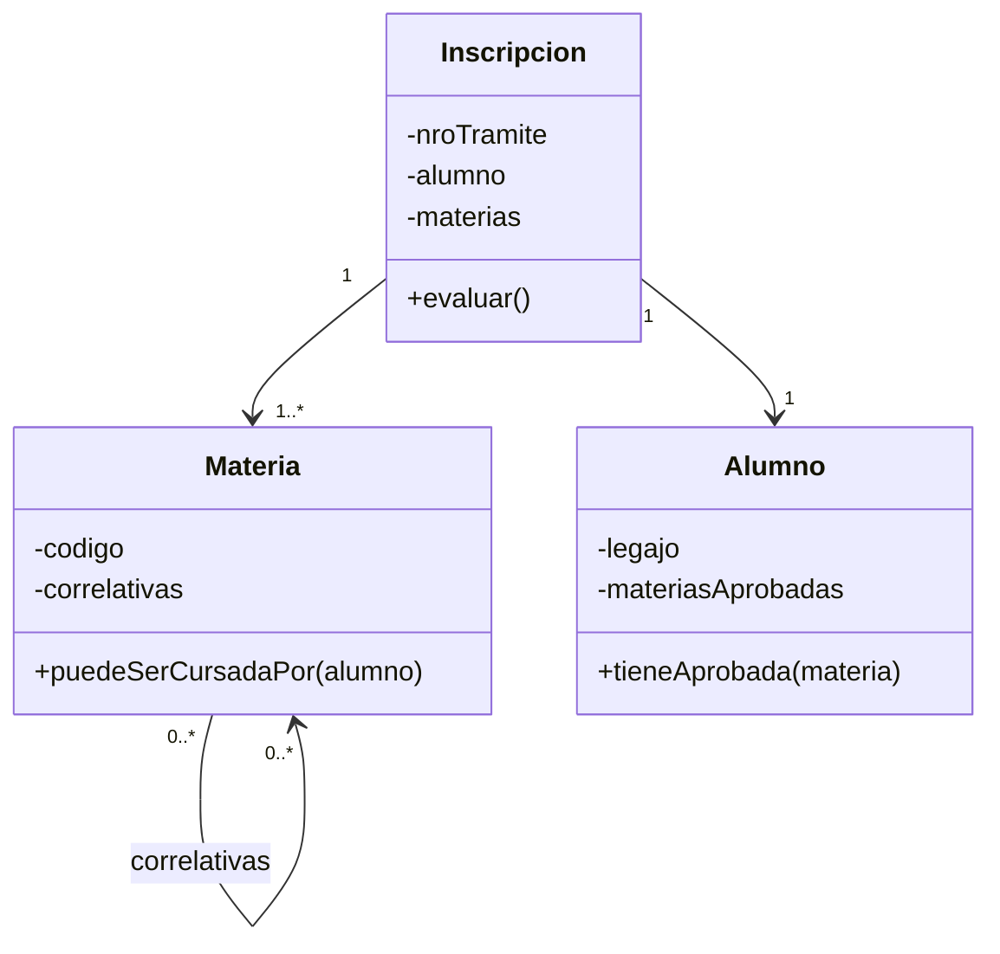
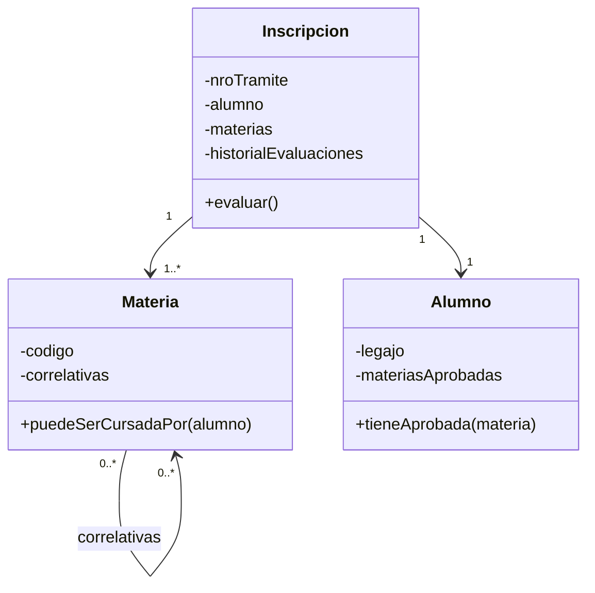
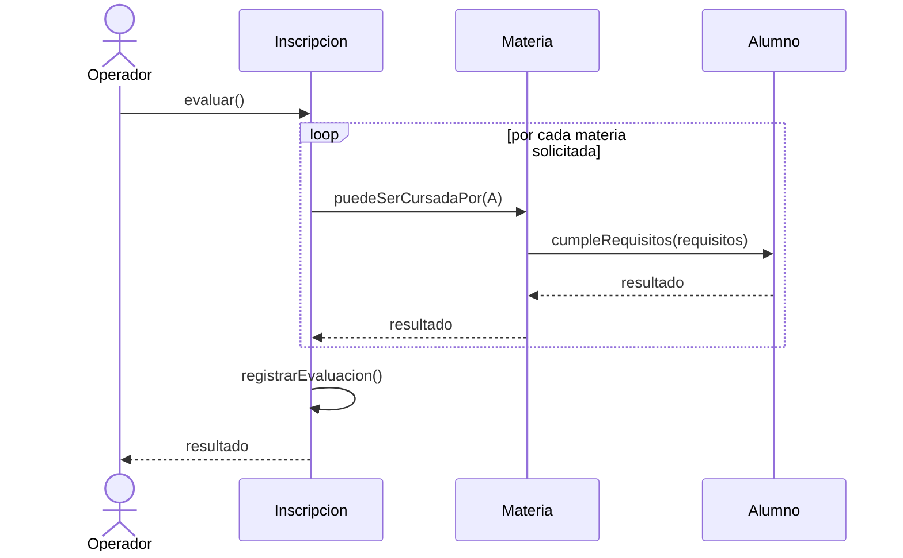
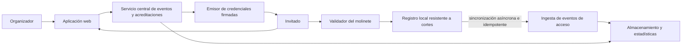

# DISEÑO DE SISTEMAS DE INFORMACIÓN

## Guía maestra de aprendizaje guiado

**De los objetos a la arquitectura, los datos, la integración y la observabilidad**

---

**Versión:** 1.0  
**Fecha de inicio:** 22 de agosto de 2026  
**Fecha de esta edición:** 24 de agosto de 2026  
**Base académica:** Material de Diseño de Sistemas de Información - UTN.BA  
**Propósito:** Aprendizaje profundo y aplicable; no orientado a la preparación de parciales o finales.
**Estado editorial:** Unidades 0–13 y apéndices complementarios A–B desarrollados y auditados.

---

> Diseñar es tomar decisiones sobre los componentes de un sistema, sus responsabilidades y la forma en que colaboran para satisfacer necesidades dentro de un contexto.

---

## Cómo utilizar esta guía

Esta guía está organizada para estudiarse en orden, desde los fundamentos técnicos y el diseño de objetos hasta la integración y la observabilidad. Las unidades troncales forman un recorrido progresivo; los apéndices amplían patrones que no pertenecen al núcleo oficial de la cursada.

Cada capítulo utiliza, cuando el tema lo requiere, la siguiente estructura:

1. Objetivos de aprendizaje.
2. Conocimientos previos necesarios.
3. Explicación conceptual.
4. Modelo mental del tema.
5. Ejemplos aplicados.
6. Errores y confusiones frecuentes.
7. Síntesis del capítulo.
8. Ejercicio práctico.
9. Criterios de corrección.
10. Instrucciones para la IA tutora.

El lector no necesita resolver ejercicios durante la explicación. El ejercicio aparece al final de cada capítulo y puede trabajarse con cualquier IA que actúe como profesora, mentora o revisora.

### Recorrido recomendado

1. Leer las unidades en el orden del índice; cada una reutiliza conceptos anteriores.
2. Detenerse en los modelos mentales y ejemplos antes de memorizar definiciones.
3. Resolver el ejercicio sólo después de comprender la explicación completa.
4. Utilizar los criterios de corrección para revisar una primera respuesta.
5. Pedir a una IA tutora que dé pistas y feedback sin revelar inmediatamente una solución completa.
6. Consultar los apéndices después de completar las unidades troncales o cuando un problema concreto requiera ampliar un patrón.

### Convenciones de lectura

- La **negrita** introduce conceptos y distinciones importantes.
- Los bloques de código muestran implementaciones, contratos o estructuras concretas.
- Los bloques de texto representan modelos mentales, flujos y relaciones simplificadas.
- Las secciones de errores frecuentes aclaran interpretaciones tentadoras pero incorrectas.
- Los trade-offs expresan costos aceptados; no deben leerse como defectos que toda solución pueda eliminar.

### Protocolo para la IA tutora

Cuando una IA reciba esta guía y acompañe a una persona en su estudio, debe:

1. Explicar el capítulo respetando el orden y las definiciones de la guía.
2. Resolver dudas antes de presentar el ejercicio.
3. Al terminar la explicación, indicar expresamente que corresponde resolver el ejercicio práctico.
4. No revelar la solución completa antes del primer intento del estudiante.
5. Revisar la respuesta utilizando los criterios de corrección incluidos.
6. Separar errores conceptuales, errores de diseño y errores de implementación.
7. Dar pistas progresivas cuando el estudiante se bloquee.
8. Explicar los trade-offs y reconocer soluciones alternativas válidas.
9. Solicitar una segunda versión cuando el ejercicio pueda mejorarse.
10. Cerrar el capítulo con feedback concreto: conocimientos dominados, puntos a reforzar y condiciones para avanzar.

---

## Material relevado para construir el índice

El índice se elaboró después de revisar:

- las carpetas temáticas numeradas del 1 al 13;
- la carpeta `Java` y su material de Git, Maven, Java y JUnit;
- la carpeta `PATRONES DE DISEÑO`;
- la carpeta `RESUMEN`, utilizada para detectar relaciones y temas dispersos sin tomarla como autoridad por encima de la bibliografía de la cátedra;
- la carpeta `Bibliografía` y el catálogo de patrones GoF;
- las clases complementarias 13, 14 y 15, junto con los textos y recursos disponibles;
- los documentos independientes sobre arquitectura, reificación de comportamiento y documentación arquitectónica;
- el contenido conceptual de `teoría.zip`.

Quedan excluidos del diseño curricular de la guía el TPA, los parciales y los bancos de finales resueltos. Podrán utilizarse en otro momento como fuentes de ejercicios, pero no para decidir el orden o el alcance conceptual.

---

# Índice general

## 0. Preparación Técnica

- 0.1. Herramientas y entorno de trabajo
- 0.2. Fundamentos de Git para el seguimiento de cambios
- 0.3. Creación y estructura de un proyecto Java
- 0.4. Maven y gestión de dependencias
- 0.5. Repaso de Java orientado a objetos
- 0.6. Introducción a JUnit 5
- 0.7. Estructura y ejecución de tests automatizados

## 1. Fundamentos del Diseño de Sistemas de Información

- 1.1. Qué significa diseñar
- 1.2. Sistema, sistema de información y software
- 1.3. Problemas, necesidades, requerimientos y requisitos
- 1.4. Requerimientos funcionales, no funcionales y restricciones
- 1.5. Introducción al paradigma orientado a objetos
- 1.6. Objeto: identidad, estado y comportamiento
- 1.7. Mensajes, métodos y responsabilidades
- 1.8. Encapsulamiento, delegación y declaratividad
- 1.9. Clases, instancias y abstracciones
- 1.10. Clases abstractas e interfaces
- 1.11. Polimorfismo
- 1.12. Colecciones y colaboraciones entre objetos
- 1.13. Identidad, igualdad e invariantes del dominio
- 1.14. Diagramas de clases UML
- 1.15. Asociación, agregación, composición, generalización, realización y dependencia
- 1.16. Multiplicidad, navegabilidad y ciclo de vida
- 1.17. Caso integrador: validador de inscripciones por correlatividades

## 2. Diseño de Objetos

- 2.1. Cualidades de diseño y atributos de calidad
- 2.2. Modelos ISO de calidad de software
- 2.3. Cohesión, acoplamiento, simplicidad y mantenibilidad
- 2.4. Flexibilidad, extensibilidad, robustez y testeabilidad
- 2.5. Abstracción, reusabilidad, consistencia y redundancia mínima
- 2.6. Tensiones y trade-offs entre cualidades
- 2.7. Patrones de diseño: propósito y clasificación
- 2.8. Testing unitario, dobles de prueba y mocking
- 2.9. Patrón State
- 2.10. Patrón Template Method
- 2.11. Patrón Strategy
- 2.12. Patrón Adapter
- 2.13. Patrón Facade
- 2.14. Factory Method y Simple Factory
- 2.15. Patrón Command
- 2.16. Reificación de comportamiento y ejecución diferida
- 2.17. Patrón Builder
- 2.18. Patrón Singleton y sus trade-offs
- 2.19. Diagramas de secuencia
- 2.20. Componentes stateless y stateful
- 2.21. Principios SOLID
- 2.22. Diseño frente al cambio: expansión y refactoring
- 2.23. Code smells y técnicas de refactorización
- 2.24. Entidades y value objects
- 2.25. Biblioteca y framework
- 2.26. Service Locator
- 2.27. Inversión de control e inyección de dependencias

## 3. Arquitectura de Software I

- 3.1. Qué es la arquitectura de software
- 3.2. Niveles de diseño y arquitectura
- 3.3. Drivers, requerimientos y restricciones arquitectónicas
- 3.4. Diferencia entre estilo, patrón arquitectónico y patrón de diseño
- 3.5. Clasificación de estilos arquitectónicos
- 3.6. Estilos de flujo de datos: Pipes & Filters y procesamiento batch
- 3.7. Estilos centrados en datos: Repositorio y Pizarra
- 3.8. Estilos de llamada y retorno
- 3.9. Componentes independientes y arquitectura orientada a eventos
- 3.10. Máquinas virtuales, intérpretes y sistemas basados en reglas
- 3.11. Arquitectura basada en máquinas de estado
- 3.12. Arquitectura en capas y arquitectura reloj de arena
- 3.13. Orquestación de casos de uso
- 3.14. Capa de dominio, aplicación e infraestructura
- 3.15. Controladores, servicios y repositorios
- 3.16. Patrón MVC
- 3.17. Patrón Repositorio
- 3.18. Diagramas de componentes y despliegue
- 3.19. Arquitectura cliente-servidor
- 3.20. Arquitectura Peer-to-Peer
- 3.21. Protocolo HTTP y arquitectura web
- 3.22. APIs y contratos de integración
- 3.23. Estilo arquitectónico REST
- 3.24. Recursos, verbos, representaciones y códigos de estado
- 3.25. DTO, validaciones y manejo de errores
- 3.26. Mock APIs y pruebas de integración tempranas
- 3.27. Interfaces entrantes y salientes
- 3.28. Comunicación sincrónica y asincrónica
- 3.29. Tareas programadas y ejecución periódica
- 3.30. Integración con sistemas externos

## 4. Caso de Estudio Arquitectónico

- 4.1. Método para analizar un problema arquitectónico
- 4.2. Identificación de drivers y restricciones
- 4.3. Escenarios de atributos de calidad
- 4.4. Alternativas arquitectónicas y trade-offs
- 4.5. Caso Sistema de Ingreso a Eventos
- 4.6. Comparación, justificación y defensa de una solución

## 5. Diseño de Datos

- 5.1. Qué significa persistir
- 5.2. Persistencia como decisión de diseño
- 5.3. Persistencia en memoria y medios volátiles
- 5.4. Persistencia en archivos: CSV, XML, JSON y ancho fijo
- 5.5. Serialización, prevalencia y persistencia ortogonal
- 5.6. Criterios para seleccionar un almacenamiento
- 5.7. Bases de datos relacionales, de objetos y no relacionales
- 5.8. Bases de datos clave-valor
- 5.9. Bases de datos orientadas a documentos
- 5.10. Bases de datos orientadas a grafos
- 5.11. Bases de datos orientadas a columnas
- 5.12. Bases de datos de series temporales
- 5.13. Persistencia políglota
- 5.14. Selección de bases de datos según patrones de acceso
- 5.15. Protección de datos y marco normativo
- 5.16. Datos personales, sensibles e inferidos
- 5.17. Consentimiento, minimización, retención y eliminación
- 5.18. Registro de eventos, auditoría y análisis forense

## 6. Seguridad de la Información

- 6.1. Seguridad como atributo del sistema
- 6.2. Confidencialidad, integridad y disponibilidad
- 6.3. Activos, amenazas, vulnerabilidades y riesgos
- 6.4. Principios de diseño y desarrollo seguro
- 6.5. Autenticación y gestión de identidad
- 6.6. Autorización y control de acceso
- 6.7. RBAC, ABAC y principio de mínimo privilegio
- 6.8. Credenciales, contraseñas y tokens
- 6.9. SSO e Identity Management
- 6.10. Protección perimetral y WAF
- 6.11. Modelado de amenazas y selección de controles
- 6.12. Riesgo residual y trade-offs de seguridad

## 7. Patrones de Mensajería

- 7.1. Solicitud-respuesta
- 7.2. Eventos y notificación de hechos
- 7.3. Patrón Observer
- 7.4. Suscripción de eventos
- 7.5. Patrón publicación-suscripción
- 7.6. Patrón Broker
- 7.7. Colas, tópicos y consumidores
- 7.8. Desacoplamiento espacial y temporal
- 7.9. Entrega, duplicados, orden e idempotencia
- 7.10. Reintentos, errores y dead-letter queues
- 7.11. Caso integrador: GarbariSi

## 8. Modelo Relacional y Mapeo Objeto-Relacional

- 8.1. Fundamentos del modelo relacional
- 8.2. Relaciones, tuplas, atributos y dominios
- 8.3. Claves candidatas, primarias, alternativas y foráneas
- 8.4. Integridad de entidad, referencial y de negocio
- 8.5. Diagrama de Entidad-Relación
- 8.6. Dependencias funcionales
- 8.7. Primera, segunda y tercera forma normal
- 8.8. Forma normal de Boyce-Codd
- 8.9. Normalización y desnormalización
- 8.10. Arquitectura de persistencia
- 8.11. Impedance mismatch
- 8.12. ORM, Data Mapper y Active Record
- 8.13. Entidades e identidad en JPA/Hibernate
- 8.14. Relaciones uno a uno, uno a muchos y muchos a muchos
- 8.15. Cascadas y eliminación de huérfanos
- 8.16. EntityManager, DAO y Repositorio
- 8.17. Hidratación y ciclo de vida de entidades
- 8.18. Lazy loading, eager loading y problema N+1
- 8.19. Colecciones, enums y converters
- 8.20. Embeddable, Embedded y MappedSuperclass
- 8.21. Estrategias de mapeo de herencia
- 8.22. Decisiones de consistencia y rendimiento
- 8.23. Caché de primer y segundo nivel
- 8.24. Transacciones y patrón Unit of Work
- 8.25. Identity Map e identidad dentro del contexto persistente

## 9. Sesiones y Cookies

- 9.1. Estado en aplicaciones web
- 9.2. HTTP stateless
- 9.3. Cookies: funcionamiento, alcance y duración
- 9.4. Atributos de seguridad de las cookies
- 9.5. Sesiones del lado servidor
- 9.6. Arquitecturas stateful y stateless
- 9.7. Autenticación, sesión e identidad
- 9.8. Escalabilidad y afinidad de sesión
- 9.9. Trade-offs de calidad vinculados al manejo de estado

## 10. Arquitectura de Software II

- 10.1. Recursos web y protección de recursos
- 10.2. Patrones arquitectónicos de interacción
- 10.3. Comparación entre MVC, MVP y MVVM
- 10.4. Clientes livianos y clientes pesados
- 10.5. SPA y renderizado del lado servidor
- 10.6. Escalabilidad vertical y horizontal
- 10.7. Balanceo de carga, sticky sessions y estado distribuido
- 10.8. Caché y CDN
- 10.9. Arquitecturas monolíticas y monolitos modulares
- 10.10. Arquitectura orientada a servicios
- 10.11. Registro de servicios y Enterprise Service Bus
- 10.12. Arquitectura de microservicios
- 10.13. Descomposición de sistemas y bounded contexts
- 10.14. Componentes de una arquitectura distribuida
- 10.15. API Gateway y Circuit Breaker
- 10.16. Patrón Strangler para migraciones progresivas
- 10.17. Aplicaciones on-premise y aplicaciones en la nube
- 10.18. IaaS, PaaS y SaaS
- 10.19. Criterios para seleccionar tecnologías
- 10.20. Costos, riesgos y complejidad operacional de la distribución

## 11. Decisiones y Documentación Arquitectónica

- 11.1. Diseño de una arquitectura inicial
- 11.2. Escalado de la capa web y la capa de datos
- 11.3. Caché, CDN y colas de mensajes como decisiones
- 11.4. Logging, métricas y automatización
- 11.5. Qué es una decisión arquitectónica
- 11.6. Interesados y necesidades de documentación
- 11.7. Vistas y estilos arquitectónicos
- 11.8. Vista de módulos
- 11.9. Vista de componentes y conectores
- 11.10. Vista de asignación y despliegue
- 11.11. Diagramas UML de componentes
- 11.12. Diagramas UML de despliegue
- 11.13. Registro de decisiones arquitectónicas
- 11.14. Alternativas, consecuencias, riesgos y supuestos

## 12. Documentación e Integración de Sistemas

- 12.1. Modelo de vistas 4+1
- 12.2. Clean Architecture y regla de dependencia
- 12.3. Necesidades y fuerzas de integración
- 12.4. Integración mediante base de datos compartida
- 12.5. Integración mediante APIs
- 12.6. RPC, REST, SOAP, gRPC y GraphQL
- 12.7. Integración mediante bus de servicios
- 12.8. Integración mediante colas y brokers
- 12.9. Introducción a Apache Kafka
- 12.10. Representación de datos e interoperabilidad
- 12.11. Contratos, versionado y compatibilidad
- 12.12. Comparación por disponibilidad, acoplamiento, escalabilidad y consistencia
- 12.13. Selección de una estrategia de integración
- 12.14. Documentación integral de una arquitectura

## 13. Observabilidad

- 13.1. Monitoreo, trazabilidad y observabilidad
- 13.2. Observabilidad en sistemas distribuidos y microservicios
- 13.3. Logs y logging estructurado
- 13.4. Métricas
- 13.5. Trazas distribuidas
- 13.6. Correlación y propagación de contexto
- 13.7. Alarmas y notificación
- 13.8. Bases de datos de series temporales
- 13.9. Indicadores, objetivos y niveles de servicio
- 13.10. Diseño de instrumentación observable
- 13.11. Diagnóstico de fallos mediante evidencias

## Apéndice A. Patrones Arquitectónicos Complementarios

Este apartado contiene patrones relevantes para el diseño de sistemas modernos que no aparecen desarrollados, o solo se mencionan brevemente, en el material principal de la cursada. Se estudiarán después de las unidades troncales y se distinguirán expresamente de los contenidos oficiales.

- A.1. Arquitectura Hexagonal: Ports and Adapters
- A.2. Onion Architecture
- A.3. Clean Architecture como familia de arquitecturas concéntricas
- A.4. Arquitectura orientada a eventos
- A.5. Event Sourcing
- A.6. CQRS
- A.7. Patrón Saga
- A.8. Transactional Outbox
- A.9. Backend for Frontend
- A.10. Service Discovery
- A.11. Bulkhead
- A.12. Retry, Timeout y Circuit Breaker coordinados
- A.13. Sidecar y Ambassador
- A.14. Database per Service
- A.15. Anti-Corruption Layer
- A.16. Modular Monolith
- A.17. Criterios para combinar y comparar patrones arquitectónicos

## Apéndice B. Catálogo GoF Complementario

La bibliografía incluye el catálogo completo de patrones de diseño de Gamma, Helm, Johnson y Vlissides. Estos patrones se incorporan como referencia complementaria para no confundir el recorrido principal de la cátedra con el catálogo completo.

- B.1. Abstract Factory
- B.2. Prototype
- B.3. Composite
- B.4. Decorator
- B.5. Proxy
- B.6. Bridge
- B.7. Flyweight
- B.8. Chain of Responsibility
- B.9. Iterator
- B.10. Mediator
- B.11. Memento
- B.12. Visitor

---

# Nota editorial: registro de elaboración

| Capítulo | Estado | Revisión |
|---|---|---|
| Índice general | Creado y auditado contra el material disponible | 22/08/2026 |
| Unidad 0 | Desarrollada; acreditada para el acompañamiento en este chat | 22/08/2026 |
| 1.1. Qué significa diseñar | Explicación revisada y aprobada | 22/08/2026 |
| 1.2. Sistema, sistema de información y software | Explicación revisada y aprobada | 22/08/2026 |
| Unidad 1 | Desarrollo completo incorporado; 1.1 y 1.2 aprobados individualmente y 1.3–1.17 autorizados en conjunto | 22/08/2026 |
| Unidades 2 a 4 | Desarrollo completo incorporado | 22/08/2026 |
| Unidades 5 a 8 | Desarrollo completo incorporado | 22/08/2026 |
| Unidades 9 a 13 | Desarrollo completo incorporado | 22/08/2026 |
| Apéndices A y B | Alcance complementario definido e incorporado al índice | 22/08/2026 |
| Guía completa | 250 títulos del índice contrastados: sin faltantes, extras ni duplicados | 22/08/2026 |
| Revisión de profundidad | Unidades 2–13 ampliadas con desarrollos conceptuales, ejemplos, comparaciones y casos integradores | 22/08/2026 |
| 2.1. Cualidades de diseño y atributos de calidad | Explicación revisada, aprobada e incorporada con ejercicio y tutoría | 22/08/2026 |
| 2.2. Modelos ISO de calidad de software | Explicación revisada, aprobada e incorporada con ejercicio, versiones y fuentes oficiales | 22/08/2026 |
| Unidad 2 | Capítulos 2.1–2.27 desarrollados en profundidad; 2.3–2.27 quedan disponibles para revisión del estudiante | 22/08/2026 |
| Patrones de diseño 2.9–2.18 | Incorporados ejemplos Java que contrastan la problemática con una implementación de la solución | 22/08/2026 |
| Redacción de la Unidad 2 | Capítulos 2.3–2.27 uniformados con apertura pedagógica, progresión, ejemplos, errores, modelo mental, síntesis, práctica y tutoría | 24/08/2026 |
| Redacción de la Unidad 3 | Capítulos 3.1–3.30 desarrollados y uniformados; fichas reemplazadas por explicación, ejemplos, trade-offs, práctica y tutoría | 24/08/2026 |
| Redacción de la Unidad 4 | Capítulos 4.1–4.6 desarrollados y uniformados; método general, escenarios, alternativas y caso arquitectónico articulados con decisiones, riesgos y evidencia | 24/08/2026 |
| Redacción de la Unidad 5 | Capítulos 5.1–5.18 desarrollados y uniformados; persistencia, modelos de datos, selección por accesos, protección, retención y auditoría integrados en un recorrido progresivo | 24/08/2026 |
| Redacción de la Unidad 6 | Capítulos 6.1–6.12 desarrollados y uniformados; objetivos, riesgos, identidad, acceso, controles, modelado de amenazas y riesgo residual articulados | 24/08/2026 |
| Redacción de la Unidad 7 | Capítulos 7.1–7.11 desarrollados y uniformados; semántica de mensajes, pub/sub, broker, garantías de entrega y recuperación integrados | 24/08/2026 |
| Redacción de la Unidad 8 | Capítulos 8.1–8.25 desarrollados y uniformados; modelo relacional, normalización, ORM, identidad, carga, caché y transacciones articulados | 24/08/2026 |
| Redacción de la Unidad 9 | Capítulos 9.1–9.9 desarrollados y uniformados; estado web, cookies, sesiones, identidad, seguridad, escalabilidad y trade-offs articulados | 24/08/2026 |
| Redacción de la Unidad 10 | Capítulos 10.1–10.20 desarrollados y uniformados; interacción, escalabilidad, SOA, microservicios, nube, migración y complejidad operacional articulados | 24/08/2026 |
| Redacción de la Unidad 11 | Capítulos 11.1–11.14 desarrollados y uniformados; decisiones, interesados, vistas, UML, despliegue y ADR articulados | 24/08/2026 |
| Redacción de la Unidad 12 | Capítulos 12.1–12.14 desarrollados y uniformados; vistas, Clean Architecture, contratos y estrategias de integración articulados | 24/08/2026 |
| Redacción de la Unidad 13 | Capítulos 13.1–13.11 desarrollados y uniformados; monitoreo, logs, métricas, trazas, SLO, alertas y diagnóstico articulados | 24/08/2026 |
| Formato editorial del Markdown | Portada actualizada, recorrido de lectura, convenciones, índice legible, estructura principal y registro editorial organizados como libro | 24/08/2026 |
| Auditoría integral | 250 entradas del índice coinciden exactamente con 250 capítulos únicos; bloques Markdown balanceados y enlaces locales válidos | 24/08/2026 |
| Redacción del Apéndice A | 17 patrones arquitectónicos complementarios desarrollados con problema, estructura, implementación, trade-offs, práctica y tutoría | 24/08/2026 |
| Redacción del Apéndice B | 12 patrones GoF complementarios desarrollados con problemática, código Java, consecuencias, práctica y tutoría | 24/08/2026 |

---

# Parte principal

La guía completa fue desarrollada por autorización del estudiante. Las futuras observaciones se incorporarán como revisiones de claridad, profundidad o enfoque sin alterar silenciosamente el alcance acordado.

## Unidad 0. Preparación Técnica

**Estado:** Desarrollada en la guía y acreditada para el acompañamiento en este chat.

Esta unidad construye el piso técnico necesario para trabajar con los ejemplos del resto de la guía. No pretende enseñar todo Git, Maven, Java o JUnit: selecciona las herramientas y conceptos que permiten expresar, probar y hacer evolucionar decisiones de diseño.

### 0.1. Herramientas y entorno de trabajo

#### Objetivos de aprendizaje

Al finalizar este capítulo, el lector podrá reconocer las piezas de un entorno Java, distinguir sus funciones y comprobar que el proyecto puede compilarse y probarse de manera reproducible.

#### Conocimientos previos

Uso básico de archivos, carpetas y una terminal.

#### Explicación conceptual

Un entorno de desarrollo no es solamente un editor. Es el conjunto de herramientas que permite transformar código fuente en un programa ejecutable y verificar su comportamiento. Para esta guía se necesitan cinco piezas:

1. **JDK:** incluye el compilador de Java, la máquina virtual y utilidades de desarrollo. El JRE permite ejecutar; el JDK, además, permite desarrollar.
2. **IDE o editor:** facilita la navegación, escritura, refactorización y ejecución. IntelliJ IDEA, Eclipse y Visual Studio Code son alternativas posibles.
3. **Maven:** describe el proyecto, descarga dependencias y estandariza la compilación y las pruebas.
4. **Git:** conserva la historia de cambios y permite trabajar de forma segura sobre distintas líneas de evolución.
5. **Terminal:** ofrece una forma directa y reproducible de ejecutar las herramientas, independientemente de la interfaz del IDE.

El principio rector es la **reproducibilidad**: otra persona debería poder clonar el repositorio, ejecutar un comando documentado y obtener el mismo resultado. Si el proyecto solo funciona debido a configuraciones ocultas del IDE, el entorno es frágil.

Las comprobaciones mínimas son:

```text
java -version
javac -version
mvn -version
git --version
```

No es necesario memorizar cada salida. Hay que verificar que los comandos existen, que Maven utiliza un JDK compatible y que no hay versiones contradictorias configuradas en la terminal y el IDE.

#### Modelo mental

```text
Código fuente -> JDK/Maven -> clases compiladas -> JVM
                     |
                     +-> pruebas y reporte de resultados
Git -> historia versionada de código, configuración y documentación
```

#### Errores frecuentes

- Instalar únicamente un JRE y esperar que Maven pueda compilar.
- Depender de librerías agregadas manualmente al IDE sin declararlas en Maven.
- Versionar archivos generados, credenciales o configuraciones personales.
- Confundir un problema del código con una configuración distinta entre terminal e IDE.

#### Síntesis

El entorno es parte de la capacidad del equipo para producir software de forma consistente. Un proyecto sano declara sus dependencias, automatiza su construcción y evita configuraciones implícitas.

#### Ejercicio práctico

Preparar un diagnóstico del entorno que incluya las versiones de Java, Maven y Git; crear una carpeta de trabajo; y explicar qué responsabilidad cumple cada herramienta. No se requiere desarrollar funcionalidad.

#### Criterios de corrección e instrucciones para la IA tutora

La respuesta debe diferenciar JDK, JVM, Maven, Git e IDE, y reconocer la importancia de la reproducibilidad. La IA debe corregir confusiones entre compilación y ejecución y ayudar a interpretar incompatibilidades de versiones sin exigir una marca específica de IDE.

---

### 0.2. Fundamentos de Git para el seguimiento de cambios

#### Objetivos de aprendizaje

Comprender el modelo básico de Git, registrar cambios coherentes y trabajar sin confundir el repositorio local con uno remoto.

#### Explicación conceptual

Git es un sistema de control de versiones distribuido. Registra instantáneas relacionadas por una historia, en lugar de limitarse a guardar “copias finales” de una carpeta. Sus cuatro zonas principales son:

```text
Directorio de trabajo -> área de preparación -> repositorio local -> repositorio remoto
        git add             git commit              git push
```

El **directorio de trabajo** contiene los archivos que se están modificando. El **área de preparación** o staging permite elegir qué cambios integrarán el próximo commit. El **repositorio local** conserva los commits. El **remoto** facilita compartirlos, pero Git puede funcionar localmente sin él.

Un commit debería representar una modificación pequeña, coherente y explicable. Su mensaje tiene que expresar la intención: `agrega validación de correlatividades` comunica mejor que `cambios`.

Las ramas son referencias móviles a commits. Permiten desarrollar una idea sin alterar inmediatamente la línea principal. Integrar una rama significa combinar historias; un conflicto ocurre cuando Git no puede decidir por sí mismo qué versión conservar. Resolverlo exige comprender el contenido, no seleccionar mecánicamente “la versión propia” o “la versión entrante”.

El archivo `.gitignore` evita incorporar archivos derivados o locales, como `target/`, configuraciones del IDE y secretos. No elimina archivos que ya fueron versionados.

#### Comandos esenciales

```text
git status              observa el estado actual
git diff                muestra cambios no preparados
git add <archivo>       prepara cambios seleccionados
git commit -m "..."    crea un punto de la historia
git log --oneline       recorre la historia resumida
git switch -c <rama>    crea y cambia de rama
git pull                obtiene e integra cambios remotos
git push                publica commits locales
```

#### Errores frecuentes

- Usar `git add .` sin revisar qué se incorporará.
- Crear commits gigantes con cambios sin relación.
- Versionar `target/`, contraseñas o claves privadas.
- Pensar que `commit` publica automáticamente en Internet.
- Resolver conflictos sin ejecutar nuevamente las pruebas.

#### Síntesis

Git permite experimentar y conservar decisiones con trazabilidad. Su valor aumenta cuando los commits son pequeños, deliberados y verificables.

#### Ejercicio práctico

Crear un repositorio local con un `README.md` y un `.gitignore`, realizar dos commits con propósitos diferentes, abrir una rama para una modificación y explicar el estado del proyecto antes y después de integrarla.

#### Criterios de corrección e instrucciones para la IA tutora

La solución debe mostrar una historia comprensible, excluir artefactos generados y distinguir commit de push. La IA debe pedir primero la salida de `git status` y `git log --oneline`, dar pistas progresivas ante conflictos y evitar sugerir comandos destructivos como primera opción.

---

### 0.3. Creación y estructura de un proyecto Java

#### Objetivos de aprendizaje

Reconocer la estructura convencional de un proyecto Java con Maven y ubicar correctamente código de producción, pruebas y recursos.

#### Explicación conceptual

Maven adopta una estructura convencional para que las herramientas comprendan el proyecto sin configuraciones particulares:

```text
proyecto/
|-- pom.xml
`-- src/
    |-- main/
    |   |-- java/        código de producción
    |   `-- resources/   configuración y recursos
    `-- test/
        |-- java/        código de pruebas
        `-- resources/   datos exclusivos de pruebas
```

Los paquetes Java organizan tipos y evitan colisiones de nombres. Deben reflejar agrupaciones conceptuales estables, no una división arbitraria de archivos. La ruta física suele corresponder al paquete: la clase `edu.utn.inscripciones.Alumno` se ubica bajo `edu/utn/inscripciones/Alumno.java`.

`src/main` contiene aquello que forma parte de la aplicación. `src/test` contiene pruebas y colaboradores que solo existen para verificarlas. `target` es generado por Maven y puede reconstruirse; por eso no se versiona.

El punto de entrada tradicional es un método `public static void main(String[] args)`, pero muchos proyectos de dominio no lo necesitan al comienzo: sus objetos pueden desarrollarse y comprobarse mediante tests.

#### Ejemplo mínimo

```java
package edu.utn.inscripciones;

public class Alumno {
    private final String legajo;

    public Alumno(String legajo) {
        this.legajo = legajo;
    }

    public String legajo() {
        return legajo;
    }
}
```

La declaración del paquete, el nombre del archivo y la ubicación deben ser coherentes. Una clase pública por archivo es la convención habitual.

#### Errores frecuentes

- Colocar tests dentro de `src/main/java`.
- Versionar `target`.
- Usar el paquete por defecto.
- Organizar paquetes únicamente por tipos técnicos (`clases`, `interfaces`) y perder el lenguaje del dominio.
- Mezclar varios proyectos independientes en un solo `pom.xml` accidentalmente.

#### Ejercicio práctico

Crear el esqueleto de un proyecto llamado `inscripciones`, agregar una clase `Alumno` en producción y una clase de prueba correspondiente. Dibujar el árbol de carpetas y justificar qué elementos se versionan.

#### Criterios de corrección e instrucciones para la IA tutora

La estructura debe respetar las convenciones de Maven y mantener separados producción y test. La IA debe revisar paquetes, nombres y archivos versionables antes de discutir el comportamiento de la clase.

---

### 0.4. Maven y gestión de dependencias

#### Objetivos de aprendizaje

Interpretar un `pom.xml`, declarar dependencias y utilizar el ciclo de vida básico de Maven.

#### Explicación conceptual

Maven es una herramienta de construcción y gestión de proyectos. El archivo `pom.xml` describe la identidad del artefacto, sus dependencias, la versión de Java y los plugins necesarios.

Las coordenadas principales son:

- `groupId`: organización o espacio lógico al que pertenece el proyecto.
- `artifactId`: nombre del artefacto.
- `version`: versión producida.

Una dependencia declarada no necesita copiarse manualmente dentro del proyecto. Maven la obtiene de un repositorio y también resuelve sus dependencias transitivas. El **scope** indica dónde se necesita: por ejemplo, una dependencia de JUnit con scope `test` no forma parte del artefacto productivo.

Ejemplo reducido:

```xml
<project xmlns="http://maven.apache.org/POM/4.0.0">
  <modelVersion>4.0.0</modelVersion>
  <groupId>edu.utn</groupId>
  <artifactId>inscripciones</artifactId>
  <version>1.0-SNAPSHOT</version>

  <properties>
    <maven.compiler.release>17</maven.compiler.release>
  </properties>

  <dependencies>
    <dependency>
      <groupId>org.junit.jupiter</groupId>
      <artifactId>junit-jupiter</artifactId>
      <version>5.11.0</version>
      <scope>test</scope>
    </dependency>
  </dependencies>
</project>
```

Maven organiza tareas en fases. Las más utilizadas son:

```text
validate -> compile -> test -> package -> verify -> install
```

Ejecutar una fase también ejecuta las anteriores necesarias. `mvn test` compila producción y pruebas antes de ejecutarlas; `mvn package` produce el artefacto solo si las fases previas tienen éxito. `mvn clean` elimina resultados generados de construcciones anteriores.

#### Errores frecuentes

- Agregar archivos JAR manualmente al IDE y no declararlos en el POM.
- Confundir dependencias con plugins de construcción.
- Usar versiones diferentes de Java en Maven y el IDE.
- Ejecutar siempre `clean` sin entender que invalida resultados reutilizables.
- Ignorar una prueba fallida porque “la compilación funcionó”.

#### Ejercicio práctico

Completar un `pom.xml` para Java y JUnit, ejecutar `mvn test` y `mvn package`, identificar el artefacto generado y explicar por qué JUnit no debería incluirse como dependencia productiva.

#### Criterios de corrección e instrucciones para la IA tutora

La solución debe declarar correctamente coordenadas, versión de Java y scope de test. La IA debe diferenciar fases, goals, dependencias y plugins, y solicitar la primera causa del error mostrada por Maven antes de proponer cambios.

---

### 0.5. Repaso de Java orientado a objetos

#### Objetivos de aprendizaje

Modelar objetos simples con identidad, estado y comportamiento, proteger invariantes y utilizar composición y polimorfismo de forma básica.

#### Explicación conceptual

Un objeto combina **identidad**, **estado** y **comportamiento**. Su estado se almacena en atributos; sus métodos reciben mensajes y producen cambios o respuestas. La orientación a objetos no consiste en trasladar estructuras de datos a clases vacías: busca que los objetos sean responsables de comportamientos relacionados con la información que conocen.

```java
public class Cuenta {
    private BigDecimal saldo;

    public Cuenta(BigDecimal saldoInicial) {
        if (saldoInicial.signum() < 0) {
            throw new IllegalArgumentException("El saldo inicial no puede ser negativo");
        }
        this.saldo = saldoInicial;
    }

    public void debitar(BigDecimal importe) {
        if (importe.signum() <= 0 || saldo.compareTo(importe) < 0) {
            throw new IllegalArgumentException("Débito inválido");
        }
        saldo = saldo.subtract(importe);
    }
}
```

La clase protege una **invariante**: no admite un saldo negativo. No expone el atributo para que cualquier consumidor lo modifique sin reglas. Esto es encapsulamiento: preservar decisiones y consistencia detrás de una interfaz, no simplemente declarar atributos `private` y generar getters y setters para todos.

Conceptos esenciales:

- **Constructor:** crea una instancia válida o rechaza su creación.
- **Referencia:** variable que permite acceder a un objeto; varias referencias pueden señalar la misma instancia.
- **Composición:** un objeto colabora con otros para cumplir su responsabilidad.
- **Herencia:** relación de especialización; debe expresar sustituibilidad, no reutilización accidental.
- **Interfaz:** contrato de comportamiento que distintas implementaciones pueden satisfacer.
- **Polimorfismo:** envío del mismo mensaje a objetos que responden de maneras distintas.
- **Colecciones:** agrupan referencias; su mutabilidad y exposición deben decidirse conscientemente.

La igualdad también es una decisión. `==` compara referencias; `equals` puede representar igualdad lógica. Si se redefine `equals`, debe mantenerse coherente con `hashCode`, especialmente al utilizar conjuntos o mapas.

#### Referencias, aliasing y copias defensivas

```java
this.materias = List.copyOf(materias);
```

Una lista mutable recibida por parámetro podría ser modificada luego por quien la creó. `List.copyOf` genera una colección no modificable y rompe esa dependencia con la estructura externa. No clona profundamente cada objeto de la lista: copia las referencias. Por eso protege la estructura de la colección, pero no vuelve inmutables sus elementos.

#### Errores frecuentes

- Crear modelos anémicos con setters públicos para todo.
- Usar herencia solo para reutilizar código.
- Comparar objetos de dominio con `==` cuando se busca igualdad lógica.
- Exponer directamente una colección mutable interna.
- Permitir que el constructor produzca objetos inválidos.
- Escribir una clase “Dios” que concentra responsabilidades no relacionadas.

#### Ejercicio práctico

Modelar `Alumno`, `Materia` e `Inscripcion`. Definir sus identidades, asegurar que una inscripción tenga al menos una materia sin duplicados y decidir qué colecciones deben copiarse o exponerse como inmutables. No se exige resolver todavía todas las correlatividades.

#### Criterios de corrección e instrucciones para la IA tutora

La propuesta debe ubicar invariantes cerca de los datos necesarios para protegerlas, evitar setters indiscriminados y explicar identidad e igualdad. La IA debe aceptar alternativas justificadas, señalar aliasing y distinguir copia de colección de copia profunda.

---

### 0.6. Introducción a JUnit 5

#### Objetivos de aprendizaje

Escribir pruebas unitarias legibles con JUnit 5 y comprender qué demuestra cada aserción.

#### Explicación conceptual

Una prueba automatizada prepara un escenario, ejecuta un comportamiento y verifica un resultado. La estructura puede recordarse como **Arrange, Act, Assert**:

```java
@Test
void rechazaUnaInscripcionSinMaterias() {
    // Arrange
    Alumno alumno = new Alumno("2099999");

    // Act + Assert
    assertThrows(
        IllegalArgumentException.class,
        () -> new Inscripcion("TR-1", alumno, List.of())
    );
}
```

`@Test` identifica un caso. Las aserciones expresan las consecuencias observables esperadas:

- `assertEquals` compara valores esperados y obtenidos.
- `assertTrue` y `assertFalse` verifican condiciones.
- `assertThrows` verifica que una operación rechace una situación inválida.
- `assertAll` agrupa comprobaciones que deben evaluarse en conjunto.

Una prueba debe tener un motivo claro para fallar. El nombre puede describir el comportamiento y el escenario, por ejemplo `aceptaInscripcionCuandoCumpleTodasLasCorrelatividades`. Es preferible comprobar la API pública y los resultados relevantes antes que detalles internos, porque estos últimos vuelven frágil la prueba ante una refactorización correcta.

Las pruebas unitarias deben ser rápidas, aisladas, repetibles y deterministas. No deberían depender de la hora real, Internet, el orden de ejecución ni datos dejados por otra prueba. Cuando existe preparación compartida y estable puede utilizarse `@BeforeEach`, pero ocultar demasiado escenario allí perjudica la lectura.

#### Errores frecuentes

- Escribir una sola prueba con muchos comportamientos independientes.
- Usar nombres como `test1` que no explican el escenario.
- Verificar getters sin comprobar reglas significativas.
- Atrapar manualmente una excepción y olvidar hacer fallar el test si no ocurre.
- Depender del orden de ejecución.
- modificar producción para satisfacer un caso sin comprender la regla.

#### Ejercicio práctico

Escribir pruebas para una inscripción válida, una inscripción sin materias y otra con materias repetidas. Cada test debe identificar escenario, acción y resultado, y ejecutarse mediante Maven.

#### Criterios de corrección e instrucciones para la IA tutora

Las pruebas deben ser independientes, tener nombres descriptivos y verificar conducta observable. La IA debe separar fallos de compilación, fallos de preparación y aserciones incorrectas; no debe entregar inmediatamente la implementación productiva completa.

---

### 0.7. Estructura y ejecución de tests automatizados

#### Objetivos de aprendizaje

Organizar una suite de pruebas, interpretar sus resultados y utilizarla como red de seguridad para modificar el diseño.

#### Explicación conceptual

Una suite no mejora por tener más tests, sino por cubrir comportamientos relevantes con señales claras. Conviene pensar en cuatro familias de casos:

1. **Camino feliz:** la operación válida produce el resultado esperado.
2. **Límites:** valores vacíos, mínimos, máximos o transiciones importantes.
3. **Rechazos:** entradas inválidas y reglas incumplidas.
4. **Regresiones:** un caso que falló en el pasado queda documentado para impedir que reaparezca.

Los tests de una clase suelen ubicarse en una estructura de paquetes paralela a producción. Los nombres y escenarios deben permitir encontrar rápidamente la regla que falló.

```text
src/main/java/edu/utn/inscripciones/Inscripcion.java
src/test/java/edu/utn/inscripciones/InscripcionTest.java
```

`mvn test` compila y ejecuta la suite. Si falla, el diagnóstico debe comenzar por el primer error significativo: una falla de compilación impide evaluar los tests; una excepción inesperada puede indicar una mala preparación; una aserción muestra una diferencia entre conducta esperada y obtenida.

Una prueba de regresión se escribe reproduciendo primero el defecto. Debe verse fallar por la razón correcta; luego se modifica producción hasta que pase. Este ciclo evita tests que siempre fueron verdes y nunca comprobaron realmente el problema.

La cobertura de código es una medida auxiliar: indica qué código se ejecutó, no si se verificó correctamente. Un porcentaje alto puede coexistir con aserciones débiles. La prioridad es cubrir reglas, decisiones, bordes y riesgos.

Los tests también influyen en el diseño. Si una unidad es muy difícil de aislar, quizá concentra demasiadas responsabilidades o depende directamente de infraestructura. La testeabilidad aporta información, aunque no justifica deformar el modelo solo para facilitar una herramienta.

#### Flujo de trabajo recomendado

```text
Comprender la regla -> preparar escenario -> observar el fallo esperado
-> implementar o refactorizar -> ejecutar la suite completa -> registrar el cambio
```

#### Errores frecuentes

- Ejecutar únicamente el test nuevo y no comprobar regresiones.
- Perseguir cobertura porcentual sin aserciones relevantes.
- Compartir estado mutable entre pruebas.
- Convertir tests unitarios en integraciones lentas sin intención.
- Corregir el test automáticamente cada vez que falla, aun cuando detectó un defecto real.

#### Ejercicio integrador de la Unidad 0

Crear un proyecto Maven versionado con Git que modele una inscripción simple. Debe incluir:

- estructura convencional de producción y pruebas;
- identidades para alumno, materia e inscripción;
- validación de lista no vacía y sin duplicados;
- copias defensivas de colecciones recibidas;
- tests del camino feliz, límites y rechazos;
- commits separados para estructura, modelo y pruebas;
- un `README.md` con los comandos necesarios para ejecutar la suite.

#### Criterios de corrección e instrucciones para la IA tutora

La IA debe revisar en este orden: reproducibilidad del proyecto, estructura, compilación, independencia de tests, invariantes, diseño de objetos e historia de Git. Debe distinguir errores técnicos de decisiones de diseño y pedir una segunda versión si la suite no prueba que las colecciones internas estén protegidas frente a modificaciones externas.

#### Cierre de la unidad

La Unidad 0 queda dominada cuando el lector puede construir, versionar y probar un pequeño modelo Java sin depender de configuraciones ocultas. Estas herramientas no reemplazan el diseño: hacen posible expresarlo, comprobarlo y modificarlo con seguridad.

---

## Unidad 1. Fundamentos del Diseño de Sistemas de Información

### 1.1. Qué significa diseñar

#### Objetivos de aprendizaje

Al finalizar este capítulo, el lector podrá:

- distinguir necesidad, requerimiento, diseño e implementación;
- reconocer el diseño como un proceso de toma de decisiones;
- identificar componentes, responsabilidades y colaboraciones;
- comparar alternativas utilizando contexto, restricciones y trade-offs;
- diferenciar un diseño de sus representaciones y de su código.

#### Conocimientos previos

Conceptos básicos de programación orientada a objetos y lectura elemental de código Java. La Unidad 0 contiene el repaso técnico necesario.

#### Explicación conceptual

**Diseñar es tomar decisiones sobre la solución que vamos a construir.**

Cuando recibimos un requerimiento, este indica qué necesita el usuario o qué comportamiento debe ofrecer el sistema. Sin embargo, normalmente no determina cómo debe organizarse internamente la solución. Ese “cómo” es el terreno del diseño.

Podemos ordenar conceptualmente el trabajo así:

```text
Necesidad -> Requerimientos -> Diseño -> Implementación
```

Cada nivel responde una pregunta diferente:

- **Necesidad:** ¿qué problema queremos resolver?
- **Requerimientos:** ¿qué debe hacer el sistema?
- **Diseño:** ¿cómo organizamos la solución?
- **Implementación:** ¿cómo expresamos esa solución mediante código y tecnología?

En la práctica no siempre se avanza de manera completamente lineal. Una decisión de diseño puede revelar una ambigüedad del requerimiento, y una dificultad técnica puede obligarnos a reconsiderar la solución. Aun así, distinguir los niveles evita confundir el problema con una implementación particular.

#### Las cuatro decisiones fundamentales

Diseñar un sistema generalmente implica decidir cuatro cosas.

##### 1. Qué componentes existen

Debemos identificar las piezas que forman la solución. En un sistema de inscripción podrían aparecer conceptos como `Alumno`, `Materia` e `Inscripcion`. Encontrar sustantivos sirve como punto de partida, pero no alcanza: no todo sustantivo debe transformarse automáticamente en una clase.

##### 2. Qué responsabilidad tiene cada componente

Una responsabilidad expresa qué sabe o qué hace un componente. Por ejemplo:

```text
Alumno
- Conoce su legajo y su situación académica.
- Responde si tiene aprobada o regularizada una materia.

Materia
- Conoce su código y sus correlatividades.
- Determina si un alumno satisface sus requisitos.

Inscripcion
- Conoce al alumno y las materias solicitadas.
- Coordina la evaluación de la solicitud.
- Determina y registra el resultado general.
```

La distribución de responsabilidades es una de las decisiones centrales del diseño orientado a objetos.

##### 3. Cómo colaboran los componentes

Los componentes necesitan enviarse mensajes para resolver el problema. En el ejemplo:

```text
Inscripcion -> Materia -> Alumno
```

1. `Inscripcion` solicita a cada `Materia` que evalúe al alumno.
2. `Materia` consulta al `Alumno` por su situación académica.
3. `Alumno` responde utilizando la información que conoce.
4. `Materia` determina si sus correlatividades están satisfechas.
5. `Inscripcion` combina los resultados y decide sobre la solicitud completa.

Que `Inscripcion` posea las materias solicitadas no significa que deba conocer la representación interna de todas sus reglas. La inscripción coordina; cada materia aporta el conocimiento específico de sus requisitos.

Una representación deliberadamente simple del modelo es:

```text
Inscripcion
- nroTramite
- alumno
- materias solicitadas
- estado

Materia
- codigo
- correlativas aprobadas requeridas
- correlativas regularizadas requeridas

Alumno
- legajo
- materias aprobadas
- materias regularizadas
```

Las relaciones principales son:

```text
Una Inscripcion corresponde exactamente a un Alumno.
Una Inscripcion contiene una o más Materias sin repetir.
Una Materia puede requerir otras Materias como correlativas.
Un Alumno puede tener cero o más Materias aprobadas o regularizadas.
```

##### 4. Por qué elegimos esa solución

Una decisión debe poder justificarse. Por ejemplo:

> `Materia` conoce sus correlatividades porque son requisitos propios de la materia, existen independientemente de una inscripción particular y pueden variar entre materias.

Podríamos colocar toda la lógica en `Inscripcion`, pero entonces tendría que conocer cómo se representa y evalúa cada tipo de requisito. Si aparecieran créditos mínimos, autorizaciones especiales o cantidades de materias aprobadas, la inscripción tendría que modificarse para interpretar reglas ajenas a su propósito.

La solución seleccionada no es la única posible. Es una alternativa cuyas consecuencias pueden analizarse.

#### Diseñar no es dibujar diagramas

Un diagrama puede representar clases y relaciones, pero no explica necesariamente:

- por qué existe cada relación;
- quién inicia una colaboración;
- qué invariantes protege cada objeto;
- qué alternativas fueron descartadas;
- qué consecuencias produce la solución;
- cómo responderá el sistema ante futuros cambios.

Un diagrama UML puede estar correctamente dibujado y representar, aun así, una mala distribución de responsabilidades. El diagrama comunica una parte del diseño; no es el diseño completo.

#### Diseñar no es simplemente programar

Consideremos esta implementación:

```java
public boolean evaluar() {
    return materias.stream()
        .allMatch(materia -> materia.puedeCursarla(alumno));
}
```

La utilización de Java, `Stream` y `allMatch` pertenece al nivel de implementación. Detrás existen decisiones de diseño más estables:

- la inscripción coordina la evaluación general;
- todas las materias solicitadas deben aceptar al alumno;
- cada materia conoce sus requisitos;
- el alumno conoce su situación académica.

Podríamos sustituir el `Stream` por un ciclo y conservar el mismo diseño:

```java
public boolean evaluar() {
    for (Materia materia : materias) {
        if (!materia.puedeCursarla(alumno)) {
            return false;
        }
    }
    return true;
}
```

Cambió la implementación, pero no la distribución de responsabilidades.

#### Diseñar es elegir entre alternativas

La evaluación de correlatividades podría ubicarse en distintos lugares.

**Alternativa A: decide `Alumno`.** El alumno conoce su situación académica, pero tendría que conocer también las reglas internas de cada materia.

**Alternativa B: decide `Materia`.** Cada materia conoce sus requisitos y consulta solamente la información necesaria del alumno.

**Alternativa C: decide un servicio especializado.** Puede resultar apropiado si las reglas son configurables, versionadas o pertenecen a una autoridad externa; también puede extraer innecesariamente comportamiento natural de los objetos si el problema es sencillo.

No elegimos por preferencia personal. Comparamos qué responsabilidades concentra cada alternativa, qué cambios facilita y qué dependencias introduce.

#### Contexto, restricciones y trade-offs

Una solución apropiada depende de factores como:

- reglas del negocio;
- cambios futuros esperados;
- volumen de usuarios y datos;
- seguridad y trazabilidad;
- tecnologías existentes;
- conocimientos del equipo;
- presupuesto y tiempo disponible;
- integraciones con otros sistemas.

Por eso no existe una solución perfecta fuera de contexto.

Un **trade-off** es una tensión entre características deseables. Registrar cada evaluación de una inscripción mejora la trazabilidad, la auditoría y las estadísticas, pero aumenta la cantidad de datos, las operaciones de persistencia y las reglas necesarias para interpretar el historial.

Diseñar no consiste en maximizar todas las cualidades. Consiste en decidir conscientemente cuáles tienen prioridad y aceptar las consecuencias.

#### Modelo mental del capítulo

```text
Problema
   |
   v
Alternativas de solución
   |
   +-> componentes
   +-> responsabilidades
   +-> colaboraciones
   +-> restricciones
   +-> trade-offs
   |
   v
Decisión justificada
   |
   v
Representación e implementación
```

#### Errores y confusiones frecuentes

**“Cuantas más clases haya, mejor diseñado estará.”** La cantidad de clases no determina la calidad. Dividir una responsabilidad sencilla entre demasiados componentes puede dificultar la comprensión.

**“Aplicar un patrón siempre mejora el diseño.”** Un patrón ayuda cuando existe el problema que resuelve. Usarlo solamente porque se conoce puede introducir complejidad accidental.

**“Primero programo y después veo el diseño.”** Mientras programamos también tomamos decisiones de diseño. Si no las hacemos conscientemente, pueden quedar determinadas por la comodidad inmediata.

**“La primera solución que funciona es suficiente.”** Producir el resultado esperado no garantiza una distribución adecuada de responsabilidades ni facilidad de evolución.

**“Existe una única solución correcta.”** En diseño suelen existir varias alternativas válidas. Lo importante es explicar qué problema resuelven, qué ventajas ofrecen, qué costos introducen y por qué se selecciona una.

#### Síntesis del capítulo

> **Diseñar un sistema es identificar sus componentes y tomar decisiones justificadas sobre sus responsabilidades, relaciones y colaboraciones para satisfacer necesidades dentro de un contexto y bajo determinadas restricciones.**

El resultado del diseño no es solamente un conjunto de clases, diagramas o archivos de código. Es un conjunto de decisiones que debe poder comprenderse, justificarse y modificarse.

#### Ejercicio práctico

Una biblioteca universitaria necesita permitir que sus estudiantes reserven ejemplares. Una reserva debe rechazarse si el estudiante está suspendido, si ya alcanzó su límite de préstamos o si no existe ningún ejemplar disponible.

Sin escribir código, desarrollar lo siguiente:

1. Separar la necesidad, los requerimientos y las posibles decisiones de diseño.
2. Proponer entre tres y cinco componentes relevantes.
3. Indicar qué sabe y qué hace cada componente.
4. Describir mediante mensajes cómo colaboran para evaluar una reserva.
5. Comparar al menos dos lugares posibles para ubicar la decisión final.
6. Justificar la alternativa elegida utilizando responsabilidades, acoplamiento y facilidad de cambio.
7. Identificar un trade-off introducido por la solución.

No se evalúa la coincidencia con una única lista de clases. Se evalúa la calidad de las decisiones y su justificación.

#### Criterios de corrección

Una resolución satisfactoria debe:

- diferenciar claramente requerimientos de decisiones de diseño;
- asignar responsabilidades según la información que conoce cada componente;
- evitar que una única clase concentre todas las reglas sin justificación;
- describir colaboraciones mediante mensajes y no solamente enumerar clases;
- presentar al menos una alternativa real;
- reconocer costos o riesgos de la solución elegida;
- conservar coherencia entre componentes, responsabilidades y colaboración.

#### Instrucciones para la IA tutora

La IA debe pedir primero la propuesta completa del estudiante. No debe imponer nombres de clases como si existiera una única respuesta. Al corregir, debe separar:

1. confusiones entre requerimiento, diseño e implementación;
2. problemas en la asignación de responsabilidades;
3. colaboraciones incompletas o contradictorias;
4. alternativas y trade-offs no considerados.

Si la solución centraliza todo en una clase, la IA debe preguntar qué información necesita esa clase y qué cambios futuros la afectarían antes de sugerir una redistribución. El feedback final debe reconocer decisiones válidas, explicar sus consecuencias y solicitar una segunda versión cuando la justificación resulte insuficiente.

---

### 1.2. Sistema, sistema de información y software

#### Objetivos de aprendizaje

Al finalizar este capítulo, el lector podrá:

- definir qué es un sistema y reconocer sus elementos fundamentales;
- distinguir un sistema de información de un sistema de software;
- comprender que el software es solo una parte del sistema organizacional;
- establecer el límite y el entorno de un sistema;
- identificar entradas, procesos, salidas y retroalimentación;
- reconocer subsistemas sin convertirlos automáticamente en divisiones tecnológicas.

#### Conocimientos previos

Comprensión del diseño como toma de decisiones, desarrollada en el capítulo 1.1.

#### Explicación conceptual

En el lenguaje cotidiano utilizamos expresiones como “sistema de inscripciones”, “programa de inscripciones” y “software de la facultad” como si fueran equivalentes. Para diseñar correctamente necesitamos distinguir sus alcances.

#### Qué es un sistema

Un **sistema** es un conjunto de elementos relacionados que colaboran para cumplir un propósito.

La definición contiene tres ideas:

1. existen varios elementos;
2. los elementos se relacionan;
3. el conjunto persigue un propósito.

Una universidad, por ejemplo, está formada por estudiantes, docentes, autoridades, materias, planes de estudio, reglamentos, aulas, información, procesos académicos y herramientas tecnológicas. Estos elementos forman un sistema porque se relacionan para alcanzar objetivos como organizar la enseñanza y acreditar conocimientos.

Un conjunto de elementos no constituye por sí solo un sistema. Cinco computadoras, una impresora, formularios y escritorios forman un inventario. Para reconocer un sistema debemos comprender qué función cumple cada elemento, cómo se relacionan y qué propósito persiguen en conjunto.

#### Entradas, procesamiento, salidas y retroalimentación

Muchos sistemas pueden analizarse mediante el siguiente modelo:

```text
Entradas -> Procesamiento -> Salidas
                ^
                |
       Retroalimentación
```

Todo esto ocurre dentro de un entorno y bajo determinadas reglas.

En un sistema de inscripción a materias podemos identificar:

**Entradas:** legajo, materias solicitadas, situación académica, plan de estudios y correlatividades vigentes.

**Procesamiento:** validar la existencia del alumno y las materias, detectar duplicados, comprobar correlatividades y determinar el resultado.

**Salidas:** inscripción aceptada o rechazada, constancia, motivos de rechazo e información estadística.

**Retroalimentación:** reclamos, auditorías, métricas de rechazo y detección de reglas mal configuradas. Esta información puede provocar cambios en procedimientos, reglas o herramientas.

#### El propósito influye en el diseño

Una definición posible del propósito sería:

> Permitir que los alumnos soliciten la inscripción a materias respetando las reglas académicas vigentes.

Una definición más amplia podría ser:

> Gestionar solicitudes de inscripción, evaluar su validez, conservar trazabilidad y proporcionar información confiable a estudiantes y autoridades.

La segunda definición incorpora necesidades adicionales. Ya no alcanza con aceptar o rechazar: también debemos conservar explicaciones, historia y datos útiles para decisiones futuras. El propósito que asignamos al sistema condiciona lo que debemos diseñar.

#### Límite y entorno

El **límite del sistema** establece qué elementos consideramos parte del sistema estudiado y cuáles pertenecen a su entorno. Es una decisión conceptual, no necesariamente una separación física.

```text
Entorno
|-- personas externas
|-- regulaciones
|-- otros sistemas
|
`-- Sistema estudiado
    |-- componentes
    |-- procesos
    `-- información
```

Si analizamos el sistema académico completo, las inscripciones pueden ser un subsistema interno. Si nuestro proyecto se concentra únicamente en inscripciones, los sistemas de alumnos y materias pueden considerarse externos y proporcionar información mediante integraciones.

El mismo elemento puede quedar dentro o fuera según el propósito del análisis. Por eso conviene preguntar siempre: **¿qué sistema estamos estudiando y dónde colocamos su límite?**

#### Subsistemas

Un sistema puede contener sistemas menores:

```text
Sistema universitario
`-- Sistema académico
    |-- Gestión de estudiantes
    |-- Gestión de materias
    |-- Inscripciones
    |-- Gestión de cursadas
    `-- Registro de calificaciones
```

Un subsistema representa inicialmente una división conceptual de responsabilidades. No implica automáticamente una aplicación independiente, un microservicio, una base de datos separada o un equipo distinto. La separación física es una decisión arquitectónica posterior.

#### Qué es un sistema de información

Un **sistema de información** es un sistema que obtiene, procesa, almacena y distribuye información para apoyar operaciones, actividades o decisiones de una organización.

Está compuesto por:

- personas;
- procesos;
- reglas organizacionales;
- datos y documentos;
- responsabilidades y procedimientos;
- mecanismos de control;
- tecnología.

Por lo tanto:

> El software puede formar parte de un sistema de información, pero el sistema de información no se reduce al software.

En las inscripciones universitarias encontramos personas como estudiantes y administrativos; procesos como presentar, evaluar y revisar solicitudes; información como planes, correlatividades e historiales; reglas académicas; y tecnología como aplicaciones, bases de datos y servicios de identidad.

#### Un sistema de información puede existir sin software

Consideremos este procedimiento:

1. el estudiante completa un formulario en papel;
2. una persona administrativa consulta su historial;
3. verifica manualmente las correlatividades;
4. registra el resultado en una carpeta;
5. entrega una constancia firmada.

Aunque sea lento y limitado, sigue siendo un sistema de información: recibe datos, los procesa, aplica reglas, almacena resultados y distribuye una respuesta.

La informatización modifica o reemplaza partes de un sistema organizacional que puede existir previamente. Si diseñamos software sin comprender sus procedimientos, vocabulario, excepciones y relaciones de autoridad, podemos automatizar errores o ignorar necesidades reales.

#### Qué es el software

El **software** es el conjunto de programas, datos de configuración e instrucciones ejecutables que permiten a una computadora realizar determinadas tareas.

En inscripciones puede incluir:

- interfaz para seleccionar materias;
- lógica de validación;
- acceso a datos;
- autenticación;
- generación de constancias;
- APIs e integraciones;
- auditoría y reportes.

El software automatiza o apoya una parte del sistema de información.

#### Sistema de software

Un **sistema de software** es un conjunto de componentes de software relacionados que colaboran para ofrecer determinadas capacidades.

```text
Sistema de software de inscripciones
|-- interfaz web
|-- API
|-- módulo de correlatividades
|-- módulo de autenticación
|-- persistencia
|-- reportes
`-- integraciones externas
```

La diferencia puede resumirse así:

```text
Sistema de información
= personas + procesos + reglas + datos + tecnología

Sistema de software
= componentes tecnológicos que automatizan parte del sistema de información
```

#### La expresión “el sistema” puede ocultar distintas causas

Cuando una persona afirma que “el sistema rechazó la inscripción”, podría referirse a una regla académica, una decisión administrativa, datos incorrectos, un defecto del software o un problema de integración.

Supongamos que un alumno no pudo inscribirse porque una materia aprobada no figuraba en su historial. Las posibles causas pertenecen a distintos elementos:

```text
Regla:       la correlatividad está configurada incorrectamente.
Proceso:     el acta todavía no fue procesada.
Información: el historial académico contiene un dato incorrecto.
Software:    la aplicación consultó mal el estado académico.
Integración: inscripciones no recibió una actualización.
Persona:     una calificación fue cargada incorrectamente.
```

Reducir todo a “un error del sistema” impide diagnosticar el problema con precisión.

#### Consecuencias para el diseño

Cuando diseñamos un sistema de información preguntamos:

- quiénes participan;
- qué información utilizan;
- qué decisiones toman;
- qué procedimientos y excepciones existen;
- qué responsabilidades posee cada persona;
- qué controles y auditorías son necesarios.

Cuando diseñamos un sistema de software preguntamos:

- qué componentes necesitamos;
- qué responsabilidades automatizamos;
- qué datos almacenamos;
- con qué sistemas nos integramos;
- qué interfaces ofrecemos;
- qué atributos de calidad necesitamos.

Ambas perspectivas están relacionadas. No podemos diseñar correctamente el software sin comprender el sistema de información en el que funcionará.

#### Modelo mental del capítulo

```text
Sistema
`-- Sistema de información
    |-- Personas
    |-- Procesos
    |-- Reglas
    |-- Información
    `-- Tecnología
        |-- Hardware y comunicaciones
        `-- Sistema de software
            `-- Componentes de software
```

#### Errores y confusiones frecuentes

**“Sistema y software son sinónimos.”** El software es una posible parte tecnológica. El sistema puede incluir personas, procedimientos, reglas y datos.

**“Todo lo externo al programa queda fuera del diseño.”** Las personas, los procesos y el entorno condicionan el diseño aunque no se representen mediante clases Java.

**“Automatizar el procedimiento actual resuelve el problema.”** El procedimiento puede contener demoras, duplicaciones o reglas incorrectas. Automatizarlo sin analizarlo hace que esos problemas operen más rápidamente.

**“El límite del sistema es evidente.”** El límite depende del propósito del análisis y debe establecerse explícitamente.

**“Cada subsistema debe convertirse en un microservicio.”** Un subsistema es primero una división conceptual. Su separación tecnológica requiere otra decisión y una justificación arquitectónica.

#### Síntesis del capítulo

> **Sistema:** conjunto de elementos relacionados que colaboran para cumplir un propósito.

> **Sistema de información:** conjunto organizado de personas, procesos, reglas, datos y tecnologías que obtiene, procesa, almacena y distribuye información.

> **Sistema de software:** conjunto de componentes de software relacionados que colaboran para ofrecer determinadas capacidades.

> **Software:** parte tecnológica ejecutable que automatiza o apoya actividades del sistema de información.

Diseñar software exige comprender tanto el sistema organizacional como el límite específico de la solución tecnológica.

#### Ejercicio práctico

Una clínica administra turnos de forma parcialmente manual. Los pacientes solicitan turnos por teléfono o en recepción; una secretaria consulta la agenda, registra la reserva y comunica las indicaciones. Los médicos informan ausencias por mensajes y los cambios deben comunicarse a los pacientes. La dirección quiere incorporar una aplicación web.

Desarrollar lo siguiente sin escribir código:

1. Definir el propósito del sistema de información de turnos.
2. Identificar personas, procesos, reglas, información y tecnología existente.
3. Determinar entradas, procesamiento, salidas y posibles mecanismos de retroalimentación.
4. Proponer un límite para el nuevo sistema de software.
5. Señalar qué responsabilidades permanecerán fuera del software.
6. Identificar al menos dos subsistemas conceptuales.
7. Explicar un problema que no se resolvería únicamente agregando una aplicación.

#### Criterios de corrección

Una resolución satisfactoria debe:

- distinguir el sistema de información del software propuesto;
- incluir personas, procesos y reglas, no solamente componentes tecnológicos;
- formular un propósito claro;
- establecer explícitamente un límite y su entorno;
- reconocer responsabilidades manuales o externas;
- utilizar subsistemas como divisiones conceptuales sin convertirlos automáticamente en servicios;
- detectar al menos un riesgo organizacional o de información.

#### Instrucciones para la IA tutora

La IA debe pedir primero la descripción completa del estudiante y detectar si redujo el problema a una lista de pantallas o clases. Debe preguntar qué sucede hoy, quién toma cada decisión y qué información circula antes de corregir la arquitectura tecnológica.

Al dar feedback debe separar:

1. propósito y alcance;
2. elementos del sistema de información;
3. límite del sistema de software;
4. entorno e integraciones;
5. confusiones entre división conceptual y despliegue tecnológico.

La IA debe aceptar límites alternativos cuando sean coherentes con el propósito declarado y debe solicitar que el estudiante explique las consecuencias de incluir o excluir cada responsabilidad importante.

### 1.3. Problemas, necesidades, requerimientos y requisitos

#### Objetivos de aprendizaje

Al finalizar este capítulo, el lector podrá separar un problema de sus síntomas y causas, distinguir una necesidad de una solución propuesta y transformar expresiones de los interesados en requisitos claros y verificables.

#### Conocimientos previos

Comprensión de sistema, sistema de información, software, propósito y límite.

#### Explicación conceptual

Un proyecto no comienza realmente con clases, pantallas o bases de datos. Comienza cuando alguien percibe una diferencia entre la situación actual y una situación deseada.

Un **problema** es esa diferencia relevante. Un **síntoma** es una manifestación visible y una **causa** es una condición que contribuye a producirla. Si las inscripciones demoran tres horas, la demora es un síntoma; sus causas podrían ser consultas manuales, datos desactualizados o reglas contradictorias. Construir una aplicación más rápida no resuelve necesariamente esas causas.

Una **necesidad** expresa el resultado que un interesado espera obtener: “la facultad necesita impedir que se acepten inscripciones sin correlativas”. Todavía no dice cómo se implementará. En cambio, “agregar un botón rojo que consulte tres tablas” ya es una solución propuesta. Puede ser válida, pero no debe confundirse con la necesidad que intenta satisfacer.

En la bibliografía, *requerimiento* y *requisito* suelen usarse como sinónimos. Para razonar con mayor precisión, esta guía adopta una convención:

- **Requerimiento:** expresión inicial de lo que un interesado pide, espera o considera necesario.
- **Requisito:** formulación analizada, acordada y verificable que la solución debe satisfacer.

Por ejemplo:

```text
Requerimiento inicial:
"La inscripción tiene que ser rápida y controlar las correlativas".

Requisitos refinados:
- El sistema registrará una solicitud para un alumno y una o más materias.
- Rechazará la solicitud si alguna materia no existe o está repetida.
- Evaluará las correlativas vigentes para cada materia solicitada.
- Conservará el resultado y los motivos de cada evaluación.
- El 95 % de las evaluaciones finalizará en menos de dos segundos.
```

Un requisito de calidad es **necesario, claro, específico, consistente, factible, trazable y verificable**. “El sistema debe ser amigable” no indica cómo comprobar su cumplimiento. Una formulación medible puede referirse a una tarea, usuarios representativos y un umbral de éxito.

Los interesados no forman una sola voz. Alumnos, docentes, personal administrativo, autoridades y soporte pueden perseguir objetivos diferentes. Analizar requisitos incluye descubrir conflictos, explicitar supuestos y acordar prioridades; no consiste en copiar literalmente cada pedido.

Las **reglas de negocio** describen políticas del dominio, aunque no exista software: “para cursar una materia deben cumplirse todas sus correlativas obligatorias”. Los requisitos del sistema especifican qué debe hacer la solución respecto de esas reglas: “el sistema evaluará las correlativas y registrará los incumplimientos”.

La trazabilidad une decisiones:

```text
Problema -> necesidad -> requisito -> decisión de diseño -> implementación -> prueba
```

Permite responder por qué existe una funcionalidad, qué se afecta si cambia una regla y con qué evidencia se verifica. Los requisitos no quedan congelados: se descubren y refinan durante el trabajo. El objetivo no es evitar todo cambio, sino comprenderlo y administrarlo.

#### Modelo mental del capítulo

```text
Situación actual
  -> síntomas y causas
  -> problema relevante
  -> necesidades de los interesados
  -> requerimientos expresados
  -> requisitos acordados y verificables
  -> diseño, implementación y pruebas
```

#### Errores y confusiones frecuentes

- Tomar la primera solución propuesta como si fuera el problema.
- Confundir automatizar el procedimiento actual con satisfacer la necesidad.
- Suponer que todos los interesados quieren lo mismo.
- Escribir frases ambiguas como “rápido”, “seguro” o “fácil” sin criterio de verificación.
- Incorporar reglas inventadas para completar silencios del enunciado.
- Perder la relación entre requisitos, decisiones y pruebas.

#### Síntesis del capítulo

Antes de diseñar una solución hay que comprender qué diferencia se quiere reducir, para quién y bajo qué condiciones. Un buen requisito no es una frase elegante: es un acuerdo suficientemente preciso como para orientar decisiones y producir evidencia de cumplimiento.

#### Ejercicio práctico

Una cadena de gimnasios recibe reclamos porque el acceso en horas pico genera filas. La gerencia pide “una app con reconocimiento facial que haga todo instantáneo”. Identificar síntomas, posibles causas, necesidades e interesados; redactar cinco requisitos verificables; separar reglas de negocio de requisitos del sistema y construir una cadena de trazabilidad para dos requisitos.

#### Criterios de corrección

La resolución debe diferenciar problema, causa, necesidad y solución; reconocer intereses en conflicto; evitar inventar información; formular requisitos comprobables y justificar la trazabilidad propuesta.

#### Instrucciones para la IA tutora

La IA debe pedir la resolución completa antes de corregir. Debe cuestionar soluciones prematuras con preguntas sobre la causa y aceptar distintas formulaciones cuando sean claras, coherentes y verificables. El feedback debe distinguir errores conceptuales de simples mejoras de redacción.

### 1.4. Requerimientos funcionales, no funcionales y restricciones

#### Objetivos de aprendizaje

Clasificar requisitos según el tipo de decisión que expresan, redactar atributos de calidad de forma medible y reconocer restricciones que reducen el espacio de soluciones.

#### Conocimientos previos

Problemas, necesidades, requisitos, reglas de negocio y trazabilidad.

#### Explicación conceptual

Los **requisitos funcionales** describen capacidades o comportamientos observables: qué información recibe el sistema, qué procesa, qué decisiones toma y qué resultados produce. Registrar una inscripción, evaluar correlativas, informar motivos de rechazo y reevaluar una solicitud son ejemplos funcionales.

Los **requisitos no funcionales** describen cualidades y condiciones con las que esas capacidades deben prestarse. No son funciones secundarias ni opcionales. Rendimiento, disponibilidad, seguridad, usabilidad, auditabilidad y mantenibilidad pueden determinar la viabilidad de toda la solución.

Una cualidad debe expresarse dentro de un escenario. “El sistema será rápido” no sirve para diseñar ni probar. Es mejor indicar estímulo, contexto, respuesta y medida:

```text
Durante el período de inscripción, con hasta 500 solicitudes concurrentes,
el sistema completará el 95 % de las evaluaciones en menos de 2 segundos.
```

Una **restricción** fija un límite dentro del cual se debe diseñar. Puede provenir de una ley, un contrato, una integración existente, una plataforma institucional o una decisión organizacional. “La aplicación debe interoperar con el padrón académico existente” restringe alternativas. No indica por sí sola una cualidad deseada.

La clasificación no siempre es universal. “Autenticar al alumno” puede tratarse como función, mientras que la resistencia a ataques pertenece a seguridad. Lo importante es comprender qué decisión comunica cada frase y volverla verificable, no ganar una discusión terminológica.

Ejemplo del dominio:

| Tipo | Ejemplo |
|---|---|
| Funcional | Registrar una solicitud con un alumno y materias no repetidas. |
| Funcional | Conservar cada evaluación y sus motivos. |
| No funcional | Mantener un registro de auditoría inalterable durante cinco años. |
| No funcional | Recuperar el servicio en menos de quince minutos ante una falla. |
| Restricción | Consultar alumnos y materias mediante las API institucionales existentes. |

#### Modelo mental del capítulo

```text
Funcional:      ¿qué capacidad ofrece?
No funcional:  ¿con qué nivel de calidad o condición?
Restricción: ¿dentro de qué límites debe resolverse?
```

#### Errores y confusiones frecuentes

- Considerar que “no funcional” significa opcional.
- Redactar cualidades sin contexto ni medida.
- Convertir una decisión tecnológica preferida en una falsa necesidad.
- Mezclar varios requisitos independientes en una sola frase.
- Clasificar y detener el análisis sin estudiar el impacto sobre el diseño.

#### Síntesis del capítulo

Las funciones definen capacidades; los atributos de calidad indican cómo deben comportarse; las restricciones acotan las alternativas. Las tres categorías participan en el diseño y deben conservar su trazabilidad.

#### Ejercicio práctico

Para un sistema de venta de entradas, redactar seis requisitos funcionales, cuatro escenarios medibles de calidad y tres restricciones. Explicar qué decisión de diseño podría verse afectada por cada escenario de calidad.

#### Criterios de corrección

Los requisitos deben ser atómicos, coherentes y verificables; las cualidades deben incluir contexto y medida; las restricciones deben ser verdaderos límites y cada clasificación debe poder justificarse.

#### Instrucciones para la IA tutora

La IA debe detectar especialmente adjetivos no medidos. No debe corregir solo la etiqueta: debe pedir al estudiante que explique consecuencias, riesgos y formas de verificación.

### 1.5. Introducción al paradigma orientado a objetos

#### Objetivos de aprendizaje

Comprender un sistema orientado a objetos como una comunidad de colaboradores y comenzar a distribuir decisiones según la información y responsabilidad de cada objeto.

#### Conocimientos previos

Requisitos funcionales, reglas de negocio y nociones básicas de Java.

#### Explicación conceptual

El paradigma orientado a objetos propone modelar la solución mediante **objetos que colaboran enviándose mensajes**. Cada objeto conserva una parte del estado y asume responsabilidades relacionadas. El objetivo no es convertir cada sustantivo del enunciado en una clase, sino encontrar abstracciones capaces de tomar decisiones coherentes.

En un diseño centralizado, `Inscripcion` podría pedir todas las listas al resto y comparar datos por su cuenta. El resultado sería un objeto que conoce demasiados detalles. En un diseño colaborativo:

```text
Inscripcion pregunta a cada Materia si puede ser cursada por el Alumno.
Materia conoce sus correlativas y pregunta al Alumno por su situación académica.
Alumno responde sobre aquello que conoce.
```

La conducta queda cerca de la información necesaria para ejecutarla. Esta idea no elimina la coordinación: `Inscripcion` sigue siendo responsable de evaluar el conjunto de materias y registrar el resultado global. Distribuir responsabilidades no significa repartir arbitrariamente cada línea de código.

Un objeto puede representar una entidad reconocible del dominio, un valor, una política, un servicio o una operación reificada. La correspondencia con el mundo real nunca es literal. El modelo selecciona solamente lo relevante para el problema. Si el color de ojos de un alumno no afecta ninguna regla, no pertenece a este modelo.

La orientación a objetos ofrece mecanismos como encapsulamiento, polimorfismo y composición. Sin un buen reparto de responsabilidades, usar clases, herencia y atributos privados produce código escrito con sintaxis de objetos, pero con razonamiento procedural.

#### Modelo mental del capítulo

```text
Responsabilidad -> objeto que posee la información o política pertinente
Caso de uso      -> secuencia de mensajes entre colaboradores
Modelo           -> abstracción intencional, no copia del mundo real
```

#### Errores y confusiones frecuentes

- Crear una clase por cada sustantivo del enunciado.
- Concentrar toda la lógica en un controlador y usar los objetos como bolsas de datos.
- Suponer que una clase debe representar necesariamente algo físico.
- Diseñar primero getters y setters, y después buscar comportamiento.
- Usar herencia como mecanismo principal de reutilización.

#### Síntesis del capítulo

Un diseño orientado a objetos se reconoce por sus colaboraciones y responsabilidades, no por la cantidad de clases. Cada objeto debe proteger decisiones coherentes y ofrecer comportamientos significativos al resto.

#### Ejercicio práctico

Modelar conceptualmente la asignación de un paquete a un repartidor. Identificar objetos, responsabilidades y mensajes para comprobar zona, capacidad y disponibilidad. Comparar una solución centralizada con otra colaborativa.

#### Criterios de corrección

La propuesta debe mostrar objetos con comportamiento, evitar getters usados para reconstruir reglas afuera y justificar cada responsabilidad por conocimiento, cohesión o coordinación.

#### Instrucciones para la IA tutora

La IA debe preguntar “¿quién tiene la información necesaria?” y “¿quién debería ser dueño de esta decisión?”. Debe aceptar distribuciones alternativas si mantienen responsabilidades claras y bajo acoplamiento.

### 1.6. Objeto: identidad, estado y comportamiento

#### Objetivos de aprendizaje

Distinguir identidad, estado y comportamiento; comprender cómo un objeto conserva continuidad a través de cambios y protege transiciones válidas.

#### Conocimientos previos

Paradigma orientado a objetos y sintaxis básica de clases Java.

#### Explicación conceptual

Un **objeto** combina tres dimensiones:

- **Identidad:** permite reconocerlo como el mismo objeto a lo largo del tiempo.
- **Estado:** conjunto de datos y referencias relevantes en un instante.
- **Comportamiento:** respuestas y decisiones que ofrece mediante mensajes.

Una inscripción conserva su identidad mediante el número de trámite. Puede estar pendiente, resultar rechazada y ser reevaluada más tarde; esos cambios no crean necesariamente otra inscripción. Esta distinción es crucial para la trazabilidad y las estadísticas: contar intentos de evaluación no es lo mismo que contar trámites.

El estado no es solamente una lista de atributos primitivos. También incluye vínculos con colaboradores: la inscripción conoce a su alumno y a las materias solicitadas. Dos objetos pueden tener valores iguales y, sin embargo, representar entidades distintas; o pueden representar el mismo concepto del dominio aunque sean dos instancias Java separadas. La igualdad se estudiará en 1.13.

El comportamiento da significado al estado. En lugar de modificar libremente `aprobada`, se envía `evaluar()`. El objeto aplica reglas, produce el nuevo estado y registra la razón. Esto evita combinaciones imposibles, como una inscripción marcada rechazada sin fecha ni motivos.

Los objetos mutables cambian de estado durante su ciclo de vida. Los inmutables se crean completos y no cambian; una modificación produce otro valor. La inmutabilidad simplifica el razonamiento, pero una entidad con historia puede necesitar transiciones controladas. La decisión depende del significado del dominio.

#### Modelo mental del capítulo

```text
Objeto = identidad estable + estado encapsulado + comportamiento responsable
Mensaje válido -> regla -> transición de estado consistente
```

#### Errores y confusiones frecuentes

- Confundir identidad con todos los valores actuales del objeto.
- Exponer setters para cualquier atributo sin proteger transiciones.
- Guardar un resultado sin el contexto necesario para interpretarlo.
- Usar un `boolean` cuando el dominio tiene más estados relevantes.
- Suponer que todo objeto debe ser mutable o que todo debe ser inmutable.

#### Síntesis del capítulo

La identidad explica quién es el objeto; el estado, cómo se encuentra; el comportamiento, qué sabe hacer y qué cambios admite. Un modelo robusto conserva esa coherencia durante todo el ciclo de vida.

#### Ejercicio práctico

Modelar conceptualmente un préstamo bibliotecario desde su creación hasta devolución o vencimiento. Definir identidad, estados posibles, información necesaria y mensajes que producen transiciones válidas.

#### Criterios de corrección

La resolución debe separar identidad de estado, impedir transiciones inválidas, explicar qué información se conserva y evitar setters que permitan romper reglas.

#### Instrucciones para la IA tutora

La IA debe probar el modelo con casos límite: doble devolución, renovación posterior al cierre y cambios concurrentes. Debe guiar hacia invariantes, sin imponer una enumeración de estados si el estudiante ofrece otro modelo coherente.

### 1.7. Mensajes, métodos y responsabilidades

#### Objetivos de aprendizaje

Diferenciar mensaje, método y responsabilidad; asignar conocimiento y decisiones a colaboradores adecuados; reconocer consultas y comandos.

#### Conocimientos previos

Objetos, estado, comportamiento y colaboración.

#### Explicación conceptual

Un **mensaje** es una solicitud que un objeto envía a otro. Un **método** es la implementación que el receptor ejecuta para responder. La **responsabilidad** es más amplia: expresa qué debe saber, decidir o hacer un objeto dentro del diseño.

En Java, `materia.puedeSerCursadaPor(alumno)` representa el envío de un mensaje. La firma comunica el contrato visible; el cuerpo del método contiene una implementación que puede cambiar sin afectar a quien lo usa, siempre que conserve ese contrato.

Las responsabilidades suelen ser de conocimiento o de acción:

- `Alumno` conoce su situación académica.
- `Materia` conoce sus requisitos y decide si un alumno los satisface.
- `Inscripcion` conoce el conjunto solicitado, coordina la evaluación y registra el resultado.

Esta distribución aplica una intuición fundamental: asignar una responsabilidad al objeto que posee la información necesaria, salvo que eso perjudique seriamente la cohesión o genere acoplamiento inconveniente.

Una **consulta** obtiene información sin cambiar el estado observable. Un **comando** ordena una acción o transición. `puedeSerCursadaPor` es una consulta; `evaluar` puede ser un comando que registra un nuevo resultado. Separarlas vuelve más predecibles las colaboraciones. No es una ley absoluta, pero mezclar cambios ocultos con preguntas suele generar sorpresas.

El principio “decir, no preguntar” evita extraer datos para tomar decisiones ajenas:

```java
// Menos expresivo: Inscripcion reconstruye la regla de Materia.
materia.getCorrelativas().stream()
       .allMatch(alumno.getAprobadas()::contains);

// La decisión queda en quien conoce la política.
materia.puedeSerCursadaPor(alumno);
```

No todo intermediario es incorrecto. Un objeto coordinador puede iniciar una conversación sin apropiarse de las decisiones internas de sus colaboradores.

#### Modelo mental del capítulo

```text
Responsabilidad: compromiso de saber, decidir o hacer
Mensaje:         solicitud entre objetos
Método:         implementación de la respuesta
```

#### Errores y confusiones frecuentes

- Nombrar métodos según pasos técnicos y no según intención.
- Pedir datos mediante getters para decidir siempre desde afuera.
- Crear objetos “Dios” que coordinan y conocen todas las reglas.
- Ocultar modificaciones de estado dentro de una consulta.
- Confundir delegación con una cadena de objetos que solo reenvían llamadas.

#### Síntesis del capítulo

El caso de uso emerge como una conversación entre objetos. Los mensajes expresan intenciones; los métodos las implementan; las responsabilidades determinan quién debe recibirlas.

#### Ejercicio práctico

Diseñar la evaluación de un reclamo de seguro. Identificar responsabilidades de `Reclamo`, `Poliza` y `Asegurado`; escribir una secuencia de mensajes y clasificar cada operación como consulta o comando.

#### Criterios de corrección

Los nombres deben expresar intención, las decisiones deben quedar junto al conocimiento pertinente y las consultas no deben producir cambios inesperados.

#### Instrucciones para la IA tutora

La IA debe pedir que el estudiante represente al menos una colaboración paso a paso. Debe detectar objetos anémicos y coordinadores excesivos, pero aceptar distintos receptores cuando la justificación mantenga alta cohesión.

### 1.8. Encapsulamiento, delegación y declaratividad

#### Objetivos de aprendizaje

Comprender el encapsulamiento como protección de decisiones, usar delegación sin trasladar responsabilidades incorrectas y escribir colaboraciones declarativas.

#### Conocimientos previos

Mensajes, métodos, estado y responsabilidades.

#### Explicación conceptual

**Encapsular** no significa solamente declarar atributos `private`. Significa ocultar decisiones que otros objetos no necesitan conocer y ofrecer operaciones que preserven invariantes. Una clase con campos privados y getters/setters para todos ellos apenas cambia el mecanismo de acceso; no protege el modelo.

`Materia` puede guardar sus correlativas internamente y ofrecer `puedeSerCursadaPor(alumno)`. Quien envía el mensaje desconoce si se usa una lista, un conjunto, reglas por plan o una fuente externa. Esa libertad para cambiar la representación es una consecuencia del encapsulamiento.

La **delegación** ocurre cuando un objeto confía parte del trabajo a un colaborador que posee la responsabilidad apropiada. `Inscripcion` delega en cada `Materia` la evaluación particular; `Materia` consulta al `Alumno` sobre su estado. El emisor no abandona su propia responsabilidad: la inscripción todavía decide el resultado global y conserva la trazabilidad.

La **declaratividad** consiste en expresar qué condición se pretende, dejando los detalles mecánicos en una abstracción adecuada:

```java
public boolean aprobada() {
    return materias.stream()
            .allMatch(materia -> materia.puedeSerCursadaPor(alumno));
}
```

La expresión dice “todas las materias deben poder ser cursadas”. Un bucle bien escrito también puede ser claro; declarativo no significa usar `stream` por obligación. Significa que el código principal revele la regla y oculte detalles accidentales.

El encapsulamiento también alcanza a las colecciones. Guardar `List.copyOf(materias)` impide que quien conserva la lista original cambie indirectamente el estado del objeto. La copia es superficial: los elementos siguen siendo las mismas referencias. Este punto se profundiza en 1.12.

#### Modelo mental del capítulo

```text
Encapsular: proteger representación, reglas e invariantes
Delegar:    pedir a un colaborador que cumpla su responsabilidad
Declarar:   mostrar la intención y esconder la mecánica accidental
```

#### Errores y confusiones frecuentes

- Equiparar encapsulamiento con `private` más getters y setters.
- Exponer colecciones internas modificables.
- Delegar una decisión a quien no posee el conocimiento necesario.
- Crear largas cadenas de reenvío sin valor conceptual.
- Forzar expresiones funcionales cuando un bucle resultaría más legible.

#### Síntesis del capítulo

El encapsulamiento conserva libertad interna y coherencia; la delegación distribuye el trabajo entre responsables; la declaratividad permite leer la regla del dominio sin atravesar detalles mecánicos.

#### Ejercicio práctico

Rediseñar un carrito de compras que expone listas de productos y permite modificar directamente el total. Proponer mensajes para agregar productos, calcular promociones y confirmar la compra, justificando qué se encapsula y qué se delega.

#### Criterios de corrección

La solución debe proteger colecciones e invariantes, evitar setters indiscriminados, conservar la responsabilidad coordinadora y expresar las reglas centrales con nombres del dominio.

#### Instrucciones para la IA tutora

La IA debe intentar romper el modelo mediante modificaciones externas y operaciones fuera de orden. Debe explicar si el problema pertenece al encapsulamiento, a la asignación de responsabilidades o solamente a la legibilidad.

### 1.9. Clases, instancias y abstracciones

#### Objetivos de aprendizaje

Distinguir clase, instancia, objeto, tipo y abstracción; construir clases a partir de responsabilidades compartidas y no por simple traducción de sustantivos o tablas.

#### Conocimientos previos

Identidad, estado, comportamiento, mensajes y encapsulamiento.

#### Explicación conceptual

Una **clase** describe la estructura y el comportamiento común de un conjunto de objetos. Una **instancia** es un objeto concreto creado conforme a esa descripción. `Materia` es una clase; Paradigmas y Diseño de Sistemas son instancias diferentes, cada una con su código, nombre y correlativas.

Una **abstracción** selecciona ciertos aspectos de una realidad o problema e ignora otros para un propósito. No es una versión incompleta por descuido: es una simplificación intencional. En el validador, una materia necesita identidad y requisitos académicos; horarios, aulas o docentes pueden quedar fuera porque no participan en las reglas estudiadas.

La clase aparece cuando varios objetos pueden responder a los mismos mensajes y mantener invariantes semejantes. No debería nacer solamente porque un sustantivo figura en el enunciado. Tampoco existe una correspondencia obligatoria entre clase y tabla: una clase expresa comportamiento y protege reglas; una tabla organiza persistencia. A veces coinciden parcialmente y otras no.

Conviene separar **clase** de **tipo**. Un tipo define qué mensajes pueden enviarse y qué compromisos se esperan. Una clase es una forma concreta de implementar un tipo y crear objetos. Una interfaz Java puede definir un tipo sin proveer todas las implementaciones.

Los miembros `static` pertenecen a la clase y no a una instancia. Son adecuados para constantes o funciones realmente independientes del estado de los objetos. Usarlos para almacenar el estado global del dominio suele ocultar dependencias, complicar pruebas y borrar identidades.

#### Modelo mental del capítulo

```text
Abstracción -> selecciona lo relevante para un propósito
Clase       -> define estructura, comportamiento e invariantes comunes
Instancia   -> objeto concreto con identidad y estado propios
Tipo        -> contrato de mensajes observables
```

#### Errores y confusiones frecuentes

- Crear una clase por cada sustantivo.
- Modelar las clases como reflejo exacto de tablas.
- Incorporar atributos “por si acaso” aunque no apoyen ninguna regla.
- Confundir una instancia con la clase que la describe.
- Usar estado estático para evitar modelar colaboraciones.

#### Síntesis del capítulo

Una clase es una decisión de diseño que agrupa responsabilidades e invariantes. La calidad de la abstracción depende de su propósito: debe omitir lo irrelevante sin perder la información que necesitan las reglas.

#### Ejercicio práctico

Para un estacionamiento, identificar posibles objetos e instancias y proponer clases para representar vehículos, estadías y tarifas. Justificar qué datos del mundo real se excluyen y por qué.

#### Criterios de corrección

La solución debe mostrar responsabilidades comunes, diferenciar ejemplos concretos de clases, evitar equivalencias automáticas con tablas y justificar cada abstracción según el problema.

#### Instrucciones para la IA tutora

La IA debe preguntar qué mensajes recibe cada abstracción y qué regla justifica cada dato. Debe señalar clases especulativas, pero aceptar modelos alternativos con un límite diferente si está explicitado.

### 1.10. Clases abstractas e interfaces

#### Objetivos de aprendizaje

Comprender contratos, implementaciones parciales y criterios para elegir entre interfaz, clase abstracta, clase concreta y composición.

#### Conocimientos previos

Clases, instancias, tipos, encapsulamiento y herencia básica en Java.

#### Explicación conceptual

Una **interfaz** expresa un contrato: los mensajes que un tipo de colaborador debe comprender. Permite que distintos objetos participen en una colaboración sin que el cliente dependa de sus clases concretas.

```java
public interface RequisitoAcademico {
    boolean esCumplidoPor(Alumno alumno);
}
```

Una **clase abstracta** no puede instanciarse directamente y puede combinar un contrato con estado y comportamiento compartidos. Resulta útil cuando varias implementaciones forman una familia conceptual estable y comparten una base real, no solo dos líneas de código.

La elección puede guiarse así:

| Necesidad | Alternativa habitual |
|---|---|
| Definir una capacidad sin imponer estado ni jerarquía | Interfaz |
| Compartir estado e implementación esencial dentro de una familia | Clase abstracta |
| Representar un concepto completo sin variaciones actuales | Clase concreta |
| Variar una política intercambiando un colaborador | Composición con interfaz |

Una interfaz no es valiosa por el mero hecho de existir. Introducir `IAlumno` con una única implementación, sin variación conceptual ni frontera, puede agregar nombres y navegación sin reducir riesgos. A la inversa, esperar hasta tener muchas ramas condicionales también puede volver costoso el cambio. El diseño equilibra evidencia actual y cambios razonablemente previsibles.

La herencia crea una relación fuerte. Una subclase debe poder reemplazar a su supertipo sin sorprender a los clientes. Si la única motivación es reutilizar código, la composición suele conservar mayor libertad.

#### Modelo mental del capítulo

```text
Interfaz       -> contrato de una capacidad
Clase abstracta -> contrato + base parcial compartida
Composición   -> objeto que delega una política variable
```

#### Errores y confusiones frecuentes

- Crear una interfaz por cada clase concreta.
- Heredar solamente para reutilizar código.
- Colocar en una clase abstracta estado que no es válido para toda la familia.
- Diseñar jerarquías profundas antes de comprender las variaciones.
- Confundir “es un” lingüístico con sustituibilidad de comportamiento.

#### Síntesis del capítulo

Las interfaces desacoplan clientes de implementaciones mediante contratos. Las clases abstractas comparten una base conceptual y técnica. Ambas son herramientas, no objetivos: deben aparecer cuando aclaran una variación o una familia real.

#### Ejercicio práctico

Diseñar medios de pago para una tienda: tarjeta, transferencia y billetera. Decidir qué contrato comparten, si existe una base abstracta justificable y qué datos no deberían forzarse en todas las implementaciones.

#### Criterios de corrección

La propuesta debe justificar cada abstracción, mantener contratos coherentes, evitar herencia por conveniencia y permitir reemplazar implementaciones sin cambiar al cliente.

#### Instrucciones para la IA tutora

La IA debe plantear una nueva implementación y comprobar cuánto cambia el diseño. Debe pedir ejemplos de sustitución y señalar tanto la abstracción prematura como la dependencia innecesaria de clases concretas.

### 1.11. Polimorfismo

#### Objetivos de aprendizaje

Comprender el polimorfismo como la capacidad de enviar el mismo mensaje a objetos con comportamientos diferentes y utilizarlo para localizar variaciones.

#### Conocimientos previos

Tipos, interfaces, clases abstractas, mensajes y delegación.

#### Explicación conceptual

El **polimorfismo** permite tratar objetos diferentes a través de un contrato común. El cliente envía el mismo mensaje y cada receptor ejecuta el comportamiento que le corresponde.

Supongamos que las correlativas dejan de ser una simple lista y aparecen requisitos distintos:

```java
public interface RequisitoAcademico {
    boolean esCumplidoPor(Alumno alumno);
}

public final class MateriaAprobada implements RequisitoAcademico { /* ... */ }
public final class MateriaRegularizada implements RequisitoAcademico { /* ... */ }
public final class CreditosMinimos implements RequisitoAcademico { /* ... */ }
```

`Materia` no necesita preguntar de qué clase es cada requisito:

```java
return requisitos.stream()
        .allMatch(requisito -> requisito.esCumplidoPor(alumno));
```

La variación queda distribuida entre objetos sustituibles. Agregar un tipo de requisito no obliga a modificar una gran estructura `if` o `switch` existente. Eso no significa que todo condicional sea malo. Una condición simple y estable puede ser más clara que cinco clases. El polimorfismo resulta especialmente valioso cuando el criterio varía por tipo y se espera que la familia evolucione.

La sustituibilidad exige respetar el contrato. Si una implementación lanza excepciones para casos que el contrato considera normales, modifica efectos inesperadamente o necesita precondiciones más fuertes, no es un reemplazo seguro aunque Java permita asignarla al mismo tipo.

La sobrecarga de métodos también se denomina a veces polimorfismo, pero en diseño orientado a objetos interesa sobre todo el despacho dinámico: la implementación elegida depende del objeto receptor en tiempo de ejecución.

#### Modelo mental del capítulo

```text
Cliente -> mensaje definido por un contrato
              |-> implementación A
              |-> implementación B
              `-> implementación C
```

#### Errores y confusiones frecuentes

- Reemplazar cualquier `if` por una jerarquía de clases.
- Usar `instanceof` o preguntar el tipo antes de enviar el mensaje común.
- Crear subtipos que no cumplen el contrato.
- Confundir polimorfismo con sobrecarga de firmas.
- Diseñar variaciones que el dominio no requiere.

#### Síntesis del capítulo

El polimorfismo permite que el cliente dependa de una intención estable mientras diferentes objetos encapsulan las variantes. Su beneficio principal es localizar el cambio, no eliminar condicionales como fin en sí mismo.

#### Ejercicio práctico

Modelar el costo de envío para retiro en sucursal, entrega estándar y entrega urgente. Proponer un contrato polimórfico, explicar cómo se agrega una modalidad internacional y comparar con una solución condicional.

#### Criterios de corrección

Las implementaciones deben ser sustituibles, el cliente no debe conocer clases concretas y la elección de polimorfismo debe justificarse por una variación significativa.

#### Instrucciones para la IA tutora

La IA debe introducir un nuevo caso y revisar si se extiende el modelo sin modificar clientes estables. También debe preguntar si la cantidad de abstracciones es proporcional al problema.

### 1.12. Colecciones y colaboraciones entre objetos

#### Objetivos de aprendizaje

Elegir colecciones por su semántica, protegerlas de modificaciones externas y razonar sobre operaciones colectivas y referencias compartidas.

#### Conocimientos previos

Encapsulamiento, igualdad, mensajes y genéricos básicos de Java.

#### Explicación conceptual

Una colección expresa reglas del dominio, no solo una comodidad técnica:

- `List` conserva orden y admite repetidos.
- `Set` expresa unicidad y no promete, por sí mismo, un orden significativo.
- `Map` asocia claves con valores y favorece búsquedas por identidad o código.

Si una inscripción no admite materias repetidas, recibir una lista y validarla puede ser apropiado cuando se desea rechazar el pedido original. Convertirla silenciosamente en `Set` eliminaría duplicados y escondería un error. Una vez validada, el estado interno puede almacenarse en la estructura que mejor represente la invariante.

Las colecciones contienen referencias. Si el constructor guarda directamente la lista recibida, otra parte puede modificarla sin enviar ningún mensaje al objeto:

```java
this.materias = List.copyOf(materias);
```

`List.copyOf` crea una lista no modificable y separada de la estructura original. La copia es **superficial**: no clona cada `Materia`; ambas listas apuntan a los mismos objetos. Por eso protege altas, bajas y reemplazos dentro de la lista, pero no vuelve inmutables sus elementos.

Devolver la misma colección interna también rompe el encapsulamiento. Puede exponerse una vista no modificable, una copia o, preferentemente, comportamientos que eviten necesitar la colección completa.

Las operaciones colectivas expresan reglas:

- `allMatch`: todos cumplen; sobre una colección vacía devuelve `true`.
- `anyMatch`: al menos uno cumple; sobre una colección vacía devuelve `false`.
- `filter`: selecciona elementos.
- `map`: transforma cada elemento.

El resultado sobre vacío no es un detalle accidental. Una materia sin correlativas suele poder cursarse, por eso `allMatch` coincide con la regla. Si el dominio exige al menos un elemento, esa invariante debe validarse por separado.

Una red de referencias forma un **grafo de objetos**. Diseñar colaboraciones implica decidir quién conoce a quién, durante cuánto tiempo y con qué capacidad de modificación. Agregar referencias bidireccionales por comodidad aumenta sincronización y acoplamiento.

#### Modelo mental del capítulo

```text
Semántica del dominio -> List, Set o Map
Colección defensiva   -> protege la estructura, no clona elementos
Operación colectiva   -> expresa cuantificadores: todos, alguno, ninguno
```

#### Errores y confusiones frecuentes

- Elegir siempre `List` sin pensar en orden y duplicados.
- Convertir a `Set` y ocultar silenciosamente datos inválidos.
- Creer que `List.copyOf` duplica profundamente los objetos.
- Exponer colecciones internas modificables.
- Ignorar la semántica de colecciones vacías.
- Crear relaciones bidireccionales sin una necesidad de navegación.

#### Síntesis del capítulo

Las colecciones modelan cantidad, orden, unicidad y acceso. Su protección forma parte del encapsulamiento, y sus operaciones pueden expresar reglas del dominio de manera declarativa.

#### Ejercicio práctico

Diseñar una agenda de notificaciones con destinatarios únicos, canales ordenados por preferencia e información de contacto por tipo. Elegir colecciones, definir comportamiento ante vacíos y explicar qué copias defensivas se necesitan.

#### Criterios de corrección

Cada colección debe estar justificada por orden, unicidad o acceso; el estado interno no debe poder modificarse indirectamente y el tratamiento de duplicados y vacíos debe ser explícito.

#### Instrucciones para la IA tutora

La IA debe probar mutaciones de la colección original y de la devuelta, además de casos vacíos y duplicados. Debe pedir que el estudiante explique la diferencia entre copiar la colección y copiar sus elementos.

### 1.13. Identidad, igualdad e invariantes del dominio

#### Objetivos de aprendizaje

Definir identidad e igualdad según el dominio, implementar coherentemente `equals` y `hashCode`, y proteger invariantes desde la creación hasta cada cambio de estado.

#### Conocimientos previos

Objetos, colecciones, encapsulamiento y ciclo de vida.

#### Explicación conceptual

La **identidad** responde qué hace que una entidad siga siendo la misma aunque cambien otros datos. En el caso estudiado:

- `Alumno`: legajo.
- `Materia`: código.
- `Inscripcion`: número de trámite.

Dos instancias Java de `Materia` con código `1` pueden representar la misma materia aunque tengan nombres cargados de manera diferente. Si la regla del dominio adopta el código como identidad, `equals` debe reflejarlo y `hashCode` debe usar la misma información.

```java
@Override
public boolean equals(Object otro) {
    if (this == otro) return true;
    return otro instanceof Materia materia
            && codigo.equals(materia.codigo);
}

@Override
public int hashCode() {
    return codigo.hashCode();
}
```

El contrato exige que objetos iguales produzcan el mismo `hashCode`. Además, los campos usados por estas operaciones no deberían cambiar mientras el objeto pertenece a un `HashSet` o es clave de un `HashMap`: la colección podría dejar de encontrarlo.

No todos los objetos se comparan como entidades. Un valor como un rango de fechas o un monto suele definirse por todos sus componentes relevantes y puede ser inmutable. La diferencia entre entidad y value object se profundizará en la Unidad 2.

Una **invariante** es una condición que debe mantenerse verdadera durante toda la vida válida del objeto. Para `Inscripcion`:

- existe exactamente un alumno;
- existe al menos una materia;
- no hay materias repetidas;
- el número de trámite identifica la inscripción;
- cada resultado registrado corresponde a una evaluación de esa misma inscripción.

El constructor debe impedir el nacimiento de objetos inválidos. Los métodos posteriores deben preservar las invariantes. Validar solamente en la interfaz de usuario no alcanza: otros clientes o procesos podrían crear estados imposibles.

Hay reglas que requieren información externa. Saber si un legajo está registrado o si un código de materia existe exige consultar una fuente institucional. Esa verificación ocurre antes o durante la creación mediante un colaborador de aplicación; el objeto de dominio, una vez construido con referencias resueltas, protege sus invariantes locales. No conviene fingir que tres clases aisladas conocen todo el padrón universitario.

#### Modelo mental del capítulo

```text
Identidad -> continuidad de una entidad
Igualdad  -> regla para considerar equivalentes dos objetos
Invariante -> condición que todo estado válido debe preservar
```

#### Errores y confusiones frecuentes

- Implementar igualdad con todos los campos mutables de una entidad.
- Sobrescribir `equals` sin `hashCode`.
- Usar identificadores cambiantes dentro de colecciones hash.
- Crear un objeto inválido y esperar corregirlo mediante setters.
- Pretender validar existencia global sin una fuente de información externa.
- Confundir dos evaluaciones del mismo trámite con dos inscripciones distintas.

#### Síntesis del capítulo

La identidad y la igualdad son decisiones del dominio, no detalles automáticos de Java. Las invariantes convierten esas decisiones y las reglas esenciales en fronteras que ningún estado válido puede atravesar.

#### Ejercicio práctico

Diseñar conceptualmente una transferencia bancaria. Definir identidad de transferencia y cuenta, igualdad de un monto monetario e invariantes sobre importe, moneda, cuentas y estados. Explicar cuáles reglas son locales y cuáles requieren información externa.

#### Criterios de corrección

La propuesta debe justificar identidades estables, mantener coherencia entre igualdad y hash, distinguir entidades de valores y proteger invariantes en todos los puntos de cambio.

#### Instrucciones para la IA tutora

La IA debe ensayar duplicados, datos nulos, cambios de identificador y uso en colecciones hash. Debe preguntar de dónde proviene la evidencia de existencia cuando una regla excede el estado local del objeto.

### 1.14. Diagramas de clases UML

#### Objetivos de aprendizaje

Leer y construir diagramas de clases simples, elegir el nivel de detalle adecuado y utilizar UML para comunicar decisiones en lugar de decorar implementaciones.

#### Conocimientos previos

Clases, responsabilidades, tipos, igualdad y colaboraciones.

#### Explicación conceptual

UML es un lenguaje visual para describir aspectos de un sistema. Un **diagrama de clases** muestra tipos, atributos, operaciones y relaciones estructurales. No es el diseño completo ni obliga a dibujar cada detalle del código.

Una clase suele representarse con hasta tres compartimentos:

```text
+--------------------------------------+
| Materia                              |  nombre
+--------------------------------------+
| - codigo: Long                       |  atributos
| - correlativas: List<Materia>        |
+--------------------------------------+
| + puedeSerCursadaPor(Alumno): boolean|  operaciones
+--------------------------------------+
```

Los signos más comunes son `+` público, `-` privado, `#` protegido y `~` visibilidad de paquete. En un diagrama conceptual puede omitirse la visibilidad, los tipos Java e incluso los métodos para concentrarse en conceptos. En un diagrama de diseño resulta útil mostrar las operaciones que revelan responsabilidades. En uno de implementación puede agregarse más detalle técnico.

Antes de dibujar hay que declarar el propósito del diagrama. Para debatir quién evalúa correlativas bastan tres clases y sus mensajes importantes. Incluir repositorios, controladores, DTO, tablas y frameworks al mismo tiempo escondería la pregunta central.

Diagrama simple del modelo:



El diagrama muestra estructura y operaciones, pero no explica por sí solo la secuencia completa de mensajes, las condiciones lógicas ni la historia de evaluaciones. Esas decisiones necesitan texto, pruebas u otros diagramas.

#### Modelo mental del capítulo

```text
Pregunta de diseño -> audiencia -> nivel de detalle -> elementos UML necesarios
```

#### Errores y confusiones frecuentes

- Tratar UML como una imagen del código completa y siempre sincronizada.
- Mezclar niveles conceptual, de diseño y de implementación.
- Mostrar getters y setters mientras se ocultan responsabilidades importantes.
- Suponer que una línea explica la semántica completa de la relación.
- Saturar el diagrama con elementos que no ayudan a responder su pregunta.

#### Síntesis del capítulo

Un buen diagrama es selectivo. Comunica las abstracciones y relaciones necesarias para una conversación concreta; se completa con reglas, ejemplos y pruebas cuando UML no alcanza.

#### Ejercicio práctico

Construir un diagrama de clases para reservas de hotel con `Reserva`, `Huesped` y `Habitacion`. Mostrar atributos de identidad, operaciones de dominio y relaciones. Crear una versión conceptual y otra de diseño, y explicar las diferencias.

#### Criterios de corrección

El diagrama debe declarar un propósito, usar nombres del dominio, reflejar responsabilidades y mantener un nivel de detalle consistente. La notación debe ayudar a interpretar el modelo.

#### Instrucciones para la IA tutora

La IA debe evaluar primero si el diagrama responde a su propósito y luego corregir la notación. No debe penalizar la omisión de detalles irrelevantes ni aceptar relaciones ambiguas sin una explicación textual.

### 1.15. Asociación, agregación, composición, generalización, realización y dependencia

#### Objetivos de aprendizaje

Distinguir las relaciones principales de UML y elegirlas por su semántica, evitando inferir propiedad o ciclo de vida por mera presencia de una referencia.

#### Conocimientos previos

Diagramas de clases, ciclo de vida básico, clases e interfaces.

#### Explicación conceptual

Una **asociación** representa un vínculo estructural entre instancias. `Inscripcion` mantiene una relación con `Alumno` y con `Materia`. En código suele aparecer como un atributo o colección, aunque UML no prescribe una implementación exacta.

La **agregación compartida**, dibujada con rombo blanco, intenta expresar una relación todo-parte débil donde la parte puede existir de manera independiente y ser compartida. Su semántica práctica es poco precisa y muchos equipos prefieren una asociación común acompañada por un nombre claro.

La **composición**, rombo negro en el extremo del todo, expresa propiedad fuerte: una parte pertenece como máximo a un compuesto y su ciclo de vida está ligado a él. Los renglones internos de una factura pueden componerse con la factura; una `Materia` no es parte compuesta de una `Inscripcion`, porque existe antes, después y participa en muchas inscripciones.

La **generalización** indica que una clase especializada hereda el contrato de otra y puede tratarse como ella. Se dibuja con línea continua y triángulo hueco hacia el tipo general.

La **realización** indica que una clase implementa una interfaz. Usa línea discontinua con triángulo hueco hacia el contrato.

Una **dependencia** significa que un elemento usa a otro de forma menos permanente: como parámetro, variable local, tipo de retorno o colaborador temporal. Se dibuja con línea discontinua y flecha. Toda asociación implica algún grado de dependencia, pero no todo uso necesita conservarse como asociación.

| Relación | Pregunta orientadora |
|---|---|
| Asociación | ¿Los objetos mantienen un vínculo estructural? |
| Agregación | ¿Se desea comunicar un todo-parte compartido, aun con su ambigüedad? |
| Composición | ¿El todo posee exclusivamente a la parte y gobierna su vida? |
| Generalización | ¿La especialización es sustituible por el tipo general? |
| Realización | ¿Una clase cumple un contrato de interfaz? |
| Dependencia | ¿Existe un uso temporal sin vínculo conservado? |

#### Modelo mental del capítulo

```text
Conservar referencia -> asociación
Poseer ciclo de vida  -> composición
Especializar tipo     -> generalización
Cumplir interfaz      -> realización
Usar temporalmente    -> dependencia
```

#### Errores y confusiones frecuentes

- Usar composición porque un objeto contiene una lista.
- Dibujar agregación para cualquier relación todo-parte verbal.
- Modelar herencia sin sustituibilidad.
- Convertir todo parámetro de un método en asociación.
- Creer que la notación define automáticamente borrados en base de datos.

#### Síntesis del capítulo

Las relaciones UML comunican estructura, propiedad, sustitución o uso. Deben elegirse por la semántica del dominio y el ciclo de vida, no por la forma accidental del código.

#### Ejercicio práctico

Modelar `Pedido`, `RenglonPedido`, `Producto`, `Cliente`, `MedioDePago` y una interfaz `CalculadorImpuesto`. Elegir y justificar cada relación; indicar qué ocurre con cada objeto si se cancela o elimina un pedido.

#### Criterios de corrección

Cada relación debe tener justificación estructural y de ciclo de vida; las generalizaciones deben ser sustituibles y no debe abusarse de agregación o composición.

#### Instrucciones para la IA tutora

La IA debe preguntar si cada referencia se conserva y quién controla la vida de cada parte. Debe pedir consecuencias concretas de compartir, reemplazar o eliminar objetos antes de validar la notación.

### 1.16. Multiplicidad, navegabilidad y ciclo de vida

#### Objetivos de aprendizaje

Interpretar multiplicidades desde ambos extremos, decidir direcciones de navegación y complementar las relaciones con reglas de unicidad y ciclo de vida.

#### Conocimientos previos

Relaciones UML, colecciones, identidad e invariantes.

#### Explicación conceptual

La **multiplicidad** indica cuántas instancias de un extremo pueden vincularse con una instancia del otro:

- `1`: exactamente una.
- `0..1`: ninguna o una.
- `*` o `0..*`: ninguna o muchas.
- `1..*`: una o muchas.
- `2..5`: entre dos y cinco.

Debe leerse situándose en el extremo opuesto. En `Inscripcion "1" --> "1..*" Materia`, una inscripción se vincula con una o más materias. La multiplicidad no expresa por sí sola que las materias sean únicas; esa es otra restricción.

En el modelo simple:

```text
Inscripcion -- Alumno:  cada inscripción tiene exactamente un alumno.
Inscripcion -- Materia: cada inscripción tiene una o más materias, sin repetir.
Materia -- Materia:     una materia puede tener cero o muchas correlativas.
```

La **navegabilidad** expresa desde qué objeto es necesario acceder al otro. Si `Inscripcion` conoce al `Alumno`, no se deduce que el alumno deba conservar todas sus inscripciones. Agregar la referencia inversa exige mantener ambos lados sincronizados y aumenta el acoplamiento. Solo se incorpora cuando un comportamiento lo necesita.

El **ciclo de vida** pregunta cuándo nace, cambia y deja de ser relevante cada objeto. Alumno y Materia existen independientemente de una Inscripcion. En cambio, un registro interno de evaluación puede nacer como parte de ella y carecer de identidad externa. Esta diferencia ayuda a decidir composición, persistencia y responsables de creación.

Las multiplicidades son invariantes estructurales, pero no capturan todas las reglas. “Al menos una materia, existente y sin duplicados” combina cantidad, referencia válida e igualdad por código. El diagrama puede anotarlo como restricción, pero el texto y las pruebas deben precisarlo.

#### Modelo mental del capítulo

```text
Multiplicidad -> cuántos vínculos son válidos
Navegabilidad -> quién necesita conocer a quién
Ciclo de vida -> quién crea, posee y retira cada parte
```

#### Errores y confusiones frecuentes

- Leer la multiplicidad desde el extremo incorrecto.
- Confundir `*` con `1..*`.
- Suponer que una colección garantiza unicidad.
- Hacer bidireccionales todas las asociaciones.
- Deducir composición solamente por una multiplicidad `1`.
- Creer que UML reemplaza las validaciones y pruebas.

#### Síntesis del capítulo

La multiplicidad delimita cantidades; la navegabilidad, el conocimiento necesario; el ciclo de vida, la propiedad y continuidad. Juntas describen mejor la estructura, pero deben complementarse con invariantes explícitas.

#### Ejercicio práctico

Modelar un torneo en el que participan entre 2 y 16 equipos, cada equipo posee exactamente un entrenador y entre 5 y 12 jugadores, y un jugador no puede pertenecer a dos equipos del mismo torneo. Definir multiplicidades, navegabilidad, ciclo de vida y restricciones no expresables solo con multiplicidad.

#### Criterios de corrección

Las multiplicidades deben leerse correctamente desde ambos extremos; las referencias inversas deben justificarse y las reglas de unicidad o pertenencia deben aparecer como invariantes adicionales.

#### Instrucciones para la IA tutora

La IA debe pedir frases de lectura para cada extremo de cada asociación. Luego debe plantear objetos compartidos y eliminaciones para comprobar navegabilidad y ciclo de vida.

### 1.17. Caso integrador: validador de inscripciones por correlatividades

#### Objetivos de aprendizaje

Integrar requisitos, responsabilidades, identidad, colecciones, invariantes, colaboraciones, UML y pruebas en un diseño pequeño y trazable.

#### Conocimientos previos

Todos los capítulos anteriores de la Unidad 1.

#### Explicación conceptual

El caso parte de estas reglas:

1. El alumno indicado debe existir y debe ser exactamente uno.
2. La solicitud debe contener al menos una materia.
3. Cada materia debe existir y no puede repetirse.
4. Para aprobar la evaluación, el alumno debe cumplir **todas** las correlativas obligatorias de **todas** las materias solicitadas.
5. Una materia sin correlativas puede ser cursada.
6. La misma inscripción puede reevaluarse; cada evaluación debe quedar registrada para conservar trazabilidad.

Los identificadores del dominio son el legajo para `Alumno`, el código para `Materia` y el número de trámite para `Inscripcion`.

La expresión “todas las correlativas” es importante. Si Diseño de Sistemas requiere Paradigmas y Algoritmos aprobadas, tener solamente Paradigmas no alcanza. “Al menos una aprobada y al menos una regularizada” sería otra regla, y debe formularse explícitamente si el plan académico la utiliza. No se puede deducir una cantidad mínima de la palabra “algunas”.

#### Responsabilidades

| Objeto | Responsabilidades principales |
|---|---|
| `Alumno` | Conocer su legajo y estado académico; responder si tiene una materia aprobada o regularizada. |
| `Materia` | Conocer su código y correlativas; determinar si un alumno cumple sus requisitos. |
| `Inscripcion` | Conocer trámite, alumno y materias; proteger cantidad y unicidad; coordinar evaluaciones y conservar su historia. |

`Inscripcion` no debería obtener listas de correlativas y estados académicos para comparar todo por su cuenta. Coordina porque conoce el objetivo global; delega la regla particular en `Materia`, que consulta a `Alumno`.

```text
Inscripcion.evaluar()
    -> para cada Materia: puedeSerCursadaPor(alumno)
        -> para cada correlativa: alumno.tieneAprobada(correlativa)
    -> registra fecha, resultado y motivos en la misma Inscripcion
```

#### Diagrama simple de tres clases



El historial puede implementarse mediante un valor interno inmutable; se omite del diagrama para mantener el foco en las tres clases del dominio discutidas.

#### Invariantes y fronteras

El constructor de `Inscripcion` debe rechazar alumno nulo, colección nula, colección vacía, elementos nulos y materias duplicadas. Debe copiar defensivamente la colección.

La existencia institucional requiere una aclaración. Una instancia aislada no sabe si un legajo o código está registrado en toda la universidad. Una capa anterior resuelve los identificadores consultando las fuentes autorizadas. Si no encuentra exactamente un alumno o alguna materia, rechaza la solicitud y no construye una inscripción válida. Una vez recibidos objetos existentes, las tres clases protegen las reglas locales. En unidades posteriores se modelarán repositorios y servicios de aplicación.

#### Decisión sobre trazabilidad y estadísticas

Reevaluar no obliga a crear otro trámite. Si la inscripción del 1 de marzo fue rechazada y luego aprobada, puede conservar:

```text
Trámite 2026-0001
  Evaluación 1: 01/03 - RECHAZADA - falta Paradigmas
  Evaluación 2: 10/03 - APROBADA
  Estado actual: APROBADA
```

Así pueden responderse preguntas distintas sin falsear datos:

- inscripciones creadas: 1;
- evaluaciones realizadas: 2;
- inscripciones actualmente aprobadas: 1;
- evaluaciones rechazadas: 1;
- inscripciones que alguna vez fueron rechazadas: 1.

La estadística debe definir su unidad de análisis. El diseño no elimina la evaluación rechazada: conserva el hecho, evita confundirlo con un segundo trámite y permite consultar el estado actual.

#### Esqueleto de implementación

```java
public final class Inscripcion {
    private final String nroTramite;
    private final Alumno alumno;
    private final List<Materia> materias;
    private final List<ResultadoEvaluacion> historial = new ArrayList<>();

    public Inscripcion(String nroTramite, Alumno alumno, List<Materia> materias) {
        if (nroTramite == null || nroTramite.isBlank())
            throw new IllegalArgumentException("El trámite es obligatorio");
        if (alumno == null)
            throw new IllegalArgumentException("Debe existir un alumno");
        if (materias == null || materias.isEmpty())
            throw new IllegalArgumentException("Debe existir al menos una materia");
        if (materias.stream().anyMatch(Objects::isNull))
            throw new IllegalArgumentException("Las materias deben existir");
        if (new HashSet<>(materias).size() != materias.size())
            throw new IllegalArgumentException("No se admiten materias repetidas");

        this.nroTramite = nroTramite;
        this.alumno = alumno;
        this.materias = List.copyOf(materias);
    }

    public ResultadoEvaluacion evaluar() {
        boolean aprobada = materias.stream()
                .allMatch(materia -> materia.puedeSerCursadaPor(alumno));
        ResultadoEvaluacion resultado = ResultadoEvaluacion.ahora(aprobada);
        historial.add(resultado);
        return resultado;
    }

    public List<ResultadoEvaluacion> historial() {
        return List.copyOf(historial);
    }
}
```

El código es deliberadamente parcial: los motivos detallados, los tipos de resultado y la concurrencia requieren decisiones adicionales. Es preferible mostrar esa frontera a fingir que un `boolean` resuelve toda la trazabilidad.

#### Pruebas esenciales

Una suite mínima debería cubrir:

- inscripción aprobada cuando se cumplen todas las correlativas;
- rechazo cuando falta al menos una;
- aprobación de materias sin correlativas;
- alumno nulo, lista nula, lista vacía y materia nula;
- materias repetidas por el mismo código;
- igualdad de dos instancias de `Materia` con igual código;
- modificación posterior de la lista original;
- dos reevaluaciones que conservan un solo trámite y dos resultados;
- consulta del estado actual sin perder resultados anteriores.

#### Modelo mental del capítulo

```text
Fuentes institucionales resuelven existencia
        -> Inscripcion protege su estructura
        -> Materia evalúa sus requisitos
        -> Alumno responde su situación
        -> Inscripcion registra cada resultado
```

#### Errores y confusiones frecuentes

- Poner toda la evaluación dentro de `Inscripcion` porque “la inscripción aprueba”.
- Hacer que `Alumno` solicite y además coordine todas las reglas del trámite.
- Interpretar “algunas correlativas” sin una cantidad definida.
- Crear una nueva inscripción por cada reevaluación y distorsionar estadísticas.
- Guardar solo el último `boolean` y perder trazabilidad.
- Confiar en `contains` sin definir igualdad de `Materia`.
- Exponer las listas internas o conservar listas mutables recibidas.
- Atribuir a tres objetos locales la verificación de existencia global.

#### Síntesis del capítulo

El modelo separa coordinación, política académica y conocimiento del alumno. La identidad evita contar reevaluaciones como trámites nuevos; las invariantes protegen la estructura; la historia conserva hechos; las pruebas vuelven verificables las decisiones.

#### Ejercicio práctico

Implementar el caso completo con las tres clases principales y un valor inmutable para el resultado. Agregar motivos de rechazo por materia, historial de reevaluaciones y todos los tests enumerados. Describir qué capa resolvería la existencia institucional sin incorporarla al diagrama simple.

#### Criterios de corrección

La resolución debe:

- asignar responsabilidades según conocimiento y coordinación;
- exigir todas las correlativas obligatorias;
- proteger alumno, cantidad, existencia local, nulidad y unicidad;
- definir igualdad de materia por código;
- usar copias defensivas;
- conservar varias evaluaciones bajo una identidad de trámite;
- distinguir estado actual, cantidad de trámites y cantidad de evaluaciones;
- separar las consultas institucionales del modelo simple;
- incluir pruebas positivas, negativas y de encapsulamiento.

#### Instrucciones para la IA tutora

La IA debe pedir primero el modelo, el diagrama y los tests del estudiante. Debe corregir en este orden: semántica del requisito, responsabilidades, invariantes, identidad/trazabilidad, encapsulamiento y sintaxis. No debe imponer clases adicionales sin explicar qué problema resuelven. Si propone otra distribución, debe compararla mediante escenarios de cambio y estadísticas, no solo por preferencia personal.

---

## Unidad 2. Diseño de Objetos

**Estado:** Desarrollo completo de los capítulos 2.1–2.27. Los capítulos 2.1 y 2.2 fueron aprobados por el estudiante; la redacción de 2.3–2.27 fue uniformada según el estándar pedagógico de la Unidad 1 y queda disponible para revisión y ajustes de claridad.

### Estrategia de desarrollo de la Unidad 2

La unidad sigue el orden exacto del índice. Cada capítulo fue escrito para poder ser comprendido por una persona sin experiencia previa en programación, evitando usar como explicación principal conceptos reservados para capítulos posteriores. Los ejercicios y las instrucciones de tutoría permiten que una IA acompañe la práctica después de cada lectura.
### 2.1. Cualidades de diseño y atributos de calidad

#### Objetivos de aprendizaje

Al finalizar este capítulo, el lector podrá:

- explicar por qué cumplir una función no alcanza para afirmar que un sistema está bien diseñado;
- distinguir, a un nivel introductorio, la calidad del producto de la calidad de su diseño;
- comprender qué son una cualidad de diseño, un atributo de calidad y una heurística;
- utilizar cualidades como criterios para comparar alternativas dentro de un contexto;
- reconocer que una valoración de diseño necesita un problema, al menos dos alternativas y consecuencias observables;
- identificar a las personas e intereses afectados por una decisión de diseño.

#### Conocimientos previos

No se requiere saber programar. Es suficiente comprender que un sistema se construye mediante decisiones sobre componentes, responsabilidades, información y relaciones, tal como se explicó en la Unidad 1.

#### El problema que intenta resolver este capítulo

Cuando diseñamos un sistema no suele existir una única solución posible.

Supongamos que una facultad necesita registrar inscripciones. Podemos imaginar distintas soluciones:

- conservar solamente el resultado actual;
- conservar además todas las evaluaciones anteriores;
- realizar la evaluación inmediatamente;
- registrarla como pendiente cuando el sistema académico no responde;
- concentrar las decisiones en un único componente;
- distribuirlas entre diferentes componentes.

Varias alternativas podrían producir inicialmente el mismo resultado. Por ejemplo, todas podrían informar que una inscripción fue aprobada.

Entonces aparece una pregunta:

> Si dos diseños cumplen la misma función, ¿cómo podemos determinar cuál es más conveniente?

Para responderla necesitamos criterios. Las cualidades de diseño y los atributos de calidad nos proporcionan parte de ese vocabulario.

#### Qué significa calidad

En el lenguaje cotidiano utilizamos la palabra calidad de manera ambigua:

> Este producto es de buena calidad.

La frase expresa una valoración, pero no indica qué propiedad estamos evaluando.

Un producto puede ser resistente, fácil de utilizar, económico, duradero, seguro o fácil de reparar. Cada propiedad representa una dimensión diferente de la calidad.

Por ejemplo, una silla puede ser muy resistente pero difícil de transportar. Otra puede ser liviana, aunque menos duradera. No alcanza con afirmar que una tiene más calidad: debemos aclarar qué cualidad estamos considerando y en qué contexto se utilizará.

En el software sucede lo mismo. Un sistema puede:

- realizar correctamente sus funciones;
- responder rápidamente;
- proteger la información;
- continuar funcionando ante determinadas fallas;
- resultar sencillo de comprender;
- permitir modificaciones con poco esfuerzo.

No todas estas propiedades significan lo mismo. Tampoco tienen siempre la misma importancia.

#### Calidad del producto de software

La calidad del producto se relaciona con el grado en que el software satisface las necesidades de sus usuarios y demás interesados.

En esta idea aparecen tres elementos.

**El producto** es el sistema que estamos construyendo o evaluando.

**Las necesidades** son los resultados y condiciones que esperan las personas u organizaciones involucradas.

**Los interesados** no son solamente quienes presionan un botón. También pueden ser:

- quienes utilizan el sistema;
- quienes lo administran;
- quienes lo mantienen;
- quienes financian el proyecto;
- quienes deben auditarlo;
- las personas cuyos datos son procesados;
- otros sistemas que se integran con él.

Un sistema podría resultar cómodo para quien lo utiliza y, al mismo tiempo, muy difícil de mantener. También podría ser sencillo de operar, pero tratar inadecuadamente los datos de personas que nunca interactúan directamente con él.

Por lo tanto, hablar de calidad exige preguntar:

> ¿Calidad para quién y respecto de qué necesidad?

#### Qué es un atributo de calidad

Un atributo de calidad es una propiedad mediante la cual podemos describir y evaluar un sistema.

Podemos estudiar, por ejemplo:

- el tiempo necesario para responder;
- la capacidad de continuar funcionando;
- la protección de la información;
- la facilidad con la que una persona aprende a utilizarlo;
- la facilidad con la que puede modificarse.

La palabra atributo indica una característica sobre la que podemos razonar. No significa que el sistema posea o no posea esa propiedad de manera absoluta.

Todos los sistemas tardan algún tiempo en responder. La pregunta útil es cuánto tardan y si ese tiempo resulta aceptable bajo determinadas condiciones.

Lo mismo sucede con la modificación:

~~~text
Pregunta demasiado general:
¿El sistema es fácil de modificar?

Preguntas más útiles:
¿Qué modificación necesitamos realizar?
¿Qué partes se verían afectadas?
¿Qué esfuerzo consideramos aceptable?
~~~

Los atributos ayudan a transformar opiniones generales en preguntas más precisas. En el capítulo 2.2 estudiaremos cómo determinados modelos organizan formalmente los atributos de calidad. En este capítulo solo necesitamos comprender su propósito.

#### Qué es una cualidad de diseño

Una cualidad de diseño es un criterio que utilizamos para analizar la forma en que una solución fue organizada.

No estudia únicamente lo que el sistema hace. Estudia las decisiones tomadas para construirlo.

Dos sistemas pueden ofrecer las mismas funciones, pero estar organizados de manera diferente. Una modificación pequeña puede realizarse fácilmente en uno y requerir cambios extensos en el otro.

El material de la cátedra relaciona la calidad del diseño con la idea de habitabilidad:

> Un diseño posee mayor calidad cuando el espacio construido resulta más habitable para las personas que deben utilizarlo, comprenderlo, mantenerlo o hacerlo evolucionar.

La palabra habitabilidad propone pensar el software como un espacio que otras personas deberán recorrer.

Quien trabaja sobre un sistema necesita:

- encontrar dónde se toma una decisión;
- comprender los nombres utilizados;
- reconocer los límites entre componentes;
- modificar una regla sin producir consecuencias inesperadas;
- detectar por qué ocurrió un error;
- verificar que una modificación funciona.

Un diseño confuso vuelve ese espacio difícil de habitar.

#### Una analogía con un edificio

Imaginemos dos edificios que poseen diez departamentos, escaleras, baños, instalaciones eléctricas y salidas. Desde el punto de vista funcional, ambos permiten vivir en ellos.

En el primero:

- las cañerías son accesibles;
- las instalaciones están documentadas;
- las salidas se reconocen fácilmente;
- cada espacio tiene una finalidad clara.

En el segundo:

- las cañerías atraviesan lugares inesperados;
- no existe documentación;
- una reparación requiere romper varias paredes;
- algunos ambientes cumplen funciones incompatibles.

Los dos edificios funcionan, pero no ofrecen la misma habitabilidad ni facilidad de mantenimiento.

Las cualidades de diseño permiten realizar un análisis equivalente sobre un sistema. Nos ayudan a estudiar si la organización de la solución facilita o dificulta su comprensión, utilización y evolución.

#### Relación entre atributos de calidad y cualidades de diseño

Los dos conceptos están relacionados, pero conviene distinguirlos pedagógicamente.

Los **atributos de calidad** describen propiedades esperadas del producto o sistema. Por ejemplo:

- el sistema debe responder dentro de un tiempo aceptable;
- el sistema debe proteger los datos académicos;
- el sistema debe estar disponible durante el período de inscripción.

Las **cualidades de diseño** ayudan a evaluar la organización interna de las alternativas mediante las cuales intentamos alcanzar esas propiedades. Permiten formular preguntas como:

- ¿qué tan difícil es comprender la solución?;
- ¿qué cantidad de elementos deben cambiar juntos?;
- ¿están claramente distribuidas las responsabilidades?;
- ¿la solución incorpora complejidad que el problema no necesita?;
- ¿podemos verificar su comportamiento?

En los capítulos siguientes estudiaremos individualmente esas cualidades. El propósito de 2.1 es comprender por qué necesitamos criterios para comparar diseños.

La relación general es:

~~~text
Necesidad de una persona u organización
              ↓
Propiedad esperada del sistema
              ↓
Alternativas de diseño
              ↓
Cualidades utilizadas para compararlas
              ↓
Decisión justificada
~~~

#### Las cualidades son heurísticas

Una heurística es una orientación que ayuda a razonar, pero no garantiza mecánicamente una respuesta correcta.

Las cualidades de diseño no son leyes matemáticas ni instrucciones rígidas. No existe una fórmula como:

~~~text
Diseño bueno =
simplicidad + flexibilidad + mantenibilidad
~~~

Tampoco podemos asignar automáticamente una puntuación y concluir cuál es mejor sin comprender el problema.

Las cualidades sirven para:

1. recordar aspectos relevantes;
2. formular preguntas;
3. comparar alternativas;
4. justificar una decisión;
5. comunicar el razonamiento a otras personas.

La experiencia, el conocimiento del problema y la comprensión de las personas afectadas siguen siendo necesarios.

#### Una cualidad necesita un escenario

Afirmar:

> Este diseño es fácil de modificar.

es insuficiente.

Debemos preguntar:

- ¿fácil de modificar respecto de qué cambio?;
- ¿comparado con qué alternativa?;
- ¿dentro de qué contexto?;
- ¿para qué equipo?;
- ¿utilizando qué tecnología?;
- ¿durante qué etapa de vida del sistema?

Una formulación más útil sería:

> La alternativa B permite incorporar una nueva forma de correlatividad modificando solamente el elemento que representa esa regla, mientras que la alternativa A obliga a modificar el evaluador central y volver a comprobar todas sus condiciones.

Ahora existe un cambio concreto, dos alternativas y una consecuencia observable. La afirmación puede discutirse y verificarse.

#### Las cualidades son comparativas

Una solución no es inherentemente sencilla, flexible o mantenible. Es más o menos adecuada que otra para resolver un problema dentro de un contexto.

Consideremos dos alternativas.

**Alternativa A: conservar solamente el resultado actual.**

~~~text
Inscripción 1001
Estado actual: aprobada
~~~

**Alternativa B: conservar todas las evaluaciones.**

~~~text
Inscripción 1001

01/03: rechazada
10/03: aprobada

Estado actual: aprobada
~~~

La alternativa A necesita representar menos información y puede ser suficiente si únicamente importa el estado actual.

La alternativa B permite reconstruir la historia, pero necesita más almacenamiento, conceptos y operaciones.

No podemos afirmar que B sea siempre mejor. Si debemos producir estadísticas históricas o explicar decisiones anteriores, B resulta más adecuada. Si se trata de una herramienta temporal donde solo importa la respuesta actual, quizá A sea suficiente.

La valoración depende de la necesidad y del contexto.

#### El contexto modifica las prioridades

El apunte de la cátedra presenta situaciones que permiten ver esta dependencia.

**Sistema provisorio.** Si un sistema se utilizará durante pocos meses, quizá no convenga invertir demasiado esfuerzo en prepararlo para modificaciones a largo plazo.

**Prototipo.** Si el objetivo es comprobar rápidamente si una idea tiene valor, evitar complejidad puede ser prioritario.

**Sistema de control crítico.** En un sistema que controla un avión, el comportamiento predecible frente a fallas puede ser mucho más importante que incorporar nuevas funciones rápidamente.

**Familia de productos similares.** Si sabemos que construiremos varias soluciones relacionadas, puede justificarse crear abstracciones reutilizables.

La misma decisión no tiene el mismo valor en todos estos contextos.

#### Las cualidades no son recetas

Supongamos que alguien afirma:

> Para mejorar el diseño debemos crear una interfaz para cada clase.

La afirmación intenta aplicar una receta universal. Sin embargo, una interfaz adicional puede proteger una variación real, facilitar una integración o permitir reemplazar un colaborador. También puede agregar un nombre innecesario, dificultar la navegación y ocultar una solución sencilla.

La cualidad no ordena crear una interfaz. Ayuda a analizar las consecuencias de hacerlo.

Lo mismo sucede con patrones, frameworks y arquitecturas. Ninguna herramienta garantiza por sí sola la calidad.

#### Para qué sirven las cualidades de diseño

**Comparar alternativas.** Permiten explicar por qué una organización resulta más apropiada que otra.

**Tomar decisiones.** Ayudan a reconocer qué consecuencias se están favoreciendo.

**Comunicar razonamientos.** Ofrecen un vocabulario compartido. En lugar de decir que un diseño parece feo, podemos explicar qué dificultad concreta produce.

**Descubrir problemas.** Una cualidad puede ayudarnos a notar que una responsabilidad está mal ubicada o que una solución contiene complejidad innecesaria.

**Revisar decisiones.** Cuando cambia el contexto, podemos volver a evaluar la alternativa elegida.

#### Las personas también forman parte de la evaluación

El diseño de software no es una actividad completamente neutral.

Cuando seleccionamos qué información representar, qué comportamiento automatizar y qué datos ignorar, estamos tomando decisiones sobre la realidad.

Por ejemplo, un sistema de selección podría simplificar a una persona mediante su edad, promedio y cantidad de materias aprobadas. Esa representación puede resultar técnicamente cómoda y, al mismo tiempo, excluir aspectos importantes de su situación.

Por eso las cualidades no deben utilizarse únicamente para producir código cómodo para programadores. También debemos preguntar:

- ¿para quién se construye?;
- ¿quién se beneficia?;
- ¿quién asume los riesgos?;
- ¿qué información queda invisibilizada?;
- ¿quién puede comprender o cuestionar las decisiones?;
- ¿qué impacto produce el sistema?

La calidad incluye la habitabilidad para quienes construyen y utilizan el sistema, pero también las consecuencias para las personas afectadas.

#### Procedimiento para utilizar una cualidad

El procedimiento general puede organizarse así:

1. **Definir el problema.** ¿Qué necesidad debe resolver el sistema?
2. **Proponer alternativas.** No podemos comparar si existe una sola posibilidad imaginada.
3. **Establecer el contexto.** ¿Quién utilizará el sistema? ¿Durante cuánto tiempo? ¿Qué riesgos existen?
4. **Elegir criterios relevantes.** No todas las cualidades poseen igual importancia en todos los problemas.
5. **Analizar consecuencias.** ¿Cómo afecta cada alternativa a los criterios seleccionados?
6. **Justificar la decisión.** Explicar qué alternativa elegimos y por qué.
7. **Revisar la decisión.** Si cambian los requisitos o el contexto, la elección puede dejar de ser adecuada.

#### Modelo mental del capítulo

~~~text
Problema y contexto
        ↓
Alternativas de diseño
        ↓
Cualidades utilizadas como criterios
        ↓
Comparación de consecuencias
        ↓
Decisión argumentada
~~~

Las cualidades:

~~~text
no son reglas;
no son recetas;
no son valores absolutos;
no reemplazan la experiencia.
~~~

Son heurísticas que permiten pensar y comunicar mejor.

#### Errores y confusiones frecuentes

**“Si funciona, está bien diseñado.”** Dos soluciones funcionalmente correctas pueden diferir considerablemente en su facilidad de comprensión, utilización y evolución.

**“Una cualidad es una propiedad absoluta.”** Las cualidades necesitan una alternativa, un escenario y un contexto de comparación.

**“La calidad significa lo mismo para todas las personas.”** Usuarios, mantenimiento, operaciones y personas afectadas pueden valorar dimensiones diferentes.

**“Existe una tecnología que garantiza calidad.”** Una herramienta puede colaborar con una propiedad, pero sus consecuencias dependen del diseño y del uso.

**“Aplicar una cualidad significa seguir una receta.”** Las cualidades orientan preguntas; no determinan una estructura única.

**“La alternativa con más elementos es más profesional.”** La complejidad necesita una justificación basada en el problema.

#### Síntesis del capítulo

Las cualidades de diseño y los atributos de calidad proporcionan criterios para analizar alternativas. Solo tienen sentido respecto de un problema, un contexto y una comparación.

Un diseño no es bueno por contener patrones, interfaces o tecnologías reconocidas. Es adecuado cuando sus decisiones responden a necesidades reales, sus consecuencias pueden explicarse y las personas involucradas pueden revisar el razonamiento.

En este capítulo no es necesario memorizar una lista de cualidades. Lo fundamental es comprender por qué necesitamos criterios para evaluar diseños y cómo utilizarlos sin convertirlos en reglas universales.

#### Ejercicio práctico

Una biblioteca barrial quiere registrar préstamos. Se consideran dos alternativas:

**Alternativa A:** una única ficha por libro conserva solamente si está disponible y quién lo posee actualmente.

**Alternativa B:** cada préstamo posee identidad propia y conserva fecha de retiro, vencimiento, devolución, renovaciones y persona responsable.

El estudiante debe:

1. describir qué necesidad satisface cada alternativa;
2. identificar al menos cuatro interesados;
3. establecer dos contextos diferentes de uso de la biblioteca;
4. comparar las alternativas sin utilizar todavía nombres específicos de cualidades de capítulos posteriores;
5. explicar qué información se pierde en cada alternativa;
6. seleccionar una alternativa para cada contexto y justificarla;
7. identificar una consecuencia social o humana que podría quedar invisibilizada.

No se requiere escribir código ni diseñar clases.

#### Criterios de corrección

Una resolución satisfactoria debe:

- distinguir funcionamiento de calidad del diseño;
- comparar al menos dos alternativas reales;
- hacer explícito el contexto;
- evitar afirmar que una alternativa es universalmente superior;
- identificar consecuencias observables;
- considerar más de un interesado;
- reconocer costos y limitaciones de la alternativa seleccionada;
- utilizar las cualidades como criterios heurísticos, no como reglas;
- justificar la decisión sin adelantarse a patrones o tecnologías.

#### Instrucciones para la IA tutora

La IA debe pedir primero la resolución completa del estudiante. No debe exigir vocabulario de los capítulos 2.2 a 2.6 ni corregir mediante una lista de patrones.

El feedback debe seguir este orden:

1. verificar que exista un problema claramente formulado;
2. comprobar que las alternativas sean comparables;
3. identificar supuestos o contexto ausente;
4. revisar qué interesados fueron considerados;
5. pedir consecuencias concretas en lugar de adjetivos;
6. evaluar si la decisión se desprende del análisis;
7. proponer un cambio de contexto y preguntar si la elección se mantiene.

La IA debe aceptar diferentes decisiones cuando estén justificadas. Si el estudiante declara que una alternativa es mejor sin indicar respecto de qué, debe pedirle que complete la frase:

> Esta alternativa resulta más adecuada que la otra cuando...

#### Fuentes del capítulo

- [Cualidades de Diseño: heurísticas para la toma de decisiones en la construcción de sistemas informáticos](<2. Diseño de Objetos/2. Atributos, Cualidades de Calidad de Diseño de Software/Cualidades de Diseño .pdf>).
- [Clase 03 - Parte I 2025](<2. Diseño de Objetos/2. Atributos, Cualidades de Calidad de Diseño de Software/Clase 03 - Parte I 2025.pdf>).

### 2.2. Modelos ISO de calidad de software

#### Objetivos de aprendizaje

Al finalizar este capítulo, el lector podrá:

- explicar por qué se utilizan modelos normalizados para hablar de calidad;
- comprender qué son ISO, IEC y la familia SQuaRE;
- diferenciar característica, subcaracterística, requisito y medida;
- describir las ocho características del modelo ISO/IEC 25010:2011 utilizado por la cátedra;
- distinguir calidad del producto y calidad en uso;
- reconocer la diferencia entre la edición enseñada en el material y las normas vigentes de 2023;
- utilizar el modelo como guía para descubrir y organizar requisitos, sin convertirlo en una receta.

#### Conocimientos previos

Se requiere comprender las ideas del capítulo 2.1: problema, contexto, interesados, alternativas, cualidad de diseño, atributo de calidad y heurística. No es necesario saber programar.

#### Por qué aparece un modelo ISO

En el capítulo 2.1 vimos que palabras como calidad, seguridad, facilidad de uso o confiabilidad pueden significar cosas diferentes para cada persona.

Imaginemos una conversación:

> —El sistema debe ser de buena calidad.  
> —¿Qué significa buena calidad?  
> —Que funcione bien.  
> —¿Qué significa funcionar bien?

Podríamos continuar preguntando indefinidamente.

Para especificar, discutir y evaluar la calidad necesitamos un vocabulario compartido. Los modelos ISO proporcionan ese marco de referencia.

Su objetivo no es diseñar el sistema por nosotros. Ayudan a:

- identificar dimensiones de calidad;
- utilizar términos con significados consistentes;
- organizar requisitos;
- detectar aspectos olvidados;
- definir objetivos de diseño;
- establecer criterios de prueba y aceptación;
- evaluar productos de manera sistemática.

#### Qué es ISO

ISO es la Organización Internacional de Normalización. Desarrolla estándares técnicos y de gestión acordados por especialistas y organismos participantes.

Cuando aparece ISO/IEC significa que el estándar fue desarrollado conjuntamente por ISO e IEC, la Comisión Electrotécnica Internacional.

Un estándar establece vocabulario, modelos, requisitos o recomendaciones compartidas.

No significa que todos los proyectos estén legalmente obligados a aplicarlo. Tampoco significa que un producto obtenga automáticamente una certificación por utilizar sus términos.

En este capítulo utilizamos ISO como una referencia organizada para pensar, especificar y evaluar la calidad de sistemas y productos de software.

#### Qué es un modelo

Un modelo es una representación simplificada que permite estudiar algo complejo.

Un mapa de subterráneos es un modelo. No representa cada edificio, árbol o calle. Conserva estaciones, líneas y conexiones porque son relevantes para viajar.

Un modelo de calidad realiza una simplificación semejante:

- selecciona dimensiones importantes;
- les asigna nombres;
- organiza sus relaciones;
- permite describirlas con mayor precisión.

El modelo no contiene todos los aspectos posibles de cualquier sistema. Tampoco determina qué características son prioritarias para nuestro proyecto.

#### La familia SQuaRE

La familia ISO/IEC 25000 recibe el nombre SQuaRE:

> Systems and Software Quality Requirements and Evaluation.

En español:

> Requisitos y Evaluación de la Calidad de Sistemas y Software.

SQuaRE no es un único documento. Es una familia de estándares organizada en divisiones.

~~~text
ISO/IEC 25000 — SQuaRE
│
├── Gestión de la calidad
├── Modelos de calidad
├── Medición de la calidad
├── Requisitos de calidad
├── Evaluación de la calidad
└── Extensiones para dominios particulares
~~~

La organización oficial distingue:

- **2500n:** gestión de calidad, términos y definiciones comunes;
- **2501n:** modelos de calidad de productos, sistemas, datos y calidad en uso;
- **2502n:** modelos y definiciones para medir la calidad;
- **2503n:** especificación de requisitos de calidad;
- **2504n:** evaluación de la calidad;
- **25050–25099:** extensiones para dominios o necesidades particulares.

Esto muestra algo importante:

> El modelo de calidad es solamente una parte del proceso.

Nombrar una característica no significa que ya la hayamos medido. Para eso necesitamos requisitos, medidas, procedimientos de evaluación y criterios de aceptación.

#### Organización de un modelo de calidad

El modelo utiliza una estructura jerárquica:

~~~text
Calidad
   ↓
Característica
   ↓
Subcaracterística
   ↓
Requisito concreto
   ↓
Medida o evidencia
~~~

Una **característica** es una gran dimensión de calidad. Por ejemplo: seguridad.

Una **subcaracterística** divide esa dimensión en aspectos más específicos. Por ejemplo: confidencialidad, integridad y autenticidad.

Un **requisito concreto** indica qué necesita nuestro sistema:

> Un alumno solamente podrá consultar sus propias inscripciones.

Una **medida o evidencia** indica cómo comprobaremos que el requisito se satisface:

- pruebas de autorización;
- revisión de permisos;
- intentos de acceso a recursos de otro alumno;
- registros de auditoría.

El estándar organiza el vocabulario. El proyecto debe convertirlo en requisitos concretos y verificables.

#### Modelo utilizado por la cátedra: ISO/IEC 25010:2011

La presentación de la cátedra se basa en ISO/IEC 25010:2011. Esta edición organizaba la calidad del producto en ocho características:

~~~text
Calidad del producto de software
│
├── Adecuación funcional
├── Eficiencia de desempeño
├── Compatibilidad
├── Usabilidad
├── Fiabilidad
├── Seguridad
├── Mantenibilidad
└── Portabilidad
~~~

La edición 2011 fue retirada y reemplazada posteriormente, pero sigue siendo importante porque:

- es la versión utilizada en el material de la materia;
- su clasificación continúa siendo útil pedagógicamente;
- gran parte de su vocabulario permanece en bibliografía y proyectos;
- permite comprender la evolución del modelo.

Para estudiar la cursada analizaremos primero estas ocho características.

#### Adecuación funcional

La adecuación funcional evalúa si el sistema ofrece las funciones necesarias para satisfacer las necesidades especificadas.

No pregunta todavía cuánto tarda o si la interfaz resulta agradable. Pregunta si hace lo que debe hacer y si produce resultados correctos.

Se divide en tres subcaracterísticas.

**Completitud funcional.** ¿Están presentes todas las funciones necesarias?

Ejemplo: el sistema permite solicitar materias y consultar el resultado, pero no informa los motivos de rechazo. Puede realizar parte del proceso, aunque no cubrir todas las tareas requeridas.

**Corrección funcional.** ¿Las funciones producen resultados correctos con la precisión necesaria?

Ejemplo: si un alumno no aprobó Paradigmas, el sistema no debe indicar que cumple esa correlativa. El botón puede funcionar técnicamente, pero el resultado sería incorrecto.

**Pertinencia funcional.** ¿Las funciones resultan apropiadas para alcanzar el objetivo del usuario?

Ejemplo: un sistema podría obligar al personal a consultar cinco pantallas y calcular manualmente una condición. Técnicamente ofrece información, pero quizá no proporciona una capacidad adecuada para completar la tarea.

~~~text
Completitud:
¿Están todas las funciones?

Corrección:
¿Producen resultados correctos?

Pertinencia:
¿Ayudan realmente a realizar la tarea?
~~~

#### Eficiencia de desempeño

Evalúa el desempeño en relación con los recursos utilizados y las condiciones de operación.

No se limita a afirmar que el sistema es rápido.

**Comportamiento temporal.** Estudia tiempos de respuesta, tiempos de procesamiento y cantidad de operaciones por unidad de tiempo.

Ejemplo:

> Durante el inicio de inscripciones, el 95 % de las evaluaciones debe completarse en menos de dos segundos.

**Utilización de recursos.** Estudia memoria, procesamiento, almacenamiento, red o energía consumidos.

Dos soluciones podrían responder en el mismo tiempo, pero una consumir diez veces más recursos.

**Capacidad.** Estudia los límites máximos soportados:

- usuarios concurrentes;
- cantidad de materias;
- volumen de evaluaciones;
- tamaño de archivos;
- operaciones por minuto.

La eficiencia combina:

~~~text
tiempo + recursos + límites de capacidad
~~~

#### Compatibilidad

Evalúa la capacidad de un sistema o componente para coexistir e intercambiar información con otros.

**Coexistencia.** ¿Puede funcionar en un entorno compartido sin perjudicar ni ser perjudicado por otros productos?

Ejemplo: dos aplicaciones se ejecutan en el mismo servidor. Una consume toda la memoria e impide que la otra responda. Ambas funcionan de manera aislada, pero presentan una mala coexistencia.

**Interoperabilidad.** ¿Puede intercambiar información con otros sistemas y utilizar correctamente la información recibida?

El sistema de inscripciones puede conectarse con el padrón académico. Sin embargo, conectarse no alcanza. También debe interpretar correctamente identificadores, estados de materias, fechas, códigos y errores.

> Conectarse no garantiza interoperar.

#### Usabilidad

Evalúa la capacidad del producto para ser entendido, aprendido y utilizado bajo condiciones específicas.

La usabilidad no significa solamente que una pantalla resulte atractiva.

**Reconocimiento de adecuación o inteligibilidad.** ¿La persona comprende para qué sirve el sistema y si resulta apropiado para su necesidad?

**Facilidad de aprendizaje.** ¿Qué esfuerzo necesita para aprender a utilizarlo?

**Operabilidad.** ¿Puede controlarlo y completar sus tareas razonablemente?

**Protección frente a errores de usuario.** ¿El sistema ayuda a prevenir equivocaciones y permite recuperarse?

Antes de confirmar una inscripción, por ejemplo, podría mostrar claramente las materias seleccionadas y advertir duplicaciones.

**Estética de la interfaz.** ¿La presentación visual favorece una interacción satisfactoria? Jerarquía, contraste y consistencia visual afectan la comprensión; no es solamente decoración.

**Accesibilidad.** ¿Puede ser utilizado por personas con diferentes capacidades y necesidades?

Algunos ejemplos son navegación mediante teclado, compatibilidad con lectores de pantalla, contraste suficiente e información que no dependa únicamente del color.

La usabilidad siempre depende de:

~~~text
una persona;
una tarea;
un contexto de uso.
~~~

No existe una interfaz fácil de manera absoluta.

#### Fiabilidad

Evalúa la capacidad del sistema para cumplir sus funciones bajo determinadas condiciones y durante un período de tiempo.

**Madurez.** ¿Con qué frecuencia evita fallas causadas por defectos?

**Disponibilidad.** ¿Se encuentra operativo y accesible cuando se necesita?

**Tolerancia a fallos.** ¿Puede mantener un nivel de funcionamiento cuando alguno de sus elementos falla?

Si el servicio de correo no responde, la inscripción podría registrarse igualmente y dejar la notificación pendiente.

**Recuperabilidad.** ¿Puede restaurar el funcionamiento y recuperar la información afectada después de una falla?

Esto incluye tiempo de recuperación, restauración de datos, reanudación de procesos y prevención de inconsistencias.

~~~text
Tolerancia:
¿Qué hacemos mientras ocurre la falla?

Recuperación:
¿Cómo regresamos a un estado operativo?
~~~

#### Seguridad

Evalúa la capacidad de proteger información y operaciones frente a accesos o modificaciones no autorizadas.

**Confidencialidad.** La información solamente puede ser conocida por quienes poseen autorización.

Ejemplo: un alumno no debe consultar el historial académico de otro.

**Integridad.** Los datos y operaciones no pueden modificarse de manera no autorizada.

Ejemplo: un alumno no puede cambiar el resultado de su inscripción.

**No repudio.** Debe poder demostrarse que una acción ocurrió, de manera que quien la realizó no pueda negarla razonablemente.

**Responsabilidad o trazabilidad de acciones.** Debe ser posible atribuir una acción a una entidad concreta.

Ejemplo: conocer qué administrador realizó una modificación y cuándo.

**Autenticidad.** Debe poder demostrarse que una identidad o recurso es quien afirma ser.

~~~text
Autenticación:
¿Quién sos?

Autorización:
¿Qué podés hacer?

Auditoría:
¿Qué hiciste?
~~~

Esta es una presentación del modelo. La Unidad 6 desarrollará seguridad con mayor profundidad.

#### Mantenibilidad

Evalúa la capacidad del producto para ser modificado de manera efectiva y eficiente.

Las modificaciones pueden ser correctivas, evolutivas, perfectivas o adaptativas.

**Modularidad.** ¿Un cambio en una parte produce un impacto limitado sobre las demás?

**Reusabilidad.** ¿Un activo puede utilizarse en más de un sistema o contexto?

**Analizabilidad.** ¿Podemos comprender el sistema, localizar causas y estimar el impacto de un cambio?

**Capacidad para ser modificado.** ¿Podemos realizar cambios sin introducir defectos ni degradar otras propiedades?

**Testeabilidad.** ¿Podemos establecer criterios y ejecutar pruebas para comprobar su comportamiento?

Mantenibilidad es una característica del modelo de producto. En los siguientes capítulos estudiaremos cualidades de diseño relacionadas, pero no debemos confundir automáticamente ambas clasificaciones.

#### Portabilidad

Evalúa la capacidad del producto para trasladarse o adaptarse a otros entornos.

**Adaptabilidad.** ¿Puede ajustarse a diferentes entornos sin modificaciones desproporcionadas?

Los entornos pueden incluir sistemas operativos, configuraciones o infraestructuras diferentes.

**Facilidad de instalación.** ¿Puede instalarse y desinstalarse correctamente?

Esto incluye configuración, dependencias, documentación y automatización.

**Capacidad para ser reemplazado.** ¿Puede utilizarse en lugar de otro producto con el mismo propósito y dentro de un entorno determinado?

La portabilidad no exige que todo sistema se ejecute en cualquier plataforma. El proyecto debe establecer qué entornos necesita soportar.

#### Calidad del producto y calidad en uso

La edición 2011 no contenía solamente un modelo de calidad del producto. También incluía un modelo de calidad en uso.

La **calidad del producto** estudia propiedades del producto y del sistema informático:

> ¿Qué características presenta lo construido?

La **calidad en uso** estudia los resultados obtenidos cuando determinadas personas utilizan el sistema dentro de un contexto:

> ¿Qué sucede realmente cuando personas concretas utilizan el sistema para alcanzar sus objetivos?

Una aplicación puede responder rápidamente y no presentar defectos técnicos evidentes, pero aun así provocar que los usuarios cometan errores o no logren completar una tarea.

Ejemplo:

- la API responde en 200 milisegundos;
- los datos son correctos;
- el sistema está disponible;
- pero los alumnos no comprenden por qué su inscripción fue rechazada.

El producto posee varias propiedades favorables, pero la experiencia real no satisface completamente la necesidad.

En la edición vigente, el modelo de calidad en uso fue separado en ISO/IEC 25019:2023.

#### Actualización de 2023

La edición ISO/IEC 25010:2011 utilizada en la presentación fue retirada en 2024.

La versión vigente es ISO/IEC 25010:2023. Esta edición:

- se concentra en el modelo de calidad del producto;
- amplía el alcance a productos de tecnologías de información y comunicación;
- organiza el modelo en nueve características;
- separa la calidad en uso en ISO/IEC 25019:2023.

La diferencia debe registrarse así:

~~~text
Modelo enseñado por el material de la cátedra:
ISO/IEC 25010:2011
- ocho características de producto;
- cinco características de calidad en uso;
- actualmente retirada.

Referencia vigente:
ISO/IEC 25010:2023
- nueve características de producto.

Calidad en uso vigente:
ISO/IEC 25019:2023
- tres características.
~~~

Para estudiar la cursada necesitamos comprender el modelo de ocho características presentado en clase. Para utilizar la norma en un proyecto profesional debemos consultar la edición vigente.

#### Cómo utilizar correctamente el modelo

**Paso 1: comprender el sistema y sus interesados.**

En inscripciones pueden participar alumnos, personal administrativo, autoridades, soporte y auditoría.

**Paso 2: identificar necesidades.**

Por ejemplo: evaluar correlativas correctamente, responder durante alta demanda, proteger datos y permitir recuperación.

**Paso 3: utilizar el modelo para clasificar y descubrir.**

El modelo ayuda a formular preguntas:

- ¿consideramos funcionamiento correcto?;
- ¿existen requisitos de capacidad?;
- ¿necesitamos interoperar?;
- ¿qué personas utilizarán el sistema?;
- ¿qué fallas deben tolerarse?;
- ¿qué información debe protegerse?;
- ¿qué cambios se esperan?;
- ¿qué entornos deben soportarse?

**Paso 4: seleccionar características relevantes.**

No todas necesitan la misma prioridad. Para un prototipo descartable quizá la portabilidad tenga poca importancia. Para un sistema académico institucional, seguridad, fiabilidad y mantenibilidad pueden ser fundamentales.

**Paso 5: convertirlas en requisitos concretos.**

Incorrecto:

> El sistema debe tener fiabilidad.

Más preciso:

> Si falla el servicio de correo, la inscripción deberá conservarse y la notificación quedará pendiente sin perder información.

**Paso 6: definir evidencia.**

Podemos utilizar pruebas funcionales, pruebas de carga, análisis de seguridad, pruebas con usuarios, simulación de fallas y mediciones de recuperación.

**Paso 7: evaluar y revisar.**

El modelo puede utilizarse durante requisitos, diseño, implementación, testing, aceptación, operación y evolución.

#### El modelo no diseña por nosotros

Supongamos que identificamos un requisito de disponibilidad.

El modelo ayuda a nombrarlo, pero no determina automáticamente si debemos utilizar redundancia, replicación, una cola, almacenamiento local, reintentos o un modo degradado.

Esas son alternativas de diseño.

~~~text
Modelo de calidad
        ↓
Ayuda a identificar y clasificar una necesidad
        ↓
El proyecto formula un requisito concreto
        ↓
Se comparan alternativas de diseño
        ↓
Se implementa y produce evidencia
~~~

#### Errores y confusiones frecuentes

**“ISO 25010 certifica que un software es bueno.”** El modelo proporciona vocabulario y estructura. No declara por sí solo que un producto concreto tenga calidad.

**“Debemos maximizar todas las características.”** Cada proyecto debe priorizar según contexto, riesgos y necesidades.

**“Nombrar una característica ya crea un requisito.”** Seguridad o usabilidad son categorías demasiado amplias. Necesitamos condiciones y resultados concretos.

**“Las ocho características son la versión vigente.”** Son las características del modelo 2011 utilizado en la presentación. La edición vigente es la de 2023.

**“Calidad del producto y calidad en uso son iguales.”** Se relacionan, pero estudian perspectivas diferentes.

**“El modelo indica qué arquitectura utilizar.”** El modelo ayuda a expresar objetivos; las decisiones arquitectónicas requieren analizar alternativas.

**“Un problema pertenece siempre a una sola categoría.”** Una demora puede afectar eficiencia, usabilidad y fiabilidad percibida. La clasificación debe ayudar a comprender, no ocultar relaciones.

#### Modelo mental del capítulo

~~~text
SQuaRE
│
├── organiza vocabulario y modelos
├── ayuda a formular requisitos
├── orienta medición y evaluación
└── no selecciona automáticamente el diseño

Modelo de calidad
        ↓
Características
        ↓
Subcaracterísticas
        ↓
Requisitos del proyecto
        ↓
Medidas y evidencias
~~~

#### Síntesis del capítulo

ISO proporciona un mapa para hablar de calidad. El mapa ayuda a no perdernos, pero no decide el destino ni el camino.

El modelo permite clasificar, descubrir y comunicar necesidades. El proyecto debe seleccionar las características relevantes, transformarlas en requisitos concretos y producir evidencia.

Para la cursada se estudia el modelo ISO/IEC 25010:2011 de ocho características. Para decisiones profesionales debe verificarse la edición vigente ISO/IEC 25010:2023 y el modelo de calidad en uso ISO/IEC 25019:2023.

#### Ejercicio práctico

Una clínica quiere construir un sistema de turnos. Actualmente los pacientes llaman por teléfono, una secretaria consulta agendas y los médicos comunican ausencias mediante mensajes.

El estudiante debe trabajar sin escribir código:

1. identificar al menos cinco interesados;
2. redactar dieciséis necesidades o situaciones del sistema;
3. clasificar al menos dos ejemplos dentro de cada una de las ocho características del modelo 2011;
4. indicar la subcaracterística correspondiente cuando sea posible;
5. seleccionar cuatro necesidades y convertirlas en requisitos concretos;
6. proponer una evidencia para cada requisito;
7. identificar dos necesidades que puedan pertenecer razonablemente a más de una característica;
8. distinguir dos propiedades del producto de dos resultados de calidad en uso;
9. explicar qué versión del estándar está utilizando y qué debería consultar en un proyecto profesional actual.

#### Criterios de corrección

Una resolución satisfactoria debe:

- utilizar las ocho características del modelo de la cátedra;
- distinguir característica, subcaracterística, requisito y evidencia;
- evitar requisitos formulados solamente mediante adjetivos;
- justificar las clasificaciones discutibles;
- reconocer que una necesidad puede involucrar varias características;
- distinguir producto y contexto de uso;
- identificar correctamente la edición 2011 como material académico y la edición 2023 como referencia vigente;
- utilizar el modelo para descubrir necesidades, no como checklist de tecnologías;
- no adelantar decisiones de arquitectura sin analizar alternativas.

#### Instrucciones para la IA tutora

La IA debe pedir primero la resolución completa del estudiante. Luego debe corregir en este orden:

1. verificar que las necesidades estén expresadas desde los interesados;
2. revisar la diferencia entre característica y requisito;
3. comprobar las ocho categorías del modelo 2011;
4. pedir justificación cuando una clasificación no sea evidente;
5. aceptar clasificaciones múltiples cuando representen perspectivas distintas;
6. detectar adjetivos sin condiciones ni evidencia;
7. revisar la distinción entre producto y calidad en uso;
8. comprobar que el estudiante identificó las versiones correctamente.

La IA no debe limitarse a indicar una categoría correcta. Debe explicar qué pregunta permite responder cada característica. Tampoco debe exigir una única clasificación cuando exista un solapamiento razonable.

Si el estudiante propone una tecnología como respuesta, la IA debe preguntar primero:

> ¿Qué requisito concreto intenta satisfacer esa tecnología y qué evidencia demostraría que lo logró?

#### Fuentes del capítulo

- [Clase 03 - Parte I 2025](<2. Diseño de Objetos/2. Atributos, Cualidades de Calidad de Diseño de Software/Clase 03 - Parte I 2025.pdf>).
- [ISO/IEC 25000 — organización de la familia SQuaRE](https://committee.iso.org/sites/jtc1sc7/home/projects/flagship-standards/iso-25000-square-series.html).
- [ISO/IEC 25010:2011 — edición utilizada por la cátedra y actualmente retirada](https://committee.iso.org/standard/35733.html).
- [ISO/IEC 25010:2023 — modelo vigente de calidad del producto](https://committee.iso.org/standard/78176.html).
- [ISO/IEC 25019:2023 — modelo vigente de calidad en uso](https://www.iso.org/standard/78177.html).

### 2.3. Cohesión, acoplamiento, simplicidad y mantenibilidad

#### Objetivos de aprendizaje

Al finalizar este capítulo, el lector podrá distinguir cohesión, acoplamiento, simplicidad y mantenibilidad; evaluar estas cualidades sin reducirlas a métricas mecánicas; y explicar cómo la organización de responsabilidades influye sobre el costo de un cambio.

#### Conocimientos previos

Se requiere comprender componente, responsabilidad, colaboración y alternativa de diseño. No es necesario saber programar: los ejemplos se presentan primero de manera conceptual.

#### Cuatro preguntas diferentes

Las cuatro cualidades observan aspectos relacionados, pero no equivalentes:

~~~text
Cohesión:
¿Qué tan relacionadas están las responsabilidades
dentro de un componente?

Acoplamiento:
¿Cuánto depende un componente de otros?

Simplicidad:
¿Cuánta complejidad necesitamos comprender?

Mantenibilidad:
¿Qué tan difícil resulta modificar lo que ya existe?
~~~

Un **componente** es una parte identificable del sistema con una responsabilidad. Según la escala podría ser un objeto, una clase, un módulo, un servicio o una aplicación. El análisis debe aclarar siempre la escala utilizada.

#### Cohesión

La cohesión estudia la relación entre las responsabilidades que se encuentran dentro de un componente.

Un componente cohesivo concentra sus elementos en un propósito reconocible:

~~~text
Materia
- conoce su código;
- conoce sus correlativas;
- determina si un alumno satisface sus requisitos.
~~~

Las operaciones colaboran con un mismo propósito: representar una materia y las condiciones necesarias para cursarla.

En cambio:

~~~text
Materia
- conoce correlativas;
- evalúa alumnos;
- envía correos;
- calcula estadísticas;
- configura la base de datos.
~~~

El nombre ya no explica todo lo que hace. Las responsabilidades responden a problemas y motivos de cambio diferentes.

Cohesión alta no significa tener un único método. Una inscripción puede registrar una evaluación, informar su estado y devolver su historial: son operaciones diferentes sobre un mismo concepto. La pregunta útil es:

> ¿Estas responsabilidades pertenecen naturalmente al mismo propósito y cambian por razones relacionadas?

Señales de cohesión baja:

- el nombre del componente no alcanza para describirlo;
- cambia por motivos independientes;
- sus partes casi no colaboran;
- necesita una explicación extensa unida por “y”;
- diferentes grupos de operaciones utilizan estados completamente separados.

Buscamos unidades conceptuales significativas. Dividir cada operación en un componente diminuto puede aumentar la cantidad de elementos que deben recorrerse y reducir la comprensión.

#### Acoplamiento

El acoplamiento es el grado de dependencia o conocimiento entre componentes.

Si Inscripción necesita preguntar a Materia si puede ser cursada, existe acoplamiento. No es un defecto: sin dependencias no existiría colaboración. El objetivo es evitar conocimiento innecesario o frágil.

Existe una diferencia entre conocer una intención y conocer detalles internos.

~~~text
Dependencia sobre una intención:

Inscripción pregunta:
¿Esta materia puede ser cursada por este alumno?
~~~

Inscripción conoce la capacidad ofrecida, pero no cómo se implementa.

~~~text
Dependencia sobre detalles:

Inscripción conoce:
- la colección usada para guardar correlativas;
- la representación interna de estados académicos;
- códigos técnicos y orden de comparación;
- decisiones internas de Materia y Alumno.
~~~

En el segundo caso, un cambio de representación puede propagarse a Inscripción.

El acoplamiento elevado puede provocar:

- propagación de cambios;
- propagación de errores;
- dificultad para comprender una parte de forma aislada;
- menor posibilidad de reutilización;
- dificultad para reemplazar colaboradores.

Conviene distinguir:

**Acoplamiento esencial.** Proviene del dominio. Una inscripción necesita alumno y materias; eliminar esas relaciones destruiría su significado.

**Acoplamiento accidental.** Proviene de la solución. Inscripción no necesita conocer qué base guarda una materia, qué biblioteca envía correos ni qué formato usa un proveedor externo.

El acoplamiento tampoco se evalúa contando referencias. Un componente puede depender de cinco contratos pequeños y estables; otro puede depender de una sola clase pero conocer todos sus atributos y su orden interno. El segundo puede ser más frágil.

#### Relación entre cohesión y acoplamiento

~~~text
Cohesión:
mira la relación entre responsabilidades
dentro del componente.

Acoplamiento:
mira las dependencias entre componentes.
~~~

Un componente que evalúa correlativas, envía correos y genera estadísticas posee cohesión baja y probablemente necesita conocer muchos colaboradores.

Una separación posible es:

~~~text
Inscripcion
- coordina y conserva la evaluación.

Materia
- conoce requisitos académicos.

Notificador
- comunica el resultado.

GeneradorEstadisticas
- produce información estadística.
~~~

Cada propósito resulta más claro y cada componente necesita menos conocimiento ajeno.

Sin embargo, cohesión alta no garantiza acoplamiento bajo. Un generador dedicado exclusivamente a reportes podría conocer veinte estructuras internas de otros módulos. Debemos analizar ambas cualidades.

#### Simplicidad

Un diseño es más simple cuando requiere manejar menos complejidad innecesaria para comprender y resolver el problema.

Simplicidad no significa necesariamente menos archivos, clases, líneas o conceptos. Una sola clase puede concentrar todo el sistema y resultar extremadamente compleja.

Distinguimos:

**Complejidad esencial.** Pertenece al problema. Si la universidad utiliza aprobaciones, regularidades, equivalencias, planes y excepciones, esa complejidad existe en el dominio.

**Complejidad accidental.** La agrega la solución: códigos contradictorios, reglas duplicadas, capas que solo reenvían, patrones sin necesidad o detalles técnicos mezclados con reglas académicas.

~~~text
No negar la complejidad esencial.
Evitar la complejidad accidental.
Organizar claramente la complejidad que permanece.
~~~

**KISS** recuerda evitar complejidad que no aporta a la solución actual. No ordena elegir la primera solución ni omitir reglas.

**YAGNI** recuerda no implementar funcionalidades o abstracciones basadas únicamente en futuros hipotéticos. Pensar riesgos futuros es válido; construir hoy mecanismos que no necesitamos ni comprendemos introduce costo presente.

Un diseño con Materia, Alumno e Inscripción puede ser más simple de comprender que una única clase SistemaUniversidad que administra alumnos, evalúa correlativas, envía correos, cobra cuotas y asigna aulas. La simplicidad se relaciona con carga mental, no con cantidad de archivos.

Simplificar implica seleccionar qué representa el modelo. Esa selección no es neutral: omitir una condición relevante puede producir un sistema sencillo pero incorrecto o injusto. El apunte propone pluralismo, es decir, incorporar perspectivas diversas para decidir qué aspectos son esenciales.

#### Mantenibilidad

Mantenibilidad es la capacidad de modificar características existentes con esfuerzo e impacto razonables.

El mantenimiento incluye:

- corregir una regla incorrecta;
- adaptar el sistema a un cambio del entorno;
- mejorar una operación;
- responder a una disposición nueva;
- modificar la forma de integración;
- ajustar información o experiencia existente.

La pregunta aparece cuando llega el cambio:

- ¿podemos encontrar dónde realizarlo?;
- ¿comprendemos sus consecuencias?;
- ¿cuántos componentes se ven afectados?;
- ¿existe conocimiento duplicado?;
- ¿podemos comprobar que el resto continúa funcionando?

La cohesión favorece cambios localizables: una regla se encuentra en el componente cuyo propósito la explica.

El acoplamiento controlado limita el radio del cambio: menos consumidores conocen detalles que podrían modificarse.

La simplicidad reduce el esfuerzo previo de comprensión: hay menos mecanismos accidentales que recorrer.

#### Ejemplo integrado

Diseño centralizado:

~~~text
Inscripcion
- verifica correlativas;
- consulta datos;
- guarda en la base;
- envía correo;
- genera estadísticas;
- crea el número de trámite.
~~~

Su cohesión es baja porque reúne problemas distintos. Su acoplamiento es elevado porque conoce detalles académicos, técnicos y comunicacionales. Aunque exista una sola clase, comprenderla exige mantener muchas decisiones simultáneas. Un cambio de correo puede afectar el mismo componente que aprueba inscripciones.

Diseño con responsabilidades delimitadas:

~~~text
Inscripcion
- conserva identidad, alumno, materias e historial;
- coordina la evaluación.

Materia
- conoce y evalúa sus requisitos.

Alumno
- conoce su situación académica.

Notificador
- comunica el resultado.

Repositorio
- conserva y recupera inscripciones.
~~~

Los propósitos son reconocibles y los cambios poseen lugares previsibles. Esto no obliga a crear siempre cinco componentes: si el problema no envía notificaciones ni persiste información, esos elementos no deben inventarse.

#### Relación entre las cualidades

~~~text
Cohesión alta
    -> responsabilidades relacionadas
    -> cambios más localizables

Acoplamiento controlado
    -> menos conocimiento compartido
    -> menor propagación de cambios

Simplicidad
    -> menos complejidad accidental
    -> menor esfuerzo de comprensión

Resultado esperado
    -> mayor mantenibilidad
~~~

La relación no es automática. Separar responsabilidades puede mejorar cohesión y, si se fragmenta en exceso, perjudicar simplicidad. Agregar capas puede ocultar detalles y, al mismo tiempo, dificultar seguir el comportamiento. Siempre se comparan alternativas dentro de un contexto.

#### Errores y confusiones frecuentes

- **“Alta cohesión significa pocos métodos.”** Importa la relación conceptual, no la cantidad.
- **“Todo acoplamiento es malo.”** Buscamos evitar dependencias innecesarias, no la colaboración.
- **“Más clases significa más complejidad.”** La complejidad depende de los conceptos y relaciones que deben comprenderse.
- **“Menos clases significa más simplicidad.”** Una clase única puede ser un sistema entero mal delimitado.
- **“YAGNI significa no pensar en el futuro.”** Significa no implementar futuros hipotéticos.
- **“Mantenibilidad significa corregir errores.”** También incluye adaptar y mejorar lo existente.
- **“Separar siempre mejora el diseño.”** Una separación sin frontera conceptual produce intermediarios vacíos.
- **“Simplificar permite ignorar información relevante.”** Un modelo sencillo pero incorrecto no es una buena solución.

#### Modelo mental del capítulo

~~~text
Dentro del componente:
¿sus responsabilidades pertenecen al mismo propósito?
                       ↓
                    Cohesión

Entre componentes:
¿qué necesitan conocer unos de otros?
                       ↓
                  Acoplamiento

En la solución:
¿qué complejidad es esencial y cuál agregamos?
                       ↓
                   Simplicidad

Cuando llega un cambio:
¿podemos localizarlo y realizarlo
sin consecuencias innecesarias?
                       ↓
                 Mantenibilidad
~~~

#### Síntesis del capítulo

Un diseño mantenible organiza responsabilidades relacionadas, controla el conocimiento entre componentes y evita complejidad que el problema no necesita.

Ninguna cualidad se evalúa mediante una cifra aislada. Debemos observar cambios concretos, alternativas comparables y consecuencias.

#### Ejercicio práctico

Un sistema de biblioteca posee un componente llamado GestorBiblioteca que registra socios, presta libros, calcula multas, envía correos, genera estadísticas, exporta archivos y conoce directamente las tablas de la base.

Sin escribir código, el estudiante debe:

1. identificar responsabilidades y agruparlas por propósito;
2. explicar por qué la cohesión actual es baja o alta;
3. identificar dependencias esenciales y accidentales;
4. proponer componentes alternativos sin fragmentar cada operación;
5. señalar complejidad esencial y accidental;
6. aplicar KISS y YAGNI a dos decisiones;
7. analizar el impacto de cambiar el cálculo de multas;
8. comparar la mantenibilidad del diseño original y el propuesto.

#### Criterios de corrección

La resolución debe distinguir las cuatro cualidades; justificar agrupaciones por propósito; reconocer que cierto acoplamiento es necesario; evitar medir simplicidad por cantidad de clases; identificar un cambio concreto para evaluar mantenibilidad; y explicar costos de la separación propuesta.

#### Instrucciones para la IA tutora

La IA debe pedir primero la resolución completa. Corregirá en este orden: propósito de cada componente, cohesión interna, dependencias, complejidad accidental y escenario de cambio.

No debe imponer una cantidad de clases. Debe aceptar alternativas si los límites son coherentes. Ante una separación propuesta preguntará qué responsabilidad protege y si el nuevo componente aporta una decisión o solo reenvía llamadas.

Para comprobar comprensión debe cambiar el escenario —por ejemplo, sustituir correo por notificación móvil— y pedir al estudiante que indique qué componentes se modifican.

#### Fuentes del capítulo

- [Cualidades de Diseño: heurísticas para la toma de decisiones en la construcción de sistemas informáticos](<2. Diseño de Objetos/2. Atributos, Cualidades de Calidad de Diseño de Software/Cualidades de Diseño .pdf>).
- [Clase 03 - Parte I 2025](<2. Diseño de Objetos/2. Atributos, Cualidades de Calidad de Diseño de Software/Clase 03 - Parte I 2025.pdf>).

### 2.4. Flexibilidad, extensibilidad, robustez y testeabilidad

#### Objetivos de aprendizaje

Comprender cuatro cualidades vinculadas con el cambio, las situaciones excepcionales y la posibilidad de verificar el sistema; distinguirlas y utilizarlas para comparar alternativas mediante escenarios concretos.

#### Conocimientos previos

Cualidad de diseño, contexto, cohesión, acoplamiento, simplicidad y mantenibilidad.

#### Flexibilidad y cambio

Flexibilidad es la facilidad con la que un diseño puede adaptarse a cambios en sus parámetros o condiciones. La frase “este diseño es flexible” está incompleta: siempre debemos indicar frente a qué cambio.

El apunte distingue dos direcciones:

- **extensibilidad:** agregar una característica nueva con impacto limitado;
- **mantenibilidad:** modificar una característica existente con esfuerzo razonable.

Mantenibilidad fue estudiada en 2.3. Aquí nos concentraremos en extensibilidad y en cómo preparar puntos de variación reales.

Ejemplo: el sistema solo acepta correlativas aprobadas. Si aparece el requisito de admitir materias regularizadas, una solución extensible permite agregar esa nueva regla sin reescribir todo el evaluador ni romper reglas existentes.

Extensibilidad no significa anticipar cualquier futuro. Un punto de extensión se justifica cuando existe evidencia de variación: diferentes reglas actuales, una política explícitamente configurable o un cambio cercano conocido. Diseñar un lenguaje universal de correlatividades para una única regla estable sería complejidad especulativa.

#### Diseñar para una variación

Un procedimiento útil es:

1. identificar qué aspecto cambia;
2. separar lo estable de lo variable;
3. definir una frontera con significado;
4. hacer que los clientes dependan de esa intención;
5. comprobar el diseño agregando una variante real.

~~~text
Estable:
Materia necesita saber si el requisito se cumple.

Variable:
la forma de comprobarlo.

Frontera:
RequisitoAcademico responde si es cumplido por Alumno.
~~~

No toda variación necesita herencia o interfaces. Una tabla de configuración o una función simple puede ser suficiente. La extensibilidad se evalúa por impacto y comprensión, no por cantidad de abstracciones.

#### Robustez

Robustez es la capacidad de comportarse de manera consistente y predecible ante:

- entradas incorrectas;
- uso inadecuado;
- fallas internas;
- respuestas inválidas de sistemas externos;
- condiciones excepcionales.

Robusto no significa infalible. Significa fallar de forma controlada:

- no producir información incoherente;
- informar qué condición no se cumplió;
- conservar o recuperar un estado conocido;
- facilitar la localización de la causa.

Ejemplo: una inscripción sin materias no debe crearse y quedar aparentemente pendiente. Debe rechazarse cerca del punto de creación con un motivo claro.

**Fail fast** propone detectar y reportar un estado inválido tan pronto como exista evidencia suficiente. Así se evita que el error viaje por el sistema y aparezca después como una falla difícil de relacionar.

Fail fast no significa cerrar toda la aplicación ante cualquier problema. La reacción debe ser proporcional a la frontera: se aborta la operación inválida de manera ordenada y se protege el resto.

#### Errores de dominio y fallas técnicas

Conviene distinguir:

**Resultado esperado del dominio.** Un alumno no cumple una correlativa. No es un fallo técnico; es una respuesta válida que debe explicarse.

**Entrada inválida.** La solicitud no contiene alumno o materias. Se viola una precondición o invariante.

**Falla técnica.** La base no responde, se pierde la red o un proveedor devuelve datos corruptos.

Cada caso necesita tratamiento diferente. Transformar todo en un booleano oculta causas. Transformar todo en excepciones técnicas vuelve excepcional un resultado normal.

#### Testeabilidad

Testeabilidad o facilidad de prueba es el grado en que podemos establecer criterios, controlar condiciones y observar resultados para verificar un componente.

No es lo mismo que tener muchas pruebas.

- **Cobertura o validación existente:** cuánto comportamiento fue ejercitado.
- **Testeabilidad:** qué tan fácil es crear, entender y mantener pruebas significativas.

Un sistema puede poseer muchas pruebas frágiles y ser poco testeable.

Dos condiciones ayudan:

**Controlabilidad.** Podemos establecer entradas, estados y respuestas de colaboradores. Para probar una caída del padrón no deberíamos necesitar desconectar la red institucional real.

**Observabilidad.** Podemos reconocer resultado, cambio de estado o interacción relevante sin inspeccionar detalles privados.

La testeabilidad mejora cuando las dependencias son explícitas, el comportamiento es determinista o controlable, las responsabilidades están delimitadas y los resultados poseen significado.

#### Ejemplo integrado

Supongamos un evaluador que crea internamente la conexión al padrón, consulta la hora del sistema, guarda en una base y envía correo.

- Es difícil agregar otro padrón: baja extensibilidad.
- Una respuesta inesperada puede dejar cambios parciales: baja robustez.
- La prueba necesita infraestructura real y tiempo real: baja testeabilidad.

Una alternativa separa la regla académica de los puertos externos y permite proporcionar colaboradores controlados. Eso no significa crear una interfaz para cada clase; se protegen fronteras que realmente varían o fallan.

#### Relación entre las cualidades

Una frontera extensible suele mejorar testeabilidad porque permite sustituir colaboradores. La robustez puede mejorar al validar entradas y representar fallas. Pero cada mecanismo agrega conceptos. La solución debe conservar simplicidad.

#### Errores frecuentes

- Confundir flexibilidad con capacidad de realizar cualquier cambio sin costo.
- Crear puntos de extensión para futuros imaginarios.
- Confundir robustez con ocultar errores o continuar en estado incierto.
- Usar excepciones para resultados normales del dominio.
- Equiparar testeabilidad con porcentaje de cobertura.
- Modificar el diseño únicamente para satisfacer una herramienta de mocking.
- Exponer estado interno solo para probarlo.

#### Modelo mental

~~~text
Cambio conocido
  -> extensibilidad: ¿puedo agregar la variante con impacto limitado?

Situación excepcional
  -> robustez: ¿permanezco consistente y explico la falla?

Verificación
  -> testeabilidad: ¿puedo controlar condiciones y observar resultados?
~~~

#### Síntesis

Un diseño flexible prepara variaciones justificadas; uno robusto conserva coherencia ante errores; uno testeable permite producir evidencia sin depender de condiciones incontrolables. Las tres cualidades requieren escenarios concretos y deben equilibrarse con simplicidad.

#### Ejercicio práctico

Analizar un sistema de cálculo de envíos con una única empresa externa. Debe incorporarse retiro en sucursal, el proveedor puede fallar y los costos deben verificarse sin realizar envíos reales. Proponer dos diseños conceptuales y compararlos por extensibilidad, robustez y testeabilidad. Especificar errores de dominio, entradas inválidas y fallas técnicas.

#### Criterios de corrección

La resolución debe identificar variaciones reales; no anticipar mecanismos innecesarios; distinguir error de dominio y falla técnica; proteger consistencia; y explicar cómo controlar entradas y observar resultados durante una prueba.

#### Instrucciones para la IA tutora

Pedir la resolución completa. Introducir una nueva modalidad y una caída del proveedor. Evaluar el radio del cambio, el estado posterior a la falla y la posibilidad de prueba. No exigir patrones que todavía no fueron estudiados.

#### Fuentes del capítulo

- [Cualidades de Diseño](<2. Diseño de Objetos/2. Atributos, Cualidades de Calidad de Diseño de Software/Cualidades de Diseño .pdf>).
### 2.5. Abstracción, reusabilidad, consistencia y redundancia mínima

#### Objetivos de aprendizaje

Comprender cómo una abstracción selecciona y organiza aspectos relevantes; diferenciar calidad y cantidad de abstracciones; relacionarlas con reusabilidad, consistencia y conocimiento no duplicado.

#### Conocimientos previos

Cohesión, acoplamiento, simplicidad, mantenibilidad y noción de abstracción presentada en la Unidad 1.

#### La abstracción como recorte

Abstraer consiste en conservar aspectos relevantes para un propósito y omitir otros. Un mapa de subte muestra líneas y estaciones, no cada edificio. La omisión es deliberada: permite razonar.

En software, Alumno no representa a una persona completa. Para correlatividades puede conservar legajo y situación académica. Esa simplificación es válida solo dentro del propósito declarado.

Toda abstracción realiza dos decisiones:

- qué enfatiza;
- qué deja fuera.

Por eso debe revisarse con las personas afectadas. Omitir color favorito parece irrelevante; omitir una condición necesaria para una política de inclusión puede deformar el problema.

#### Calidad de una abstracción

Una abstracción es de buena calidad cuando:

- representa un concepto reconocible;
- ofrece operaciones coherentes con ese concepto;
- utiliza un lenguaje comprensible;
- oculta detalles que no pertenecen a sus consumidores;
- no promete comportamientos contradictorios.

El apunte utiliza la pila como ejemplo. Una pila permite agregar y retirar por el extremo superior. Si ofrece insertar arbitrariamente en cualquier posición, la operación puede ser técnicamente implementable, pero contradice la metáfora. La abstracción deja de “cerrar”.

Una abstracción no se evalúa solamente por cohesión. Varias operaciones pueden modificar los mismos datos y, aun así, no respetar el concepto representado.

#### Cantidad de abstracciones

También preguntamos si los conceptos fundamentales del dominio están representados.

Si una evaluación tiene identidad, fecha, resultado y motivos, conservar solo un booleano pierde la abstracción Evaluación. La información existe en el dominio, pero desaparece del modelo.

Existe una tensión aparente:

- simplicidad recomienda evitar abstracciones innecesarias;
- un buen modelo necesita conservar abstracciones fundamentales.

La solución es distinguir complejidad esencial de accidental. Representar Evaluación puede agregar una clase y, al mismo tiempo, simplificar el razonamiento porque nombra un concepto que antes estaba disperso.

#### Reusabilidad y genericidad

**Reusabilidad** es la posibilidad de utilizar un componente existente en otro contexto compatible.

**Genericidad** es la capacidad de una abstracción para operar sobre una familia amplia de casos sin depender de detalles particulares.

Una buena abstracción puede favorecer ambas, pero reutilizar no es copiar código parecido. Requiere que los contextos compartan realmente significado y reglas.

Ejemplo: una clase Dinero con monto, moneda y operaciones válidas puede reutilizarse en cobros y devoluciones. Una clase Datos que mezcla importes, fechas y textos no se vuelve reusable por ser genérica en el nombre.

La generalización prematura crea parámetros, opciones y condiciones que dificultan el caso actual. Primero se identifican similitudes estables; luego se extrae una abstracción.

#### Consistencia

Un diseño es consistente cuando problemas semejantes reciben decisiones semejantes.

La consistencia puede aparecer en:

- nombres;
- tratamiento de errores;
- creación de objetos;
- representación de identificadores;
- organización de módulos;
- contratos de operaciones.

Si algunas búsquedas devuelven ausencia y otras lanzan errores para la misma situación sin razón, el lector debe memorizar excepciones. Un diseño consistente es más predecible.

Consistencia no significa uniformidad ciega. Dos situaciones con distinta semántica pueden necesitar respuestas distintas. La diferencia debe ser intencional y explicable.

#### Redundancia mínima

Existe redundancia cuando el mismo conocimiento se representa en varios lugares.

Puede duplicarse:

- lógica: la misma regla se implementa varias veces;
- información: se conserva el mismo hecho en campos independientes;
- mecanismo: varias operaciones resuelven lo mismo de maneras diferentes.

Ejemplo:

~~~text
estado = APROBADA
aprobada = false
~~~

Si ambos representan el mismo hecho, pueden contradecirse.

DRY —Don’t Repeat Yourself— propone que cada conocimiento posea una fuente autorizada. No significa eliminar cualquier texto parecido. Dos reglas hoy iguales pueden pertenecer a conceptos distintos y evolucionar de manera independiente.

La pregunta no es “¿se repiten líneas?”, sino:

> ¿Se está expresando el mismo conocimiento y debería cambiar siempre por el mismo motivo?

#### Derivación y snapshots

No toda repetición aparente es un error.

Guardar estado actual y evaluaciones históricas puede ser deliberado: el primero optimiza consultas y el historial conserva hechos. El diseño debe indicar cuál es fuente de verdad y cómo se mantiene la coherencia.

Un snapshot histórico puede repetir el nombre de una materia para conservar qué se mostró en ese momento. No debe confundirse con duplicación accidental.

#### Humanización de abstracciones

Cuando una abstracción representa personas, reducirlas a recursos intercambiables puede producir daño. Un registro no agota a la persona representada.

El diseño debe preguntar:

- qué decisiones se toman con esos datos;
- quién puede cuestionarlas;
- qué contextos fueron omitidos;
- si los nombres cosifican o invisibilizan;
- qué consecuencias recaen sobre las personas.

La precisión técnica no elimina la responsabilidad social del modelo.

#### Errores y confusiones frecuentes

- Creer que abstraer significa crear una clase o interfaz.
- Agregar operaciones que contradicen la metáfora.
- Perder conceptos esenciales para reducir cantidad de clases.
- Generalizar antes de conocer casos realmente comunes.
- Confundir consistencia con aplicar idéntica respuesta a situaciones diferentes.
- Aplicar DRY a coincidencias superficiales.
- Duplicar datos sin identificar fuente de verdad.
- Tratar representaciones de personas como si fueran personas completas.

#### Modelo mental del capítulo

~~~text
Abstracción:
¿qué concepto representa, qué enfatiza y qué omite?

Reusabilidad:
¿el concepto conserva significado en otro contexto?

Consistencia:
¿decisiones semejantes siguen criterios semejantes?

Redundancia mínima:
¿cada conocimiento tiene una fuente autorizada?
~~~

#### Síntesis del capítulo

Una buena abstracción reduce complejidad al nombrar y proteger un concepto esencial. La reusabilidad surge de significado compartido, la consistencia reduce sorpresas y la redundancia mínima evita contradicciones. Ninguna justifica borrar diferencias reales o deshumanizar aquello representado.

#### Ejercicio práctico

Modelar conceptualmente una biblioteca que posee préstamos, renovaciones y multas. Identificar abstracciones esenciales y accidentales; evaluar la metáfora de cada una; proponer un componente reusable solo si conserva significado; detectar duplicación de conocimiento; y explicar qué información sobre personas se omite y por qué.

#### Criterios de corrección

Deben justificarse propósito y límites de cada abstracción; distinguirse coincidencia de conocimiento compartido; identificarse fuentes de verdad; y considerarse consecuencias de las omisiones.

#### Instrucciones para la IA tutora

La IA debe preguntar qué concepto protege cada abstracción y qué ejemplo la contradice. Para una generalización, debe proponer un caso que evolucione distinto. No premiará menor cantidad de clases ni eliminación mecánica de duplicación.

#### Fuentes del capítulo

- [Cualidades de Diseño](<2. Diseño de Objetos/2. Atributos, Cualidades de Calidad de Diseño de Software/Cualidades de Diseño .pdf>).
### 2.6. Tensiones y trade-offs entre cualidades

#### Objetivos de aprendizaje

Comprender que las cualidades pueden reforzarse o competir; analizar trade-offs sin buscar una solución universal; y documentar decisiones con contexto, alternativas, consecuencias y evidencia.

#### Conocimientos previos

Atributos de calidad, cualidades de diseño y criterios trabajados en los capítulos 2.1–2.5.

#### Qué es una tensión

Dos cualidades poseen correlación positiva cuando mejorar una suele favorecer la otra. Mayor cohesión puede facilitar mantenibilidad. Menor redundancia puede mejorar consistencia.

Existe tensión cuando favorecer una cualidad perjudica otra o aumenta un costo relevante.

El apunte utiliza la metáfora de la frazada corta: cubrir más un extremo puede descubrir el otro. La tarea de diseño consiste en decidir qué necesita prioridad dentro del contexto.

Un trade-off no es un defecto ni un empate. Es una decisión en la que aceptamos una consecuencia para obtener otra que consideramos más valiosa.

#### Por qué no podemos maximizar todo

Los sistemas poseen recursos limitados:

- tiempo;
- presupuesto;
- capacidad del equipo;
- memoria y procesamiento;
- atención de usuarios;
- complejidad que puede operarse.

Además, ciertas propiedades compiten conceptualmente.

**Seguridad y facilidad de uso.** Verificaciones adicionales pueden reducir accesos indebidos y aumentar fricción.

**Rendimiento y frescura.** Una caché acelera respuestas, pero puede entregar datos desactualizados.

**Disponibilidad e integridad inmediata.** Operar sin conexión mantiene el servicio, pero dificulta detectar conflictos globales.

**Extensibilidad y simplicidad.** Puntos de extensión facilitan variantes, pero agregan contratos e indirección.

**Auditabilidad y minimización de datos.** Conservar detalles ayuda a investigar, pero aumenta exposición y obligaciones.

No existe una tecnología que elimine estas fuerzas. Puede cambiar dónde se paga el costo.

#### El contexto determina prioridades

Ejemplos del apunte:

- en un sistema provisorio, la evolución a largo plazo puede tener baja prioridad;
- en un prototipo, simplicidad y velocidad de aprendizaje pueden dominar;
- en control de un avión, robustez y comportamiento predecible son críticos;
- en una familia de productos, abstracciones reutilizables pueden justificar mayor complejidad inicial.

La misma alternativa puede ser adecuada en un contexto e irresponsable en otro.

#### Método de análisis

**1. Definir el escenario.** ¿Qué situación concreta debe atenderse?

**2. Priorizar interesados.** ¿Quién obtiene el beneficio y quién asume el costo?

**3. Proponer alternativas reales.** No comparar una opción detallada contra caricaturas.

**4. Analizar cualidades relevantes.** Incluir beneficios y perjuicios.

**5. Hacer visibles supuestos.** Volumen, tiempo de vida, capacidad del equipo y tolerancia al riesgo.

**6. Seleccionar y justificar.** Conectar decisión con prioridades.

**7. Definir evidencia y revisión.** ¿Qué medición podría confirmar o invalidar la elección?

#### Ejemplo: historial de evaluaciones

Alternativa A conserva solo estado actual. Es simple y ocupa menos, pero no explica el pasado.

Alternativa B conserva todas las evaluaciones. Favorece auditabilidad y estadísticas, pero agrega almacenamiento, protección de datos y operaciones.

La decisión depende de obligaciones, consultas y retención. En el sistema académico acordamos que la historia es necesaria; por lo tanto, la complejidad no es accidental.

#### Matriz de decisión

Una matriz ayuda a ordenar, no a producir una verdad matemática:

| Criterio | Peso contextual | Alternativa A | Alternativa B |
|---|---:|---:|---:|
| Auditabilidad | alto | baja | alta |
| Simplicidad | medio | alta | media |
| Minimización de datos | medio | alta | media |
| Estadísticas históricas | alto | baja | alta |

Los puntajes deben acompañarse con argumentos. Cambiar pesos puede cambiar el resultado; eso hace visibles las prioridades.

#### Decisiones reversibles e irreversibles

Una decisión fácil de cambiar necesita menos anticipación. Una decisión con migración costosa, pérdida de datos o dependencia contractual necesita más evidencia.

Podemos reducir riesgo mediante:

- prueba de concepto;
- implementación incremental;
- límites claros;
- métricas;
- fecha de revisión;
- plan de migración o retiro.

No todas las decisiones merecen el mismo proceso.

#### Dimensión humana

Un trade-off distribuye beneficios y costos. Mejorar eficiencia reduciendo atención humana puede perjudicar a personas que necesitan asistencia. Recopilar datos para detectar discriminación puede tensionar privacidad. Debemos identificar quién decide y quién resulta afectado.

Una decisión técnicamente óptima puede ser socialmente inadecuada si externaliza su costo.

#### Errores y confusiones frecuentes

- Declarar una alternativa superior en todas las cualidades.
- Usar “depende” sin explicar de qué depende.
- Asignar números sin evidencia y tratar la matriz como fórmula.
- Ocultar costos operativos o humanos.
- Resolver un trade-off con una palabra tecnológica.
- Optimizar una cualidad que no es prioritaria.
- No establecer cuándo revisar la decisión.

#### Modelo mental del capítulo

~~~text
Contexto + interesados + escenario
              ↓
Alternativas comparables
              ↓
Beneficios, costos, riesgos y supuestos
              ↓
Prioridad explícita
              ↓
Decisión + evidencia + fecha de revisión
~~~

#### Síntesis del capítulo

Diseñar es elegir bajo restricciones. Las cualidades sirven para hacer visibles las consecuencias, no para maximizar todas. Un trade-off bien tratado identifica qué se favorece, qué se sacrifica, quién asume el costo y qué evidencia permitirá revisar la decisión.

#### Ejercicio práctico

Comparar validación de entradas centralizada, offline e híbrida. Analizar rendimiento, disponibilidad, integridad, simplicidad, seguridad y costo operativo. Crear una matriz justificada para dos contextos distintos y demostrar cómo cambia la elección.

#### Criterios de corrección

La resolución debe usar escenarios y prioridades; describir alternativas con igual profundidad; reconocer consecuencias negativas; identificar interesados y supuestos; y definir evidencia o revisión.

#### Instrucciones para la IA tutora

La IA debe cambiar una prioridad o supuesto y pedir reevaluar. Rechazará expresiones como “es mejor” o “depende” sin complemento. No tomará la suma de una matriz como decisión suficiente.

#### Fuentes del capítulo

- [Cualidades de Diseño](<2. Diseño de Objetos/2. Atributos, Cualidades de Calidad de Diseño de Software/Cualidades de Diseño .pdf>).
### 2.7. Patrones de diseño: propósito y clasificación

#### Objetivos de aprendizaje

Al finalizar, el lector podrá explicar qué problema resuelve un patrón de diseño, distinguir un patrón de una receta o una porción de código, reconocer las categorías creacional, estructural y de comportamiento, y justificar tanto la aplicación como el descarte de un patrón.

#### Conocimientos previos

Responsabilidades, colaboración, encapsulamiento, polimorfismo, composición y trade-offs de diseño.

#### Qué es un patrón de diseño

Un patrón de diseño es una solución general y comprobada para un problema que aparece repetidamente en cierto contexto. No entrega un programa terminado. Describe una organización de responsabilidades y colaboraciones que puede adaptarse a distintos dominios.

La definición contiene tres ideas inseparables:

- **recurrencia:** el problema aparece en sistemas diferentes;
- **contexto:** la solución es apropiada bajo determinadas condiciones;
- **consecuencias:** resolver un problema introduce costos, restricciones o nuevas posibilidades.

Por ejemplo, Strategy no significa solamente “crear una interfaz”. Resulta pertinente cuando un objeto debe usar políticas intercambiables sin quedar acoplado a cada algoritmo concreto. La interfaz es parte de una posible implementación; el patrón es la decisión de separar y delegar esa variación.

#### Anatomía de un patrón

Para estudiar un patrón conviene responder siempre estas preguntas:

1. **Nombre:** ¿qué vocabulario común aporta?
2. **Problema:** ¿qué dificultad recurrente intenta resolver?
3. **Contexto y fuerzas:** ¿qué cambios, restricciones o cualidades entran en tensión?
4. **Estructura:** ¿qué participantes intervienen y qué responsabilidad tiene cada uno?
5. **Colaboración:** ¿qué mensajes intercambian durante un escenario?
6. **Consecuencias:** ¿qué mejora y qué costo aparece?
7. **Alternativas:** ¿cuándo alcanza una solución más simple?

El nombre permite resumir una decisión entre personas que ya comparten el concepto. Decir “usemos Adapter” comunica mucho, pero solo después de demostrar que existe una interfaz ajena que debe traducirse a un contrato propio.

#### Clasificación GoF

Los patrones conocidos como GoF se clasifican según su intención principal:

- **creacionales:** organizan la creación de objetos. Ejemplos: Factory Method y Builder;
- **estructurales:** organizan relaciones entre objetos o interfaces. Ejemplos: Adapter y Facade;
- **de comportamiento:** distribuyen algoritmos, solicitudes o cambios de comportamiento. Ejemplos: State, Strategy, Template Method y Command.

La clasificación sirve para orientarse, no para reemplazar el análisis. Un mismo diseño puede combinar patrones de categorías distintas y un problema puede admitir alternativas válidas.

#### Cómo leer los ejemplos de código

Los capítulos siguientes presentan primero una implementación directa que empieza a mostrar un costo de diseño y después una alternativa con el patrón. El código está escrito en Java y se concentra en las responsabilidades relevantes. Para no ocultar la idea principal, se omiten `import`, getters y algunas clases auxiliares evidentes; en un proyecto real, cada clase pública normalmente estaría en su propio archivo.

La versión “anterior” no debe interpretarse automáticamente como código incorrecto. Un condicional o una llamada directa pueden ser la mejor solución mientras el problema sea pequeño. La comparación busca mostrar a partir de qué cambio aparece la necesidad del patrón y qué complejidad adicional se acepta al aplicarlo.

#### Patrón, principio y arquitectura

Un principio, como “depender de abstracciones”, orienta decisiones pero no prescribe una estructura concreta. Un patrón propone participantes y colaboraciones reconocibles. Una arquitectura organiza el sistema a una escala mayor y responde a drivers de negocio y atributos de calidad. Los tres niveles se relacionan, pero no son sinónimos.

#### El riesgo de diseñar por catálogo

Aprender los nombres puede provocar que se fuerce un patrón antes de comprender el problema. Esto aumenta clases, indirecciones y conceptos que el equipo deberá mantener. La pregunta correcta no es “¿qué patrón puedo usar?”, sino “¿qué variación o responsabilidad está causando dificultad y cuál es la solución más simple que la trata?”.

Un patrón queda justificado si reduce un costo de cambio relevante o expresa mejor una regla. Si la variación es hipotética, pequeña y estable, un condicional explícito puede ser superior.

#### Modelo mental del capítulo

```text
Contexto
   -> problema recurrente
   -> fuerzas que compiten
   -> estructura de responsabilidades
   -> colaboración
   -> consecuencias y alternativas
```

#### Errores y confusiones frecuentes

- Elegir el patrón por semejanza visual y no por intención.
- Presentar la solución sin describir primero el problema recurrente.
- Considerar que el patrón elimina costos en lugar de intercambiarlos.
- Aplicar una estructura completa cuando una solución directa todavía es suficiente.
- Usar el nombre del patrón como sustituto de la explicación.

#### Síntesis del capítulo

Reconocer la forma de un patrón no basta: debe existir su intención. Los patrones condensan experiencia y aportan vocabulario para discutir decisiones; no son recetas ni medallas de sofisticación.

#### Ejercicio práctico

Para un sistema que cobra con proveedores distintos, envía avisos configurables y construye reportes con muchos parámetros, identificar la variación de cada caso. Proponer o descartar un patrón y comparar con una solución directa.

#### Criterios de corrección

La respuesta debe comenzar por el problema, nombrar fuerzas y consecuencias, mostrar participantes y explicar por qué la alternativa más simple resulta insuficiente o preferible. No alcanza con reconocer palabras clave.

#### Instrucciones para la IA tutora

La IA pedirá la justificación antes del nombre del patrón. Luego cambiará una condición del contexto para comprobar si el estudiante puede mantener o revisar su decisión.

#### Fuentes del capítulo

- [Clase 03 - Parte I 2025](<2. Diseño de Objetos/2. Atributos, Cualidades de Calidad de Diseño de Software/Clase 03 - Parte I 2025.pdf>).

### 2.8. Testing unitario, dobles de prueba y mocking

#### Objetivos de aprendizaje

Al finalizar, el lector podrá explicar qué verifica un test unitario, reconocer qué dependencias impiden una prueba controlable, elegir entre distintos dobles de prueba y evitar tests frágiles que describen la implementación en lugar del comportamiento.

#### Conocimientos previos

Objetos, mensajes, dependencias, contratos, estado observable y encapsulamiento.

#### Probar comportamiento en una unidad manejable

Un test automatizado prepara una situación, ejecuta una acción y compara lo observado con un resultado esperado. Un test unitario concentra esa verificación en una unidad pequeña de comportamiento. “Unidad” no significa obligatoriamente una clase o un método: puede ser un objeto o un pequeño conjunto de objetos que colaboran para cumplir una regla.

Una prueba útil debe ser repetible, rápida y comprensible. Si hoy pasa y mañana falla sin cambios relevantes, no ofrece confianza. Por eso se controlan fronteras lentas o no deterministas, como la red, el reloj, un generador aleatorio, el sistema de archivos o un servicio externo.

La estructura habitual es:

1. **preparación:** crear datos y colaboradores;
2. **ejecución:** enviar el mensaje que representa la acción;
3. **verificación:** observar resultado, estado o interacción relevante.

#### Estado, resultado e interacción

No todo comportamiento se verifica del mismo modo:

- **resultado:** una función devuelve el total correcto;
- **estado:** una inscripción cambia de pendiente a aprobada;
- **interacción:** se solicita a un gateway externo que envíe una notificación.

Conviene observar resultados y estado cuando expresan directamente el contrato. La verificación de interacciones es valiosa en una frontera cuyo efecto no puede inspeccionarse localmente. Verificar cada llamada privada o cada paso interno acopla el test a una implementación particular y dificulta refactorizar.

#### Dobles de prueba

Un doble ocupa temporalmente el lugar de un colaborador real. Los nombres describen funciones diferentes:

- **dummy:** se entrega porque una firma lo exige, pero el escenario no lo usa;
- **stub:** responde con valores preparados para conducir el escenario;
- **fake:** implementa una versión funcional simplificada, como un repositorio en memoria;
- **spy:** registra lo ocurrido para consultarlo después;
- **mock:** se configura con expectativas sobre interacciones y falla si no se cumplen.

Una misma herramienta puede crear todos estos objetos. Lo importante es el papel que desempeña en la prueba, no la biblioteca utilizada.

#### Ejemplo conceptual

Supongamos que `EvaluadorDeInscripcion` consulta un padrón y, si aprueba, pide enviar un aviso. Para probar el rechazo por alumno inexistente, el padrón puede ser un stub que responde “no existe”. No hace falta imitar a `Materia` si es un objeto rápido y determinista del propio dominio. Para comprobar el envío, un spy sobre el notificador permite verificar que recibió el destinatario y el contenido esperado.

Si se mockea cada objeto del dominio, la prueba termina reproduciendo el diagrama de llamadas. Puede quedar verde aunque la regla real esté mal y romperse ante un refactoring que conserva el comportamiento.

#### Aislamiento proporcional

Aislar no significa reemplazar todo. Significa controlar aquello que introduce lentitud, variabilidad, dificultad de preparación o efectos externos. Los value objects, colecciones y entidades simples suelen poder usarse de forma real. Las bases de datos, APIs, colas y relojes suelen requerir una frontera explícita y otra estrategia de prueba.

Los tests unitarios tampoco sustituyen pruebas de integración. Un fake demuestra que la lógica usa correctamente un contrato; una prueba de integración debe verificar además que el adaptador real cumple ese contrato.

#### Testeabilidad como información de diseño

Cuando crear una unidad exige inicializar media aplicación, manipular variables globales o acceder a un contenedor desde el dominio, el test revela acoplamiento oculto. Hacer explícitas las dependencias y separar reglas puras de efectos externos mejora simultáneamente diseño y pruebas.

#### Errores frecuentes

- confundir cobertura de líneas con calidad de verificación;
- probar métodos privados en lugar del contrato observable;
- compartir estado mutable entre tests;
- depender del orden de ejecución;
- usar esperas reales o la hora actual;
- definir expectativas sobre llamadas irrelevantes;
- escribir un test sin una razón clara de fallo.

#### Modelo mental del capítulo

```text
Preparar un escenario controlado
        -> ejecutar un comportamiento observable
        -> comparar con el resultado esperado
        -> aislar solo las fronteras que impiden control o velocidad
```

#### Síntesis del capítulo

Un test unitario produce evidencia rápida sobre una unidad de comportamiento. Los dobles permiten controlar colaboradores difíciles, pero reemplazar indiscriminadamente todos los objetos vuelve frágil la prueba. El aislamiento debe responder a una necesidad concreta.

#### Ejercicio práctico

Diseñar los tests de un servicio que consulta el padrón, evalúa correlativas, guarda el resultado y notifica al alumno. Indicar qué objetos serían reales y qué fronteras usarían dobles; para cada doble, especificar su tipo y la observación buscada.

#### Criterios de corrección

La solución debe diferenciar regla de dominio y efecto externo, elegir dobles por necesidad y no por costumbre, y separar pruebas unitarias de integración. Cada expectativa debe corresponder a comportamiento significativo.

#### Instrucciones para la IA tutora

La IA preguntará qué podría volver lenta o no determinista la prueba. Si el estudiante propone mocks para todo, solicitará sustituirlos por objetos reales y conservar únicamente los dobles indispensables.

#### Fuentes del capítulo

- [Clase 03 - Parte I 2025](<2. Diseño de Objetos/2. Atributos, Cualidades de Calidad de Diseño de Software/Clase 03 - Parte I 2025.pdf>).

### 2.9. Patrón State

#### Objetivos de aprendizaje

Reconocer cuándo el comportamiento de un objeto depende de su estado; distribuir reglas y transiciones entre estados sustituibles; comparar State con un enum y condicionales; y evaluar el costo de incorporar una jerarquía.

#### Conocimientos previos

Identidad, estado, comportamiento, encapsulamiento, delegación y polimorfismo.

#### Problema e intención

Un objeto puede responder de manera diferente al mismo mensaje según su situación actual. Una inscripción pendiente puede aprobarse o rechazarse; una inscripción aprobada quizá pueda anularse; una anulada no debería aprobarse otra vez. Cuando cada operación repite condicionales sobre un código de estado, las reglas quedan distribuidas y agregar una transición obliga a tocar muchos métodos.

State encapsula los comportamientos dependientes del estado en objetos intercambiables. El objeto principal, llamado **contexto**, mantiene una referencia a su estado actual y delega en él las operaciones variables.

#### Participantes y colaboración

- **Contexto:** conserva identidad y datos de negocio; recibe los mensajes de los clientes.
- **Estado:** contrato común para las operaciones que dependen de la situación.
- **Estados concretos:** implementan conducta y transiciones válidas para cada situación.

El cliente conversa con el contexto, no con los estados. Frente a `inscripcion.aprobar()`, la inscripción delega en su estado actual. El estado decide el efecto o rechaza la transición y, cuando corresponde, instala el estado siguiente.

#### Estado como dato y estado como comportamiento

Un `enum` es adecuado si el estado solo se almacena, muestra o consulta mediante una tabla pequeña. State cobra valor cuando varios mensajes cambian su comportamiento, las transiciones tienen reglas propias o los condicionales crecen en lugares distintos.

Crear una clase por cada valor sin conducta no elimina complejidad: únicamente transforma datos sencillos en una jerarquía ceremonial.

#### La problemática en código

Sin State, el contexto suele acumular decisiones según un `enum`:

```java
public class Inscripcion {
    private Estado estado = Estado.PENDIENTE;

    public void aprobar() {
        if (estado == Estado.PENDIENTE) {
            estado = Estado.APROBADA;
        } else {
            throw new IllegalStateException("No se puede aprobar");
        }
    }

    public void rechazar() {
        if (estado == Estado.PENDIENTE) {
            estado = Estado.RECHAZADA;
        } else {
            throw new IllegalStateException("No se puede rechazar");
        }
    }

    public void anular() {
        if (estado == Estado.APROBADA || estado == Estado.RECHAZADA) {
            estado = Estado.ANULADA;
        } else {
            throw new IllegalStateException("No se puede anular");
        }
    }
}
```

El `enum` no es incorrecto por sí mismo. La dificultad aparece cuando cada operación repite una tabla distinta de estados permitidos. Agregar `EN_REVISION` obliga a encontrar y modificar todos esos condicionales.

#### Una implementación con State

```java
public interface EstadoInscripcion {
    void aprobar(Inscripcion inscripcion);
    void rechazar(Inscripcion inscripcion);
    void anular(Inscripcion inscripcion);
}

public class Inscripcion {
    private EstadoInscripcion estado = new Pendiente();

    public void aprobar()  { estado.aprobar(this); }
    public void rechazar() { estado.rechazar(this); }
    public void anular()   { estado.anular(this); }

    // No es público: un cliente externo no puede imponer cualquier estado.
    void cambiarEstadoA(EstadoInscripcion nuevoEstado) {
        this.estado = nuevoEstado;
    }
}

public final class Pendiente implements EstadoInscripcion {
    public void aprobar(Inscripcion i) {
        i.cambiarEstadoA(new Aprobada());
    }

    public void rechazar(Inscripcion i) {
        i.cambiarEstadoA(new Rechazada());
    }

    public void anular(Inscripcion i) {
        throw new IllegalStateException(
                "Una inscripción pendiente no se anula");
    }
}

public final class Aprobada implements EstadoInscripcion {
    public void aprobar(Inscripcion i) {
        throw new IllegalStateException("Ya está aprobada");
    }

    public void rechazar(Inscripcion i) {
        throw new IllegalStateException(
                "Una inscripción aprobada no se rechaza");
    }

    public void anular(Inscripcion i) {
        i.cambiarEstadoA(new Anulada());
    }
}
```

`Rechazada` y `Anulada` completarían el mismo contrato. Las reglas de `Aprobada` ahora están juntas. La contrapartida es que la visión global de transiciones queda distribuida entre clases; una tabla o diagrama de estados puede documentarla.

#### Decidir dónde viven las transiciones

Los estados concretos pueden conocer el estado siguiente o devolver una decisión para que el contexto efectúe el cambio. La primera opción hace visible la máquina de estados dentro de las clases; la segunda puede centralizar creación y persistencia. La elección debe conservar invariantes y evitar que clientes externos asignen estados arbitrarios.

Los datos históricos no deben confundirse con el estado actual. Si interesa saber cuándo y por qué ocurrió cada transición, se necesita además un historial o eventos; State por sí solo modela el comportamiento presente.

#### Consecuencias

El patrón localiza las reglas de cada situación, reduce condicionales repetidos y permite incorporar estados con menor impacto. A cambio, agrega objetos, navegación y una política de creación. También puede dificultar una visión global de todas las transiciones si estas quedan dispersas.

#### Cuándo no usarlo

No conviene cuando hay pocos estados estables, una única operación condicional y una tabla o `switch` expresa mejor la regla. Tampoco debe usarse para esconder condiciones que pertenecen a otra dimensión del dominio.

#### Errores y confusiones frecuentes

- Crear una clase por cada valor aunque el comportamiento no cambie.
- Permitir que cualquier cliente asigne el estado directamente.
- Confundir el estado actual con el historial de transiciones.
- Distribuir transiciones sin documentar la máquina completa.
- Suponer que State elimina la necesidad de validar cambios inválidos.

#### Modelo mental del capítulo

El contexto conserva identidad y datos; el estado actual responde el comportamiento variable; una transición válida reemplaza ese colaborador sin permitir que el cliente rompa las reglas.

#### Síntesis del capítulo

State resulta útil cuando varias operaciones dependen de una situación cambiante y los condicionales se dispersan. Localiza las reglas, pero agrega participantes y exige una política clara de transición e historial.

#### Ejercicio práctico

Modelar una convocatoria en borrador, publicada y cerrada. Definir mensajes permitidos y prohibidos, transiciones y datos históricos necesarios. Comparar State con `enum` más una tabla.

#### Criterios de corrección

La resolución debe mantener la identidad en el contexto, impedir transiciones inválidas y distinguir estado actual de historial.

#### Instrucciones para la IA tutora

La IA introducirá una reapertura y preguntará qué clases cambian; luego verificará si el patrón sigue siendo más claro que la alternativa.

#### Fuente principal

- [Patrón State](<PATRONES DE DISEÑO/Patrón State.pdf>).

### 2.10. Patrón Template Method

#### Objetivos de aprendizaje

Identificar algoritmos con una secuencia estable y pasos variables; distinguir pasos obligatorios, operaciones comunes y hooks; implementar una plantilla protegida; y comparar herencia con composición.

#### Conocimientos previos

Herencia, clases abstractas, métodos protegidos, sustituibilidad y diferencia entre comportamiento común y variable.

#### Problema e intención

Varios procesos pueden compartir una secuencia estable y diferir solamente en algunos pasos. Por ejemplo, importar archivos CSV y JSON puede requerir siempre abrir, leer, transformar, validar, guardar y registrar el resultado, aunque la lectura y transformación sean diferentes.

Template Method define el esqueleto del algoritmo en una clase base y permite que las subclases completen pasos variables sin alterar su orden general.

#### Estructura del algoritmo

La **operación plantilla** coordina pasos en el orden correcto. Algunos pasos pueden ser:

- concretos y comunes;
- abstractos y obligatorios para cada subclase;
- *hooks* opcionales con una implementación predeterminada.

Cuando el lenguaje lo permite, la operación plantilla debería impedir redefiniciones que rompan el protocolo. El valor del patrón no es reutilizar líneas, sino proteger la secuencia y sus invariantes.

#### Herencia como mecanismo

Template Method usa herencia: la subclase participa en un proceso definido por su superclase. Esta relación es estática y fuerte. Resulta apropiada cuando las variantes pertenecen a una misma familia conceptual y la secuencia común es realmente estable.

Si las políticas deben cambiar en ejecución, combinarse independientemente o reutilizarse en jerarquías distintas, Strategy por composición suele ser más flexible. La elección no depende de cuál patrón sea “mejor”, sino del eje de variación.

#### Ejemplo conceptual

`Importador.importar()` puede abrir el origen, invocar `leerDatos()`, ejecutar una validación común, llamar a `transformar()` y guardar. `ImportadorCsv` y `ImportadorJson` implementan solamente los pasos específicos. Si cada formato necesita un orden completamente distinto, la plantilla dejó de ser una abstracción honesta.

#### La problemática en código

Dos importadores independientes suelen copiar el mismo flujo:

```java
public void importarCsv(Path archivo) throws IOException {
    String contenido = Files.readString(archivo);
    List<Registro> datos = parsearCsv(contenido);
    validar(datos);
    repositorio.guardarTodos(datos);
    auditoria.registrar("CSV importado");
}

public void importarJson(Path archivo) throws IOException {
    String contenido = Files.readString(archivo);
    List<Registro> datos = parsearJson(contenido);
    validar(datos);
    repositorio.guardarTodos(datos);
    auditoria.registrar("JSON importado");
}
```

Si se agrega un paso común y se actualiza un solo método, ambos procesos dejan de respetar el mismo protocolo.

#### Una implementación con Template Method

```java
public abstract class Importador {
    private final RepositorioRegistros repositorio;
    private final Auditoria auditoria;

    protected Importador(RepositorioRegistros repositorio,
                         Auditoria auditoria) {
        this.repositorio = repositorio;
        this.auditoria = auditoria;
    }

    // final protege el orden del algoritmo.
    public final void importar(Path archivo) throws IOException {
        String contenido = Files.readString(archivo);
        List<Registro> datos = interpretar(contenido);
        validar(datos);
        repositorio.guardarTodos(datos);
        auditoria.registrar(descripcion());
    }

    protected abstract List<Registro> interpretar(String contenido);
    protected abstract String descripcion();

    protected void validar(List<Registro> datos) {
        if (datos.isEmpty()) {
            throw new IllegalArgumentException("Archivo vacío");
        }
    }
}

public final class ImportadorCsv extends Importador {
    public ImportadorCsv(RepositorioRegistros repositorio,
                         Auditoria auditoria) {
        super(repositorio, auditoria);
    }

    protected List<Registro> interpretar(String contenido) {
        return Csv.parsear(contenido);
    }

    protected String descripcion() {
        return "CSV importado";
    }
}
```

`ImportadorJson` implementaría los mismos dos pasos variables. El cliente llama siempre a `importar` y la superclase conserva la secuencia. Si el parser debiera cambiar en ejecución, sería más natural inyectarlo como Strategy.

#### Consecuencias y riesgos

El patrón evita duplicar el flujo, conserva puntos comunes y guía a quienes agregan variantes. Sin embargo, puede producir jerarquías rígidas, *hooks* difíciles de entender y el problema de la clase base frágil: un cambio en ella afecta todas las subclases.

Un síntoma de mal uso es una plantilla llena de condiciones que preguntan qué subclase está ejecutándose. Otro es obligar a implementar pasos vacíos; ambos indican que las variantes quizá no comparten el mismo algoritmo.

#### Errores y confusiones frecuentes

- Confundir código duplicado con un algoritmo común estable.
- Permitir que una subclase cambie el orden que debía protegerse.
- Agregar hooks para excepciones que contradicen la plantilla.
- Usar herencia cuando las variantes deben combinarse en ejecución.
- Colocar en la clase base datos que no pertenecen a toda la familia.

#### Modelo mental del capítulo

La superclase decide el orden; los pasos comunes ya están resueltos; las subclases completan puntos de variación explícitos sin reemplazar el proceso completo.

#### Síntesis del capítulo

Template Method protege un protocolo común y delega pasos particulares mediante herencia. Es adecuado para una familia estable; si las políticas deben cambiar o combinarse dinámicamente, la composición ofrece mayor libertad.

#### Ejercicio práctico

Diseñar importadores CSV y JSON con validación y auditoría comunes. Señalar pasos fijos, abstractos y opcionales. Luego explicar qué ocurriría si el método de validación necesitara elegirse independientemente del formato.

#### Criterios de corrección

Debe existir un esqueleto estable, no solo métodos parecidos.

#### Instrucciones para la IA tutora

La IA propondrá combinar dos variantes en ejecución y pedirá evaluar si conviene extraer una Strategy.

#### Fuente principal

- [Patrón Template Method](<PATRONES DE DISEÑO/Patrón Template Method.pdf>).

### 2.11. Patrón Strategy

#### Objetivos de aprendizaje

Reconocer una política o algoritmo intercambiable; separar la selección de la ejecución; implementar estrategias mediante composición; y decidir cuándo un condicional directo sigue siendo más simple.

#### Conocimientos previos

Interfaces, polimorfismo, delegación, composición e inyección de colaboradores por constructor.

#### Problema e intención

Un objeto necesita realizar una tarea, pero el algoritmo o la política puede variar. Si el objeto contiene un gran condicional por tipo de cliente, campaña o medio de pago, conoce todas las alternativas y debe modificarse cada vez que aparece una nueva.

Strategy encapsula algoritmos intercambiables detrás de un mismo contrato. El **contexto** delega la tarea y quien configura el caso de uso elige la estrategia concreta.

#### Participantes

- **Contexto:** posee los datos y usa una estrategia; no conoce sus detalles.
- **Strategy:** expresa la operación variable mediante un contrato estable.
- **Estrategias concretas:** implementan políticas alternativas.
- **Cliente o composición:** selecciona e inyecta la alternativa adecuada.

Por ejemplo, `CalculadorDePrecio` puede recibir una `PoliticaDeDescuento`. Las estrategias por temporada, fidelidad o convenio calculan el descuento sin obligar al calculador a preguntar de qué tipo son.

#### La problemática en código

```java
public BigDecimal precioFinal(BigDecimal subtotal, TipoCliente tipo) {
    return switch (tipo) {
        case REGULAR -> subtotal;
        case ESTUDIANTE -> subtotal.multiply(new BigDecimal("0.90"));
        case CONVENIO -> subtotal.multiply(new BigDecimal("0.80"));
    };
}
```

El condicional es válido si las alternativas son pocas y estables. Se vuelve costoso cuando cada política crece, la selección se repite o se agregan campañas con frecuencia.

#### Una implementación con Strategy

```java
public interface PoliticaDeDescuento {
    BigDecimal aplicarSobre(BigDecimal subtotal);
}

public final class SinDescuento implements PoliticaDeDescuento {
    public BigDecimal aplicarSobre(BigDecimal subtotal) {
        return subtotal;
    }
}

public final class DescuentoPorPorcentaje
        implements PoliticaDeDescuento {
    private final BigDecimal porcentaje;

    public DescuentoPorPorcentaje(BigDecimal porcentaje) {
        if (porcentaje.signum() < 0
                || porcentaje.compareTo(BigDecimal.ONE) > 0) {
            throw new IllegalArgumentException("Porcentaje inválido");
        }
        this.porcentaje = porcentaje;
    }

    public BigDecimal aplicarSobre(BigDecimal subtotal) {
        return subtotal.multiply(BigDecimal.ONE.subtract(porcentaje));
    }
}

public final class Carrito {
    private final PoliticaDeDescuento politica;

    public Carrito(PoliticaDeDescuento politica) {
        this.politica = politica;
    }

    public BigDecimal total(BigDecimal subtotal) {
        return politica.aplicarSobre(subtotal);
    }
}
```

La política se selecciona desde afuera:

```java
PoliticaDeDescuento estudiantes =
        new DescuentoPorPorcentaje(new BigDecimal("0.10"));
Carrito carrito = new Carrito(estudiantes);
```

El carrito ya no conoce todas las alternativas. La selección no desapareció: la raíz de composición o una regla de dominio todavía debe decidir qué estrategia entregar.

#### La frontera correcta

La abstracción debe representar una capacidad del dominio, no un detalle técnico arbitrario. Una estrategia necesita la información mínima para decidir. Pasarle el objeto completo “por las dudas” aumenta acoplamiento; copiar en cada estrategia toda la lógica común genera duplicación.

La selección puede ocurrir al construir el contexto, por cada operación o a partir de configuración. Si el dominio decide qué política corresponde, esa selección también es una regla y debe tener una ubicación explícita.

#### Strategy frente a alternativas

Un condicional simple es suficiente para pocas alternativas estables. Una función o lambda puede representar estrategias sin crear clases cuando el lenguaje y la complejidad lo permiten. Template Method conviene cuando existe una secuencia común protegida y solo varían ciertos pasos; Strategy cuando se sustituye una política completa mediante composición.

#### Consecuencias

El patrón permite variar algoritmos independientemente, probarlos de forma aislada y evitar herencia del contexto. El costo es aumentar objetos y exigir que alguien elija correctamente la estrategia. También puede exponer al cliente diferencias que antes estaban ocultas.

#### Errores frecuentes

- crear una estrategia por cada condición diminuta;
- dejar simultáneamente el condicional original;
- usar nombres técnicos como `StrategyA` en lugar de conceptos del dominio;
- permitir implementaciones que no respetan el mismo contrato semántico;
- confundir la estrategia con el objeto que conserva el estado principal.

#### Modelo mental del capítulo

El contexto conoce una capacidad, no todas sus variantes. Una estrategia concreta implementa esa capacidad y un componente externo selecciona cuál entregar.

#### Síntesis del capítulo

Strategy localiza algoritmos intercambiables detrás de un contrato. Facilita extensión y prueba, pero no elimina la selección ni justifica crear clases para variaciones pequeñas y estables.

#### Ejercicio práctico

Diseñar políticas de descuento por campaña y convenio. Agregar una política combinada y decidir si debe componer estrategias o ser una nueva implementación. Explicar quién selecciona la política.

#### Criterios de corrección

La incorporación de una política nueva no debe exigir cambiar el contexto.

#### Instrucciones para la IA tutora

La IA modificará el momento de selección y comprobará si el diseño mantiene dependencias explícitas.

#### Fuente principal

- [Patrón Strategy](<PATRONES DE DISEÑO/2. Patrón Strategy.pdf>).

### 2.12. Patrón Adapter

#### Objetivos de aprendizaje

Detectar una incompatibilidad entre el contrato que necesita un cliente y la interfaz disponible; diseñar un adapter que traduzca tipos y significado; y proteger el modelo frente a cambios externos.

#### Conocimientos previos

Contratos, interfaces, composición, dependencias externas y separación entre dominio e infraestructura.

#### Problema e intención

A veces un componente existente ofrece la capacidad necesaria, pero su interfaz, tipos o protocolo no coinciden con lo que el sistema espera. Modificar al cliente para que conozca cada proveedor externo propaga detalles ajenos por el dominio.

Adapter convierte la interfaz del objeto disponible, llamado **adaptado**, al contrato que necesita el **cliente**. Funciona como traductor y como frontera anticorrupción.

#### Qué se traduce

La adaptación puede incluir:

- nombres y firmas de operaciones;
- estructuras de datos y unidades;
- códigos de error y excepciones;
- diferencias de protocolo, sincronía o autenticación;
- ausencia de datos o capacidades.

La traducción debe conservar significado. Si una API entrega temperatura Fahrenheit y el dominio usa Celsius, el adapter convierte. Si el proveedor no puede garantizar una propiedad requerida, el adapter no debe inventarla: debe informar la limitación mediante el contrato acordado.

#### Estructura

El cliente depende de un **puerto propio** expresado con lenguaje del dominio. Un adapter concreto implementa ese puerto y conversa con la API o biblioteca externa. Cambiar de proveedor requiere otro adapter, no modificar la regla central.

Este diseño también mejora las pruebas: el dominio puede verificarse contra el puerto y cada adapter puede probarse mediante integración con su tecnología real.

#### La problemática en código

El dominio necesita grados Celsius, pero una API externa devuelve Fahrenheit y tipos propios:

```java
public boolean haceFrio(String ciudad) {
    WeatherApi api = new WeatherApi("clave-secreta");
    WeatherResponse respuesta =
            api.currentWeather(cityToCode(ciudad));
    double celsius = (respuesta.temperatureF() - 32) * 5 / 9;
    return celsius < 10;
}
```

La regla “hace frío” conoce autenticación, códigos de ciudad, DTO y unidades del proveedor. Cambiar de API obliga a modificar la regla.

#### Una implementación con Adapter

Primero se define el contrato que el dominio necesita:

```java
public interface Pronosticador {
    Temperatura temperaturaActualEn(String ciudad);
}

public record Temperatura(double gradosCelsius) {
    public boolean esMenorQue(double limite) {
        return gradosCelsius < limite;
    }
}

public final class AdaptadorWeatherApi implements Pronosticador {
    private final WeatherApi api;

    public AdaptadorWeatherApi(WeatherApi api) {
        this.api = api;
    }

    public Temperatura temperaturaActualEn(String ciudad) {
        WeatherResponse externa =
                api.currentWeather(cityToCode(ciudad));
        double celsius =
                (externa.temperatureF() - 32.0) * 5.0 / 9.0;
        return new Temperatura(celsius);
    }

    private String cityToCode(String ciudad) {
        return ciudad.trim().toUpperCase();
    }
}

public final class AlertaDeFrio {
    private final Pronosticador pronosticador;

    public AlertaDeFrio(Pronosticador pronosticador) {
        this.pronosticador = pronosticador;
    }

    public boolean aplicaEn(String ciudad) {
        return pronosticador.temperaturaActualEn(ciudad)
                .esMenorQue(10);
    }
}
```

Los tipos de `WeatherApi` quedan confinados en el adapter. Otro proveedor requiere otro adapter de `Pronosticador`; `AlertaDeFrio` no cambia.

#### Adapter de objeto y de clase

La variante más flexible recibe al adaptado por composición. Algunos lenguajes permiten adaptar mediante herencia, pero esto aumenta rigidez y puede ser imposible si la clase externa no es heredable. En aplicaciones actuales suele preferirse composición.

#### Adapter frente a Facade

Adapter cambia un contrato para hacerlo compatible. Facade ofrece una entrada más simple a un subsistema. Una fachada puede conservar la misma semántica sin incompatibilidad; un adapter responde específicamente a una diferencia de interfaz o modelo.

#### Consecuencias y riesgos

El patrón aísla dependencias externas y permite sustituirlas. A cambio, agrega una capa que debe mantenerse cuando la API cambia. Un adapter demasiado genérico puede filtrar DTO, excepciones o conceptos del proveedor y perder su función protectora.

#### Errores y confusiones frecuentes

- Definir el contrato desde la forma de la API externa y no desde la necesidad del cliente.
- Traducir nombres, pero filtrar tipos o excepciones del proveedor.
- Inventar información que el adaptado no puede garantizar.
- Mezclar en el adapter reglas centrales que pertenecen al dominio.
- Probar solamente con dobles y nunca verificar la integración real.

#### Modelo mental del capítulo

El cliente habla su propio lenguaje; el adapter traduce protocolo y significado, conversa con el adaptado y devuelve una respuesta del modelo propio.

#### Síntesis del capítulo

Adapter protege una frontera de incompatibilidad. Su valor no está en agregar una clase intermedia, sino en impedir que decisiones externas se propaguen por el sistema.

#### Ejercicio práctico

Definir un contrato `Pronosticador` y adapters para dos proveedores que usan unidades y errores distintos. Resolver datos ausentes, límites de consulta y fallas temporales.

#### Criterios de corrección

El dominio no debe mencionar tipos del proveedor.

#### Instrucciones para la IA tutora

La IA cambiará una unidad o respuesta externa y verificará que el impacto quede localizado en el adapter.

#### Fuente principal

- [Patrón Adapter](<PATRONES DE DISEÑO/Patrón Adapter.pdf>).

### 2.13. Patrón Facade

#### Objetivos de aprendizaje

Reconocer cuándo varios clientes repiten un protocolo complejo; diseñar una entrada orientada a casos de uso; conservar las responsabilidades del subsistema; y diferenciar Facade de Adapter y de un objeto que concentra todas las reglas.

#### Conocimientos previos

Colaboraciones, coordinación, encapsulamiento, casos de uso y cohesión.

#### Problema e intención

Un subsistema puede contener muchas clases con un protocolo de uso difícil de conocer. Si cada cliente debe coordinar reserva, pago, inventario, emisión y notificación, queda acoplado a la estructura completa y repite el mismo flujo.

Facade ofrece una interfaz unificada y más simple para los casos de uso frecuentes. La fachada conoce cómo colaborar con el subsistema y presenta operaciones orientadas a la necesidad del cliente.

#### Responsabilidad de la fachada

Una fachada puede ordenar llamadas, adaptar valores sencillos y establecer un punto de entrada. No debería absorber toda la lógica de los componentes ni convertirse en un objeto Dios. Las reglas pertenecientes a entidades o servicios especializados deben seguir allí; la fachada coordina.

Por ejemplo, `VentaDeEntradas.comprar(...)` puede pedir una reserva, iniciar el cobro y emitir la entrada. El cálculo de disponibilidad pertenece al inventario y la autorización del pago al componente correspondiente.

#### La problemática en código

Sin una fachada, cada cliente aprende el protocolo interno:

```java
Reserva reserva = inventario.reservar(funcionId, cantidad);
Autorizacion autorizacion =
        pagos.cobrar(reserva.total(), tarjeta);

if (!autorizacion.aprobada()) {
    inventario.liberar(reserva.id());
    throw new PagoRechazado();
}

Entrada entrada = emisor.emitir(reserva, autorizacion);
notificador.enviar(entrada);
```

Si la web, la aplicación móvil y una terminal copian esas llamadas, cualquier cambio de orden o compensación debe repetirse.

#### Una implementación con Facade

```java
public final class VentaDeEntradasFacade {
    private final Inventario inventario;
    private final PasarelaDePagos pagos;
    private final EmisorDeEntradas emisor;
    private final Notificador notificador;

    public VentaDeEntradasFacade(
            Inventario inventario,
            PasarelaDePagos pagos,
            EmisorDeEntradas emisor,
            Notificador notificador) {
        this.inventario = inventario;
        this.pagos = pagos;
        this.emisor = emisor;
        this.notificador = notificador;
    }

    public Entrada comprar(
            String funcionId, int cantidad, Tarjeta tarjeta) {
        Reserva reserva = inventario.reservar(funcionId, cantidad);
        Autorizacion autorizacion =
                pagos.cobrar(reserva.total(), tarjeta);

        if (!autorizacion.aprobada()) {
            inventario.liberar(reserva.id());
            throw new PagoRechazado();
        }

        Entrada entrada = emisor.emitir(reserva, autorizacion);
        notificador.enviar(entrada);
        return entrada;
    }
}
```

El cliente queda reducido al caso de uso:

```java
Entrada entrada =
        ventaDeEntradas.comprar("FUN-42", 2, tarjeta);
```

La fachada coordina; `Inventario` conserva la regla de disponibilidad y `PasarelaDePagos` la de cobro. En un sistema real también habría que definir qué sucede si falla la emisión o la notificación.

#### Simplificar sin encerrar

La fachada no necesita ocultar por completo el subsistema. Clientes avanzados pueden acceder a interfaces específicas cuando existe una razón válida. Su propósito es disminuir el conocimiento requerido por la mayoría, no prohibir toda operación detallada.

Varias fachadas pueden presentar vistas distintas del mismo subsistema. Una interfaz para administración y otra para compradores permiten vocabularios y permisos adecuados a cada audiencia.

#### Facade frente a otras estructuras

Adapter resuelve incompatibilidad de contratos; Facade reduce complejidad de uso. Un controlador recibe una entrada de UI o HTTP y traduce hacia un caso de uso, mientras que una fachada puede ser independiente del mecanismo de entrada. Una capa de aplicación suele contener varios casos de uso y puede actuar como conjunto de fachadas, pero los conceptos no son idénticos.

#### Consecuencias y riesgos

La fachada reduce acoplamiento de los clientes, concentra el conocimiento del protocolo y facilita evolución interna. El costo es una nueva dependencia central. Si crece sin límites, acumula responsabilidades, cambia por demasiadas razones y oculta operaciones importantes bajo métodos genéricos.

#### Errores y confusiones frecuentes

- Trasladar a la fachada todas las reglas de los componentes.
- Crear métodos genéricos que no expresan intención.
- Impedir accesos especializados que sí están justificados.
- Confundir simplificación del protocolo con traducción de una interfaz.
- Ignorar fallas parciales y compensaciones durante la coordinación.

#### Modelo mental del capítulo

Los clientes expresan un caso frecuente mediante una entrada simple; la fachada conoce el protocolo; los componentes internos conservan sus responsabilidades.

#### Síntesis del capítulo

Facade reduce el conocimiento necesario para utilizar un subsistema. Coordina sin reemplazar a los participantes y debe mantenerse enfocada para no transformarse en un objeto Dios.

#### Ejercicio práctico

Diseñar una fachada para reservar, pagar y emitir una entrada. Identificar qué valida o coordina y qué delega. Proponer una segunda fachada para administración sin duplicar reglas.

#### Criterios de corrección

La interfaz debe estar orientada a casos de uso y los componentes conservar sus invariantes.

#### Instrucciones para la IA tutora

La IA hará fallar el pago y pedirá definir compensación, resultado y responsabilidades sin trasladar toda la lógica a la fachada.

#### Fuente principal

- [Patrón Facade](<PATRONES DE DISEÑO/Patrón Facade.pdf>).

### 2.14. Factory Method y Simple Factory

#### Objetivos de aprendizaje

Identificar decisiones de creación que conviene encapsular; implementar una Simple Factory; comprender Factory Method como punto de extensión de un proceso; y elegir entre fábrica, inyección directa y constructor.

#### Conocimientos previos

Constructores, interfaces, polimorfismo, herencia, composición y raíz de creación de objetos.

#### El problema de la creación

Construir un objeto puede exigir elegir una implementación, validar datos, reunir dependencias o proteger invariantes. Si esa decisión se repite en clientes distintos, cada cliente conoce clases concretas y reglas de construcción. Las fábricas concentran ese conocimiento, pero **Simple Factory** y **Factory Method** lo hacen de manera diferente.

#### Simple Factory

Una Simple Factory es un objeto o función que recibe información y devuelve un producto bajo un contrato común. Por ejemplo, `FabricaDeNotificadores.crear(canal)` puede devolver un notificador por correo o por SMS.

Es una solución directa para centralizar una selección. Agregar un tipo suele requerir modificar la fábrica, por lo que no elimina el condicional: lo coloca en un sitio coherente. Esto puede ser exactamente lo necesario cuando la lista de alternativas es pequeña y controlada.

Simple Factory es una denominación habitual, pero no integra el catálogo GoF como patrón independiente.

#### Factory Method

Factory Method define una operación de creación que las subclases pueden redefinir. Aparece dentro de un proceso mayor: la clase creadora conoce cuándo y cómo usar un producto, pero delega a sus subclases la elección del producto concreto.

Por ejemplo, un `Exportador` puede implementar el flujo común de exportación y llamar a `crearCodificador()`. `ExportadorPdf` y `ExportadorCsv` redefinen ese método. La variación de creación queda ligada a la variante del proceso mediante herencia.

#### La problemática en código

Si cada cliente decide qué clase concreta construir, la selección se dispersa:

```java
Notificador notificador;

if (canal.equals("EMAIL")) {
    notificador = new NotificadorEmail(servidorSmtp);
} else if (canal.equals("SMS")) {
    notificador = new NotificadorSms(gatewaySms);
} else {
    throw new IllegalArgumentException("Canal desconocido");
}

notificador.enviar(mensaje);
```

#### Solución con Simple Factory

```java
public final class FabricaDeNotificadores {
    private final ServidorSmtp smtp;
    private final GatewaySms sms;

    public FabricaDeNotificadores(
            ServidorSmtp smtp, GatewaySms sms) {
        this.smtp = smtp;
        this.sms = sms;
    }

    public Notificador crear(Canal canal) {
        return switch (canal) {
            case EMAIL -> new NotificadorEmail(smtp);
            case SMS -> new NotificadorSms(sms);
        };
    }
}
```

El condicional sigue existiendo, pero está localizado. Los clientes reciben un `Notificador` y dejan de conocer los constructores concretos.

#### Solución con Factory Method

Aquí la creación forma parte de un proceso extensible:

```java
public abstract class Campania {
    public final void enviarA(Cliente cliente, Mensaje mensaje) {
        Notificador notificador = crearNotificador();
        notificador.enviarA(cliente, mensaje);
        registrarEnvio(cliente);
    }

    protected abstract Notificador crearNotificador();

    private void registrarEnvio(Cliente cliente) {
        // Paso común de todas las campañas.
    }
}

public final class CampaniaPorEmail extends Campania {
    private final ServidorSmtp smtp;

    public CampaniaPorEmail(ServidorSmtp smtp) {
        this.smtp = smtp;
    }

    protected Notificador crearNotificador() {
        return new NotificadorEmail(smtp);
    }
}
```

`crearNotificador` es el Factory Method: la superclase controla el proceso y la subclase decide el producto. Si no existe ese proceso común, una Simple Factory o la inyección directa suelen ser más claras.

#### Diferencia esencial

Simple Factory centraliza una decisión explícita, normalmente mediante composición y un parámetro. Factory Method es un punto de extensión basado en polimorfismo dentro de una jerarquía de creadores. No basta con que ambos eviten escribir `new` en el cliente para considerarlos equivalentes.

También existen otras alternativas: inyectar directamente el producto, recibir una función fábrica o usar un contenedor en la raíz de composición. Una fábrica solo está justificada si encapsula una decisión o protocolo relevante.

#### Consecuencias y errores

Las fábricas reducen conocimiento concreto y dan un nombre a la construcción. Pueden, sin embargo, ocultar dependencias, concentrar demasiadas variantes o producir jerarquías paralelas. Envolver cada constructor trivial en una fábrica no mejora el diseño.

#### Errores y confusiones frecuentes

- Crear una fábrica que siempre reenvía al mismo constructor.
- Confundir Simple Factory con Factory Method.
- Ocultar dependencias obligatorias dentro de métodos estáticos.
- Incorporar una jerarquía de creadores sin un proceso común.
- Concentrar en una fábrica toda la configuración del sistema.

#### Modelo mental del capítulo

Simple Factory centraliza una selección de producto. Factory Method permite que una variante del creador complete un punto de construcción dentro de un proceso compartido.

#### Síntesis del capítulo

Una fábrica se justifica cuando la creación contiene una decisión significativa. La forma depende de si se necesita una selección centralizada, un punto de extensión por herencia o simplemente entregar el objeto ya construido.

#### Ejercicio práctico

Diseñar la creación de notificadores según canal mediante Simple Factory. Luego plantear un proceso de campaña cuya subclase determine el notificador mediante Factory Method. Comparar cambios, dependencias y costo.

#### Criterios de corrección

La respuesta debe identificar qué decisión de creación se encapsula y por qué.

#### Instrucciones para la IA tutora

La IA agregará una implementación que necesita configuración y pedirá revisar dónde se obtiene esa dependencia.

#### Fuente principal

- [Factory Method y Simple Factory](<PATRONES DE DISEÑO/Patrón Factory Method - Simple Factory.pdf>).

### 2.15. Patrón Command

#### Objetivos de aprendizaje

Comprender qué significa representar una solicitud como objeto; separar emisor, comando y receptor; reconocer capacidades como agenda, historial y reintento; y analizar idempotencia y reversión.

#### Conocimientos previos

Mensajes, objetos con estado, interfaces, composición, colecciones y efectos observables.

#### Problema e intención

En una llamada directa, quien inicia una acción conoce al receptor y decide inmediatamente qué método invocar. Esto es suficiente en muchos casos. Se vuelve limitante cuando la solicitud debe almacenarse, encolarse, registrarse, reintentarse, programarse o deshacerse.

Command convierte una solicitud en un objeto. Ese objeto contiene la información necesaria para ejecutar la acción mediante una operación común, habitualmente `execute`.

#### Participantes

- **Command:** contrato de ejecución;
- **Command concreto:** conserva parámetros y conoce cómo realizar una solicitud;
- **Invoker:** dispara, agenda o almacena comandos sin conocer el detalle;
- **Receiver:** posee la capacidad de dominio sobre la que opera el comando;
- **Cliente:** construye y conecta los participantes.

El comando no tiene por qué implementar toda la regla. Puede delegar en un receptor como `Alarma`, que conserva sus invariantes. El invoker, por ejemplo un planificador, solo necesita saber que puede ejecutar comandos.

#### La problemática en código

Un botón acoplado directamente al receptor solo puede actuar de inmediato:

```java
public final class BotonActivar {
    private final Alarma alarma;

    public BotonActivar(Alarma alarma) {
        this.alarma = alarma;
    }

    public void presionar() {
        alarma.activar();
    }
}
```

Para programar acciones distintas, el planificador debería conocer cada receptor y repetir condicionales.

#### Una implementación con Command

```java
public interface Comando {
    void ejecutar();
}

public final class ActivarAlarma implements Comando {
    private final Alarma alarma; // Receiver

    public ActivarAlarma(Alarma alarma) {
        this.alarma = alarma;
    }

    public void ejecutar() {
        alarma.activar();
    }
}

public final class AjustarTemperatura implements Comando {
    private final Climatizador climatizador;
    private final int grados;

    public AjustarTemperatura(
            Climatizador climatizador, int grados) {
        this.climatizador = climatizador;
        this.grados = grados;
    }

    public void ejecutar() {
        climatizador.ajustarA(grados);
    }
}

public final class Agenda { // Invoker
    private final Queue<Comando> pendientes = new ArrayDeque<>();

    public void programar(Comando comando) {
        pendientes.add(comando);
    }

    public void ejecutarSiguiente() {
        pendientes.remove().ejecutar();
    }
}
```

```java
agenda.programar(new ActivarAlarma(alarma));
agenda.programar(new AjustarTemperatura(climatizador, 22));
```

`Agenda` almacena y ejecuta solicitudes heterogéneas sin conocer sus receptores. Para persistirlas o reintentarlas habría que agregar identidad, estado e idempotencia; el patrón no proporciona esas garantías automáticamente.

#### Qué habilita la reificación

Al ser un objeto, la solicitud puede tener identidad, fecha, estado de ejecución, número de intentos o datos de auditoría. Puede agruparse en comandos compuestos y, si conserva información suficiente, ofrecer una operación inversa.

Deshacer no surge automáticamente. Algunas acciones son reversibles, otras requieren compensación y otras no pueden revertirse. Un pago enviado a un tercero no vuelve atrás simplemente restaurando una variable.

#### Consistencia temporal

Si el comando se ejecuta más tarde, debe definirse si conserva una fotografía de los datos o solo identificadores para leer el estado actual. También importa la **idempotencia**: ante un reintento, ¿la acción se duplica o reconoce que ya fue procesada? Estas decisiones forman parte del comportamiento, no de la sintaxis del patrón.

#### Cuándo no usarlo

Una clase con un método no se convierte en Command solo por llamarse así. Si la operación se ejecuta inmediatamente, no necesita tratarse como dato y el emisor puede depender normalmente del caso de uso, una llamada directa es más clara.

#### Errores y confusiones frecuentes

- Llamar comando a cualquier servicio con un método ejecutar.
- Copiar en el comando reglas que pertenecen al receptor.
- Suponer que deshacer siempre consiste en invertir una asignación.
- Reintentar efectos externos sin idempotencia.
- Guardar referencias mutables sin definir su significado temporal.

#### Modelo mental del capítulo

El cliente construye una solicitud; el invoker la conserva o dispara; el comando sabe qué pedir; el receptor mantiene la capacidad y las reglas de dominio.

#### Síntesis del capítulo

Command permite manipular una solicitud como objeto. El beneficio aparece cuando se necesita agenda, cola, historial, composición o reintento; esas capacidades también introducen identidad, estado y decisiones temporales.

#### Ejercicio práctico

Modelar órdenes para activar y desactivar una alarma, con agenda e historial. Definir datos capturados, errores, reintentos y posible deshacer.

#### Criterios de corrección

Debe existir una capacidad concreta obtenida al representar la solicitud como objeto.

#### Instrucciones para la IA tutora

La IA simulará ejecución duplicada y cambio del receptor antes de ejecutar para examinar idempotencia y semántica temporal.

#### Fuente principal

- [Patrón Command](<PATRONES DE DISEÑO/Patrón Command.pdf>).

### 2.16. Reificación de comportamiento y ejecución diferida

#### Objetivos de aprendizaje

Comprender la reificación como conversión de una acción en un valor manipulable; distinguir ejecución inmediata y diferida; decidir qué información capturar; y analizar persistencia, serialización, reintentos e idempotencia.

#### Conocimientos previos

Objetos, comportamiento, Command, identidad, referencias mutables y nociones básicas de mensajería.

#### De acción fugaz a objeto manipulable

Reificar significa convertir un concepto implícito o transitorio en una cosa explícita del modelo. Reificar comportamiento consiste en representar una acción, regla, consulta o transformación como un objeto o valor que puede almacenarse, transportarse, combinarse y ejecutarse.

Command es una forma particular de reificación, pero la idea es más amplia. Una especificación de búsqueda, una política de precio, una regla de elegibilidad o una tarea programada también pueden representar comportamiento.

#### Por qué hacerlo

Una llamada común desaparece al terminar. Un comportamiento reificado puede:

- ejecutarse más adelante o en otro proceso;
- formar una cola o plan;
- componerse con otros comportamientos;
- registrarse y auditarse;
- seleccionarse dinámicamente;
- reintentarse o cancelarse;
- transmitirse como datos, si su representación es serializable.

El beneficio debe justificar el costo de darle estructura, identidad y ciclo de vida.

#### Ejecución diferida

Separar el momento de creación del momento de ejecución introduce preguntas esenciales. ¿Qué información se captura al crear la tarea? ¿Qué información se consulta al ejecutarla? Si una acción “subir temperatura a 22 °C” conserva el objetivo, su significado es estable. Si guarda una referencia mutable a una configuración y esta cambia, el resultado dependerá del momento de ejecución.

En un único proceso puede guardarse una función con referencias. Para persistir o enviar la tarea, suele ser necesario almacenar un tipo de acción y datos serializables; del otro lado, un ejecutor reconstruye el comportamiento. No es prudente serializar código arbitrario.

#### La problemática en código

Una lista de datos sin comportamiento obliga al ejecutor a reconstruir la acción mediante un condicional:

```java
public record Tarea(String tipo, String dispositivo, int valor) {}

for (Tarea tarea : tareas) {
    switch (tarea.tipo()) {
        case "ENCENDER_LUZ" ->
                luces.encender(tarea.dispositivo());
        case "AJUSTAR_TEMPERATURA" ->
                clima.ajustar(tarea.dispositivo(), tarea.valor());
        default -> throw new IllegalArgumentException("Tarea desconocida");
    }
}
```

Los datos describen una acción, pero el comportamiento permanece centralizado en el `switch`.

#### Reificar el comportamiento

Para ejecución dentro del mismo proceso, la acción puede ser un objeto:

```java
public interface AccionProgramada {
    void ejecutar();
}

public final class EncenderLuz implements AccionProgramada {
    private final SistemaDeLuces luces;
    private final String ambiente;

    public EncenderLuz(SistemaDeLuces luces, String ambiente) {
        this.luces = luces;
        this.ambiente = ambiente;
    }

    public void ejecutar() {
        luces.encender(ambiente);
    }
}

List<AccionProgramada> plan = List.of(
        new EncenderLuz(luces, "entrada"),
        new AjustarTemperatura(clima, 22));

plan.forEach(AccionProgramada::ejecutar);
```

Ahora el plan puede ordenarse, combinarse o ejecutarse después. Sin embargo, esos objetos contienen referencias vivas y no son directamente transportables. Para una cola externa conviene reificar una **descripción serializable** y reconstruir la acción en el consumidor:

```java
public record SolicitudAjuste(
        UUID id, String dispositivoId, int grados) {}
```

El `id` puede funcionar como clave de idempotencia. El consumidor obtiene el dispositivo por su identificador y registra que procesó la solicitud; no se intenta serializar el objeto `Climatizador` ni código ejecutable.

#### Fallos, reintentos e idempotencia

Una tarea diferida puede quedar pendiente, ejecutándose, completada o fallida. Deben definirse límites de reintento, política ante errores y deduplicación. La garantía “al menos una vez” puede repetir ejecuciones; por eso una operación con efectos externos necesita claves de idempotencia o detección de procesamiento previo.

#### Costo conceptual

Reificar todo produce objetos ceremoniales y navegación innecesaria. Se justifica cuando el sistema necesita manipular el comportamiento como dato o cuando una variación merece una abstracción de primera clase.

#### Errores y confusiones frecuentes

- Reificar una acción que nunca necesita almacenarse, combinarse o diferirse.
- Confundir una referencia ejecutable en memoria con un mensaje serializable.
- Capturar objetos mutables sin decidir si interesa su estado actual o futuro.
- Omitir identidad, estado de procesamiento y política de errores.
- Ejecutar datos recibidos como código arbitrario.

#### Modelo mental del capítulo

Una intención se convierte en una representación explícita; conserva los datos necesarios; otro componente puede almacenarla, transportarla y ejecutarla bajo una política conocida.

#### Síntesis del capítulo

Reificar comportamiento transforma una acción fugaz en un elemento manipulable. La ejecución diferida obliga a definir semántica temporal, seguridad, serialización e idempotencia.

#### Ejercicio práctico

Diseñar acciones programables para una casa segura: encender luces, cerrar accesos y ajustar temperatura. Distinguir datos congelados, datos leídos al ejecutar, estado de la tarea y política de fallos.

#### Criterios de corrección

La solución debe explicar qué capacidad se obtiene con la reificación.

#### Instrucciones para la IA tutora

La IA cambiará el tiempo y lugar de ejecución y comprobará serialización, seguridad e idempotencia.

#### Fuente principal

- [Reificando Comportamiento](<Reificando Comportamiento.pdf>).

### 2.17. Patrón Builder

#### Objetivos de aprendizaje

Reconocer construcciones con muchos parámetros o combinaciones opcionales; separar el proceso de armado del producto; proteger invariantes en build; y comparar Builder con constructores y métodos fábrica.

#### Conocimientos previos

Constructores, encapsulamiento, inmutabilidad, invariantes y métodos encadenados.

#### Problema e intención

Algunos objetos requieren muchos datos, combinaciones opcionales o una secuencia de construcción difícil de expresar con un constructor. Los parámetros posicionales se vuelven ilegibles y múltiples constructores generan combinaciones confusas.

Builder separa el proceso de construcción del producto final. Permite establecer partes paso a paso y culminar con `build()`, que entrega un objeto válido.

#### Producto y constructor temporal

El builder suele ser mutable y de vida corta; el producto puede ser inmutable. Esta separación permite una API legible:

`Consulta.builder().desde(fecha).estado(APROBADA).ordenarPor(FECHA).build()`.

Los nombres expresan intención y evitan recordar posiciones. Sin embargo, el builder no debe permitir que el producto nazca incompleto. Los datos obligatorios pueden recibirse al crear el builder y las combinaciones deben validarse antes o durante `build()`.

#### La problemática en código

Un constructor telescópico es difícil de leer y permite intercambiar valores del mismo tipo:

```java
Consulta consulta = new Consulta(
        fechaDesde,
        fechaHasta,
        Estado.APROBADA,
        null,       // código de materia
        0,          // página
        50,         // tamaño
        true);      // orden descendente
```

Quien lee debe conocer la posición de cada parámetro. Agregar otro filtro afecta al constructor y a todos sus clientes.

#### Una implementación con Builder

```java
public final class Consulta {
    private final LocalDate desde;
    private final LocalDate hasta;
    private final Estado estado;
    private final String materia;
    private final int pagina;
    private final int tamanio;

    private Consulta(Builder b) {
        this.desde = b.desde;
        this.hasta = b.hasta;
        this.estado = b.estado;
        this.materia = b.materia;
        this.pagina = b.pagina;
        this.tamanio = b.tamanio;
    }

    public static Builder entre(LocalDate desde, LocalDate hasta) {
        return new Builder(desde, hasta);
    }

    public static final class Builder {
        private final LocalDate desde;
        private final LocalDate hasta;
        private Estado estado;
        private String materia;
        private int pagina = 0;
        private int tamanio = 20;

        private Builder(LocalDate desde, LocalDate hasta) {
            if (desde == null || hasta == null || desde.isAfter(hasta)) {
                throw new IllegalArgumentException("Rango inválido");
            }
            this.desde = desde;
            this.hasta = hasta;
        }

        public Builder conEstado(Estado estado) {
            this.estado = estado;
            return this;
        }

        public Builder deMateria(String materia) {
            this.materia = materia;
            return this;
        }

        public Builder pagina(int numero, int tamanio) {
            if (numero < 0 || tamanio <= 0) {
                throw new IllegalArgumentException("Paginación inválida");
            }
            this.pagina = numero;
            this.tamanio = tamanio;
            return this;
        }

        public Consulta build() {
            return new Consulta(this);
        }
    }
}
```

El uso expresa intención:

```java
Consulta consulta = Consulta.entre(fechaDesde, fechaHasta)
        .conEstado(Estado.APROBADA)
        .deMateria("DDS")
        .pagina(0, 50)
        .build();
```

El rango obligatorio se exige al crear el builder y los opcionales tienen nombre. `Consulta` conserva su propio constructor privado y solo nace después de validar.

#### Variantes del patrón

En la formulación GoF, un **director** conoce la secuencia de construcción y distintos builders producen representaciones diferentes. En el uso moderno también se llama Builder a la API fluida que reúne parámetros para construir un solo tipo complejo. Comparten la separación entre construcción gradual y representación final, aunque atienden énfasis diferentes.

#### Decisiones importantes

Debe definirse si el builder puede reutilizarse, qué ocurre después de `build()`, si los pasos aceptan cualquier orden y dónde se validan incompatibilidades. La reutilización implícita puede arrastrar valores de una construcción anterior y originar errores sutiles.

Un builder no reemplaza reglas de dominio. Puede facilitar el armado, pero el producto debe defender sus invariantes aunque alguien encuentre otra vía de creación.

#### Cuándo no usarlo

Para dos o tres parámetros claros, un constructor o método fábrica con nombre es más simple. Tampoco conviene usarlo para ocultar que un objeto posee demasiadas responsabilidades y, por eso, necesita decenas de datos.

#### Errores y confusiones frecuentes

- Permitir que build produzca un objeto incompleto.
- Volver opcionales datos que el dominio considera obligatorios.
- Reutilizar el builder sin definir si conserva o limpia su estado.
- Duplicar validaciones inconsistentes entre builder y producto.
- Usarlo para disimular un objeto con demasiadas responsabilidades.

#### Modelo mental del capítulo

El builder temporal reúne decisiones de construcción; build valida la combinación completa; el producto resultante nace válido y deja de depender del constructor temporal.

#### Síntesis del capítulo

Builder mejora la construcción de productos complejos cuando los pasos o parámetros necesitan nombres y validación conjunta. Para objetos simples, un constructor o método fábrica comunica mejor con menos elementos.

#### Ejercicio práctico

Diseñar un builder para consultas con rango de fechas, estados, paginación y orden. Definir campos obligatorios, incompatibilidades, valor predeterminado y reutilización.

#### Criterios de corrección

El producto nunca debe escapar inválido.

#### Instrucciones para la IA tutora

La IA probará omisiones, combinaciones incompatibles y dos llamadas consecutivas a `build()`.

#### Fuente principal

- [Patrón Builder](<PATRONES DE DISEÑO/Patrón Builder.pdf>).

### 2.18. Patrón Singleton y sus trade-offs

#### Objetivos de aprendizaje

Separar unicidad de acceso global; comprender la implementación clásica; reconocer dependencias ocultas y problemas de prueba o concurrencia; y administrar una única instancia sin acoplar los consumidores al patrón.

#### Conocimientos previos

Miembros static, ciclo de vida de objetos, dependencias, composición y pruebas unitarias.

#### Intención original

Singleton busca garantizar que una clase tenga una sola instancia y proporcionar un punto global de acceso. Suele implementarse con constructor restringido y una operación estática que crea o devuelve la instancia compartida.

La aparente comodidad mezcla dos decisiones distintas: **cuántas instancias existen** y **cómo se obtiene la dependencia**. Un objeto podría tener una única instancia administrada por la composición sin ofrecer acceso global.

#### Unicidad de dominio y unicidad técnica

Que el negocio hable de “la configuración vigente” no implica que el proceso deba impedir una segunda instancia. Puede haber pruebas, simulaciones, múltiples clientes, réplicas o configuraciones por organización. En una aplicación distribuida, cada proceso tendría su propio singleton, de modo que ni siquiera garantiza unicidad global.

Si se protege un recurso costoso, quizás se necesite un pool, un bloqueo distribuido o una restricción persistente. Singleton no resuelve automáticamente ninguno de esos problemas.

#### Costos del acceso global

Cuando cualquier clase llama a `Logger.instancia()` o `Repositorio.instancia()`, la dependencia desaparece de su constructor pero no del comportamiento. Esto produce:

- requisitos ocultos;
- tests que comparten estado y se afectan entre sí;
- dificultad para sustituir implementaciones;
- orden de inicialización implícito;
- problemas de concurrencia;
- acoplamiento entre dominio e infraestructura.

Además, una inicialización segura entre hilos requiere mecanismos específicos; una implementación ingenua puede crear más de una instancia o publicar un objeto parcialmente construido.

#### La implementación clásica y su problemática

```java
public final class LoggerGlobal {
    private static final LoggerGlobal INSTANCIA = new LoggerGlobal();

    private LoggerGlobal() {}

    public static LoggerGlobal instancia() {
        return INSTANCIA;
    }

    public void informar(String mensaje) {
        System.out.println(mensaje);
    }
}

public final class EvaluadorDeInscripcion {
    public void evaluar(Inscripcion inscripcion) {
        // La firma no revela que este objeto depende del logger.
        LoggerGlobal.instancia().informar("Evaluando inscripción");
        // Reglas de evaluación...
    }
}
```

El inicializador estático de Java evita aquí una carrera de creación, pero no resuelve el acoplamiento global. Un test no puede entregar un logger que guarde mensajes en memoria; además, todos los tests comparten la misma instancia.

#### Alternativa: una instancia sin acceso global

```java
public interface Logger {
    void informar(String mensaje);
}

public final class EvaluadorDeInscripcion {
    private final Logger logger;

    public EvaluadorDeInscripcion(Logger logger) {
        this.logger = logger;
    }

    public void evaluar(Inscripcion inscripcion) {
        logger.informar("Evaluando inscripción");
        // Reglas de evaluación...
    }
}
```

La raíz de composición puede conservar una sola instancia para toda la aplicación:

```java
public static void main(String[] args) {
    Logger loggerCompartido = new LoggerDeConsola();

    EvaluadorDeInscripcion evaluador =
            new EvaluadorDeInscripcion(loggerCompartido);
    ImportadorDeAlumnos importador =
            new ImportadorDeAlumnos(loggerCompartido);

    // Inicio de la aplicación...
}
```

Sigue existiendo un único logger dentro del alcance elegido, pero los consumidores no saben que es único ni cómo fue creado. En un test pueden recibir otra implementación. Esto demuestra que administrar un ciclo de vida singleton no exige aplicar el acceso global del patrón.

#### Alternativa habitual

La raíz de composición puede crear una sola instancia y entregarla por inyección a quienes la necesitan. Así se conserva el ciclo de vida único dentro del alcance elegido, pero las dependencias permanecen visibles y reemplazables. Un contenedor también puede administrar alcances singleton sin obligar al dominio a conocerlo.

#### Cuándo puede resultar aceptable

Puede usarse conscientemente para servicios sin estado y estrictamente técnicos en contextos pequeños, o cuando un framework impone ese ciclo de vida. Aun así, conviene depender de una abstracción explícita y evitar que el acceso global invada el modelo.

#### Errores y confusiones frecuentes

- Justificar unicidad técnica con una expresión singular del negocio.
- Creer que una instancia por proceso equivale a una instancia global distribuida.
- Usar acceso estático para evitar declarar dependencias.
- Conservar estado mutable compartido sin analizar concurrencia.
- Aplicarlo a repositorios o configuración solo por comodidad.

#### Modelo mental del capítulo

Primero se decide el alcance de vida necesario; después, quién crea y comparte la instancia. El acceso global es una decisión adicional y normalmente más costosa.

#### Síntesis del capítulo

Singleton combina control de instancia y acceso global. La mayoría de los beneficios de ciclo de vida pueden obtenerse desde la composición sin ocultar dependencias; por eso su aplicación exige una justificación concreta.

#### Ejercicio práctico

Tomar un logger singleton usado por un servicio, identificar dependencias ocultas y refactorizar hacia inyección por constructor. Comparar creación, alcance, pruebas y concurrencia.

#### Criterios de corrección

La respuesta debe separar unicidad de acceso.

#### Instrucciones para la IA tutora

La IA introducirá dos organizaciones y ejecución paralela para verificar si la justificación sigue siendo válida.

#### Fuente principal

- [Clase 03 - Parte I 2025](<2. Diseño de Objetos/2. Atributos, Cualidades de Calidad de Diseño de Software/Clase 03 - Parte I 2025.pdf>).

### 2.19. Diagramas de secuencia

#### Objetivos de aprendizaje

Leer y construir un diagrama de secuencia para un escenario concreto; identificar participantes, mensajes y alternativas; mantener un nivel de abstracción consistente; y contrastar la colaboración dinámica con el modelo estático.

#### Conocimientos previos

Objetos, mensajes, responsabilidades, diagramas de clases, casos de uso y nociones de sincronía.

#### Qué representa

Un diagrama de secuencia muestra cómo colaboran participantes durante un escenario concreto y en qué orden temporal ocurren los mensajes. Complementa al diagrama de clases: este muestra estructura relativamente estable; el de secuencia muestra una realización dinámica.

Cada participante aparece en la parte superior y posee una **línea de vida** vertical. El tiempo avanza hacia abajo. Una flecha horizontal representa un mensaje; su nombre debería expresar intención, no una operación técnica irrelevante.

#### Elementos principales

- **actor:** alguien o algo externo que inicia o participa;
- **participante:** objeto, componente o servicio relevante para el escenario;
- **mensaje sincrónico:** el emisor espera que termine la operación;
- **mensaje asincrónico:** el emisor puede continuar sin esperar una respuesta inmediata;
- **retorno:** puede mostrarse si el valor aclara la colaboración;
- **activación:** período aproximado en que el participante ejecuta una responsabilidad;
- **creación y destrucción:** inicio o fin explícito de una línea de vida.

Los fragmentos combinados expresan control: `alt` para alternativas excluyentes, `opt` para una rama opcional y `loop` para repetición. Las guardas deben ser condiciones comprensibles, como `[alumno inexistente]`.

#### Cómo construirlo

Primero se elige un caso y un resultado, por ejemplo “reevaluar una inscripción rechazada y aprobarla”. Luego se identifican participantes con responsabilidades reales. Se trazan mensajes en el orden causal y solo después se agregan alternativas importantes.

No es necesario representar cada getter, constructor, llamada del framework o acceso a colección. Un diagrama saturado deja de explicar el diseño. Tampoco debería inventar responsabilidades que contradicen el modelo estático: si `Materia` evalúa correlativas, el mensaje debe llegar a ella o a la abstracción responsable.

#### Niveles de abstracción

Puede diagramarse entre objetos del dominio o entre componentes. Mezclar en el mismo dibujo un botón, una entidad, una consulta SQL y un pod de infraestructura suele confundir niveles. El título y los participantes deben dejar claro qué perspectiva se está describiendo.

#### Sincronía y sistemas distribuidos

En mensajería asincrónica, enviar no equivale a procesar. Deben distinguirse publicación, recepción, confirmación, reintentos y resultados posteriores. El diagrama ayuda a descubrir ventanas de inconsistencia y dependencias temporales.

#### Ejemplo guiado

El siguiente diagrama no intenta mostrar todo el sistema. Representa solamente el escenario exitoso de evaluación:



La utilidad del dibujo está en hacer visibles la dirección de los mensajes y la distribución de decisiones. No muestra getters, iteraciones internas de colecciones ni detalles del framework porque no ayudan a responder esa pregunta.

Para representar rechazo y aprobación en un solo dibujo podría agregarse un fragmento alt. Si las ramas crecen hasta contar historias diferentes, dos diagramas más pequeños suelen ser más claros que uno cargado de condiciones.

#### Errores y confusiones frecuentes

- Dibujar todas las clases existentes aunque no participen del escenario.
- Ordenar participantes como si fueran capas sin respetar la secuencia real.
- Mostrar mensajes técnicos y ocultar las intenciones del dominio.
- Mezclar objetos, procesos y nodos de infraestructura sin declarar el nivel.
- Usar un bloque alt para reunir casos de uso independientes.

#### Modelo mental del capítulo

Un diagrama de secuencia responde: quién inicia, quién participa, qué mensaje recibe cada responsable, en qué orden ocurre y qué alternativas cambian esa colaboración.

#### Síntesis del capítulo

El diagrama de secuencia narra un escenario, no describe el sistema completo. Su calidad depende de la selección de participantes y mensajes significativos, y debe conservar coherencia con las responsabilidades expresadas por el diseño estático.

#### Ejercicio práctico

Diagramar la reevaluación de una inscripción previamente rechazada, conservando el mismo número de trámite e historial. Incluir aprobación, nuevo rechazo y fallo de una notificación posterior.

#### Criterios de corrección

El escenario debe tener principio y resultado, los mensajes deben respetar responsabilidades y las alternativas no deben sustituir varios diagramas inconexos.

#### Instrucciones para la IA tutora

La IA contrastará el dibujo con el diagrama de clases.

#### Fuente principal

- [Clase 03 - Parte I 2025](<2. Diseño de Objetos/2. Atributos, Cualidades de Calidad de Diseño de Software/Clase 03 - Parte I 2025.pdf>).

### 2.20. Componentes stateless y stateful

#### Objetivos de aprendizaje

Distinguir componentes stateless y stateful; reconocer estado de dominio, sesión, procesamiento y estado técnico; localizar estado oculto; y analizar consecuencias sobre escalabilidad, recuperación y consistencia.

#### Conocimientos previos

Estado de objetos, identidad, persistencia, solicitudes y nociones básicas de componentes en ejecución.

#### Qué significa conservar estado

Estado es información que puede cambiar y que influye en comportamientos posteriores. Un componente **stateful** conserva entre interacciones información necesaria para continuar una conversación o proceso. Un componente **stateless** puede atender cada solicitud sin depender de memoria privada dejada por solicitudes anteriores.

Stateless no significa “sin datos”. La solicitud puede contener datos y el componente puede consultar una base. Significa que cualquier réplica equivalente podría procesarla porque la información persistente o conversacional se encuentra fuera de su memoria exclusiva.

#### Tipos de estado

Conviene distinguir:

- **estado de dominio:** inscripciones, pagos, reservas;
- **estado de sesión:** identidad autenticada, carrito temporal, progreso de un asistente;
- **estado técnico:** cachés, conexiones, contadores, archivos temporales;
- **estado de procesamiento:** tarea en curso, posición o confirmación de un mensaje.

Un servicio puede no conservar sesión y, aun así, usar caché local. La clasificación debe indicar qué estado se analiza y qué pasa si se pierde.

#### Consecuencias operativas

Los componentes stateless son fáciles de replicar y balancear: una solicitud puede ir a cualquier instancia. Reiniciar una réplica no debería perder trabajo imprescindible. Sin embargo, el estado no desaparece; se mueve al cliente, base, caché o almacenamiento compartido, que pasa a requerir disponibilidad y consistencia.

Un componente stateful puede reducir accesos remotos y representar naturalmente una conversación, pero necesita afinidad de sesión, replicación, recuperación o reasignación. Escalarlo exige resolver qué instancia posee el estado.

#### Estado oculto

Variables estáticas mutables, archivos locales, memoria de proceso y orden de mensajes pueden hacer stateful a un servicio que su API aparenta stateless. La prueba útil es preguntar: “si esta instancia se destruye y la próxima solicitud llega a otra, ¿se conserva el comportamiento correcto?”.

La idempotencia también importa. Un worker sin sesión puede producir efectos duplicados si no registra qué mensajes procesó. Ser stateless no elimina la necesidad de consistencia.

#### Elección contextual

Stateless suele favorecer elasticidad y tolerancia a fallos; stateful puede favorecer latencia, localidad y modelos conversacionales. No existe una regla universal. Deben analizarse volumen, duración del estado, costo de reconstrucción, coherencia y fallos esperados.

#### Procedimiento para descubrir estado

Antes de etiquetar un componente conviene responder:

| Pregunta | Qué permite descubrir |
|---|---|
| ¿Qué información cambia entre solicitudes? | Estado conversacional o de dominio. |
| ¿Dónde queda almacenada? | Memoria local, cliente o almacenamiento compartido. |
| ¿Qué sucede si la instancia se reinicia? | Estado perdido o reconstruible. |
| ¿Otra réplica puede atender la próxima solicitud? | Necesidad de afinidad o coordinación. |
| ¿Qué ocurre si un mensaje se repite? | Estado de procesamiento e idempotencia. |

Supongamos que una API guarda el carrito en un mapa estático. Aunque cada operación HTTP parezca independiente, una segunda réplica no conoce ese mapa y un reinicio elimina los datos. La API es stateful respecto del carrito. Si recibe un identificador y consulta un almacenamiento compartido, sus instancias pueden ser stateless respecto de la conversación, aunque la solución completa siga conservando estado en la base.

La clasificación siempre necesita un alcance. Decir “la aplicación es stateless” sin nombrar respecto de qué información oculta más de lo que explica.

#### Errores y confusiones frecuentes

- Confundir stateless con ausencia de base de datos.
- Ignorar cachés, archivos locales o variables estáticas.
- Mover estado a otro componente y afirmar que desapareció.
- Suponer que stateful impide escalar en todos los casos.
- Olvidar el estado necesario para reintentos y deduplicación.

#### Modelo mental del capítulo

Estado relevante más lugar de almacenamiento más comportamiento ante reinicio y réplica determinan si una interacción depende de una instancia particular.

#### Síntesis del capítulo

Stateless y stateful describen cómo un componente conserva información entre interacciones. La elección redistribuye costos de escalabilidad, latencia, consistencia y recuperación; no existe una categoría universalmente superior.

#### Ejercicio práctico

Clasificar una API de carrito, una base, un worker y una caché. Para cada uno, describir dónde vive cada tipo de estado, qué ocurre al reiniciar y qué cambia al agregar réplicas.

#### Criterios de corrección

No alcanza con etiquetar componentes.

#### Instrucciones para la IA tutora

La IA planteará balanceo, caída y reintento para revelar estado oculto y exigir una estrategia de recuperación.

#### Fuente principal

- [Componentes Stateless & Stateful](<2. Diseño de Objetos/3. Refactoring; Code Smells; Entities vs Value Objects; Biblioteca vs Framework/Componentes Stateless & Stateful.pdf>).

### 2.21. Principios SOLID

#### Objetivos de aprendizaje

Comprender los cinco principios como heurísticas relacionadas; identificar el problema de diseño que motiva cada uno; evitar aplicaciones mecánicas; y utilizarlos para justificar fronteras, contratos y direcciones de dependencia.

#### Conocimientos previos

Responsabilidades, cohesión, acoplamiento, interfaces, polimorfismo, composición, herencia y escenarios de cambio.

#### Propósito y alcance

SOLID reúne cinco principios para razonar sobre responsabilidades, extensibilidad y dependencias en diseño orientado a objetos. Son heurísticas: ayudan a formular preguntas, pero no convierten un diseño en correcto por obedecer una forma superficial. Aplicarlos sin un cambio concreto puede aumentar abstracciones y complejidad.

#### SRP: principio de responsabilidad única

Un módulo debería tener una sola razón relevante de cambio, entendida como una responsabilidad ante un actor o política. No significa que una clase deba tener un solo método. Significa que comportamientos que cambian por motivos independientes no deberían quedar inseparablemente unidos.

Si `ReporteDeVentas` calcula cifras, decide formato PDF y envía correo, cambios contables, visuales y de comunicación afectan la misma clase. Separar cálculo, representación y entrega permite que cada parte evolucione por su motivo.

La cohesión ayuda a evaluar SRP: los elementos de una clase deberían colaborar hacia un propósito reconocible. Dividir mecánicamente hasta obtener clases diminutas también dispersa conceptos y empeora comprensión.

#### OCP: abierto a extensión, cerrado a modificación

Un módulo estable debería permitir ciertos cambios mediante extensión sin reescribir su núcleo probado. “Cerrado” no significa que el código nunca se modifica. Significa que, para un eje de variación previsto y comprobado, existe un punto de extensión.

Strategy puede permitir agregar políticas sin cambiar el contexto; un registro de handlers puede extender comandos. Pero anticipar todos los cambios es imposible. OCP debe aplicarse donde existe evidencia de variantes; de lo contrario aparecen interfaces y fábricas especulativas.

#### LSP: sustitución de Liskov

Si un programa usa una abstracción, cualquier implementación válida debería poder sustituir a otra sin romper las expectativas del cliente. Esto exige compatibilidad de comportamiento, no solamente igual firma.

Una implementación no debería exigir precondiciones más fuertes, prometer menos resultados ni violar invariantes del contrato. Si `Cuenta.retirar(monto)` promete operar hasta el saldo disponible, una subclase que prohíbe todos los retiros no es sustituible, aunque compile.

LSP obliga a documentar semántica, errores y efectos. Tests de contrato ejecutados contra cada implementación ayudan a detectar violaciones.

#### ISP: segregación de interfaces

Los clientes no deberían depender de operaciones que no necesitan. Una interfaz enorme obliga a implementaciones a soportar métodos irrelevantes y hace que cambios no relacionados se propaguen.

Las interfaces pequeñas deben seguir las necesidades de sus consumidores. No se trata de crear una interfaz por método sin contexto, sino de expresar roles coherentes: `LectorDeReporte` y `PublicadorDeReporte` pueden ser capacidades distintas.

#### DIP: inversión de dependencias

Los módulos que expresan políticas de alto nivel no deberían depender directamente de detalles volátiles; ambos deberían depender de abstracciones apropiadas. Además, la abstracción no debe copiar el lenguaje del proveedor concreto, sino pertenecer a la necesidad del consumidor.

Un caso de uso puede depender de `RepositorioDeInscripciones`, mientras un adapter SQL implementa ese contrato. La dirección del código fuente apunta desde infraestructura hacia la política. Inyección de dependencias es un mecanismo para entregar la implementación, no el principio en sí.

#### Relación entre los principios

Los principios se refuerzan: SRP descubre ejes de cambio; ISP forma contratos ajustados; LSP exige sustitución real; DIP orienta dependencias hacia políticas estables; OCP aprovecha esas fronteras para extender. Ninguno obliga a crear una interfaz para cada clase.

#### Cómo utilizar SOLID sin diseñar por siglas

El análisis puede comenzar con un cambio real:

1. describir qué comportamiento cambia y quién lo solicita;
2. localizar los módulos afectados;
3. identificar responsabilidades o contratos que mezclan motivos diferentes;
4. proponer la frontera mínima que reduzca ese impacto;
5. verificar sustituibilidad y costo agregado.

Supongamos que un notificador construye el contenido, consulta destinatarios, selecciona canal, envía y registra auditoría. No alcanza con declarar que “viola SRP”. Hay que mostrar que el formato cambia por comunicación, los destinatarios por reglas de negocio y el envío por proveedores externos. Esa evidencia permite separar responsabilidades sin convertir cada línea en una clase.

Si luego el caso de uso depende de un contrato pequeño de notificación, varias implementaciones deben cumplir las mismas expectativas observables. Allí aparecen ISP, LSP y DIP como partes de una misma decisión, no como casillas independientes.

#### Errores y confusiones frecuentes

- Contar métodos para decidir si existe una única responsabilidad.
- Crear una interfaz por cada clase concreta.
- Interpretar OCP como prohibición de modificar código.
- Evaluar LSP solo por compatibilidad de tipos.
- Dividir interfaces sin considerar quién las consume.
- Confundir DIP con usar siempre un contenedor.

#### Modelo mental del capítulo

Cambio observado conduce a una responsabilidad; la responsabilidad define una frontera; la frontera expresa un contrato mínimo; las implementaciones deben ser sustituibles y las dependencias deben apuntar hacia la política estable.

#### Síntesis del capítulo

SOLID ofrece preguntas para reducir el costo de ciertos cambios. Su aplicación correcta necesita evidencia, contratos semánticos y proporcionalidad; aplicar las formas sin el problema produce complejidad accidental.

#### Ejercicio práctico

Revisar un notificador que decide canal, construye mensajes, consulta destinatarios, envía y registra auditoría. Identificar cambios reales, proponer responsabilidades y contratos, y demostrar sustituibilidad de dos canales.

#### Criterios de corrección

Cada diagnóstico debe incluir evidencia: actor, cambio, contrato o comportamiento violado. No se aceptan siglas como justificación autónoma. La solución debe comparar el costo de la separación con el problema original.

#### Instrucciones para la IA tutora

La IA solicitará un contraejemplo de sustitución y un cambio futuro concreto. Si aparecen interfaces sin variantes o consumidores, pedirá eliminarlas o justificarlas.

#### Fuente principal

- [Clase 04 - Parte III 2025 - SOLID](<2. Diseño de Objetos/3. Refactoring; Code Smells; Entities vs Value Objects; Biblioteca vs Framework/Clase 04 - Parte III 2025 - SOLID.pdf>).

### 2.22. Diseño frente al cambio: expansión y refactoring

#### Objetivos de aprendizaje

Distinguir expansión funcional y refactoring; separar cambios observables de transformaciones estructurales; planificar pasos verificables; y utilizar refactorings preparatorios sin diseñar especulativamente.

#### Conocimientos previos

Pruebas automatizadas, comportamiento observable, mantenibilidad, control de versiones y nociones de diseño incremental.

#### Dos actividades diferentes

El software cambia porque debe ofrecer comportamiento nuevo y porque su estructura necesita seguir siendo comprensible. **Expansión** agrega o modifica capacidad observable. **Refactoring** transforma la estructura interna sin alterar el comportamiento observable acordado.

Agregar la posibilidad de exigir correlativas regularizadas es expansión. Extraer la evaluación existente a un objeto con mejor cohesión, conservando los mismos resultados, es refactoring.

#### Por qué conviene separarlas

Si una modificación grande mezcla reglas nuevas, movimientos de código y cambios de nombres, un fallo no revela su causa. Separar pasos reduce incertidumbre:

1. establecer una red de seguridad mediante tests o caracterización;
2. realizar una transformación estructural pequeña;
3. verificar que el comportamiento se conserva;
4. incorporar una porción del cambio funcional;
5. volver a verificar.

La separación es conceptual; no exige burocracia ni un commit por cada línea. Su objetivo es mantener evidencia de qué se pretendía en cada paso.

#### Diseño preparatorio

A veces el diseño actual no permite agregar una función sin duplicar o romper responsabilidades. Un refactoring preparatorio crea la frontera mínima necesaria: extraer una política, introducir un objeto de valor o mover una regla hacia su dueño. Después se realiza la expansión sobre una estructura más adecuada.

Esto no equivale a diseñar para todo futuro imaginable. Se prepara el diseño para un cambio que ya llegó y cuya forma es conocida.

#### Red de seguridad

Los tests existentes permiten verificar equivalencia, pero un sistema sin tests no impide refactorizar para siempre. Pueden escribirse pruebas de caracterización que documenten el comportamiento actual, aunque sea imperfecto. También ayudan revisiones pequeñas, compilación, análisis estático y comparación de resultados.

Si durante el refactoring se descubre un defecto, corregirlo es otro cambio observable. Conviene registrarlo y tratarlo separadamente para no confundir preservación con corrección.

#### Migraciones graduales

En sistemas reales pueden coexistir temporalmente diseño viejo y nuevo. Un adapter, una bandera o una migración por consumidores permiten reducir riesgo. La transición debe tener criterio de finalización; de lo contrario la compatibilidad temporal se vuelve deuda permanente.

#### Ejemplo de secuencia segura

Imaginemos que una condición aparece duplicada dentro de una evaluación extensa y debe incorporarse una nueva variante. Una secuencia razonable sería:

1. escribir pruebas que caractericen el comportamiento actual;
2. extraer la condición existente a una operación con nombre;
3. comprobar que todos los tests siguen verdes;
4. introducir un contrato para la variación que ya llegó;
5. implementar la nueva regla;
6. agregar pruebas específicas del comportamiento nuevo;
7. eliminar la compatibilidad temporal cuando deje de tener consumidores.

Los pasos 2 y 3 son refactoring: reorganizan sin cambiar resultados. Los pasos 4 a 6 preparan e incorporan expansión. La clasificación ayuda a saber qué evidencia esperar en cada momento.

En algunos casos no existe una prueba confiable. Entonces se puede comenzar observando salidas, registrando resultados o escribiendo pruebas de caracterización. El objetivo no es fingir seguridad total, sino reducir el área de incertidumbre antes de mover responsabilidades.

#### Errores y confusiones frecuentes

- Llamar refactoring a cualquier reescritura.
- Cambiar comportamiento y estructura sin distinguir intenciones.
- Preparar puntos de extensión para cambios todavía imaginarios.
- Mantener indefinidamente dos caminos de compatibilidad.
- Posponer todos los tests hasta terminar una transformación extensa.

#### Modelo mental del capítulo

Comportamiento conocido, transformación pequeña, verificación y cambio funcional pequeño forman un ciclo. Cada paso deja al sistema en un estado comprensible.

#### Síntesis del capítulo

La expansión cambia lo que el sistema hace; el refactoring mejora cómo está organizado. Alternarlos en pasos verificables permite incorporar necesidades reales sin degradar silenciosamente el diseño.

#### Ejercicio práctico

Planificar la incorporación de requisitos de correlativas aprobadas y regularizadas en una inscripción existente. Separar refactorings preparatorios de cambios funcionales e indicar la verificación de cada paso.

#### Criterios de corrección

Cada paso debe tener intención y evidencia.

#### Instrucciones para la IA tutora

La IA introducirá un fallo intermedio y preguntará cómo localizar su origen sin revertir todo el trabajo.

#### Fuente principal

- [Manejo del cambio: Expansión y refactoring](<2. Diseño de Objetos/3. Refactoring; Code Smells; Entities vs Value Objects; Biblioteca vs Framework/Manejo del cambio_ Expansión y refactoring.pdf>).

### 2.23. Code smells y técnicas de refactorización

#### Objetivos de aprendizaje

Reconocer un code smell como indicio contextual; relacionarlo con un costo real de cambio; elegir refactorizaciones pequeñas; y verificar que la transformación mejora comprensión sin alterar comportamiento.

#### Conocimientos previos

Responsabilidades, cohesión, acoplamiento, duplicación, pruebas y diferencia entre refactoring y expansión.

#### Un indicio, no un veredicto

Un *code smell* es una señal de que el diseño merece análisis. No demuestra por sí mismo que el código esté mal. Un método largo que narra con claridad un algoritmo estable puede ser aceptable; diez líneas duplicadas que cambian semanalmente pueden ser costosas.

El diagnóstico debe conectar el síntoma con una dificultad: comprender, probar, modificar o localizar una regla.

#### Smells frecuentes

- **duplicación:** el mismo conocimiento aparece en varios lugares y puede divergir;
- **método largo:** mezcla niveles de abstracción o responsabilidades difíciles de nombrar;
- **clase grande:** concentra razones de cambio y acumula datos poco relacionados;
- **lista extensa de parámetros:** revela datos agrupados o una operación con demasiado conocimiento;
- **feature envy:** un método usa más datos de otro objeto que del propio y quizá está mal ubicado;
- **data clumps:** ciertos datos viajan siempre juntos y podrían formar un concepto;
- **condicionales por tipo:** distribuyen selección de comportamiento y dificultan agregar variantes;
- **cambio divergente:** una clase cambia por motivos diferentes;
- **cirugía a escopetazos:** un cambio conceptual exige pequeños retoques en muchos archivos;
- **dependencias ocultas:** globales o localizadores impiden conocer requisitos desde la interfaz.

#### Refactorizaciones fundamentales

Refactorizar consiste en secuencias pequeñas y verificables. Algunas técnicas son:

- **extraer método:** dar nombre a una porción coherente y nivelar la lectura;
- **mover método o campo:** ubicar comportamiento junto a la información que usa;
- **extraer clase:** separar una responsabilidad reconocible;
- **introducir objeto parámetro:** representar datos que forman una unidad conceptual;
- **reemplazar condicional por polimorfismo:** cuando alternativas con conducta significativa varían en varios lugares;
- **encapsular colección o campo:** proteger invariantes y reducir manipulación externa;
- **renombrar:** alinear el vocabulario del código con su intención.

Cada técnica tiene precondiciones y consecuencias. Extraer clases indiscriminadamente puede aumentar acoplamiento y navegación; reemplazar un `switch` estable por jerarquías puede empeorar simplicidad.

#### Proceso de trabajo

Primero se identifica un cambio doloroso. Luego se localiza el smell y se propone una causa. Se elige la transformación más pequeña, se ejecuta y se verifica. Finalmente se reevalúa: el objetivo no es alcanzar una métrica, sino facilitar el cambio y la comprensión.

Herramientas automáticas ayudan a mover y renombrar con seguridad, pero no deciden responsabilidades. Los tests protegen comportamiento; la revisión humana valida significado.

#### Del síntoma a la transformación

La relación entre smell y refactoring no es automática:

| Indicio | Pregunta de diagnóstico | Transformación posible |
|---|---|---|
| Método largo | ¿Mezcla intenciones o solo describe un algoritmo indivisible? | Extraer método u objeto. |
| Duplicación | ¿Representa el mismo conocimiento y cambia por la misma razón? | Extraer función, política o valor. |
| Feature envy | ¿La operación usa principalmente datos de otro objeto? | Mover método. |
| Parámetros agrupados | ¿Viajan juntos y poseen invariantes? | Introducir objeto parámetro. |
| Condicional por tipo | ¿Las variantes crecen y tienen comportamiento propio? | Polimorfismo o tabla. |

La columna de preguntas es más importante que la última. Dos fragmentos visualmente iguales pueden representar reglas diferentes y no deberían unificarse. Del mismo modo, un método largo puede leerse bien si conserva un solo nivel de abstracción.

Después de cada transformación deben revisarse nombres y responsabilidades. Extraer un método llamado procesarDatos2 reduce líneas, pero no mejora comprensión.

#### Errores y confusiones frecuentes

- Tratar una métrica como sentencia de culpabilidad.
- Refactorizar sin identificar qué cambio resulta costoso.
- Aplicar una transformación grande de una sola vez.
- Unificar duplicaciones que solo son accidentalmente parecidas.
- Crear clases pequeñas sin responsabilidad reconocible.

#### Modelo mental del capítulo

Síntoma, costo de cambio, causa probable, transformación pequeña y verificación forman una investigación. Si el costo no mejora, el diagnóstico debe revisarse.

#### Síntesis del capítulo

Un code smell orienta la atención; no reemplaza el juicio. Refactorizar consiste en mejorar una estructura mediante pasos que preservan comportamiento y hacen más claro un cambio relevante.

#### Ejercicio práctico

Analizar un servicio que valida alumnos, recorre materias, calcula correlativas, persiste y notifica dentro de un único método. Priorizar smells y proponer una secuencia de refactorizaciones sin agregar funcionalidad.

#### Criterios de corrección

Cada smell debe relacionarse con un costo concreto.

#### Instrucciones para la IA tutora

La IA pedirá el orden de transformaciones, la red de seguridad y un caso donde convenga conservar la estructura original.

#### Fuente principal

- [Lectura: Refactoring y Code Smells](<2. Diseño de Objetos/3. Refactoring; Code Smells; Entities vs Value Objects; Biblioteca vs Framework/[Lectura] Refactoring; Code Sm.pdf>).

### 2.24. Entidades y value objects

#### Objetivos de aprendizaje

Distinguir objetos definidos por continuidad de aquellos definidos por valor; diseñar identidad e igualdad coherentes; comprender el papel de la inmutabilidad; y evitar que restricciones de persistencia dicten el modelo.

#### Conocimientos previos

Identidad, igualdad, hashCode, invariantes, mutabilidad, ciclo de vida y persistencia básica.

#### Dos formas de identidad

En un modelo de dominio, algunos objetos importan por su continuidad individual y otros por el valor que representan. Una **entidad** mantiene identidad a través del tiempo aunque cambien sus atributos. Un **value object** se define por la combinación de sus valores y puede reemplazarse por otro equivalente.

Un alumno sigue siendo el mismo aunque cambie su correo. Dos inscripciones idénticas en datos pueden ser trámites diferentes. En cambio, dos rangos con las mismas fechas o dos montos de igual moneda y cantidad representan el mismo valor.

#### Entidades

La identidad puede provenir del dominio, como legajo o número de trámite, o ser técnica cuando el almacenamiento necesita una clave. Debe ser estable y su igualdad debe respetar el ciclo de vida. Comparar todos los campos vuelve “distinta” a la entidad cada vez que cambia un atributo.

Una entidad no es solamente una bolsa de datos con ID. Debería proteger sus invariantes y expresar comportamiento relacionado con su continuidad.

#### Value objects

Un value object suele ser:

- comparado por valor;
- inmutable o tratado como tal;
- autocontenido y válido desde su creación;
- libre de identidad artificial innecesaria;
- reemplazado por una nueva instancia cuando cambia.

`Dinero` debe combinar cantidad y moneda, impedir valores inválidos según el dominio y definir operaciones como sumar solo monedas compatibles. El valor concentra reglas que, de otro modo, quedarían repetidas alrededor de primitivas.

#### Inmutabilidad y seguridad

Si un value object usado como clave cambia internamente, colecciones y comparaciones pueden corromperse. La inmutabilidad facilita razonamiento, concurrencia y compartición. Cuando contiene una colección, no basta con marcar la referencia como final: también debe impedirse la mutación externa de su contenido.

#### Igualdad y persistencia

La igualdad debe expresar semántica de dominio. Para entidades transitorias cuya identidad se asigna al persistir, hace falta una política consistente; mezclar igualdad por referencia antes de guardar y por ID después puede producir errores.

Los ORM pueden imponer constructores o campos técnicos. Esas restricciones no deberían borrar la distinción conceptual. Una columna ID por comodidad de base no convierte automáticamente un valor en entidad.

#### Comparación en código

Una entidad puede cambiar datos sin perder identidad:

```java
public final class Alumno {
    private final String legajo;
    private String email;

    @Override
    public boolean equals(Object otro) {
        return otro instanceof Alumno alumno
                && legajo.equals(alumno.legajo);
    }

    @Override
    public int hashCode() {
        return legajo.hashCode();
    }
}
```

El correo no participa de la igualdad porque puede cambiar durante la continuidad del alumno. En cambio, un valor se compara por todos sus componentes:

```java
public record Dinero(BigDecimal cantidad, Moneda moneda) {
    public Dinero {
        Objects.requireNonNull(cantidad);
        Objects.requireNonNull(moneda);
    }

    public Dinero sumar(Dinero otro) {
        if (moneda != otro.moneda()) {
            throw new IllegalArgumentException("Monedas incompatibles");
        }
        return new Dinero(cantidad.add(otro.cantidad()), moneda);
    }
}
```

El record aporta igualdad por valor e inmutabilidad de sus referencias, pero las invariantes siguen siendo responsabilidad del modelo. La sintaxis del lenguaje ayuda; no decide la semántica.

#### Errores y confusiones frecuentes

- Convertir todo objeto persistido en entidad.
- Asignar identificadores técnicos a valores y comparar por ellos.
- Incluir atributos mutables en la igualdad de una entidad.
- Crear values mutables que se comparten como si fueran seguros.
- Considerar un record automáticamente válido como value object.

#### Modelo mental del capítulo

Si importa cuál ejemplar continúa a través del tiempo, se modela identidad de entidad. Si cualquier ejemplar con los mismos componentes puede reemplazarlo, se modela igualdad por valor.

#### Síntesis del capítulo

Entidades y value objects expresan dos semánticas de continuidad e igualdad. La elección determina mutabilidad, colecciones, persistencia y reglas; no puede deducirse solamente de una tabla o una clase Java.

#### Ejercicio práctico

Clasificar `Alumno`, `Inscripcion`, `Materia`, `CodigoDeMateria`, `Dinero`, `RangoFechas` y `Direccion`. Definir identidad, igualdad, mutabilidad e invariantes; señalar los casos dependientes del contexto.

#### Criterios de corrección

La respuesta debe contestar si importa cuál ejemplar es o solo qué valor representa.

#### Instrucciones para la IA tutora

La IA cambiará atributos e intercambiará instancias equivalentes para verificar la política de igualdad.

#### Fuente principal

- [Lectura: Refactoring y Code Smells](<2. Diseño de Objetos/3. Refactoring; Code Smells; Entities vs Value Objects; Biblioteca vs Framework/[Lectura] Refactoring; Code Sm.pdf>).

### 2.25. Biblioteca y framework

#### Objetivos de aprendizaje

Distinguir biblioteca y framework según quién controla el flujo; reconocer inversión de control, ciclo de vida y puntos de extensión; y evaluar el costo de permitir que una tecnología atraviese el dominio.

#### Conocimientos previos

Dependencias, llamadas entre objetos, callbacks, componentes y separación entre dominio e infraestructura.

#### La diferencia central: quién controla el flujo

Una biblioteca ofrece funciones, clases o componentes que la aplicación invoca cuando los necesita. El programa conserva el flujo principal. Un framework define una estructura y un ciclo de ejecución; la aplicación completa puntos de extensión y el framework llama a ese código.

Esta última relación se conoce como **inversión de control** o principio de Hollywood: el framework decide cuándo crear componentes, iniciar solicitudes o ejecutar callbacks.

#### Biblioteca

Al usar una biblioteca JSON, la aplicación decide en qué momento llamar a `serializar` y qué hacer con el resultado. Puede encapsularla tras un adapter y reemplazarla con impacto localizado. El ciclo de vida general sigue en manos de la aplicación.

Una biblioteca puede ser grande y tener objetos complejos; el tamaño no la convierte en framework.

#### Framework

Un framework web inicia el servidor, recibe solicitudes, construye o localiza componentes y llama a los handlers definidos por la aplicación. Un framework de tests descubre casos y los ejecuta. El desarrollador escribe piezas dentro de un protocolo establecido.

Esto acelera trabajo y estandariza decisiones, pero introduce acoplamiento a convenciones, anotaciones, ciclo de vida y modelo de extensión. Reemplazarlo suele ser más costoso que sustituir una biblioteca.

#### Frontera con el dominio

Conviene impedir que conceptos del framework invadan todo el modelo. Controladores, configuración y adapters pueden depender de él; entidades y reglas centrales deberían mantener lenguaje propio siempre que resulte razonable. Así las pruebas de dominio no necesitan levantar el contenedor completo.

No todo aislamiento debe convertirse en una capa ceremonial. Se protegen especialmente decisiones volátiles o tecnologías con fuerte presencia en el código.

#### Evaluar una adopción

Antes de elegir un framework se consideran capacidades, madurez, comunidad, seguridad, observabilidad, modelo de programación, restricciones de despliegue, facilidad de prueba, curva de aprendizaje y costo de salida. “Hace muchas cosas” no es suficiente: esas cosas también establecen límites.

#### Dos direcciones de llamada

```text
Aplicación -> Biblioteca
La aplicación decide cuándo invocar y conserva el flujo principal.

Framework -> Código de la aplicación
El framework controla el ciclo y llama a puntos de extensión.
```

La aplicación puede usar simultáneamente ambos tipos. Un controlador llamado por un framework web puede invocar una biblioteca de fechas. La clasificación se realiza sobre cada relación, no sobre el proyecto completo.

El costo también es diferente. Reemplazar una biblioteca aislada detrás de un adapter puede afectar pocos archivos. Sustituir un framework puede exigir reconstruir ciclo de vida, configuración, anotaciones, pruebas y convenciones. Por eso una tecnología que controla el flujo merece una evaluación más amplia.

#### Errores y confusiones frecuentes

- Clasificar por tamaño, popularidad o forma de instalación.
- Suponer que toda dependencia descargada es una biblioteca.
- Llamar framework a una colección grande de utilidades.
- Permitir que anotaciones y tipos tecnológicos invadan el dominio sin necesidad.
- Evaluar solo la velocidad inicial y omitir el costo de evolución o salida.

#### Modelo mental del capítulo

Para cada interacción se pregunta quién controla el flujo, quién crea los participantes, quién define el ciclo de vida y mediante qué puntos puede extenderse el comportamiento.

#### Síntesis del capítulo

La aplicación llama a una biblioteca; un framework llama a extensiones de la aplicación. Esta inversión aporta estructura y productividad, pero también condiciona arquitectura, pruebas y reemplazo.

#### Ejercicio práctico

Comparar una biblioteca JSON, un framework de tests y un framework web. Para un escenario concreto, dibujar quién llama a quién e identificar ciclo de vida, puntos de extensión y dependencias filtradas.

#### Criterios de corrección

La clasificación debe basarse en control del flujo.

#### Instrucciones para la IA tutora

La IA cambiará el ejemplo tecnológico y pedirá reconstruir la secuencia de llamadas en lugar de memorizar nombres.

#### Fuente principal

- [Lectura: Refactoring y Code Smells](<2. Diseño de Objetos/3. Refactoring; Code Smells; Entities vs Value Objects; Biblioteca vs Framework/[Lectura] Refactoring; Code Sm.pdf>).

### 2.26. Service Locator

#### Objetivos de aprendizaje

Comprender cómo funciona un registro de servicios; hacer visibles las dependencias que oculta; comparar búsqueda e inyección; y evaluar usos de transición o de framework sin propagar el locator al dominio.

#### Conocimientos previos

Dependencias, contratos, objetos globales, construcción, pruebas unitarias y composición.

#### Qué es

Service Locator mantiene un registro de servicios y permite que un objeto solicite una dependencia cuando la necesita. Puede ser global, estático o estar disponible a través de un contexto. El consumidor pregunta, por ejemplo, `locator.obtener(Repositorio.class)`.

El patrón separa al consumidor de la construcción concreta, pero no elimina su dependencia. La desplaza desde el constructor hacia una consulta interna.

#### Atractivo inicial

El locator reduce listas de parámetros y permite cambiar implementaciones registradas. En sistemas heredados puede servir como transición desde accesos globales o como mecanismo interno de un framework.

Sin embargo, mirar la firma de una clase ya no revela qué necesita para funcionar. Un objeto parece construible sin colaboradores, pero falla más tarde si el registro está incompleto.

#### Costos principales

- **dependencias ocultas:** solo aparecen al leer el cuerpo o ejecutar;
- **errores tardíos:** falta o tipo incorrecto se descubre en tiempo de ejecución;
- **tests más globales:** cada prueba debe preparar y limpiar el registro;
- **estado compartido:** las pruebas pueden interferir;
- **acoplamiento al locator:** el dominio conoce el mecanismo de resolución;
- **análisis difícil:** herramientas y lectores no ven el grafo desde constructores.

Un locator pasado explícitamente sigue siendo una dependencia, pero además permite pedir cualquier servicio y ensancha el contrato. Es preferible recibir los colaboradores específicos que realmente se usan.

#### Diferencia con inyección de dependencias

Con Service Locator, el objeto **busca** sus dependencias. Con DI, las dependencias **llegan** desde afuera. En ambos casos alguien configura implementaciones, pero cambia la visibilidad y la dirección del control.

Los contenedores de DI suelen poseer internamente un registro. El problema aparece cuando el código de dominio llama al contenedor como locator. Usarlo en la raíz de composición para construir objetos mantiene el mecanismo fuera del núcleo.

#### Uso consciente y migración

En plugins dinámicos o APIs de framework puede ser una restricción aceptada. Debe limitarse su alcance, tipar el registro, detectar configuración al inicio y evitar acceso estático. Para migrar, se identifican servicios solicitados, se agregan al constructor y se mueve la resolución hacia el borde.

#### Comparación en código

Con un locator, el constructor no revela los requisitos:

```java
public final class Evaluador {
    public Resultado evaluar(Inscripcion inscripcion) {
        RepositorioInscripciones repositorio =
                Servicios.obtener(RepositorioInscripciones.class);
        Notificador notificador =
                Servicios.obtener(Notificador.class);
        // Uso de las dependencias...
    }
}
```

El objeto puede crearse aunque el registro esté incompleto. El error aparece al ejecutar. Con dependencias explícitas:

```java
public final class Evaluador {
    private final RepositorioInscripciones repositorio;
    private final Notificador notificador;

    public Evaluador(RepositorioInscripciones repositorio,
                     Notificador notificador) {
        this.repositorio = Objects.requireNonNull(repositorio);
        this.notificador = Objects.requireNonNull(notificador);
    }
}
```

Ahora la firma documenta el grafo mínimo y evita una instancia incompleta. El costo es que el lugar de composición debe reunir y entregar los colaboradores, que es precisamente la responsabilidad que antes quedaba escondida.

#### Errores y confusiones frecuentes

- Confundir una firma corta con bajo acoplamiento.
- Usar el locator desde entidades y reglas de dominio.
- Compartir un registro mutable entre pruebas.
- Solicitar el locator completo cuando solo se necesitan dos servicios.
- Reemplazar un acceso global por otro con nombre diferente.

#### Modelo mental del capítulo

Con locator, el consumidor busca y la dependencia permanece oculta. Con inyección, la composición resuelve y el consumidor recibe un contrato explícito.

#### Síntesis del capítulo

Service Locator simplifica acceso a costa de visibilidad y validación temprana. Puede ser una restricción de framework o un paso de migración, pero propagado por el dominio dificulta comprensión, prueba y evolución.

#### Ejercicio práctico

Comparar dos evaluadores de inscripción: uno obtiene repositorio y notificador desde un locator; otro los recibe por constructor. Analizar firma, construcción inválida, test y cambio de implementación.

#### Criterios de corrección

La respuesta debe hacer visible el grafo de dependencias.

#### Instrucciones para la IA tutora

La IA omitirá un registro y observará cuándo falla cada diseño; luego pedirá una migración gradual.

#### Fuente principal

- [Introducción a la inyección de dependencias](<2. Diseño de Objetos/3. Refactoring; Code Smells; Entities vs Value Objects; Biblioteca vs Framework/Introducción a la inyección de dependencias.pdf>).

### 2.27. Inversión de control e inyección de dependencias

#### Objetivos de aprendizaje

Distinguir IoC de DI; reconocer dependencias obligatorias y opcionales; elegir una forma de inyección; construir una raíz de composición; y razonar sobre contratos, alcances y ciclos de vida.

#### Conocimientos previos

Interfaces, composición, Adapter, pruebas unitarias, Service Locator, ciclo de vida y separación entre políticas y detalles.

#### Inversión de control

IoC describe una inversión respecto del programa que crea todo y dirige cada llamada. Un framework puede controlar el flujo y llamar al código de la aplicación. Un contenedor puede controlar creación y ciclo de vida. Un callback entrega a otro componente la decisión de cuándo ejecutar una función.

Inyección de dependencias es una forma específica de IoC: un objeto recibe desde afuera los colaboradores que necesita, en vez de construirlos o buscarlos.

#### Qué es una dependencia

Si `EvaluadorDeInscripcion` necesita consultar persistencia y enviar avisos, repositorio y notificador son dependencias. Crear dentro del evaluador un repositorio SQL mezcla regla con infraestructura. Obtenerlo de un singleton oculta el requisito. Recibirlo permite construir el evaluador con implementaciones adecuadas a producción o prueba.

#### Formas de inyección

- **constructor:** expresa dependencias obligatorias y permite que el objeto nazca válido;
- **método o setter:** sirve para dependencias opcionales o reconfigurables, pero admite estados incompletos;
- **campo mediante framework:** reduce código visible, aunque oculta requisitos y dificulta construcción sin contenedor;
- **parámetro de operación:** apropiado cuando la dependencia pertenece solo a una ejecución particular.

La inyección por constructor suele ser la opción inicial por su claridad, no una ley universal.

#### Raíz de composición

Algún lugar debe crear las implementaciones concretas y conectarlas. Ese lugar es la **raíz de composición**, situada cerca del inicio o borde de la aplicación. Allí se decide que `RepositorioDeInscripciones` será implementado por SQL y `Notificador` por un adapter de correo.

Puede escribirse manualmente o mediante un contenedor. El contenedor resuelve grafos, configuración y alcances, pero el dominio no debería pedirle objetos. Los objetos permanecen ajenos al mecanismo que los armó.

#### Alcances y ciclos de vida

Inyectar también exige decidir duración: una instancia por aplicación, solicitud, sesión u operación. Un repositorio ligado a una transacción quizá deba vivir por caso de uso; un servicio sin estado puede compartirse. Una dependencia de vida larga no debería conservar accidentalmente otra de vida corta.

#### Abstracciones con propósito

DI no obliga a crear interfaces para todas las clases. Se introducen contratos cuando protegen una política, admiten variantes o forman una frontera técnica. Inyectar una clase concreta puede ser correcto si es estable y sustituible no es una necesidad.

Tampoco elimina acoplamiento: lo hace explícito y permite orientar la dependencia. Un constructor con quince parámetros puede revelar que la clase posee demasiadas responsabilidades.

#### Pruebas y configuración

En tests, se inyectan objetos reales simples, fakes o stubs según la frontera. En producción, la raíz entrega adapters reales. Conviene validar el grafo al iniciar para descubrir configuración faltante antes de atender solicitudes.

#### Composición manual en código

El dominio declara lo que necesita:

```java
public final class RegistrarInscripcion {
    private final RepositorioInscripciones repositorio;
    private final Notificador notificador;
    private final Reloj reloj;

    public RegistrarInscripcion(
            RepositorioInscripciones repositorio,
            Notificador notificador,
            Reloj reloj) {
        this.repositorio = repositorio;
        this.notificador = notificador;
        this.reloj = reloj;
    }
}
```

La aplicación concreta se arma en el borde:

```java
public final class Aplicacion {
    public static void main(String[] args) {
        DataSource dataSource = configurarBase();

        RepositorioInscripciones repositorio =
                new RepositorioSql(dataSource);
        Notificador notificador =
                new AdaptadorEmail(configurarEmail());
        Reloj reloj = Clock::systemUTC;

        RegistrarInscripcion casoDeUso =
                new RegistrarInscripcion(
                        repositorio, notificador, reloj);

        iniciarServidor(casoDeUso);
    }
}
```

En una prueba se construye el mismo caso de uso con un repositorio en memoria, un spy y un reloj fijo. No hace falta que el objeto conozca si sus colaboradores son reales o de prueba.

Un contenedor puede automatizar este armado, pero no modifica la regla fundamental: la configuración permanece en el borde y los objetos reciben dependencias completas.

#### Errores y confusiones frecuentes

- Usar inyección de campos para ocultar requisitos obligatorios.
- Introducir interfaces sin una frontera o variación concreta.
- Pedir el contenedor dentro del dominio.
- Mezclar configuración con reglas del caso de uso.
- Ignorar incompatibilidades entre alcances de vida.
- Construir objetos temporalmente inválidos y completarlos después.

#### Modelo mental del capítulo

La raíz conoce implementaciones y ciclos de vida; construye objetos completos; el núcleo colabora mediante contratos y permanece ajeno al mecanismo que lo configuró.

#### Síntesis del capítulo

IoC es la inversión general del control de flujo o creación. DI hace explícitas las dependencias al entregarlas desde afuera. Su beneficio principal no es eliminar acoplamiento, sino orientarlo, hacerlo visible y concentrar la composición en un borde.

#### Ejercicio práctico

Componer un caso de uso de inscripción con repositorio, reloj y notificador. Diseñar composición manual para producción y prueba, definir alcances y justificar contratos.

#### Criterios de corrección

Las dependencias obligatorias deben ser visibles y los objetos deben nacer válidos. El dominio no puede conocer al contenedor. La elección de interfaz, implementación y alcance requiere una razón concreta.

#### Instrucciones para la IA tutora

La IA pedirá dibujar el grafo desde la raíz, cambiar una implementación y crear un test sin contenedor. Si aparece inyección de campo, preguntará qué ocurre al construir el objeto manualmente.

#### Fuentes del capítulo

- [Introducción a la inyección de dependencias](<2. Diseño de Objetos/3. Refactoring; Code Smells; Entities vs Value Objects; Biblioteca vs Framework/Introducción a la inyección de dependencias.pdf>).
- [Lectura: Inyección de Dependencias - Resumen](<2. Diseño de Objetos/3. Refactoring; Code Smells; Entities vs Value Objects; Biblioteca vs Framework/[Lectura] Inyección de Dependencias Resumen.pdf>).

---

## Unidad 3. Arquitectura de Software I

**Propósito.** Pasar del diseño local de objetos a la organización de componentes, fronteras, despliegue e integraciones. La arquitectura se evaluará por drivers y consecuencias, no por moda tecnológica.

**Estado:** Desarrollo completo de los capítulos 3.1–3.30. La unidad sigue el orden del índice y evita adelantar como explicación principal conceptos que serán desarrollados después.

### Estrategia de desarrollo de la Unidad 3

Cada capítulo parte de una pregunta arquitectónica concreta, presenta el vocabulario necesario, compara alternativas mediante drivers y atributos de calidad, y termina con práctica y criterios de tutoría. Los estilos se estudian como herramientas combinables, no como etiquetas excluyentes ni como tecnologías de moda.

### 3.1. Qué es la arquitectura de software

#### Objetivos de aprendizaje

Comprender la arquitectura como un conjunto de estructuras y decisiones significativas; reconocer elementos, relaciones y propiedades observables; y distinguir la arquitectura de un diagrama, una tecnología o una lista de componentes.

#### Conocimientos previos

Diseño como toma de decisiones, componentes, atributos de calidad, restricciones y trade-offs.

#### Del diseño de objetos a la arquitectura

En diseño de objetos preguntamos quién conoce una regla y cómo colaboran instancias. La arquitectura amplía el alcance: estudia módulos de código, componentes en ejecución, almacenamientos, procesos, redes, nodos de despliegue e integraciones.

Una definición útil considera la arquitectura como las estructuras fundamentales del sistema, formadas por elementos, las relaciones entre ellos y las propiedades externamente visibles que permiten razonar sobre el conjunto. No existe una única estructura capaz de responder todas las preguntas.

Por ejemplo, organizar paquetes muestra dependencias de código; representar procesos revela concurrencia y comunicación; ubicar componentes en servidores permite analizar disponibilidad y latencia. Los tres dibujos pueden describir el mismo sistema desde perspectivas diferentes.

#### Qué vuelve significativa una decisión

La frontera entre diseño y arquitectura no es matemática. Una decisión resulta arquitectónicamente significativa cuando:

- afecta muchas partes o equipos;
- condiciona atributos de calidad;
- introduce un riesgo relevante;
- resulta costosa de revertir;
- define límites y formas de comunicación;
- guía decisiones posteriores durante un período prolongado.

Elegir una lista local suele tener alcance reducido. Decidir que toda evaluación dependa sincrónicamente de un servicio remoto modifica disponibilidad, latencia y experiencia del usuario. La importancia proviene de las consecuencias, no del nombre de la tecnología.

#### Arquitectura good enough

La arquitectura no debe anticipar todas las necesidades posibles. Debe ser la solución más simple capaz de satisfacer los drivers prioritarios y ofrecer un camino razonable de evolución. Una arquitectura sobredimensionada puede fracasar por operación, costo o dificultad de comprensión aunque utilice herramientas técnicamente poderosas.

También evoluciona. Algunas decisiones deben tomarse temprano porque definen estructura; otras pueden postergarse hasta obtener evidencia. Diseñar incluye identificar qué es irreversible, qué puede experimentarse y qué métricas permitirán revisar una elección.

#### Ejemplo

Para una aplicación de inscripciones, decidir comenzar con un monolito modular puede ser arquitectónico: determina despliegue y transacciones. Sus módulos y puertos pueden preservar límites internos. Si aparece evidencia de escalado independiente, una parte podría separarse más adelante. La arquitectura inicial no necesita fingir desde el primer día una distribución que el equipo todavía no puede operar.

#### Errores y confusiones frecuentes

- Equiparar arquitectura con un diagrama de cajas.
- Definirla mediante productos concretos.
- Considerar arquitectónica toda decisión técnica.
- Elegir una solución por tendencia sin drivers.
- Diseñar solamente la estructura lógica e ignorar ejecución y despliegue.

#### Modelo mental del capítulo

```text
Drivers y riesgos
    -> estructuras y relaciones significativas
    -> consecuencias sobre calidad y organización
    -> evidencia, comunicación y evolución
```

#### Síntesis del capítulo

La arquitectura organiza las decisiones de mayor alcance mediante varias estructuras complementarias. Su calidad no depende de sofisticación, sino de cuánto satisface los drivers con riesgos y costos aceptables.

#### Ejercicio práctico

Identificar cinco decisiones potencialmente arquitectónicas de una plataforma educativa. Para cada una, describir alcance, atributo afectado, costo de cambio y evidencia necesaria.

#### Criterios de corrección

Cada decisión debe justificarse mediante consecuencias observables. No alcanza con nombrar tecnologías o afirmar que algo es importante.

#### Instrucciones para la IA tutora

La IA pedirá distinguir una decisión local de otra sistémica y cambiará un driver para comprobar si el estudiante revisa la arquitectura.

#### Fuentes del capítulo

- [Arquitectura de Software - Diseño de Sistemas UTN BA](<Arquitectura de Software - Diseño de Sistemas UTN BA.pdf>).

### 3.2. Niveles de diseño y arquitectura

#### Objetivos de aprendizaje

Distinguir escalas de decisión; relacionar objeto, módulo, componente, proceso y nodo; comprender los niveles enterprise, sistema y software; y evitar separar arquitectura y código como actividades independientes.

#### Conocimientos previos

Arquitectura como estructura y decisión significativa, módulos, componentes y despliegue básico.

#### Escalas relacionadas

Un sistema puede observarse en varias escalas:

| Escala | Pregunta principal |
|---|---|
| Objeto | ¿Quién conoce y ejecuta una regla local? |
| Módulo | ¿Cómo se organiza el código y quién puede depender de quién? |
| Componente | ¿Qué unidad ofrece una interfaz y puede reemplazarse o desplegarse? |
| Proceso | ¿Qué ejecuta concurrentemente y cómo se comunica? |
| Nodo | ¿En qué entorno físico o virtual se ejecutan los artefactos? |
| Ecosistema | ¿Cómo interactúan sistemas pertenecientes a organizaciones distintas? |

Las escalas no son compartimentos aislados. Una dependencia de código puede transformarse en una llamada de red si dos módulos se despliegan por separado. Esa separación cambia fallos, seguridad y consistencia. Por eso una decisión arquitectónica termina materializada en código, configuración e infraestructura.

#### Niveles enterprise, sistema y software

La arquitectura enterprise alinea estrategia tecnológica y de negocio para una organización. La arquitectura de sistema incorpora software, infraestructura y otros elementos necesarios para una capacidad completa. La arquitectura de software se concentra en una aplicación o subsistema.

El mismo término puede cambiar de significado según el nivel. Un servicio de identidad puede ser un componente externo para una aplicación, parte interna del sistema institucional y una capacidad compartida dentro de la arquitectura enterprise.

#### Nivel de abstracción y propósito

Un modelo debe declarar su pregunta y audiencia. Mostrar clases para decidir regiones de despliegue ofrece demasiado detalle local. Mostrar solo nubes para discutir dependencias del dominio ofrece demasiado poco. La selección adecuada omite información irrelevante sin perder decisiones necesarias.

No existe una obligación de comenzar siempre arriba y bajar linealmente. Puede descubrirse un riesgo desde código y elevarlo al análisis arquitectónico. Lo importante es conservar trazabilidad entre niveles.

#### Errores y confusiones frecuentes

- Creer que la arquitectura termina cuando comienza la programación.
- Confundir componente con clase o con servidor.
- Mezclar escalas en un diagrama sin aclaración.
- Suponer que una decisión de alto nivel siempre es más importante.
- Ignorar cómo una frontera lógica se materializa en ejecución.

#### Modelo mental del capítulo

```text
Propósito de análisis
    -> nivel adecuado
    -> elementos visibles
    -> relaciones
    -> trazabilidad hacia código y despliegue
```

#### Síntesis del capítulo

Los niveles permiten observar decisiones con diferente alcance. Una arquitectura útil conecta estrategia, estructuras de software, ejecución y despliegue sin intentar mostrar todo en una única representación.

#### Ejercicio práctico

Clasificar diez decisiones de una plataforma por escala y nivel. Elegir dos y explicar cómo se manifiestan en código, procesos y nodos.

#### Criterios de corrección

La clasificación debe incluir propósito y alcance. Se aceptan ubicaciones alternativas cuando se justifica la perspectiva.

#### Instrucciones para la IA tutora

La IA presentará una misma decisión desde dos audiencias y pedirá ajustar nivel y detalle.

#### Fuentes del capítulo

- [Arquitectura de Software - Diseño de Sistemas UTN BA](<Arquitectura de Software - Diseño de Sistemas UTN BA.pdf>).

### 3.3. Drivers, requerimientos y restricciones arquitectónicas

#### Objetivos de aprendizaje

Identificar drivers arquitectónicos, convertir cualidades ambiguas en escenarios, distinguir requisitos de restricciones, priorizar fuerzas y utilizar esa evidencia para comparar alternativas.

#### Conocimientos previos

Requisitos funcionales y no funcionales, atributos de calidad, escenarios y trade-offs.

#### Qué es un driver

Un driver es una fuerza con capacidad real para discriminar alternativas arquitectónicas. Puede provenir de:

- funciones especialmente significativas;
- escenarios prioritarios de calidad;
- restricciones técnicas o de negocio;
- riesgos e incertidumbres;
- necesidades de interesados;
- capacidades y organización del equipo.

No todo requisito es un driver. Cambiar el texto de una pantalla puede no afectar la estructura; procesar miles de solicitudes durante una ventana de diez minutos sí puede exigir decisiones de concurrencia, escalado y almacenamiento.

#### Escenarios y restricciones

“Debe ser rápido” no permite elegir. Un escenario indica estímulo, contexto, respuesta y medida: durante la inscripción, con 500 solicitudes concurrentes, el 95 % debe resolverse en menos de dos segundos.

Una restricción reduce el espacio de soluciones. Si el padrón solo expone una API existente, no puede elegirse acceso directo a su base. Una restricción puede ser legítima sin mejorar una cualidad y debe registrarse como tal.

#### Priorizar antes de diseñar

Los drivers compiten. Una matriz cualitativa puede ordenar importancia y riesgo:

| Driver | Importancia | Riesgo actual |
|---|---:|---:|
| Respuesta durante el pico | Alta | Alta |
| Auditoría por cinco años | Alta | Media |
| Operación por equipo pequeño | Alta | Alta |
| Personalización visual | Baja | Baja |

El ranking no produce automáticamente una arquitectura. Obliga a discutir qué merece inversión primero y permite detectar decisiones que optimizan una preocupación secundaria a costa de una crítica.

#### Ejemplo de consecuencias

Si el padrón puede fallar, consultarlo durante cada solicitud acopla disponibilidad. Replicar información mejora continuidad, pero introduce frescura, sincronización y responsabilidad sobre datos. Si además el equipo es pequeño, operar una topología distribuida compleja puede ser un riesgo mayor que aceptar cierta degradación.

La decisión se obtiene al considerar drivers juntos, no al maximizar uno.

#### Errores y confusiones frecuentes

- Elegir arquitectura antes de explicitar drivers.
- Tratar todos los requisitos con la misma prioridad.
- Redactar cualidades sin escenario ni medida.
- Ocultar preferencias tecnológicas como restricciones.
- Ignorar capacidades operativas del equipo.
- Resolver un riesgo hipotético y dejar sin tratar uno actual.

#### Modelo mental del capítulo

```text
Interesados y objetivos
    -> funciones significativas + escenarios + restricciones + riesgos
    -> prioridad
    -> alternativas
    -> consecuencias y evidencia
```

#### Síntesis del capítulo

Los drivers conectan objetivos con estructura. Una arquitectura justificable muestra qué fuerzas prioriza, cuáles acepta degradar y con qué evidencia se revisará.

#### Ejercicio práctico

Construir un ranking de drivers para una plataforma de streaming universitaria. Comparar dos alternativas y explicar qué tensión decide cada una.

#### Criterios de corrección

Los drivers deben ser concretos y priorizados. Cada consecuencia tiene que vincularse con una fuerza declarada.

#### Instrucciones para la IA tutora

La IA cambiará prioridad o restricción y solicitará reevaluar, evitando aceptar tecnologías sin trazabilidad.

#### Fuentes del capítulo

- [Arquitectura de Software - Diseño de Sistemas UTN BA](<Arquitectura de Software - Diseño de Sistemas UTN BA.pdf>).

### 3.4. Diferencia entre estilo, patrón arquitectónico y patrón de diseño

#### Objetivos de aprendizaje

Distinguir estilo, patrón arquitectónico y patrón de diseño; reconocer la escala y las fuerzas de cada decisión; y evitar clasificaciones basadas únicamente en la forma visible.

#### Conocimientos previos

Patrones de diseño, arquitectura, niveles de abstracción, componentes y restricciones.

#### Tres herramientas relacionadas

Un **estilo arquitectónico** define tipos de elementos, relaciones permitidas y restricciones de composición para una familia de arquitecturas. Capas, Pipes & Filters y REST son estilos porque imponen reglas sobre cómo pueden organizarse o interactuar los elementos.

Un **patrón arquitectónico** presenta una solución recurrente a fuerzas sistémicas mediante subsistemas y colaboraciones reconocibles. Puede combinarse con otros patrones y estilos. MVC o Repository suelen estudiarse en esta escala, aunque la clasificación puede variar según la bibliografía.

Un **patrón de diseño** actúa normalmente sobre clases y objetos. Strategy o Adapter refinan responsabilidades locales y pueden existir dentro de cualquier arquitectura.

#### La escala no se deduce del tamaño

Una interfaz Java puede ser arquitectónicamente relevante si protege el núcleo frente a todos los proveedores externos. Una aplicación separada no se convierte en microservicio solo por exponer HTTP: necesita autonomía de despliegue, límites de responsabilidad y decisiones de datos y operación coherentes.

Las categorías tampoco forman una jerarquía rígida. Repository puede describirse como patrón de arquitectura de aplicación y materializarse mediante interfaces y objetos. Lo importante es declarar problema, alcance, restricciones y consecuencias.

#### Comparación

| Herramienta | Pregunta principal | Ejemplo de consecuencia |
|---|---|---|
| Estilo | ¿Qué vocabulario y reglas estructuran una familia? | Restringe dependencias o interacción. |
| Patrón arquitectónico | ¿Cómo resolver fuerzas recurrentes a escala sistémica? | Distribuye subsistemas y responsabilidades. |
| Patrón de diseño | ¿Cómo colaboran objetos ante una variación local? | Localiza comportamiento y cambio. |

#### Errores y confusiones frecuentes

- Clasificar por cantidad de clases o servidores.
- Llamar patrón a cualquier estructura repetida.
- Utilizar los términos como sinónimos sin explicar alcance.
- Suponer que elegir un estilo determina toda la arquitectura.
- Aplicar un nombre conocido para evitar justificar decisiones.

#### Modelo mental del capítulo

Primero se identifica el problema y su escala; luego las restricciones y participantes; finalmente se elige la herramienta y se explican consecuencias.

#### Síntesis del capítulo

Estilos, patrones arquitectónicos y patrones de diseño condensan experiencia a escalas distintas. Sus nombres facilitan comunicación solo cuando acompañan una intención y un contexto.

#### Ejercicio práctico

Clasificar seis soluciones conocidas y justificar problema, escala, restricciones y consecuencias. Incluir al menos un caso ambiguo.

#### Criterios de corrección

La respuesta debe argumentar la clasificación; no se evalúa una etiqueta aislada.

#### Instrucciones para la IA tutora

La IA pedirá primero la fuerza recurrente y luego el nombre. Si el ejemplo admite más de una clasificación, exigirá declarar la perspectiva.

#### Fuentes del capítulo

- [Arquitectura de Software - Diseño de Sistemas UTN BA](<Arquitectura de Software - Diseño de Sistemas UTN BA.pdf>).

### 3.5. Clasificación de estilos arquitectónicos

#### Objetivos de aprendizaje

Reconocer familias de estilos, identificar el mecanismo de interacción dominante, comprender que un sistema combina estilos y utilizar la clasificación para comparar consecuencias.

#### Conocimientos previos

Componentes, conectores, estilos arquitectónicos, atributos de calidad y trade-offs.

#### Clasificar para razonar

La clasificación organiza un vocabulario amplio. No busca encontrar una única etiqueta para todo el sistema. Una taxonomía habitual distingue:

- **flujo de datos:** transformaciones conectadas, como Pipes & Filters o batch;
- **centrados en datos:** coordinación mediante un almacén, como Repositorio o Pizarra;
- **llamada y retorno:** control mediante invocaciones, como capas y cliente-servidor;
- **componentes independientes:** procesos o consumidores coordinados por mensajes y eventos;
- **máquinas virtuales:** instrucciones interpretadas o reglas evaluadas;
- **máquinas de estado:** eventos y transiciones como estructura central.

Cada familia enfatiza un conector: flujo, datos compartidos, llamada, mensaje o interpretación.

#### Un sistema combina estilos

Una aplicación puede recibir solicitudes mediante cliente-servidor, organizar su código en capas, ejecutar importaciones con filtros y publicar eventos después de una operación. Describir esta combinación es más informativo que buscar una etiqueta exclusiva.

La combinación también puede producir tensiones. Un repositorio central favorece consistencia compartida, mientras componentes independientes buscan autonomía. Si ambos se utilizan, debe aclararse qué información se comparte y qué límites se aceptan.

#### Procedimiento de reconocimiento

1. Delimitar la vista y el sistema observado.
2. Identificar elementos.
3. Observar cómo se conectan.
4. Anotar restricciones sobre la interacción.
5. Relacionar la estructura con cualidades favorecidas y perjudicadas.
6. Registrar estilos secundarios sin confundirlos con el dominante de esa vista.

#### Errores y confusiones frecuentes

- Elegir una categoría por la tecnología utilizada.
- Declarar estilos mutuamente excluyentes.
- Reconocer componentes sin estudiar conectores.
- Confundir una secuencia ocasional con el estilo dominante.
- Evaluar ventajas sin el contexto del sistema.

#### Modelo mental del capítulo

```text
Vista delimitada
    -> elementos
    -> forma de interacción
    -> restricciones
    -> familia de estilo
    -> impacto sobre cualidades
```

#### Síntesis del capítulo

La clasificación permite comparar mecanismos estructurales. Los sistemas reales combinan estilos; el análisis debe mostrar dónde aparece cada uno y qué consecuencias introduce.

#### Ejercicio práctico

Reconocer estilos presentes en un IDE o una plataforma de streaming. Para cada etiqueta, aportar evidencia de elementos, conectores y restricciones.

#### Criterios de corrección

Cada estilo debe estar respaldado por estructura observable y no solo por semejanza nominal.

#### Instrucciones para la IA tutora

La IA impedirá respuestas de una sola etiqueta y pedirá analizar al menos dos vistas o subsistemas.

#### Fuentes del capítulo

- [Arquitectura de Software - Diseño de Sistemas UTN BA](<Arquitectura de Software - Diseño de Sistemas UTN BA.pdf>).

### 3.6. Estilos de flujo de datos: Pipes & Filters y procesamiento batch

#### Objetivos de aprendizaje

Comprender el procesamiento como una secuencia de transformaciones; distinguir filtros, pipes y lotes; y evaluar composición, paralelismo, errores y estado.

#### Conocimientos previos

Componentes, conectores, flujo de datos y procesamiento sincrónico básico.

#### Pipes & Filters

Un filtro recibe datos, realiza una transformación y produce una salida. Un pipe transporta esa salida hacia el siguiente filtro. La intención es que cada etapa pueda comprenderse y probarse con independencia.

```text
Archivo
  -> leer
  -> validar formato
  -> normalizar
  -> enriquecer
  -> persistir
```

Una etapa no debería conocer la secuencia completa. Si todos los filtros comparten y modifican un gran objeto global, la aparente separación oculta acoplamiento.

#### Procesamiento batch

Batch procesa un conjunto delimitado de datos como una unidad de trabajo, normalmente disparada por tiempo, volumen o disponibilidad de un archivo. Puede implementar su interior mediante filtros, pero los conceptos no son equivalentes: batch describe el tratamiento por lotes; Pipes & Filters, la composición de transformaciones.

#### Consecuencias

El estilo favorece reutilización, prueba aislada, paralelismo y reemplazo de etapas. Introduce decisiones sobre formato intermedio, contrapresión, orden, reintentos y errores parciales. Persistir después de cada filtro facilita recuperación, pero aumenta I/O y estados intermedios.

#### Errores y confusiones frecuentes

- Crear etapas que conocen a todas las demás.
- Compartir estado mutable oculto.
- No definir qué ocurre con un elemento inválido.
- Suponer que paralelizar siempre mejora rendimiento.
- Confundir un método largo dividido con componentes independientes.

#### Modelo mental del capítulo

Datos delimitados atraviesan transformaciones con contratos explícitos; cada etapa debe definir entrada, salida, errores y posibilidad de repetición.

#### Síntesis del capítulo

Pipes & Filters organiza transformación; batch organiza unidades de procesamiento. Su valor aparece cuando las etapas tienen fronteras reales y los fallos se tratan como parte del flujo.

#### Ejercicio práctico

Diseñar una importación nocturna con validación, normalización y carga. Definir contratos, manejo de errores, reintentos y puntos de persistencia.

#### Criterios de corrección

Las etapas deben ser cohesivas y el flujo debe indicar qué sucede ante fallos parciales y datos duplicados.

#### Instrucciones para la IA tutora

La IA introducirá un filtro lento o no idempotente y pedirá revisar paralelismo y recuperación.

#### Fuente principal

- [Arquitectura de Software - Diseño de Sistemas UTN BA](<Arquitectura de Software - Diseño de Sistemas UTN BA.pdf>).

### 3.7. Estilos centrados en datos: Repositorio y Pizarra

#### Objetivos de aprendizaje

Distinguir Repositorio y Pizarra como estilos centrados en datos; comprender cómo coordinan componentes; y analizar consistencia, autonomía y acoplamiento al modelo compartido.

#### Conocimientos previos

Persistencia, componentes, esquema de datos, concurrencia y contratos.

#### Repositorio compartido

Varios componentes leen y escriben una fuente central que funciona como punto de integración:

```text
Componente A -> Repositorio compartido <- Componente B
                         ^
                         |
                    Componente C
```

El almacén puede facilitar consistencia, consultas integradas y una visión común. A cambio, los participantes quedan condicionados por el esquema, disponibilidad y políticas del repositorio. Compartir base no equivale a bajo acoplamiento.

Este estilo arquitectónico no debe confundirse con el patrón Repository del capítulo 3.17. Allí un objeto abstrae acceso para el dominio; aquí el almacén compartido organiza la coordinación de componentes.

#### Pizarra o Blackboard

En Blackboard, varias fuentes de conocimiento observan un espacio compartido y agregan resultados parciales hasta construir una solución. Un componente de control puede decidir qué fuente actúa según el estado actual. Es útil cuando ningún algoritmo único resuelve el problema y distintos especialistas contribuyen de manera incremental.

Ejemplos históricos incluyen reconocimiento e interpretación mediante hipótesis parciales. No es simplemente “varios procesos usan la misma base”: importa la construcción progresiva de una solución.

#### Consecuencias

Ambos estilos integran por datos, pero difieren en intención. Deben decidir propiedad, concurrencia, evolución de esquema, auditoría y recuperación. Un repositorio central puede convertirse en cuello de botella o punto único de falla; replicarlo introduce consistencia distribuida.

#### Errores y confusiones frecuentes

- Llamar Blackboard a cualquier base compartida.
- Permitir que cada componente interprete el esquema de manera distinta.
- Cambiar el esquema sin gobernar consumidores.
- Suponer que una base central elimina integración.
- Confundir el estilo Repositorio con una interfaz de persistencia local.

#### Modelo mental del capítulo

Repositorio coordina componentes mediante información central; Blackboard construye una solución mediante aportes parciales sobre un estado común.

#### Síntesis del capítulo

Los estilos centrados en datos favorecen integración y conocimiento compartido, pero trasladan gran parte del acoplamiento y la disponibilidad al almacén y su esquema.

#### Ejercicio práctico

Comparar una historia clínica compartida con un sistema de reconocimiento incremental. Justificar estilo, propietarios, consistencia y fallos.

#### Criterios de corrección

La respuesta debe diferenciar almacenamiento compartido de resolución incremental y reconocer costos del esquema central.

#### Instrucciones para la IA tutora

La IA cambiará disponibilidad o propiedad de datos y pedirá reevaluar la coordinación.

#### Fuente principal

- [Arquitectura de Software - Diseño de Sistemas UTN BA](<Arquitectura de Software - Diseño de Sistemas UTN BA.pdf>).

### 3.8. Estilos de llamada y retorno

#### Objetivos de aprendizaje

Comprender la organización del control mediante invocaciones; reconocer subrutinas, capas, RPC y cliente-servidor; y distinguir una llamada local de una interacción remota.

#### Conocimientos previos

Mensajes, pila de llamadas, componentes, sincronismo y manejo de errores.

#### Control explícito

En llamada y retorno, un componente transfiere control a otro mediante una operación conocida y espera un resultado o finalización. La secuencia suele ser fácil de seguir:

```text
Entrada -> controlador -> caso de uso -> dominio -> repositorio
                                      <- resultado <-
```

El programa principal-subrutina organiza una jerarquía interna. Las capas restringen quién puede invocar a quién. Cliente-servidor distribuye roles. RPC intenta ofrecer una operación remota con apariencia de llamada.

#### La falacia de la llamada local

Una llamada local suele fallar inmediatamente mediante retorno o excepción. Una remota puede ejecutarse sin que llegue la respuesta, agotar tiempo, duplicarse al reintentar o devolver una versión incompatible. Ocultar por completo estas diferencias detrás de una firma familiar produce diseños frágiles.

La interfaz debe expresar que existe una frontera: timeout, errores traducidos, idempotencia y observabilidad forman parte del contrato operativo.

#### Consecuencias

El estilo favorece comprensión, depuración y control explícito. También acopla temporalmente al invocador con la disponibilidad y latencia del receptor. Las cadenas profundas propagan fallos y pueden producir tiempos acumulados.

#### Errores y confusiones frecuentes

- Suponer que RPC posee garantías de una llamada en memoria.
- Mantener una transacción local abierta durante una llamada remota.
- Encadenar servicios sin presupuesto total de timeout.
- Ocultar errores de red como si fueran rechazos del dominio.
- Confundir dirección de llamada con dirección de dependencia de código.

#### Modelo mental del capítulo

El invocador conoce una operación, transfiere control y espera una conclusión; si la frontera es remota, tiempo y fallos se vuelven parte explícita del diseño.

#### Síntesis del capítulo

Llamada y retorno ofrece un flujo directo, pero su distribución cambia radicalmente las garantías. La arquitectura debe modelar esa diferencia en lugar de simular transparencia total.

#### Ejercicio práctico

Trazar un flujo que cruza dos componentes remotos. Marcar latencia, timeout, posibles duplicados y traducción de errores.

#### Criterios de corrección

La solución debe separar fallas de dominio, técnicas y ambiguas, y evitar asumir ejecución única.

#### Instrucciones para la IA tutora

La IA hará que el receptor procese la solicitud pero pierda la respuesta y pedirá definir la conducta del cliente.

#### Fuente principal

- [Arquitectura de Software - Diseño de Sistemas UTN BA](<Arquitectura de Software - Diseño de Sistemas UTN BA.pdf>).

### 3.9. Componentes independientes y arquitectura orientada a eventos

#### Objetivos de aprendizaje

Comprender productores, eventos, consumidores y brokers; distinguir hecho de comando; y analizar desacoplamiento temporal, entrega, orden e idempotencia.

#### Conocimientos previos

Componentes, mensajería, comunicación asincrónica, identidad y consistencia.

#### Publicar un hecho

Un evento expresa algo que ya ocurrió. `InscripcionAprobada` puede incluir identificador, instante y datos mínimos necesarios. El productor publica sin conocer qué consumidores reaccionarán.

```text
Inscripciones -> broker -> Notificaciones
                       -> Estadísticas
                       -> Auditoría
```

El broker enruta o conserva mensajes según su tecnología y configuración. Reduce conocimiento directo entre participantes, pero se convierte en infraestructura crítica.

#### Evento y comando

“Inscripción aprobada” describe pasado y puede interesar a muchos. “Enviar correo” ordena a un receptor realizar una acción. Confundirlos oculta propiedad: el productor del hecho no debería decidir todas las reacciones futuras.

#### Garantías reales

Los sistemas de mensajería pueden entregar al menos una vez, a lo sumo una vez o aproximarse a exactamente una vez dentro de límites específicos. Un consumidor debe asumir duplicados cuando la garantía lo permite y registrar identidad o diseñar efectos idempotentes.

El orden suele preservarse solo dentro de una partición o clave. La consistencia es eventual: confirmar publicación no significa que todos los consumidores terminaron.

#### Consecuencias

El estilo favorece escalado independiente, incorporación de consumidores y tolerancia temporal. Dificulta seguimiento causal, pruebas integrales, evolución de esquemas y diagnóstico. Se necesitan correlación, observabilidad y contratos de evento.

#### Errores y confusiones frecuentes

- Publicar un evento antes de confirmar el hecho.
- Usar nombres imperativos para ocultar comandos.
- Suponer entrega única y orden global.
- Incluir toda la entidad interna en el mensaje.
- Compartir eventos sin política de compatibilidad.

#### Modelo mental del capítulo

Un productor es dueño de un hecho; el broker lo distribuye; cada consumidor decide una reacción y debe tolerar las garantías reales de entrega.

#### Síntesis del capítulo

La orientación a eventos desacopla participantes en tiempo y conocimiento. Ese beneficio requiere aceptar asincronía, consistencia eventual y una disciplina explícita de contratos e idempotencia.

#### Ejercicio práctico

Diseñar la publicación de `InscripcionAprobada`. Definir propietario, esquema, consumidores, duplicados, orden y observabilidad.

#### Criterios de corrección

El evento debe representar un hecho confirmado y cada consumidor debe definir su respuesta ante repetición.

#### Instrucciones para la IA tutora

La IA duplicará y desordenará mensajes para comprobar si el diseño conserva resultados válidos.

#### Fuente principal

- [Arquitectura de Software - Diseño de Sistemas UTN BA](<Arquitectura de Software - Diseño de Sistemas UTN BA.pdf>).

### 3.10. Máquinas virtuales, intérpretes y sistemas basados en reglas

#### Objetivos de aprendizaje

Comprender una máquina abstracta como intérprete; distinguir intérprete, máquina virtual y motor de reglas; y decidir cuándo la configuración justifica otra capa semántica.

#### Conocimientos previos

Abstracción, instrucciones, estado, reglas de negocio y ejecución.

#### Una capa de interpretación

Una máquina virtual define instrucciones y un estado de ejecución independientes de la plataforma subyacente. Un intérprete lee expresiones y ejecuta su significado. Un motor de reglas evalúa hechos y reglas declaradas para obtener conclusiones o disparar acciones.

```text
Programa o reglas
      -> intérprete / motor
      -> estado y servicios de ejecución
      -> resultado
```

La capa intermedia puede mejorar portabilidad y permitir cambios de comportamiento sin recompilar el núcleo. También introduce un nuevo lenguaje, herramientas, seguridad y formas de fallo.

#### Código explícito o reglas configurables

Si las correlatividades son pocas, claras y cambian junto con el software, código y objetos suelen ser más simples. Un motor puede justificarse si especialistas necesitan editar reglas, existen muchas combinaciones, se requiere explicación de inferencia o las reglas cambian con otra cadencia.

Configurable no significa comprensible. Una regla trasladada a tablas o expresiones sigue necesitando versión, pruebas, validación y dueño.

#### Consecuencias

El estilo favorece flexibilidad, portabilidad y separación entre definición y ejecución. Puede empeorar rendimiento, depuración, trazabilidad y seguridad. El error puede estar en la regla, el intérprete, los datos o su interacción.

#### Errores y confusiones frecuentes

- Introducir un motor para evitar escribir condicionales simples.
- Crear un lenguaje sin herramientas de validación.
- Permitir reglas contradictorias sin prioridad explícita.
- Ejecutar expresiones no confiables.
- Suponer que configuración elimina despliegues y pruebas.

#### Modelo mental del capítulo

Una definición declarada se ejecuta sobre una máquina abstracta; el beneficio depende de necesitar manipular esa definición separadamente del motor.

#### Síntesis del capítulo

Máquinas virtuales e intérpretes separan qué se ejecuta de cómo se ejecuta. El poder de configuración solo compensa su costo cuando existe una necesidad real de evolución o portabilidad independiente.

#### Ejercicio práctico

Evaluar si un sistema de correlativas necesita motor de reglas. Comparar código explícito, configuración simple y motor completo.

#### Criterios de corrección

La decisión debe considerar autores, frecuencia de cambio, explicación, pruebas y operación.

#### Instrucciones para la IA tutora

La IA introducirá una regla contradictoria y pedirá mostrar detección, prioridad y auditoría.

#### Fuente principal

- [Arquitectura de Software - Diseño de Sistemas UTN BA](<Arquitectura de Software - Diseño de Sistemas UTN BA.pdf>).

### 3.11. Arquitectura basada en máquinas de estado

#### Objetivos de aprendizaje

Modelar estados, eventos, guardas, acciones y transiciones; distinguir una máquina de estados arquitectónica del patrón State; y evaluar persistencia, concurrencia y evolución de workflows.

#### Conocimientos previos

Estado, identidad, eventos, transiciones, patrón State y consistencia.

#### Estado como estructura del proceso

Una máquina de estados define formalmente:

- estados posibles;
- eventos aceptados;
- guardas que habilitan una transición;
- acciones asociadas;
- estado inicial y estados finales.

```text
PENDIENTE --aprobar [cumple]--> APROBADA
PENDIENTE --rechazar----------> RECHAZADA
APROBADA  --anular------------> ANULADA
```

El patrón State distribuye comportamiento entre objetos dentro de un diseño. Una arquitectura basada en máquinas de estado utiliza este modelo como centro de un proceso, protocolo o workflow, posiblemente persistido y ejecutado por un motor.

#### Persistencia y concurrencia

Si el proceso dura horas o días, el estado debe sobrevivir reinicios. Cada evento necesita identidad y versión para evitar aplicar dos transiciones incompatibles. El procesamiento concurrente puede requerir bloqueo optimista, secuenciación o una partición por instancia.

Agregar un estado no siempre es compatible: consumidores, reportes y procesos existentes deben comprenderlo. La máquina necesita documentación y pruebas de caminos, no solo clases con nombres.

#### Cuándo conviene

Es apropiada cuando el orden de eventos es crítico, existen caminos alternativos y se necesita auditar el progreso. Para una condición pequeña y sin ciclo de vida, un campo y validaciones explícitas pueden ser más claros.

#### Errores y confusiones frecuentes

- Enumerar estados sin eventos ni transiciones.
- Permitir saltos directos desde cualquier componente.
- Ejecutar el mismo evento dos veces sin política.
- Omitir estados de error o compensación.
- Confundir historial con estado actual.

#### Modelo mental del capítulo

Estado actual más evento más guarda producen una transición válida y acciones; todo evento inválido debe tener una respuesta definida.

#### Síntesis del capítulo

La máquina de estados hace explícito el ciclo de vida de procesos rigurosos. Su beneficio depende de controlar orden, persistencia y concurrencia, no solo de nombrar estados.

#### Ejercicio práctico

Modelar el ciclo de una entrada desde reserva hasta uso o cancelación. Probar eventos repetidos y fuera de orden.

#### Criterios de corrección

El modelo debe incluir guardas, transiciones inválidas, persistencia y tratamiento de concurrencia.

#### Instrucciones para la IA tutora

La IA enviará eventos duplicados y simultáneos para comprobar invariantes.

#### Fuente principal

- [Arquitectura de Software - Diseño de Sistemas UTN BA](<Arquitectura de Software - Diseño de Sistemas UTN BA.pdf>).

### 3.12. Arquitectura en capas y arquitectura reloj de arena

#### Objetivos de aprendizaje

Organizar responsabilidades en capas coherentes; definir una dirección de dependencia; comprender la forma de reloj de arena; y reconocer capas ceremoniales, saltos y ciclos.

#### Conocimientos previos

Cohesión, acoplamiento, módulos, interfaces y niveles de abstracción.

#### Capas como restricción

Una capa reúne elementos con un rol coherente y ofrece servicios a otra. La separación no consiste solamente en crear carpetas: establece qué conocimiento puede atravesar cada frontera.

```text
Presentación
    -> Aplicación
        -> Dominio
            <- implementaciones de Infraestructura
```

En el modelo tradicional, una capa superior utiliza a la inferior. En diseños con inversión de dependencias, la infraestructura implementa contratos definidos hacia el núcleo. En ambos casos debe explicarse la dirección del código y la dirección de ejecución.

#### Reloj de arena

El reloj de arena conserva un núcleo estrecho y estable entre muchas entradas y salidas:

```text
Web   CLI   Eventos
  \   |   /
   Casos de uso
       |
     Dominio
   /    |     \
 DB   Correo   APIs
```

Las interfaces externas pueden multiplicarse sin duplicar reglas; los detalles salientes pueden reemplazarse sin modificar el centro. El “cuello” debe contener contratos y conceptos estables, no una clase universal.

#### Consecuencias

Las capas favorecen comprensión, reemplazo y pruebas. Demasiadas fronteras agregan navegación y latencia. Saltarlas por comodidad destruye la protección; hacer que cada capa solo reenvíe la misma llamada indica que no existe responsabilidad real.

#### Errores y confusiones frecuentes

- Equiparar capa con proyecto o servidor.
- Crear ciclos de dependencia.
- Colocar reglas en presentación o persistencia.
- Diseñar una capa por cada sustantivo técnico.
- Confundir separación conceptual con distribución física.

#### Modelo mental del capítulo

Cada capa protege un tipo de conocimiento; las dependencias se dirigen hacia conceptos más estables y las entradas y salidas se adaptan en los bordes.

#### Síntesis del capítulo

Capas y reloj de arena organizan dependencias, no cantidad de archivos. Una frontera se justifica cuando conserva una responsabilidad o protege al núcleo de una variación.

#### Ejercicio práctico

Ubicar HTTP, casos de uso, reglas y persistencia en capas. Señalar dependencias de código y ejecución, y eliminar capas que solo reenvían.

#### Criterios de corrección

Cada capa debe tener responsabilidad y dirección justificadas.

#### Instrucciones para la IA tutora

La IA introducirá una nueva entrada y una nueva base para comprobar si las reglas permanecen estables.

#### Fuente principal

- [Clase 06 - 2025](<3. Arquitectura de Software I/1. Orquestacion de CU/Clase 06 - 2025.pdf>).

### 3.13. Orquestación de casos de uso

#### Objetivos de aprendizaje

Distinguir coordinación de regla de negocio; diseñar un caso de uso de aplicación; ordenar carga, autorización, dominio, persistencia y efectos; y definir límites transaccionales.

#### Conocimientos previos

Capas, objetos de dominio, repositorios, controladores, transacciones y eventos.

#### Qué significa orquestar

Un caso de uso coordina participantes para alcanzar un resultado de la aplicación. Conoce la secuencia, pero delega las decisiones propias del dominio.

```java
public Resultado inscribir(Solicitud solicitud) {
    Alumno alumno = alumnos.buscar(solicitud.legajo());
    List<Materia> materias = resolverMaterias(solicitud.codigos());

    Inscripcion inscripcion =
            new Inscripcion(solicitud.tramite(), alumno, materias);
    Resultado resultado = inscripcion.evaluar();

    inscripciones.guardar(inscripcion);
    eventos.publicar(resultado.evento());
    return resultado;
}
```

El caso de uso obtiene objetos, crea o invoca el modelo y coordina persistencia. No debería pedir todas las correlativas para reconstruir la regla que pertenece a Materia.

#### Autorización y actores

Que un actor pueda ejecutar una operación no significa que el objeto que representa a esa persona deba contener el caso de uso completo. Autenticación y permisos suelen resolverse en un borde o servicio de aplicación. Las entidades conservan reglas del negocio independientes de la interfaz que inició la acción.

#### Transacción y efectos externos

El caso de uso es un lugar natural para delimitar la transacción. Publicar un evento o llamar a un proveedor dentro de ella requiere cuidado: una base puede confirmar mientras la red falla, o viceversa. Outbox, reintentos o efectos posteriores pueden preservar consistencia sin sostener transacciones distribuidas.

#### Errores y confusiones frecuentes

- Crear servicios de aplicación con toda la lógica.
- Asignar casos de uso a clases de actor.
- Mezclar DTO externos con entidades.
- Abrir una transacción por cada operación interna.
- Confirmar al usuario antes de definir qué efectos quedaron pendientes.

#### Modelo mental del capítulo

```text
validar entrada y permiso
    -> cargar participantes
    -> invocar dominio
    -> persistir unidad de cambio
    -> coordinar efectos y respuesta
```

#### Síntesis del capítulo

La orquestación convierte una intención externa en una colaboración coherente. El servicio de aplicación conoce el flujo; el dominio conserva las reglas; la infraestructura realiza detalles.

#### Ejercicio práctico

Orquestar una inscripción y marcar autorización, regla, transacción, persistencia y publicación.

#### Criterios de corrección

Cada decisión debe estar en la capa que posee su conocimiento y el límite transaccional debe ser explícito.

#### Instrucciones para la IA tutora

La IA hará fallar la publicación después de guardar y pedirá una estrategia consistente.

#### Fuente principal

- [Presentación Orquestación de CU](<3. Arquitectura de Software I/1. Orquestacion de CU/[Presentación] Orquestación de CU.pdf>).

### 3.14. Capa de dominio, aplicación e infraestructura

#### Objetivos de aprendizaje

Distinguir responsabilidades de dominio, aplicación e infraestructura; reconocer filtraciones tecnológicas; y orientar dependencias para proteger reglas y casos de uso.

#### Conocimientos previos

Capas, orquestación, Adapter, Repository e inversión de dependencias.

#### Tres responsabilidades

- **Dominio:** expresa conceptos, invariantes y decisiones del problema.
- **Aplicación:** coordina casos de uso, permisos, transacciones y puertos.
- **Infraestructura:** implementa persistencia, mensajería, correo, HTTP y configuración.

La clasificación depende de la razón de cambio. Una regla que existe aunque se reemplace la interfaz pertenece al dominio. La decisión de cuándo guardar y notificar pertenece al caso de uso. La sintaxis SQL o el DTO del proveedor pertenece a infraestructura.

#### Dirección de dependencias

Si el dominio importa clases del ORM o del cliente HTTP, sus reglas quedan condicionadas por detalles. Un contrato propio puede expresar la necesidad:

```text
Aplicación -> RepositorioInscripciones <- Adapter SQL
Aplicación -> PadronAcademico          <- Adapter HTTP
```

La ejecución sale hacia infraestructura, pero el código de la implementación depende del contrato interior.

#### No convertir capas en dogma

Una clase concreta estable puede inyectarse sin interfaz. Un objeto pequeño puede cumplir aplicación y dominio en un sistema simple. La separación se justifica cuando existen motivos de cambio, pruebas o fronteras reales.

#### Errores y confusiones frecuentes

- Clasificar por sufijos en lugar de responsabilidad.
- Colocar anotaciones y excepciones externas en el núcleo.
- Crear modelos duplicados sin necesidad de traducción.
- Extraer todo comportamiento hacia servicios anémicos.
- Suponer que infraestructura significa únicamente base de datos.

#### Modelo mental del capítulo

Dominio decide; aplicación coordina; infraestructura conecta. Las dependencias de código protegen lo más estable frente a los detalles.

#### Síntesis del capítulo

Las capas separan conocimiento y cadencias de cambio. Su valor aparece cuando el núcleo puede comprenderse y probarse sin iniciar tecnologías externas.

#### Ejercicio práctico

Clasificar veinte clases de un proyecto y corregir tres filtraciones tecnológicas. Justificar los casos ambiguos.

#### Criterios de corrección

Cada ubicación debe explicarse por responsabilidad y dependencia, no por nombre.

#### Instrucciones para la IA tutora

La IA cambiará ORM o interfaz de entrada y preguntará qué partes deberían permanecer iguales.

#### Fuente principal

- [Clase 06 - 2025](<3. Arquitectura de Software I/1. Orquestacion de CU/Clase 06 - 2025.pdf>).

### 3.15. Controladores, servicios y repositorios

#### Objetivos de aprendizaje

Diferenciar controlador, servicio de aplicación y repositorio; diseñar el recorrido de una petición; y evitar controladores con reglas, servicios genéricos y repositorios que filtran persistencia.

#### Conocimientos previos

Capas, DTO, casos de uso, dominio, persistencia y manejo de errores.

#### Controlador

El controlador adapta una interfaz entrante. Interpreta ruta o evento, convierte datos, invoca un caso de uso y traduce el resultado. No debería decidir reglas centrales ni depender de SQL.

#### Servicio de aplicación

Representa una capacidad del sistema. Coordina autorización, dominio, transacción y puertos. Su nombre debe expresar intención, como `RegistrarInscripcion`, no una categoría genérica como `UtilService`.

#### Repositorio

Ofrece acceso a entidades o agregados mediante lenguaje del modelo. Oculta cómo se persisten. No tiene que proporcionar automáticamente guardar, borrar y buscar para cada tabla; sus operaciones deben responder a necesidades reales.

```text
HTTP request
   -> InscripcionesController
       -> RegistrarInscripcion
           -> objetos de dominio
           -> RepositorioInscripciones
               -> adapter de persistencia
```

#### Manejo de errores

Cada frontera traduce. El dominio puede producir una violación de regla; aplicación puede informar inexistencia; infraestructura puede fallar por timeout; el controlador convierte resultados estables a la interfaz externa sin exponer stack traces.

#### Errores y confusiones frecuentes

- Controlador que implementa el caso de uso.
- Servicio que solo reenvía sin responsabilidad.
- Repositorio usado como bolsa de consultas.
- Entidad que conoce al controlador.
- Excepción del ORM expuesta por la API.

#### Modelo mental del capítulo

Controlador traduce, servicio coordina, dominio decide y repositorio representa acceso requerido.

#### Síntesis del capítulo

Los nombres no determinan la capa. La colaboración es correcta cuando cada participante puede explicar qué conocimiento protege y qué cambio localiza.

#### Ejercicio práctico

Trazar una petición completa de creación y una consulta. Asignar validaciones, errores y transacción.

#### Criterios de corrección

No debe existir duplicación de reglas ni filtración de detalles entre fronteras.

#### Instrucciones para la IA tutora

La IA pedirá reemplazar HTTP y persistencia para comprobar la separación.

#### Fuente principal

- [Clase 06 - 2025](<3. Arquitectura de Software I/1. Orquestacion de CU/Clase 06 - 2025.pdf>).

### 3.16. Patrón MVC

#### Objetivos de aprendizaje

Comprender Model, View y Controller; describir sus colaboraciones; reconocer variantes web; y evitar trasladar reglas de dominio hacia vista o controlador.

#### Conocimientos previos

Presentación, controladores, dominio, eventos de usuario y DTO.

#### Participantes

El **Model** conserva datos y comportamiento relevantes. La **View** presenta información y captura interacción. El **Controller** interpreta eventos y coordina solicitudes hacia el modelo.

```text
Usuario -> View -> Controller -> Model
              ^                 |
              +---- datos ------+
```

La colaboración exacta cambia entre MVC de escritorio, web renderizada en servidor y aplicaciones con cliente rico. En web, “controller” suele nombrar un adapter HTTP y la vista puede ser una plantilla o un cliente separado. Por eso no alcanza con dibujar tres cajas: debe explicarse quién llama a quién.

#### Validación en profundidad

La vista puede ayudar con formato y campos requeridos, pero no es una frontera de confianza. El controlador valida la forma del contrato. El modelo protege invariantes. Repetir la misma regla en todas las capas no es profundidad: cada nivel verifica lo que puede garantizar.

#### Consecuencias

MVC separa interacción, representación y modelo, permitiendo varias vistas y evolución independiente. Puede agregar complejidad en interfaces simples y resultar difícil de probar como conjunto si las fronteras no están claras.

#### Errores y confusiones frecuentes

- Modelo reducido a DTO sin comportamiento.
- Reglas del negocio en JavaScript de la vista.
- Controller que accede directamente a la base.
- Suponer una única variante universal de MVC.
- Duplicar validaciones con semántica distinta.

#### Modelo mental del capítulo

La vista presenta, el controlador interpreta interacción y el modelo conserva estado y decisiones; la variante debe declarar el flujo concreto.

#### Síntesis del capítulo

MVC organiza aplicaciones interactivas separando concerns. Su nombre solo resulta útil si cada participante posee una responsabilidad observable y no se convierte en una capa genérica.

#### Ejercicio práctico

Separar responsabilidades para una pantalla de inscripción y comparar una variante renderizada en servidor con un cliente SPA.

#### Criterios de corrección

Las reglas deben permanecer independientes de la tecnología de vista.

#### Instrucciones para la IA tutora

La IA cambiará la interfaz de usuario y verificará qué componentes se mantienen.

#### Fuente principal

- [Clase 06 - 2025](<3. Arquitectura de Software I/1. Orquestacion de CU/Clase 06 - 2025.pdf>).

### 3.17. Patrón Repositorio

#### Objetivos de aprendizaje

Comprender Repository como mediador entre modelo y persistencia; diseñar contratos orientados al dominio; distinguirlo de DAO y del estilo de datos compartidos; y crear implementaciones reales y de prueba.

#### Conocimientos previos

Entidades, agregados, persistencia, interfaces, Adapter y capas.

#### Apariencia de colección

Un repositorio ofrece operaciones para obtener y conservar objetos del modelo sin exponer tablas o consultas tecnológicas:

```java
public interface RepositorioInscripciones {
    Optional<Inscripcion> buscarPorTramite(String nroTramite);
    void guardar(Inscripcion inscripcion);
}
```

La implementación SQL traduce entre modelo y persistencia. Un fake en memoria permite probar casos de uso. El cliente no conoce cuál se utiliza.

#### Repository y DAO

Un DAO se orienta al acceso a una fuente y puede trabajar con filas o DTO persistentes. Repository presenta una colección conceptual de objetos del dominio y puede utilizar uno o varios DAO internamente. En sistemas simples ambos roles pueden coincidir; la distinción ayuda a evitar que SQL defina el lenguaje del núcleo.

#### Consultas y límites

No toda consulta necesita pasar por un repositorio de agregados. Reportes complejos pueden usar modelos de lectura específicos. Agregar `buscarPorCualquierCampo` para anticipar necesidades crea un contrato sin semántica.

#### Errores y confusiones frecuentes

- Crear un repositorio por cada tabla.
- Exponer consultas del ORM.
- Devolver entidades incompletas sin declarar su significado.
- Colocar reglas de negocio en el adapter.
- Convertir el repositorio en un servicio universal de datos.

#### Modelo mental del capítulo

El caso de uso pide objetos en lenguaje propio; el repositorio define el contrato; la infraestructura traduce desde la fuente.

#### Síntesis del capítulo

Repository protege al modelo de la persistencia y ofrece acceso con semántica del dominio. No elimina la base ni justifica una abstracción genérica para cualquier consulta.

#### Ejercicio práctico

Definir `RepositorioInscripciones`, una implementación en memoria y operaciones justificadas por dos casos de uso.

#### Criterios de corrección

El contrato no debe filtrar SQL, ORM ni decisiones de transporte.

#### Instrucciones para la IA tutora

La IA propondrá una consulta de reporte y preguntará si pertenece al mismo repositorio.

#### Fuente principal

- [Clase 06 - 2025](<3. Arquitectura de Software I/1. Orquestacion de CU/Clase 06 - 2025.pdf>).

### 3.18. Diagramas de componentes y despliegue

#### Objetivos de aprendizaje

Distinguir vista de componentes y vista de despliegue; representar interfaces, dependencias, nodos y protocolos; delimitar el sistema; y seleccionar detalle según audiencia.

#### Conocimientos previos

Componentes, interfaces, nodos, niveles de abstracción y vistas arquitectónicas.

#### Diagrama de componentes

Muestra unidades modulares y cómo ofrecen o requieren interfaces. Puede representar ejecutables, bibliotecas, módulos o servicios si se mantiene una escala consistente. Ayuda a discutir responsabilidades, dependencias y reemplazo.

#### Diagrama de despliegue

Muestra entornos de ejecución y la asignación de artefactos o componentes a nodos físicos o virtuales. Permite analizar redes, disponibilidad, seguridad, escalado y ubicación de datos.

```text
Vista de componentes:   API -> Aplicación -> Base
Vista de despliegue:    Navegador --HTTPS--> Nodo aplicación --TCP--> Nodo DB
```

La primera no afirma cuántas instancias existen. La segunda puede mostrar réplicas, zonas y protocolos. Combinar nodos como contenedores de componentes es válido si el propósito está declarado y el dibujo sigue siendo legible.

#### Documentar para una pregunta

Primero se delimita qué pertenece al sistema y qué es externo. Luego se eligen elementos y conectores necesarios. Colores e iconos pueden mejorar comunicación, pero necesitan leyenda y no sustituyen contratos.

#### Errores y confusiones frecuentes

- Mezclar clases con servidores.
- Dibujar productos sin responsabilidad.
- Omitir interfaces o protocolos relevantes.
- Inventar arquitectura interna de proveedores externos.
- Crear un diagrama único para todas las audiencias.

#### Modelo mental del capítulo

Componentes responden qué unidades colaboran; despliegue responde dónde ejecutan y cómo se comunican.

#### Síntesis del capítulo

Las vistas arquitectónicas son selectivas. Dos diagramas coherentes y orientados a preguntas comunican mejor que una imagen exhaustiva sin escala.

#### Ejercicio práctico

Crear ambos diagramas para una web con base y proveedor externo. Explicar qué atributo permite analizar cada uno.

#### Criterios de corrección

El nivel debe ser consistente y cada conector debe tener significado.

#### Instrucciones para la IA tutora

La IA pedirá explicar el dibujo sin señalarlo; si la explicación necesita elementos ausentes, solicitará revisarlo.

#### Fuente principal

- [Documentando Decisiones Arquitectónicas](<3. Arquitectura de Software I/Documentando Decisiones Arquitectónicas - Diagrama de Componentes y Despliegue.pdf>).

### 3.19. Arquitectura cliente-servidor

#### Objetivos de aprendizaje

Comprender los roles cliente y servidor; distribuir presentación, lógica y datos; analizar variantes livianas y pesadas; y evaluar red, escalado, seguridad y disponibilidad.

#### Conocimientos previos

Componentes, interfaces, llamada y retorno, procesos y comunicación remota.

#### Roles de una interacción

Un cliente inicia una solicitud para usar una capacidad; un servidor acepta solicitudes y produce respuestas mediante una interfaz. Los roles pertenecen a una interacción: un backend puede ser servidor para una aplicación móvil y cliente de un proveedor de pagos.

```text
Cliente --solicitud--> Servidor
Cliente <--respuesta-- Servidor
```

La separación puede ocurrir en la misma máquina o a través de una red. Cuando es remota aparecen latencia, autenticación, incompatibilidad de versiones y fallas parciales.

#### Distribución de responsabilidades

Un cliente liviano concentra presentación y delega reglas al servidor. Facilita cambios centralizados, pero depende más de red y servidor. Un cliente pesado ejecuta más lógica local, puede mejorar interacción y trabajo offline, pero exige distribuir versiones y sincronizar reglas.

La lógica no debe duplicarse de forma contradictoria. Una validación visual puede mejorar experiencia; la autoridad final sigue en una frontera confiable.

#### Disponibilidad y escalado

Un único servidor puede ser cuello de botella y punto de falla. Réplicas, balanceo y caché mejoran capacidad, pero requieren ubicar estado y coordinar datos. Escalar no consiste solamente en “agregar servidores”.

#### Errores y confusiones frecuentes

- Considerar cliente y servidor como productos fijos.
- Suponer que el cliente es siempre interfaz y el servidor toda la lógica.
- Ignorar compatibilidad entre versiones.
- Confiar reglas críticas solo al cliente.
- Agregar réplicas sin resolver estado compartido.

#### Modelo mental del capítulo

Un rol solicita y otro ofrece; la distribución de responsabilidades determina despliegue, actualización, seguridad, latencia y disponibilidad.

#### Síntesis del capítulo

Cliente-servidor centraliza capacidades detrás de una interfaz y separa responsabilidades. Su simplicidad conceptual no elimina los costos de red ni la necesidad de diseñar fallos.

#### Ejercicio práctico

Analizar una aplicación académica con web y móvil. Distribuir responsabilidades y plantear caída, actualización y escalado.

#### Criterios de corrección

La propuesta debe indicar roles por interacción y consecuencias de la distribución elegida.

#### Instrucciones para la IA tutora

La IA desconectará al cliente o reemplazará la versión del servidor y pedirá definir experiencia y compatibilidad.

#### Fuente principal

- [Clase 07 - API y API REST](<3. Arquitectura de Software I/2. APIs/Clase 07 - 2025 - API & API REST.pdf>).

### 3.20. Arquitectura Peer-to-Peer

#### Objetivos de aprendizaje

Comprender la simetría de roles entre peers; analizar descubrimiento, distribución, replicación y confianza; y comparar P2P con una autoridad central.

#### Conocimientos previos

Cliente-servidor, nodos, redes, replicación, disponibilidad y consistencia.

#### Pares con capacidades equivalentes

En P2P, los nodos pueden solicitar y ofrecer recursos directamente. No existe una autoridad central obligatoria para cada interacción:

```text
Peer A <----> Peer B
   ^            ^
   |            |
   +----> Peer C
```

La igualdad es arquitectónica, no absoluta. Puede existir un servicio de descubrimiento o nodos con más recursos sin que todo el procesamiento dependa de un servidor central.

#### Problemas que debe resolver

Los peers necesitan localizarse, autenticar información, detectar salidas y reconciliar datos. Replicación mejora disponibilidad, pero aparecen versiones concurrentes y consistencia. Los nodos pueden ser lentos, maliciosos o estar detrás de restricciones de red.

Un cluster de datos distribuido puede usar comunicación peer-to-peer internamente aunque sus consumidores lo vean como un servidor lógico.

#### Consecuencias

P2P favorece distribución de carga, tolerancia a fallos y crecimiento sin un coordinador único. Dificulta gobierno, confianza, observabilidad, actualización y consistencia. No es superior por ser descentralizado.

#### Errores y confusiones frecuentes

- Suponer ausencia total de servicios centrales.
- Confundir varias réplicas servidoras con peers equivalentes.
- Ignorar nodos maliciosos o versiones incompatibles.
- Prometer consistencia fuerte sin protocolo.
- Elegir P2P solo para evitar un punto de falla.

#### Modelo mental del capítulo

Cada peer puede consumir y ofrecer; la arquitectura debe resolver descubrimiento, identidad, replicación y conflicto sin una autoridad obligatoria por operación.

#### Síntesis del capítulo

P2P distribuye roles y recursos. Su resiliencia potencial se obtiene pagando coordinación, confianza y consistencia más complejas.

#### Ejercicio práctico

Comparar intercambio de archivos P2P con servidor central. Analizar descubrimiento, permisos, caída y datos inconsistentes.

#### Criterios de corrección

La comparación debe considerar operación y confianza, no solo topología.

#### Instrucciones para la IA tutora

La IA aislará una partición de peers y pedirá explicar comportamiento durante y después.

#### Fuente principal

- [Arquitectura de Software - Diseño de Sistemas UTN BA](<Arquitectura de Software - Diseño de Sistemas UTN BA.pdf>).

### 3.21. Protocolo HTTP y arquitectura web

#### Objetivos de aprendizaje

Comprender el modelo de mensajes HTTP; distinguir recurso, método, campos, contenido y estado; interpretar stateless; y separar semántica HTTP de una versión de transporte.

#### Conocimientos previos

Cliente-servidor, solicitud-respuesta, URI, red y componentes web.

#### HTTP como protocolo de aplicación

HTTP define mensajes de solicitud y respuesta para interactuar con recursos. La semántica común está especificada actualmente por RFC 9110 y atraviesa versiones del protocolo.

```http
GET /inscripciones/2026-0001 HTTP/1.1
Host: academica.example
Accept: application/json
```

```http
HTTP/1.1 200 OK
Content-Type: application/json
ETag: "v4"

{"tramite":"2026-0001","estado":"APROBADA"}
```

El método comunica intención; la URI identifica el recurso; los campos transportan metadatos y control; el contenido lleva una representación; el código resume el resultado.

#### Stateless no significa sin sesión

Cada solicitud puede interpretarse por su propio mensaje y el estado de los recursos, sin depender de la conexión como conversación. Una aplicación puede mantener sesión mediante cookie o token y seguir usando HTTP: la información relevante viaja o se resuelve explícitamente.

#### Versiones y seguridad

HTTP/1.1 y HTTP/2 utilizan transportes basados en TCP; HTTP/3 utiliza QUIC sobre UDP. Por eso no conviene definir HTTP en general como “siempre TCP”. HTTPS protege la comunicación mediante TLS y además autentica al origen según certificados; no vuelve seguro al contenido ni corrige autorizaciones defectuosas.

#### Intermediarios

Proxies, caches, gateways y balanceadores pueden procesar mensajes. Los campos de cache, autenticación y trazabilidad forman parte de la arquitectura, no simples detalles del controlador.

#### Errores y confusiones frecuentes

- Confundir HTTP con REST.
- Definir stateless como ausencia de información persistente.
- Usar GET para producir efectos porque la ruta contiene un verbo.
- Ignorar headers y representar todo en el body.
- Reducir HTTPS a “usar otro puerto”.

#### Modelo mental del capítulo

Cliente construye intención más recurso más metadatos; intermediarios pueden participar; servidor interpreta y responde con estado, campos y representación.

#### Síntesis del capítulo

HTTP aporta una interfaz uniforme de mensajes y semántica independiente de la implementación del recurso. Diseñarlo bien exige respetar métodos, estados, cache y seguridad.

#### Ejercicio práctico

Descomponer tres intercambios HTTP y justificar método, URI, headers, contenido, código, seguridad e idempotencia.

#### Criterios de corrección

La explicación debe distinguir protocolo, transporte y estilo arquitectónico.

#### Instrucciones para la IA tutora

La IA pedirá reintentar cada solicitud y analizará si la semántica se conserva.

#### Fuentes del capítulo

- [Clase 07 - API y API REST](<3. Arquitectura de Software I/2. APIs/Clase 07 - 2025 - API & API REST.pdf>).
- [RFC 9110 - HTTP Semantics](https://www.rfc-editor.org/rfc/rfc9110.html).

### 3.22. APIs y contratos de integración

#### Objetivos de aprendizaje

Comprender una API como contrato; definir operaciones, datos, errores y cualidades operativas; distinguir alcance público, partner e interno; y planificar compatibilidad y evolución.

#### Conocimientos previos

Interfaces, componentes, HTTP, DTO, Adapter y versionado.

#### Más que una lista de endpoints

Una API establece cómo un consumidor puede utilizar capacidades sin conocer su implementación. El contrato incluye:

- operaciones y semántica;
- formatos y campos obligatorios;
- errores y códigos;
- autenticación y autorización;
- límites, paginación y rate limiting;
- compatibilidad y deprecación;
- disponibilidad, timeout y soporte.

Una API puede ser local, de biblioteca o remota. Una API web es solo una variante.

#### Diseñar desde el consumidor y el proveedor

El proveedor debe proteger invariantes y capacidad operativa; el consumidor necesita estabilidad y significado. Generar el contrato directamente desde entidades internas filtra decisiones y dificulta evolución.

```json
{
  "legajo": "2034567",
  "estado": "ACTIVO",
  "actualizadoEn": "2026-08-24T12:00:00Z"
}
```

El instante de actualización puede ser tan importante como el estado si el consumidor decide con datos que pueden quedar obsoletos.

#### Compatibilidad

Agregar un campo opcional suele ser compatible para consumidores tolerantes. Renombrar, eliminar o cambiar significado puede romper. Versionar no reemplaza una política: deben existir período de convivencia, comunicación y criterio de retiro.

#### Contrato operativo

Rate limits, autenticación, tamaño máximo, SLA y códigos de error determinan si la integración funciona en producción. Un ejemplo feliz no los sustituye.

#### Errores y confusiones frecuentes

- Reducir API a rutas.
- Exponer entidades internas.
- Cambiar significado sin versionar.
- Documentar solo respuestas exitosas.
- Usar un error genérico para toda falla.
- Omitir límites y expectativas temporales.

#### Modelo mental del capítulo

Capacidad más datos más semántica más errores más cualidades operativas forman el contrato consumible.

#### Síntesis del capítulo

Una API es una promesa entre propietarios. Su diseño debe permitir usar y evolucionar la capacidad sin revelar accidentalmente la implementación.

#### Ejercicio práctico

Especificar la consulta de alumno: entrada, salida, inexistencia, autorización, frescura, límites y compatibilidad.

#### Criterios de corrección

El contrato debe ser verificable y cubrir éxito, error y operación.

#### Instrucciones para la IA tutora

La IA propondrá un cambio incompatible y pedirá una estrategia de migración.

#### Fuente principal

- [Clase 07 - API y API REST](<3. Arquitectura de Software I/2. APIs/Clase 07 - 2025 - API & API REST.pdf>).

### 3.23. Estilo arquitectónico REST

#### Objetivos de aprendizaje

Comprender REST como estilo arquitectónico; explicar sus restricciones; distinguir REST de HTTP y JSON; y evaluar qué cualidades surgen de aplicar conjuntamente esas restricciones.

#### Conocimientos previos

Estilos arquitectónicos, cliente-servidor, HTTP, recursos, representaciones y cache.

#### Restricciones de REST

REST se deriva al combinar restricciones:

- **cliente-servidor:** separa responsabilidades de interfaz y datos;
- **stateless:** cada solicitud contiene la información necesaria para interpretarla;
- **cache:** las respuestas indican si pueden reutilizarse;
- **interfaz uniforme:** los participantes comparten una semántica general;
- **sistema en capas:** un cliente no necesita conocer todos los intermediarios;
- **código bajo demanda:** restricción opcional que permite transferir código ejecutable.

La interfaz uniforme incluye identificación de recursos, manipulación mediante representaciones, mensajes autodescriptivos e hipermedia como motor del estado de aplicación.

#### REST no es JSON por HTTP

JSON es un formato posible. HTTP es el protocolo sobre el que normalmente se materializa la Web. Una API puede usar ambos y seguir siendo una colección de RPC si modela cada ruta como acción particular y no aprovecha la semántica uniforme.

Tampoco existe una prueba binaria útil para toda API práctica. Conviene declarar qué restricciones se aplican y qué beneficios o limitaciones resultan, en lugar de usar “RESTful” como adjetivo publicitario.

#### Consecuencias

La interfaz uniforme mejora interoperabilidad y evolución independiente, pero puede ser menos eficiente para operaciones muy específicas. Stateless facilita escalado e intermediarios, aunque obliga a transportar contexto explícito. Cache reduce latencia, pero requiere políticas correctas de frescura.

#### Errores y confusiones frecuentes

- Definir REST como CRUD con JSON.
- Confundir estado del recurso con estado de sesión.
- Ignorar cache y sistema en capas.
- Diseñar rutas verbales y afirmar que el método no importa.
- Utilizar hipermedia como enlace decorativo sin transición.

#### Modelo mental del capítulo

REST es un conjunto coordinado de restricciones; los beneficios emergen de su combinación, no del nombre de una biblioteca.

#### Síntesis del capítulo

REST guía sistemas hipermedia distribuidos mediante una interfaz uniforme, stateless y cacheable entre cliente y servidor. Una API HTTP puede adoptar parte de esas ideas sin cumplir el estilo completo.

#### Ejercicio práctico

Evaluar una API declarada REST y encontrar evidencia a favor o en contra de cada restricción.

#### Criterios de corrección

La evaluación debe analizar restricciones y consecuencias, no solo rutas.

#### Instrucciones para la IA tutora

La IA presentará una API JSON con acciones RPC y pedirá una evaluación matizada.

#### Fuentes del capítulo

- [Fielding - Representational State Transfer](https://ics.uci.edu/~fielding/pubs/dissertation/rest_arch_style.htm).
- [Clase 07 - API y API REST](<3. Arquitectura de Software I/2. APIs/Clase 07 - 2025 - API & API REST.pdf>).

### 3.24. Recursos, verbos, representaciones y códigos de estado

#### Objetivos de aprendizaje

Diseñar recursos y URI; elegir métodos según seguridad e idempotencia; separar recurso de representación; y utilizar códigos de estado y headers con semántica coherente.

#### Conocimientos previos

HTTP, REST, identidad, casos de uso y contratos API.

#### Recurso y representación

Un recurso es aquello que una URI identifica; no es necesariamente una fila ni el JSON. La representación comunica un estado del recurso en un formato negociado.

```text
Recurso:       inscripción 2026-0001
URI:           /inscripciones/2026-0001
Representación: JSON, XML u otro formato
```

#### Métodos

- GET obtiene una representación y es seguro e idempotente.
- POST procesa contenido según la semántica del recurso; no es idempotente por definición.
- PUT reemplaza o crea el estado del recurso identificado y es idempotente.
- PATCH aplica una modificación parcial; su idempotencia depende del formato y operación.
- DELETE solicita eliminar la asociación y es idempotente en intención.

Seguro significa que el cliente no solicita cambiar estado, aunque exista logging. Idempotente significa que repetir la misma intención produce el mismo efecto pretendido, no necesariamente la misma respuesta.

#### Códigos y headers

```text
200 OK           operación exitosa con contenido
201 Created      recurso creado, normalmente con Location
204 No Content   éxito sin representación
400 Bad Request  mensaje inválido
401 Unauthorized falta autenticación válida
403 Forbidden    autenticado sin autorización
404 Not Found    recurso no encontrado o no revelado
409 Conflict     conflicto con estado actual
422 Unprocessable Content contenido comprensible pero inválido semánticamente
429 Too Many Requests límite excedido
5xx              el servidor no completó una solicitud válida
```

No existe un mapeo universal para todo error de negocio. El contrato debe ser consistente y evitar usar 200 con un cuerpo que oculta fallas.

#### Diseño de acciones

Una reevaluación puede modelarse como creación de un recurso subordinado: POST a evaluaciones. Si una acción no encaja naturalmente, un recurso comando explícito puede ser más honesto que forzar CRUD.

#### Errores y confusiones frecuentes

- Diseñar URI con nombres de métodos Java.
- Usar PUT y PATCH como sinónimos.
- Confundir idempotencia con respuesta idéntica.
- Elegir código únicamente por frase parecida.
- Devolver entidades internas como representaciones.

#### Modelo mental del capítulo

URI identifica; método comunica intención; headers controlan; representación transporta estado; código resume resultado.

#### Síntesis del capítulo

La semántica uniforme permite a clientes e intermediarios razonar sin conocer la implementación. Coherencia es más importante que convertir toda operación en CRUD artificial.

#### Ejercicio práctico

Diseñar creación, consulta y reevaluación de inscripciones. Justificar URI, método, repetición, estados y errores.

#### Criterios de corrección

Cada decisión debe respetar semántica HTTP y contrato del dominio.

#### Instrucciones para la IA tutora

La IA repetirá solicitudes y cambiará el estado previo para comprobar idempotencia y conflictos.

#### Fuentes del capítulo

- [RFC 9110 - HTTP Semantics](https://www.rfc-editor.org/rfc/rfc9110.html).
- [Clase 07 - API y API REST](<3. Arquitectura de Software I/2. APIs/Clase 07 - 2025 - API & API REST.pdf>).

### 3.25. DTO, validaciones y manejo de errores

#### Objetivos de aprendizaje

Comprender el DTO como contrato de frontera; distribuir validaciones según conocimiento; traducir errores en respuestas estables; y evitar filtrar entidades, excepciones y datos sensibles.

#### Conocimientos previos

API, capas, value objects, invariantes, controladores y códigos HTTP.

#### DTO de entrada y salida

Un DTO transporta datos entre fronteras. No necesita identidad ni comportamiento de entidad:

```java
public record CrearInscripcionRequest(
        String legajo,
        List<String> codigosMateria) {}

public record InscripcionResponse(
        String tramite,
        String estado,
        List<String> motivos) {}
```

Separar entrada y salida permite exigir campos distintos y evolucionar representaciones sin convertir el dominio en reflejo de la API.

#### Validación por responsabilidad

- **Borde:** JSON válido, campo requerido, formato y tamaño.
- **Aplicación:** existencia, autorización y coordinación con fuentes externas.
- **Dominio:** invariantes y reglas que deben cumplirse desde cualquier entrada.

Validar en profundidad no significa copiar la misma condición tres veces. Cada frontera verifica aquello que puede garantizar y no confía en capas externas.

#### Errores estables

```json
{
  "codigo": "MATERIA_INEXISTENTE",
  "mensaje": "Una materia solicitada no existe",
  "detalle": {"codigoMateria": "DDS"},
  "correlacion": "b8e2..."
}
```

El código permite automatizar; el mensaje ayuda a personas; el identificador de correlación vincula observabilidad. Stack traces, SQL y credenciales no deben cruzar.

Un fallo técnico no debería presentarse como rechazo del dominio. Puede mapearse a indisponibilidad o error interno según si el cliente puede actuar.

#### Errores y confusiones frecuentes

- Usar la entidad como DTO.
- Anotar todo el dominio según el framework web.
- Validar existencia como restricción puramente sintáctica.
- Devolver mensajes cambiantes como único contrato.
- Exponer excepciones técnicas.
- Utilizar 400 para cualquier situación.

#### Modelo mental del capítulo

DTO traduce datos; cada capa valida su conocimiento; el error se traduce a un contrato seguro y correlacionable.

#### Síntesis del capítulo

Las fronteras necesitan modelos y errores propios. La separación protege invariantes, compatibilidad y seguridad sin duplicar indiscriminadamente reglas.

#### Ejercicio práctico

Mapear cinco fallas de inscripción a respuestas. Separar formato, existencia, regla, autorización y fallo remoto.

#### Criterios de corrección

Las respuestas deben ser estables y no filtrar detalles; cada validación debe tener dueño.

#### Instrucciones para la IA tutora

La IA cambiará la interfaz de entrada y comprobará si el dominio permanece independiente.

#### Fuente principal

- [Clase 07 - API y API REST](<3. Arquitectura de Software I/2. APIs/Clase 07 - 2025 - API & API REST.pdf>).

### 3.26. Mock APIs y pruebas de integración tempranas

#### Objetivos de aprendizaje

Comprender qué simula una mock API; utilizar ejemplos de contrato para trabajo paralelo; distinguir mock, stub y sandbox; y reconocer qué riesgos solo descubre la integración real.

#### Conocimientos previos

Contratos API, HTTP, dobles de prueba, DTO, errores y pruebas de integración.

#### Simulación de una frontera

Una mock API expone rutas y respuestas semejantes al contrato esperado sin ejecutar la implementación real. Permite que el consumidor avance antes de que el proveedor esté disponible y ensaye éxito, inexistencia, error y demora.

```text
Consumidor -> Mock API
             GET /alumnos/2034567
             200 + ejemplo JSON
```

El valor surge del contrato acordado. Crear respuestas arbitrarias antes de definir semántica solo consolida supuestos.

#### Diferencias

- Un stub devuelve respuestas preparadas dentro de una prueba o componente.
- Una mock API simula una interfaz remota y puede verificar aspectos de solicitud.
- Un sandbox es un entorno del proveedor con comportamiento más cercano al real, datos y restricciones controlados.

Las herramientas pueden mezclar funciones; la distinción se basa en el papel.

#### Qué verifica y qué no

Permite validar rutas, campos, mapeos, errores y flujo del consumidor. No demuestra autenticación real, latencia, rate limits, consistencia de datos ni compatibilidad de la implementación productiva. Después se necesitan pruebas de contrato e integración contra el proveedor.

Ejemplos insuficientes producen confianza falsa. Deben incluir límites, campos opcionales, datos desconocidos, respuestas vacías y fallas.

#### Errores y confusiones frecuentes

- Usar el mock como especificación única.
- Simular solo el caso exitoso.
- Suponer que latencia local representa producción.
- Permitir que mock e implementación evolucionen separadamente.
- Confundir una mock API con prueba end-to-end.

#### Modelo mental del capítulo

Contrato acordado genera ejemplos; el mock habilita desarrollo y pruebas tempranas; integración y contrato verifican luego la implementación real.

#### Síntesis del capítulo

Una mock API reduce espera entre equipos y descubre incompatibilidades tempranas. Es una etapa de evidencia, no un reemplazo del proveedor ni de las pruebas operativas.

#### Ejercicio práctico

Crear ejemplos para consulta de alumno: éxito, inexistencia, autorización, formato inválido, error y demora.

#### Criterios de corrección

Los ejemplos deben derivarse del contrato y declarar qué no validan.

#### Instrucciones para la IA tutora

La IA modificará un campo opcional y pedirá sincronizar especificación, mock, consumidor y proveedor.

#### Fuente principal

- [Creando una Mock API](<3. Arquitectura de Software I/Cátedra Diseño de Sistemas - Creando una Mock API.pdf>).

### 3.27. Interfaces entrantes y salientes

#### Objetivos de aprendizaje

Distinguir interfaces entrantes y salientes desde la perspectiva de un componente; diseñar contratos propios; ubicar adapters; y analizar dirección, entorno y mecanismo de comunicación.

#### Conocimientos previos

Componentes, interfaces, Adapter, capas, API, inyección de dependencias y diagramas.

#### La perspectiva importa

Una interfaz entrante define cómo terceros pueden pedir una capacidad a nuestro componente. Una interfaz saliente expresa qué capacidad necesita nuestro componente de otro.

```text
Entrada                    Aplicación                    Salida
HTTP / evento -> RegistrarInscripcion -> PadronAcademico / Repositorio
```

“Entrante” y “saliente” se determinan desde el límite estudiado. El mismo contrato HTTP es entrante para el proveedor y saliente para el consumidor.

#### Puertos y adapters

El puerto entrante puede representarse mediante un caso de uso independiente de HTTP. Un controller adapta la solicitud web. El puerto saliente utiliza lenguaje de la aplicación, como `obtenerAlumnoPorLegajo`; un adapter traduce hacia la API institucional.

Definir el puerto desde la necesidad del núcleo impide que DTO, rutas y excepciones externas se propaguen.

#### Entorno y mecanismo

Dos componentes en el mismo proceso pueden comunicarse por llamada. En procesos distintos necesitan protocolo y deben tratar red, seguridad, versionado y fallas parciales. El hecho de compartir organización no elimina la frontera operativa.

#### Errores y confusiones frecuentes

- Etiquetar entrada y salida sin declarar el componente observado.
- Definir puertos propios copiando la API externa.
- Confundir dirección de ejecución y dependencia de código.
- Usar objetos del framework como contrato del núcleo.
- Modelar toda colaboración local como integración remota futura.

#### Modelo mental del capítulo

El núcleo ofrece capacidades mediante entradas y solicita capacidades mediante salidas; adapters traducen cada mecanismo externo.

#### Síntesis del capítulo

Las interfaces entrantes y salientes hacen visible la frontera de propiedad. Diseñarlas desde la perspectiva del componente protege lenguaje, pruebas y evolución.

#### Ejercicio práctico

Identificar puertos y adapters de un sistema de alertas meteorológicas. Declarar perspectiva, entorno y sincronismo.

#### Criterios de corrección

Cada contrato debe expresar una necesidad estable y no filtrar la tecnología del otro lado.

#### Instrucciones para la IA tutora

La IA cambiará el proveedor HTTP por archivo o broker y verificará qué partes permanecen.

#### Fuente principal

- [Interfaces entrantes y salientes](<3. Arquitectura de Software I/3. Integración de Sistemas/Interfaces entrantes & Salientes, Cron Task.pdf>).

### 3.28. Comunicación sincrónica y asincrónica

#### Objetivos de aprendizaje

Distinguir espera sincrónica y procesamiento asincrónico; analizar acoplamiento temporal; diseñar entrega de resultados; y decidir según necesidad, experiencia, latencia y consistencia.

#### Conocimientos previos

Llamada y retorno, eventos, colas, timeouts, idempotencia y estados de procesamiento.

#### Comunicación sincrónica

El emisor espera que el receptor finalice o responda antes de continuar. Es directa y fácil de razonar, pero su latencia y disponibilidad quedan acopladas.

```text
A -> B: solicitar
A espera
B -> A: respuesta
```

Timeout limita la espera, pero no cancela necesariamente la ejecución remota. Después de vencer puede desconocerse si B procesó.

#### Comunicación asincrónica

El emisor entrega trabajo o anuncia un hecho y continúa. La aceptación no equivale a resultado final:

```text
A -> cola: trabajo aceptado
B <- cola: procesa después
B -> evento/estado/callback: resultado
```

El resultado puede obtenerse por polling, almacenamiento compartido, callback, webhook o evento. Cada mecanismo requiere correlación, autenticación y política de reintento.

#### Elegir por necesidad

Si el usuario necesita el resultado para continuar, sincronía puede ser correcta. Si la tarea es lenta, tolera demora o solo comunica un hecho, asincronía puede mejorar disponibilidad percibida. No debe elegirse para ocultar rendimiento: cambia el contrato y obliga a mostrar estados pendientes o fallidos.

#### Consecuencias

Asincronía desacopla tiempo y permite absorber picos. Agrega colas, duplicados, orden parcial, monitoreo y consistencia eventual. Sincronía simplifica el modelo, pero cadenas remotas amplifican fallos.

#### Errores y confusiones frecuentes

- Confundir asincronía con ejecución paralela.
- Responder aceptado como si la operación hubiera terminado.
- Hacer polling sin espera ni límite.
- Omitir correlación e idempotencia.
- Reintentar una llamada sin saber si produjo efecto.

#### Modelo mental del capítulo

Sincronía entrega conclusión en la interacción; asincronía entrega aceptación y exige otro mecanismo para observar el resultado.

#### Síntesis del capítulo

La elección distribuye espera, disponibilidad y complejidad. Debe surgir de cuándo se necesita el resultado y qué garantías puede ofrecer la arquitectura.

#### Ejercicio práctico

Elegir sincronismo por paso en una compra: stock, pago, factura y notificación. Diseñar experiencia ante demora.

#### Criterios de corrección

Cada elección debe indicar resultado, timeout, duplicado y comunicación al usuario.

#### Instrucciones para la IA tutora

La IA perderá una respuesta después de ejecutar y pedirá resolver ambigüedad.

#### Fuente principal

- [Interfaces entrantes y salientes](<3. Arquitectura de Software I/3. Integración de Sistemas/Interfaces entrantes & Salientes, Cron Task.pdf>).

### 3.29. Tareas programadas y ejecución periódica

#### Objetivos de aprendizaje

Distinguir planificación de ejecución; interpretar una expresión cron; diseñar tareas repetibles; y resolver solapamiento, zona horaria, fallos, múltiples instancias y observabilidad.

#### Conocimientos previos

Procesamiento batch, asincronía, idempotencia, estado y despliegue con réplicas.

#### El tiempo como disparador

Una tarea programada inicia un proceso por calendario o intervalo, sin una solicitud humana inmediata. Cron expresa minuto, hora, día del mes, mes y día de semana:

```text
0 2 * * *   ejecutar a las 02:00 todos los días
```

El scheduler decide cuándo intentar; el trabajo implementa qué hacer. Separarlos permite probar el comportamiento sin esperar al reloj real.

#### Preguntas necesarias

- ¿Qué zona horaria define “02:00”?
- ¿Qué ocurre con cambios de horario?
- ¿Puede comenzar otra ejecución si la anterior continúa?
- ¿Cómo se recupera una ejecución perdida?
- ¿Quién ejecuta cuando hay varias réplicas?
- ¿Cómo se evita procesar dos veces el mismo período?

Una clave como `reporte:2026-08-24` puede identificar la unidad lógica y permitir idempotencia. Un bloqueo o coordinador distribuido limita concurrencia, pero también puede fallar y necesita expiración.

#### Observabilidad

Debe registrarse inicio, fin, duración, período procesado, cantidad, errores y próximo intento. Que el scheduler haya disparado no significa que el trabajo terminó correctamente.

#### Errores y confusiones frecuentes

- Colocar toda la lógica dentro de la anotación programada.
- Confiar en una sola instancia sin documentarlo.
- Reintentar el lote completo y duplicar efectos.
- Usar hora local implícita.
- No alertar cuando la tarea deja de ejecutarse.

#### Modelo mental del capítulo

El scheduler produce un disparo temporal; un caso de uso idempotente procesa una unidad identificada; coordinación y observabilidad aseguran operación.

#### Síntesis del capítulo

Programar es sencillo; ejecutar periódicamente de forma confiable exige identidad, exclusión, recuperación y métricas.

#### Ejercicio práctico

Diseñar alertas meteorológicas periódicas en dos réplicas. Definir zona, solapamiento, reintento e idempotencia.

#### Criterios de corrección

La solución debe cubrir ejecución duplicada, perdida y prolongada.

#### Instrucciones para la IA tutora

La IA reiniciará una instancia durante el trabajo y pedirá mostrar recuperación.

#### Fuente principal

- [Interfaces entrantes y salientes](<3. Arquitectura de Software I/3. Integración de Sistemas/Interfaces entrantes & Salientes, Cron Task.pdf>).

### 3.30. Integración con sistemas externos

#### Objetivos de aprendizaje

Diseñar una integración como frontera de propiedad; traducir contratos y errores; definir timeout, reintento, seguridad y observabilidad; y ofrecer degradación ante fallas parciales.

#### Conocimientos previos

APIs, interfaces salientes, Adapter, sincronismo, idempotencia, DTO y componentes stateless.

#### Una frontera que no controlamos

Integrar significa depender de un contrato y de una operación ajena. Incluso un sistema de la misma organización puede desplegar, fallar y cambiar con otra cadencia.

```text
Caso de uso -> Puerto propio -> Adapter -> API externa
                                  |
                           timeout, auth,
                           traducción, métricas
```

El adapter evita que DTO y excepciones externas invadan el núcleo. La configuración conserva URL, credenciales y límites fuera del dominio.

#### Fallas parciales

Una llamada puede no llegar, ejecutarse sin respuesta, demorar, devolver contenido inválido o responder con datos obsoletos. Deben distinguirse:

- rechazo permanente que el cliente puede corregir;
- fallo transitorio candidato a reintento;
- resultado ambiguo que requiere consulta o idempotencia;
- indisponibilidad que activa degradación.

Reintentar solo es seguro cuando la operación lo permite y con espera, límite y dispersión para no agravar saturación.

#### Estrategias de resiliencia

Timeout limita recursos; circuit breaker evita insistir sobre un proveedor caído; caché ofrece datos con frescura declarada; cola permite trabajo posterior; fallback reduce capacidad. Ninguna estrategia es gratuita: el fallback puede entregar información vieja y un circuito abierto rechaza llamadas que quizá ya funcionarían.

#### Seguridad y observabilidad

Credenciales deben rotarse y tener privilegio mínimo. Logs no deben exponer secretos. Métricas por proveedor, latencia, errores, reintentos y correlación permiten distinguir un defecto propio de una dependencia caída.

#### Errores y confusiones frecuentes

- Consumir directamente DTO externos en el dominio.
- Usar timeout predeterminado infinito.
- Reintentar todos los errores.
- Ocultar datos obsoletos como actuales.
- Registrar secretos o información sensible.
- Probar solo con mocks.

#### Modelo mental del capítulo

Contrato propio y adapter aíslan significado; políticas operativas tratan tiempo y fallos; observabilidad permite revisar la dependencia.

#### Síntesis del capítulo

Una integración es una frontera técnica y organizacional. Su diseño completo incluye semántica, compatibilidad, seguridad, fallos y experiencia degradada, no solamente una llamada exitosa.

#### Ejercicio práctico

Diseñar degradación cuando padrón o clima no responde. Clasificar fallas y justificar timeout, reintento, caché o asincronía.

#### Criterios de corrección

La solución debe distinguir fallas permanentes, transitorias y ambiguas, y declarar frescura y seguridad.

#### Instrucciones para la IA tutora

La IA hará que el proveedor ejecute pero pierda la respuesta y comprobará idempotencia y recuperación.

#### Fuentes del capítulo

- [Interfaces entrantes y salientes](<3. Arquitectura de Software I/3. Integración de Sistemas/Interfaces entrantes & Salientes, Cron Task.pdf>).
- [Clase 08 - Climalert](<3. Arquitectura de Software I/3. Integración de Sistemas/Clase 08 - Climalert.pdf>).

---

## Unidad 4. Caso de Estudio Arquitectónico

**Propósito.** Aprender a convertir un problema abierto en decisiones arquitectónicas trazables. La unidad no busca memorizar una solución tecnológica, sino dominar un proceso: comprender el contexto, priorizar necesidades, formular escenarios verificables, comparar alternativas y defender una elección sin ocultar costos ni incertidumbres.

### 4.1. Método para analizar un problema arquitectónico

#### Objetivos de aprendizaje

Comprender por qué un caso arquitectónico es un problema de decisión y no de adivinación tecnológica; aplicar un proceso ordenado desde el contexto hasta la evaluación; y distinguir hechos, requisitos, restricciones, riesgos y supuestos.

#### Conocimientos previos

Componentes, interfaces, atributos de calidad, dependencias, integración entre sistemas y diagramas de arquitectura estudiados en la Unidad 3.

#### Diseñar es decidir bajo condiciones concretas

La arquitectura de un sistema no surge de elegir primero una base de datos, un lenguaje o una plataforma en la nube. Surge de tomar decisiones estructurales frente a objetivos que compiten y recursos limitados. Una decisión es arquitectónica cuando condiciona de manera significativa cualidades del sistema, su organización, su operación o su evolución, y cuando modificarla después tendría un costo relevante.

Por eso, dos sistemas con funciones parecidas pueden necesitar arquitecturas distintas. Un sistema de ingreso para un evento pequeño y privado no enfrenta el mismo volumen, riesgo ni presupuesto que uno utilizado simultáneamente por varias universidades. La pregunta correcta no es «¿cuál es la mejor arquitectura?», sino «¿qué alternativa satisface mejor estas prioridades, dentro de estas restricciones y aceptando qué consecuencias?».

#### Paso 1: comprender el problema y su propósito

Primero se investiga qué problema humano u organizacional se quiere resolver. En el caso de estudio, las universidades desean reducir las filas y simplificar la acreditación de invitados. «Construir una aplicación de QR» todavía no es el problema: es una posible respuesta. Confundir objetivo y solución restringe prematuramente el diseño.

También se define el alcance. El material incluye gestión de eventos, registro de asistentes, control de ingreso y estadísticas. Hay que aclarar qué queda fuera: por ejemplo, venta de entradas, vigilancia física o gestión académica. Una frontera explícita evita que el sistema crezca por accidente y permite reconocer los sistemas externos con los que deberá colaborar.

#### Paso 2: identificar interesados y responsabilidades

Un interesado es una persona, grupo o sistema afectado por la solución. Organizadores, invitados, personal de acceso, responsables de seguridad, operadores técnicos y autoridades universitarias tienen preocupaciones diferentes. El invitado quiere entrar sin demoras; seguridad quiere impedir credenciales falsas o reutilizadas; operaciones necesita diagnosticar fallas; la universidad quiere estadísticas confiables y un costo sostenible.

Estas preocupaciones no se agregan al final. Explican por qué ciertas cualidades importan y quién puede aceptar un riesgo. Un desarrollador no debería decidir por su cuenta cuánto fraude es tolerable durante una caída de red.

#### Paso 3: reunir información significativa

Se registran funciones, volúmenes, atributos de calidad, restricciones, integraciones, datos sensibles y modos de falla. Para el ingreso a eventos resultan relevantes, entre otras, estas preguntas:

- ¿cuántas personas intentan ingresar por minuto y cuántos molinetes operan a la vez?;
- ¿la red local continúa funcionando cuando se interrumpe Internet?;
- ¿una credencial puede utilizarse una sola vez o permite reingresos?;
- ¿qué debe ocurrir si un QR válido ya fue presentado en otra puerta?;
- ¿qué información personal es realmente necesaria en la credencial?;
- ¿cuánto tiempo deben conservarse intentos y accesos?;
- ¿pueden cambiarse o revocarse acreditaciones mientras ocurre el evento?

Una respuesta confirmada se registra como hecho o requisito. Una respuesta provisional es un **supuesto** y debe declararse. Una posibilidad perjudicial es un **riesgo**. No conocer un dato no obliga a detener todo diseño, pero sí impide presentarlo como certeza.

#### Paso 4: priorizar drivers y formular escenarios

No todos los requisitos influyen por igual en la arquitectura. Se seleccionan los drivers: condiciones que realmente discriminan entre alternativas. Luego, expresiones vagas como «debe ser rápido» se transforman en escenarios observables. El material fija que el ingreso debe completarse en menos de tres segundos desde que el invitado exhibe el elemento de acceso. Todavía será necesario acordar bajo qué carga y qué porcentaje de operaciones debe cumplir ese límite.

#### Paso 5: proponer alternativas comparables

Una sola propuesta no demuestra que se haya tomado una decisión. Se describen alternativas plausibles al mismo nivel de detalle y se explica cómo responden a los escenarios. Para validar un ingreso podrían considerarse un servidor central, validación local en cada molinete o un enfoque híbrido. Cada opción desplaza costo y riesgo; ninguna mejora simultáneamente todas las cualidades.

#### Paso 6: evaluar, documentar y revisar

Se comparan consecuencias, costo, complejidad, riesgos, operación y evidencia disponible. La decisión se documenta junto con sus razones, alternativas descartadas y condiciones de revisión. Una prueba de carga, un prototipo con el molinete o una simulación de corte de red aportan evidencia más fuerte que una afirmación intuitiva.

El proceso no es lineal e irreversible. Al descubrir que el molinete posee poca capacidad de cómputo, puede ser necesario volver a las alternativas. Diseñar implica refinar el conocimiento y reducir las incertidumbres de mayor impacto.

#### Errores y confusiones frecuentes

- Empezar por tecnologías antes de entender el problema.
- Tratar una solución sugerida en el enunciado como requisito obligatorio.
- Diseñar solo el camino exitoso y olvidar picos, caídas y recuperación.
- Inventar números y luego presentarlos como necesidades del negocio.
- Ocultar preguntas sin respuesta para que el diseño parezca completo.
- Confundir un diagrama detallado con una decisión bien justificada.

#### Modelo mental del capítulo

El análisis arquitectónico forma una cadena: problema y contexto → interesados → drivers y restricciones → escenarios medibles → alternativas → consecuencias → decisión y evidencia. Si un eslabón no puede rastrearse hasta el anterior, probablemente exista una preferencia sin justificar.

#### Síntesis del capítulo

Una arquitectura defendible no es una colección de tecnologías. Es un conjunto de decisiones contextualizadas, comparadas y revisables. El método hace visible por qué se eligió una alternativa, qué problema resuelve, qué costo introduce y qué información podría cambiarla.

#### Ejercicio práctico

Analizar un sistema de retiro de pedidos en una cadena de comercios. Definir propósito, alcance, interesados, preguntas abiertas, cuatro riesgos y los datos necesarios antes de elegir una arquitectura. No proponer tecnologías todavía.

#### Criterios de corrección

La resolución debe separar problema y solución, distinguir datos confirmados de supuestos, incluir situaciones de falla y mostrar cómo cada pregunta puede influir en una decisión posterior.

#### Instrucciones para la IA tutora

La IA pedirá justificar la relevancia arquitectónica de cada pregunta. Después aportará respuestas parciales y comprobará que el estudiante actualice el análisis sin conservar supuestos contradichos.

#### Fuente principal

- [Caso de estudio: Soluciones Arquitectónicas](<4. Caso de Estudio/Caso de estudio - Diseño de Sistemas de Información 2025.pdf>).

### 4.2. Identificación de drivers y restricciones

#### Objetivos de aprendizaje

Distinguir drivers, requisitos, restricciones, supuestos y riesgos; identificar condiciones con impacto arquitectónico; y priorizarlas de manera trazable según valor, riesgo y capacidad de diferenciar alternativas.

#### Conocimientos previos

Alcance, interesados, requisitos funcionales y atributos de calidad.

#### No todo requisito es un driver arquitectónico

Un requisito expresa algo que el sistema debe hacer o una condición que debe satisfacer. Un **driver arquitectónico** es un requisito, objetivo o preocupación cuya importancia y dificultad influyen de forma decisiva sobre la estructura de la solución. La posibilidad de crear un evento es funcionalmente necesaria, pero quizá no determine la arquitectura. En cambio, validar miles de ingresos durante un intervalo breve, sin exceder la latencia acordada, puede condicionar ubicación de componentes, comunicación y almacenamiento.

Los drivers suelen provenir de cuatro fuentes:

- funciones especialmente complejas, críticas o integradoras;
- atributos de calidad prioritarios y cuantificados;
- restricciones de negocio, tecnología, tiempo o normativa;
- preocupaciones transversales como seguridad, auditoría y operación.

La clasificación depende del contexto. Una función simple puede convertirse en driver si su falla pone vidas en riesgo o si debe ejecutarse en condiciones extremas.

#### Restricción, supuesto y riesgo

Una **restricción** limita el espacio de soluciones. El caso establece tres meses de proyecto, un máximo de 200 USD mensuales de mantenimiento y la existencia de molinetes RFID reutilizables. Los dos primeros condicionan factibilidad. El tercero no obliga automáticamente a usar RFID: expresa un activo disponible cuyo aprovechamiento debe evaluarse. Si luego la universidad declara que los molinetes no pueden modificarse, esa condición sí elimina alternativas incompatibles.

Un **supuesto** es una condición tomada provisionalmente como verdadera: por ejemplo, «todos los molinetes poseen conectividad estable en la red local». Debe tener responsable y mecanismo de validación. Un **riesgo** combina una situación incierta con una consecuencia negativa: «si los molinetes no soportan verificación criptográfica, la validación local elegida no cumplirá el tiempo de respuesta».

Estas categorías se relacionan, pero no son intercambiables. Convertir un supuesto en restricción puede cerrar el diseño sin necesidad; tratar una restricción como supuesto puede conducir a una solución inviable.

#### Drivers del Sistema de Ingreso a Eventos

Del material pueden extraerse condiciones confirmadas:

| Condición | Categoría inicial | Influencia posible |
|---|---|---|
| Ingreso en menos de tres segundos desde la exhibición | atributo de rendimiento | limita latencia total de lectura y validación |
| Funcionamiento sin caídas durante los eventos | objetivo de disponibilidad aún no cuantificado | exige definir fallas, ventana y nivel de servicio |
| Autenticidad del elemento de ingreso | objetivo de seguridad | requiere protección criptográfica y gestión de claves |
| Proyecto de tres meses | restricción de calendario | favorece simplicidad, reutilización y entrega incremental |
| Hasta 200 USD mensuales de mantenimiento | restricción económica | limita infraestructura y operación permanente |
| Molinetes RFID existentes | activo reutilizable | obliga a estudiar compatibilidad y costo de adaptación |
| Estadísticas de asistencia y horarios | necesidad funcional y analítica | exige eventos confiables, marcas temporales y retención |

La tabla no completa el análisis. «Sin sufrir caídas» es imposible de evaluar mientras no se defina durante qué períodos, qué fallas se contemplan y qué comportamiento degradado resulta aceptable. Tampoco se conoce el volumen máximo de invitados ni el costo del fraude. Esos vacíos se convierten en preguntas prioritarias.

#### Cómo priorizar

Una priorización útil considera al menos:

1. **valor:** cuánto contribuye la condición al objetivo del negocio;
2. **impacto del incumplimiento:** qué daño produce fallar;
3. **dificultad o incertidumbre:** cuánto desconocimiento técnico existe;
4. **poder discriminante:** cuánto cambia la elección entre alternativas.

No se suman números mecánicamente para obtener una verdad. Una matriz ayuda a hacer explícito el razonamiento, pero las escalas y pesos también son decisiones. Conviene revisar la prioridad con representantes del negocio y de operación.

Por ejemplo, si una universidad considera intolerable la reutilización de una credencial, la integridad global puede dominar sobre la continuidad offline. Si el principal daño son las multitudes detenidas frente a las puertas, disponibilidad y latencia pueden justificar un modo local con riesgo controlado. La arquitectura cambia porque cambian las prioridades, no porque una tecnología se vuelva universalmente mejor.

#### Trazabilidad

Cada driver debería conservar su origen, criterio de aceptación, interesado responsable y decisiones afectadas. Esa trazabilidad permite responder «¿por qué existe este componente?» y detectar decisiones obsoletas cuando cambia una necesidad.

#### Errores y confusiones frecuentes

- Llamar driver a todos los requisitos y perder la idea de prioridad.
- Confundir una tecnología disponible con una obligación de utilizarla.
- Usar palabras como rápido, seguro o escalable sin una medida.
- Priorizar solamente por opinión técnica y excluir al negocio.
- Ocultar restricciones económicas hasta después del diseño.
- Crear una puntuación precisa a partir de estimaciones débiles y tratarla como objetiva.

#### Modelo mental del capítulo

Los drivers empujan la arquitectura hacia ciertas respuestas; las restricciones dibujan los límites que no puede atravesar; los supuestos sostienen provisionalmente el razonamiento; los riesgos muestran dónde puede fallar.

#### Síntesis del capítulo

Identificar drivers significa encontrar las pocas condiciones que realmente gobiernan decisiones de alto impacto. Separarlas de restricciones, supuestos y riesgos evita soluciones inviables y hace que las prioridades puedan discutirse, verificarse y cambiarse de manera consciente.

#### Ejercicio práctico

Clasificar quince afirmaciones sobre una plataforma de telemedicina como requisito funcional, atributo de calidad, restricción, supuesto o riesgo. Seleccionar cinco drivers y justificar el orden mediante valor, impacto, incertidumbre y poder discriminante.

#### Criterios de corrección

La clasificación debe explicar el efecto de cada condición sobre las alternativas. La prioridad no se considera correcta por el número asignado, sino por la coherencia con los interesados y las consecuencias declaradas.

#### Instrucciones para la IA tutora

La IA cuestionará dos clasificaciones ambiguas y cambiará una restricción importante. El estudiante deberá mostrar qué alternativas dejan de ser viables y qué decisiones necesitan revisión.

#### Fuente principal

- [Caso de estudio: Soluciones Arquitectónicas](<4. Caso de Estudio/Caso de estudio - Diseño de Sistemas de Información 2025.pdf>).

### 4.3. Escenarios de atributos de calidad

#### Objetivos de aprendizaje

Transformar cualidades abstractas en escenarios verificables; reconocer los seis elementos de un escenario; y detectar medidas incompletas, contradictorias o desconectadas del contexto operativo.

#### Conocimientos previos

Atributos de calidad, interesados, drivers, métricas básicas y modos de falla.

#### De una intención a una condición observable

«El sistema debe ser rápido, estar siempre disponible y ser seguro» expresa deseos legítimos, pero no permite diseñar ni comprobar nada. ¿Rápido para qué operación? ¿Bajo cuánta carga? ¿Disponible frente a qué falla? ¿Seguro contra qué amenaza?

Un escenario de atributo de calidad describe una situación concreta y la respuesta esperada. Una formulación completa contiene:

1. **fuente:** quién o qué origina el estímulo;
2. **estímulo:** evento que llega al sistema;
3. **ambiente:** condiciones en las que sucede;
4. **artefacto:** parte del sistema afectada;
5. **respuesta:** comportamiento que debe producirse;
6. **medida de respuesta:** límite verificable.

Esta estructura no es un formulario burocrático. Obliga a descubrir decisiones escondidas en una frase vaga.

#### Escenario de rendimiento

El caso exige que el ingreso ocurra en menos de tres segundos desde que el invitado exhibe su elemento. Puede refinarse así:

```text
Fuente: invitado acreditado.
Estímulo: presenta su credencial en un molinete.
Ambiente: evento activo y carga pico acordada.
Artefacto: lector, validador y mecanismo de apertura.
Respuesta: el sistema autentica la credencial, decide y comunica el resultado.
Medida: el tiempo extremo a extremo es menor a 3 segundos para, por ejemplo,
el 99 % de los intentos durante la carga definida.
```

El porcentaje y la carga del ejemplo no están establecidos en el material; deben negociarse. Un promedio inferior a tres segundos podría esconder esperas de diez segundos para muchos asistentes. También debe definirse si la medición termina al mostrar una luz verde o cuando el molinete queda físicamente habilitado.

#### Escenario de disponibilidad

«Sin caídas durante los eventos» necesita identificar fallas y continuidad esperada:

```text
Fuente: proveedor de conectividad.
Estímulo: se interrumpe el acceso a Internet.
Ambiente: evento activo con molinetes en operación.
Artefacto: proceso de validación de ingresos.
Respuesta: el sistema detecta la desconexión, aplica la política degradada,
registra localmente los intentos y notifica a operaciones.
Medida: duración admitida, porcentaje de puertas operativas y pérdida máxima
de registros por acordar con la universidad.
```

El escenario no presupone que el sistema deba aceptar accesos offline. Hace visible una decisión de negocio: continuar con riesgo, detener el ingreso o aplicar una revisión manual.

#### Escenario de seguridad

La autenticidad de la credencial puede expresarse frente a una amenaza:

```text
Fuente: persona no autorizada.
Estímulo: presenta un QR modificado o fabricado.
Ambiente: validación normal o degradada.
Artefacto: verificador de credenciales.
Respuesta: comprueba integridad, emisor, vigencia y alcance; rechaza el token
y conserva evidencia sin exponer datos innecesarios.
Medida: el 100 % de las credenciales con firma inválida es rechazado y el
evento queda auditado dentro del tiempo de validación.
```

Una firma digital o un MAC puede demostrar integridad y autenticidad según el esquema de claves. El cifrado protege confidencialidad, pero por sí solo no demuestra quién produjo el dato. Tampoco evita que alguien copie un QR válido. Para combatir reutilización se necesitan vigencia breve, estado de uso, rotación u otra estrategia adicional.

#### Escenarios de recuperación y modificabilidad

La operación no termina cuando vuelve la red. Debe especificarse cómo se sincronizan registros locales, cómo se detectan duplicados y cuánto tarda el sistema en alcanzar un estado confiable. Del mismo modo, si distintos eventos requieren reglas de acceso diferentes, un escenario de modificabilidad puede medir cuánto esfuerzo demanda incorporar una nueva política sin reprogramar cada molinete.

#### Escenarios que compiten

Los escenarios permiten observar tensiones. La validación central estricta facilita impedir un segundo uso en cualquier puerta, pero depende de comunicación disponible. La validación local responde rápido y continúa sin Internet, pero no conoce inmediatamente lo aceptado por otros molinetes. La arquitectura surge al decidir qué respuestas y medidas tienen mayor prioridad.

#### Errores y confusiones frecuentes

- Escribir una cualidad aislada en lugar de un escenario.
- Medir solo el procesamiento del servidor y omitir la experiencia extremo a extremo.
- Usar promedios sin percentiles, carga ni ventana temporal.
- Prometer disponibilidad absoluta sin definir fallas y modo degradado.
- Confundir autenticidad, confidencialidad y prevención de reutilización.
- Inventar una medida sin identificar quién puede aceptarla.

#### Modelo mental del capítulo

Un atributo de calidad se vuelve útil cuando puede contarse como una historia observable: algo ocurre, en un contexto determinado, sobre una parte del sistema, que responde dentro de un límite acordado.

#### Síntesis del capítulo

Los escenarios traducen expectativas generales en evidencia verificable. Además de guiar pruebas, exponen decisiones de negocio, dependencias y conflictos que una lista de cualidades no muestra.

#### Ejercicio práctico

Redactar cinco escenarios completos para un sistema de entrega de medicamentos: rendimiento en pico, caída de conectividad, intento de acceso no autorizado, recuperación tras una falla y modificación de una regla de cobertura.

#### Criterios de corrección

Cada escenario debe contener los seis elementos, una medida comprobable y un ambiente explícito. Las cifras asumidas deben marcarse como propuestas pendientes de validación.

#### Instrucciones para la IA tutora

La IA eliminará un elemento de cada escenario y pedirá detectar la ambigüedad resultante. Luego cambiará el ambiente —por ejemplo, de operación normal a modo degradado— para verificar si la medida continúa siendo razonable.

#### Fuente principal

- [Caso de estudio: Soluciones Arquitectónicas](<4. Caso de Estudio/Caso de estudio - Diseño de Sistemas de Información 2025.pdf>).

### 4.4. Alternativas arquitectónicas y trade-offs

#### Objetivos de aprendizaje

Construir alternativas realmente comparables; comprender que una decisión distribuye beneficios y costos; utilizar escenarios, matrices y análisis de sensibilidad sin convertirlos en mecanismos automáticos; e identificar riesgos y puntos de trade-off.

#### Conocimientos previos

Drivers, restricciones, escenarios de calidad, componentes, comunicación sincrónica y asincrónica.

#### Una elección requiere alternativas reales

Si se describe una opción cuidadosamente y las demás como versiones evidentemente defectuosas, no existe comparación: existe una decisión previa disfrazada. Las alternativas deben respetar las mismas restricciones, cubrir el alcance acordado y explicarse con un nivel semejante de profundidad.

En el control de accesos, la ubicación de la validación produce al menos tres familias plausibles:

- **central:** cada molinete consulta una autoridad compartida antes de abrir;
- **local:** cada molinete verifica y registra con datos disponibles en el dispositivo;
- **híbrida:** se valida centralmente en condiciones normales y se adopta una política local o de sitio durante una interrupción.

Cada alternativa debe describir componentes, datos, interacción, seguridad, despliegue, operación normal, falla y recuperación. Decir «la opción central está en la nube» no explica cómo evita dos aceptaciones concurrentes ni qué sucede si se pierde la respuesta.

#### El significado de trade-off

Un **trade-off** aparece cuando mejorar una propiedad perjudica otra o incrementa un costo relevante. Validar localmente reduce dependencia de red y latencia, pero dificulta conocer en tiempo real si la misma credencial fue aceptada en otra puerta. Validar centralmente favorece consistencia y revocación inmediata, pero introduce un punto crítico de comunicación y exige capacidad para el pico.

No todo costo es técnico. Una solución híbrida puede ofrecer continuidad, pero requiere procedimientos, capacitación, monitoreo del modo degradado y reconciliación posterior. Si el equipo no puede operar esa complejidad dentro de tres meses y 200 USD mensuales, una arquitectura conceptualmente potente puede ser inviable.

#### Comparación guiada por escenarios

Una tabla inicial puede hacer visible el razonamiento:

| Criterio | Central | Local | Híbrida |
|---|---|---|---|
| Detección global de segundo uso | inmediata si la operación es atómica | limitada durante aislamiento | inmediata online; condicionada offline |
| Continuidad sin Internet | baja si no existe red alternativa | alta mientras los datos locales sean suficientes | definida por la política degradada |
| Revocación reciente | inmediata | demorada hasta sincronizar | depende del modo |
| Complejidad en molinetes | menor | mayor | mayor y con cambio de estado |
| Recuperación | más simple | requiere reconciliación | requiere probar transiciones |
| Costo operativo | depende de alta disponibilidad central | depende de gestión de dispositivos | combina ambos tipos de operación |

Las expresiones «alta» o «baja» sirven para explorar, no para aceptar la arquitectura. Después deben conectarse con escenarios medidos, pruebas y estimaciones.

#### Matriz ponderada y análisis de sensibilidad

Puede asignarse a cada criterio un peso acordado y valorar el desempeño de cada alternativa. El resultado ayuda a exponer prioridades, pero no elimina el juicio: una escala de uno a cinco no garantiza que la distancia entre dos valores sea uniforme ni que un riesgo crítico pueda compensarse con ventajas menores.

El **análisis de sensibilidad** modifica pesos o supuestos para observar si la decisión cambia. Si una variación pequeña hace ganar a otra alternativa, la elección es frágil y conviene conseguir más evidencia. Si la solución central solo resulta conveniente suponiendo conectividad perfecta, ese supuesto merece una prueba temprana.

#### Riesgos, sensibilidad y puntos de trade-off

Una evaluación inspirada en ATAM distingue:

- **riesgo:** decisión cuyo resultado podría impedir un escenario importante;
- **no riesgo:** decisión respaldada por evidencia suficiente en el contexto;
- **punto de sensibilidad:** parámetro cuyo cambio afecta mucho una cualidad, como la duración de vigencia del QR;
- **punto de trade-off:** decisión que afecta varias cualidades en direcciones diferentes, como la ubicación de la validación.

No es necesario ejecutar un proceso formal completo para beneficiarse de estas preguntas. Un taller breve con negocio, desarrollo, seguridad y operaciones puede revelar contradicciones antes de implementar.

#### Reversibilidad y costo del aprendizaje

Ante incertidumbre alta, puede preferirse una decisión reversible o un experimento barato. Probar verificación criptográfica en el hardware real reduce un riesgo técnico. Medir la red durante un evento piloto aporta datos de disponibilidad y latencia. La arquitectura no solo optimiza el producto final: también organiza cómo aprender antes de comprometer recursos difíciles de recuperar.

#### Errores y confusiones frecuentes

- Comparar una opción concreta contra nombres abstractos.
- Contar solamente ventajas de la alternativa favorita.
- Evaluar el estado normal y omitir falla, recuperación y operación.
- Sumar puntuaciones sin discutir riesgos críticos ni calidad de la evidencia.
- Suponer que una opción híbrida hereda beneficios sin heredar complejidad.
- Elegir por moda, familiaridad o currículum del equipo sin relacionarlo con drivers.

#### Modelo mental del capítulo

Toda alternativa mueve el problema: simplifica unas responsabilidades, complica otras y asigna riesgos a diferentes componentes y personas. Comparar es seguir esos desplazamientos contra los escenarios prioritarios.

#### Síntesis del capítulo

Los trade-offs no son defectos que una tecnología futura hará desaparecer. Son consecuencias de prioridades que compiten. Una buena evaluación los vuelve explícitos, utiliza evidencia y muestra qué cambio de contexto justificaría otra elección.

#### Ejercicio práctico

Comparar procesamiento central, local e híbrido para una red de terminales de estacionamiento. Construir escenarios, matriz razonada, dos riesgos, un punto de sensibilidad, un punto de trade-off y un experimento para reducir incertidumbre.

#### Criterios de corrección

Las alternativas deben satisfacer el mismo alcance y describir operación, falla y recuperación. La elección debe cambiar si se modifican de forma suficiente las prioridades; una respuesta que presenta una opción universalmente superior está incompleta.

#### Instrucciones para la IA tutora

La IA cuestionará una calificación de la matriz, introducirá una falla no considerada y modificará el peso de una cualidad. El estudiante deberá recalcular la recomendación o defender por qué se mantiene.

#### Fuente principal

- [Caso de estudio: Soluciones Arquitectónicas](<4. Caso de Estudio/Caso de estudio - Diseño de Sistemas de Información 2025.pdf>).

### 4.5. Caso Sistema de Ingreso a Eventos

#### Objetivos de aprendizaje

Aplicar el proceso completo a un caso realista; separar las decisiones confirmadas de las propuestas; diseñar flujos normales, degradados y de recuperación; y relacionar credenciales, validación, sincronización y estadísticas sin perder trazabilidad.

#### Conocimientos previos

Todo lo estudiado en las Unidades 3 y 4.1 a 4.4, especialmente componentes, APIs, integración, escenarios y trade-offs.

#### El problema y el alcance

Varias universidades necesitan controlar el ingreso de invitados a eventos de uno o varios días. Actualmente se forman filas, la acreditación es lenta y los molinetes RFID existentes solo contemplan a integrantes habituales de la universidad. La solución debe permitir gestionar eventos y asistentes, registrar participantes, habilitar ingresos y producir estadísticas de participación, asistencia e intervalos de llegada.

El proyecto dispone de tres meses y no debería superar 200 USD mensuales de mantenimiento. El ingreso debe completarse en menos de tres segundos desde la exhibición de la credencial; el sistema debe operar durante los eventos y garantizar autenticidad. Estas son condiciones iniciales. Faltan volumen, tolerancia a fraude, topología de red, características de los molinetes, política de reingreso y medidas concretas de disponibilidad.

#### Decisión 1: RFID o QR

Reutilizar tarjetas RFID puede aprovechar infraestructura, pero emitir y entregar una tarjeta a cada invitado consume tiempo, logística y material. Un QR evita distribución física: puede entregarse digitalmente y ser leído por un dispositivo agregado al molinete. Sin embargo, «QR» solo define una representación visual; no resuelve autenticidad, copia, vencimiento ni control de uso.

La propuesta del material elige QR por costo y tiempo de gestión. Es razonable bajo las restricciones, siempre que un prototipo confirme compatibilidad, tiempo de lectura y costo de adaptar cada acceso. Si la adaptación excede presupuesto o plazo, el activo existente deja de ser una ventaja.

#### Decisión 2: qué representa el QR

Un QR **stateful** puede contener un identificador opaco. El estado real permanece en el sistema y la credencial se consulta para conocer evento, participante, vigencia y uso. Facilita revocaciones y minimiza datos expuestos, pero depende de acceder al estado.

Un QR **stateless** puede transportar afirmaciones verificables: evento, permisos, vencimiento e identificador único. Permite validar sin consulta remota si está firmado y el molinete dispone de la clave de verificación. Aumenta el cuidado sobre tamaño, privacidad, rotación y revocaciones. No conviene incluir nombre o DNI salvo necesidad demostrada: cualquier cámara puede capturar el código.

La propuesta de generar el QR pocos minutos antes, incluir timestamp y protegerlo criptográficamente reduce la ventana de copia. Debe precisarse el mecanismo. Una firma digital aporta autenticidad e integridad; cifrar es una decisión separada para confidencialidad. Incluso un token auténtico puede ser copiado, por lo que el identificador y el registro de uso siguen siendo necesarios.

#### Decisión 3: dónde validar

Validar en la nube permite consultar una fuente común y marcar el uso mediante una operación atómica. Con buena conectividad, simplifica revocaciones y evita que dos puertas acepten silenciosamente la misma credencial. No obstante, cada ingreso depende de red, servicio y almacenamiento central dentro del límite de tres segundos.

Validar en un servidor local del establecimiento evita depender de Internet y mantiene coordinación entre puertas mientras funcione la red interna. Requiere desplegar y operar un nodo por sede, además de sincronizarlo con la nube.

Validar en el propio molinete ofrece baja latencia y aislamiento frente a fallas de red, como propone el material. El costo es distribuir claves o datos, proteger el dispositivo y resolver el segundo uso entre puertas. Dos molinetes desconectados no pueden saber de inmediato que ambos vieron el mismo QR. La universidad debe decidir si ese riesgo es aceptable, si se asignan credenciales a puertas, si se mantiene coordinación local o si se deriva el caso a control manual.

#### Decisión 4: aplicación para organizadores e invitados

Gestión de eventos y registro se adaptan a una aplicación web responsiva: reduce instalación, funciona en múltiples dispositivos y favorece el plazo de tres meses. Una aplicación móvil nativa podría mejorar integración con notificaciones o credenciales dinámicas, pero duplica distribución y mantenimiento. La elección depende de si el QR debe generarse y rotar dentro de una sesión autenticada; una web o PWA también puede cubrir parte de esa necesidad.

#### Decisión 5: sincronización y estadísticas

El acto de abrir el molinete no debería esperar a que se actualicen estadísticas en la nube. Cada validador registra un evento de intento con identificador único, credencial, decisión, motivo, puerta y marca temporal. Luego lo envía de forma asíncrona. El receptor debe ser idempotente: reenviar el mismo evento por pérdida de confirmación no debe duplicar el ingreso.

Las estadísticas se calculan desde registros trazables, sin borrar rechazos ni sobrescribir intentos previos. «Una credencial finalmente aceptada» y «un intento rechazado» son hechos diferentes. El modelo analítico debe definir denominadores: participantes registrados, credenciales únicas que ingresaron e intentos totales responden preguntas distintas.

#### Una arquitectura posible



El diagrama expresa responsabilidades, no productos concretos. Bajo el presupuesto y el plazo, el servicio central podría comenzar como un monolito modular desplegado en una plataforma administrada. Separarlo en microservicios no mejora automáticamente rendimiento ni disponibilidad y agregaría comunicación, observabilidad y operación.

El validador necesita configuración del evento, claves públicas o secretos según el esquema, reloj confiable dentro de una tolerancia, almacenamiento local y política explícita cuando no puede sincronizar. Las claves privadas de firma no deberían distribuirse a los molinetes si basta con verificar firmas mediante una clave pública.

#### Flujo normal, falla y recuperación

En operación normal, el invitado se registra, recibe o genera una credencial de vigencia limitada, la presenta, el molinete verifica autenticidad y reglas, registra el intento y abre si corresponde. El evento de acceso se sincroniza sin bloquear el paso.

Ante corte de Internet, la respuesta depende de dónde viva el estado necesario. Una credencial firmada puede seguir validándose, pero las revocaciones nuevas y los usos ocurridos en otras puertas quizá no estén disponibles. El modo degradado debe ser visible para operaciones y limitar duración o alcance según la política acordada.

Cuando regresa la conexión, el sistema reenvía eventos pendientes, elimina duplicados por identificador, conserva conflictos y actualiza estadísticas. No debe «elegir» silenciosamente uno de dos ingresos contradictorios: ambos intentos son evidencia para auditoría, aunque solo uno pueda contar como primer acceso válido.

#### Riesgos que exigen evidencia temprana

- capacidad real de lectura y cómputo del molinete;
- latencia extremo a extremo durante el pico;
- precisión y manipulación del reloj en validación local;
- copia de pantalla o fotografía de un QR todavía vigente;
- pérdida, reemplazo o compromiso de claves;
- almacenamiento local lleno o dañado;
- duplicación y desorden de eventos al sincronizar;
- costo real de infraestructura y soporte por universidad.

Prototipos con hardware, pruebas de carga, simulaciones de desconexión y una revisión de amenazas deberían realizarse antes de cerrar la solución.

#### Errores y confusiones frecuentes

- Considerar que usar QR resuelve la seguridad.
- Afirmar que cifrado y firma digital cumplen el mismo objetivo.
- Prometer prevención global de duplicados con molinetes aislados.
- Sincronizar estadísticas dentro del camino crítico de apertura.
- Guardar datos personales en la credencial por comodidad.
- Diseñar el corte de red sin diseñar la recuperación.
- Adoptar microservicios pese a plazo, presupuesto y escala no confirmada.

#### Modelo mental del capítulo

La solución posee dos recorridos relacionados: el camino crítico de decisión y apertura, que debe ser breve y seguro, y el camino de registro, sincronización y análisis, que debe ser durable e idempotente. La ubicación del estado determina qué puede garantizarse durante una desconexión.

#### Síntesis del capítulo

El caso no tiene una respuesta única. QR, validación local y comunicación asíncrona forman una propuesta plausible, pero solo son defendibles si se explican autenticidad, reutilización, datos, falla, recuperación y operación. La arquitectura debe respetar el límite temporal y económico sin prometer cualidades incompatibles.

#### Ejercicio práctico

Diseñar dos soluciones completas para el caso: una con autoridad central estricta y otra con validación local. Incluir alcance, componentes, flujos, escenarios, tratamiento de QR, segundo uso, corte de red, recuperación, estadísticas, costos y riesgos. Recomendar una según prioridades explícitas.

#### Criterios de corrección

Ambas alternativas deben cumplir el mismo alcance y reconocer sus límites. La respuesta debe separar autenticidad, confidencialidad y reutilización; describir sincronización idempotente; y señalar como supuestos los volúmenes o tolerancias no dados.

#### Instrucciones para la IA tutora

La IA introducirá, en orden, una copia del QR, un corte de Internet, dos molinetes aislados que aceptan la misma credencial y una respuesta de sincronización perdida. Corregirá cómo cambia el estado y qué evidencia queda en cada paso.

#### Fuente principal

- [Caso de estudio: Soluciones Arquitectónicas](<4. Caso de Estudio/Caso de estudio - Diseño de Sistemas de Información 2025.pdf>).

### 4.6. Comparación, justificación y defensa de una solución

#### Objetivos de aprendizaje

Construir una argumentación trazable; documentar decisiones mediante ADR; comunicar a públicos técnicos y no técnicos; y defender una solución reconociendo consecuencias, riesgos, supuestos y condiciones de revisión.

#### Conocimientos previos

Drivers, escenarios, alternativas, trade-offs, documentación arquitectónica y caso de ingreso a eventos.

#### Defender no es afirmar que la solución es perfecta

Una defensa arquitectónica sólida no promete ausencia de defectos. Explica por qué una alternativa resulta adecuada para un contexto determinado y qué precio se acepta. La frase «elegimos validación local porque es más rápida» está incompleta: no identifica escenario, evidencia, impacto sobre seguridad, comportamiento entre puertas ni recuperación.

Una argumentación completa conecta:

1. contexto y problema;
2. drivers y restricciones prioritarios;
3. alternativas consideradas;
4. decisión tomada;
5. consecuencias positivas y negativas;
6. riesgos, mitigaciones y evidencia;
7. supuestos y condiciones que obligarían a revisar.

#### Ejemplo de argumento

> Elegimos validar credenciales firmadas en cada molinete y sincronizar los intentos de forma asíncrona porque el ingreso debe completarse en menos de tres segundos y la universidad prioriza continuar ante una interrupción de Internet. Esta decisión reduce dependencia del servicio central, pero no puede impedir por sí sola que dos puertas aisladas acepten una copia todavía vigente. El negocio acepta ese riesgo durante una ventana degradada limitada y exige conservar ambos intentos para revisión. Antes de confirmar la arquitectura probaremos lectura, verificación criptográfica y almacenamiento en el hardware real. Si la tolerancia al segundo uso se vuelve nula, evaluaremos coordinación local o validación central redundante.

El argumento puede ser discutido. Esa es una virtud: expone la condición de negocio, el límite técnico y la evidencia que falta. Una afirmación genérica como «lo hacemos en edge porque escala» no permite evaluación.

#### Registrar la decisión con un ADR

Un Architecture Decision Record conserva una decisión importante en un formato breve. No reemplaza todos los diagramas ni el análisis, pero impide perder el razonamiento. Una plantilla posible es:

```text
Título: Ubicación de la validación de credenciales
Estado: propuesta | aceptada | reemplazada | descartada
Fecha y responsables:

Contexto:
  problema, drivers, restricciones y supuestos relevantes.

Decisión:
  alternativa elegida y alcance exacto.

Alternativas consideradas:
  opciones reales y razón de descarte.

Consecuencias:
  beneficios, costos, complejidad y efectos operativos.

Riesgos y mitigaciones:
  qué podría invalidar el resultado y cómo se reducirá.

Evidencia:
  pruebas, mediciones, prototipos o referencias disponibles.

Condiciones de revisión:
  cambios de carga, presupuesto, riesgo o infraestructura que obligan a reevaluar.
```

Un ADR registra la decisión vigente en un momento. Si cambia, no conviene reescribir la historia como si nunca hubiera existido: se crea otra decisión que la reemplaza y se conserva la trazabilidad.

#### Comparar de manera honesta

La comparación debe utilizar los mismos escenarios y restricciones. Si la opción local se mide durante una caída pero la central solo durante operación normal, el análisis está sesgado. También deben incluirse costos de construcción, infraestructura, seguridad, monitoreo, soporte, capacitación y recuperación.

La conclusión puede ser condicional: «recomendamos A si el negocio acepta X; si X es inadmisible, recomendamos B». Esto no demuestra indecisión. Demuestra que la selección depende de una prioridad que debe resolver el interesado adecuado.

#### Comunicar según la audiencia

El comité universitario necesita entender impacto, costo y riesgo; el equipo de desarrollo necesita responsabilidades, contratos y criterios de aceptación; operaciones necesita despliegue, alertas y procedimientos de recuperación; seguridad necesita amenazas, datos y claves. La decisión es la misma, pero cambia el nivel de detalle y la representación.

Los diagramas deben responder preguntas concretas. Un diagrama de contexto muestra actores y sistemas externos; uno de componentes muestra responsabilidades; uno de despliegue explica ubicación y comunicación; una secuencia permite recorrer validación, falla o sincronización. Ninguno reemplaza la explicación de por qué se eligió esa estructura.

#### Preguntas de una defensa rigurosa

Durante la revisión deberían poder responderse preguntas como:

- ¿qué requisito o escenario justifica cada componente importante?;
- ¿qué sucede cuando falla la red, el validador o el almacenamiento?;
- ¿qué garantía no puede ofrecer la alternativa elegida?;
- ¿qué dato es un supuesto y cuándo se validará?;
- ¿cómo se sabe si se cumple la latencia de tres segundos?;
- ¿cómo se mantiene el gasto mensual dentro del límite?;
- ¿qué evidencia permitiría reconsiderar una alternativa descartada?;

Decir «todavía no lo sabemos; lo validaremos con esta prueba» es mejor que inventar certeza. La incertidumbre administrada forma parte de la ingeniería.

#### Evaluación y cierre del ciclo

Después de comunicar la propuesta, se evalúa mediante recorridos de escenarios, prototipos, pruebas de carga, análisis de amenazas y revisión operativa. La evaluación puede descubrir riesgos o contradicciones y hacer regresar a una decisión anterior. La arquitectura no queda defendida porque una presentación termina, sino porque existe una cadena de evidencia proporcional al impacto de sus decisiones.

#### Errores y confusiones frecuentes

- Enumerar tecnologías sin conectar drivers y decisiones.
- Ocultar desventajas para presentar una solución convincente.
- Descartar alternativas con afirmaciones no medidas.
- Confundir seguridad verbal con análisis de amenazas.
- Presentar supuestos como hechos y estimaciones como garantías.
- Defender el diagrama, pero no falla, recuperación, costo u operación.
- Reescribir ADR históricos y perder por qué cambió la arquitectura.

#### Modelo mental del capítulo

Una defensa es una cadena de razonamiento auditable: «dado este contexto y estas prioridades, elegimos esto sobre aquello; obtenemos estos beneficios, aceptamos estos costos, reduciremos estos riesgos y revisaremos la decisión si cambia esta condición».

#### Síntesis del capítulo

Justificar una arquitectura significa hacer trazables sus decisiones y consecuencias. La claridad sobre límites e incertidumbre fortalece la propuesta porque permite evaluarla y evolucionarla. Una solución simple, viable y sustentada suele ser superior a una más sofisticada cuya operación y riesgos nadie puede explicar.

#### Ejercicio práctico

Redactar un ADR sobre la ubicación de la validación del Sistema de Ingreso a Eventos y preparar una defensa de cinco minutos para autoridades, desarrollo y operaciones. Incluir una condición bajo la cual la decisión debería reemplazarse.

#### Criterios de corrección

La defensa debe enlazar drivers, escenarios, alternativas y consecuencias; reconocer al menos una limitación material; incluir evidencia o un plan para obtenerla; y adaptar el mensaje sin contradecirse entre audiencias.

#### Instrucciones para la IA tutora

La IA asumirá sucesivamente los roles de autoridad universitaria, responsable de seguridad y operador. Cuestionará costo, fraude y recuperación. Finalmente cambiará una prioridad para comprobar si el estudiante sabe revisar la decisión en lugar de defenderla por apego.

#### Fuente principal

- [Caso de estudio: Soluciones Arquitectónicas](<4. Caso de Estudio/Caso de estudio - Diseño de Sistemas de Información 2025.pdf>).

---

## Unidad 5. Diseño de Datos

**Propósito.** Seleccionar representaciones y almacenamientos según ciclo de vida, acceso, consistencia, volumen, protección y operación; evitar elegir una base por familiaridad o moda.

### 5.1. Qué significa persistir

#### Objetivos de aprendizaje

Comprender qué significa que un dato persista; distinguir estado transitorio, persistente, derivado y replicado; y reconocer que conservar bytes no garantiza recuperar información con significado.

#### Conocimientos previos

Estado de un objeto, identidad, invariantes, ejecución de un programa y noción básica de archivos y bases de datos.

#### Estado que sobrevive a quien lo creó

Mientras un programa se ejecuta, sus objetos ocupan memoria y cambian mediante operaciones. Si el proceso termina, esa memoria normalmente deja de representar un estado recuperable. **Persistir** significa hacer que cierta información sobreviva más allá de la ejecución que la produjo y pueda recuperarse posteriormente.

La persistencia no obliga a conservar todo. Variables intermedias, resultados recalculables y objetos auxiliares pueden desaparecer sin afectar al negocio. En un sistema de inscripciones deben sobrevivir el trámite, el alumno asociado, las materias solicitadas y las evaluaciones realizadas. En cambio, una lista temporal usada para ordenar materias puede reconstruirse cada vez.

La primera pregunta no es «¿en qué base guardamos?», sino «¿qué hechos y estados deben continuar existiendo, por qué y durante cuánto tiempo?».

#### Guardar bytes y preservar significado

Supongamos que un archivo contiene:

```text
1042;A;2026-08-24
```

Los bytes siguen allí, pero no sabemos qué representa `1042`, qué significa `A`, cuál es la zona horaria, qué versión del formato se utilizó ni si el registro está completo. Persistir información requiere preservar también su interpretación: esquema, tipos, unidades, identidad, reglas, versión y relaciones.

La recuperación debe respetar invariantes. Si una inscripción exige al menos una materia, no basta con reconstruir un objeto que tenga el mismo número de trámite pero una colección vacía por un error de lectura. El mecanismo de persistencia y el modelo deben acordar cómo representar estados válidos y cómo reaccionar ante datos históricos incompatibles.

#### Categorías que conviene separar

Un sistema suele manejar información con naturalezas distintas:

- **estado actual:** cómo se encuentra ahora una inscripción;
- **historial de negocio:** qué evaluaciones y decisiones ocurrieron;
- **datos derivados:** estadísticas o proyecciones que pueden recalcularse;
- **caché:** copia aceleradora cuya pérdida no debería destruir la verdad;
- **logs técnicos:** evidencia para operar y diagnosticar;
- **configuración:** reglas y parámetros necesarios para ejecutar.

Que todos sean datos no significa que deban compartir formato, retención o autoridad. Un log puede rotar después de treinta días, mientras un historial de negocio quizá deba conservarse durante años. Una caché se puede invalidar; el trámite original no.

#### Persistencia, durabilidad y disponibilidad

La persistencia expresa la intención de conservar información. La **durabilidad** describe qué tan firmemente un sistema garantiza que un cambio confirmado sobrevivirá a fallas. Escribir en un buffer y responder «guardado» no equivale a tener el dato en un medio estable o replicado. La **disponibilidad**, por su parte, indica si el dato puede utilizarse cuando se necesita. Una copia en una cinta desconectada puede ser durable pero no estar inmediatamente disponible.

Estas propiedades se definen mediante garantías concretas: qué significa confirmar una escritura, qué fallas se toleran, qué copias existen, cuánto tarda la recuperación y cuánta información puede perderse.

#### Ciclo de vida

Persistir también implica decidir nacimiento, actualización, archivo y eliminación. Al crear una inscripción se conserva su identidad. Al reevaluarla puede actualizarse el estado actual y agregarse un hecho histórico. Al vencer el plazo normativo, ciertos datos personales deben eliminarse o anonimizarse. Un sistema que sabe guardar pero no sabe migrar, archivar o borrar posee una estrategia incompleta.

#### Errores y confusiones frecuentes

- Persistir todos los objetos porque existen en memoria.
- Confundir una caché con la fuente de verdad.
- Suponer que un archivo legible hoy seguirá siendo interpretable sin versión.
- Considerar que responder «éxito» garantiza durabilidad.
- Usar logs técnicos como único historial del negocio.
- Diseñar creación y lectura, pero no migración, retención ni eliminación.

#### Modelo mental del capítulo

Persistir es tender un puente entre ejecuciones. El puente debe transportar identidad y significado, no solamente bytes, y debe indicar qué información cruza, con qué garantías y hasta cuándo.

#### Síntesis del capítulo

La persistencia conserva información relevante más allá del proceso que la produjo. Requiere seleccionar estado, preservar semántica, definir garantías de recuperación y administrar todo el ciclo de vida.

#### Ejercicio práctico

Clasificar los datos de un sistema de inscripciones como estado actual, historial, derivado, caché, log o configuración. Indicar qué debe sobrevivir a un reinicio, qué puede reconstruirse y qué plazo de conservación necesita cada categoría.

#### Criterios de corrección

La clasificación debe basarse en la finalidad y la autoridad del dato. La respuesta debe explicar qué consecuencia tendría perder cada elemento y no asumir que todo merece conservación permanente.

#### Instrucciones para la IA tutora

La IA simulará un reinicio después de una confirmación, la pérdida de una caché y un cambio de versión del formato. El estudiante deberá explicar qué se recupera, desde dónde y con qué significado.

#### Fuente principal

- [Persistencia de Datos - Parte I](<5. Diseño de Datos/Persistencia de Datos - Parte I.pdf>).

### 5.2. Persistencia como decisión de diseño

#### Objetivos de aprendizaje

Reconocer la persistencia como una decisión de diseño transversal; relacionarla con identidad, invariantes, concurrencia, transacciones y privacidad; y decidir fuentes de verdad, copias y proyecciones de forma explícita.

#### Conocimientos previos

Persistencia, entidades y value objects, casos de uso, repositorios, transacciones y atributos de calidad.

#### Persistir cambia el diseño

Elegir un mecanismo de almacenamiento no es una tarea neutra que se agrega al final. La persistencia afecta cómo se identifica una entidad, qué cambios forman una unidad, qué puede consultarse eficientemente, cómo se manejan escrituras concurrentes y qué ocurre cuando una operación falla a mitad de camino.

Una decisión completa responde:

- qué información se conserva y con qué finalidad;
- cuál es su fuente autorizada;
- cuándo se considera confirmada una modificación;
- qué operaciones deben ser atómicas;
- qué consistencia necesitan lectores simultáneos;
- cómo se representa y versiona el dato;
- cómo se recupera, migra, archiva y elimina;
- quién puede acceder y qué evidencia debe quedar.

#### Identidad e invariantes

En el dominio, una inscripción puede identificarse por número de trámite. En el almacenamiento podría existir además una clave subrogada. Esa comodidad técnica no debería cambiar la identidad conceptual sin una razón. Si diferentes tablas o documentos utilizan identificadores incompatibles, reconstruir relaciones y evitar duplicados se vuelve difícil.

Las invariantes deben protegerse en el nivel adecuado. El dominio puede impedir crear una inscripción sin materias; una restricción `UNIQUE` puede garantizar que no existan dos filas con el mismo número de trámite aun cuando dos solicitudes concurrentes atraviesen procesos distintos. Las reglas no se duplican mecánicamente: se colocan defensas complementarias donde pueden prevenir estados inválidos.

#### Unidad de trabajo y fallas parciales

Supongamos que aprobar una inscripción requiere cambiar su estado y registrar una evaluación. Si se guarda primero el estado y el proceso falla antes de guardar el historial, la información queda contradictoria. Una transacción puede convertir ambos cambios en una unidad atómica: se confirman juntos o ninguno queda visible.

Cuando los efectos cruzan bases o servicios, una transacción local ya no alcanza. El diseño puede utilizar eventos, outbox, compensaciones o reconciliación. La persistencia obliga a describir el camino de falla, no solo el camino feliz.

#### Estado actual, hechos o ambos

Guardar solamente el estado actual responde rápido «¿está aprobada?», pero puede perder cómo se llegó allí. Guardar cada hecho permite reconstruir la historia, aunque consultar el presente puede requerir reproducir muchos eventos. Una solución frecuente conserva ambos: historial inmutable como evidencia y una proyección actual para lectura.

Esto no implica adoptar Event Sourcing. Una tabla `inscripcion` y otra `evaluacion_inscripcion` pueden ofrecer estado actual e historial explícito. Lo importante es definir qué fuente prevalece si divergen y cómo se repara la proyección.

#### Autoridad, réplica y caché

La **fuente de verdad** es el lugar autorizado para resolver una discrepancia. Una réplica sirve lecturas o disponibilidad; una proyección reorganiza datos para una consulta; una caché reduce latencia. Si dos almacenamientos pueden modificarse independientemente sin una regla de reconciliación, no hay dos fuentes de verdad: hay una ambigüedad.

La autoridad puede repartirse por dominio. El sistema académico es dueño de alumnos y materias; el módulo de inscripciones es dueño de trámites y evaluaciones. Copiar el nombre del alumno para un reporte no transfiere esa responsabilidad.

#### Evolución y privacidad

El modelo cambia. Agregar un estado, dividir un campo o modificar una unidad exige compatibilidad o migración. Una estrategia segura define versiones, despliegue gradual, retroceso y verificación de datos.

También debe limitarse la recolección. Persistir DNI, ubicación o trazas «por si algún día sirven» aumenta exposición, obligaciones y costo de eliminación. La arquitectura de datos incorpora finalidad y retención desde el principio.

#### Errores y confusiones frecuentes

- Dejar que el esquema accidental de una herramienta defina el dominio.
- Confirmar una operación antes de completar su unidad durable.
- Mantener varias copias editables sin autoridad ni reconciliación.
- Guardar únicamente el estado actual cuando el negocio exige trazabilidad.
- Agregar historial sin definir cómo se consulta o repara.
- Tratar migración y eliminación como tareas futuras sin diseño.

#### Modelo mental del capítulo

La persistencia es una política sobre identidad, verdad y tiempo: qué representa cada dato, quién puede cambiarlo, cuándo se vuelve confiable y cómo evoluciona o deja de existir.

#### Síntesis del capítulo

Persistir condiciona el modelo y las garantías del sistema. Una buena decisión combina reglas de dominio, transacciones, autoridad de datos, evolución y protección en lugar de reducirse a elegir una tecnología.

#### Ejercicio práctico

Diseñar la persistencia de una inscripción que puede ser evaluada varias veces. Comparar: guardar solo estado actual, guardar solo evaluaciones o conservar ambos. Definir fuente de verdad, transacción, consultas, reparación y retención.

#### Criterios de corrección

La propuesta debe preservar identidad y trazabilidad, explicar fallas parciales y declarar qué dato resuelve una discrepancia. No se considera suficiente nombrar tablas o productos.

#### Instrucciones para la IA tutora

La IA provocará una falla entre el cambio de estado y el registro histórico, y luego una divergencia entre proyección e historial. El estudiante deberá prevenir o reparar ambos casos.

#### Fuente principal

- [Persistencia de Datos - Parte I](<5. Diseño de Datos/Persistencia de Datos - Parte I.pdf>).

### 5.3. Persistencia en memoria y medios volátiles

#### Objetivos de aprendizaje

Comprender las garantías reales de la memoria; diferenciar repositorio temporal, caché y base en memoria; y diseñar expiración, invalidación y recuperación sin confundir velocidad con durabilidad.

#### Conocimientos previos

Memoria de proceso, colecciones, repositorios, fuente de verdad y reinicio de aplicaciones.

#### Memoria no significa automáticamente persistencia

La RAM permite accesos muy rápidos, pero normalmente es volátil: su contenido se pierde al apagar el equipo y el estado de un proceso desaparece al terminarlo. Algunos apuntes utilizan «persistencia en memoria» para describir objetos que continúan disponibles durante varias operaciones de una misma ejecución. Conviene precisar la garantía: existe continuidad mientras viven el proceso y la estructura, no necesariamente durabilidad entre ejecuciones.

También existen bases de datos en memoria y memorias no volátiles. Algunas agregan snapshots, logs de escritura o réplicas para recuperar información. En esos casos, la durabilidad proviene de esos mecanismos, no de la palabra «memoria».

#### Repositorios in-memory

Un repositorio en memoria es útil para aprender, ejecutar pruebas rápidas o construir un prototipo:

```java
public final class RepositorioInscripcionesEnMemoria {
    private final Map<String, Inscripcion> porTramite = new HashMap<>();

    public void guardar(Inscripcion inscripcion) {
        porTramite.put(inscripcion.numeroTramite(), inscripcion);
    }

    public Optional<Inscripcion> buscar(String tramite) {
        return Optional.ofNullable(porTramite.get(tramite));
    }
}
```

Esta implementación no sobrevive al reinicio, no coordina varias instancias, no ofrece transacciones durables y puede exponer referencias mutables. Para pruebas, la rapidez y el aislamiento pueden ser virtudes. Sin embargo, un doble de persistencia no siempre reproduce restricciones, concurrencia o semántica de una base real; por eso no sustituye pruebas de integración.

#### Caché: una copia con permiso para desaparecer

Una caché conserva temporalmente datos costosos de obtener. Su función es mejorar latencia o descargar a la fuente. Antes de introducirla deben definirse:

- clave y valor almacenados;
- tiempo de vida y política de expulsión;
- tamaño máximo;
- estrategia de invalidación;
- comportamiento ante dato ausente o desactualizado;
- protección de información sensible;
- efecto del arranque en frío.

Si la pérdida de la caché destruye la única copia del negocio, dejó de ser caché. Si el sistema no puede tolerar un valor viejo, debe invalidar o versionar con precisión; «poner Redis» no resuelve coherencia por sí solo.

#### Estado local y escalado

Una variable en memoria pertenece a una instancia. Si se levantan dos servidores, cada uno posee una colección diferente. Una solicitud puede crear una sesión en el nodo A y la siguiente llegar al B. Las alternativas incluyen afinidad de sesión, almacenamiento compartido o estado explícito en la solicitud; cada una introduce trade-offs.

El límite también es de capacidad. Mantener datos ilimitados puede agotar memoria y detener el proceso. Incluso información temporal necesita cuotas, backpressure o expulsión.

#### Cuándo resulta apropiada

La memoria es adecuada para datos recomputables, resultados de corta vida, sesiones bajo una política explícita, contadores aproximados, catálogos pequeños o repositorios de test. Puede ser fuente primaria solo si la tecnología aporta las garantías necesarias y el negocio acepta sus modos de recuperación.

#### Errores y confusiones frecuentes

- Considerar durable cualquier dato que permanece entre dos métodos.
- Usar un mapa estático como base compartida entre réplicas.
- Probar solo con un repositorio in-memory y asumir equivalencia con SQL.
- Introducir caché sin vencimiento, límite o invalidación.
- Almacenar datos sensibles en memoria sin considerar volcados y accesos.
- Ignorar el arranque en frío y la caída del nodo.

#### Modelo mental del capítulo

La memoria acelera porque acerca el dato al proceso. Esa cercanía reduce latencia, pero también limita alcance y supervivencia. Toda solución debe explicar qué ocurre cuando el proceso, el nodo o la caché desaparecen.

#### Síntesis del capítulo

Los medios en memoria son valiosos para velocidad, pruebas y datos temporales. Su uso correcto depende de declarar volatilidad, alcance, capacidad, coherencia y recuperación, y de no confundir una copia rápida con la verdad durable.

#### Ejercicio práctico

Diseñar un repositorio en memoria y una caché de materias. Para cada uno, especificar fuente de verdad, clave, concurrencia, expiración, límite, comportamiento al reiniciar y diferencias respecto de una base durable.

#### Criterios de corrección

La respuesta debe identificar garantías ausentes y explicar por qué el repositorio de test y la caché tienen finalidades distintas. Debe contemplar al menos dos instancias de aplicación.

#### Instrucciones para la IA tutora

La IA reiniciará el proceso, agregará una segunda réplica y modificará una materia en la fuente. El estudiante deberá anticipar pérdida, divergencia e invalidación.

#### Fuentes del capítulo

- [Persistencia de Datos - Parte I](<5. Diseño de Datos/Persistencia de Datos - Parte I.pdf>).
- [Guía AWS de selección de base de datos](<5. Diseño de Datos/Guía AWS Selección de Base de Datos.pdf>).

### 5.4. Persistencia en archivos: CSV, XML, JSON y ancho fijo

#### Objetivos de aprendizaje

Distinguir medio y formato; comparar CSV, XML, JSON y ancho fijo según la forma de los datos y el contrato; y reconocer problemas de encoding, versión, concurrencia, atomicidad y recuperación.

#### Conocimientos previos

Archivos, texto, estructura tabular y jerárquica, tipos de datos y persistencia.

#### Archivo no es sinónimo de formato

Un archivo es un medio de almacenamiento nombrado dentro de un sistema de archivos. CSV, XML y JSON son maneras de representar información. Un JSON puede guardarse en disco, enviarse por HTTP o colocarse en una cola. Separar ambos conceptos permite evaluar por un lado durabilidad, acceso y concurrencia, y por otro estructura, validación e interoperabilidad.

Guardar en archivos puede ser adecuado para exportaciones, configuración, intercambio por lotes, copias simples o sistemas pequeños. No ofrece automáticamente búsquedas, índices, transacciones concurrentes ni integridad referencial. Esas capacidades deben implementarse o delegarse.

#### CSV

CSV representa filas y campos separados por un delimitador. Resulta cómodo para planillas y datos tabulares, pero «CSV» agrupa dialectos. Deben acordarse separador, comillas, escape, encabezados, saltos de línea, encoding, representación de nulos, decimales y fechas.

```csv
tramite,legajo,estado,fecha
INS-1042,2034567,APROBADA,2026-08-24T14:30:00-03:00
```

Una coma dentro de un valor requiere comillas; una comilla interna requiere escape. Los tipos no viajan por sí solos: `0012` puede ser código o número. CSV pierde comodidad cuando hay colecciones anidadas o relaciones complejas.

#### JSON

JSON modela objetos, arreglos, cadenas, números, booleanos y nulos. Es natural para estructuras jerárquicas y contratos web:

```json
{
  "version": 2,
  "tramite": "INS-1042",
  "materias": ["DDS", "SO"],
  "estado": "APROBADA"
}
```

Su flexibilidad no elimina la necesidad de esquema. Productor y consumidor deben acordar campos obligatorios, formatos, valores admitidos y compatibilidad. Los números de JSON no indican precisión de negocio; dinero o identificadores extensos requieren representación consciente.

#### XML

XML representa árboles mediante elementos y atributos. Namespaces permiten combinar vocabularios sin colisiones y tecnologías como XML Schema permiten validar una estructura rica. Es verboso, pero conserva valor en integraciones empresariales, documentos con contenido mixto y contratos legados maduros.

La potencia trae complejidad. Un parser debe configurarse de manera segura y el contrato debe definir namespaces, encoding y versiones. Convertir XML en objetos no evita comprender su semántica.

#### Ancho fijo

Cada campo ocupa posiciones predeterminadas:

```text
INS-1042 2034567 APROBADA 20260824
1........9.......17.......27.......
```

Es útil cuando un sistema legado o dispositivo exige posiciones exactas. Requiere especificar longitud, alineación, relleno, truncamiento, encoding y representación de valores ausentes. Un carácter multibyte puede romper posiciones si el contrato mide bytes y la implementación cuenta caracteres.

#### Garantías del archivo

Sobrescribir directamente el único archivo puede dejarlo parcial si el proceso falla. Una estrategia habitual escribe una versión temporal completa, fuerza su persistencia cuando corresponde y realiza un reemplazo atómico soportado por el sistema de archivos. Para varias escrituras concurrentes se necesitan bloqueos, partición o un coordinador; agregar líneas sin control puede intercalarlas.

También se definen nombres, directorios, permisos, cifrado, checksum, backups, rotación y recuperación. Un formato correcto dentro de un archivo inaccesible o corrupto sigue siendo una persistencia fallida.

#### Selección por contrato

| Necesidad dominante | Formato probable | Advertencia principal |
|---|---|---|
| intercambio tabular con planillas | CSV | dialecto y tipos implícitos |
| estructura jerárquica para aplicaciones web | JSON | esquema y precisión |
| contrato empresarial con validación y namespaces | XML | complejidad y configuración segura |
| integración legado por posiciones | ancho fijo | bytes, relleno y evolución rígida |

El formato se elige junto con los consumidores. El más cómodo para producir puede ser el más costoso para validar o evolucionar.

#### Errores y confusiones frecuentes

- Decir «es CSV» sin definir el dialecto.
- Usar JSON como excusa para no versionar un contrato.
- Convertir una jerarquía compleja en columnas CSV ambiguas.
- Contar caracteres cuando ancho fijo especifica bytes.
- Sobrescribir el archivo original sin estrategia de recuperación.
- Permitir escritores concurrentes sin coordinación.

#### Modelo mental del capítulo

El formato define cómo se interpreta la información; el archivo define dónde y con qué garantías se conserva. Ambos forman un contrato que incluye sintaxis, semántica, versión y operación.

#### Síntesis del capítulo

Los archivos son una estrategia válida cuando su simplicidad coincide con el acceso y la concurrencia necesarios. CSV, JSON, XML y ancho fijo resuelven formas de intercambio diferentes, pero todos requieren acuerdos explícitos para preservar significado y evolucionar.

#### Ejercicio práctico

Elegir un formato para exportar inscripciones a una planilla, otro para integrar una API y otro para enviar un lote a un sistema legado. Especificar contrato, encoding, versión, validación, escritura atómica y manejo de errores.

#### Criterios de corrección

La respuesta debe justificar cada formato desde el consumidor y la forma de datos. Debe incluir al menos un problema de compatibilidad y uno de falla durante escritura.

#### Instrucciones para la IA tutora

La IA introducirá una coma en un nombre, un campo nuevo, un carácter multibyte y una caída durante el reemplazo. El estudiante deberá explicar cómo el contrato y el proceso los manejan.

#### Fuente principal

- [Persistencia de Datos - Parte I](<5. Diseño de Datos/Persistencia de Datos - Parte I.pdf>).

### 5.5. Serialización, prevalencia y persistencia ortogonal

#### Objetivos de aprendizaje

Distinguir serialización, prevalencia y persistencia ortogonal; comprender recuperación mediante snapshots y registros; y evaluar transparencia, compatibilidad y acoplamiento con el modelo en memoria.

#### Conocimientos previos

Objetos, estado, archivos, comandos, logs y recuperación después de un reinicio.

#### Serializar no equivale a diseñar persistencia

**Serializar** es transformar un estado en una representación que pueda almacenarse o transmitirse; deserializar reconstruye una representación utilizable. JSON, binarios o formatos específicos del lenguaje pueden cumplir esa función. El proceso decide qué atributos incluir, cómo representar referencias, tipos, versiones y ciclos.

Guardar directamente el grafo interno parece simple, pero transforma detalles de implementación en contrato. Renombrar una clase, dividir un atributo o cambiar una colección puede impedir leer datos antiguos. Además, constructores e invariantes pueden quedar rodeados por mecanismos que crean objetos parcialmente inicializados.

Para información de larga vida conviene diseñar una representación estable y una capa de traducción. El modelo en memoria puede evolucionar sin exigir que cada consumidor conozca su estructura interna.

#### Identidad y referencias

Si dos objetos apuntan a la misma `Materia`, una serialización ingenua puede duplicarla y reconstruir dos instancias distintas. Si el grafo contiene ciclos, un recorrido recursivo puede no terminar. El formato debe expresar identidad mediante referencias o decidir que se serializan copias por valor.

La decisión depende de semántica. Un `Dinero` puede copiarse por valor; una `Materia` con código institucional necesita conservar identidad compartida.

#### Prevalencia

La prevalencia mantiene el conjunto activo de objetos en memoria y conserva en un medio durable la información necesaria para recuperarlo. Una estrategia clásica combina:

1. un **snapshot** del estado completo en un instante;
2. un **journal** de comandos o transacciones ocurridos después;
3. recuperación cargando el snapshot y reproduciendo el journal restante.

Los snapshots acortan recuperación, pero requieren coherencia con el journal. Los comandos reproducidos deben ser deterministas: si dependen de la hora actual, números aleatorios o servicios externos, repetirlos podría producir otro resultado. Es preferible registrar las decisiones o valores necesarios en el momento original.

La prevalencia puede ofrecer gran velocidad porque el estado operativo vive en memoria. A cambio, el conjunto activo debe caber, la interoperabilidad suele ser menor y la evolución del código debe permitir recuperar datos históricos. También deben resolverse backup, corrupción, compactación y efectos externos que no pueden repetirse.

#### Persistencia ortogonal

La persistencia ortogonal busca que los objetos sobrevivan sin que el código de dominio realice operaciones explícitas de guardado y recuperación. El entorno identifica objetos persistentes y conserva sus relaciones de manera transparente. Hibernación de un sistema o snapshots de una máquina virtual ilustran parte de esta idea a otra escala.

La transparencia reduce código ceremonial, pero no elimina decisiones. Alguien debe definir el punto consistente del snapshot, compatibilidad, recursos externos, seguridad y restauración. Capturar memoria no garantiza que conexiones de red, archivos abiertos o servicios externos puedan continuar exactamente donde estaban.

#### Tres preguntas diferentes

```text
Serialización: ¿cómo represento este estado fuera de la memoria?
Prevalencia: ¿cómo mantengo el estado activo en memoria y lo recupero?
Persistencia ortogonal: ¿cómo hace el entorno para conservarlo de forma transparente?
```

Pueden combinarse. Un sistema prevalente serializa snapshots y utiliza un journal. La clasificación se refiere a responsabilidades distintas.

#### Errores y confusiones frecuentes

- Publicar la serialización de objetos internos como contrato permanente.
- Ignorar ciclos, identidad compartida y valores derivados.
- Reproducir comandos con hora o aleatoriedad no registradas.
- Ejecutar nuevamente efectos externos al recuperar un journal.
- Suponer que un snapshot de proceso captura correctamente todo el entorno.
- Confundir transparencia para el programador con ausencia de complejidad.

#### Modelo mental del capítulo

Serializar toma una fotografía representable; prevalencia combina fotografías y una película de cambios; persistencia ortogonal intenta que la cámara sea parte invisible del entorno. En todos los casos deben preservarse significado y recuperación.

#### Síntesis del capítulo

Los tres conceptos reducen de maneras diferentes la distancia entre objetos y almacenamiento. Su conveniencia depende de compatibilidad, tamaño, interoperabilidad, determinismo y operación, no solo de evitar escribir consultas.

#### Ejercicio práctico

Diseñar recuperación prevalente para inscripciones mediante snapshot y journal. Explicar qué se registra en cada comando, cómo se evita repetir una notificación externa y qué ocurre al agregar un nuevo estado de inscripción.

#### Criterios de corrección

La propuesta debe producir el mismo estado al reproducirse, separar efectos externos y contemplar compatibilidad entre versiones. Debe distinguir la representación serializada del modelo vivo.

#### Instrucciones para la IA tutora

La IA cambiará la estructura de una clase y cortará el proceso entre un efecto externo y el registro durable. El estudiante deberá detectar el problema de compatibilidad o duplicación y proponer una recuperación segura.

#### Fuente principal

- [Persistencia de Datos - Parte I](<5. Diseño de Datos/Persistencia de Datos - Parte I.pdf>).

### 5.6. Criterios para seleccionar un almacenamiento

#### Objetivos de aprendizaje

Seleccionar un almacenamiento desde necesidades verificables; analizar patrones de acceso, garantías, escala y operación; y utilizar matrices y experimentos sin elegir por moda o por afirmaciones comerciales.

#### Conocimientos previos

Persistencia, atributos de calidad, transacciones, índices, disponibilidad, privacidad y alternativas arquitectónicas.

#### La pregunta correcta es sobre la carga de trabajo

No existe una base de datos universalmente mejor. Un motor puede ser excelente para obtener un valor por clave y pobre para recorrer relaciones; otro puede ofrecer transacciones ricas y requerir mayor diseño para distribuir escrituras. La elección comienza describiendo la **carga de trabajo**.

Se relevan:

- comandos y consultas más importantes;
- proporción y ritmo de lecturas y escrituras;
- volumen actual, crecimiento y tamaño por elemento;
- latencia y throughput esperados, incluidos picos;
- relaciones, agregaciones, ordenamientos y búsquedas;
- unidad de transacción y consistencia requerida;
- distribución geográfica y tolerancia a fallas;
- retención, backup, restauración y recuperación;
- sensibilidad de datos y obligaciones normativas;
- experiencia del equipo, soporte y costo total.

«Millones de datos» no alcanza. Un millón de filas pequeñas consultadas pocas veces es diferente de un millón de escrituras por segundo. «Tiempo real» debe convertirse en un límite medible.

#### Forma del dato y patrón de acceso

Una inscripción posee relaciones y reglas de unicidad; una base relacional puede resolverlas con claves y transacciones. Una sesión consultada siempre por token puede adaptarse a clave-valor. Una red de relaciones cuyo recorrido es la consulta central puede favorecer grafos. Métricas acumuladas por tiempo pueden justificar una TSDB.

La forma del dato orienta, pero el acceso decide. Un catálogo jerárquico podría guardarse como documentos, aunque si las consultas cruzan productos, proveedores y reglas transaccionales quizá el modelo relacional resulte más simple.

#### Garantías y fallas

Debe aclararse qué consistencia necesita cada operación. Descontar stock y confirmar una compra puede requerir coordinación fuerte; actualizar una recomendación puede tolerar demora. También importan aislamiento, detección de conflictos, idempotencia y comportamiento durante particiones.

Durabilidad se verifica mediante compromisos concretos: replicación, log, backups, RPO y RTO. Una réplica no sustituye un backup si un borrado accidental se replica inmediatamente.

#### Operación y costo total

El costo no es solo almacenamiento mensual. Incluye cómputo, tráfico, licencias, backups, observabilidad, guardias, migraciones, capacitación y dependencia del proveedor. Dos motores implican dos políticas de seguridad, restauración y actualización.

Un servicio administrado puede reducir tareas, pero introduce límites, precios y mecanismos propios. Una tecnología conocida puede ser preferible si cumple los escenarios con margen y reduce riesgo operativo.

#### Matriz de decisión

Una matriz vuelve explícitos los criterios:

| Criterio | Pregunta verificable | Evidencia esperada |
|---|---|---|
| acceso | ¿qué consultas deben responder? | lista y plan de consulta |
| rendimiento | ¿qué latencia y carga? | benchmark representativo |
| consistencia | ¿qué anomalías son inadmisibles? | escenarios concurrentes |
| recuperación | ¿cuánta pérdida y demora se toleran? | prueba de restore |
| evolución | ¿cómo cambia esquema y contrato? | migración ensayada |
| operación | ¿quién administra y monitorea? | runbook y costos |
| protección | ¿qué datos y obligaciones existen? | inventario y controles |

Los pesos provienen del contexto. Si pequeñas variaciones cambian la opción ganadora, se necesita más evidencia.

#### Probar antes de comprometer

Un prototipo debería utilizar datos, distribución y consultas parecidos a producción. Un benchmark que solo mide una lectura por clave no prueba una consulta analítica. También se ensayan falla de nodo, restauración, crecimiento, cambio de esquema y costo.

Las guías de proveedores son útiles para conocer familias, pero poseen incentivos comerciales. Sus afirmaciones deben contrastarse con documentación del producto y pruebas propias.

#### Errores y confusiones frecuentes

- Elegir una base antes de escribir accesos y garantías.
- Confundir volumen total con ritmo de operaciones.
- Aceptar «escala horizontal» sin estudiar claves y distribución.
- Medir solo el camino feliz y omitir recuperación.
- Ignorar skills y operación porque el desarrollo inicial parece fácil.
- Tratar una matriz numérica como resultado objetivo.
- Adoptar persistencia políglota para demostrar variedad tecnológica.

#### Modelo mental del capítulo

Seleccionar almacenamiento es hacer coincidir una carga de trabajo con un conjunto de garantías y un modelo operativo. La tecnología es la respuesta final, no el punto de partida.

#### Síntesis del capítulo

La elección se sustenta en accesos, escala, consistencia, recuperación, protección y costo total. Cuando faltan datos, se declaran supuestos y se construye evidencia mediante prototipos y pruebas representativas.

#### Ejercicio práctico

Elegir almacenamiento para tres necesidades: inscripciones transaccionales, sesiones de usuario y métricas de latencia. Definir carga, garantías, matriz, riesgos y una prueba decisiva para cada caso.

#### Criterios de corrección

Cada elección debe derivarse de consultas y escenarios concretos. La respuesta debe incluir operación y recuperación, y puede elegir el mismo motor para más de un caso si demuestra que satisface las necesidades.

#### Instrucciones para la IA tutora

La IA pedirá cifras faltantes, agregará una consulta no prevista y duplicará el volumen. El estudiante deberá distinguir si cambia un índice, el modelo o la familia de almacenamiento.

#### Fuentes del capítulo

- [Guía AWS de selección de base de datos](<5. Diseño de Datos/Guía AWS Selección de Base de Datos.pdf>).
- [Bases de Datos NoSQL](<5. Diseño de Datos/Bases de Datos NoSQL - Presentación.pdf>).

### 5.7. Bases de datos relacionales, de objetos y no relacionales

#### Objetivos de aprendizaje

Comparar modelos relacional, orientado a objetos y no relacionales; comprender qué problema intenta resolver cada uno; y evitar la falsa oposición entre SQL y NoSQL como sinónimo de lento frente a escalable.

#### Conocimientos previos

Entidades, identidad, relaciones, transacciones, esquemas, criterios de selección y patrones de acceso.

#### Una base de datos posee un modelo

Una base de datos no es solo un lugar donde guardar bytes. Ofrece conceptos para representar información, operaciones para consultarla y garantías para modificarla. El modelo elegido influye en qué preguntas son directas y cuáles requieren traducción o duplicación.

#### Modelo relacional

El modelo relacional organiza información en relaciones formadas por tuplas y atributos cuyos valores pertenecen a dominios. En implementaciones habituales, las relaciones se presentan como tablas, las tuplas como filas y los atributos como columnas. Claves primarias identifican filas; claves foráneas y restricciones protegen relaciones e invariantes declarables.

SQL permite seleccionar, combinar, agrupar y transformar datos sin programar un recorrido registro por registro. Las transacciones y restricciones maduras vuelven al modelo una opción fuerte para datos estructurados con relaciones y consistencia.

No significa que toda consulta sea barata. Joins, índices, bloqueos y planes dependen de diseño, volumen y producto. Tampoco el esquema fijo impide evolucionar: exige migraciones conscientes.

#### Bases orientadas a objetos

Una base orientada a objetos intenta conservar objetos, identidad, tipos, referencias y grafos de manera cercana al lenguaje. Reduce parte de la transformación entre modelo en memoria y almacenamiento. Puede ser atractiva para grafos complejos utilizados principalmente por una aplicación.

Esa cercanía tiene costos: interoperabilidad, consultas externas y dependencia del lenguaje o tecnología. Evitar el mapeo no elimina la necesidad de definir identidad, evolución, transacciones y acceso. Además, una representación óptima para navegar objetos no siempre es adecuada para informes o integraciones.

#### NoSQL es un conjunto heterogéneo

NoSQL agrupa bases que no usan el modelo relacional como interfaz principal o que ofrecen otros modelos: clave-valor, documentos, grafos, columna ancha y series temporales, entre otros. No todas comparten las mismas garantías. Algunas ofrecen transacciones; otras priorizan distribución. Algunas poseen esquemas explícitos; otras permiten estructuras variables.

Por eso son peligrosas las generalizaciones «NoSQL no tiene esquema», «NoSQL es eventualmente consistente» o «NoSQL siempre escala horizontalmente». Esas propiedades se verifican para el producto y la configuración concretos.

#### Comparar desde la necesidad

| Necesidad | Modelo que puede encajar | Motivo inicial |
|---|---|---|
| inscripciones con unicidad, relaciones y estadísticas | relacional | constraints, joins y transacciones |
| grafo de objetos de una herramienta cerrada | objetos | navegación cercana al modelo |
| sesión obtenida siempre por token | clave-valor | acceso directo por clave |
| catálogo con variantes jerárquicas | documentos | agregado autocontenido |
| rutas entre personas o dependencias | grafos | relaciones como elementos de primera clase |

La tabla propone candidatos, no decisiones. Un grafo pequeño puede resolverse bien en SQL; un documento puede guardarse en una columna JSON de una base relacional; un producto puede combinar capacidades.

#### Impedance mismatch

Al mapear objetos a tablas aparecen diferencias: referencias frente a claves, herencia frente a relaciones, colecciones frente a filas, igualdad por valor frente a identidad persistente. Un ORM ayuda a traducir, pero no vuelve iguales ambos modelos. Este desajuste se desarrollará con profundidad en la Unidad 8.

#### Errores y confusiones frecuentes

- Equiparar base relacional con un único servidor incapaz de escalar.
- Equiparar NoSQL con ausencia de consistencia o esquema.
- Elegir base de objetos solo para evitar escribir mapeos.
- Suponer que JSON convierte automáticamente una base en documental.
- Comparar categorías sin especificar producto, configuración y carga.
- Migrar por moda sin identificar una consulta o garantía que mejora.

#### Modelo mental del capítulo

Cada modelo convierte ciertas estructuras y preguntas en operaciones naturales. Elegir consiste en minimizar la distancia entre accesos importantes y capacidades del almacenamiento sin perder garantías ni operabilidad.

#### Síntesis del capítulo

El modelo relacional, las bases de objetos y las familias NoSQL ofrecen abstracciones distintas. Ninguna clasificación determina por sí sola rendimiento o escala; la decisión depende de acceso, consistencia, evolución y costo operativo.

#### Ejercicio práctico

Comparar tres modelos para un sistema académico: relacional, documental y orientado a objetos. Analizar identidad, correlatividades, consultas estadísticas, evolución, interoperabilidad y transacciones.

#### Criterios de corrección

La comparación debe utilizar la misma carga de trabajo y evitar afirmaciones universales. Debe identificar al menos una fortaleza y un costo verificable de cada modelo.

#### Instrucciones para la IA tutora

La IA agregará un reporte cruzado y una integración externa. El estudiante deberá explicar si la elección cambia o si alcanza con modificar el modelo, un índice o una proyección.

#### Fuentes del capítulo

- [Persistencia de Datos - Parte I](<5. Diseño de Datos/Persistencia de Datos - Parte I.pdf>).
- [Bases de Datos NoSQL](<5. Diseño de Datos/Bases de Datos NoSQL - Presentación.pdf>).

### 5.8. Bases de datos clave-valor

#### Objetivos de aprendizaje

Comprender el modelo clave-valor, diseñar claves y expiración, reconocer hot keys y límites de consulta, y diferenciar su uso como caché de su uso como almacenamiento primario.

#### Conocimientos previos

Mapas, índices, caché, partición, consistencia y patrones de acceso.

#### Acceso directo mediante una clave

Una base clave-valor conserva pares donde una clave única localiza un valor. La interfaz conceptual es pequeña:

```text
put(clave, valor)
get(clave)
delete(clave)
```

El valor puede ser una cadena, un contador, una estructura o un documento, según el producto. En el modelo más puro, la base no interpreta su interior para consultas. Esto permite acceso predecible cuando la aplicación conoce la clave, pero dificulta preguntas como «todas las sesiones de alumnos de una facultad» si la clave no fue diseñada para ello.

#### Diseñar la clave

La clave expresa identidad y, en sistemas distribuidos, puede determinar partición. Para una sesión:

```text
session:{tokenAleatorio} -> {usuarioId, permisos, creadoEn}
TTL: 30 minutos desde la última actividad
```

No conviene incluir secretos o datos personales legibles si aparecen en logs y herramientas. Debe evitarse que todas las operaciones caigan sobre una misma clave o partición, porque se convierte en **hot key** y limita throughput.

Si se necesita listar por usuario, se puede crear un índice secundario mantenido por la aplicación o elegir un producto que lo soporte. Cada estructura duplicada requiere consistencia y limpieza.

#### Expiración y datos temporales

Muchos motores permiten TTL. Expirar no significa necesariamente borrar en el instante exacto; el producto puede ocultar la entrada y eliminarla después. La aplicación debe definir qué ocurre al vencer: reautenticar, recalcular o buscar en la fuente.

Sesiones, rate limits, resultados de cálculo y cachés son usos naturales. Un carrito de compras puede encajar si se accede por ID y se acepta la garantía de durabilidad configurada. «Temporal» no significa «sin importancia»: perder carritos confirmados o contadores de seguridad puede tener impacto real.

#### Atomicidad y consistencia

Algunos motores ofrecen operaciones atómicas sobre una clave, como incrementar un contador o insertar solo si no existe. Operaciones sobre varias claves, transacciones y consistencia entre réplicas varían. La aplicación no debe inferir garantías por la categoría.

Un patrón de bloqueo distribuido requiere más que `set si no existe`: expiración, identidad del dueño, renovación y liberación segura. Las primitivas deben estudiarse en la documentación concreta.

#### Caché o fuente primaria

Como caché, el valor puede reconstruirse y la base principal conserva autoridad. Se necesita invalidación y protección contra avalanchas de solicitudes al vencer muchas claves. Como fuente primaria, se exigen backups, restore, persistencia, replicación y evolución del valor.

La misma tecnología puede cumplir ambos roles en instancias separadas, pero las políticas no son las mismas.

#### Errores y confusiones frecuentes

- Elegir clave-valor sin poder expresar las claves de las consultas.
- Escanear todas las entradas para responder búsquedas secundarias frecuentes.
- Usar una clave global que concentra toda la carga.
- Confiar en TTL como borrado físico inmediato.
- Suponer atomicidad entre varias claves.
- Tratar como descartable una base primaria porque vive en memoria.
- Invalidar una caché sin manejar concurrencia y estampida.

#### Modelo mental del capítulo

Una base clave-valor es un diccionario distribuible: resulta poderosa cuando la pregunta ya trae la clave. Cuanto más necesite descubrir por contenido o recorrer relaciones, mayor es la distancia con el modelo.

#### Síntesis del capítulo

Clave-valor ofrece simplicidad y baja latencia para accesos conocidos. Su diseño depende de claves, partición, expiración y garantías concretas; usarla fuera de esos accesos traslada consultas e integridad a la aplicación.

#### Ejercicio práctico

Modelar sesiones y carritos en una base clave-valor. Definir claves, valores, TTL, operaciones atómicas, índice por usuario, backup y comportamiento ante pérdida o duplicación de solicitudes.

#### Criterios de corrección

La solución debe responder cada consulta sin escaneo global, evitar hot keys y distinguir datos reconstruibles de estado primario. Debe declarar las garantías multiclave que necesita.

#### Instrucciones para la IA tutora

La IA provocará expiración concurrente de miles de claves, caída del nodo y consulta por un atributo no indexado. El estudiante deberá explicar mitigación o reconocer que otra familia resulta más adecuada.

#### Fuentes del capítulo

- [Bases de Datos NoSQL](<5. Diseño de Datos/Bases de Datos NoSQL - Presentación.pdf>).
- [Guía AWS de selección de base de datos](<5. Diseño de Datos/Guía AWS Selección de Base de Datos.pdf>).

### 5.9. Bases de datos orientadas a documentos

#### Objetivos de aprendizaje

Modelar agregados jerárquicos como documentos; decidir cuándo embebir o referenciar; comprender esquema flexible, índices y consistencia; y gestionar duplicación y evolución.

#### Conocimientos previos

JSON, agregados, identidad, consultas, índices, transacciones y consistencia.

#### El documento como unidad de información

Una base documental almacena estructuras semejantes a JSON o BSON y permite consultar campos internos. Un documento puede contener objetos y colecciones anidadas:

```json
{
  "_id": "MAT-DDS",
  "nombre": "Diseño de Sistemas",
  "correlativas": [
    {"codigo": "PDP", "condicion": "APROBADA"},
    {"codigo": "BD", "condicion": "REGULARIZADA"}
  ]
}
```

El documento suele actuar como unidad natural de lectura y modificación. Si la aplicación casi siempre necesita la materia junto con sus correlativas y estas pertenecen a su ciclo de vida, embebirlas puede simplificar acceso.

#### Embebido o referencia

Conviene evaluar:

- si los datos se leen juntos;
- si cambian juntos y bajo la misma autoridad;
- tamaño y crecimiento de la colección;
- si un elemento se comparte entre muchos documentos;
- si se necesita consultar o actualizar globalmente.

Embeber el nombre completo de una materia correlativa en miles de documentos acelera lecturas, pero cambiarlo exige actualizar copias. Referenciar por código evita duplicación, aunque obliga a otra consulta o agregación. La decisión distribuye costo entre lectura, escritura y consistencia.

#### Flexible no significa sin esquema

Documentos de una misma colección pueden tener estructuras diferentes, pero la aplicación necesita saber qué variantes interpreta. El esquema puede estar validado por la base, la aplicación o ambos. Sin versión ni migración, campos renombrados, tipos distintos y ausencias se convierten en errores tardíos.

Una evolución compatible puede agregar un campo opcional y completar documentos gradualmente. Un cambio de semántica requiere versión, traducción o migración. La flexibilidad reduce la necesidad de cambiar todas las filas al mismo tiempo; no elimina el contrato.

#### Índices y consultas

Los motores documentales pueden indexar campos anidados y arreglos. Cada índice mejora ciertas lecturas pero ocupa espacio y encarece escrituras. Consultas no previstas pueden terminar escaneando colecciones grandes.

La forma del documento debe derivarse de accesos reales. Guardar un objeto porque se parece a la clase Java puede producir documentos gigantes, ciclos o límites de tamaño.

#### Transacciones y duplicación

Muchos productos garantizan atomicidad dentro de un documento; capacidades multidocumento varían. Esto incentiva mantener dentro del agregado invariantes que deben cambiar juntas. Si una operación modifica muchos documentos duplicados, deben definirse transacción, actualización eventual o proceso de reparación.

En una orden conviene conservar una copia del nombre y precio vendidos, porque representan el hecho histórico de la compra. Esa duplicación es intencional y no debería actualizarse cuando cambia el catálogo. En cambio, duplicar una dirección actual «por comodidad» puede crear incoherencia si se espera que todas las vistas reflejen el cambio.

#### Errores y confusiones frecuentes

- Confundir documento con volcado completo del grafo de objetos.
- Afirmar que no existe esquema porque no hay DDL rígido.
- Embeber colecciones sin límite de crecimiento.
- Referenciar todo y reconstruir joins manuales en cada lectura.
- Duplicar sin decidir si la copia es histórica o sincronizada.
- Crear índices para cada campo sin medir costo de escritura.
- Suponer las mismas transacciones en todos los productos.

#### Modelo mental del capítulo

Un documento es un sobre autocontenido optimizado para ciertas lecturas y cambios conjuntos. Diseñar el sobre exige decidir qué pertenece dentro, qué se referencia y qué copias poseen semántica propia.

#### Síntesis del capítulo

Las bases documentales se adaptan a agregados jerárquicos y estructuras variables. Su flexibilidad exige igualmente contratos, índices, límites y políticas de consistencia; el principal diseño gira alrededor de fronteras y duplicación.

#### Ejercicio práctico

Diseñar documentos para catálogo y órdenes. Decidir qué datos de producto se embeben en la orden y cuáles se referencian. Definir índices, evolución de esquema y respuesta ante cambio de precio o nombre.

#### Criterios de corrección

La respuesta debe diferenciar copia histórica de copia sincronizada, justificar las fronteras por acceso y ciclo de vida, y señalar toda operación que cruce documentos.

#### Instrucciones para la IA tutora

La IA hará crecer una colección embebida sin límite, cambiará un precio y agregará una consulta transversal. El estudiante deberá adaptar el modelo o defender otro almacenamiento.

#### Fuentes del capítulo

- [Bases de Datos NoSQL](<5. Diseño de Datos/Bases de Datos NoSQL - Presentación.pdf>).
- [Guía AWS de selección de base de datos](<5. Diseño de Datos/Guía AWS Selección de Base de Datos.pdf>).

### 5.10. Bases de datos orientadas a grafos

#### Objetivos de aprendizaje

Comprender nodos, relaciones y propiedades; reconocer cuándo las travesías justifican una base de grafos; y evaluar profundidad, ciclos, supernodos y alternativas relacionales.

#### Conocimientos previos

Grafos conceptuales, relaciones entre entidades, consultas, índices y patrones de acceso.

#### Cuando la relación es parte central de la pregunta

Todos los dominios poseen relaciones, pero eso no justifica una base de grafos. Esta familia resulta valiosa cuando las consultas recorren conexiones de longitud variable y el camino importa: encontrar dependencias transitivas, detectar circuitos de fraude, calcular grados de separación o recomendar a partir de vecindades.

En un grafo de propiedades existen:

- **nodos:** entidades como `Materia` o `Alumno`;
- **aristas o relaciones:** conexiones tipadas como `REQUIERE`;
- **propiedades:** datos asociados a nodos o relaciones, como condición o año.

```text
(Diseño de Sistemas)-[:REQUIERE {condicion: "APROBADA"}]->(Paradigmas)
```

La relación es un elemento de primera clase y puede portar información. Una consulta puede seguir `REQUIERE` repetidamente hasta encontrar todos los prerrequisitos.

#### Ejemplo de travesía

En un lenguaje como Cypher, una consulta conceptual podría verse así:

```cypher
MATCH (m:Materia {codigo: "DDS"})-[:REQUIERE*1..]->(previa:Materia)
RETURN DISTINCT previa.codigo
```

La sintaxis `*1..` expresa una longitud variable. En SQL también puede resolverse mediante una tabla autorreferenciada y una consulta recursiva. Para pocas materias y consultas simples, introducir otro motor probablemente sea innecesario. El valor del grafo crece cuando las relaciones son numerosas, cambian con frecuencia y las travesías dominan el trabajo.

#### Identidad, dirección y semántica

Las aristas deben tener nombres que expresen significado y dirección. `A CONOCE B` no implica necesariamente que `B CONOCE A`; `MATERIA REQUIERE PREVIA` no debe recorrerse al revés sin cambiar la pregunta. También se definen unicidad de nodos, relaciones duplicadas y propiedades temporales.

Un grafo de correlativas debe impedir o detectar ciclos si el dominio los prohíbe. La base puede facilitar encontrarlos, pero la regla sigue perteneciendo al diseño.

#### Rendimiento y distribución

Las travesías locales pueden ser muy eficientes porque las conexiones están materializadas. No obstante, distribuir un grafo es difícil: una travesía puede cruzar particiones muchas veces. Un nodo con millones de aristas —un **supernodo**— puede concentrar almacenamiento y consulta.

También deben considerarse agregaciones masivas. Contar todos los alumnos por período puede ser más natural en un motor analítico que recorrer el grafo. Una base especializada no reemplaza todas las necesidades.

#### Modelos de grafo distintos

El grafo de propiedades y RDF no son idénticos. RDF representa afirmaciones como triples y suele consultarse con SPARQL; los grafos de propiedades modelan nodos y aristas con propiedades. La selección depende de interoperabilidad semántica, consultas y ecosistema.

#### Errores y confusiones frecuentes

- Elegir grafos porque el diagrama de clases tiene asociaciones.
- Ignorar dirección y semántica de las relaciones.
- No limitar profundidad ni detectar ciclos.
- Suponer que toda travesía distribuye bien.
- Utilizar el grafo para reportes tabulares que no recorren conexiones.
- Incorporar otro motor cuando una consulta recursiva pequeña es suficiente.

#### Modelo mental del capítulo

En una base de grafos, la pregunta no solo pide elementos: pide caminos. Si el recorrido variable es el centro del negocio, convertir relaciones en participantes de primera clase reduce la distancia con la consulta.

#### Síntesis del capítulo

Los grafos favorecen dominios altamente conectados y travesías dinámicas. Su adopción debe justificarse por patrones de recorrido, no por la mera existencia de relaciones, y debe contemplar ciclos, distribución y operación.

#### Ejercicio práctico

Modelar materias y correlatividades como grafo. Escribir consultas para prerrequisitos directos, transitivos y detección de ciclos. Comparar con una tabla relacional y decidir a partir de volumen y frecuencia.

#### Criterios de corrección

La respuesta debe expresar dirección, propiedades y profundidad, y explicar qué consulta mejora lo suficiente como para justificar el motor especializado.

#### Instrucciones para la IA tutora

La IA introducirá un ciclo, una materia con miles de dependientes y un reporte sin travesías. El estudiante deberá adaptar consultas y reconsiderar la selección.

#### Fuentes del capítulo

- [Bases de Datos NoSQL](<5. Diseño de Datos/Bases de Datos NoSQL - Presentación.pdf>).
- [Guía AWS de selección de base de datos](<5. Diseño de Datos/Guía AWS Selección de Base de Datos.pdf>).

### 5.11. Bases de datos orientadas a columnas

#### Objetivos de aprendizaje

Distinguir bases de columna ancha y almacenamiento columnar analítico; modelar particiones desde consultas; y comprender desnormalización, compresión y costos de actualización.

#### Conocimientos previos

Filas, columnas, partición, índices, consultas operacionales y analíticas.

#### Una denominación ambigua

«Base orientada a columnas» suele referirse a dos familias diferentes que comparten vocabulario pero optimizan cargas distintas:

1. **columna ancha o familias de columnas**, como Cassandra o HBase, orientada a grandes cargas distribuidas y consultas conocidas por clave;
2. **almacenamiento columnar analítico**, usado por motores de warehouse, que guarda juntos los valores de una columna para leer y agregar muchas filas eficientemente.

Agruparlas sin explicación conduce a decisiones incorrectas. Cassandra no se selecciona por la misma razón que un warehouse columnar.

#### Columna ancha: modelar por consulta

En un almacén de columna ancha, las filas se distribuyen por una clave de partición y ordenan mediante claves de clustering según el producto. Las tablas se diseñan para accesos específicos, evitando joins en tiempo de consulta.

Para obtener intentos de ingreso por evento y hora podría diseñarse:

```text
partición: evento_id + día
orden: instante + intento_id
columnas: puerta, credencial, resultado, motivo
```

La partición debe repartir carga sin crecer indefinidamente. Usar solo `evento_id` para un evento masivo puede generar una partición caliente; agregar día o bucket distribuye, pero obliga a consultar varios buckets para períodos amplios.

Como una consulta nueva quizá no encaje con la clave, es frecuente mantener otra tabla desnormalizada. La aplicación debe escribir ambas de manera coherente o aceptar y reparar demora. Este diseño intercambia flexibilidad de consulta por rendimiento predecible en accesos conocidos.

#### Columnar analítico: leer pocas columnas de muchas filas

Un motor columnar analítico almacena contiguamente valores del mismo atributo. Una consulta como:

```sql
SELECT evento_id, COUNT(*), AVG(latencia_ms)
FROM intentos
WHERE instante >= :inicio AND instante < :fin
GROUP BY evento_id;
```

puede leer solo las columnas necesarias. Valores similares comprimen bien y la ejecución vectorizada acelera agregaciones. En cambio, reconstruir una fila completa o actualizar pequeñas celdas continuamente puede ser menos eficiente. Estos motores suelen favorecer cargas por lotes o append y análisis sobre grandes volúmenes.

#### Elegir según la carga

| Necesidad | Columna ancha | Columnar analítico |
|---|---|---|
| muchas escrituras distribuidas por clave | frecuente | no es su fortaleza principal |
| lectura puntual por partición | natural | posible, pero no objetivo central |
| agregaciones sobre millones de filas | limitada según modelo | natural |
| joins y exploración analítica | normalmente restringidos | habituales en warehouses |
| diseño | tabla por consulta operacional | esquema para análisis y compresión |

Las capacidades concretas varían; la tabla describe tendencias, no garantías universales.

#### Errores y confusiones frecuentes

- Presentar Cassandra y un warehouse como la misma arquitectura.
- Crear una partición que concentra todo el tráfico.
- Permitir particiones sin límite temporal o de tamaño.
- Esperar consultas ad hoc y joins sobre un modelo por consulta.
- Duplicar tablas sin proceso de consistencia y reparación.
- Usar un motor analítico para cada actualización transaccional pequeña.

#### Modelo mental del capítulo

Columna ancha pregunta «¿con qué clave llegaré a la partición que ya organiza mi consulta?». El almacenamiento columnar analítico pregunta «¿qué pocas columnas debo recorrer sobre muchas filas?». Son optimizaciones diferentes.

#### Síntesis del capítulo

Las tecnologías agrupadas como «orientadas a columnas» no forman una única familia operacional. Distinguir distribución por particiones de lectura columnar analítica es indispensable para relacionar el motor con el patrón de acceso correcto.

#### Ejercicio práctico

Diseñar una tabla de columna ancha para consultar actividad de dispositivos por organización y hora, incluyendo buckets y consultas admitidas. Diseñar después una tabla analítica para reportes mensuales y comparar las escrituras.

#### Criterios de corrección

La solución debe evitar particiones calientes o ilimitadas, declarar duplicación y diferenciar claramente el camino operacional del analítico.

#### Instrucciones para la IA tutora

La IA multiplicará por cien la actividad de una organización y pedirá una consulta no prevista. El estudiante deberá ajustar partición, agregar una proyección o reconocer el costo del acceso ad hoc.

#### Fuentes del capítulo

- [Bases de Datos NoSQL](<5. Diseño de Datos/Bases de Datos NoSQL - Presentación.pdf>).
- [Guía AWS de selección de base de datos](<5. Diseño de Datos/Guía AWS Selección de Base de Datos.pdf>).

### 5.12. Bases de datos de series temporales

#### Objetivos de aprendizaje

Modelar mediciones temporales; distinguir timestamp, etiquetas y campos; diseñar retención y downsampling; y evitar cardinalidad descontrolada y uso incorrecto como historial de negocio.

#### Conocimientos previos

Métricas, tiempo, etiquetas, agregaciones, retención e ingesta continua.

#### Datos cuya dimensión principal es el tiempo

Una serie temporal es una secuencia de mediciones o eventos ordenados por tiempo. Métricas de CPU, temperatura de sensores, latencia de APIs y cotizaciones comparten un patrón: llegan continuamente, suelen agregarse por ventanas y pierden detalle útil a medida que envejecen.

Una TSDB optimiza escritura append, compresión, consultas por rango, funciones temporales y políticas de retención. Un punto conceptual contiene:

```text
medición: latencia_validacion
timestamp: 2026-08-24T14:30:02.125Z
tags: sede=medrano, puerta=4, resultado=aprobado
fields: latencia_ms=184
```

Los nombres cambian según el producto, pero la distinción importa: las etiquetas suelen indexarse y definen series; los campos contienen valores medidos.

#### Cardinalidad

Cada combinación de etiquetas puede generar una serie. Etiquetas con valores acotados —sede, puerta, resultado— suelen ser manejables. Usar `tramite_id`, URL completa o mensaje de error como etiqueta crea millones de combinaciones y puede degradar memoria, índice y consultas. La información de alta cardinalidad puede quedar como campo, log o trace según la necesidad.

#### Tiempo de evento y tiempo de procesamiento

El timestamp puede indicar cuándo ocurrió el hecho, cuándo lo recibió el servidor o cuándo se almacenó. Dispositivos desconectados pueden enviar datos tarde y fuera de orden. Deben definirse reloj, zona horaria, tolerancia, deduplicación y ventanas tardías.

Almacenar en UTC simplifica comparación; la zona local se aplica al presentar. Sin embargo, el evento debe conservar contexto suficiente cuando reglas civiles dependen de husos y cambios horarios.

#### Retención y downsampling

Conservar cada muestra para siempre es costoso e innecesario. Una política puede mantener datos de diez segundos durante siete días, promedios de cinco minutos durante seis meses y agregados diarios durante años. El **downsampling** reduce resolución mientras preserva tendencias.

La política debe responder qué investigaciones futuras necesitan detalle. Borrar muestras antes de cerrar un incidente puede impedir diagnóstico. Retenerlas indefinidamente puede violar minimización y elevar costo.

#### Métrica no es historial de negocio

Una métrica como `ingresos_aprobados_total=1500` sirve para observar, pero no identifica qué trámites fueron aceptados ni permite reconstruir decisiones. Las TSDB no deberían ser la única fuente de hechos de negocio que requieren identidad, corrección o auditoría. Se derivan métricas desde eventos confiables o se escriben junto con ellos bajo una estrategia explícita.

#### Consultas y alertas

Las TSDB facilitan tasas, percentiles, ventanas móviles y comparación temporal. Una alerta debe relacionar métrica con objetivo: porcentaje de validaciones superior a tres segundos durante cinco minutos, no simplemente «latencia alta». El capítulo 13 profundizará observabilidad.

#### Errores y confusiones frecuentes

- Usar identificadores únicos como tags.
- Confundir hora del evento con hora de llegada.
- Ignorar muestras tardías o duplicadas.
- Retener máxima resolución indefinidamente.
- Tratar un contador agregado como evidencia de negocio.
- Guardar documentos y catálogos en una TSDB porque tienen fecha.

#### Modelo mental del capítulo

Una TSDB organiza una película de mediciones: el tiempo marca el eje, las etiquetas seleccionan series y los campos describen valores. Su potencia aparece al observar ventanas, tendencias y cambios de resolución.

#### Síntesis del capítulo

Las bases de series temporales especializan ingesta, consulta y retención temporal. Diseñarlas bien exige controlar cardinalidad, semántica del tiempo y resolución, y separarlas de la autoridad transaccional o forense.

#### Ejercicio práctico

Modelar métricas de ingreso a eventos: latencia, cantidad de intentos y porcentaje de errores. Definir tags, fields, timestamp, retención, downsampling y consultas, evitando identificadores de alta cardinalidad.

#### Criterios de corrección

La respuesta debe justificar cada etiqueta, distinguir métricas de eventos de negocio y explicar datos tardíos, duplicados y política de retención.

#### Instrucciones para la IA tutora

La IA agregará un tag por usuario, retrasará muestras una hora y pedirá investigar un incidente antiguo. El estudiante deberá detectar cardinalidad, tiempo de evento y pérdida de resolución.

#### Fuentes del capítulo

- [Bases de Datos NoSQL](<5. Diseño de Datos/Bases de Datos NoSQL - Presentación.pdf>).
- [Guía AWS de selección de base de datos](<5. Diseño de Datos/Guía AWS Selección de Base de Datos.pdf>).

### 5.13. Persistencia políglota

#### Objetivos de aprendizaje

Comprender la persistencia políglota, reconocer cuándo aporta un beneficio real, diseñar autoridad y sincronización entre almacenes, y evaluar su costo operativo y organizacional.

#### Conocimientos previos

Familias de bases de datos, fuentes de verdad, replicación, consistencia, eventos e integración.

#### Una herramienta distinta para necesidades distintas

La persistencia políglota utiliza más de un modelo o motor de almacenamiento dentro de una aplicación o ecosistema. Puede combinar una base relacional para transacciones, clave-valor para sesiones, documentos para catálogos y series temporales para métricas.

La idea parece natural: cada tecnología resuelve mejor una tarea. Sin embargo, «mejor localmente» no implica «mejor para el sistema». Cada motor agrega despliegue, credenciales, backups, restauración, monitoreo, actualización, skills y respuesta a incidentes.

#### Dos formas de poliglotismo

Puede existir dentro de un mismo límite de negocio o repartido entre componentes. Si el módulo de inscripciones posee una base relacional y una proyección documental, debe coordinarlas. Si observabilidad guarda métricas en una TSDB, esa copia tiene otra finalidad y no participa de la transacción del dominio.

También una sola plataforma puede ofrecer varios modelos. La cantidad de productos no es la única medida: lo importante es cuántas semánticas y garantías debe comprender el equipo.

#### Autoridad y flujo de datos

Para cada dato se declara:

- almacenamiento autorizado para escrituras;
- copias derivadas y finalidad;
- mecanismo de propagación;
- demora y desactualización aceptables;
- deduplicación, orden y reparación;
- comportamiento si el destino no está disponible.

Escribir desde la aplicación directamente en dos bases crea una ventana: la primera puede confirmar y la segunda fallar. Una alternativa es confirmar el cambio y un registro de salida en la misma transacción, publicar después y construir la proyección de manera idempotente. La copia estará temporalmente atrasada, pero puede recuperarse.

#### Ejemplo prudente

Un sistema académico podría usar:

- una base relacional como autoridad de alumnos, materias e inscripciones;
- una caché clave-valor para catálogos consultados con frecuencia;
- una TSDB para métricas técnicas derivadas.

La pérdida de la caché no destruye datos y la TSDB no decide si una inscripción está aprobada. Esta separación es menos riesgosa que distribuir el estado transaccional entre tres autoridades.

Si después aparece un análisis masivo, un warehouse puede recibir datos mediante un proceso controlado. Antes de agregarlo se debe demostrar que índices, réplicas de lectura o consultas offline en el motor actual no alcanzan.

#### Consistencia y operación

Un restore integral es más difícil que restaurar cada base por separado: las copias deben corresponder a instantes compatibles o existir un mecanismo de replay. Rotar una clave, cumplir una eliminación o cambiar un identificador debe propagarse a todos los almacenes y backups aplicables.

El equipo necesita observabilidad de lag, mensajes fallidos y divergencias. También debe probar reconstrucción completa de una proyección; si no puede regenerarse, quizá no sea realmente derivada.

#### Umbral de adopción

Conviene exigir una ventaja medible que el motor actual no pueda ofrecer razonablemente: latencia, volumen, travesía o retención. Si el beneficio es solo elegancia conceptual, la complejidad probablemente no se justifique.

Una estrategia incremental empieza con el mínimo número de almacenes y extrae una necesidad cuando existe evidencia. La persistencia políglota es una herramienta, no un objetivo de madurez.

#### Errores y confusiones frecuentes

- Incorporar un motor por cada tipo de entidad.
- Permitir que dos bases sean autoridad del mismo dato.
- Realizar dual writes sin recuperación.
- Calcular solo costo de infraestructura y omitir operación.
- Borrar datos en la fuente y olvidar proyecciones y backups.
- Llamar derivada a una copia que no puede reconstruirse.
- Adoptar poliglotismo porque la arquitectura usa microservicios.

#### Modelo mental del capítulo

Cada almacenamiento adicional es una nueva promesa que el sistema debe cumplir: mantenerlo seguro, recuperable y semánticamente coordinado. Solo se agrega cuando su beneficio paga todas esas promesas.

#### Síntesis del capítulo

La persistencia políglota adapta modelos a cargas diferentes, pero multiplica fronteras y fallas. Autoridad única por dato, propagación recuperable y operación integral son condiciones para que la especialización no produzca incoherencia.

#### Ejercicio práctico

Proponer persistencia políglota para inscripciones, sesiones y métricas. Dibujar el flujo de cada dato, declarar autoridad, demora aceptable, reconstrucción, restore y eliminación. Comparar con usar solo una base relacional.

#### Criterios de corrección

Cada motor debe resolver una necesidad medible. La respuesta debe evitar dual writes irreparables, distinguir datos primarios y derivados, e incluir el costo de operar y restaurar el conjunto.

#### Instrucciones para la IA tutora

La IA interrumpirá un consumidor, restaurará una base a un instante anterior y solicitará borrar a una persona. El estudiante deberá explicar lag, reconciliación y alcance de eliminación.

#### Fuente principal

- [Bases de Datos NoSQL](<5. Diseño de Datos/Bases de Datos NoSQL - Presentación.pdf>).

### 5.14. Selección de bases de datos según patrones de acceso

#### Objetivos de aprendizaje

Derivar modelos, claves, índices y proyecciones desde comandos y consultas; estimar cardinalidad y selectividad; y evaluar cómo una necesidad nueva impacta en el diseño.

#### Conocimientos previos

Familias de bases, índices, transacciones, partición, consistencia y atributos de calidad.

#### Diseñar desde preguntas y cambios

Modelar únicamente a partir de sustantivos del dominio produce una lista de entidades, pero no indica cómo se usarán los datos. Dos aplicaciones con `Alumno`, `Materia` e `Inscripcion` pueden necesitar estructuras distintas si una procesa transacciones individuales y otra analiza décadas de historiales.

Se comienza con un catálogo de accesos:

```text
C1. Crear una inscripción por número de trámite.
C2. Agregar una evaluación sin perder las anteriores.
Q1. Consultar estado actual por trámite: p99 < 200 ms.
Q2. Listar inscripciones de un alumno y período: hasta 100 resultados.
Q3. Obtener historial ordenado de un trámite: hasta 20 evaluaciones.
Q4. Calcular estadísticas institucionales mensuales: millones de registros.
```

Cada acceso incluye frecuencia, volumen, límite de respuesta, consistencia y distribución. Estos datos permiten derivar estructura.

#### Claves e índices

`numero_tramite` necesita unicidad y acceso puntual. `legajo + periodo` puede requerir un índice compuesto. El historial se beneficia de `tramite + instante + secuencia`. El orden de columnas de un índice importa: un índice pensado para legajo y período no necesariamente acelera una consulta solo por estado.

La **selectividad** describe cuánto reduce un filtro. Indexar un campo booleano que divide millones de filas en dos grupos puede aportar poco por sí solo. Cardinalidad, distribución y plan real deben medirse.

#### Escrituras, duplicación y proyecciones

Una consulta compleja y poco frecuente puede ejecutarse offline. Si un reporte mensual compite con inscripciones operativas, puede construirse una réplica o proyección analítica. Duplicar datos mejora lecturas específicas, pero aumenta **write amplification**: una modificación actualiza más estructuras.

La decisión depende de la frescura. Un panel que tolera cinco minutos puede alimentarse asincrónicamente; una validación de correlativas necesita un estado suficientemente actual para no aprobar incorrectamente.

#### Partición y acceso

En sistemas distribuidos, la clave de partición determina qué consultas permanecen locales. Partir por alumno favorece su historial, pero un reporte por materia cruza particiones. Partir por período puede concentrar el período actual. No existe una partición óptima para todas las preguntas.

Se elige el acceso prioritario, se agregan proyecciones cuando el beneficio lo justifica y se controla tamaño y skew. La clave no debe derivarse solo de identidad; también distribuye carga.

#### Consultas no previstas

Ningún diseño anticipa todo. Ante una nueva consulta se evalúa:

1. frecuencia y urgencia;
2. si puede resolverse offline;
3. índice o vista suficiente;
4. costo de duplicar o migrar;
5. impacto sobre escrituras y operación;
6. necesidad real de otra familia.

Una consulta ocasional no justifica rediseñar el almacenamiento transaccional. Exportar a una herramienta analítica puede ser más simple.

#### Verificar con evidencia

Planes de ejecución, métricas de índices y pruebas con distribución real validan el modelo. Datos uniformes de laboratorio ocultan alumnos con historiales enormes o eventos que concentran actividad. El benchmark debe incluir picos, concurrencia y crecimiento.

#### Errores y confusiones frecuentes

- Diseñar tablas copiando clases sin listar accesos.
- Agregar índices a cada columna.
- Ignorar el orden de un índice compuesto.
- Elegir partición solo por identidad y no por distribución.
- Optimizar una consulta rara a costa del camino crítico.
- Duplicar sin especificar frescura ni reparación.
- Cambiar de base cuando un índice o proyección resuelve el problema.

#### Modelo mental del capítulo

Las entidades dicen qué significa el dato; los patrones de acceso dicen cómo debe estar dispuesto para trabajar. El diseño de persistencia necesita ambas perspectivas.

#### Síntesis del capítulo

Consultas y comandos concretos permiten derivar claves, índices, particiones y proyecciones. La selección se mantiene adaptable al distinguir accesos críticos de necesidades ocasionales y validar con datos representativos.

#### Ejercicio práctico

Crear un catálogo de seis accesos para inscripciones. Indicar frecuencia, volumen, latencia, consistencia y orden. Derivar claves e índices, y proponer una proyección para estadísticas sin afectar el camino transaccional.

#### Criterios de corrección

Cada estructura debe rastrearse a un acceso. La solución debe considerar selectividad, write amplification, frescura y distribución, y explicar cómo respondería a una consulta nueva.

#### Instrucciones para la IA tutora

La IA alterará la distribución para crear una partición caliente y agregará un reporte urgente. El estudiante deberá decidir entre índice, proyección, exportación o rediseño.

#### Fuentes del capítulo

- [Guía AWS de selección de base de datos](<5. Diseño de Datos/Guía AWS Selección de Base de Datos.pdf>).
- [Bases de Datos NoSQL](<5. Diseño de Datos/Bases de Datos NoSQL - Presentación.pdf>).

### 5.15. Protección de datos y marco normativo

#### Objetivos de aprendizaje

Comprender la protección de datos como condición del diseño; identificar tratamientos, responsables, finalidades y terceros; y traducir obligaciones jurídicas en decisiones y evidencias técnicas sin confundir la guía con asesoramiento legal.

#### Conocimientos previos

Ciclo de vida del dato, seguridad, arquitectura, sistemas externos, riesgos y responsabilidades.

#### Proteger comienza antes de almacenar

La privacidad no empieza al cifrar una tabla. Empieza cuando se decide recolectar información sobre una persona. Cada dato crea preguntas: para qué se necesita, quién lo usa, con quién se comparte, cuánto tiempo se conserva y cómo la persona ejerce sus derechos.

«Tratamiento» comprende mucho más que guardar: recolección, consulta, modificación, relación, transferencia, análisis, bloqueo y destrucción pueden formar parte del ciclo. Un diagrama que solo muestra una base central omite navegadores, logs, respaldos, proveedores, exportaciones y ambientes de prueba donde los datos también circulan.

#### Marco argentino

En Argentina, la [Ley 25.326 en su texto actualizado](https://www.argentina.gob.ar/normativa/nacional/64790/actualizacion) regula la protección de datos personales y el hábeas data. Define datos personales y sensibles, establece principios y reconoce derechos. La [Agencia de Acceso a la Información Pública](https://www.argentina.gob.ar/aaip/datospersonales) es la autoridad nacional de referencia y mantiene información sobre obligaciones, derechos y trámites.

La AAIP informa actualmente que los archivos y bases que permiten obtener información sobre personas deben analizar su inscripción en el Registro Nacional de Bases de Datos Personales, de acuerdo con el alcance normativo. La organización debe verificar su situación concreta, jurisdicción, actividad y normas sectoriales con especialistas. Una diapositiva o esta guía no reemplazan esa evaluación.

GDPR puede ser relevante por jurisdicción, personas alcanzadas o relaciones internacionales, pero no debe aplicarse automáticamente a cualquier sistema argentino. Sirve además como referencia de conceptos como protección desde el diseño, minimización y responsabilidad demostrable. Qué norma obliga en un proyecto es una pregunta jurídica contextual.

#### Inventario de tratamientos

Antes de elegir controles se construye un mapa:

| Elemento | Pregunta |
|---|---|
| finalidad | ¿para qué se utiliza el dato? |
| categorías | ¿qué datos y de quiénes? |
| origen | ¿persona, tercero, dispositivo o inferencia? |
| responsable | ¿quién decide finalidad y medios? |
| usuarios y destinatarios | ¿quién accede o recibe? |
| ubicación y proveedor | ¿dónde se procesa y bajo qué contrato? |
| retención | ¿hasta qué evento y por cuánto tiempo? |
| derechos | ¿cómo se accede, rectifica, actualiza o suprime? |
| controles | ¿cómo se previenen pérdida y acceso indebido? |

Este inventario conecta decisiones jurídicas, funcionales y técnicas. Si un proveedor de analítica recibe identificadores y comportamiento, también realiza tratamiento; «está en la nube» no cambia la responsabilidad de analizar contrato, acceso y transferencia.

#### Principios convertidos en diseño

- **finalidad y pertinencia:** recolectar datos adecuados para objetivos declarados;
- **calidad:** permitir corrección y evitar datos inexactos o desactualizados;
- **información y consentimiento cuando corresponda:** presentar avisos comprensibles y conservar evidencia;
- **seguridad y confidencialidad:** controlar acceso, proteger transmisión y almacenamiento, detectar incidentes;
- **retención limitada:** archivar, anonimizar o eliminar cuando cesa la necesidad y no existe obligación de conservar;
- **ejercicio de derechos:** localizar todas las copias relevantes y tramitar solicitudes;
- **responsabilidad:** demostrar decisiones, contratos, controles y revisiones.

El diseño debe expresar estas capacidades. Si una persona solicita rectificación, no alcanza con cambiar la tabla principal mientras reportes y perfiles siguen usando el dato anterior.

#### Protección desde el diseño y por defecto

Por defecto deberían recopilarse y mostrarse solo los datos necesarios. Los permisos se limitan por rol y propósito. Ambientes de desarrollo no deberían copiar producción sin desidentificación y autorización. Los logs deben evitar secretos y datos excesivos. Una nueva integración se revisa antes de transmitir información.

La protección no siempre exige la tecnología más compleja. Eliminar un campo innecesario reduce más riesgo que cifrarlo y conservarlo indefinidamente.

#### Errores y confusiones frecuentes

- Tratar privacidad como sinónimo de cifrado.
- Suponer que el consentimiento siempre es la única base aplicable.
- Copiar producción a pruebas sin inventario ni protección.
- Considerar al proveedor responsable de todas las obligaciones por alojar datos.
- Diseñar derechos solo sobre la tabla principal.
- Aplicar una norma extranjera o un apunte sin revisar jurisdicción y vigencia.
- Prometer cumplimiento legal desde una decisión técnica aislada.

#### Modelo mental del capítulo

Cada dato personal recorre una cadena de tratamientos. Protegerlo exige conocer finalidad, responsables, copias, accesos y final de vida en cada eslabón, y conservar evidencia de que esas decisiones se cumplen.

#### Síntesis del capítulo

La protección de datos condiciona arquitectura, modelo, integración y operación. La normativa aporta obligaciones y derechos; el diseño los transforma en inventarios, controles y procesos verificables, siempre con validación jurídica contextual.

#### Ejercicio práctico

Construir el inventario de tratamientos de un sistema de ingreso a eventos. Incluir registro, QR, validación, estadísticas, logs, proveedor cloud y soporte. Identificar responsables, finalidades, datos, destinatarios, retención y derechos.

#### Criterios de corrección

La respuesta debe cubrir todo el flujo y no solo la base. Debe separar obligación jurídica confirmada, decisión de diseño y supuesto pendiente de asesoramiento.

#### Instrucciones para la IA tutora

La IA incorporará un proveedor de analítica y una solicitud de acceso. El estudiante deberá localizar transferencias, contratos, copias y evidencias sin emitir conclusiones legales no sustentadas.

#### Fuentes del capítulo

- [Protección de Datos y Marco Normativo](<5. Diseño de Datos/Protección de Datos y Marco Normativo - Presentación.pdf>).
- [Ley 25.326 - texto actualizado](https://www.argentina.gob.ar/normativa/nacional/64790/actualizacion).
- [AAIP - Protección de datos personales](https://www.argentina.gob.ar/aaip/datospersonales).

### 5.16. Datos personales, sensibles e inferidos

#### Objetivos de aprendizaje

Clasificar datos personales, sensibles, biométricos e inferidos; comprender identificación directa e indirecta; y distinguir anonimización, seudonimización y eliminación de identificadores evidentes.

#### Conocimientos previos

Protección de datos, identidad, relaciones entre datasets, riesgo y finalidad.

#### Personal no significa solamente nombre y DNI

Un dato personal se refiere a una persona determinada o determinable. La identificación puede ser directa —nombre, DNI, legajo— o indirecta mediante combinaciones: carrera, comisión, horario, ubicación y una fecha excepcional pueden señalar a una única persona aunque se haya eliminado el nombre.

Direcciones IP, identificadores de dispositivos, imágenes, voz, ubicación y registros de actividad pueden ser personales según contexto y posibilidad razonable de vinculación. La clasificación no depende solo del nombre de la columna, sino de quién dispone de qué información adicional.

#### Datos sensibles y categorías de riesgo elevado

La Ley 25.326 define datos sensibles mediante categorías específicas como origen racial o étnico, opiniones políticas, convicciones religiosas, filosóficas o morales, afiliación sindical, salud y vida sexual. Otras normas y contextos tratan de manera reforzada datos biométricos, genéticos o de salud.

No conviene inventar categorías jurídicas: se consulta la norma aplicable. Desde el diseño de riesgo, además, un dato que no entra formalmente en «sensible» puede causar gran daño. Situación económica, ubicación precisa o historial académico requieren controles proporcionales aunque su categoría legal exacta sea otra.

#### Datos observados, aportados e inferidos

Un dato aportado es declarado por la persona; uno observado surge de su actividad; uno inferido se produce mediante razonamiento, combinación o un modelo. A partir de pausas en videos, horarios y resultados podría inferirse dificultad académica, riesgo de abandono o preferencias.

La inferencia puede ser incorrecta y aun así afectar decisiones. Deben documentarse origen, modelo, confianza, finalidad, posibilidad de revisión y consecuencias. El consentimiento para usar un dato en una función no autoriza automáticamente cualquier inferencia futura.

#### Seudonimización y anonimización

**Seudonimizar** reemplaza identificadores por códigos y conserva por separado información que permite reatribuir. Reduce exposición, pero los datos siguen vinculables y requieren protección.

**Anonimizar** pretende impedir razonablemente la identificación. Quitar nombre y legajo no basta si quedan combinaciones únicas o si el dataset puede cruzarse con fuentes públicas. Se consideran rareza, granularidad, conocimiento externo y capacidad del atacante. Agregar grupos, reducir precisión o aplicar técnicas estadísticas puede disminuir riesgo, pero también utilidad.

La **disociación** aparece en la terminología de la ley argentina. Su aplicación jurídica concreta debe verificarse; técnicamente, el equipo necesita definir contra qué reidentificación protege y con qué evidencia.

#### Clasificación contextual

Un inventario puede registrar:

```text
dato | origen | persona vinculada | categoría | finalidad
identificador directo | inferencias posibles | acceso | retención | daño
```

El mismo campo cambia de riesgo según uso. Una hora de ingreso agregada por franja sirve para estadísticas; asociada a legajo durante años permite reconstruir movimientos individuales.

#### Ejemplo académico

`legajo`, `email` y fotografía identifican. Notas e historial de cursada son personales. Un certificado médico revela salud. La predicción «alta probabilidad de abandono» es inferida. Un reporte por materia puede seguir siendo reidentificable si una comisión tiene una sola persona.

Clasificar permite aplicar minimización, acceso, retención y revisión. No significa concentrar todos los datos delicados en una tabla denominada `sensible`; las copias y derivaciones también cuentan.

#### Errores y confusiones frecuentes

- Considerar personal solo lo que contiene nombre o DNI.
- Declarar anónimo un dataset después de borrar dos columnas.
- Tratar un código seudónimo como anonimización irreversible.
- Ignorar datos inferidos porque la persona no los proporcionó.
- Asumir que una inferencia es verdadera por provenir de un algoritmo.
- Copiar clasificaciones de otra jurisdicción sin revisar la norma aplicable.
- Evaluar campos aislados y no combinaciones entre fuentes.

#### Modelo mental del capítulo

La identificabilidad es una propiedad de datos más contexto. La sensibilidad práctica depende de lo que el dato revela, permite inferir y puede causar, no solamente de su etiqueta.

#### Síntesis del capítulo

Datos directos, indirectos e inferidos pueden afectar a personas. Clasificarlos exige analizar combinaciones y usos. Seudonimizar reduce vinculación inmediata; anonimizar requiere demostrar resistencia razonable a la reidentificación.

#### Ejercicio práctico

Clasificar veinte datos de un campus virtual, incluyendo actividad, calificaciones, IP, certificado médico y predicción de abandono. Diseñar una exportación estadística y analizar riesgo de reidentificación.

#### Criterios de corrección

La resolución debe justificar categorías desde contexto y norma, distinguir seudónimo de anónimo, e incluir datos inferidos y combinaciones de cuasi-identificadores.

#### Instrucciones para la IA tutora

La IA agregará una fuente pública que permita cruzar datos y mostrará una inferencia incorrecta usada para negar un beneficio. El estudiante deberá reevaluar identificabilidad, revisión y controles.

#### Fuentes del capítulo

- [Protección de Datos y Marco Normativo](<5. Diseño de Datos/Protección de Datos y Marco Normativo - Presentación.pdf>).
- [Ley 25.326 - texto actualizado](https://www.argentina.gob.ar/normativa/nacional/64790/actualizacion).

### 5.17. Consentimiento, minimización, retención y eliminación

#### Objetivos de aprendizaje

Diseñar evidencia de consentimiento cuando corresponda; aplicar finalidad y minimización; construir calendarios de retención; y planificar eliminación verificable a través de copias, derivados y respaldos.

#### Conocimientos previos

Marco normativo, clasificación de datos, fuentes de verdad, replicación, backups y auditoría.

#### El consentimiento no es una casilla universal

El consentimiento debe analizarse dentro de la norma aplicable y de la finalidad concreta. La Ley 25.326 establece condiciones de consentimiento e información y contempla excepciones; otros marcos reconocen además distintas bases de licitud. Por eso no corresponde pedir consentimiento para «resolver» cualquier tratamiento ni suponer que aceptar términos autoriza usos ilimitados.

Cuando el consentimiento sea el fundamento aplicable, el sistema debe poder demostrar qué aceptó la persona, cuándo, mediante qué aviso y para qué finalidad. Guardar solo `acepto=true` es insuficiente si el texto cambia.

```text
persona_id
finalidad_id
version_aviso
instante
canal
resultado
evidencia
retiro_instante opcional
```

Retirar debe ser una operación comprensible. El retiro puede detener tratamientos futuros, pero no necesariamente borra todo dato si existe otra obligación de conservación; esa decisión requiere análisis jurídico y debe explicarse a la persona.

#### Finalidad y minimización

La finalidad responde «¿para qué?». Minimizar significa recolectar, usar y exponer solo lo adecuado y necesario para esa finalidad. No es guardar todo y ocultarlo mediante permisos.

Para validar ingreso quizá alcance un identificador firmado y su vigencia; incluir DNI completo en el QR aumenta exposición. Para estadísticas de llegada podrían utilizarse franjas agregadas sin conservar indefinidamente el vínculo individual.

Cada nuevo campo debe justificar:

- finalidad;
- necesidad frente a una alternativa menos intrusiva;
- acceso;
- plazo;
- efecto de no proporcionarlo;
- inferencias y transferencias posibles.

#### Calendario de retención

«Guardar durante cinco años» está incompleto. Un calendario incluye:

| Elemento | Ejemplo de definición |
|---|---|
| categoría | intentos de ingreso |
| finalidad | seguridad y estadísticas |
| inicio del plazo | cierre del evento |
| duración | valor aprobado por negocio y legal |
| acción final | eliminar identificadores y conservar agregado |
| excepciones | investigación o obligación vigente |
| responsable | área dueña del tratamiento |
| evidencia | reporte de ejecución y muestreo |

Los plazos no se inventan por comodidad técnica. Se concilian necesidad, derechos, normas sectoriales, litigios y capacidad de investigación.

#### Eliminar en un sistema real

Un dato puede existir en base primaria, réplicas, índices de búsqueda, cachés, archivos exportados, data lake, logs y backups. El proceso de eliminación necesita un inventario y propagación. Las copias derivadas deben borrarse o regenerarse sin el dato.

Los backups inmutables no siempre permiten borrar un registro individual de inmediato. Puede aplicarse expiración del respaldo, cifrado con destrucción de clave y procedimiento para que un restore vuelva a ejecutar eliminaciones pendientes. La solución exacta depende de obligaciones y tecnología; debe documentarse y validarse.

Eliminar no equivale a marcar `activo=false`. El borrado lógico sirve para operación o recuperación, pero conserva el dato. Puede ser un paso de un flujo, no la respuesta final cuando se requiere supresión.

#### Conflictos y excepciones

Una retención legal o una investigación puede suspender temporalmente eliminación mediante un **legal hold** autorizado. La excepción debe tener alcance, responsable, vencimiento y acceso restringido. «Por si acaso» no es una excepción válida.

También debe conservarse evidencia de que se ejecutó la solicitud sin retener en esa evidencia todo el contenido eliminado. Identificadores de solicitud, fechas, sistemas alcanzados y resultado suelen ser más apropiados.

#### Errores y confusiones frecuentes

- Utilizar consentimiento genérico para finalidades futuras desconocidas.
- Guardar un booleano sin versión ni evidencia del aviso.
- Considerar que retirar consentimiento siempre equivale a borrar todo.
- Definir retención sin evento de inicio ni acción final.
- Implementar solo borrado lógico.
- Olvidar cachés, índices, proyecciones, exportaciones y restores.
- Conservar indefinidamente por una posible utilidad analítica.

#### Modelo mental del capítulo

La finalidad abre el ciclo del dato y la retención lo cierra. Consentimiento, cuando corresponde, autoriza un recorrido concreto; minimización reduce lo que entra; eliminación verifica que deje de circular.

#### Síntesis del capítulo

Consentimiento, minimización, retención y eliminación son procesos de negocio apoyados por arquitectura. Deben registrar contexto, cubrir todas las copias y reconciliar derechos con obligaciones aplicables.

#### Ejercicio práctico

Diseñar un inventario y calendario para registro de asistentes, QR, intentos, estadísticas, logs y backups. Incluir evidencia de consentimiento cuando aplique, retiro, rectificación, eliminación y una excepción autorizada.

#### Criterios de corrección

La respuesta debe separar finalidad, fundamento y plazo; distinguir borrado lógico de supresión; y cubrir copias y restauraciones sin prometer conclusiones legales universales.

#### Instrucciones para la IA tutora

La IA retirará un consentimiento, activará una obligación de conservación y restaurará un backup antiguo. El estudiante deberá explicar qué tratamientos paran, qué se conserva y cómo reaplica la eliminación.

#### Fuentes del capítulo

- [Protección de Datos y Marco Normativo](<5. Diseño de Datos/Protección de Datos y Marco Normativo - Presentación.pdf>).
- [AAIP - Derechos sobre datos personales](https://www.argentina.gob.ar/aaip/datospersonales/derechos).
- [AAIP - Trámites ante el Registro Nacional de Bases de Datos Personales](https://www.argentina.gob.ar/aaip/datospersonales/tramites).

### 5.18. Registro de eventos, auditoría y análisis forense

#### Objetivos de aprendizaje

Distinguir historial de negocio, log operativo y registro de auditoría; diseñar eventos íntegros y correlacionables; y preservar evidencia útil para investigación sin almacenar secretos ni datos excesivos.

#### Conocimientos previos

Eventos, identidad, trazabilidad, seguridad, retención, idempotencia y observabilidad.

#### Tres registros con finalidades diferentes

Un sistema puede conservar:

- **historial de negocio:** hechos necesarios para explicar el dominio, como una evaluación rechazada y su motivo;
- **log operativo:** información para diagnosticar ejecución, como una excepción o tiempo de respuesta;
- **audit trail:** evidencia de acciones relevantes sobre datos y permisos, como quién modificó una regla o consultó información sensible.

Un mismo hecho puede producir registros en más de una categoría, pero no deben confundirse. Los logs técnicos suelen rotar y cambiar de formato; por eso no deberían ser la única evidencia de una decisión académica. El historial de negocio no necesita incluir stack traces. La auditoría posee acceso y retención propios.

#### Qué debe registrar una auditoría

Un evento auditable suele incluir:

```text
evento_id único
instante y fuente temporal
actor autenticado y actor efectivo
acción y recurso afectado
resultado y motivo
valores relevantes o referencia segura al cambio
canal, sistema y dispositivo
correlation_id / request_id
versión de regla o política aplicada
```

«Actor efectivo» ayuda cuando un administrador actúa en nombre de otra persona o un proceso automático ejecuta una orden. El motivo debe utilizar códigos estables además de texto legible.

No se registran contraseñas, tokens, claves privadas ni cuerpos completos por defecto. Los valores antes y después pueden ser útiles, pero deben minimizarse, enmascararse o referenciarse si contienen datos personales.

#### Trazabilidad de reevaluaciones

Una inscripción conserva su número de trámite. Si el mismo trámite se evalúa el 1 de marzo y se reevalúa después, no es necesario crear dos inscripciones. Se conservan dos hechos de evaluación:

```text
Inscripción INS-1042
  Evaluación 1: rechazada, 01/03, faltaba correlativa
  Evaluación 2: aprobada, 15/03, correlativa cumplida
  Estado actual: aprobada
```

Así pueden responderse preguntas diferentes:

- trámites creados: uno;
- inscripciones actualmente aprobadas: una;
- evaluaciones realizadas: dos;
- evaluaciones rechazadas: una;
- alumnos que no lograron inscribirse finalmente: cero.

La estadística debe nombrar el hecho y el denominador. Borrar el rechazo falsifica la historia; contar cada evaluación como nueva inscripción también la distorsiona.

#### Integridad y resistencia a alteraciones

Una auditoría útil debe restringir escritura y lectura, preferir anexado, sincronizar relojes y detectar modificaciones. Controles posibles incluyen almacenamiento append-only, permisos separados, hashes encadenados, firmas, copias externas y alertas. Ningún control aislado vuelve la evidencia jurídicamente incuestionable.

Las correcciones se registran como nuevos eventos que referencian al anterior; no se reescribe silenciosamente el pasado. Para eventos distribuidos se necesita identificador único, correlación y una política sobre orden parcial.

#### Registrar de forma confiable

Si la auditoría es obligatoria para confirmar una operación, no puede enviarse mediante una llamada frágil después de responder éxito. Puede persistirse el cambio y un evento pendiente en la misma transacción, publicándolo luego. El consumidor debe ser idempotente.

No toda falla de logging técnico debe detener el negocio: saturar un colector no debería necesariamente impedir una lectura pública. La política depende de criticidad. Auditoría de un cambio de permisos y log de depuración tienen requisitos distintos.

#### Investigación y análisis forense

El análisis forense busca reconstruir qué ocurrió, preservar evidencia y probar hipótesis. Requiere fuentes correlacionables, zonas horarias claras, controles de acceso, documentación de extracción y cadena de custodia cuando corresponda. Una copia se analiza sin alterar el original y se utilizan hashes para comprobar integridad.

El sistema debe facilitar consultas autorizadas, pero también registrar quién investigó y qué exportó. La retención debe cubrir la ventana de detección razonable sin almacenar indefinidamente datos innecesarios.

#### Errores y confusiones frecuentes

- Usar logs de aplicación como única historia del negocio.
- Sobrescribir una evaluación previa al cambiar el estado.
- Contar intentos y trámites como si fueran la misma unidad estadística.
- Registrar secretos o cuerpos completos.
- Permitir que el mismo administrador modifique y borre su auditoría.
- Confiar en timestamps de dispositivos sin sincronización ni contexto.
- Afirmar integridad forense solo porque el archivo es append-only.
- diseñar captura sin herramientas de búsqueda, exportación y retención.

#### Modelo mental del capítulo

El estado actual responde «cómo está». El historial responde «cómo llegó». La auditoría responde «quién hizo qué, cuándo y bajo qué autoridad». El análisis forense combina esas evidencias para reconstruir una secuencia confiable.

#### Síntesis del capítulo

Trazabilidad exige conservar hechos con identidad y semántica, no acumular texto indiscriminado. Separar negocio, operación y auditoría permite estadísticas correctas, investigación y protección proporcional.

#### Ejercicio práctico

Diseñar historial y auditoría para creación, rechazo, reevaluación y aprobación de una inscripción. Definir eventos, campos, transacción, consultas estadísticas, retención, control de acceso y exportación forense.

#### Criterios de corrección

La solución debe conservar una inscripción y múltiples evaluaciones, diferenciar métricas, evitar secretos, impedir alteración silenciosa y explicar cómo se registra aun cuando falle el colector externo.

#### Instrucciones para la IA tutora

La IA perderá una confirmación, duplicará un evento, alterará un reloj y pedirá cuatro estadísticas con denominadores diferentes. El estudiante deberá demostrar idempotencia, correlación y semántica correcta.

#### Fuentes del capítulo

- [Protección de Datos y Marco Normativo](<5. Diseño de Datos/Protección de Datos y Marco Normativo - Presentación.pdf>).
- [Ley 25.326 - texto actualizado](https://www.argentina.gob.ar/normativa/nacional/64790/actualizacion).

---

## Unidad 6. Seguridad de la Información

**Propósito.** Diseñar seguridad desde activos y riesgos, con controles verificables y defensa en profundidad. Como referencia técnica actual se recomienda [OWASP ASVS](https://owasp.org/www-project-application-security-verification-standard/).

### Presentación de la unidad

#### Seguridad como gestión de riesgo

La seguridad no es un componente que se agrega al final ni un estado absoluto. Es la capacidad de preservar objetivos frente a eventos accidentales o maliciosos. Comienza identificando activos: datos académicos, identidades, credenciales, disponibilidad durante inscripciones, integridad del historial y reputación institucional.

Una amenaza es una circunstancia capaz de causar daño; una vulnerabilidad es una debilidad explotable; el riesgo combina probabilidad e impacto. Un control reduce alguno de esos factores. Instalar un WAF sin estudiar activos puede consumir presupuesto mientras una API permite consultar inscripciones ajenas mediante cambio de identificador.

La triada CIA orienta objetivos:

- **confidencialidad:** solo sujetos autorizados acceden;
- **integridad:** datos y acciones no se alteran indebidamente;
- **disponibilidad:** capacidades permanecen utilizables cuando se necesitan.

Una misma decisión puede tensionarlas. Bloquear toda operación si el proveedor de identidad falla protege ciertos accesos, pero reduce disponibilidad. Mantener sesiones largas mejora experiencia, aunque amplía la ventana de abuso de una sesión robada.

#### Modelado de amenazas

El proceso básico es:

1. dibujar componentes, flujos y fronteras de confianza;
2. identificar activos en cada flujo/almacén;
3. preguntar cómo se suplanta, altera, niega, expone o interrumpe;
4. estimar riesgo;
5. seleccionar controles y evidencia;
6. registrar riesgo residual.

Para crear una inscripción existen amenazas como suplantar al alumno, modificar materias en tránsito, repetir una solicitud, enumerar trámites, elevar permisos administrativos o saturar el padrón. Cada una necesita un control diferente. TLS protege tránsito; no evita que un usuario autenticado consulte recursos de otro. Una clave idempotente limita repetición; no reemplaza autorización.

#### Autenticación, sesión y autorización

Autenticar es establecer confianza en una identidad. La fortaleza del login es tan fuerte como alta, recuperación, cambio y baja. Si recuperar una cuenta requiere solo un dato público, una contraseña robusta aporta poco.

Autorizar responde otra pregunta: ¿puede este sujeto ejecutar esta acción sobre este recurso en este contexto? Debe verificarse en el servidor para cada operación. Un caso clásico:

```text
GET /alumnos/123/inscripciones
```

Cambiar `123` por `124` no debe permitir acceso. El sistema compara la identidad autenticada, el recurso y la política. La interfaz puede ocultar enlaces, pero eso solo mejora experiencia.

RBAC asigna permisos a roles, como alumno o administrador. Es fácil de auditar, pero puede explotar en cantidad de roles si se agregan sede, turno y jurisdicción. ABAC evalúa atributos del sujeto, recurso, acción y contexto; expresa reglas más finas a costa de complejidad y necesidad de datos confiables.

#### Credenciales y tokens

Las contraseñas no se cifran para recuperarlas: se derivan con una función adaptativa, salt único y parámetros actualizables. Los tokens son credenciales portadoras; quien los obtiene puede usarlos dentro de sus capacidades. Deben limitar audiencia, alcance y duración, protegerse en tránsito/almacenamiento y no aparecer en logs.

Un token firmado no está cifrado necesariamente. Su contenido puede ser visible. Tampoco se revoca por magia: tokens autocontenidos requieren expiración breve, lista de revocación o diseño de sesión según riesgo.

SSO reduce contraseñas dispersas y centraliza políticas, pero convierte al proveedor de identidad en dependencia crítica. El diseño incluye aprovisionamiento y baja. Un ex empleado no debe conservar acceso porque la aplicación nunca procesó el cambio de identidad.

#### Principios de diseño seguro

- **mínimo privilegio:** cada sujeto y componente recibe lo indispensable;
- **defensa en profundidad:** controles independientes reducen fallas únicas;
- **defaults seguros:** la ausencia de configuración no abre acceso;
- **mediación completa:** toda operación sensible se controla;
- **falla segura:** un error no convierte rechazo en permiso;
- **separación de funciones:** acciones críticas requieren responsabilidades distintas;
- **simplicidad:** mecanismos comprendidos son más auditables.

Un WAF aporta defensa perimetral contra patrones web y telemetría, pero no comprende reglas académicas. Los controles perimetrales complementan validación, autorización y desarrollo seguro dentro de cada servicio.

#### Riesgo residual

Los controles no eliminan toda posibilidad. Después de mitigar queda riesgo residual. Debe documentarse con responsable, impacto, evidencia, plazo y señales de revisión. Aceptar riesgo es una decisión consciente de negocio, no el silencio del equipo.

Ejemplo: permitir validación offline en un evento puede aceptar cierto riesgo de duplicado para preservar seguridad física y fluidez del acceso. El control puede limitar el modo a treinta minutos, firmar datos locales, registrar cada operación y reconciliar de inmediato. La decisión une seguridad con disponibilidad y operación, en lugar de buscar una consigna absoluta.

### 6.1. Seguridad como atributo del sistema

#### Objetivos de aprendizaje

Comprender la seguridad como cualidad transversal; formular objetivos y escenarios verificables; y reconocer por qué no existe un sistema «100 % seguro».

#### Conocimientos previos

Atributos de calidad, riesgos, escenarios, arquitectura y ciclo de vida del software.

#### Seguridad no es un producto

La seguridad de la información reúne procesos, políticas, prácticas y tecnologías para proteger información y capacidades frente a acciones accidentales o deliberadas. No se obtiene instalando un firewall ni se agrega después de terminar la funcionalidad. Una decisión sobre identidad, datos, integración o despliegue ya modifica la superficie de ataque.

También es contextual. Un blog público y una billetera virtual no protegen los mismos activos ni toleran las mismas consecuencias. La pregunta útil es qué objetivos deben preservarse, frente a quién, bajo qué condiciones y con qué evidencia.

#### Un atributo con varias dimensiones

Seguridad incluye confidencialidad, integridad y disponibilidad, junto con autenticidad, autorización, trazabilidad y capacidad de responder. Estas dimensiones pueden competir. Un bloqueo agresivo reduce intentos de fuerza bruta, pero puede facilitar una denegación de servicio contra usuarios legítimos. El diseño necesita prioridades, no máximas aisladas.

Un escenario debe ser concreto:

```text
Fuente: usuario autenticado sin privilegio administrativo.
Estímulo: intenta modificar la inscripción de otro alumno.
Ambiente: operación normal mediante API.
Artefacto: endpoint de inscripciones.
Respuesta: se rechaza la operación, no se altera el trámite y se audita.
Medida: ninguna modificación no autorizada; respuesta y registro dentro del límite acordado.
```

«Usar JWT» no es un objetivo; es una posible táctica. El escenario permite comparar controles y probar el resultado.

#### Durante todo el ciclo de vida

En requisitos se identifican activos y abusos. En diseño se establecen fronteras y privilegios. En implementación se validan entradas y dependencias. En pruebas se ejercitan fallas y ataques. En operación se monitorea, actualiza, responde y aprende. Una dependencia segura al publicarse puede quedar vulnerable después; por eso el mantenimiento forma parte del atributo.

#### Errores y confusiones frecuentes

- Tratar seguridad como requisito no funcional aislado.
- Confundir cumplimiento de una norma con ausencia de riesgo.
- Empezar por herramientas sin conocer activos y amenazas.
- Diseñar solo contra atacantes externos e ignorar errores e insiders.
- Prometer seguridad absoluta sin escenarios ni alcance.

#### Modelo mental del capítulo

Seguridad es la capacidad del sistema y de la organización para preservar objetivos valiosos mientras enfrenta incertidumbre, fallas y adversarios.

#### Síntesis del capítulo

La seguridad atraviesa todas las decisiones. Debe formularse mediante activos, escenarios, controles y evidencia, y revisarse durante toda la vida del sistema.

#### Ejercicio práctico

Escribir cuatro escenarios de abuso para inscripciones: suplantación, acceso ajeno, alteración y saturación. Relacionar cada uno con un objetivo de seguridad.

#### Criterios de corrección

Los escenarios deben especificar actor, contexto, respuesta y medida, sin elegir tecnologías antes de comprender el riesgo.

#### Instrucciones para la IA tutora

La IA convertirá una frase vaga en escenario y cambiará el atacante o el ambiente para comprobar si el control sigue siendo suficiente.

#### Fuente principal

- [Seguridad de la Información](<6. Seguridad/Clase  - Seguridad de la Información.pdf>).

### 6.2. Confidencialidad, integridad y disponibilidad

#### Objetivos de aprendizaje

Distinguir confidencialidad, integridad y disponibilidad; relacionarlas con incidentes y controles; y analizar tensiones entre ellas.

#### Conocimientos previos

Información, acceso, fallas, amenazas y atributos de calidad.

#### La tríada CIA

La **confidencialidad** procura que información y funciones sean accesibles solo para sujetos autorizados. La **integridad** busca impedir o detectar modificaciones indebidas y conservar exactitud, completitud y origen. La **disponibilidad** procura que datos y capacidades estén utilizables cuando las personas autorizadas los necesitan.

Un incidente suele afectar más de una dimensión. Un ransomware cifra archivos y perjudica disponibilidad; si además extrae información, también confidencialidad; si modifica registros, integridad. Clasificar ayuda a pensar, pero no encierra el incidente en una única caja.

#### Controles diferentes para objetivos diferentes

El cifrado protege confidencialidad si las claves están seguras. Un hash detecta cambios, pero no impide lectura. Una firma puede aportar integridad y autenticidad. Backups y redundancia favorecen disponibilidad, aunque un backup sin pruebas de restauración es una esperanza, no una garantía.

La autorización restringe quién accede; la auditoría permite reconstruir acciones; la validación y las transacciones protegen integridad; capacidad, replicación y recuperación apoyan disponibilidad. Ningún control cubre todo.

#### Cualidades complementarias

La **autenticidad** establece confianza en identidad u origen. La **trazabilidad** vincula acciones y evidencias. El **no repudio** requiere condiciones técnicas, procedimentales y jurídicas que dificulten negar una acción; no se obtiene simplemente guardando un nombre de usuario.

#### Trade-offs

Una copia adicional mejora recuperación, pero aumenta lugares que proteger. Un control estricto puede bloquear operaciones legítimas. Mantener un sistema offline durante una caída conserva disponibilidad, pero puede perder conocimiento global para impedir duplicados. La decisión debe explicitar qué riesgo se acepta.

#### Errores y confusiones frecuentes

- Afirmar que hashing brinda confidencialidad.
- Considerar backup y réplica equivalentes.
- Definir disponibilidad sin ventana, carga ni fallas.
- Suponer que integridad significa solo «no modificar».
- Optimizar una dimensión sin analizar efectos sobre las demás.

#### Modelo mental del capítulo

Confidencialidad responde quién puede conocer; integridad, qué cambios son legítimos; disponibilidad, cuándo puede utilizarse. Los controles se eligen según la pregunta.

#### Síntesis del capítulo

La tríada organiza objetivos de seguridad, pero los incidentes y controles se superponen. Diseñar exige escenarios medibles y análisis de consecuencias cruzadas.

#### Ejercicio práctico

Clasificar ocho incidentes de un sistema académico y proponer controles preventivos, detectivos y correctivos para cada dimensión afectada.

#### Criterios de corrección

La respuesta debe admitir impactos múltiples y explicar por qué cada control protege una propiedad concreta.

#### Instrucciones para la IA tutora

La IA presentará controles mal clasificados y pedirá al estudiante descubrir qué propiedad no cubren.

#### Fuente principal

- [Seguridad de la Información](<6. Seguridad/Clase  - Seguridad de la Información.pdf>).

### 6.3. Activos, amenazas, vulnerabilidades y riesgos

#### Objetivos de aprendizaje

Distinguir activo, amenaza, vulnerabilidad, impacto y riesgo; priorizar con incertidumbre; y asignar propietarios y tratamientos.

#### Conocimientos previos

Seguridad, arquitectura, atributos de calidad y probabilidad básica.

#### Una cadena causal

Un **activo** es algo valioso: datos, credenciales, capacidad de inscripción, reputación o seguridad física. Una **amenaza** es una circunstancia o actor capaz de causar daño. Una **vulnerabilidad** es una debilidad que permite materializarlo. El **impacto** describe la consecuencia. El **riesgo** combina posibilidad e impacto dentro de un contexto.

```text
Activo: historial académico
Amenaza: usuario malicioso modifica una aprobación
Vulnerabilidad: endpoint confía en el rol enviado por el cliente
Impacto: decisión académica falsa y pérdida de confianza
```

El control podría resolver autorización en el servidor, limitar privilegios y auditar. Un WAF genérico no corrige la confianza equivocada.

#### Priorizar sin falsa precisión

Una matriz de probabilidad e impacto ordena conversaciones, pero números débiles no producen exactitud científica. Se consideran exposición, capacidad del atacante, frecuencia, detectabilidad, alcance y daño a personas u operación. Los riesgos de impacto extremo pueden exigir tratamiento aunque la probabilidad sea incierta.

Cada riesgo necesita propietario capaz de decidir: mitigar, evitar, transferir o aceptar. «El equipo conoce el problema» no es una asignación.

#### Controles y evidencia

Un control preventivo reduce ocurrencia; uno detectivo revela; uno correctivo limita o recupera. Para saber si funciona se define evidencia: test de autorización, alerta, tiempo de restauración o revisión de permisos.

El riesgo cambia al evolucionar arquitectura, amenazas y datos. Debe tener fecha de revisión y señales que disparen reevaluación.

#### Errores y confusiones frecuentes

- Llamar riesgo a una vulnerabilidad aislada.
- Calificar todo como crítico.
- Medir probabilidad sin considerar exposición.
- Seleccionar controles antes de identificar activo e impacto.
- No asignar responsable ni fecha de revisión.

#### Modelo mental del capítulo

Una amenaza atraviesa una debilidad para afectar un activo. El riesgo expresa cuán preocupante es esa cadena; el control intenta romperla o reducir su consecuencia.

#### Síntesis del capítulo

Gestionar riesgos convierte temores vagos en escenarios priorizados, responsables y controles verificables, manteniendo explícita la incertidumbre.

#### Ejercicio práctico

Construir un registro de seis riesgos para ingreso a eventos, con activo, amenaza, vulnerabilidad, impacto, prioridad, control, evidencia y propietario.

#### Criterios de corrección

Cada riesgo debe mostrar una cadena causal y un tratamiento proporcional. No se aceptan puntajes sin justificación.

#### Instrucciones para la IA tutora

La IA cuestionará una probabilidad, eliminará un control y pedirá calcular qué riesgo permanece.

#### Fuente principal

- [Seguridad de la Información](<6. Seguridad/Clase  - Seguridad de la Información.pdf>).

### 6.4. Principios de diseño y desarrollo seguro

#### Objetivos de aprendizaje

Aplicar principios de diseño seguro a decisiones concretas; distinguir prevención, detección y corrección; y reconocer configuraciones y dependencias como parte del sistema.

#### Conocimientos previos

Riesgos, controles, arquitectura, código y operación.

#### Principios como preguntas de diseño

Los principios no son recetas, sino preguntas reutilizables:

- **mínimo privilegio:** ¿cada usuario y componente posee solo lo necesario?;
- **defaults seguros:** ¿la ausencia de configuración niega o concede?;
- **mediación completa:** ¿cada acceso sensible se verifica?;
- **defensa en profundidad:** ¿una sola falla derrota todas las barreras?;
- **separación de funciones:** ¿una persona puede iniciar y aprobar una acción crítica?;
- **falla segura:** ¿un error abre acceso o conserva la restricción?;
- **simplicidad:** ¿el mecanismo puede comprenderse, probarse y auditarse?

#### Desarrollo seguro

Las entradas se validan según contrato y contexto; las consultas se parametrizan; los errores no exponen internals; los secretos se administran fuera del código; la criptografía utiliza bibliotecas y algoritmos adecuados; las dependencias se inventarían, actualizan y verifican.

Revisión de código, análisis estático, pruebas dinámicas y tests de abuso aportan evidencias distintas. Una herramienta no sustituye al modelado de amenazas.

#### Capas de control

Para una operación administrativa pueden combinarse autenticación fuerte, autorización por recurso, validación de negocio, transacción, auditoría y alerta. Si una capa falla, las restantes reducen impacto. Duplicar exactamente el mismo control no crea defensa independiente.

#### Errores y confusiones frecuentes

- Aplicar principios como checklist sin contexto.
- Confiar en validación del navegador.
- Mostrar detalles internos en errores.
- Mantener dependencias vulnerables porque el código propio no cambió.
- Añadir muchas capas que comparten el mismo punto de falla.

#### Modelo mental del capítulo

El diseño seguro reduce poder innecesario, verifica cada frontera y asume que componentes y personas pueden fallar.

#### Síntesis del capítulo

Los principios guían requisitos, código y operación. Su valor aparece al convertirlos en controles concretos y pruebas que demuestran su funcionamiento.

#### Ejercicio práctico

Revisar el flujo de aprobación de una inscripción y aplicar siete principios. Clasificar controles como preventivos, detectivos o correctivos.

#### Criterios de corrección

Cada control debe relacionarse con un riesgo y una evidencia; no alcanza con repetir el nombre del principio.

#### Instrucciones para la IA tutora

La IA hará fallar una capa y preguntará qué controles independientes todavía limitan el daño.

#### Fuente principal

- [Seguridad de la Información](<6. Seguridad/Clase  - Seguridad de la Información.pdf>).

### 6.5. Autenticación y gestión de identidad

#### Objetivos de aprendizaje

Distinguir identificación, verificación y autenticación; diseñar el ciclo de vida de identidad; y evaluar MFA, recuperación y cambio de dispositivo.

#### Conocimientos previos

Sujetos, credenciales, sesiones, riesgos y datos personales.

#### Autenticar es establecer confianza

Identificarse es declarar «soy este usuario». Autenticarse es presentar evidencia suficiente para que el sistema confíe en esa declaración. La confianza depende del riesgo: consultar información pública no requiere lo mismo que transferir dinero.

Los factores clásicos son conocimiento —algo que se sabe—, posesión —algo que se tiene— e inherencia —algo que se es—. MFA combina factores independientes. Dos contraseñas no forman dos factores; dos controles en el mismo teléfono pueden compartir fallas.

#### Ciclo de vida completo

La seguridad incluye alta, verificación, vinculación de dispositivos, login, recuperación, cambio de factores, suspensión y baja. Un login robusto pierde valor si recuperar cuenta depende de preguntas públicas o si un empleado dado de baja conserva sesiones activas.

Los procesos críticos pueden requerir **step-up authentication**: elevar confianza al modificar credenciales o ejecutar una acción riesgosa. El contexto —dispositivo nuevo, ubicación inusual, monto— puede ajustar controles, pero no debe transformarse en una inferencia opaca imposible de revisar.

#### Recuperación

Recuperar es un segundo camino de autenticación y suele ser objetivo prioritario del atacante. Debe notificar cambios, limitar intentos, invalidar secretos anteriores y permitir respuesta ante fraude. La biometría requiere considerar privacidad, falsos positivos y que una característica corporal no puede rotarse como una contraseña.

#### Errores y confusiones frecuentes

- Confundir usuario conocido con usuario autenticado.
- Llamar MFA a dos pruebas del mismo factor.
- Diseñar login sin alta, recuperación y baja.
- Utilizar biometría como solución infalible.
- Conservar sesiones después de cambiar credenciales.

#### Modelo mental del capítulo

La identidad digital es una relación de confianza que nace, se verifica, se utiliza, se recupera y se revoca. El eslabón más débil define su fortaleza.

#### Síntesis del capítulo

Autenticación no es una pantalla de login. Es un ciclo de vida basado en evidencia proporcional al riesgo, con recuperación y baja tan cuidadas como el acceso normal.

#### Ejercicio práctico

Diseñar identidad y recuperación para una billetera, incluyendo alta, MFA, dispositivo nuevo, cambio de contraseña, fraude y baja.

#### Criterios de corrección

La propuesta debe distinguir factores, cerrar sesiones comprometidas y tratar recuperación como un camino de alto riesgo.

#### Instrucciones para la IA tutora

La IA robará un factor y luego simulará pérdida del dispositivo. El estudiante deberá recuperar sin abrir un atajo más débil.

#### Fuente principal

- [Seguridad de la Información](<6. Seguridad/Clase  - Seguridad de la Información.pdf>).

### 6.6. Autorización y control de acceso

#### Objetivos de aprendizaje

Modelar decisiones sujeto-acción-recurso-contexto; prevenir accesos horizontales y verticales; y ubicar la autorización en fronteras confiables.

#### Conocimientos previos

Autenticación, recursos, permisos, APIs y mínimo privilegio.

#### Una pregunta distinta de la identidad

Autenticación responde quién es el sujeto. Autorización decide si puede realizar una acción concreta sobre un recurso concreto en ese contexto. Un alumno autenticado puede consultar su inscripción, no necesariamente la de otro.

```text
permitir(sujeto, acción, recurso, contexto)
```

Ocultar un botón no autoriza. El servidor debe verificar cada operación, incluidos IDs recibidos, archivos, endpoints internos y tareas masivas.

#### Acceso horizontal y vertical

El escalamiento horizontal ocurre al acceder a recursos de otro sujeto con privilegio equivalente, por ejemplo cambiando `/alumnos/123` por `/alumnos/124`. El vertical ocurre al ejecutar funciones de mayor privilegio, como aprobar una inscripción desde una cuenta común.

La política debe usar la identidad confiable de la sesión y consultar ownership o alcance. Nunca debe aceptar un rol enviado libremente por el cliente.

#### Política y aplicación

Conviene separar decisión de política de su aplicación. Un componente puede evaluar permisos; controladores y servicios siguen obligados a invocarlo en todas las entradas. Las denegaciones se registran con información suficiente, sin filtrar la existencia de recursos sensibles.

Defaults seguros implican negar cuando faltan atributos o la política falla, salvo que un escenario de disponibilidad justifique otro comportamiento explícito.

#### Errores y confusiones frecuentes

- Autorizar solo en la interfaz.
- Verificar rol pero no ownership del recurso.
- Confiar en IDs o roles aportados por el cliente.
- Proteger endpoints individuales y olvidar exportaciones masivas.
- Devolver errores que permiten enumerar recursos.

#### Modelo mental del capítulo

Cada solicitud atraviesa una puerta que pregunta quién, qué quiere hacer, sobre cuál recurso y bajo qué condiciones.

#### Síntesis del capítulo

La autorización se verifica en cada operación desde un lado confiable. Requiere políticas sobre acciones y recursos, no solamente roles globales.

#### Ejercicio práctico

Construir una matriz para alumno, docente y administrador sobre inscripciones propias, de comisión y globales. Añadir reglas de ownership y sede.

#### Criterios de corrección

La solución debe prevenir acceso horizontal y vertical, y ubicar controles en servidor y casos de uso.

#### Instrucciones para la IA tutora

La IA modificará identificadores, omitirá atributos y llamará una exportación. El estudiante deberá demostrar mediación completa.

#### Fuente principal

- [Seguridad de la Información](<6. Seguridad/Clase  - Seguridad de la Información.pdf>).

### 6.7. RBAC, ABAC y principio de mínimo privilegio

#### Objetivos de aprendizaje

Comparar RBAC y ABAC; modelar permisos sin explosión de roles; y aplicar mínimo privilegio durante todo el ciclo de acceso.

#### Conocimientos previos

Autorización, sujetos, recursos, contexto y políticas.

#### RBAC

Role-Based Access Control asigna permisos a roles y roles a usuarios. `ADMIN_ACADEMICO` puede incluir `leer_inscripcion` y `aprobar_inscripcion`. Es comprensible, auditable y adecuado cuando funciones organizacionales son estables.

El problema aparece al codificar contexto en roles: `ADMIN_SEDE_MEDRANO_TURNO_NOCHE` multiplica combinaciones. Un rol tampoco expresa por sí solo sobre qué sede o recurso puede actuar.

#### ABAC

Attribute-Based Access Control evalúa atributos del sujeto, recurso, acción y ambiente:

```text
permitir si sujeto.area = recurso.area
y acción = "aprobar"
y contexto.horario está autorizado
```

Es flexible, pero exige atributos confiables, políticas versionadas, explicación de decisiones y pruebas de combinaciones. Si un atributo falta, la política debe fallar de forma segura.

#### Combinación y mínimo privilegio

RBAC puede expresar función general y ABAC limitar alcance. Un administrador recibe capacidades básicas por rol y solo actúa sobre su sede mediante atributos. El mínimo privilegio exige otorgar lo necesario, durante el tiempo necesario, y revisar acumulaciones por cambios de puesto.

Accesos excepcionales pueden ser temporales, aprobados y auditados. El proceso de baja es tan importante como el alta.

#### Errores y confusiones frecuentes

- Crear un rol por cada combinación contextual.
- Confiar en atributos aportados por el cliente.
- Mantener permisos históricos después de cambiar función.
- Diseñar políticas imposibles de explicar.
- Interpretar mínimo privilegio como impedir el trabajo legítimo.

#### Modelo mental del capítulo

RBAC responde qué función cumple; ABAC, si las condiciones concretas permiten actuar. Mínimo privilegio limita alcance y duración.

#### Síntesis del capítulo

RBAC aporta claridad y ABAC precisión contextual. Combinarlos puede evitar explosión de roles, siempre que atributos y políticas sean gobernables.

#### Ejercicio práctico

Modelar aprobación por sede, horario y tipo de trámite con RBAC, ABAC y una combinación. Comparar administración y auditoría.

#### Criterios de corrección

La respuesta debe evitar roles combinatorios, declarar fuentes de atributos y aplicar baja y revisión.

#### Instrucciones para la IA tutora

La IA cambiará sede y puesto de un usuario y comprobará que los privilegios anteriores desaparezcan.

#### Fuente principal

- [Seguridad de la Información](<6. Seguridad/Clase  - Seguridad de la Información.pdf>).

### 6.8. Credenciales, contraseñas y tokens

#### Objetivos de aprendizaje

Distinguir credencial, contraseña y token; almacenar contraseñas correctamente; y diseñar emisión, validación, rotación y revocación de tokens.

#### Conocimientos previos

Autenticación, hashing, cifrado, sesiones y amenazas.

#### Contraseñas

Una contraseña no se cifra para recuperarla. Se procesa con una función de derivación adaptativa diseñada para ser costosa, un salt único y parámetros que puedan actualizarse. Al autenticar se deriva nuevamente y se compara de forma segura. Un hash general rápido como SHA-256 no es suficiente por sí solo para contraseñas.

El sistema limita intentos sin permitir bloqueo abusivo, detecta credenciales comprometidas y ofrece recuperación segura. Nunca registra contraseñas ni respuestas de recuperación.

#### Tokens

Un token es una credencial portadora: quien lo posee puede ejercer sus capacidades. Debe definir emisor, sujeto, audiencia, alcance, instante de emisión y expiración. Una firma detecta alteración; el payload de un JWT firmado normalmente sigue visible. HTTPS protege tránsito, no corrige un token demasiado poderoso.

Tokens breves reducen ventana de robo. Refresh tokens requieren protección y rotación. La revocación puede apoyarse en sesiones centrales, listas, versión de credenciales o expiración; cada estrategia cambia disponibilidad y estado.

#### Gestión de secretos

Claves de firma, API keys y certificados necesitan inventario, almacenamiento especializado, rotación y acceso mínimo. No deben quedar en repositorios, imágenes o logs. Rotar exige aceptar temporalmente versiones necesarias sin extender indefinidamente la anterior.

#### Errores y confusiones frecuentes

- Cifrar contraseñas de forma reversible.
- Usar hashes rápidos sin salt ni costo adaptativo.
- Guardar información sensible en un JWT firmado.
- Emitir tokens sin audiencia, alcance o expiración.
- Diseñar emisión y olvidar revocación y rotación.

#### Modelo mental del capítulo

Una credencial concentra poder. Su diseño limita cuánto poder porta, durante cuánto tiempo y cómo se invalida si se pierde.

#### Síntesis del capítulo

Contraseñas y tokens requieren mecanismos distintos. La protección real depende de ciclo completo, secretos, transporte, expiración y respuesta ante compromiso.

#### Ejercicio práctico

Diseñar acceso y renovación para una API, incluyendo derivación de contraseña, access token, refresh token, cambio de contraseña y robo.

#### Criterios de corrección

La solución debe impedir recuperación de contraseñas, limitar tokens y explicar revocación y rotación.

#### Instrucciones para la IA tutora

La IA filtrará base de hashes y luego un refresh token. El estudiante deberá distinguir respuestas.

#### Fuente principal

- [Seguridad de la Información](<6. Seguridad/Clase  - Seguridad de la Información.pdf>).

### 6.9. SSO e Identity Management

#### Objetivos de aprendizaje

Comprender SSO, federación e Identity Management; distinguir autenticación delegada de autorización local; y diseñar alta, sincronización y baja.

#### Conocimientos previos

Identidad, tokens, autenticación, autorización y sistemas distribuidos.

#### Una identidad para varios sistemas

Single Sign-On permite que una autenticación ante un proveedor de identidad habilite acceso a varias aplicaciones. Reduce contraseñas dispersas y centraliza MFA y políticas. No significa que todas las aplicaciones compartan permisos: cada una sigue autorizando sus recursos.

Protocolos federados permiten intercambiar afirmaciones de identidad y tokens. La aplicación debe validar emisor, audiencia, firma, tiempos y flujo correcto; no alcanza con decodificar un token.

#### Identity Management

IdM gobierna el ciclo de identidades, roles, grupos y accesos: alta, cambios, aprovisionamiento, revisión y baja. Un empleado que cambia de área debe perder accesos anteriores. La baja debe revocar sesiones y propagarse con tiempos acordados.

SSO concentra impacto. Si el proveedor falla, varias aplicaciones pierden login; si se compromete, el alcance aumenta. Se diseñan alta disponibilidad, cuentas de emergencia controladas y monitoreo.

#### Errores y confusiones frecuentes

- Confundir SSO con autorización universal.
- Aceptar cualquier token firmado sin validar audiencia y emisor.
- Crear usuarios al entrar y nunca procesar bajas.
- Mantener cuentas de emergencia sin control.
- Ignorar dependencia operativa del proveedor.

#### Modelo mental del capítulo

SSO centraliza la ceremonia de demostrar identidad; IdM gobierna quién debe existir y qué ciclo de acceso recorre.

#### Síntesis del capítulo

La federación mejora experiencia y centraliza controles, pero requiere confianza explícita, validación estricta y desaprovisionamiento confiable.

#### Ejercicio práctico

Diagramar login universitario federado, creación local, cambio de rol, caída del proveedor y baja de empleado.

#### Criterios de corrección

La respuesta debe separar identidad y permisos, validar tokens y establecer plazos de baja.

#### Instrucciones para la IA tutora

La IA cambiará atributos en el proveedor y revocará al usuario mientras mantiene una sesión local.

#### Fuente principal

- [Seguridad de la Información](<6. Seguridad/Clase  - Seguridad de la Información.pdf>).

### 6.10. Protección perimetral y WAF

#### Objetivos de aprendizaje

Comprender firewall y WAF como capas; identificar sus límites; y ubicar protección perimetral dentro de defensa en profundidad.

#### Conocimientos previos

HTTP, APIs, redes, amenazas y autorización.

#### Qué hace un WAF

Un Web Application Firewall inspecciona tráfico HTTP/S y aplica reglas para bloquear patrones, limitar abuso y producir telemetría. Puede mitigar parte de ataques conocidos, bots o cargas malformadas y ganar tiempo ante una vulnerabilidad.

No comprende automáticamente reglas del negocio. Una solicitud válida que consulta la inscripción ajena puede atravesarlo. Tampoco corrige secretos expuestos, dependencias vulnerables o permisos excesivos.

#### El perímetro ya no es único

Usuarios, nube, APIs y servicios internos crean muchas fronteras. Confiar en todo lo que está «adentro» permite movimiento lateral. Cada servicio autentica y autoriza, cifra comunicaciones relevantes y limita privilegios.

El WAF requiere configuración, actualización, observación de falsos positivos y protección del origen para evitar bypass. Bloquear sin medir puede afectar disponibilidad.

#### Errores y confusiones frecuentes

- Presentar WAF como reparación de código inseguro.
- Confiar implícitamente en tráfico interno.
- Exponer el origen detrás del proxy.
- Activar reglas sin observar falsos positivos.
- Registrar cuerpos sensibles sin minimización.

#### Modelo mental del capítulo

El perímetro filtra una frontera, pero cada componente conserva responsabilidad sobre identidad, datos y reglas.

#### Síntesis del capítulo

WAF y controles de red reducen exposición y aportan señales. Son capas complementarias, nunca sustitutos de diseño y desarrollo seguros.

#### Ejercicio práctico

Clasificar diez ataques según si un WAF puede mitigar, detectar parcialmente o no resolver. Añadir controles de aplicación.

#### Criterios de corrección

La respuesta debe reconocer límites de lógica, autorización y configuración, y analizar disponibilidad.

#### Instrucciones para la IA tutora

La IA presentará tráfico HTTP válido con intención maliciosa y pedirá el control adecuado.

#### Fuente principal

- [Seguridad de la Información](<6. Seguridad/Clase  - Seguridad de la Información.pdf>).

### 6.11. Modelado de amenazas y selección de controles

#### Objetivos de aprendizaje

Construir un threat model, identificar fronteras y caminos de ataque, utilizar STRIDE como ayuda y seleccionar controles verificables.

#### Conocimientos previos

Arquitectura, activos, riesgos, flujos de datos y controles.

#### Proceso iterativo

Se delimita el alcance, dibujan componentes, almacenes, actores, flujos y fronteras de confianza. Sobre cada elemento se pregunta qué puede salir mal. STRIDE recuerda suplantación, manipulación, repudio, divulgación, denegación y elevación de privilegios, pero no reemplaza conocimiento del negocio.

Para un QR offline: puede copiarse, alterarse, reutilizarse, verificarse con una clave comprometida o producir conflictos entre puertas. Cada amenaza se conecta con activo e impacto.

#### Elegir controles

Firma protege integridad y autenticidad del token; vigencia limita exposición; registro local aporta trazabilidad; coordinación reduce segundo uso; monitoreo detecta anomalías. Ninguno resuelve todo. Se prioriza por riesgo y se define prueba.

El modelo se actualiza al cambiar arquitectura. Un nuevo proveedor o modo offline agrega fronteras y amenazas.

#### Errores y confusiones frecuentes

- Dibujar sin analizar flujos y confianza.
- Copiar amenazas genéricas sin impacto.
- Elegir un control por amenaza sin considerar bypass.
- Modelar una sola vez.
- Omitir abuso legítimo de funciones.

#### Modelo mental del capítulo

El threat model narra cómo un adversario podría recorrer la arquitectura hasta un activo y dónde se rompe ese camino.

#### Síntesis del capítulo

Modelar amenazas hace visible la relación entre diseño y riesgo. Su salida útil son decisiones, pruebas y riesgos residuales, no una lista decorativa.

#### Ejercicio práctico

Modelar validación offline con actores, flujos, fronteras, amenazas STRIDE, controles y evidencia.

#### Criterios de corrección

Cada amenaza debe tener camino, activo, impacto y control verificable.

#### Instrucciones para la IA tutora

La IA agregará una puerta comprometida y buscará caminos que el modelo original omitió.

#### Fuente principal

- [Seguridad de la Información](<6. Seguridad/Clase  - Seguridad de la Información.pdf>).

### 6.12. Riesgo residual y trade-offs de seguridad

#### Objetivos de aprendizaje

Evaluar riesgo residual; documentar aceptación, mitigación, transferencia o evitación; y razonar trade-offs con disponibilidad, usabilidad y costo.

#### Conocimientos previos

Registro de riesgos, controles, escenarios y decisiones arquitectónicas.

#### Ningún control elimina toda incertidumbre

Después de aplicar controles queda riesgo residual. Debe estimarse de nuevo y compararse con tolerancia organizacional. Aceptarlo corresponde a un responsable informado, no al desarrollador por omisión.

Las respuestas posibles son mitigar más, evitar la actividad, transferir parte mediante contrato o seguro, o aceptar. Transferir costo no elimina impacto reputacional ni responsabilidad propia.

#### Trade-offs

MFA reduce suplantación pero agrega fricción y recuperación. Sesiones breves limitan robo y aumentan reautenticación. Validación offline preserva disponibilidad y acepta conflictos. La decisión conecta escenario, costo, personas afectadas y alternativas.

Un registro incluye riesgo, controles, evidencia, nivel residual, responsable, justificación, monitoreo, vencimiento y condiciones de revisión. Un incidente, cambio de volumen o nueva vulnerabilidad puede invalidar la aceptación.

#### Errores y confusiones frecuentes

- Declarar riesgo cero.
- Aceptar sin autoridad ni vencimiento.
- Medir solo costo técnico.
- Confundir transferencia con eliminación.
- Mantener una aceptación después de cambiar el contexto.

#### Modelo mental del capítulo

La seguridad compra reducción de riesgo mediante costo y complejidad. El riesgo que queda debe ser visible, propiedad de alguien y revisable.

#### Síntesis del capítulo

Una decisión segura no promete perfección: demuestra reducción proporcional, reconoce límites y establece quién acepta y cuándo reevaluar.

#### Ejercicio práctico

Redactar aceptación o mitigación adicional para el riesgo de doble ingreso offline, con controles, impacto, métricas y fecha de revisión.

#### Criterios de corrección

La decisión debe cuantificar en lo posible, incluir responsable y tratar efectos sobre disponibilidad y experiencia.

#### Instrucciones para la IA tutora

La IA aumentará el impacto o reducirá el presupuesto y pedirá revisar la decisión sin apego.

#### Fuente principal

- [Seguridad de la Información](<6. Seguridad/Clase  - Seguridad de la Información.pdf>).

---

## Unidad 7. Patrones de Mensajería

**Propósito.** Diseñar intercambios considerando semántica, tiempo, entrega, orden, duplicados y fallas, en lugar de asumir una red confiable.

### Presentación de la unidad

#### Un mensaje cruza una frontera de tiempo y responsabilidad

En una llamada local, emisor y receptor comparten proceso, memoria y destino inmediato de la excepción. En mensajería distribuida, el receptor puede no existir todavía, ejecutar minutos después o procesar dos veces. Diseñar un mensaje exige definir semántica y garantías, no solo elegir broker.

Hay tres intenciones frecuentes:

- **solicitud-respuesta:** necesito una respuesta correlacionada para continuar;
- **comando:** solicito que un destinatario realice una acción;
- **evento:** anuncio un hecho que ya ocurrió, sin ordenar la reacción.

`EvaluarInscripcion` es un comando en imperativo y puede ser rechazado. `InscripcionEvaluada` es un hecho en pasado. Nombrar correctamente evita que consumidores crean que pueden impedir algo ya ocurrido.

#### Observer, pub-sub y broker

Observer suele operar dentro del mismo proceso: el sujeto mantiene observadores y los llama. Si un observador es lento o falla, afecta la ejecución salvo aislamiento explícito. Pub-sub introduce un canal y desacopla identidades de productores y consumidores. Un broker puede almacenar, enrutar y administrar entrega.

El desacoplamiento nunca es total. Los participantes siguen acoplados al significado y versión del mensaje. Si un productor cambia `monto` de pesos a centavos sin cambiar contrato, ningún broker protege a los consumidores.

#### Garantías reales de entrega

En una red no siempre podemos distinguir:

```text
el mensaje no llegó
vs.
el mensaje llegó, se procesó y se perdió la confirmación
```

Por eso aparecen garantías:

- **at-most-once:** puede perderse, pero no se reentrega deliberadamente;
- **at-least-once:** se reintenta hasta confirmar, por lo que puede duplicarse;
- **exactly-once:** solo bajo fronteras y mecanismos específicos; no debe asumirse para todos los efectos externos.

Con at-least-once, el consumidor debe ser idempotente. Una estrategia almacena `messageId` procesados dentro de la misma transacción que el efecto. Otra utiliza una clave de negocio: “confirmar pago X” deja el mismo estado si se repite. Enviar un correo no es naturalmente idempotente; requiere deduplicación o aceptar duplicados.

#### Orden y particiones

El orden global limita paralelismo y suele ser innecesario. Importa el orden por entidad o agregado. Si todos los eventos de una inscripción usan `nroTramite` como clave de partición, pueden conservar secuencia dentro de esa partición. Eventos de inscripciones distintas pueden procesarse en paralelo.

Incluso con orden de entrega, un consumidor puede fallar o reintentar. Debe validar versión o secuencia si aplicar un evento anterior después de uno nuevo produciría corrupción.

#### Reintentos y DLQ

No todos los errores merecen reintento. Un timeout o indisponibilidad puede ser transitorio; un mensaje con campo obligatorio ausente seguirá fallando. La política completa incluye:

```text
clasificación del error
    -> cantidad máxima
    -> backoff exponencial + jitter
    -> presupuesto temporal
    -> idempotencia
    -> destino al agotar intentos
    -> alerta, diagnóstico y redrive
```

Una dead-letter queue no resuelve el mensaje: evita que bloquee el flujo principal y conserva evidencia. Si nadie la monitorea, es un cementerio silencioso.

#### Caso GarbariSi

Supongamos que una venta confirmada debe actualizar stock, acreditar puntos y notificar. Publicar `VentaConfirmada` permite consumidores independientes. El productor debe evitar la ventana entre confirmar la venta en DB y publicar al broker; Transactional Outbox, desarrollado en el apéndice, es una alternativa. Cada consumidor registra idempotencia. Stock podría requerir orden por producto; fidelidad, por cliente; notificaciones toleran orden diferente.

El diseño completo no termina al dibujar flechas. Necesita esquema versionado, ownership del evento, retención, observabilidad, política de datos sensibles y procedimiento de replay. La mensajería compra autonomía temporal pagando razonamiento distribuido.

### 7.1. Solicitud-respuesta

#### Objetivos de aprendizaje
Comprender el intercambio solicitud-respuesta y diseñar timeout, correlación, errores e idempotencia.
#### Conocimientos previos
Cliente-servidor, sincronía, latencia y HTTP.
#### Explicación conceptual
Un cliente envía una petición y espera una respuesta asociada. Es adecuado cuando necesita el resultado para continuar, pero ambos participantes quedan acoplados en contrato, disponibilidad y tiempo. Toda llamada necesita un deadline. Un timeout no demuestra que el servidor no ejecutó: quizá confirmó y la respuesta se perdió. Reintentar escrituras sin clave idempotente puede duplicar efectos. En cadenas de llamadas se acumulan latencia y probabilidad de falla; conviene propagar el presupuesto temporal y distinguir errores permanentes, transitorios y ambiguos.
#### Errores y confusiones frecuentes
- Esperar indefinidamente.
- Reintentar toda operación.
- Confundir timeout con no ejecución.
#### Modelo mental del capítulo
Es una conversación directa: clara, pero ambos participantes deben coincidir durante el intercambio.
#### Síntesis del capítulo
Solicitud-respuesta sirve para resultados inmediatos; su contrato incluye también demora, fallas y repetición.
#### Ejercicio práctico
Diseñar confirmación de inscripción cuando el servidor ejecuta y pierde la respuesta.
#### Criterios de corrección
Debe incluir deadline, error ambiguo e idempotencia.
#### Instrucciones para la IA tutora
La IA simulará pérdida de respuesta y comprobará si aparece un efecto doble.
#### Fuente principal
- [Suscripción de eventos y Broker](<7. Patrón de Mensajería/Clase 12 - Patrón Subscripción de eventos & Broker.pdf>).

### 7.2. Eventos y notificación de hechos

#### Objetivos de aprendizaje
Distinguir evento, comando y consulta, y diseñar mensajes semánticamente estables.
#### Conocimientos previos
Casos de uso, mensajes, identidad y tiempo.
#### Explicación conceptual
Un evento afirma un hecho pasado: `InscripcionEvaluada`. Un comando solicita `EvaluarInscripcion`; una consulta pide información. El consumidor no decide si el hecho ocurrió, aunque puede reaccionar o compensar. Un evento incluye ID, tipo, versión, instante del hecho, productor, correlación y datos mínimos. No debe serializar toda la entidad ni exponer secretos. Es inmutable: una corrección se expresa con otro evento relacionado. También se distingue cuándo ocurrió de cuándo fue publicado.
#### Errores y confusiones frecuentes
- Nombrar comandos en pasado.
- Publicar el modelo interno completo.
- Omitir identidad o versión.
#### Modelo mental del capítulo
Un evento es una noticia sobre el pasado; cada consumidor decide su reacción.
#### Síntesis del capítulo
La semántica del mensaje es anterior al broker y gobierna su evolución.
#### Ejercicio práctico
Diseñar `InscripcionReevaluada` y clasificar mensajes.
#### Criterios de corrección
Debe separar intención y hecho, y conservar metadatos.
#### Instrucciones para la IA tutora
La IA convertirá eventos en órdenes para que el estudiante detecte la confusión.
#### Fuente principal
- [Suscripción de eventos y Broker](<7. Patrón de Mensajería/Clase 12 - Patrón Subscripción de eventos & Broker.pdf>).

### 7.3. Patrón Observer

#### Objetivos de aprendizaje
Aplicar Observer y diferenciarlo de mensajería distribuida.
#### Conocimientos previos
Objetos, interfaces, callbacks y eventos.
#### Explicación conceptual
Un sujeto mantiene observadores registrados y los notifica ante un cambio. Depende de un contrato, no de clases concretas, pero normalmente comparte proceso y tiempo de ejecución. Si notifica sincrónicamente, un observador lento retrasa al emisor y una excepción puede impedir los siguientes. Deben definirse orden, desregistro, mutación de la lista y referencias que podrían producir fugas. Observer no aporta persistencia, reintentos ni comunicación entre procesos.
#### Errores y confusiones frecuentes
- Llamar broker a una lista de callbacks.
- Ignorar excepciones y desregistro.
- Suponer entrega durable.
#### Modelo mental del capítulo
El sujeto toca una campana local y reaccionan los registrados en ese entorno.
#### Síntesis del capítulo
Observer desacopla tipos, no tiempo, proceso ni fallas.
#### Ejercicio práctico
Observar aprobación y decidir qué ocurre si falla el primer observador.
#### Criterios de corrección
Debe definir sincronía, orden, excepción y baja.
#### Instrucciones para la IA tutora
La IA hará lento y fallido a un observador.
#### Fuente principal
- [Suscripción de eventos y Broker](<7. Patrón de Mensajería/Clase 12 - Patrón Subscripción de eventos & Broker.pdf>).

### 7.4. Suscripción de eventos

#### Objetivos de aprendizaje
Diseñar alta, baja, filtros y ciclo de vida de suscriptores.
#### Conocimientos previos
Observer, eventos y polling.
#### Explicación conceptual
Suscribirse significa pedir notificaciones futuras bajo ciertas condiciones. El contrato define inicio, filtros, duplicación de alta, baja y comportamiento ante error. En un componente local evita polling, pero emisor y receptor siguen coincidiendo en ejecución. Un suscriptor registrado después del hecho no recibe el pasado salvo que exista replay. Las referencias deben limpiarse y el trabajo lento no debe bloquear sin una política consciente.
#### Errores y confusiones frecuentes
- Olvidar baja y replay.
- Permitir doble alta accidental.
- Ejecutar trabajo ilimitado en el hilo emisor.
#### Modelo mental del capítulo
La suscripción tiene principio, alcance y final; no es una relación eterna implícita.
#### Síntesis del capítulo
Eliminar polling exige gobernar ciclo, errores y eventos perdidos.
#### Ejercicio práctico
Diseñar una suscripción temporal por tipo de evaluación.
#### Criterios de corrección
Debe cubrir alta, baja, filtro, error y registro tardío.
#### Instrucciones para la IA tutora
La IA registrará tarde y dará de alta dos veces.
#### Fuente principal
- [Suscripción de eventos y Broker](<7. Patrón de Mensajería/Clase 12 - Patrón Subscripción de eventos & Broker.pdf>).

### 7.5. Patrón publicación-suscripción

#### Objetivos de aprendizaje
Comprender tópicos, productores y suscriptores, y gobernar contratos distribuidos.
#### Conocimientos previos
Eventos, suscripción y sistemas distribuidos.
#### Explicación conceptual
Los productores publican en un canal o tópico sin nombrar receptores. Los suscriptores reciben por interés, lo que permite agregar notificación o analítica sin cambiar al productor. El desacoplamiento no es total: todos comparten semántica, esquema, plataforma y expectativas. Pub/sub no garantiza persistencia por definición; según el broker puede haber entrega solo a conectados, retención o replay. Deben definirse orden, filtros, permisos y compatibilidad.
#### Errores y confusiones frecuentes
- Afirmar desacoplamiento total.
- Suponer retención u orden.
- Cambiar esquema sin consumidores conocidos.
#### Modelo mental del capítulo
Una cartelera temática separa autores y lectores, pero ambos deben comprender los avisos.
#### Síntesis del capítulo
Pub/sub aporta extensibilidad pagando gobierno de contratos y entrega.
#### Ejercicio práctico
Diseñar un tópico de aprobación con tres consumidores y evolución compatible.
#### Criterios de corrección
Debe explicitar garantías y dueño del contrato.
#### Instrucciones para la IA tutora
La IA agregará un consumidor antiguo y modificará el esquema.
#### Fuente principal
- [Suscripción de eventos y Broker](<7. Patrón de Mensajería/Clase 12 - Patrón Subscripción de eventos & Broker.pdf>).

### 7.6. Patrón Broker

#### Objetivos de aprendizaje
Comprender responsabilidades y límites de un broker y diseñar su operación.
#### Conocimientos previos
Pub/sub, colas, redes y persistencia.
#### Explicación conceptual
El broker recibe, autentica, autoriza, enruta y, según tecnología, persiste o reintenta mensajes. RabbitMQ, Kafka, MQTT y Redis Pub/Sub no ofrecen el mismo modelo; las garantías se estudian en cada producto. El broker reduce conocimiento mutuo pero se vuelve infraestructura crítica: requiere capacidad, alta disponibilidad, cuotas, seguridad, monitoreo y actualización. Centralizar no elimina complejidad; la desplaza a tópicos, particiones y políticas.
#### Errores y confusiones frecuentes
- Elegir por popularidad.
- Asumir persistencia o exactly-once.
- Ignorar saturación y ownership.
#### Modelo mental del capítulo
Es una oficina de clasificación que desacopla participantes y debe operar confiablemente.
#### Síntesis del capítulo
El broker aporta mediación con un nuevo costo operativo y punto de riesgo.
#### Ejercicio práctico
Definir broker, garantías y fallas para inscripciones.
#### Criterios de corrección
Debe justificar capacidades y operación, no una marca.
#### Instrucciones para la IA tutora
La IA saturará el broker y hará caer un nodo.
#### Fuente principal
- [Suscripción de eventos y Broker](<7. Patrón de Mensajería/Clase 12 - Patrón Subscripción de eventos & Broker.pdf>).

### 7.7. Colas, tópicos y consumidores

#### Objetivos de aprendizaje
Comparar cola y tópico, y relacionar grupos y particiones con paralelismo y orden.
#### Conocimientos previos
Broker, consumidores y pub/sub.
#### Explicación conceptual
Una cola de trabajo entrega cada mensaje a uno de los consumidores competidores; distribuye tareas. Un tópico difunde a suscripciones independientes; cada grupo recibe su propia copia lógica. Las implementaciones varían, pero la intención es diferente.

Particionar permite paralelismo. El orden suele garantizarse solo dentro de una partición, por lo que la clave debe reunir mensajes cuyo orden relativo importe. Más consumidores que particiones no aumentan necesariamente el trabajo. Deben definirse acknowledgement, visibilidad y reasignación cuando un consumidor cae.
#### Errores y confusiones frecuentes
- Usar una cola cuando varios sistemas deben reaccionar.
- Prometer orden global con particiones.
- Aumentar consumidores sin medir particiones.
#### Modelo mental del capítulo
La cola reparte tareas; el tópico distribuye noticias a grupos interesados.
#### Síntesis del capítulo
Topología y clave determinan quién recibe, cuánto paraleliza y qué orden conserva.
#### Ejercicio práctico
Modelar procesamiento único de documentos y notificación a tres sistemas.
#### Criterios de corrección
Debe distinguir competencia de difusión y declarar alcance del orden.
#### Instrucciones para la IA tutora
La IA agregará consumidores y cambiará la clave de partición.
#### Fuente principal
- [Suscripción de eventos y Broker](<7. Patrón de Mensajería/Clase 12 - Patrón Subscripción de eventos & Broker.pdf>).

### 7.8. Desacoplamiento espacial y temporal

#### Objetivos de aprendizaje
Distinguir desacoplamiento espacial, temporal y semántico.
#### Conocimientos previos
Pub/sub, broker, disponibilidad y contratos.
#### Explicación conceptual
Desacoplamiento espacial significa que el productor no conoce ubicación o identidad concreta del consumidor. El temporal permite que no estén activos simultáneamente, pero requiere persistencia y retención. Ninguno elimina el acoplamiento semántico: un consumidor depende del significado, esquema, versión y expectativa de entrega.

La mensajería también introduce acoplamiento operativo con broker, permisos y observabilidad. Conviene nombrar qué dimensión se reduce en lugar de afirmar que «todo queda desacoplado».
#### Errores y confusiones frecuentes
- Confundir intermediación con ausencia de dependencia.
- Afirmar desacoplamiento temporal sin retención.
- Omitir contrato y plataforma.
#### Modelo mental del capítulo
Separar participantes en espacio o tiempo no elimina el idioma que comparten.
#### Síntesis del capítulo
El desacoplamiento tiene dimensiones; cada una necesita mecanismos y deja dependencias restantes.
#### Ejercicio práctico
Enumerar acoplamientos de un flujo pub/sub y compararlo con HTTP.
#### Criterios de corrección
Debe distinguir espacio, tiempo, semántica y operación.
#### Instrucciones para la IA tutora
La IA retirará persistencia y preguntará qué desacoplamiento se pierde.
#### Fuente principal
- [Suscripción de eventos y Broker](<7. Patrón de Mensajería/Clase 12 - Patrón Subscripción de eventos & Broker.pdf>).

### 7.9. Entrega, duplicados, orden e idempotencia

#### Objetivos de aprendizaje
Comprender garantías de entrega, duplicación, orden e idempotencia.
#### Conocimientos previos
Mensajes, transacciones, particiones y fallas ambiguas.
#### Explicación conceptual
Como máximo una vez puede perder mensajes pero evita reentrega. Al menos una vez reintenta y puede duplicar. «Exactamente una vez» suele limitarse a una plataforma o transacción; no garantiza que un correo o cobro externo ocurra una sola vez.

Un consumidor idempotente usa `evento_id`, clave de negocio o una operación naturalmente repetible para que dos entregas produzcan un solo efecto. La deduplicación y el cambio deben confirmarse en la misma unidad. El orden puede perderse entre particiones o reintentos; versiones o secuencias permiten ignorar mensajes obsoletos.
#### Errores y confusiones frecuentes
- Confiar en exactly-once como garantía universal.
- Deduplicar solo en memoria.
- Suponer orden global.
#### Modelo mental del capítulo
La red puede repetir, perder y desordenar; el efecto debe tolerarlo explícitamente.
#### Síntesis del capítulo
La confiabilidad práctica surge de combinar entrega documentada, idempotencia y política de orden.
#### Ejercicio práctico
Evitar doble cobro y actualización obsoleta ante duplicados y desorden.
#### Criterios de corrección
Debe hacer atómica la deduplicación con el efecto y declarar alcance del orden.
#### Instrucciones para la IA tutora
La IA duplicará y reordenará dos eventos.
#### Fuente principal
- [Suscripción de eventos y Broker](<7. Patrón de Mensajería/Clase 12 - Patrón Subscripción de eventos & Broker.pdf>).

### 7.10. Reintentos, errores y dead-letter queues

#### Objetivos de aprendizaje
Clasificar fallas y diseñar reintentos, DLQ y redrive.
#### Conocimientos previos
Idempotencia, consumidores y monitoreo.
#### Explicación conceptual
Un timeout o indisponibilidad puede ser transitorio; un mensaje con esquema inválido seguirá fallando. Los reintentos usan límite, backoff y jitter para no amplificar una caída. Durante la espera debe conservarse identidad y observabilidad.

Una dead-letter queue aísla mensajes agotados o no procesables. No es un cementerio: necesita alerta, diagnóstico, corrección, autorización y redrive idempotente. El mensaje puede contener datos sensibles y requiere retención y acceso propios.
#### Errores y confusiones frecuentes
- Reintentar errores permanentes.
- Reintentar sin límite ni jitter.
- Crear DLQ sin responsable.
- Redrive masivo sin corregir la causa.
#### Modelo mental del capítulo
Reintentar compra tiempo para una falla transitoria; la DLQ separa lo que requiere intervención.
#### Síntesis del capítulo
La política completa distingue errores, limita presión y hace recuperable el fracaso.
#### Ejercicio práctico
Diseñar reintentos y DLQ para notificaciones y cobros.
#### Criterios de corrección
Debe clasificar errores, exigir idempotencia y definir redrive.
#### Instrucciones para la IA tutora
La IA mezclará un timeout con un mensaje inválido.
#### Fuente principal
- [Suscripción de eventos y Broker](<7. Patrón de Mensajería/Clase 12 - Patrón Subscripción de eventos & Broker.pdf>).

### 7.11. Caso integrador: GarbariSi

#### Objetivos de aprendizaje
Integrar eventos, broker, consumidores, entrega y recuperación en un caso completo.
#### Conocimientos previos
Todos los capítulos anteriores de la unidad.
#### Explicación conceptual
GarbariSi publica un hecho de venta para que stock, fidelidad y notificaciones reaccionen. La venta confirmada conserva autoridad en el sistema de ventas; publicar debe evitar la ventana entre transacción y broker, por ejemplo mediante outbox. Cada consumidor posee su estado e idempotencia.

Stock puede requerir orden por producto; fidelidad, por cliente; notificaciones toleran otro orden. Una única partición global preservaría orden pagando bajo paralelismo. Los errores no se resuelven igual: stock puede escalar un conflicto, mientras correo reintenta y luego deriva a DLQ.

Se necesitan correlation ID, métricas de lag, fallos, duplicados y runbook. Agregar un consumidor no modifica ventas, pero sí exige gobernar el contrato.
#### Errores y confusiones frecuentes
- Hacer dual write base-broker.
- Compartir una base entre consumidores.
- Exigir el mismo orden a todos.
- No observar lag ni DLQ.
#### Modelo mental del capítulo
Un hecho común inicia reacciones autónomas; cada una conserva su propia garantía y recuperación.
#### Síntesis del capítulo
El caso demuestra que asincronía desacopla ejecución, no elimina semántica, duplicados ni operación.
#### Ejercicio práctico
Diseñar secuencia, contratos, partición, outbox, idempotencia y tabla de fallas de GarbariSi.
#### Criterios de corrección
Debe conservar venta, evitar dual write irreparable y diferenciar consumidores.
#### Instrucciones para la IA tutora
La IA duplicará, desordenará y detendrá consumidores, y pedirá reconstruir el estado.
#### Fuente principal
- [Caso GarbariSi](<7. Patrón de Mensajería/Clase 12 - GarbariSi.pdf>).
- [Suscripción de eventos y Broker](<7. Patrón de Mensajería/Clase 12 - Patrón Subscripción de eventos & Broker.pdf>).

---

## Unidad 8. Modelo Relacional y Mapeo Objeto-Relacional

**Propósito.** Comprender el modelo relacional por sus propias reglas y luego diseñar conscientemente el mapeo, sin asumir que objetos y tablas son equivalentes.

### Presentación de la unidad

#### El modelo relacional no es un diagrama de objetos

Una relación es un conjunto de tuplas definidas sobre atributos y dominios. Las claves identifican, las restricciones preservan integridad y el álgebra permite derivar resultados. SQL implementa estas ideas con particularidades como nulos, duplicados y orden explícito.

Un diagrama de clases muestra objetos, responsabilidades y asociaciones. Un DER muestra datos, cardinalidades e identificación. Que ambos contengan `Alumno` no significa que deban tener la misma estructura. Un value object puede aplanarse en columnas; una jerarquía puede usar una o varias tablas; una asociación muchos-a-muchos puede convertirse en entidad cuando necesita atributos propios.

#### Claves y dependencias

Una clave candidata identifica mínimamente una tupla. Elegir clave primaria no elimina candidatas alternativas; conviene protegerlas con unicidad si la regla sigue vigente. El legajo puede ser clave natural estable dentro de la institución. Un ID sustituto puede facilitar referencias técnicas, pero no debe permitir dos alumnos con el mismo legajo si el dominio lo prohíbe.

Las dependencias funcionales se derivan de reglas:

```text
nro_tramite -> legajo, fecha_creacion, estado_actual
(nro_tramite, nro_evaluacion) -> fecha, resultado, motivos
codigo_materia -> nombre, plan
```

Normalizar evita anomalías. Si el nombre de materia se repite en cada evaluación como fuente de verdad, renombrarla puede producir versiones contradictorias. Sin embargo, una evaluación podría necesitar conservar el nombre histórico mostrado; entonces no es redundancia accidental, sino snapshot deliberado. La semántica decide.

#### De 1FN a BCNF

1FN evita grupos repetidos y exige valores atómicos respecto del dominio. Una celda con `1,2,3` para materias impide integridad y consulta adecuadas. 2FN elimina atributos que dependen solo de parte de una clave compuesta. 3FN evita que atributos no clave determinen otros atributos no clave. BCNF exige que todo determinante sea superclave.

Normalizar es una herramienta para preservar hechos sin anomalías, no una competencia por más tablas. Desnormalizar puede ser razonable para una lectura crítica medida, siempre que se identifique fuente de verdad y mecanismo de actualización.

#### Impedance mismatch

Los objetos navegan referencias y encapsulan comportamiento. La base usa claves y joins. Un objeto puede poseer una colección ordenada; la relación no tiene orden sin columna. La herencia no posee una representación relacional única. La identidad de una entidad nueva puede no tener ID de base hasta persistirla.

Un ORM automatiza SQL y seguimiento de cambios, pero no elimina esas decisiones. JPA mantiene un contexto persistente:

- **transient:** objeto nuevo no gestionado;
- **managed:** cambios son observados;
- **detached:** existió en un contexto, pero ya no se rastrea;
- **removed:** se eliminará al confirmar.

Identity Map hace que una identidad corresponda a una instancia dentro del contexto. Esto evita que dos copias administradas representen estados diferentes de la misma fila.

#### Relaciones y ciclo de vida

La cardinalidad orienta el mapeo, pero cascadas dependen de ownership. Si se elimina una inscripción, no deben eliminarse las materias: existen independientemente. Las evaluaciones internas sí podrían ser huérfanos propiedad de la inscripción. `CascadeType.ALL` por comodidad puede borrar información compartida.

Una asociación muchos-a-muchos directa es apropiada solo si el vínculo no posee identidad ni atributos. Si la materia solicitada necesita estado particular, fecha, prioridad o motivo, conviene una entidad asociativa.

#### Carga y rendimiento

Lazy loading posterga acceso hasta navegar; eager anticipa. Ninguna estrategia es globalmente mejor. Una pantalla que lista cien inscripciones y luego accede al alumno de cada una puede disparar N+1: una consulta inicial y cien adicionales. Las soluciones incluyen fetch join, entity graph, batch o proyección específica.

Eager global puede reemplazar N+1 con grafos gigantes y duplicación de filas. La consulta debe diseñarse según el caso de uso y medirse.

El caché de primer nivel pertenece al contexto y preserva identidad. El segundo nivel comparte datos entre contextos y necesita política de invalidación. Cachear entidades muy mutables puede producir poca utilidad y alta complejidad.

#### Transacciones y concurrencia

La transacción suele abarcar un caso de uso. Unit of Work acumula cambios y los confirma. Si dos procesos intentan reservar el último cupo, leer y luego escribir sin control produce carrera. Puede utilizarse bloqueo pesimista, versión optimista o actualización condicional. La elección depende de contención, experiencia de reintento y costo del conflicto.

Publicar un mensaje después de confirmar crea una ventana de pérdida; publicarlo antes puede anunciar algo que se revierte. La frontera entre transacción local y efecto externo requiere patrones como Outbox o reconciliación.

#### Modelo relacional posible

```text
ALUMNO(legajo PK, ...)
MATERIA(codigo PK, ...)
INSCRIPCION(nro_tramite PK, legajo FK, fecha, estado_actual)
INSCRIPCION_MATERIA(nro_tramite FK, codigo FK,
                    PK(nro_tramite, codigo))
EVALUACION(id PK, nro_tramite FK, numero, fecha, resultado,
           UNIQUE(nro_tramite, numero))
MOTIVO_EVALUACION(evaluacion_id FK, codigo_materia FK, descripcion, ...)
```

La clave compuesta de `INSCRIPCION_MATERIA` impide duplicados por código. Las foreign keys aseguran existencia referencial. El dominio sigue siendo responsable de reglas académicas y mensajes significativos; la base refuerza invariantes estructurales donde posee autoridad.

### 8.1. Fundamentos del modelo relacional

#### Objetivos de aprendizaje

Comprender fundamentos del modelo relacional, aplicarlo y justificar sus consecuencias.

#### Conocimientos previos

Conceptos anteriores de la unidad, identidad, colecciones y persistencia.

#### Explicación conceptual

Representa información mediante relaciones y operaciones basadas en lógica de conjuntos. El orden físico no forma parte del significado.

Trabaja con conjuntos; el orden solo existe si se solicita.

#### Errores y confusiones frecuentes

- Confundir el concepto con una particularidad de SQL, JPA o Hibernate.
- Elegir por comodidad sin analizar identidad y ciclo de vida.
- Optimizar sin una consulta, anomalía o medición.

#### Modelo mental del capítulo

La estructura persistente tiene reglas propias y debe preservar el dominio sin fingir que filas y objetos son equivalentes.

#### Síntesis del capítulo

Representa información mediante relaciones y operaciones basadas en lógica de conjuntos. El orden físico no forma parte del significado.

#### Ejercicio práctico

traducir un dominio pequeño a relaciones y consultas.

#### Criterios de corrección

Debe conservar integridad y explicar al menos un costo o alternativa; no alcanza con enumerar anotaciones.

#### Instrucciones para la IA tutora

La IA cambiará una cardinalidad, consulta o estado y pedirá revisar el diseño.

#### Fuentes del capítulo

- [Modelo relacional](<8. Modelo Relacional/Modelo relacional.pdf>).

### 8.2. Relaciones, tuplas, atributos y dominios

#### Objetivos de aprendizaje

Comprender relaciones, tuplas, atributos y dominios, aplicarlo y justificar sus consecuencias.

#### Conocimientos previos

Conceptos anteriores de la unidad, identidad, colecciones y persistencia.

#### Explicación conceptual

Relación es conjunto de tuplas; atributo tiene nombre y dominio de valores. Una tabla SQL aproxima este modelo con particularidades como nulos y duplicados.

El dominio expresa semántica, no solo tipo técnico.

#### Errores y confusiones frecuentes

- Confundir el concepto con una particularidad de SQL, JPA o Hibernate.
- Elegir por comodidad sin analizar identidad y ciclo de vida.
- Optimizar sin una consulta, anomalía o medición.

#### Modelo mental del capítulo

La estructura persistente tiene reglas propias y debe preservar el dominio sin fingir que filas y objetos son equivalentes.

#### Síntesis del capítulo

Relación es conjunto de tuplas; atributo tiene nombre y dominio de valores. Una tabla SQL aproxima este modelo con particularidades como nulos y duplicados.

#### Ejercicio práctico

detectar dominios mal definidos y valores compuestos.

#### Criterios de corrección

Debe conservar integridad y explicar al menos un costo o alternativa; no alcanza con enumerar anotaciones.

#### Instrucciones para la IA tutora

La IA cambiará una cardinalidad, consulta o estado y pedirá revisar el diseño.

#### Fuentes del capítulo

- [Modelo relacional](<8. Modelo Relacional/Modelo relacional.pdf>).

### 8.3. Claves candidatas, primarias, alternativas y foráneas

#### Objetivos de aprendizaje

Comprender claves candidatas, primarias, alternativas y foráneas, aplicarlo y justificar sus consecuencias.

#### Conocimientos previos

Conceptos anteriores de la unidad, identidad, colecciones y persistencia.

#### Explicación conceptual

Candidata identifica mínimamente; una se elige primaria, las otras quedan alternativas; foránea referencia una clave.

Una candidata identifica mínimamente; una sustituta no reemplaza unicidad de negocio.

#### Errores y confusiones frecuentes

- Confundir el concepto con una particularidad de SQL, JPA o Hibernate.
- Elegir por comodidad sin analizar identidad y ciclo de vida.
- Optimizar sin una consulta, anomalía o medición.

#### Modelo mental del capítulo

La estructura persistente tiene reglas propias y debe preservar el dominio sin fingir que filas y objetos son equivalentes.

#### Síntesis del capítulo

Candidata identifica mínimamente; una se elige primaria, las otras quedan alternativas; foránea referencia una clave.

#### Ejercicio práctico

identificar claves naturales y sustitutas en alumnos/materias

#### Criterios de corrección

Debe conservar integridad y explicar al menos un costo o alternativa; no alcanza con enumerar anotaciones.

#### Instrucciones para la IA tutora

La IA exige estabilidad.

#### Fuentes del capítulo

- [Modelo relacional](<8. Modelo Relacional/Modelo relacional.pdf>).

### 8.4. Integridad de entidad, referencial y de negocio

#### Objetivos de aprendizaje

Comprender integridad de entidad, referencial y de negocio, aplicarlo y justificar sus consecuencias.

#### Conocimientos previos

Conceptos anteriores de la unidad, identidad, colecciones y persistencia.

#### Explicación conceptual

Entidad asegura identidad; referencial evita referencias inexistentes; reglas de negocio agregan restricciones como unicidad y rangos.

La DB protege claves y referencias; el dominio, reglas conductuales.

#### Errores y confusiones frecuentes

- Confundir el concepto con una particularidad de SQL, JPA o Hibernate.
- Elegir por comodidad sin analizar identidad y ciclo de vida.
- Optimizar sin una consulta, anomalía o medición.

#### Modelo mental del capítulo

La estructura persistente tiene reglas propias y debe preservar el dominio sin fingir que filas y objetos son equivalentes.

#### Síntesis del capítulo

Entidad asegura identidad; referencial evita referencias inexistentes; reglas de negocio agregan restricciones como unicidad y rangos.

#### Ejercicio práctico

decidir qué valida DB, dominio o ambos.

#### Criterios de corrección

Debe conservar integridad y explicar al menos un costo o alternativa; no alcanza con enumerar anotaciones.

#### Instrucciones para la IA tutora

La IA cambiará una cardinalidad, consulta o estado y pedirá revisar el diseño.

#### Fuentes del capítulo

- [Modelo relacional](<8. Modelo Relacional/Modelo relacional.pdf>).

### 8.5. Diagrama de Entidad-Relación

#### Objetivos de aprendizaje

Comprender diagrama de entidad-relación, aplicarlo y justificar sus consecuencias.

#### Conocimientos previos

Conceptos anteriores de la unidad, identidad, colecciones y persistencia.

#### Explicación conceptual

DER modela entidades, atributos, relaciones y cardinalidades para datos; no representa mensajes ni comportamiento como UML de clases.

DER describe datos; UML de clases incluye comportamiento. Una unión con atributos es entidad.

#### Errores y confusiones frecuentes

- Confundir el concepto con una particularidad de SQL, JPA o Hibernate.
- Elegir por comodidad sin analizar identidad y ciclo de vida.
- Optimizar sin una consulta, anomalía o medición.

#### Modelo mental del capítulo

La estructura persistente tiene reglas propias y debe preservar el dominio sin fingir que filas y objetos son equivalentes.

#### Síntesis del capítulo

DER modela entidades, atributos, relaciones y cardinalidades para datos; no representa mensajes ni comportamiento como UML de clases.

#### Ejercicio práctico

crear DER de inscripciones y compararlo con diagrama de clases.

#### Criterios de corrección

Debe conservar integridad y explicar al menos un costo o alternativa; no alcanza con enumerar anotaciones.

#### Instrucciones para la IA tutora

La IA cambiará una cardinalidad, consulta o estado y pedirá revisar el diseño.

#### Fuentes del capítulo

- [Modelo relacional](<8. Modelo Relacional/Modelo relacional.pdf>).

### 8.6. Dependencias funcionales

#### Objetivos de aprendizaje

Comprender dependencias funcionales, aplicarlo y justificar sus consecuencias.

#### Conocimientos previos

Conceptos anteriores de la unidad, identidad, colecciones y persistencia.

#### Explicación conceptual

`X -> Y` significa que igual valor de X determina igual Y. Surgen de reglas del dominio, no de una muestra de datos.

Surgen de reglas para todos los estados, no de una muestra.

#### Errores y confusiones frecuentes

- Confundir el concepto con una particularidad de SQL, JPA o Hibernate.
- Elegir por comodidad sin analizar identidad y ciclo de vida.
- Optimizar sin una consulta, anomalía o medición.

#### Modelo mental del capítulo

La estructura persistente tiene reglas propias y debe preservar el dominio sin fingir que filas y objetos son equivalentes.

#### Síntesis del capítulo

`X -> Y` significa que igual valor de X determina igual Y. Surgen de reglas del dominio, no de una muestra de datos.

#### Ejercicio práctico

descubrir dependencias en planillas académicas y hallar claves.

#### Criterios de corrección

Debe conservar integridad y explicar al menos un costo o alternativa; no alcanza con enumerar anotaciones.

#### Instrucciones para la IA tutora

La IA cambiará una cardinalidad, consulta o estado y pedirá revisar el diseño.

#### Fuentes del capítulo

- [Normalización](<8. Modelo Relacional/Normalización.pdf>).

### 8.7. Primera, segunda y tercera forma normal

#### Objetivos de aprendizaje

Comprender primera, segunda y tercera forma normal, aplicarlo y justificar sus consecuencias.

#### Conocimientos previos

Conceptos anteriores de la unidad, identidad, colecciones y persistencia.

#### Explicación conceptual

1FN exige valores atómicos según dominio; 2FN elimina dependencias parciales de claves compuestas; 3FN evita dependencias transitivas no clave.

1FN elimina grupos; 2FN dependencias parciales; 3FN transitivas. La descomposición debe ser sin pérdida.

#### Errores y confusiones frecuentes

- Confundir el concepto con una particularidad de SQL, JPA o Hibernate.
- Elegir por comodidad sin analizar identidad y ciclo de vida.
- Optimizar sin una consulta, anomalía o medición.

#### Modelo mental del capítulo

La estructura persistente tiene reglas propias y debe preservar el dominio sin fingir que filas y objetos son equivalentes.

#### Síntesis del capítulo

1FN exige valores atómicos según dominio; 2FN elimina dependencias parciales de claves compuestas; 3FN evita dependencias transitivas no clave.

#### Ejercicio práctico

normalizar una tabla de inscripciones paso a paso.

#### Criterios de corrección

Debe conservar integridad y explicar al menos un costo o alternativa; no alcanza con enumerar anotaciones.

#### Instrucciones para la IA tutora

La IA cambiará una cardinalidad, consulta o estado y pedirá revisar el diseño.

#### Fuentes del capítulo

- [Normalización](<8. Modelo Relacional/Normalización.pdf>).

### 8.8. Forma normal de Boyce-Codd

#### Objetivos de aprendizaje

Comprender forma normal de boyce-codd, aplicarlo y justificar sus consecuencias.

#### Conocimientos previos

Conceptos anteriores de la unidad, identidad, colecciones y persistencia.

#### Explicación conceptual

BCNF exige que todo determinante no trivial sea superclave. Es más estricta que 3FN y puede tensionar preservación de dependencias.

BCNF exige determinantes que sean superclaves y puede tensionar preservación.

#### Errores y confusiones frecuentes

- Confundir el concepto con una particularidad de SQL, JPA o Hibernate.
- Elegir por comodidad sin analizar identidad y ciclo de vida.
- Optimizar sin una consulta, anomalía o medición.

#### Modelo mental del capítulo

La estructura persistente tiene reglas propias y debe preservar el dominio sin fingir que filas y objetos son equivalentes.

#### Síntesis del capítulo

BCNF exige que todo determinante no trivial sea superclave. Es más estricta que 3FN y puede tensionar preservación de dependencias.

#### Ejercicio práctico

analizar un esquema con profesor, materia y aula.

#### Criterios de corrección

Debe conservar integridad y explicar al menos un costo o alternativa; no alcanza con enumerar anotaciones.

#### Instrucciones para la IA tutora

La IA cambiará una cardinalidad, consulta o estado y pedirá revisar el diseño.

#### Fuentes del capítulo

- [Normalización](<8. Modelo Relacional/Normalización.pdf>).

### 8.9. Normalización y desnormalización

#### Objetivos de aprendizaje

Comprender normalización y desnormalización, aplicarlo y justificar sus consecuencias.

#### Conocimientos previos

Conceptos anteriores de la unidad, identidad, colecciones y persistencia.

#### Explicación conceptual

Normalizar reduce anomalías; desnormalizar introduce redundancia controlada para accesos medidos. Requiere dueño de verdad y sincronización.

Normalizar evita anomalías; desnormalizar exige fuente, frescura y reparación.

#### Errores y confusiones frecuentes

- Confundir el concepto con una particularidad de SQL, JPA o Hibernate.
- Elegir por comodidad sin analizar identidad y ciclo de vida.
- Optimizar sin una consulta, anomalía o medición.

#### Modelo mental del capítulo

La estructura persistente tiene reglas propias y debe preservar el dominio sin fingir que filas y objetos son equivalentes.

#### Síntesis del capítulo

Normalizar reduce anomalías; desnormalizar introduce redundancia controlada para accesos medidos. Requiere dueño de verdad y sincronización.

#### Ejercicio práctico

justificar una vista/materialización con evidencia de rendimiento.

#### Criterios de corrección

Debe conservar integridad y explicar al menos un costo o alternativa; no alcanza con enumerar anotaciones.

#### Instrucciones para la IA tutora

La IA cambiará una cardinalidad, consulta o estado y pedirá revisar el diseño.

#### Fuentes del capítulo

- [Normalización](<8. Modelo Relacional/Normalización.pdf>).

### 8.10. Arquitectura de persistencia

#### Objetivos de aprendizaje

Comprender arquitectura de persistencia, aplicarlo y justificar sus consecuencias.

#### Conocimientos previos

Conceptos anteriores de la unidad, identidad, colecciones y persistencia.

#### Explicación conceptual

Separa modelo, abstracción de acceso, mapeo, transacción y motor. Un error frecuente es hacer que controladores conozcan ORM y SQL.

Separa caso de uso, repositorio, mapeo, transacción y motor sin capas vacías.

#### Errores y confusiones frecuentes

- Confundir el concepto con una particularidad de SQL, JPA o Hibernate.
- Elegir por comodidad sin analizar identidad y ciclo de vida.
- Optimizar sin una consulta, anomalía o medición.

#### Modelo mental del capítulo

La estructura persistente tiene reglas propias y debe preservar el dominio sin fingir que filas y objetos son equivalentes.

#### Síntesis del capítulo

Separa modelo, abstracción de acceso, mapeo, transacción y motor. Un error frecuente es hacer que controladores conozcan ORM y SQL.

#### Ejercicio práctico

dibujar dependencias desde caso de uso hasta DB.

#### Criterios de corrección

Debe conservar integridad y explicar al menos un costo o alternativa; no alcanza con enumerar anotaciones.

#### Instrucciones para la IA tutora

La IA cambiará una cardinalidad, consulta o estado y pedirá revisar el diseño.

#### Fuentes del capítulo

- [Guía de ORM](<8. Modelo Relacional/Guía de ORM.pdf>).
- [Persistencia de Datos - Parte II](<8. Modelo Relacional/Persistencia de Datos - Parte II.pdf>).

### 8.11. Impedance mismatch

#### Objetivos de aprendizaje

Comprender impedance mismatch, aplicarlo y justificar sus consecuencias.

#### Conocimientos previos

Conceptos anteriores de la unidad, identidad, colecciones y persistencia.

#### Explicación conceptual

Objetos poseen identidad, referencias, herencia y encapsulamiento; relaciones usan filas, claves y joins. El mapeo resuelve diferencias, no las elimina.

Objetos tienen referencias y herencia; relaciones, tuplas, claves y joins.

#### Errores y confusiones frecuentes

- Confundir el concepto con una particularidad de SQL, JPA o Hibernate.
- Elegir por comodidad sin analizar identidad y ciclo de vida.
- Optimizar sin una consulta, anomalía o medición.

#### Modelo mental del capítulo

La estructura persistente tiene reglas propias y debe preservar el dominio sin fingir que filas y objetos son equivalentes.

#### Síntesis del capítulo

Objetos poseen identidad, referencias, herencia y encapsulamiento; relaciones usan filas, claves y joins. El mapeo resuelve diferencias, no las elimina.

#### Ejercicio práctico

listar conflictos para una colección ordenada y una jerarquía.

#### Criterios de corrección

Debe conservar integridad y explicar al menos un costo o alternativa; no alcanza con enumerar anotaciones.

#### Instrucciones para la IA tutora

La IA cambiará una cardinalidad, consulta o estado y pedirá revisar el diseño.

#### Fuentes del capítulo

- [Guía de ORM](<8. Modelo Relacional/Guía de ORM.pdf>).
- [Persistencia de Datos - Parte II](<8. Modelo Relacional/Persistencia de Datos - Parte II.pdf>).

### 8.12. ORM, Data Mapper y Active Record

#### Objetivos de aprendizaje

Comprender orm, data mapper y active record, aplicarlo y justificar sus consecuencias.

#### Conocimientos previos

Conceptos anteriores de la unidad, identidad, colecciones y persistencia.

#### Explicación conceptual

ORM automatiza mapeo; Data Mapper mantiene objetos separados de persistencia; Active Record combina entidad y operaciones de datos.

Data Mapper separa persistencia; Active Record la combina con entidad.

#### Errores y confusiones frecuentes

- Confundir el concepto con una particularidad de SQL, JPA o Hibernate.
- Elegir por comodidad sin analizar identidad y ciclo de vida.
- Optimizar sin una consulta, anomalía o medición.

#### Modelo mental del capítulo

La estructura persistente tiene reglas propias y debe preservar el dominio sin fingir que filas y objetos son equivalentes.

#### Síntesis del capítulo

ORM automatiza mapeo; Data Mapper mantiene objetos separados de persistencia; Active Record combina entidad y operaciones de datos.

#### Ejercicio práctico

comparar impacto en test, dominio y consultas complejas.

#### Criterios de corrección

Debe conservar integridad y explicar al menos un costo o alternativa; no alcanza con enumerar anotaciones.

#### Instrucciones para la IA tutora

La IA cambiará una cardinalidad, consulta o estado y pedirá revisar el diseño.

#### Fuentes del capítulo

- [Guía de ORM](<8. Modelo Relacional/Guía de ORM.pdf>).
- [Persistencia de Datos - Parte II](<8. Modelo Relacional/Persistencia de Datos - Parte II.pdf>).

### 8.13. Entidades e identidad en JPA/Hibernate

#### Objetivos de aprendizaje

Comprender entidades e identidad en jpa/hibernate, aplicarlo y justificar sus consecuencias.

#### Conocimientos previos

Conceptos anteriores de la unidad, identidad, colecciones y persistencia.

#### Explicación conceptual

Una entidad persistente necesita identidad estable y ciclo gestionado; identidad de DB, de objeto y de dominio deben alinearse conscientemente.

Identidad de dominio y clave DB pueden diferir; equals/hashCode deben ser estables.

#### Errores y confusiones frecuentes

- Confundir el concepto con una particularidad de SQL, JPA o Hibernate.
- Elegir por comodidad sin analizar identidad y ciclo de vida.
- Optimizar sin una consulta, anomalía o medición.

#### Modelo mental del capítulo

La estructura persistente tiene reglas propias y debe preservar el dominio sin fingir que filas y objetos son equivalentes.

#### Síntesis del capítulo

Una entidad persistente necesita identidad estable y ciclo gestionado; identidad de DB, de objeto y de dominio deben alinearse conscientemente.

#### Ejercicio práctico

definir `equals/hashCode` para entidades nuevas y persistidas

#### Criterios de corrección

Debe conservar integridad y explicar al menos un costo o alternativa; no alcanza con enumerar anotaciones.

#### Instrucciones para la IA tutora

La IA prueba proxies y sets.

#### Fuentes del capítulo

- [Guía de ORM](<8. Modelo Relacional/Guía de ORM.pdf>).
- [Persistencia de Datos - Parte II](<8. Modelo Relacional/Persistencia de Datos - Parte II.pdf>).

### 8.14. Relaciones uno a uno, uno a muchos y muchos a muchos

#### Objetivos de aprendizaje

Comprender relaciones uno a uno, uno a muchos y muchos a muchos, aplicarlo y justificar sus consecuencias.

#### Conocimientos previos

Conceptos anteriores de la unidad, identidad, colecciones y persistencia.

#### Explicación conceptual

Cardinalidad del dominio se materializa con claves y tablas intermedias; el lado propietario del ORM controla actualizaciones.

Uno-a-muchos usa FK; muchos-a-muchos tabla intermedia; con datos propios se vuelve entidad.

#### Errores y confusiones frecuentes

- Confundir el concepto con una particularidad de SQL, JPA o Hibernate.
- Elegir por comodidad sin analizar identidad y ciclo de vida.
- Optimizar sin una consulta, anomalía o medición.

#### Modelo mental del capítulo

La estructura persistente tiene reglas propias y debe preservar el dominio sin fingir que filas y objetos son equivalentes.

#### Síntesis del capítulo

Cardinalidad del dominio se materializa con claves y tablas intermedias; el lado propietario del ORM controla actualizaciones.

#### Ejercicio práctico

mapear inscripción-materia y decidir si la relación merece entidad propia.

#### Criterios de corrección

Debe conservar integridad y explicar al menos un costo o alternativa; no alcanza con enumerar anotaciones.

#### Instrucciones para la IA tutora

La IA cambiará una cardinalidad, consulta o estado y pedirá revisar el diseño.

#### Fuentes del capítulo

- [Guía de ORM](<8. Modelo Relacional/Guía de ORM.pdf>).
- [Persistencia de Datos - Parte II](<8. Modelo Relacional/Persistencia de Datos - Parte II.pdf>).

### 8.15. Cascadas y eliminación de huérfanos

#### Objetivos de aprendizaje

Comprender cascadas y eliminación de huérfanos, aplicarlo y justificar sus consecuencias.

#### Conocimientos previos

Conceptos anteriores de la unidad, identidad, colecciones y persistencia.

#### Explicación conceptual

Cascadas propagan operaciones; orphan removal elimina partes retiradas. Solo son seguras cuando el ciclo de vida es realmente poseído.

Cascade y orphanRemoval solo son seguros con ownership real.

#### Errores y confusiones frecuentes

- Confundir el concepto con una particularidad de SQL, JPA o Hibernate.
- Elegir por comodidad sin analizar identidad y ciclo de vida.
- Optimizar sin una consulta, anomalía o medición.

#### Modelo mental del capítulo

La estructura persistente tiene reglas propias y debe preservar el dominio sin fingir que filas y objetos son equivalentes.

#### Síntesis del capítulo

Cascadas propagan operaciones; orphan removal elimina partes retiradas. Solo son seguras cuando el ciclo de vida es realmente poseído.

#### Ejercicio práctico

predecir efectos de borrar inscripción sin borrar materia.

#### Criterios de corrección

Debe conservar integridad y explicar al menos un costo o alternativa; no alcanza con enumerar anotaciones.

#### Instrucciones para la IA tutora

La IA cambiará una cardinalidad, consulta o estado y pedirá revisar el diseño.

#### Fuentes del capítulo

- [Guía de ORM](<8. Modelo Relacional/Guía de ORM.pdf>).
- [Persistencia de Datos - Parte II](<8. Modelo Relacional/Persistencia de Datos - Parte II.pdf>).

### 8.16. EntityManager, DAO y Repositorio

#### Objetivos de aprendizaje

Comprender entitymanager, dao y repositorio, aplicarlo y justificar sus consecuencias.

#### Conocimientos previos

Conceptos anteriores de la unidad, identidad, colecciones y persistencia.

#### Explicación conceptual

EntityManager gestiona contexto; DAO encapsula acceso orientado a tablas/operaciones; Repositorio expresa colección de agregados del dominio.

EntityManager gestiona contexto; DAO datos; Repositorio agregados.

#### Errores y confusiones frecuentes

- Confundir el concepto con una particularidad de SQL, JPA o Hibernate.
- Elegir por comodidad sin analizar identidad y ciclo de vida.
- Optimizar sin una consulta, anomalía o medición.

#### Modelo mental del capítulo

La estructura persistente tiene reglas propias y debe preservar el dominio sin fingir que filas y objetos son equivalentes.

#### Síntesis del capítulo

EntityManager gestiona contexto; DAO encapsula acceso orientado a tablas/operaciones; Repositorio expresa colección de agregados del dominio.

#### Ejercicio práctico

distribuir consultas sin duplicar capas ceremoniales.

#### Criterios de corrección

Debe conservar integridad y explicar al menos un costo o alternativa; no alcanza con enumerar anotaciones.

#### Instrucciones para la IA tutora

La IA cambiará una cardinalidad, consulta o estado y pedirá revisar el diseño.

#### Fuentes del capítulo

- [Guía de ORM](<8. Modelo Relacional/Guía de ORM.pdf>).
- [Persistencia de Datos - Parte II](<8. Modelo Relacional/Persistencia de Datos - Parte II.pdf>).

### 8.17. Hidratación y ciclo de vida de entidades

#### Objetivos de aprendizaje

Comprender hidratación y ciclo de vida de entidades, aplicarlo y justificar sus consecuencias.

#### Conocimientos previos

Conceptos anteriores de la unidad, identidad, colecciones y persistencia.

#### Explicación conceptual

Hidratación reconstruye objetos desde datos. Entidades pasan por transient, managed, detached y removed; cada estado condiciona cambios.

Transient, managed, detached y removed condicionan seguimiento; merge copia estado.

#### Errores y confusiones frecuentes

- Confundir el concepto con una particularidad de SQL, JPA o Hibernate.
- Elegir por comodidad sin analizar identidad y ciclo de vida.
- Optimizar sin una consulta, anomalía o medición.

#### Modelo mental del capítulo

La estructura persistente tiene reglas propias y debe preservar el dominio sin fingir que filas y objetos son equivalentes.

#### Síntesis del capítulo

Hidratación reconstruye objetos desde datos. Entidades pasan por transient, managed, detached y removed; cada estado condiciona cambios.

#### Ejercicio práctico

narrar persist, find, detach, merge y remove.

#### Criterios de corrección

Debe conservar integridad y explicar al menos un costo o alternativa; no alcanza con enumerar anotaciones.

#### Instrucciones para la IA tutora

La IA cambiará una cardinalidad, consulta o estado y pedirá revisar el diseño.

#### Fuentes del capítulo

- [Guía de ORM](<8. Modelo Relacional/Guía de ORM.pdf>).
- [Persistencia de Datos - Parte II](<8. Modelo Relacional/Persistencia de Datos - Parte II.pdf>).

### 8.18. Lazy loading, eager loading y problema N+1

#### Objetivos de aprendizaje

Comprender lazy loading, eager loading y problema n+1, aplicarlo y justificar sus consecuencias.

#### Conocimientos previos

Conceptos anteriores de la unidad, identidad, colecciones y persistencia.

#### Explicación conceptual

Lazy difiere carga; eager anticipa. N+1 ocurre al ejecutar una consulta inicial y otra por cada elemento.

Lazy difiere; eager anticipa; N+1 se resuelve por consulta.

#### Errores y confusiones frecuentes

- Confundir el concepto con una particularidad de SQL, JPA o Hibernate.
- Elegir por comodidad sin analizar identidad y ciclo de vida.
- Optimizar sin una consulta, anomalía o medición.

#### Modelo mental del capítulo

La estructura persistente tiene reglas propias y debe preservar el dominio sin fingir que filas y objetos son equivalentes.

#### Síntesis del capítulo

Lazy difiere carga; eager anticipa. N+1 ocurre al ejecutar una consulta inicial y otra por cada elemento.

#### Ejercicio práctico

diagnosticar consultas y elegir fetch join/proyección según caso, no globalmente.

#### Criterios de corrección

Debe conservar integridad y explicar al menos un costo o alternativa; no alcanza con enumerar anotaciones.

#### Instrucciones para la IA tutora

La IA cambiará una cardinalidad, consulta o estado y pedirá revisar el diseño.

#### Fuentes del capítulo

- [Guía de ORM](<8. Modelo Relacional/Guía de ORM.pdf>).
- [Persistencia de Datos - Parte II](<8. Modelo Relacional/Persistencia de Datos - Parte II.pdf>).

### 8.19. Colecciones, enums y converters

#### Objetivos de aprendizaje

Comprender colecciones, enums y converters, aplicarlo y justificar sus consecuencias.

#### Conocimientos previos

Conceptos anteriores de la unidad, identidad, colecciones y persistencia.

#### Explicación conceptual

Colecciones requieren semántica y ownership; enums deben persistirse con representación estable; converters traducen valores.

List requiere orden; Set igualdad estable; ordinal de enum es frágil; converters traducen.

#### Errores y confusiones frecuentes

- Confundir el concepto con una particularidad de SQL, JPA o Hibernate.
- Elegir por comodidad sin analizar identidad y ciclo de vida.
- Optimizar sin una consulta, anomalía o medición.

#### Modelo mental del capítulo

La estructura persistente tiene reglas propias y debe preservar el dominio sin fingir que filas y objetos son equivalentes.

#### Síntesis del capítulo

Colecciones requieren semántica y ownership; enums deben persistirse con representación estable; converters traducen valores.

#### Ejercicio práctico

evitar ordinales frágiles y mapear un value object.

#### Criterios de corrección

Debe conservar integridad y explicar al menos un costo o alternativa; no alcanza con enumerar anotaciones.

#### Instrucciones para la IA tutora

La IA cambiará una cardinalidad, consulta o estado y pedirá revisar el diseño.

#### Fuentes del capítulo

- [Guía de ORM](<8. Modelo Relacional/Guía de ORM.pdf>).
- [Persistencia de Datos - Parte II](<8. Modelo Relacional/Persistencia de Datos - Parte II.pdf>).

### 8.20. Embeddable, Embedded y MappedSuperclass

#### Objetivos de aprendizaje

Comprender embeddable, embedded y mappedsuperclass, aplicarlo y justificar sus consecuencias.

#### Conocimientos previos

Conceptos anteriores de la unidad, identidad, colecciones y persistencia.

#### Explicación conceptual

Embeddable mapea un valor sin identidad propia dentro de entidad; MappedSuperclass comparte mapeo por herencia sin tabla polimórfica.

Embeddable aplana un valor; MappedSuperclass comparte mapeo sin entidad polimórfica.

#### Errores y confusiones frecuentes

- Confundir el concepto con una particularidad de SQL, JPA o Hibernate.
- Elegir por comodidad sin analizar identidad y ciclo de vida.
- Optimizar sin una consulta, anomalía o medición.

#### Modelo mental del capítulo

La estructura persistente tiene reglas propias y debe preservar el dominio sin fingir que filas y objetos son equivalentes.

#### Síntesis del capítulo

Embeddable mapea un valor sin identidad propia dentro de entidad; MappedSuperclass comparte mapeo por herencia sin tabla polimórfica.

#### Ejercicio práctico

mapear Direccion y auditoría base, justificando ciclo.

#### Criterios de corrección

Debe conservar integridad y explicar al menos un costo o alternativa; no alcanza con enumerar anotaciones.

#### Instrucciones para la IA tutora

La IA cambiará una cardinalidad, consulta o estado y pedirá revisar el diseño.

#### Fuentes del capítulo

- [Guía de ORM](<8. Modelo Relacional/Guía de ORM.pdf>).
- [Persistencia de Datos - Parte II](<8. Modelo Relacional/Persistencia de Datos - Parte II.pdf>).

### 8.21. Estrategias de mapeo de herencia

#### Objetivos de aprendizaje

Comprender estrategias de mapeo de herencia, aplicarlo y justificar sus consecuencias.

#### Conocimientos previos

Conceptos anteriores de la unidad, identidad, colecciones y persistencia.

#### Explicación conceptual

Single table simplifica joins pero introduce nulos; joined normaliza y agrega joins; table-per-class duplica y complica polimorfismo.

Single Table evita joins; Joined los agrega; Table per Class duplica y usa unions.

#### Errores y confusiones frecuentes

- Confundir el concepto con una particularidad de SQL, JPA o Hibernate.
- Elegir por comodidad sin analizar identidad y ciclo de vida.
- Optimizar sin una consulta, anomalía o medición.

#### Modelo mental del capítulo

La estructura persistente tiene reglas propias y debe preservar el dominio sin fingir que filas y objetos son equivalentes.

#### Síntesis del capítulo

Single table simplifica joins pero introduce nulos; joined normaliza y agrega joins; table-per-class duplica y complica polimorfismo.

#### Ejercicio práctico

elegir para medios de pago según consultas.

#### Criterios de corrección

Debe conservar integridad y explicar al menos un costo o alternativa; no alcanza con enumerar anotaciones.

#### Instrucciones para la IA tutora

La IA cambiará una cardinalidad, consulta o estado y pedirá revisar el diseño.

#### Fuentes del capítulo

- [Guía de ORM](<8. Modelo Relacional/Guía de ORM.pdf>).
- [Persistencia de Datos - Parte II](<8. Modelo Relacional/Persistencia de Datos - Parte II.pdf>).

### 8.22. Decisiones de consistencia y rendimiento

#### Objetivos de aprendizaje

Comprender decisiones de consistencia y rendimiento, aplicarlo y justificar sus consecuencias.

#### Conocimientos previos

Conceptos anteriores de la unidad, identidad, colecciones y persistencia.

#### Explicación conceptual

Índices, locks, versiones, lotes y aislamiento equilibran latencia, concurrencia y corrección.

Índices, locks, versiones y aislamiento responden a consultas y anomalías concretas.

#### Errores y confusiones frecuentes

- Confundir el concepto con una particularidad de SQL, JPA o Hibernate.
- Elegir por comodidad sin analizar identidad y ciclo de vida.
- Optimizar sin una consulta, anomalía o medición.

#### Modelo mental del capítulo

La estructura persistente tiene reglas propias y debe preservar el dominio sin fingir que filas y objetos son equivalentes.

#### Síntesis del capítulo

Índices, locks, versiones, lotes y aislamiento equilibran latencia, concurrencia y corrección.

#### Ejercicio práctico

evitar doble asignación con dos transacciones

#### Criterios de corrección

Debe conservar integridad y explicar al menos un costo o alternativa; no alcanza con enumerar anotaciones.

#### Instrucciones para la IA tutora

La IA pide anomalía concreta.

#### Fuentes del capítulo

- [Guía de ORM](<8. Modelo Relacional/Guía de ORM.pdf>).
- [Persistencia de Datos - Parte II](<8. Modelo Relacional/Persistencia de Datos - Parte II.pdf>).

### 8.23. Caché de primer y segundo nivel

#### Objetivos de aprendizaje

Comprender caché de primer y segundo nivel, aplicarlo y justificar sus consecuencias.

#### Conocimientos previos

Conceptos anteriores de la unidad, identidad, colecciones y persistencia.

#### Explicación conceptual

Primer nivel pertenece al contexto de persistencia y preserva identidad; segundo se comparte y exige invalidación/coherencia.

Primer nivel pertenece al contexto; segundo comparte estado y exige coherencia.

#### Errores y confusiones frecuentes

- Confundir el concepto con una particularidad de SQL, JPA o Hibernate.
- Elegir por comodidad sin analizar identidad y ciclo de vida.
- Optimizar sin una consulta, anomalía o medición.

#### Modelo mental del capítulo

La estructura persistente tiene reglas propias y debe preservar el dominio sin fingir que filas y objetos son equivalentes.

#### Síntesis del capítulo

Primer nivel pertenece al contexto de persistencia y preserva identidad; segundo se comparte y exige invalidación/coherencia.

#### Ejercicio práctico

decidir qué entidades cachear y medir hit ratio/frescura.

#### Criterios de corrección

Debe conservar integridad y explicar al menos un costo o alternativa; no alcanza con enumerar anotaciones.

#### Instrucciones para la IA tutora

La IA cambiará una cardinalidad, consulta o estado y pedirá revisar el diseño.

#### Fuentes del capítulo

- [Guía de ORM](<8. Modelo Relacional/Guía de ORM.pdf>).
- [Persistencia de Datos - Parte II](<8. Modelo Relacional/Persistencia de Datos - Parte II.pdf>).

### 8.24. Transacciones y patrón Unit of Work

#### Objetivos de aprendizaje

Comprender transacciones y patrón unit of work, aplicarlo y justificar sus consecuencias.

#### Conocimientos previos

Conceptos anteriores de la unidad, identidad, colecciones y persistencia.

#### Explicación conceptual

Transacción define unidad atómica; Unit of Work rastrea cambios y los confirma en conjunto. La frontera suele coincidir con un caso de uso, no con cada repositorio.

Unit of Work confirma cambios del caso de uso; outbox coordina datos y mensaje.

#### Errores y confusiones frecuentes

- Confundir el concepto con una particularidad de SQL, JPA o Hibernate.
- Elegir por comodidad sin analizar identidad y ciclo de vida.
- Optimizar sin una consulta, anomalía o medición.

#### Modelo mental del capítulo

La estructura persistente tiene reglas propias y debe preservar el dominio sin fingir que filas y objetos son equivalentes.

#### Síntesis del capítulo

Transacción define unidad atómica; Unit of Work rastrea cambios y los confirma en conjunto. La frontera suele coincidir con un caso de uso, no con cada repositorio.

#### Ejercicio práctico

delimitar reevaluación y publicación de evento.

#### Criterios de corrección

Debe conservar integridad y explicar al menos un costo o alternativa; no alcanza con enumerar anotaciones.

#### Instrucciones para la IA tutora

La IA cambiará una cardinalidad, consulta o estado y pedirá revisar el diseño.

#### Fuentes del capítulo

- [Guía de ORM](<8. Modelo Relacional/Guía de ORM.pdf>).
- [Persistencia de Datos - Parte II](<8. Modelo Relacional/Persistencia de Datos - Parte II.pdf>).

### 8.25. Identity Map e identidad dentro del contexto persistente

#### Objetivos de aprendizaje

Comprender identity map e identidad dentro del contexto persistente, aplicarlo y justificar sus consecuencias.

#### Conocimientos previos

Conceptos anteriores de la unidad, identidad, colecciones y persistencia.

#### Explicación conceptual

Identity Map garantiza una instancia por identidad dentro del contexto, evitando representaciones contradictorias.

Identity Map conserva una instancia por ID dentro del contexto; entre contextos se controla concurrencia.

#### Errores y confusiones frecuentes

- Confundir el concepto con una particularidad de SQL, JPA o Hibernate.
- Elegir por comodidad sin analizar identidad y ciclo de vida.
- Optimizar sin una consulta, anomalía o medición.

#### Modelo mental del capítulo

La estructura persistente tiene reglas propias y debe preservar el dominio sin fingir que filas y objetos son equivalentes.

#### Síntesis del capítulo

Identity Map garantiza una instancia por identidad dentro del contexto, evitando representaciones contradictorias.

#### Ejercicio práctico

explicar por qué dos `find` devuelven la misma referencia y qué cambia al separar sesiones.

#### Criterios de corrección

Debe conservar integridad y explicar al menos un costo o alternativa; no alcanza con enumerar anotaciones.

#### Instrucciones para la IA tutora

La IA cambiará una cardinalidad, consulta o estado y pedirá revisar el diseño.

#### Fuentes del capítulo

- [Guía de ORM](<8. Modelo Relacional/Guía de ORM.pdf>).
- [Persistencia de Datos - Parte II](<8. Modelo Relacional/Persistencia de Datos - Parte II.pdf>).

---

## Unidad 9. Sesiones y Cookies

**Propósito.** Comprender dónde reside el estado conversacional web y sus consecuencias de seguridad, escalabilidad y experiencia.

### Presentación de la unidad

#### HTTP no recuerda al usuario

HTTP es stateless: la semántica de una solicitud puede interpretarse sin asumir que la conexión representa al mismo usuario de solicitudes anteriores. Una aplicación web, sin embargo, necesita continuidad: carrito, idioma, autenticación o un flujo de varios pasos. Ese estado se agrega mediante mecanismos de aplicación.

Una cookie es información que el navegador conserva y envía cuando coinciden dominio, path y política. Puede contener una preferencia o un identificador opaco de sesión. No debe confundirse con la sesión misma.

```text
Cookie del cliente: SESSION_ID=aleatorio
                         |
                         v
Store del servidor: SESSION_ID -> identidad, expiración, contexto
```

El identificador debe ser impredecible. Tras autenticarse conviene rotarlo para impedir fijación. Logout invalida la sesión en el servidor y expira la cookie. La expiración debe contemplar inactividad y duración máxima.

#### Atributos de cookie

- `Secure` exige transporte HTTPS;
- `HttpOnly` evita que JavaScript lea la cookie, reduciendo robo directo ante XSS;
- `SameSite` controla envío en contextos cross-site y ayuda frente a CSRF;
- `Domain` y `Path` limitan alcance;
- `Max-Age` o `Expires` controlan persistencia.

Estos atributos no cifran el contenido. Una cookie sensible debe contener el mínimo posible y estar protegida contra alteración si el servidor confía en su valor.

#### Estado y escalabilidad

Si cada nodo guarda sesiones en su memoria, un balanceador puede usar afinidad para enviar al usuario al mismo nodo. Esto simplifica acceso, pero una caída pierde la sesión y redistribuir carga es más difícil. Un store compartido permite que cualquier nodo atienda, a cambio de una dependencia de red y operación adicional.

Un token autocontenido permite validar sin consultar una sesión central, pero aumenta el tamaño enviado, dificulta revocación inmediata y puede exponer claims visibles. “Stateless” no significa sin estado: identidad, permisos y expiración siguen existiendo; cambia quién los porta y valida.

La elección debe comparar seguridad, revocación, volumen, disponibilidad y complejidad. Para una aplicación institucional con necesidad de cerrar sesiones inmediatamente, un store central puede ser más claro. Para una API distribuida de gran escala, tokens breves con mecanismos de renovación pueden ser apropiados. No existe una respuesta por moda.

### 9.1. Estado en aplicaciones web

#### Objetivos de aprendizaje

Al finalizar este capítulo, el lector podrá:

- explicar qué significa que una aplicación conserve estado;
- distinguir estado de dominio, de sesión, de presentación y de caché;
- decidir qué componente debe ser la fuente de verdad de cada dato;
- analizar ubicación, duración, alcance y recuperación del estado;
- reconocer problemas provocados por duplicar información sin una política de sincronización.

#### Conocimientos previos

Alcanza con comprender el intercambio básico entre cliente y servidor: un cliente envía una solicitud y un servidor devuelve una respuesta. Los capítulos siguientes profundizarán HTTP, cookies y sesiones.

#### Explicación conceptual

El **estado** es la información que representa una situación relevante en un momento determinado y que puede influir sobre decisiones futuras.

Por ejemplo, una tienda puede necesitar recordar:

- qué productos existen y cuánto cuestan;
- qué usuario inició sesión;
- qué productos agregó ese usuario al carrito;
- en qué página se encuentra la interfaz;
- qué resultados fueron almacenados temporalmente para responder más rápido.

Aunque todos esos datos son “estado”, no pertenecen al mismo problema ni deben recibir el mismo tratamiento.

##### Cuatro clases de estado

**Estado de dominio.** Representa hechos del negocio: una compra, el stock disponible o el estado de una inscripción. Suele requerir persistencia durable, reglas de integridad y trazabilidad. La pérdida de este estado puede afectar al negocio.

**Estado de sesión.** Mantiene continuidad entre interacciones de un mismo usuario, por ejemplo su identificador autenticado o un carrito todavía no confirmado. Tiene una vida limitada y debe poder expirar o revocarse.

**Estado de presentación.** Describe cómo se encuentra la interfaz: pestaña seleccionada, filtro visible o contenido de un formulario aún no enviado. Muchas veces sólo importa en el dispositivo actual.

**Estado de caché.** Es una copia prescindible creada para mejorar el rendimiento. Si desaparece, el sistema debería reconstruirla desde una fuente autoritativa. Tratar una caché como si fuera la única fuente de verdad convierte una optimización en un riesgo de pérdida de datos.

##### Las preguntas que acompañan a todo estado

Antes de elegir una tecnología conviene responder:

1. **¿Qué significa el dato?** No es igual un borrador que una compra confirmada.
2. **¿Quién es su autoridad?** Debe existir una fuente de verdad capaz de resolver discrepancias.
3. **¿Dónde vive?** Puede residir en el navegador, un servidor, una base de datos o un almacenamiento compartido.
4. **¿Quién puede leerlo y modificarlo?** El alcance forma parte de la seguridad y de la consistencia.
5. **¿Cuánto dura?** Algunos datos sobreviven años; otros pierden sentido en minutos.
6. **¿Qué ocurre si se pierde?** La respuesta determina las necesidades de persistencia, réplica y respaldo.
7. **¿Cómo se reconcilian copias?** Si dos dispositivos modifican el mismo carrito, hace falta una política y no sólo dos copias.

##### Un ejemplo: el carrito de compras

Guardar el carrito únicamente en memoria del navegador brinda respuestas rápidas y permite una experiencia útil antes del inicio de sesión. Sin embargo, ese carrito puede no aparecer en otro dispositivo y puede perderse al borrar los datos locales.

Guardarlo en el servidor permite compartirlo entre dispositivos y aplicar reglas comerciales de forma centralizada. A cambio, cada operación necesita identificar al usuario o a la sesión, acceder a infraestructura remota y resolver modificaciones concurrentes.

Una solución híbrida también es posible: una vista inmediata en el cliente y una copia autoritativa en el servidor. Esa alternativa exige definir cuándo sincronizar y qué hacer si ambas versiones divergen. Duplicar el dato sin contestar estas preguntas no aporta resiliencia; aporta ambigüedad.

#### Errores y confusiones frecuentes

**“Todo dato debe persistirse.”** El estado efímero de una animación o un filtro puede no justificar almacenamiento durable.

**“Si está en el cliente, el servidor puede confiar en él.”** El usuario controla su cliente y puede alterar solicitudes, cookies o almacenamiento local. Los datos que autorizan operaciones deben validarse en una frontera confiable.

**“La copia más reciente siempre es la correcta.”** El orden temporal puede ser insuficiente cuando existen reglas del negocio, operaciones concurrentes o relojes distintos.

**“Una caché es otra base de datos.”** La caché debería poder descartarse. Si contiene información irreemplazable, dejó de cumplir solamente ese rol.

#### Modelo mental del capítulo

~~~text
Hecho o contexto que debe recordarse
                |
                v
 significado y criticidad
                |
     +----------+----------+
     |          |          |
 dominio     sesión    presentación/caché
     |          |          |
     +----------+----------+
                |
 autoridad - ubicación - alcance - duración
                |
 recuperación y sincronización
~~~

#### Síntesis del capítulo

Manejar estado no consiste simplemente en “guardar variables”. Consiste en decidir qué información debe sobrevivir, quién puede modificarla, cuál es su fuente de verdad y cómo se recupera o sincroniza. Clasificar el estado evita aplicar la misma estrategia a datos que tienen significado y ciclos de vida diferentes.

#### Ejercicio práctico

Para una tienda con carrito, inicio de sesión y recomendaciones, inventariar al menos ocho datos de estado. Clasificarlos, indicar su autoridad, ubicación, duración y comportamiento ante pérdida. Luego analizar qué sucede cuando el usuario utiliza dos dispositivos y cuando un servidor se reinicia.

#### Criterios de corrección

Una resolución satisfactoria debe:

- distinguir al menos tres clases de estado;
- identificar una fuente de verdad para cada dato crítico;
- no confiar en datos del cliente para decisiones sensibles;
- explicar pérdida, expiración y sincronización;
- reconocer al menos un trade-off entre comodidad, consistencia y costo.

#### Instrucciones para la IA tutora

La IA debe pedir primero el inventario completo. Después debe introducir, uno por vez, un reinicio del servidor, un segundo dispositivo y una modificación concurrente. No debe aceptar “se guarda en la nube” como respuesta suficiente: debe preguntar dónde vive la autoridad, cómo se identifica al propietario y qué ocurre ante copias divergentes.

### 9.2. HTTP stateless

#### Objetivos de aprendizaje

Al finalizar este capítulo, el lector podrá:

- explicar el carácter stateless de HTTP;
- separar protocolo de transporte, conexión e identidad de aplicación;
- reconocer qué información necesita una solicitud para ser interpretada;
- explicar cómo una aplicación construye continuidad sobre HTTP;
- evitar la confusión entre una interacción stateless y un sistema sin persistencia.

#### Conocimientos previos

Conceptos elementales de cliente, servidor, solicitud, respuesta y recurso web.

#### Explicación conceptual

HTTP organiza la comunicación como intercambios de **solicitud y respuesta**. En su modelo básico, cada solicitud debe aportar el contexto necesario para que el servidor pueda interpretarla. El protocolo no establece por sí mismo que dos pedidos sucesivos pertenezcan a la misma persona.

Supongamos esta secuencia:

~~~text
GET /catalogo
POST /login
GET /perfil
~~~

El hecho de que los tres pedidos provengan de la misma computadora, conexión o dirección de red no constituye una identidad confiable. Puede haber varias personas detrás de una red compartida, una conexión puede cerrarse y abrirse nuevamente, y la infraestructura intermedia puede cambiar.

Decir que HTTP es **stateless** no significa que las aplicaciones web no puedan recordar nada. Significa que la continuidad de la conversación no aparece automáticamente en el protocolo como una sesión de negocio. La aplicación debe representarla de manera explícita.

##### Cómo se agrega continuidad

Una aplicación puede asociar solicitudes mediante:

- una cookie que transporta un identificador de sesión;
- una credencial o token enviado en cada pedido;
- parámetros explícitos, aunque suelen ser inadecuados para información sensible;
- datos de dominio persistidos y vinculados con una identidad.

En todos los casos, cada solicitud vuelve a presentar alguna evidencia que permite reconstruir el contexto. El servidor no debería concluir “es la misma persona porque volvió por la misma conexión”.

##### Stateless no significa sin base de datos

Un servidor de aplicación puede no conservar contexto local entre solicitudes y, aun así, consultar una base de datos, una caché o un servicio de identidad. Lo stateless describe aquí la relación entre pedidos y la dependencia de memoria local del proceso, no la ausencia de datos durables en el sistema.

Por ejemplo, dos instancias pueden atender alternativamente al mismo usuario:

~~~text
Pedido 1 + identificador -> Nodo A -> almacenamiento compartido
Pedido 2 + identificador -> Nodo B -> almacenamiento compartido
~~~

Cada nodo interpreta el pedido usando información incluida en él y datos accesibles externamente. Esto facilita redistribuir carga, aunque introduce dependencia y latencia sobre esos almacenamientos.

##### Idempotencia es otra propiedad

Stateless e idempotente no son sinónimos. Una operación es idempotente cuando repetirla produce el mismo efecto observable que ejecutarla una vez. Un servidor puede ser stateless y procesar una operación no idempotente, como crear dos órdenes si recibe dos veces el mismo comando. Para evitar duplicados puede necesitar una clave de idempotencia persistida, sin dejar por ello de ser stateless respecto de la memoria local.

#### Errores y confusiones frecuentes

**“La conexión TCP identifica al usuario.”** Una conexión transporta datos; no prueba una identidad de negocio.

**“Stateless significa no guardar información.”** El sistema puede conservar estado en bases de datos o servicios externos. La cuestión es qué necesita cada instancia local entre solicitudes.

**“Si el token contiene información, ya no es stateless.”** Puede seguir siendo stateless para el servidor si cada pedido contiene todo lo necesario, aunque aparecen otros problemas como revocación, tamaño y exposición.

**“Repetir una solicitud siempre es seguro.”** La seguridad de repetir depende de la semántica e idempotencia de la operación.

#### Modelo mental del capítulo

~~~text
Solicitud N       -> evidencia/contexto -> respuesta
Solicitud N + 1   -> evidencia/contexto -> respuesta

HTTP no presupone que ambas pertenezcan a una misma conversación.
La aplicación aporta el mecanismo que permite relacionarlas.
~~~

#### Síntesis del capítulo

HTTP permite intercambios independientes. Una aplicación web crea continuidad haciendo que cada solicitud transporte una referencia o evidencia mediante la cual se reconstruye su contexto. Esta propiedad no impide utilizar persistencia; evita depender implícitamente de la conexión o de la memoria de un único proceso.

#### Ejercicio práctico

Describir tres solicitudes necesarias para consultar un perfil, agregar un producto al carrito y confirmar una compra. Indicar qué contexto debe presentar cada una, qué información obtiene el servidor de fuentes externas y qué ocurriría si el segundo pedido llegara a otro nodo.

#### Criterios de corrección

Una resolución satisfactoria debe:

- separar conexión, identidad y sesión;
- mostrar contexto explícito en cada solicitud;
- permitir el uso coherente de almacenamiento compartido;
- no equiparar stateless con idempotencia;
- explicar el comportamiento al cambiar de nodo.

#### Instrucciones para la IA tutora

La IA debe retirar progresivamente supuestos implícitos: primero cambiar la conexión, luego el nodo y finalmente repetir una solicitud. Debe pedir al estudiante que identifique qué dato permite reconstruir el contexto en cada caso y que distinga continuidad, persistencia e idempotencia.

### 9.3. Cookies: funcionamiento, alcance y duración

#### Objetivos de aprendizaje

Al finalizar este capítulo, el lector podrá:

- describir el recorrido de una cookie entre servidor y navegador;
- explicar cómo dominio, ruta y políticas determinan su envío;
- distinguir cookies de sesión y persistentes;
- comprender que una cookie es almacenamiento del cliente y no una sesión completa;
- diseñar un alcance mínimo acorde con su propósito.

#### Conocimientos previos

El modelo solicitud-respuesta de HTTP y el concepto de continuidad explicado en el capítulo anterior.

#### Explicación conceptual

Una cookie es un pequeño dato asociado a un origen web que el navegador almacena y puede incluir automáticamente en solicitudes posteriores cuando se cumplen sus reglas de alcance.

El servidor suele crearla en una respuesta:

~~~http
Set-Cookie: sid=valor-aleatorio; Path=/; Secure; HttpOnly
~~~

En pedidos posteriores compatibles, el navegador envía:

~~~http
Cookie: sid=valor-aleatorio
~~~

El servidor no “lee la memoria del navegador”. Recibe el encabezado que el navegador construye de acuerdo con las reglas de la cookie. Del mismo modo, la cookie no ejecuta lógica: sólo transporta un nombre y un valor junto con atributos que condicionan su almacenamiento y envío.

##### Alcance por host y dominio

El alcance determina qué hosts pueden recibir la cookie. Una cookie limitada al host que la creó ofrece un límite más estrecho que otra disponible para varios subdominios. Ampliar el dominio puede ser necesario para compartir contexto, pero también aumenta la cantidad de componentes que participan de la frontera de confianza.

##### Alcance por ruta

El atributo de ruta condiciona en qué solicitudes el navegador incluye la cookie. Es útil para reducir envíos innecesarios, pero no debe interpretarse como una barrera fuerte de autorización. La seguridad del servidor debe validar cada operación independientemente del path configurado.

##### Duración

Una cookie sin duración persistente suele conservarse como cookie de sesión del navegador. Una cookie con edad máxima o fecha de expiración puede sobrevivir cierres y reaperturas hasta alcanzar ese límite o ser eliminada.

La duración técnica debe responder al propósito. Una preferencia visual puede durar meses; una sesión sensible debería tener una ventana limitada y mecanismos adicionales de expiración del lado servidor. Borrar la cookie del cliente no reemplaza necesariamente la revocación del estado asociado.

##### El valor no debe ser una base de datos improvisada

Las cookies se envían repetidamente y tienen límites de tamaño. Guardar grandes volúmenes aumenta tráfico y exposición. Además, el usuario puede observar o modificar valores que no estén protegidos criptográficamente.

Dos estrategias comunes son:

- guardar un identificador opaco y resolver el estado en el servidor;
- guardar datos firmados o cifrados con un formato controlado.

Firmar permite detectar modificaciones, pero no oculta el contenido. Cifrar puede ocultarlo, pero no resuelve automáticamente expiración, revocación, tamaño ni autorización.

#### Errores y confusiones frecuentes

**“Cookie y sesión son lo mismo.”** La cookie puede transportar el identificador de una sesión, pero la sesión es el contexto que el sistema administra.

**“Si la cookie vence, toda sesión desaparece instantáneamente.”** El servidor puede conservar datos hasta su propia expiración; cliente y servidor necesitan políticas coherentes.

**“Path protege información.”** Reduce el conjunto de solicitudes que reciben la cookie, pero no sustituye controles del servidor.

**“Una cookie firmada es secreta.”** La firma protege integridad y autenticidad, no confidencialidad.

#### Modelo mental del capítulo

~~~text
Servidor --Set-Cookie--> Navegador
                         |
                         | almacena valor + reglas
                         v
Solicitud compatible --Cookie--> Servidor

Reglas: host/dominio + ruta + duración + política de seguridad
~~~

#### Síntesis del capítulo

Las cookies permiten que el navegador transporte estado o referencias entre solicitudes. Su alcance y duración deben ser mínimos y explícitos. Son un mecanismo de transporte controlado parcialmente por el cliente, no una prueba suficiente de identidad ni un reemplazo de las reglas de seguridad del servidor.

#### Ejercicio práctico

Para un sitio con los hosts tienda.ejemplo.com y administracion.ejemplo.com, definir cookies para idioma, carrito anónimo y sesión administrativa. Especificar alcance y duración, y predecir cuáles se enviarían a distintas rutas y subdominios.

#### Criterios de corrección

Una resolución satisfactoria debe:

- distinguir creación, almacenamiento y envío;
- limitar host, ruta y duración según el propósito;
- separar la cookie de la sesión asociada;
- evitar datos voluminosos o sensibles sin justificación;
- explicar qué ocurre al cerrar el navegador y al expirar el estado servidor.

#### Instrucciones para la IA tutora

La IA debe proponer una tabla de solicitudes con hosts y rutas, y pedir al estudiante que prediga qué cookies viajan. Después debe revelar las reglas reales y solicitar una corrección. También debe preguntar qué controla el navegador y qué debe validar siempre el servidor.

### 9.4. Atributos de seguridad de las cookies

#### Objetivos de aprendizaje

Al finalizar este capítulo, el lector podrá:

- explicar la finalidad de Secure, HttpOnly y SameSite;
- relacionar cada atributo con amenazas concretas;
- reconocer qué ataques no resuelve cada atributo;
- configurar una cookie de sesión con alcance reducido;
- comprender la defensa en profundidad frente a XSS y CSRF.

#### Conocimientos previos

Funcionamiento, alcance y duración de cookies. Resulta útil conocer, de manera general, que XSS permite ejecutar código en el contexto de una página y que CSRF induce al navegador a enviar una operación no deseada.

#### Explicación conceptual

Los atributos de una cookie modifican cuándo puede almacenarse, enviarse o exponerse. No convierten un valor inseguro en seguro por sí solos; cada atributo limita una vía de ataque diferente.

##### Secure

Secure indica que el navegador sólo debe enviar la cookie por conexiones seguras. Reduce la posibilidad de exposición en tráfico HTTP. Requiere que la aplicación utilice HTTPS correctamente y no protege contra un servidor comprometido ni contra errores posteriores al transporte.

##### HttpOnly

HttpOnly impide que scripts ejecutados en la página accedan a la cookie mediante las interfaces habituales del navegador. Es especialmente valioso para identificadores de sesión: una inyección XSS no debería poder leerlos directamente.

Sin embargo, no neutraliza XSS. Un script malicioso todavía podría efectuar acciones desde la sesión activa, leer información visible o alterar la interfaz. HttpOnly protege el secreto de la cookie frente a una técnica concreta; la prevención de inyecciones sigue siendo necesaria.

##### SameSite

SameSite controla el envío de la cookie en contextos entre sitios:

- **Strict** establece la política más restrictiva y puede afectar navegaciones legítimas provenientes de otros sitios.
- **Lax** permite determinados usos de navegación de nivel superior y ofrece un equilibrio habitual.
- **None** habilita usos cross-site y debe acompañarse con Secure; se utiliza cuando la integración realmente lo necesita.

SameSite reduce muchos escenarios de CSRF, pero no reemplaza por completo tokens antifalsificación, comprobación de origen ni diseño seguro de operaciones. La protección necesaria depende de los flujos admitidos y del comportamiento de clientes e intermediarios.

##### Alcance estrecho y prefijos

Una cookie debería limitarse al host y ruta necesarios. Los prefijos estandarizados permiten exigir ciertas combinaciones de atributos y evitar configuraciones demasiado amplias. Su utilidad depende de respetar exactamente las condiciones definidas por el estándar y de trabajar sobre HTTPS.

##### Lo que los atributos no hacen

Ninguno cifra automáticamente el valor. Una cookie puede ser Secure, HttpOnly y SameSite y seguir conteniendo datos legibles para el usuario o para el servidor receptor. Tampoco validan autorización, evitan robo del dispositivo, detectan todas las fijaciones de sesión ni revocan credenciales copiadas.

Una configuración razonable para un identificador de sesión puede verse así:

~~~http
Set-Cookie: __Host-sid=valor-aleatorio; Path=/; Secure; HttpOnly; SameSite=Lax
~~~

El nombre, la política SameSite y la duración exacta deben responder al contexto. No existe una línea universal que satisfaga todos los flujos.

#### Errores y confusiones frecuentes

**“Secure cifra la cookie.”** Secure restringe su transporte a conexiones seguras; no cifra el dato almacenado.

**“HttpOnly elimina XSS.”** Sólo dificulta la lectura directa de la cookie. El código inyectado conserva otras capacidades.

**“SameSite hace innecesario cualquier control CSRF.”** Es una capa importante, no una autorización de negocio.

**“Domain amplio facilita la arquitectura sin costo.”** También amplía los hosts capaces de recibir el secreto.

#### Modelo mental del capítulo

~~~text
Secure   -> ¿por qué canal puede viajar?
HttpOnly -> ¿puede leerla un script?
SameSite -> ¿en qué contexto entre sitios se envía?
Scope    -> ¿qué hosts y rutas la reciben?

Cada control reduce una superficie distinta.
~~~

#### Síntesis del capítulo

La seguridad de una cookie se construye combinando transporte seguro, inaccesibilidad desde scripts cuando corresponde, restricciones entre sitios, alcance mínimo y una política de sesión robusta del lado servidor. Los atributos son controles complementarios y no sustituyen validación, autorización ni prevención de vulnerabilidades.

#### Ejercicio práctico

Diseñar la cookie de sesión de una aplicación bancaria y justificar cada atributo. Analizar luego cuatro incidentes: tráfico HTTP, XSS, solicitud cross-site y robo del valor desde un dispositivo. Indicar qué control ayuda y qué riesgo permanece.

#### Criterios de corrección

Una resolución satisfactoria debe:

- vincular cada atributo con una amenaza concreta;
- no atribuir cifrado a Secure;
- reconocer límites de HttpOnly y SameSite;
- utilizar alcance mínimo;
- proponer controles complementarios para los riesgos restantes.

#### Instrucciones para la IA tutora

La IA debe presentar ataques de a uno y pedir una explicación causal, no sólo una lista de atributos. Si el estudiante afirma que un atributo “soluciona” una categoría completa, debe pedirle que describa exactamente qué acción bloquea el navegador y qué capacidades conserva el atacante.

### 9.5. Sesiones del lado servidor

#### Objetivos de aprendizaje

Al finalizar este capítulo, el lector podrá:

- describir una sesión almacenada del lado servidor;
- separar identificador de sesión y datos de sesión;
- explicar creación, rotación, expiración y revocación;
- reconocer fijación, secuestro y reutilización de sesiones;
- diseñar el ciclo de vida completo de una sesión.

#### Conocimientos previos

HTTP stateless, cookies y sus atributos de seguridad.

#### Explicación conceptual

Una sesión del lado servidor permite asociar varias solicitudes con un contexto conservado en infraestructura controlada por la aplicación.

El cliente recibe normalmente un identificador opaco:

~~~text
sid = 7f4...valor aleatorio...
~~~

El servidor utiliza ese identificador como clave:

~~~text
sid -> usuario, instante de creación, último uso, permisos derivados,
       datos temporales y metadatos de seguridad
~~~

El identificador no debería contener un patrón predecible ni información que permita adivinar otras sesiones. Su valor reside en ser una credencial de posesión difícil de obtener y en apuntar a un registro que el servidor puede controlar.

##### Ciclo de vida

**Creación.** Puede existir una sesión anónima para conservar un carrito o comenzar recién después de autenticar. En ambos casos debe establecerse su finalidad y duración.

**Elevación de privilegio y rotación.** Al iniciar sesión cambia el nivel de confianza. Reutilizar sin cambios un identificador que ya conocía el cliente facilita la fijación de sesión. La aplicación debería emitir uno nuevo y retirar el anterior.

**Uso.** Cada solicitud presenta el identificador. El servidor verifica existencia, vigencia y contexto antes de cargar los datos asociados.

**Expiración.** Puede combinar un límite por inactividad con una vida máxima absoluta. La actividad continua no debería conservar indefinidamente una sesión sensible si la política exige reautenticación.

**Revocación.** Cerrar sesión, cambiar una contraseña, detectar un incidente o deshabilitar una cuenta puede exigir invalidar una o varias sesiones. Borrar sólo la cookie del navegador actual no invalida una copia robada ni sesiones abiertas en otros dispositivos.

##### Almacenamiento

La sesión puede residir en memoria local, en una base compartida o en un almacén distribuido. La elección modifica latencia, escalabilidad, disponibilidad y complejidad.

Los datos de sesión deberían ser limitados. Convertir la sesión en un depósito de objetos grandes dificulta serialización, replicación, evolución de versiones y diagnóstico. El estado durable del negocio suele pertenecer a la persistencia de dominio, no a una sesión efímera.

##### Ataques relevantes

En la **fijación de sesión**, el atacante logra que la víctima use un identificador conocido y espera que éste conserve privilegios después del login. La rotación corta esa continuidad.

En el **secuestro de sesión**, el atacante obtiene un identificador vigente. HTTPS, cookies seguras, prevención de XSS, expiración y revocación reducen exposición e impacto, pero ninguna señal contextual debe bloquear usuarios legítimos sin considerar falsos positivos.

#### Errores y confusiones frecuentes

**“Cerrar la pestaña equivale a cerrar sesión.”** Depende de la cookie y de la política servidor; no es una garantía.

**“El identificador puede ser el legajo del usuario.”** Debe ser impredecible y revocable, no un dato público y estable.

**“Guardar todo en sesión evita consultar la base.”** Introduce copias desactualizadas y convierte un contexto temporal en una segunda fuente de verdad.

**“Eliminar la cookie revoca la sesión.”** Sólo elimina una copia local; el registro servidor puede continuar válido.

#### Modelo mental del capítulo

~~~text
Cliente: identificador opaco
             |
             v
Servidor: busca sesión -> valida vigencia -> recupera contexto

crear -> rotar -> usar -> expirar/revocar
~~~

#### Síntesis del capítulo

Una sesión servidor combina un identificador de posesión con estado controlado por la aplicación. Su seguridad depende tanto de proteger el identificador como de administrar todo su ciclo de vida. Crear sesiones sin políticas de rotación, expiración y revocación deja incompleto el diseño.

#### Ejercicio práctico

Modelar el flujo de una sesión desde la visita anónima hasta login, uso de una operación sensible, logout y cambio de contraseña desde otro dispositivo. Indicar qué identificadores quedan válidos en cada etapa y dónde se almacena la información.

#### Criterios de corrección

Una resolución satisfactoria debe:

- separar identificador y estado asociado;
- rotar al cambiar el nivel de privilegio;
- incluir expiración por inactividad y/o absoluta justificadas;
- revocar en servidor y no sólo borrar en cliente;
- mantener fuera de sesión los hechos durables del negocio.

#### Instrucciones para la IA tutora

La IA debe dibujar con el estudiante una línea temporal y asignar un identificador diferente a cada etapa. Luego debe introducir una copia robada antes del logout y preguntar si continúa funcionando. El feedback debe evaluar el ciclo completo, no solamente el login.

### 9.6. Arquitecturas stateful y stateless

#### Objetivos de aprendizaje

Al finalizar este capítulo, el lector podrá:

- comparar componentes stateful y stateless;
- identificar dónde se ubica realmente el estado en cada alternativa;
- analizar sesión local, sesión compartida y credencial autocontenida;
- reconocer que el estado no desaparece sino que cambia de lugar;
- elegir una estrategia a partir de requisitos y fallos esperados.

#### Conocimientos previos

Estado web, HTTP y sesiones del lado servidor.

#### Explicación conceptual

Un componente es **stateful** cuando necesita conservar contexto propio entre interacciones para continuar una conversación. Un componente es **stateless** cuando puede procesar cada pedido sin depender de memoria local dejada por pedidos anteriores.

La distinción debe aplicarse a un componente y un tipo de estado concretos. Decir que “todo el sistema es stateless” suele ocultar que bases de datos, colas o almacenamientos de sesión conservan información.

##### Sesión local en cada nodo

~~~text
Cliente -> Nodo A [sesión local]
~~~

Es sencilla y rápida dentro del nodo. Sin embargo, un pedido dirigido a otro nodo no encuentra el contexto. La infraestructura debe mantener afinidad, replicar o aceptar pérdida ante una caída.

##### Sesión en almacenamiento compartido

~~~text
             +-> Nodo A --+
Cliente -----+            +-> Store de sesiones
             +-> Nodo B --+
~~~

Los nodos de aplicación pueden ser stateless respecto de su memoria local. Esto facilita reemplazo y balanceo, pero el store se vuelve parte del camino crítico: agrega latencia y necesita capacidad, disponibilidad, seguridad y políticas de expiración.

##### Información autocontenida

El cliente puede presentar una credencial firmada con identidad, vigencia y atributos. El servidor verifica su integridad sin buscar una sesión para cada pedido. La alternativa reduce ciertas consultas, pero traslada problemas al tamaño del mensaje, la exposición de datos, la renovación y la revocación anticipada.

Si una credencial es válida durante una hora, retirar un permiso ahora puede no surtir efecto hasta su vencimiento, salvo que exista una lista de revocación o una consulta adicional. Esa solución vuelve a introducir estado compartido. No es una contradicción: es el costo de exigir revocación inmediata.

##### La complejidad se redistribuye

Stateful puede simplificar cada mensaje y facilitar revocación central, pero complica réplica y recuperación. Stateless simplifica el reemplazo de instancias y el balanceo, pero cada pedido debe transportar o recuperar suficiente contexto.

Por eso la pregunta útil no es “¿qué estilo es moderno?”, sino:

- ¿qué estado necesita la operación?;
- ¿quién lo controla?;
- ¿cuán rápido debe revocarse?;
- ¿qué falla puede tolerarse?;
- ¿qué costo de red y almacenamiento es aceptable?

#### Errores y confusiones frecuentes

**“Stateless elimina el estado.”** El estado se transporta o se consulta en otra fuente.

**“Stateful no escala.”** Puede escalar mediante partición, réplica o afinidad, aunque con costos específicos.

**“Un token siempre evita acceder a almacenamiento.”** Autorización actualizada, revocación o datos de negocio pueden requerir consultas.

**“Stateless es una propiedad absoluta.”** Debe indicarse respecto de qué componente y qué información.

#### Modelo mental del capítulo

~~~text
¿El nodo necesita memoria propia de la interacción anterior?
           |                         |
          sí                        no
       stateful                 stateless local
           |                         |
 afinidad/réplica/failover   contexto en pedido o store externo

El estado siempre tiene una ubicación y un responsable.
~~~

#### Síntesis del capítulo

Stateful y stateless describen dependencias de contexto, no una competencia entre tecnologías. La alternativa adecuada surge de ubicar explícitamente el estado y analizar disponibilidad, revocación, latencia, seguridad y operación.

#### Ejercicio práctico

Comparar tres diseños para una plataforma educativa: sesión local, store compartido y credencial autocontenida. Analizar cambio de permisos, caída de nodo, cierre de sesión global y aumento repentino de tráfico.

#### Criterios de corrección

Una resolución satisfactoria debe:

- ubicar el estado real de cada alternativa;
- explicar el comportamiento ante cambio de nodo;
- considerar revocación y actualización de permisos;
- reconocer dependencias nuevas;
- justificar la elección con atributos de calidad.

#### Instrucciones para la IA tutora

La IA debe impedir respuestas puramente nominales. Ante “usar JWT” o “usar Redis”, debe pedir qué información se guarda, cómo se valida, qué ocurre al revocar y qué componente se vuelve crítico. La corrección debe comparar consecuencias y no premiar una tecnología por sí misma.

### 9.7. Autenticación, sesión e identidad

#### Objetivos de aprendizaje

Al finalizar este capítulo, el lector podrá:

- distinguir identificación, autenticación y autorización;
- explicar la función de una sesión después del login;
- diferenciar identidad, credencial y portador;
- evitar que permisos obsoletos permanezcan indefinidamente;
- describir el acceso completo a un recurso protegido.

#### Conocimientos previos

Cookies, sesiones y nociones básicas de seguridad.

#### Explicación conceptual

En una aplicación suelen confundirse cuatro conceptos:

- **Identificación:** la persona declara quién es.
- **Autenticación:** el sistema obtiene evidencia suficiente para aceptar esa identidad.
- **Sesión:** mantiene continuidad después de la autenticación.
- **Autorización:** decide si esa identidad puede realizar una acción sobre un recurso.

Escribir un usuario no autentica. Presentar una contraseña, un segundo factor o una credencial externa forma parte de la evidencia. Incluso después de autenticar, cada operación relevante necesita autorización.

##### Del login al recurso

~~~text
Credenciales
    |
    v
Servicio de autenticación --valida--> identidad
    |
    v
crea/eleva sesión y emite identificador
    |
    v
solicitud posterior presenta identificador
    |
    v
servidor recupera identidad y contexto
    |
    v
autorización decide sobre recurso + acción
~~~

La cookie que transporta el identificador no “es” el usuario. Quien posea una cookie de sesión válida puede ser tratado como su titular; por eso funciona como credencial y debe protegerse.

##### Identidad estable y atributos cambiantes

Una identidad puede conservar un identificador estable mientras cambian roles, permisos, estado de la cuenta o relación con un recurso. Copiar todos esos datos a una sesión y no actualizarlos crea decisiones obsoletas.

Existen distintas políticas:

- consultar permisos actuales en cada operación crítica;
- guardar una versión o instante y forzar renovación;
- usar sesiones cortas para limitar desactualización;
- revocar sesiones ante cambios sensibles.

La elección depende del costo de consulta y de cuánto tiempo puede tolerarse un permiso antiguo.

##### Autenticación fuerte no reemplaza autorización

Aunque la identidad se haya probado con varios factores, el sistema debe verificar que pueda ver una factura concreta, modificar determinado curso o ejecutar una operación administrativa. La autorización considera identidad, recurso, acción y, a veces, contexto.

#### Errores y confusiones frecuentes

**“Si inició sesión, puede acceder.”** Autenticar no concede automáticamente cada permiso.

**“La cookie contiene la identidad.”** Puede contener una referencia o afirmaciones, pero debe validarse y tratarse como credencial.

**“Rol administrador evita controles por recurso.”** Los permisos deben seguir el modelo del negocio y el principio de mínimo privilegio.

**“Logout es una operación de interfaz.”** Debe afectar la vigencia de credenciales o sesiones, no sólo cambiar la pantalla.

#### Modelo mental del capítulo

~~~text
¿Quién dice ser?       -> identificación
¿Qué evidencia aporta? -> autenticación
¿Cómo continúa?        -> sesión/credencial
¿Puede hacer esto aquí?-> autorización
~~~

#### Síntesis del capítulo

La identidad es el sujeto reconocido; la autenticación aporta confianza inicial; la sesión conserva continuidad y la autorización decide cada acción. Separarlas permite diseñar controles coherentes y evita confiar en una cookie, un rol o un login más allá de lo que realmente demuestran.

#### Ejercicio práctico

Construir el flujo para que un docente modifique las calificaciones de un curso. Incluir login, segundo pedido, recuperación de identidad, comprobación del vínculo con el curso, cambio de permisos durante la sesión y logout.

#### Criterios de corrección

Una resolución satisfactoria debe:

- distinguir las cuatro etapas;
- autorizar sobre acción y recurso;
- tratar el identificador de sesión como credencial;
- considerar cambios de permisos;
- describir revocación efectiva.

#### Instrucciones para la IA tutora

La IA debe pedir al estudiante que marque en cada paso qué afirmación está comprobando. Si una respuesta usa “usuario logueado” como autorización suficiente, debe presentar dos usuarios autenticados con recursos distintos y pedir que refine la regla.

### 9.8. Escalabilidad y afinidad de sesión

#### Objetivos de aprendizaje

Al finalizar este capítulo, el lector podrá:

- explicar la afinidad o sticky session;
- analizar su efecto sobre balanceo y tolerancia a fallos;
- comparar estado local, replicado y compartido;
- diseñar el comportamiento ante caída y redistribución;
- reconocer el almacenamiento de sesión como parte del camino crítico.

#### Conocimientos previos

Sesiones servidor, componentes stateful y escalamiento horizontal básico.

#### Explicación conceptual

Cuando varias instancias atienden la misma aplicación, un balanceador debe elegir a cuál enviar cada solicitud. Si la sesión reside solamente en memoria local, los pedidos posteriores necesitan regresar al nodo que la conoce.

La **afinidad de sesión** mantiene esa asociación:

~~~text
Usuario A -> Nodo 1
Usuario B -> Nodo 2
Usuario C -> Nodo 1
~~~

Puede implementarse mediante una cookie del balanceador, una clave de distribución u otra regla. Simplifica aplicaciones heredadas con estado local, pero incorpora una dependencia entre usuario y nodo.

##### Consecuencias de la afinidad

**Redistribución imperfecta.** Si un nodo concentra usuarios con sesiones largas o costosas, el reparto puede dejar de ser equilibrado aunque la cantidad inicial fuera similar.

**Caída del nodo.** Las sesiones locales pueden perderse. El balanceador redirige tráfico, pero el nuevo nodo no posee el contexto. Para el usuario puede significar logout o pérdida de trabajo temporal.

**Despliegue y mantenimiento.** Retirar una instancia exige drenar sesiones o aceptar interrupciones. El escalamiento hacia abajo deja de ser puramente mecánico.

##### Store compartido

Mover las sesiones a un almacenamiento común permite que cualquier nodo atienda cualquier pedido:

~~~text
Balanceador -> Nodo cualquiera -> Store de sesiones
~~~

Mejora la intercambiabilidad de nodos, pero cada acceso agrega red y carga. El store necesita:

- capacidad proporcional al tráfico;
- política de expiración;
- redundancia y recuperación;
- protección de datos;
- observabilidad;
- prevención de condiciones de carrera.

Si el store falla, varias instancias saludables pueden dejar de procesar sesiones. La arquitectura eliminó una dependencia local y creó una dependencia compartida.

##### Replicación entre nodos

Replicar sesiones puede tolerar ciertas caídas, pero aumenta tráfico, complejidad de consistencia y dificultad de incorporación o retiro de nodos. No debe asumirse que “replicar” es gratuito ni instantáneo.

##### Diseñar para degradación

No todo estado de sesión tiene la misma criticidad. Una preferencia visual puede perderse; un borrador extenso quizá deba persistirse; una compra confirmada debe estar en el dominio. Clasificar evita que una caída de sesión cause pérdida de hechos importantes.

#### Errores y confusiones frecuentes

**“El balanceador resuelve la sesión.”** Sólo dirige solicitudes; el estado debe existir y recuperarse en algún lugar.

**“Sticky sessions garantizan disponibilidad.”** Mantienen afinidad mientras el nodo está disponible; no recuperan su memoria ante una caída.

**“Un store compartido elimina todos los problemas.”** Puede convertirse en cuello de botella o punto de fallo.

**“Toda pérdida de sesión es inaceptable.”** Depende de qué se guardó; los hechos críticos no deberían depender exclusivamente de ella.

#### Modelo mental del capítulo

~~~text
Estado local + afinidad
  -> baja latencia local
  -> dependencia usuario-nodo

Estado compartido
  -> nodos intercambiables
  -> dependencia de red y store

Replicación
  -> copias y failover
  -> consistencia y operación adicionales
~~~

#### Síntesis del capítulo

La afinidad permite conservar sesiones locales, pero condiciona balanceo, despliegue y recuperación. Externalizar o replicar el estado mejora algunos fallos a cambio de nuevas dependencias. El diseño debe explicar qué sucede cuando un nodo o el store deja de estar disponible.

#### Ejercicio práctico

Diseñar la sesión de una aplicación con cuatro nodos. Simular incorporación de un quinto nodo, caída del segundo, retiro programado del tercero y saturación del store compartido. Comparar afinidad, store y réplica.

#### Criterios de corrección

Una resolución satisfactoria debe:

- explicar el enrutamiento de pedidos;
- describir pérdida y recuperación;
- analizar balanceo y despliegue;
- tratar al store como dependencia crítica;
- evitar guardar hechos durables sólo en sesión.

#### Instrucciones para la IA tutora

La IA debe cambiar el escenario sin permitir rediseños instantáneos: primero debe preguntar qué ocurre con el diseño original ante cada fallo. Después puede solicitar mejoras y hacer que el estudiante enumere los nuevos costos introducidos.

### 9.9. Trade-offs de calidad vinculados al manejo de estado

#### Objetivos de aprendizaje

Al finalizar este capítulo, el lector podrá:

- evaluar alternativas de estado mediante atributos de calidad;
- reconocer tensiones entre seguridad, latencia, disponibilidad y consistencia;
- comparar cookie protegida, sesión central y credencial autocontenida;
- formular supuestos y métricas verificables;
- justificar una decisión sin declarar una alternativa universalmente superior.

#### Conocimientos previos

Todos los capítulos anteriores de esta unidad y nociones de atributos de calidad.

#### Explicación conceptual

La ubicación del estado afecta simultáneamente varias cualidades. Mejorar una puede perjudicar otra, de modo que la decisión debe realizarse a partir del contexto y no de una preferencia tecnológica.

##### Seguridad

Conservar datos sensibles en el servidor reduce su exposición directa al cliente, pero exige proteger el almacenamiento y el identificador. Una credencial autocontenida firmada evita modificaciones sin autorización, aunque su contenido puede seguir siendo visible. El cifrado agrega confidencialidad, pero también administración de claves y evolución de formatos.

##### Latencia y capacidad

Verificar localmente una credencial puede evitar una consulta de sesión. Un store central agrega una operación de red, pero permite credenciales pequeñas y revocación inmediata. Guardar demasiado en una cookie aumenta cada solicitud incluso cuando el endpoint no necesita todos los datos.

##### Disponibilidad

Una credencial verificable localmente puede seguir funcionando durante una falla del store de sesión. En cambio, una dependencia central permite retirar acceso de inmediato. Replicar el store mejora disponibilidad, pero exige definir consistencia y comportamiento ante particiones.

##### Consistencia y vigencia

Los datos copiados en sesiones o credenciales pueden quedar obsoletos. Reducir su duración limita el período de desactualización, aunque aumenta renovaciones y dependencia del servicio emisor. Consultar siempre la fuente autoritativa mejora frescura con costo de latencia y disponibilidad.

##### Operabilidad y costo

Las sesiones requieren almacenamiento, limpieza y métricas. Las credenciales autocontenidas requieren claves, rotación, límites de tamaño y reglas de compatibilidad. La afinidad requiere conocimiento operativo para drenar nodos. Ninguna alternativa carece de costo; lo importante es hacerlo visible.

##### Una matriz de decisión

| Alternativa | Ventaja típica | Riesgo o costo típico |
|---|---|---|
| Sesión central | revocación y datos bajo control servidor | dependencia del store y acceso de red |
| Credencial autocontenida | verificación local y nodos desacoplados | revocación, tamaño y datos obsoletos |
| Cookie con estado protegido | simplicidad para estado pequeño | exposición, crecimiento de solicitudes y evolución |
| Sesión local con afinidad | acceso rápido y adopción sencilla | dependencia del nodo y failover débil |

La tabla no decide por sí misma. Hay que ponderar requisitos: “logout global en menos de diez segundos” favorece controles distintos de “seguir operando durante una interrupción breve del servicio de identidad”.

##### De cualidades abstractas a escenarios

“Debe ser seguro y rápido” no alcanza. Un escenario verificable puede indicar:

> Cuando se deshabilita una cuenta, todas sus sesiones deben dejar de autorizar operaciones críticas en menos de treinta segundos, incluso si existen varios nodos.

Ese escenario permite comparar mecanismos y medir el resultado.

#### Errores y confusiones frecuentes

**“La alternativa más rápida es la mejor.”** Puede incumplir revocación, confidencialidad o consistencia.

**“La sesión central es siempre más segura.”** Su seguridad depende del identificador, el store y la operación; además puede ampliar impacto de una falla.

**“Autocontenido significa confiable.”** Sólo si se valida integridad, emisor, audiencia, vigencia y demás condiciones pertinentes.

**“La arquitectura se elige con una lista de pros y contras genérica.”** Deben ponderarse escenarios y restricciones reales.

#### Modelo mental del capítulo

~~~text
Alternativa de estado
       |
       +-> seguridad
       +-> latencia/capacidad
       +-> disponibilidad
       +-> consistencia/vigencia
       +-> operabilidad/costo
       |
       v
escenarios medibles + supuestos -> decisión justificada
~~~

#### Síntesis del capítulo

No existe una estrategia de estado óptima para toda aplicación. La decisión correcta hace explícitos los requisitos de revocación, disponibilidad, latencia, confidencialidad y operación, y acepta conscientemente los costos que la alternativa elegida introduce.

#### Ejercicio práctico

Comparar sesión central, credencial autocontenida y cookie con estado protegido para una plataforma de salud. Construir escenarios medibles de logout, caída de infraestructura, cambio de permisos, tamaño de mensajes y exposición de datos. Recomendar una alternativa y registrar supuestos.

#### Criterios de corrección

Una resolución satisfactoria debe:

- evaluar al menos cinco atributos de calidad;
- utilizar escenarios concretos y no adjetivos;
- considerar revocación, vigencia y datos sensibles;
- declarar dependencias y supuestos;
- justificar por qué los costos aceptados son compatibles con el contexto.

#### Instrucciones para la IA tutora

La IA debe exigir una matriz ponderada y cuestionar los supuestos más favorables de la alternativa elegida. Luego debe cambiar un requisito —por ejemplo, revocación inmediata o funcionamiento sin conexión al store— y pedir que el estudiante reevalúe su decisión sin tratar el cambio como un error previo.

#### Fuentes de la unidad

- Material de cátedra: *Clase 24 - Arquitectura de Software - Parte I*.
- IETF, *RFC 10025: Cookies: HTTP State Management Mechanism*.

---

## Unidad 10. Arquitectura de Software II

**Propósito.** Estudiar presentación, escalabilidad y distribución con foco en costos operacionales y límites de dominio.

### Presentación de la unidad

#### Presentación y distribución de responsabilidades

MVC, MVP y MVVM responden a una necesidad común: evitar que representación visual, entrada y reglas formen una unidad inseparable. Sus nombres cambian de significado entre plataformas; por eso hay que describir dependencias concretas.

En una aplicación server-side MVC, el controlador recibe HTTP, invoca un caso y selecciona una vista. En MVP, un Presenter coordina una vista pasiva mediante una interfaz testeable. En MVVM, la vista se enlaza con propiedades y comandos de un ViewModel. Ninguno debería contener reglas centrales del dominio.

SPA desplaza renderizado e interacción al cliente y consume APIs. Mejora experiencias ricas, pero agrega descarga, estado cliente, seguridad de API y dos superficies de evolución. SSR entrega HTML listo desde el servidor, favorable para carga inicial y contenido indexable. Los enfoques híbridos permiten seleccionar por página.

#### Escalar empieza por medir

Escalar verticalmente agrega CPU, memoria o capacidad al nodo. Es simple hasta límites físicos/económicos. Escalar horizontalmente agrega instancias y exige distribuir carga, estado y coordinación. Ninguno soluciona una consulta sin índice, un lock global o llamadas remotas seriales.

El procedimiento correcto es:

```text
objetivo/SLO -> medición -> cuello de botella -> hipótesis
             -> intervención menor -> nueva medición
```

Un balanceador reparte solicitudes y retira nodos no saludables. El health check debe indicar capacidad real de atender sin crear una cascada: comprobar cada dependencia de forma profunda en cada segundo puede hacer que todos los nodos salgan simultáneamente por una DB degradada.

#### Caché y CDN

Una caché reutiliza un resultado costoso. Antes de agregarla se define:

- clave;
- valor y tamaño;
- fuente de verdad;
- TTL;
- invalidación;
- comportamiento ante miss/falla;
- privacidad y aislamiento;
- métrica de utilidad.

Cachear el catálogo de materias puede tolerar minutos de demora. Cachear el estado de una inscripción justo después de reevaluarla puede mostrar información incorrecta. CDN distribuye contenido cerca de usuarios y descarga origen; resulta ideal para assets públicos o representaciones cacheables, no para respuestas personales sin una configuración cuidadosa.

#### Monolito, servicios y microservicios

Un monolito es una unidad de despliegue, no necesariamente una masa desorganizada. Un monolito modular puede mantener límites de dominio, APIs internas y ownership de datos con transacciones simples y operación accesible.

Microservicios buscan autonomía de despliegue y evolución alrededor de capacidades. Para lograrla necesitan:

- fronteras de dominio y equipos con ownership;
- datos controlados por servicio;
- contratos versionados;
- automatización de despliegue;
- observabilidad distribuida;
- resiliencia ante red;
- seguridad entre servicios;
- tratamiento de consistencia.

Separar un controlador en un contenedor y repositorio en otro no crea autonomía; distribuye una capa técnica y agrega llamadas.

Bounded context ayuda a encontrar fronteras donde un modelo es coherente. “Alumno” en Inscripciones puede significar legajo y situación académica; en Cobranzas, titular y deuda. Compartir una clase global obliga a coordinar cambios. Cada contexto puede mantener su representación y traducir en la frontera.

#### Patrones de resiliencia y migración

Timeout limita espera. Retry repite transitorios bajo presupuesto. Circuit Breaker deja de invocar una dependencia degradada y permite recuperación controlada. API Gateway concentra autenticación de borde, routing y límites, pero no debe absorber toda la lógica.

Strangler permite migrar progresivamente: una fachada/ruteador dirige ciertas capacidades al nuevo componente mientras el legado conserva otras. Requiere identificar fuente de verdad durante coexistencia y criterio de retiro. Una migración que nunca elimina rutas antiguas solo duplica complejidad.

#### Nube y responsabilidad

On-premise y nube describen dónde y bajo qué modelo se operan capacidades, no una arquitectura interna obligatoria. IaaS ofrece infraestructura virtual; PaaS administra mayor parte de plataforma; SaaS entrega una capacidad completa. Cada nivel cambia control, skills, portabilidad, seguridad compartida y costo.

El costo total incluye personas, guardias, incidentes, transferencia, licencias y salida. Una tecnología puede ser gratuita de descargar y cara de operar. La selección debe conectar drivers con evidencia y estrategia de reversibilidad.

#### Camino de evolución razonable

Para inscripciones puede comenzar un monolito modular replicado detrás de balanceador, con DB relacional y sesiones externas o API stateless. Se optimizan consultas y catálogos cacheables. Notificaciones pasan a worker asíncrono. Solo si equipos, despliegues o cargas divergentes lo justifican se extrae una capacidad. El camino evita confundir arquitectura inicial con arquitectura final imaginaria.

### 10.1. Recursos web y protección de recursos

#### Objetivos de aprendizaje

Al finalizar este capítulo, el lector podrá:

- reconocer recursos autónomos y dependientes a partir de casos de uso;
- separar autenticación de autorización sobre una operación concreta;
- diseñar controles que no dependan de ocultar elementos de la interfaz;

#### Conocimientos previos

Modelo cliente-servidor, operaciones sobre objetos del dominio y conceptos de autenticación y autorización.

#### Explicación conceptual

Un recurso web es una entidad o colección que la aplicación permite consultar o modificar mediante una interfaz. No todo objeto interno debe exponerse como recurso, ni todo recurso coincide exactamente con una tabla o una clase. La frontera se diseña a partir de los casos de uso y de la identidad que el recurso tiene para sus consumidores.

Un recurso autónomo puede identificarse sin depender de otro, como una materia del catálogo. Un recurso dependiente adquiere sentido dentro de un contenedor, como una inscripción perteneciente a un alumno. La forma de las rutas puede comunicar esa relación, pero la autorización debe comprobarla realmente. Recibir el identificador de una inscripción no demuestra que pertenezca al usuario autenticado. El servidor debe recuperar el recurso, verificar la relación con el sujeto y autorizar la acción solicitada.

Proteger un recurso exige varias capas: autenticar la identidad, validar la entrada, comprobar existencia sin filtrar información innecesaria, autorizar acción y alcance, aplicar reglas del negocio y registrar operaciones sensibles. La interfaz puede ocultar botones para mejorar la experiencia, pero una persona puede construir la solicitud manualmente. El control efectivo vive en el servidor.

~~~text
Solicitud: modificar inscripción 845
Identidad autenticada: alumno 1200

1. localizar inscripción 845
2. comprobar que pertenece al alumno 1200
3. comprobar que su estado permite modificación
4. validar materias solicitadas
5. ejecutar y auditar
~~~

#### Decisiones y trade-offs

La decisión debe explicitar qué cambio se intenta aislar, qué dependencia se introduce y cómo se comporta la solución ante fallos o evolución. Una alternativa con más componentes sólo se justifica cuando resuelve fuerzas reales del contexto.

#### Errores y confusiones frecuentes

**Confundir conocer un identificador con estar autorizado a usarlo.**

**Exponer directamente la estructura de la base de datos como si definiera la API.**

**Ocultar botones y considerar protegida la operación.**

#### Modelo mental del capítulo

~~~text
caso de uso -> recurso -> identidad -> acción -> relación con el recurso -> regla -> resultado
~~~

#### Síntesis del capítulo

Un recurso se diseña desde la semántica del sistema y se protege en cada operación. La identidad autenticada es sólo una entrada para autorizar; el servidor debe comprobar también acción, pertenencia, estado y reglas del negocio.

#### Ejercicio práctico

Construir una matriz de acceso para consultar, modificar y cancelar inscripciones propias y ajenas. Incluir alumno, docente y administrador, e indicar qué comprobación realiza el servidor.

#### Criterios de corrección

Una resolución satisfactoria debe:

- identificar recursos y relaciones con claridad;
- autorizar cada combinación de sujeto, acción y recurso;
- no confiar en controles de interfaz;
- evitar revelar recursos ajenos durante los errores;

#### Instrucciones para la IA tutora

La IA debe presentar solicitudes con identificadores válidos pero pertenecientes a otra persona. Debe pedir la secuencia exacta de comprobaciones y distinguir rechazo por autenticación, autorización, inexistencia y regla del negocio.


### 10.2. Patrones arquitectónicos de interacción

#### Objetivos de aprendizaje

Al finalizar este capítulo, el lector podrá:

- explicar por qué se separan presentación, coordinación y modelo;
- reconocer fuerzas recurrentes en aplicaciones interactivas;
- comparar dependencias sin elegir un patrón por su nombre;

#### Conocimientos previos

Responsabilidades, dependencias, modelo de dominio y nociones básicas de interfaz de usuario.

#### Explicación conceptual

Los patrones arquitectónicos de interacción organizan cómo una entrada del usuario se convierte en una operación del sistema y cómo el resultado vuelve a representarse. Aparecen porque las interfaces cambian, las reglas necesitan probarse sin una pantalla real y distintas vistas pueden utilizar el mismo modelo.

Separar no significa crear tres carpetas arbitrarias. Cada parte debe poseer una responsabilidad observable. La presentación interpreta o muestra información; la coordinación traduce eventos de interfaz en casos de uso; el modelo conserva reglas y estado significativo. MVC, MVP y MVVM proponen relaciones diferentes entre esas responsabilidades porque nacieron en plataformas y mecanismos de actualización distintos.

El valor del patrón se aprecia cuando cambia una fuerza: aparece otra vista, se reemplaza la tecnología de UI, se automatizan pruebas o aumenta la complejidad de sincronizar estado. Si la aplicación es diminuta, una separación demasiado ceremonial puede agregar clases sin aislar ningún cambio. La decisión debe expresar qué dependencia se intenta controlar.

~~~text
Evento de usuario
      |
      v
adaptación/coordinación ----> modelo y casos de uso
      |
      v
estado representable -------> vista
~~~

#### Decisiones y trade-offs

La decisión debe explicitar qué cambio se intenta aislar, qué dependencia se introduce y cómo se comporta la solución ante fallos o evolución. Una alternativa con más componentes sólo se justifica cuando resuelve fuerzas reales del contexto.

#### Errores y confusiones frecuentes

**Tratar MVC, MVP y MVVM como nombres intercambiables para cualquier proyecto con carpetas.**

**Colocar reglas del negocio en controladores, presentadores o modelos de vista.**

**Suponer que más capas implican automáticamente mayor mantenibilidad.**

#### Modelo mental del capítulo

~~~text
interacción -> coordinación -> operación de dominio -> estado de presentación -> vista
~~~

#### Síntesis del capítulo

Los patrones de interacción separan razones de cambio. Su elección depende de cómo la plataforma comunica eventos y actualiza vistas, de la prueba requerida y de la complejidad real de la interfaz.

#### Ejercicio práctico

Representar un formulario de inscripción separando entrada, coordinación, reglas y actualización visual. Identificar qué pieza cambiaría al reemplazar la interfaz web por una aplicación de escritorio.

#### Criterios de corrección

Una resolución satisfactoria debe:

- asignar responsabilidades concretas;
- mantener las reglas en el dominio o caso de uso;
- hacer visibles las dependencias;
- justificar el grado de separación;

#### Instrucciones para la IA tutora

La IA debe preguntar qué cambio queda aislado por cada componente. Si la respuesta sólo enumera carpetas, debe solicitar mensajes concretos desde el evento hasta la actualización de la vista.


### 10.3. Comparación entre MVC, MVP y MVVM

#### Objetivos de aprendizaje

Al finalizar este capítulo, el lector podrá:

- describir la colaboración característica de MVC, MVP y MVVM;
- comparar acoplamiento, actualización y testabilidad;
- elegir según plataforma y restricciones;

#### Conocimientos previos

Capítulo anterior y lectura básica de pseudocódigo orientado a objetos.

#### Explicación conceptual

MVC, MVP y MVVM comparten la intención de separar presentación y lógica, pero no distribuyen de la misma manera el control del flujo ni la actualización de la pantalla.

En MVC, el controlador interpreta entradas y coordina operaciones sobre el modelo; la vista representa resultados y, según la variante, puede observar o consultar el modelo. El término MVC posee variantes históricas y web, por lo que conviene describir dependencias en lugar de inferirlas sólo por la etiqueta.

En MVP, el Presenter recibe eventos desde una interfaz de vista, coordina el caso de uso y ordena actualizaciones explícitas. Una vista pasiva contiene poca lógica y puede reemplazarse por un doble de prueba. El costo es una interacción más verbosa y el riesgo de que el Presenter acumule demasiadas responsabilidades.

En MVVM, el ViewModel expone estado y comandos adecuados para la vista. Un mecanismo de binding sincroniza ambos. Esto reduce código manual de actualización cuando la plataforma ofrece un binding sólido, pero puede ocultar flujos, producir ciclos y mezclar adaptación visual con reglas del negocio.

~~~java
interface VistaInscripcion {
    void mostrarResultado(String mensaje);
    List<String> materiasElegidas();
}

class PresentadorInscripcion {
    private final VistaInscripcion vista;
    private final InscribirAlumno casoDeUso;

    void confirmar() {
        Resultado r = casoDeUso.ejecutar(vista.materiasElegidas());
        vista.mostrarResultado(r.descripcion());
    }
}
~~~

#### Decisiones y trade-offs

La decisión debe explicitar qué cambio se intenta aislar, qué dependencia se introduce y cómo se comporta la solución ante fallos o evolución. Una alternativa con más componentes sólo se justifica cuando resuelve fuerzas reales del contexto.

#### Errores y confusiones frecuentes

**Declarar un ganador universal sin considerar la plataforma.**

**Llamar modelo a cualquier objeto con datos de la pantalla.**

**Permitir que la capa de interacción duplique reglas del dominio.**

#### Modelo mental del capítulo

~~~text
MVC: entrada -> controlador -> modelo -> vista | MVP: vista <-> presenter -> modelo | MVVM: vista <-> binding <-> viewmodel -> modelo
~~~

#### Síntesis del capítulo

La diferencia relevante no está en las siglas, sino en quién recibe eventos, quién mantiene el estado presentable y cómo se actualiza la vista. La plataforma y las necesidades de prueba condicionan la alternativa.

#### Ejercicio práctico

Modelar el mismo formulario con MVC, MVP y MVVM. Para cada variante, describir mensajes, dependencias, una prueba sin UI real y el riesgo de concentración de lógica.

#### Criterios de corrección

Una resolución satisfactoria debe:

- representar colaboraciones distintas;
- explicar el mecanismo de actualización;
- separar reglas de dominio;
- comparar costos además de ventajas;

#### Instrucciones para la IA tutora

La IA debe pedir diagramas de mensajes y no aceptar definiciones memorizadas. Debe cambiar el mecanismo de UI disponible y preguntar si la elección continúa siendo razonable.


### 10.4. Clientes livianos y clientes pesados

#### Objetivos de aprendizaje

Al finalizar este capítulo, el lector podrá:

- distinguir la distribución de responsabilidades entre cliente y servidor;
- analizar despliegue, funcionamiento offline, seguridad y latencia;
- elegir una distribución coherente con el entorno;

#### Conocimientos previos

Arquitectura cliente-servidor y conceptos de interfaz, red y persistencia.

#### Explicación conceptual

La distinción entre cliente liviano y pesado describe cuánto procesamiento, estado y lógica se ejecuta en el dispositivo del usuario. No existe un límite matemático: es un continuo de decisiones.

Un cliente liviano delega gran parte del procesamiento y de las reglas al servidor. Facilita actualizaciones centralizadas y reduce requisitos del dispositivo, pero depende más de conectividad y latencia. Un cliente pesado ejecuta más comportamiento local, puede aprovechar hardware y trabajar sin conexión, aunque debe distribuir actualizaciones, sincronizar datos y proteger información en un entorno menos controlado.

Mover validaciones al cliente mejora respuesta inmediata, pero las reglas que protegen el negocio deben repetirse o verificarse en servidor: el cliente puede estar desactualizado o manipulado. En escenarios offline se necesita definir qué operaciones se aceptan localmente, cómo se registran, cuándo sincronizan y cómo se resuelven conflictos. No basta con almacenar una cola y esperar que todo pueda aplicarse después.

~~~text
Liviano: interfaz -> servidor decide y persiste
Pesado: interfaz + reglas locales + datos locales -> sincronización -> servidor
Híbrido: validación inmediata local + autoridad y revalidación servidor
~~~

#### Decisiones y trade-offs

La decisión debe explicitar qué cambio se intenta aislar, qué dependencia se introduce y cómo se comporta la solución ante fallos o evolución. Una alternativa con más componentes sólo se justifica cuando resuelve fuerzas reales del contexto.

#### Errores y confusiones frecuentes

**Confundir cliente pesado con interfaz visualmente compleja.**

**Confiar en validaciones locales como controles de seguridad.**

**Prometer funcionamiento offline sin diseñar sincronización ni conflictos.**

#### Modelo mental del capítulo

~~~text
más lógica local <-> menos dependencia inmediata de red <-> mayor costo de despliegue y sincronización
~~~

#### Síntesis del capítulo

El peso del cliente distribuye capacidad y responsabilidad. La elección depende de conectividad, recursos del dispositivo, velocidad de actualización, sensibilidad de los datos y necesidad de operar sin conexión.

#### Ejercicio práctico

Elegir una arquitectura para terminales de control de acceso con red intermitente. Definir datos locales, decisiones permitidas offline, sincronización y comportamiento ante credenciales revocadas.

#### Criterios de corrección

Una resolución satisfactoria debe:

- explicar qué ejecuta cada lado;
- preservar autoridad servidor para reglas sensibles;
- diseñar conflictos y actualización;
- considerar seguridad física y de datos;

#### Instrucciones para la IA tutora

La IA debe interrumpir la red y cambiar una autorización durante la desconexión. Debe pedir al estudiante que explique la conducta exacta, los riesgos aceptados y la posterior reconciliación.


### 10.5. SPA y renderizado del lado servidor

#### Objetivos de aprendizaje

Al finalizar este capítulo, el lector podrá:

- explicar el flujo de una SPA y del renderizado servidor;
- comparar carga inicial, navegación, indexación y complejidad;
- reconocer soluciones híbridas e hidratación;

#### Conocimientos previos

HTML, solicitudes web y separación entre cliente y servidor a nivel conceptual.

#### Explicación conceptual

En una SPA, el navegador carga una aplicación cliente que administra navegación y actualiza partes de la interfaz consumiendo APIs. En SSR, el servidor produce HTML para una solicitud y lo entrega listo para representar. Ambos pueden combinarse.

Una SPA ofrece transiciones ricas y mantiene estado de interfaz en el cliente. A cambio, aumenta el código descargado, la coordinación de estado, el tratamiento de errores de red y la necesidad de proteger la API. El renderizado servidor puede entregar contenido útil temprano, simplificar ciertos requisitos de indexación y funcionar con menos JavaScript, aunque incrementa trabajo por solicitud y coordinación servidor.

La hidratación adjunta comportamiento cliente a HTML generado en servidor. Los enfoques híbridos pueden renderizar páginas públicas en servidor y convertir zonas interactivas en componentes cliente. Esta combinación no es gratis: el equipo debe comprender qué código se ejecuta en cada ambiente, evitar duplicar obtención de datos y manejar diferencias entre el HTML inicial y el estado del navegador.

~~~text
SPA: navegador carga aplicación -> consulta API -> construye/actualiza UI
SSR: solicitud -> servidor consulta datos -> genera HTML -> navegador muestra
Híbrido: servidor genera HTML -> navegador hidrata zonas interactivas
~~~

#### Decisiones y trade-offs

La decisión debe explicitar qué cambio se intenta aislar, qué dependencia se introduce y cómo se comporta la solución ante fallos o evolución. Una alternativa con más componentes sólo se justifica cuando resuelve fuerzas reales del contexto.

#### Errores y confusiones frecuentes

**Afirmar que toda SPA es rápida sin considerar carga inicial y dispositivo.**

**Elegir SSR solamente por SEO sin analizar contenido y motores actuales.**

**Combinar técnicas sin definir propiedad del estado y ejecución.**

#### Modelo mental del capítulo

~~~text
contenido inicial + navegación + interactividad + indexación + costo operativo -> estrategia de renderizado
~~~

#### Síntesis del capítulo

SPA y SSR distribuyen el trabajo de representación de manera diferente. La elección debe partir del tipo de contenido, los tiempos percibidos, la interactividad, la infraestructura y la experiencia del equipo.

#### Ejercicio práctico

Diseñar la estrategia para un portal público de materias y un panel interno de gestión. Comparar contenido inicial, navegación, accesibilidad, fallos de JavaScript, seguridad y operación.

#### Criterios de corrección

Una resolución satisfactoria debe:

- describir los dos flujos con precisión;
- considerar experiencia inicial y navegación posterior;
- explicar la frontera de APIs;
- justificar cualquier enfoque híbrido;

#### Instrucciones para la IA tutora

La IA debe pedir métricas observables —contenido visible, tiempo de interacción y tamaño descargado— y luego introducir un dispositivo lento y una caída parcial de la API para revisar la decisión.


### 10.6. Escalabilidad vertical y horizontal

#### Objetivos de aprendizaje

Al finalizar este capítulo, el lector podrá:

- distinguir escalabilidad vertical de horizontal;
- diagnosticar el recurso que limita capacidad antes de escalar;
- definir métricas y límites para verificar una mejora;

#### Conocimientos previos

Rendimiento, recursos de cómputo y arquitectura cliente-servidor.

#### Explicación conceptual

Escalar es aumentar la capacidad de un sistema para sostener una carga o un nivel de servicio. La escalabilidad vertical incrementa recursos de un nodo; la horizontal agrega nodos que colaboran.

Agregar CPU o memoria suele ser operacionalmente simple y beneficia aplicaciones que no pueden dividir trabajo con facilidad. Sin embargo, cada plataforma tiene un límite, el nodo puede continuar siendo un punto único de fallo y los saltos de capacidad pueden ser costosos.

Agregar instancias permite crecer por unidades y tolerar ciertas caídas, pero exige distribuir solicitudes, administrar estado, coordinar despliegues y asegurar que las dependencias compartidas soporten la nueva carga. Si la base de datos, un bloqueo global o un algoritmo ineficiente es el cuello de botella, multiplicar servidores web puede empeorar la presión.

Antes de elegir se mide: tasa de solicitudes, latencia por percentiles, utilización de CPU, memoria, espera de disco, conexiones, bloqueos y saturación de dependencias. La meta debe ser observable, por ejemplo sostener 2.000 solicitudes por segundo con percentil 95 menor a 300 ms.

~~~text
Carga -> medición -> cuello de botella
                     |-> recurso de nodo: evaluar vertical
                     |-> trabajo divisible: evaluar horizontal
                     |-> algoritmo/contención: corregir diseño
~~~

#### Decisiones y trade-offs

La alternativa debe relacionarse con una necesidad observable. Todo mecanismo que mejora una cualidad introduce dependencias, límites o trabajo operativo que también deben registrarse.

#### Errores y confusiones frecuentes

**1.** Escalar antes de medir el cuello de botella.

**2.** Usar el promedio de latencia y ocultar las peores respuestas.

**3.** Suponer que horizontal elimina límites de datos y coordinación.

#### Modelo mental del capítulo

~~~text
demanda + objetivo medible -> medición -> cuello -> intervención -> nueva medición
~~~

#### Síntesis del capítulo

Vertical y horizontal son mecanismos, no diagnósticos. La escalabilidad comienza con una meta y evidencia del límite; agregar infraestructura sin comprenderlo puede trasladar o agravar el problema.

#### Ejercicio práctico

Ante una aplicación lenta, proponer un plan de medición y decidir qué evidencias justificarían escalar verticalmente, horizontalmente o corregir código y base de datos.

#### Criterios de corrección

Una resolución satisfactoria debe:

- definir carga y nivel de servicio;
- identificar la dependencia limitante;
- comparar límites y operación;
- verificar el resultado con métricas;

#### Instrucciones para la IA tutora

La IA debe entregar métricas gradualmente y evitar revelar el cuello de botella al comienzo. Debe pedir hipótesis, evidencia faltante y una prueba que permita refutar cada hipótesis.


### 10.7. Balanceo de carga, sticky sessions y estado distribuido

#### Objetivos de aprendizaje

Al finalizar este capítulo, el lector podrá:

- explicar la función y los límites de un balanceador;
- diseñar comprobaciones de salud útiles;
- analizar afinidad y estado compartido ante fallos;

#### Conocimientos previos

Unidad 9 sobre sesiones y capítulo anterior sobre escalamiento horizontal.

#### Explicación conceptual

Un balanceador recibe tráfico y elige una instancia disponible según una política. Puede distribuir por ronda, conexiones, pesos o información de carga, pero sólo mejora disponibilidad si conoce la salud real de los destinos.

Una comprobación superficial que responde aunque la aplicación no pueda acceder a sus dependencias puede seguir enviando tráfico a un nodo incapaz de completar operaciones. Una comprobación demasiado estricta puede retirar todos los nodos por una dependencia degradada. Conviene distinguir vivacidad —el proceso puede continuar— de preparación —puede recibir tráfico— y diseñar degradación.

Las sticky sessions mantienen a un cliente asociado con un nodo y simplifican estado local, pero dificultan redistribución y recuperación. Externalizar sesiones permite movilidad a cambio de una consulta de red y un store crítico. El balanceador no replica memoria ni hace idempotentes las operaciones: los reintentos después de una falla pueden duplicar efectos si la aplicación no los controla.

~~~text
cliente -> balanceador -> nodo A/B/C
                         |       |
                    health      store compartido

caída entre envío y respuesta -> resultado incierto -> no reintentar a ciegas
~~~

#### Decisiones y trade-offs

La alternativa debe relacionarse con una necesidad observable. Todo mecanismo que mejora una cualidad introduce dependencias, límites o trabajo operativo que también deben registrarse.

#### Errores y confusiones frecuentes

**1.** Confundir proceso vivo con servicio listo para operar.

**2.** Creer que el balanceador recupera estado local perdido.

**3.** Reintentar escrituras sin idempotencia ni conocimiento del resultado.

#### Modelo mental del capítulo

~~~text
tráfico -> selección saludable -> instancia -> dependencias; fallo -> retirar, redistribuir y resolver estado
~~~

#### Síntesis del capítulo

El balanceo distribuye tráfico; no resuelve por sí mismo salud, estado ni efectos inciertos. Un diseño escalable explica qué se comprueba, cómo se retira un nodo y qué ocurre con las sesiones y operaciones en curso.

#### Ejercicio práctico

Diseñar health checks y comportamiento de una aplicación con tres nodos ante caída de uno, degradación de base y pérdida de respuesta después de confirmar una compra.

#### Criterios de corrección

Una resolución satisfactoria debe:

- distinguir vivacidad y preparación;
- explicar afinidad o store;
- tratar reintentos de escrituras;
- definir failover observable;

#### Instrucciones para la IA tutora

La IA debe provocar fallas en distintos momentos de la operación. Debe pedir qué sabe realmente el cliente y cuándo el estado de la operación queda incierto.


### 10.8. Caché y CDN

#### Objetivos de aprendizaje

Al finalizar este capítulo, el lector podrá:

- explicar caché como copia derivada;
- diseñar claves, vigencia e invalidación;
- distinguir caché privada, compartida y CDN;

#### Conocimientos previos

Estado, HTTP, persistencia y nociones de rendimiento.

#### Explicación conceptual

Una caché conserva una copia de un resultado para evitar recomputarlo o recuperar nuevamente su fuente. Una CDN distribuye contenido en puntos cercanos a los consumidores y actúa, entre otras funciones, como una caché compartida en el borde.

Todo diseño de caché necesita responder qué identifica el contenido, cuánto puede envejecer y cómo deja de usarse cuando cambia la fuente. Una clave incompleta puede mezclar idiomas, permisos o usuarios. Un TTL limita antigüedad, pero no garantiza actualización inmediata. La invalidación explícita mejora frescura y agrega coordinación; la actualización anticipada reduce esperas y consume trabajo aun sin demanda.

Los recursos versionados e inmutables, como una imagen cuyo nombre contiene su hash, son buenos candidatos para duraciones largas. Los datos personalizados requieren controles privados o ausencia de caché compartida. Un error de clave o encabezados puede servir la respuesta de una persona a otra, convirtiendo una optimización en una vulnerabilidad.

También deben evitarse estampidas: al vencer una entrada popular, muchas solicitudes pueden consultar simultáneamente la fuente. Bloqueo por clave, renovación anticipada o valores temporalmente obsoletos son alternativas con diferentes costos.

~~~text
pedido -> clave completa -> ¿entrada vigente?
                         | sí -> responder copia
                         | no -> obtener fuente -> guardar -> responder

clave = recurso + variante + identidad cuando corresponda
~~~

#### Decisiones y trade-offs

La alternativa debe relacionarse con una necesidad observable. Todo mecanismo que mejora una cualidad introduce dependencias, límites o trabajo operativo que también deben registrarse.

#### Errores y confusiones frecuentes

**1.** Tratar TTL como garantía de consistencia inmediata.

**2.** Omitir identidad o permisos en una clave de contenido privado.

**3.** Agregar caché sin medir tasa de aciertos ni costo de invalidación.

#### Modelo mental del capítulo

~~~text
fuente autoritativa -> copia identificada -> política de vigencia -> invalidación/reconstrucción
~~~

#### Síntesis del capítulo

La caché intercambia frescura y complejidad por menor latencia y carga. Una CDN amplía el alcance de esa decisión; claves, privacidad e invalidación son parte del diseño funcional y de seguridad.

#### Ejercicio práctico

Clasificar catálogo público, avatar, resumen bancario y archivo versionado. Definir ubicación, clave, TTL, invalidación y conducta ante una entrada vencida popular.

#### Criterios de corrección

Una resolución satisfactoria debe:

- preservar una fuente de verdad;
- incluir todas las variantes en la clave;
- evitar compartir datos privados;
- analizar frescura y estampida;

#### Instrucciones para la IA tutora

La IA debe revelar dos usuarios con respuestas distintas y hacer que el estudiante evalúe la clave. Después debe cambiar un dato antes de vencer el TTL y pedir que explique la inconsistencia aceptada.


### 10.9. Arquitecturas monolíticas y monolitos modulares

#### Objetivos de aprendizaje

Al finalizar este capítulo, el lector podrá:

- definir monolito por su unidad de despliegue;
- distinguir monolito desordenado de monolito modular;
- establecer fronteras internas verificables;

#### Conocimientos previos

Módulos, encapsulamiento, dependencias y despliegue básico.

#### Explicación conceptual

Un monolito es una aplicación desplegada principalmente como una unidad. Esa propiedad no determina que su código sea desordenado: puede organizarse en módulos con APIs y responsabilidades claras.

El despliegue conjunto simplifica llamadas, transacciones, pruebas integrales y operación inicial. Un cambio pequeño puede obligar a desplegar la unidad completa y partes con demandas diferentes comparten recursos, pero esos costos pueden ser menores que operar una red de servicios.

Un monolito modular impide que cualquier módulo acceda libremente a las estructuras internas de otro. Inscripciones, catálogo y cobranzas pueden poseer modelos y servicios internos, comunicándose mediante interfaces explícitas. La modularidad debe verificarse con reglas de dependencia, visibilidad del lenguaje, pruebas de arquitectura o estructura de compilación; una división sólo por carpetas se erosiona con facilidad.

Esta alternativa conserva la posibilidad de extraer un módulo si aparece una razón concreta, como escalamiento independiente o autonomía de equipo. Diseñar fronteras antes de distribuir permite aprender el dominio con menor costo operativo.

~~~text
Aplicación desplegable
  +-- Catálogo      [API interna]
  +-- Inscripciones [API interna]
  +-- Cobranzas     [API interna]

Regla: cada módulo controla su modelo; no hay acceso directo a sus tablas internas.
~~~

#### Decisiones y trade-offs

La alternativa debe relacionarse con una necesidad observable. Todo mecanismo que mejora una cualidad introduce dependencias, límites o trabajo operativo que también deben registrarse.

#### Errores y confusiones frecuentes

**1.** Equiparar monolito con código sin modularidad.

**2.** Crear paquetes sin controlar dependencias reales.

**3.** Distribuir desde el inicio sólo para evitar un posible problema futuro.

#### Modelo mental del capítulo

~~~text
una unidad de despliegue + módulos encapsulados + contratos internos + evolución guiada por evidencia
~~~

#### Síntesis del capítulo

El monolito modular combina operación sencilla con fronteras de diseño. Puede ser una arquitectura deliberada y evolutiva cuando los beneficios de distribución todavía no compensan sus costos.

#### Ejercicio práctico

Dividir un sistema universitario en módulos, definir sus APIs internas y escribir reglas de dependencia. Elegir un módulo potencialmente extraíble y qué evidencia justificaría hacerlo.

#### Criterios de corrección

Una resolución satisfactoria debe:

- separar despliegue de modularidad;
- definir propiedad del modelo y los datos;
- hacer verificables las fronteras;
- evitar extracción especulativa;

#### Instrucciones para la IA tutora

La IA debe buscar accesos directos entre módulos y pedir alternativas por mensajes o contratos. Luego debe preguntar qué necesidad concreta pagaría el costo de extraer un servicio.


### 10.10. Arquitectura orientada a servicios

#### Objetivos de aprendizaje

Al finalizar este capítulo, el lector podrá:

- explicar SOA como organización de capacidades mediante servicios;
- distinguir servicio de endpoint o clase remota;
- analizar interoperabilidad, contrato y gobierno;

#### Conocimientos previos

Capacidades del negocio, contratos e integración entre sistemas.

#### Explicación conceptual

La arquitectura orientada a servicios organiza capacidades reutilizables como servicios con contratos explícitos. Surgió con énfasis en interoperabilidad e integración empresarial, a menudo entre plataformas y sistemas existentes.

Un servicio representa una capacidad significativa —por ejemplo, gestionar identidad institucional o facturación— y no simplemente una operación CRUD aislada. Su contrato establece mensajes, políticas, errores y expectativas de calidad. Los consumidores deben depender del contrato y no de detalles internos.

SOA suele incorporar gobierno: criterios de versión, catálogo, seguridad, monitoreo y propiedad. Ese gobierno puede reducir duplicación e incompatibilidad, pero si cada cambio requiere una coordinación central pesada puede disminuir autonomía. Tecnologías como SOAP o un ESB fueron frecuentes, aunque no definen por sí solas el estilo.

La granularidad empresarial puede permitir que varios procesos usen el mismo servicio. Un servicio excesivamente genérico puede acumular variantes y convertirse en cuello de botella organizacional. La frontera debe conservar cohesión y una autoridad clara sobre la información.

~~~text
Proceso de inscripción -> Servicio de alumnos
                       -> Servicio de oferta académica
                       -> Servicio de cobranzas

Cada servicio publica capacidades y contratos, no sus tablas internas.
~~~

#### Decisiones y trade-offs

La alternativa debe relacionarse con una necesidad observable. Todo mecanismo que mejora una cualidad introduce dependencias, límites o trabajo operativo que también deben registrarse.

#### Errores y confusiones frecuentes

**1.** Llamar servicio a cada endpoint técnico.

**2.** Definir SOA exclusivamente por SOAP o ESB.

**3.** Centralizar tanto el gobierno que ningún equipo pueda evolucionar.

#### Modelo mental del capítulo

~~~text
capacidad de negocio -> contrato interoperable -> consumidores -> gobierno y operación
~~~

#### Síntesis del capítulo

SOA busca integrar capacidades mediante contratos estables y gobernados. Su valor está en las fronteras y la interoperabilidad; las tecnologías concretas son medios y no la definición del estilo.

#### Ejercicio práctico

Identificar servicios para una universidad con sistemas de alumnos, biblioteca y cobranzas. Distinguir capacidad de negocio, contrato y endpoint técnico, y proponer reglas mínimas de gobierno.

#### Criterios de corrección

Una resolución satisfactoria debe:

- elegir capacidades cohesivas;
- definir propiedad y contrato;
- considerar interoperabilidad;
- equilibrar gobierno y autonomía;

#### Instrucciones para la IA tutora

La IA debe cuestionar servicios que coincidan uno a uno con tablas o métodos. Debe pedir consumidores reales, cambios esperados y autoridad sobre los datos para validar cada frontera.


### 10.11. Registro de servicios y Enterprise Service Bus

#### Objetivos de aprendizaje

Al finalizar este capítulo, el lector podrá:

- explicar descubrimiento mediante un registro de servicios;
- describir mediación y transformación en un ESB;
- detectar centralización excesiva de lógica;

#### Conocimientos previos

SOA, contratos, redes y balanceo.

#### Explicación conceptual

En una arquitectura con destinos dinámicos, un registro mantiene qué instancias ofrecen un servicio y dónde pueden contactarse. Un ESB media comunicaciones entre sistemas mediante ruteo, transformación, políticas y adaptadores.

El registro permite que proveedores publiquen su ubicación y que consumidores o intermediarios descubran instancias saludables. Debe manejar altas, bajas, información vencida y fallos de red. Descubrir una dirección no garantiza que la operación complete: siguen siendo necesarios timeouts, balanceo y tolerancia a fallas.

Un ESB puede evitar que cada par de sistemas implemente adaptaciones distintas. Es útil para integrar protocolos, formatos y políticas transversales. El riesgo aparece cuando el bus empieza a decidir procesos y reglas del negocio: se convierte en un centro de cambios, despliegues y fallos que reduce la autonomía de los servicios. La mediación técnica debe distinguirse de la propiedad de una decisión de dominio.

Registro y ESB resuelven problemas distintos. El primero responde dónde está una capacidad; el segundo puede adaptar cómo se intercambian mensajes. Pueden coexistir, utilizarse por separado o reemplazarse por mecanismos de plataforma según el contexto.

~~~text
Servicio --registro/heartbeat--> Registry
Consumidor --descubre----------> Registry
Consumidor --invoca-----------> instancia

Sistema A -> ESB [transforma/rutea] -> Sistema B
               evitar: reglas centrales del negocio
~~~

#### Decisiones y trade-offs

La utilidad del componente debe compararse con la latencia, coordinación, operación y modos de falla que incorpora. Distribuir una responsabilidad no la elimina: cambia la forma en que se comunica y se recupera.

#### Errores y confusiones frecuentes

**1.** Creer que el registro garantiza disponibilidad de una llamada.

**2.** Colocar procesos completos del negocio dentro del bus.

**3.** Usar una herramienta de integración como definición automática de SOA.

#### Modelo mental del capítulo

~~~text
discovery = ubicación dinámica; ESB = mediación; dominio = responsabilidad de servicios
~~~

#### Síntesis del capítulo

El registro desacopla consumidores de ubicaciones fijas y el ESB puede reducir integraciones punto a punto. Ambos agregan infraestructura crítica; la lógica del negocio debe conservar un dueño claro.

#### Ejercicio práctico

Diseñar la integración entre alumnos, biblioteca y un proveedor externo. Indicar descubrimiento, transformaciones admitidas, reglas que no deben ir al bus y comportamiento ante información de registro obsoleta.

#### Criterios de corrección

Una resolución satisfactoria debe:

- separar descubrimiento y mediación;
- definir salud y vencimiento;
- limitar lógica del ESB;
- analizar el intermediario como modo de falla;

#### Instrucciones para la IA tutora

La IA debe proponer una regla de negocio tentadora para ubicar en el ESB y pedir que el estudiante determine quién debería poseerla. También debe simular una instancia registrada que acaba de fallar.


### 10.12. Arquitectura de microservicios

#### Objetivos de aprendizaje

Al finalizar este capítulo, el lector podrá:

- definir microservicios mediante autonomía y capacidades;
- explicar despliegue y propiedad de datos;
- evaluar si los beneficios compensan la distribución;

#### Conocimientos previos

Monolitos modulares, SOA, mensajería y atributos de calidad.

#### Explicación conceptual

Los microservicios estructuran una aplicación como servicios autónomos alineados con capacidades del negocio, desplegables de forma independiente y comunicados por red. El tamaño pequeño es relativo a la cohesión y a la capacidad de un equipo para comprender y operar el servicio.

La independencia exige más que repositorios separados. Si cambiar un servicio obliga a desplegar muchos otros, si todos escriben la misma base o si un equipo central aprueba cada modificación, la autonomía es nominal. Cada servicio debe controlar su modelo y sus datos, publicar contratos compatibles y poseer un ciclo de entrega operable.

La distribución permite escalar y desplegar capacidades por separado, aislar determinadas fallas y alinear equipos. A cambio, una llamada local se convierte en una comunicación con latencia, timeouts y fallos parciales. Las transacciones atraviesan fronteras, los logs se dispersan, los contratos evolucionan y las pruebas requieren ambientes y dobles más complejos.

Por eso un dominio grande, varios equipos autónomos o necesidades de escalamiento desigual pueden justificar el estilo. Una aplicación pequeña y un equipo único suelen obtener más valor de un monolito modular. La arquitectura debe servir a la organización y a los atributos de calidad, no imitar a empresas con otro contexto.

~~~text
Capacidad Inscripciones -> servicio + datos propios + equipo responsable
Capacidad Cobranzas    -> servicio + datos propios + equipo responsable

Comunicación por contratos; ninguna tabla global compartida para evitar APIs.
~~~

#### Decisiones y trade-offs

La utilidad del componente debe compararse con la latencia, coordinación, operación y modos de falla que incorpora. Distribuir una responsabilidad no la elimina: cambia la forma en que se comunica y se recupera.

#### Errores y confusiones frecuentes

**1.** Separar servicios por capas técnicas como frontend, lógica y datos.

**2.** Confundir cantidad de procesos con autonomía.

**3.** Adoptar microservicios sin automatización, observabilidad ni capacidad operativa.

#### Modelo mental del capítulo

~~~text
capacidad cohesiva + datos propios + despliegue independiente + equipo responsable -> servicio
~~~

#### Síntesis del capítulo

Microservicios compran autonomía y evolución independiente pagando complejidad distribuida. El estilo sólo es apropiado cuando sus beneficios son requisitos reales y la organización puede operar el sistema resultante.

#### Ejercicio práctico

Comparar un monolito modular y microservicios para una universidad. Definir drivers, límites, propiedad de datos, despliegue y evidencia que justificaría distribuir.

#### Criterios de corrección

Una resolución satisfactoria debe:

- alinear fronteras con capacidades;
- preservar propiedad de datos;
- considerar fallos y observabilidad;
- comparar con una alternativa más simple;

#### Instrucciones para la IA tutora

La IA debe pedir el beneficio concreto de cada frontera. Si el estudiante sólo afirma que microservicios escalan, debe preguntar qué capacidad requiere escalamiento independiente y qué dependencia seguirá siendo compartida.


### 10.13. Descomposición de sistemas y bounded contexts

#### Objetivos de aprendizaje

Al finalizar este capítulo, el lector podrá:

- explicar un bounded context como frontera de significado;
- usar lenguaje y propiedad de datos para descubrir límites;
- evitar entidades globales compartidas;

#### Conocimientos previos

Modelo de dominio, cohesión, acoplamiento y microservicios.

#### Explicación conceptual

Un bounded context delimita el espacio dentro del cual un modelo y su lenguaje tienen significado coherente. El mismo término puede representar conceptos diferentes en contextos distintos sin que uno sea una versión incompleta del otro.

Para Catálogo, una Materia puede describir código, nombre y plan. Para Inscripciones, puede importar una oferta cursable, cupo y requisitos. Para Cobranzas, quizá sólo exista un concepto arancelable. Obligar a los tres a compartir una entidad universal genera atributos opcionales, cambios coordinados y discusiones sobre un dueño inexistente.

Los límites se descubren observando lenguaje, reglas, ritmo de cambio, autoridad de datos, procesos y equipos. Un contexto no equivale automáticamente a un microservicio: puede implementarse como módulo y más adelante distribuirse. Primero delimita el modelo; después se elige la frontera de despliegue.

Entre contextos se necesitan traducciones y contratos. Un identificador común puede correlacionar conceptos sin compartir la misma clase. Los mapas de contexto hacen visibles relaciones de proveedor, consumidor y capas anticorrupción, evitando que un modelo externo invada el interno.

~~~text
Catálogo:       Materia = definición del plan
Inscripciones:  Oferta = posibilidad concreta de cursar
Cobranzas:      Concepto = ítem facturable

Contratos traducen; no existe una entidad global mutable.
~~~

#### Decisiones y trade-offs

La utilidad del componente debe compararse con la latencia, coordinación, operación y modos de falla que incorpora. Distribuir una responsabilidad no la elimina: cambia la forma en que se comunica y se recupera.

#### Errores y confusiones frecuentes

**1.** Tomar bounded context como sinónimo de microservicio.

**2.** Dividir solamente por tablas o pantallas.

**3.** Compartir una biblioteca de entidades para asegurar supuesta consistencia.

#### Modelo mental del capítulo

~~~text
lenguaje + reglas + autoridad + cambio -> contexto coherente -> contrato de traducción
~~~

#### Síntesis del capítulo

El bounded context protege la coherencia de un modelo dentro de una frontera. Permite aceptar significados distintos y reduce acoplamiento semántico antes de decidir cómo desplegar.

#### Ejercicio práctico

Separar catálogo, inscripciones y cobranzas. Definir el significado de tres términos en cada contexto, la autoridad de sus datos y los mensajes de traducción entre ellos.

#### Criterios de corrección

Una resolución satisfactoria debe:

- mostrar diferencias semánticas reales;
- asignar autoridad clara;
- evitar entidades compartidas;
- separar contexto conceptual de despliegue;

#### Instrucciones para la IA tutora

La IA debe elegir un término repetido y preguntar si significa lo mismo en todos los casos. Debe pedir ejemplos de reglas y cambios que prueben o refuten la frontera propuesta.


### 10.14. Componentes de una arquitectura distribuida

#### Objetivos de aprendizaje

Al finalizar este capítulo, el lector podrá:

- identificar componentes frecuentes y su responsabilidad;
- trazar dependencias y caminos críticos;
- analizar nuevos modos de falla;

#### Conocimientos previos

Redes, almacenamiento, mensajería, microservicios y observabilidad básica.

#### Explicación conceptual

Una arquitectura distribuida suele combinar gateways, servicios, brokers, bases, cachés, registro, balanceadores, identidad, observabilidad y automatización. Ningún componente aparece sólo para completar un diagrama: debe responder a una responsabilidad.

El gateway controla el borde; los servicios ejecutan capacidades; los brokers desacoplan mensajes; los stores preservan autoridad; las cachés aceleran copias; discovery localiza instancias; telemetría permite comprender el conjunto; automatización lo despliega y recupera. Cada pieza añade configuración, seguridad, capacidad y fallos.

El análisis debe seguir recorridos concretos. Para confirmar una compra, ¿qué componentes participan sincrónicamente? Si uno falla, ¿la operación se rechaza, queda pendiente o se degrada? Una flecha en un diagrama es una comunicación con latencia, contrato, autenticación, límites y observabilidad.

Un FMEA simplificado enumera componente, modo de falla, efecto, detección y mitigación. No busca predecir todo, sino evitar arquitecturas que sólo funcionan cuando cada dependencia está saludable. También conviene distinguir plano de datos —procesa operaciones— y plano de control —configura, descubre o despliega— porque sus fallos producen efectos distintos.

~~~text
componente | falla           | efecto          | detección | respuesta
broker     | no disponible   | eventos pendientes| métrica   | buffer/reintento
cache      | vacía           | más carga fuente | hit rate  | limitar/reconstruir
identity   | lenta           | login degradado  | latencia  | timeout/fallback seguro
~~~

#### Decisiones y trade-offs

La utilidad del componente debe compararse con la latencia, coordinación, operación y modos de falla que incorpora. Distribuir una responsabilidad no la elimina: cambia la forma en que se comunica y se recupera.

#### Errores y confusiones frecuentes

**1.** Agregar componentes porque son habituales en diagramas de referencia.

**2.** Dibujar flechas sin protocolo, timeout ni propiedad.

**3.** Diseñar sólo para el camino exitoso.

#### Modelo mental del capítulo

~~~text
responsabilidad -> componente -> dependencia -> modo de falla -> detección -> respuesta
~~~

#### Síntesis del capítulo

La arquitectura distribuida es un sistema de responsabilidades y fallos, no una colección de productos. Cada componente debe justificar su existencia y tener una conducta observable ante degradación.

#### Ejercicio práctico

Dibujar la arquitectura de una compra y realizar un FMEA simplificado de gateway, servicio, broker, base, caché e identidad.

#### Criterios de corrección

Una resolución satisfactoria debe:

- asignar una responsabilidad a cada pieza;
- identificar caminos críticos;
- incluir detección y respuesta;
- evitar fallbacks que violen seguridad o negocio;

#### Instrucciones para la IA tutora

La IA debe apagar componentes uno por uno y preguntar qué resultado ve el usuario, qué estado queda persistido y qué señal permite diagnosticarlo. No debe aceptar simplemente 'se reintenta'.


### 10.15. API Gateway y Circuit Breaker

#### Objetivos de aprendizaje

Al finalizar este capítulo, el lector podrá:

- definir responsabilidades apropiadas de un gateway;
- explicar los estados de un circuit breaker;
- combinar timeout, reintento y fallback con seguridad;

#### Conocimientos previos

APIs, microservicios, fallos parciales y patrones de resiliencia.

#### Explicación conceptual

Un API Gateway es un punto de entrada que enruta solicitudes y aplica preocupaciones de borde. Un Circuit Breaker protege llamadas a una dependencia degradada dejando de intentar durante un período y probando luego su recuperación.

El gateway puede terminar transporte seguro, autenticar credenciales, aplicar límites, enrutar versiones y recopilar telemetría. Si concentra reglas del negocio y orquestaciones particulares, se vuelve difícil de cambiar y un cuello de botella. También necesita redundancia porque se ubica en el camino de muchas solicitudes.

El circuit breaker observa fallos o latencia. En estado cerrado deja pasar llamadas; al superar un umbral abre y falla rápidamente; después de una pausa pasa a semiabierto y permite pruebas limitadas. Si tienen éxito, cierra; si fallan, vuelve a abrir. El patrón evita consumir recursos en una dependencia probablemente indisponible, pero no aumenta su capacidad ni reemplaza timeouts.

Los reintentos deben ser limitados, espaciados y seguros para la operación. Un fallback sólo es correcto si conserva la semántica: mostrar catálogo desactualizado puede ser aceptable; aprobar un pago sin verificar no lo es.

~~~text
CERRADO --umbral de fallos--> ABIERTO
ABIERTO --espera-----------> SEMIABIERTO
SEMIABIERTO --éxito--------> CERRADO
SEMIABIERTO --fallo--------> ABIERTO

siempre junto con timeout y presupuesto total de tiempo
~~~

#### Decisiones y trade-offs

La utilidad del componente debe compararse con la latencia, coordinación, operación y modos de falla que incorpora. Distribuir una responsabilidad no la elimina: cambia la forma en que se comunica y se recupera.

#### Errores y confusiones frecuentes

**1.** Usar el gateway como dueño de todas las reglas.

**2.** Implementar circuit breaker sin timeout ni métricas.

**3.** Definir cualquier respuesta inventada como fallback.

#### Modelo mental del capítulo

~~~text
borde -> gateway -> llamada con timeout -> breaker -> dependencia; falla -> rápida y semánticamente segura
~~~

#### Síntesis del capítulo

El gateway gobierna el borde y el circuit breaker limita daño ante dependencias degradadas. Ambos requieren alcance estrecho, observabilidad y respuestas compatibles con el negocio.

#### Ejercicio práctico

Diseñar el acceso a inventario desde compras. Definir gateway, timeout, umbral, estados del breaker, reintentos y fallback para consulta y reserva de stock.

#### Criterios de corrección

Una resolución satisfactoria debe:

- limitar lógica del gateway;
- modelar los tres estados;
- diferenciar lectura y escritura;
- definir métricas y fallback seguro;

#### Instrucciones para la IA tutora

La IA debe aumentar latencia antes de producir fallos completos y preguntar cuándo actúa cada control. Debe rechazar fallbacks que aparenten éxito en operaciones que requieren confirmación.


### 10.16. Patrón Strangler para migraciones progresivas

#### Objetivos de aprendizaje

Al finalizar este capítulo, el lector podrá:

- explicar la migración por reemplazo incremental;
- diseñar ruteo y coexistencia entre legado y solución nueva;
- definir condiciones de retiro verificables;

#### Conocimientos previos

Monolitos, servicios, gateways, datos e integración.

#### Explicación conceptual

Strangler permite reemplazar gradualmente un sistema legado construyendo capacidades nuevas alrededor de él y desviando porciones de tráfico. Reduce el riesgo de una reescritura total que sólo entrega valor al final.

La migración comienza delimitando una capacidad, interponiendo una fachada o regla de ruteo y enviando ciertas solicitudes a la implementación nueva. Durante un período ambas soluciones coexisten. Esto exige contratos compatibles, observabilidad y una estrategia de datos.

Las consultas suelen ser menos riesgosas para comenzar, porque una sombra puede comparar resultados sin modificar estado. Las escrituras son más delicadas: escribir en dos lugares crea resultados parciales y reconciliación. Conviene establecer una única autoridad por etapa, publicar cambios o replicar con mecanismos explícitos, y medir atrasos.

El patrón fracasa si la coexistencia se vuelve permanente. Cada incremento necesita criterios de salida: porcentaje migrado, equivalencia funcional, niveles de servicio, ausencia de consumidores y fecha de retiro. También debe eliminarse código, rutas y datos antiguos; desviar tráfico no completa la migración.

~~~text
cliente -> fachada de migración
             |-> funcionalidad no migrada -> legado
             |-> capacidad migrada --------> nuevo componente

observar -> comparar -> migrar autoridad -> retirar legado
~~~

#### Decisiones y trade-offs

Toda alternativa redistribuye control, responsabilidad y costo. La elección debe registrar qué cualidad mejora, qué supuesto la sostiene y qué señal futura obligaría a revisarla.

#### Errores y confusiones frecuentes

**1.** Reescribir todo detrás de una fachada sin entregas incrementales.

**2.** Mantener doble escritura sin reconciliación ni dueño.

**3.** Declarar migrado un flujo aunque el legado siga siendo necesario.

#### Modelo mental del capítulo

~~~text
seleccionar capacidad -> interceptar -> coexistir con autoridad clara -> medir -> desviar -> retirar
~~~

#### Síntesis del capítulo

Strangler transforma una gran migración en decisiones reversibles y observables. Su costo está en la coexistencia, por lo que el retiro del legado debe formar parte del plan desde el inicio.

#### Ejercicio práctico

Planificar la migración de consultas y modificaciones de inscripciones. Definir ruteo, fuente de verdad por etapa, comparación de resultados, rollback y criterios de retiro.

#### Criterios de corrección

Una resolución satisfactoria debe:

- elegir incrementos cohesivos;
- evitar autoridad ambigua;
- incluir medición y rollback;
- definir eliminación final;

#### Instrucciones para la IA tutora

La IA debe preguntar dónde se escribe cada dato durante todas las etapas. Si aparecen dos autoridades, debe introducir una falla parcial y exigir una política de reconciliación.


### 10.17. Aplicaciones on-premise y aplicaciones en la nube

#### Objetivos de aprendizaje

Al finalizar este capítulo, el lector podrá:

- distinguir ubicación de despliegue y estilo arquitectónico;
- comparar control, elasticidad, responsabilidad y latencia;
- evaluar restricciones regulatorias y organizacionales;

#### Conocimientos previos

Infraestructura, redes, seguridad y atributos de calidad.

#### Explicación conceptual

On-premise describe infraestructura operada en instalaciones o entornos controlados por la organización. La nube ofrece recursos y servicios aprovisionables mediante un proveedor bajo modelos de consumo y responsabilidad compartida. Ninguna ubicación determina por sí sola si la aplicación es monolítica o distribuida.

On-premise puede brindar control físico, integración cercana con equipamiento local y compatibilidad con restricciones existentes. La organización asume capacidad, mantenimiento, renovación, seguridad física, recuperación y tiempos de aprovisionamiento.

La nube puede ofrecer autoservicio, elasticidad, automatización y servicios administrados. No elimina operación ni seguridad: cambia qué controla el proveedor y qué debe configurar, monitorear y proteger el consumidor. Los límites de servicio, costos variables, residencia de datos, dependencia contractual y salida son parte de la arquitectura.

Una decisión híbrida puede mantener datos o procesos cerca de una planta y usar nube para otras capacidades. Esto agrega conectividad, identidades y operación en dos ambientes. Comparar sólo precio de servidores ignora personal, licencias, transferencia, disponibilidad, recuperación y costo de cambio.

~~~text
Decisión de ubicación
  -> regulación y residencia
  -> latencia y conectividad
  -> elasticidad y aprovisionamiento
  -> habilidades y operación
  -> costo total y estrategia de salida
~~~

#### Decisiones y trade-offs

Toda alternativa redistribuye control, responsabilidad y costo. La elección debe registrar qué cualidad mejora, qué supuesto la sostiene y qué señal futura obligaría a revisarla.

#### Errores y confusiones frecuentes

**1.** Equiparar nube con microservicios y on-premise con monolito.

**2.** Suponer que el proveedor se ocupa de toda la seguridad.

**3.** Comparar costos sin transferencia, operación ni salida.

#### Modelo mental del capítulo

~~~text
restricciones + atributos + responsabilidades + costo total -> on-premise/nube/híbrido
~~~

#### Síntesis del capítulo

On-premise y nube distribuyen control y responsabilidad de forma diferente. La elección debe considerar el ciclo de vida completo y puede coexistir con cualquier estilo de aplicación.

#### Ejercicio práctico

Comparar las opciones para un sistema de control industrial con baja latencia local y reportes globales. Analizar regulación, conectividad, resiliencia, operación y salida.

#### Criterios de corrección

Una resolución satisfactoria debe:

- separar ubicación de estilo;
- asignar responsabilidades;
- considerar conectividad y regulación;
- evaluar costo total;

#### Instrucciones para la IA tutora

La IA debe interrumpir el enlace externo y luego exigir expansión rápida de capacidad. Debe pedir cómo responde cada alternativa y qué supuestos del diseño quedan expuestos.


### 10.18. IaaS, PaaS y SaaS

#### Objetivos de aprendizaje

Al finalizar este capítulo, el lector podrá:

- definir los tres modelos de servicio;
- asignar responsabilidades entre proveedor y consumidor;
- relacionar abstracción con control y dependencia;

#### Conocimientos previos

Capítulo anterior y nociones de sistema operativo, plataforma y aplicación.

#### Explicación conceptual

IaaS entrega recursos fundamentales de cómputo, red y almacenamiento; PaaS ofrece una plataforma para desplegar aplicaciones; SaaS entrega una aplicación utilizable. Los modelos cambian qué administra el consumidor, no eliminan su responsabilidad sobre datos, identidades y uso correcto.

En IaaS, el proveedor opera la infraestructura física y la virtualización, mientras el consumidor suele administrar sistemas operativos, parches, aplicaciones y configuraciones. Ofrece flexibilidad con una carga operativa importante.

En PaaS, el proveedor abstrae más de la plataforma: runtime, escalamiento o servicios de despliegue según la oferta. El equipo se concentra en código y datos, pero acepta restricciones de lenguajes, versiones, límites y portabilidad.

En SaaS, el consumidor configura y utiliza una aplicación terminada. Conserva responsabilidades sobre usuarios, permisos, clasificación de datos, integraciones, configuración y cumplimiento. La menor administración técnica puede venir acompañada de menor personalización y mayor dependencia del contrato y de las capacidades de exportación.

Los límites exactos varían entre productos. Por eso hay que construir una matriz concreta de responsabilidades y no confiar sólo en la categoría comercial.

~~~text
IaaS: proveedor [hardware/virtualización] | cliente [SO, runtime, app, datos]
PaaS: proveedor [infraestructura/plataforma] | cliente [app, datos, configuración]
SaaS: proveedor [aplicación operada] | cliente [uso, identidades, datos, configuración]
~~~

#### Decisiones y trade-offs

Toda alternativa redistribuye control, responsabilidad y costo. La elección debe registrar qué cualidad mejora, qué supuesto la sostiene y qué señal futura obligaría a revisarla.

#### Errores y confusiones frecuentes

**1.** Creer que SaaS elimina responsabilidad sobre accesos y datos.

**2.** Elegir PaaS sin analizar límites y portabilidad.

**3.** Tratar categorías comerciales como fronteras idénticas en todos los proveedores.

#### Modelo mental del capítulo

~~~text
mayor abstracción -> menor operación directa + menor control + nueva dependencia contractual
~~~

#### Síntesis del capítulo

IaaS, PaaS y SaaS son modelos de servicio que desplazan la frontera operativa. La decisión adecuada surge de una matriz real de responsabilidades, control, habilidades, límites y salida.

#### Ejercicio práctico

Ubicar una aplicación universitaria en los tres modelos. Construir una matriz para parches, identidad, backups, cifrado, monitoreo, datos y recuperación.

#### Criterios de corrección

Una resolución satisfactoria debe:

- definir correctamente cada modelo;
- asignar responsabilidades concretas;
- reconocer variaciones del proveedor;
- analizar dependencia y salida;

#### Instrucciones para la IA tutora

La IA debe preguntar quién ejecuta una acción específica, como restaurar un dato borrado o desactivar un usuario. Debe corregir respuestas vagas basadas en que 'está en la nube'.


### 10.19. Criterios para seleccionar tecnologías

#### Objetivos de aprendizaje

Al finalizar este capítulo, el lector podrá:

- derivar criterios desde drivers arquitectónicos;
- evaluar madurez, operación y costo total;
- diseñar pruebas de concepto capaces de refutar una opción;

#### Conocimientos previos

Atributos de calidad, ADR y nociones de ciclo de vida tecnológico.

#### Explicación conceptual

Seleccionar una tecnología es elegir una dependencia de largo plazo. El criterio principal es su ajuste a los problemas y restricciones del sistema, no su popularidad ni un benchmark aislado.

La evaluación debe cubrir requisitos funcionales y cualidades: latencia, capacidad, disponibilidad, seguridad, compatibilidad, observabilidad y recuperación. También importan madurez, frecuencia y política de versiones, soporte, licencia, comunidad, habilidades del equipo, contratación, ecosistema, interoperabilidad y estrategia de salida.

El costo total incluye infraestructura, horas de aprendizaje, integración, operación, incidentes, actualizaciones y migración futura. Una alternativa gratuita puede ser costosa si nadie puede operarla. Una plataforma administrada puede reducir trabajo y aumentar dependencia comercial.

La prueba de concepto debe atacar la incertidumbre más riesgosa: carga representativa, integración heredada, recuperación o restricción de seguridad. Una demostración feliz confirma que algo puede funcionar; una buena prueba intenta descubrir por qué no serviría. Antes de comenzar se definen umbrales y criterios de abandono.

~~~text
driver -> criterio medible -> evidencia -> riesgo -> prueba -> decisión/abandono

No: 'es moderna'
Sí: 'sostiene carga X, recupera en Y y el equipo puede operarla'
~~~

#### Decisiones y trade-offs

Toda alternativa redistribuye control, responsabilidad y costo. La elección debe registrar qué cualidad mejora, qué supuesto la sostiene y qué señal futura obligaría a revisarla.

#### Errores y confusiones frecuentes

**1.** Elegir por popularidad o preferencia personal.

**2.** Comparar benchmarks con cargas distintas a la propia.

**3.** Realizar una prueba sin umbrales ni criterio de abandono.

#### Modelo mental del capítulo

~~~text
necesidad -> criterios ponderados -> evidencia -> PoC de riesgo -> ADR -> revisión futura
~~~

#### Síntesis del capítulo

Una tecnología se selecciona por evidencia contextual y costo de ciclo de vida. La prueba útil reduce incertidumbre y puede conducir legítimamente a descartar la opción.

#### Ejercicio práctico

Comparar dos tecnologías de mensajería para un caso concreto. Crear criterios ponderados, plan de PoC, costos y señales que obligarían a abandonar cada alternativa.

#### Criterios de corrección

Una resolución satisfactoria debe:

- vincular criterios con drivers;
- incluir operación y salida;
- diseñar evidencia representativa;
- registrar supuestos;

#### Instrucciones para la IA tutora

La IA debe cuestionar cada criterio preguntando cómo se medirá. Luego debe introducir una limitación de habilidades o licencias y pedir que se recalcule la decisión.


### 10.20. Costos, riesgos y complejidad operacional de la distribución

#### Objetivos de aprendizaje

Al finalizar este capítulo, el lector podrá:

- enumerar consecuencias sistémicas de distribuir;
- construir un presupuesto de complejidad;
- comparar beneficios con fallos parciales y operación;

#### Conocimientos previos

Toda la unidad y conceptos de consistencia, resiliencia y observabilidad.

#### Explicación conceptual

Distribuir convierte llamadas y cambios locales en comunicaciones entre procesos que pueden demorarse, duplicarse o fallar de manera parcial. El sistema gana fronteras de despliegue y escalamiento, pero requiere mecanismos para convivir con esa incertidumbre.

La red obliga a definir timeout, reintento, idempotencia y compatibilidad. Los datos bajo autoridades distintas hacen difícil una transacción única y requieren procesos, compensaciones o aceptación de consistencia temporal. La seguridad incorpora identidades de servicio, secretos y políticas entre componentes. El diagnóstico necesita correlación, métricas y trazas. Los despliegues deben preservar contratos entre versiones que coexisten.

La complejidad también es organizacional: propiedad, guardias, documentación, plataformas y coordinación de incidentes. Cada servicio requiere construir, desplegar, monitorear y recuperar. Si todos dependen de una base, un pipeline o un equipo central, puede haberse agregado distribución sin obtener autonomía.

Un presupuesto de complejidad pregunta qué costos el equipo puede sostener y qué beneficio los paga. Escalamiento independiente, aislamiento regulatorio o autonomía de varios equipos pueden justificarlo. La moda o un crecimiento hipotético no. El diseño más simple que satisface los drivers deja margen para complejidad futura.

~~~text
beneficio requerido
  - costo de red
  - consistencia
  - observabilidad
  - seguridad
  - entrega y guardia
  - habilidades
= ¿valor neto justificable?
~~~

#### Decisiones y trade-offs

Toda alternativa redistribuye control, responsabilidad y costo. La elección debe registrar qué cualidad mejora, qué supuesto la sostiene y qué señal futura obligaría a revisarla.

#### Errores y confusiones frecuentes

**1.** Contar servicios y no costos de operación.

**2.** Suponer que una llamada remota se comporta como un método local.

**3.** Distribuir fronteras sin autonomía de datos, despliegue y equipo.

#### Modelo mental del capítulo

~~~text
driver concreto -> beneficio distribuido -> costos visibles -> capacidad operativa -> decisión
~~~

#### Síntesis del capítulo

La distribución no es una mejora gratuita; es un intercambio entre autonomía y complejidad sistémica. Sólo debe adoptarse cuando un beneficio verificable compensa los costos durante todo el ciclo de vida.

#### Ejercicio práctico

Comparar monolito modular y microservicios para el mismo dominio. Elaborar un presupuesto con red, datos, pruebas, despliegue, observabilidad, seguridad, guardias y habilidades.

#### Criterios de corrección

Una resolución satisfactoria debe:

- enumerar fallos parciales;
- considerar organización y operación;
- relacionar cada costo con un beneficio;
- preferir la solución suficiente más simple;

#### Instrucciones para la IA tutora

La IA debe pedir quién operará cada mecanismo y qué ocurrirá a las tres de la mañana durante un incidente. Debe evitar que el estudiante compense costos con ventajas genéricas no vinculadas al caso.


#### Fuentes de la unidad

- Material de cátedra: *Arquitectura de Software - Parte II*.
- Material de cátedra: *Clase 26 - Arquitectura de Software - Parte II*.
- Material de cátedra: *Arquitectura de Software - Microservicios*.
- NIST, *SP 800-145: The NIST Definition of Cloud Computing*.

---

## Unidad 11. Decisiones y Documentación Arquitectónica

**Propósito.** Convertir arquitectura en decisiones comunicables, verificables y evolutivas para interesados concretos.

### Presentación de la unidad

#### Documentar preguntas, no acumular diagramas

La documentación arquitectónica existe para que alguien tome una decisión, implemente, opere, audite o evalúe un cambio. Un desarrollador necesita reglas de dependencia y contratos; operaciones necesita procesos, nodos, salud y recuperación; seguridad necesita fronteras de confianza y datos; negocio necesita comprender costos y riesgos.

Por eso se parte de interesados y preguntas. Una vista selecciona elementos y relaciones para responderlas. La vista de módulos explica organización estática; la de componentes y conectores, comportamiento en ejecución; la de despliegue, asignación a infraestructura. Mezclarlas sin leyenda produce cajas imposibles de interpretar.

#### Una arquitectura inicial

No debe anticipar todos los futuros, sino satisfacer drivers actuales con un camino de evolución. Un paquete mínimo puede incluir:

```text
- contexto y alcance;
- drivers priorizados;
- vista de módulos;
- vista de componentes/conectores;
- vista de despliegue;
- modelo de datos y contratos críticos;
- amenazas y controles principales;
- ADR de decisiones significativas;
- riesgos, supuestos y pruebas pendientes.
```

Cada elemento tiene responsable y fecha. La documentación cercana al código puede verificarse automáticamente; los diagramas de alto nivel se actualizan cuando cambia una decisión, no en cada refactor interno.

#### ADR

Un Architecture Decision Record conserva historia:

```text
Título: usar sesiones centralizadas
Estado: aceptada
Contexto: se requiere revocación inmediata y existen varias instancias web
Alternativas: memoria + sticky, token autocontenido, store compartido
Decisión: store compartido con expiración y rotación
Consecuencias: dependencia adicional; cualquier nodo atiende; monitoreo requerido
Supuestos: latencia del store bajo umbral X
Evidencia: prueba de carga Y
```

Si luego cambia la decisión, no se borra el ADR: se marca reemplazado y se enlaza al nuevo. Así el equipo entiende por qué existe una estructura y qué hecho cambió.

Las alternativas deben describirse con justicia. Las consecuencias incluyen ventajas y costos. Los supuestos deben poder verificarse. “Kafka escala” no es una decisión; “el volumen esperado supera..., necesitamos replay..., el equipo puede operar...” comienza a serlo.

#### Diagramas consistentes

Un componente no es necesariamente un pod, una clase o un repositorio. Se declara la escala. Las interfaces provistas y requeridas muestran contratos. El diagrama de despliegue mapea instancias, nodos, zonas y enlaces. La cardinalidad importa: dibujar una caja “Servidor” puede ocultar que existen tres réplicas en dos zonas y una DB primaria única.

La consistencia entre vistas puede comprobarse: todo componente desplegado debe corresponder a un elemento de ejecución; toda comunicación crítica debe aparecer en despliegue; las dependencias de módulos no deben contradecir la regla declarada.

#### Documentación viva

Viva no significa regenerada automáticamente en su totalidad. Significa utilizada, revisada y conectada con el trabajo. Tests de arquitectura pueden impedir imports prohibidos. Contratos pueden validarse en CI. Runbooks se prueban en simulacros. ADR se enlazan desde cambios. La documentación se convierte en parte del sistema de control, no en un archivo ceremonial.

### 11.1. Diseño de una arquitectura inicial

#### Objetivos de aprendizaje

Al finalizar este capítulo, el lector podrá:

- partir del contexto y los drivers;
- proponer la estructura mínima que satisface escenarios actuales;
- definir riesgos y umbrales de evolución;

#### Conocimientos previos

Requerimientos, atributos de calidad y estilos arquitectónicos.

#### Explicación conceptual

Una arquitectura inicial es el conjunto mínimo de decisiones estructurales que permite construir y operar una primera versión con riesgos aceptables. No intenta predecir cada necesidad futura; deja explícito qué sabe, qué supone y cómo detectará que debe evolucionar.

El trabajo comienza por el contexto: usuarios, procesos, sistemas externos, datos, restricciones y equipo. Luego se formulan drivers, es decir, los requerimientos y atributos que más influyen sobre la estructura. Una aplicación con cien usuarios internos, un equipo pequeño y horario administrativo necesita decisiones diferentes de una plataforma global con operaciones continuas.

La estructura inicial identifica responsabilidades principales, fronteras, persistencia, integraciones, despliegue y controles críticos. También prueba los riesgos de mayor impacto: una integración incierta, un volumen desconocido o una restricción legal. Diseñar para un futuro ilimitado consume tiempo, encarece cambios presentes y agrega mecanismos que todavía nadie puede validar.

Evolucionar no debe quedar como una promesa vaga. Se definen umbrales: latencia, volumen, frecuencia de despliegue, crecimiento del equipo o incidentes. Cuando una señal los supera, se revisa la decisión con nueva evidencia.

~~~text
contexto -> drivers -> estructura mínima -> riesgos -> validación
                                      |
                                      +-> métricas y umbrales de evolución
~~~

#### Decisiones y trade-offs

Una decisión arquitectónica debe conservar la relación entre el problema, la evidencia y las consecuencias. La documentación útil permite revisar esa relación cuando el contexto cambia.

#### Errores y confusiones frecuentes

**1.** Comenzar por productos antes de conocer el problema.

**2.** Diseñar para millones de usuarios sin evidencia.

**3.** Confundir arquitectura inicial con arquitectura descartable.

#### Modelo mental del capítulo

~~~text
suficiente hoy + verificable + capaz de evolucionar mediante señales
~~~

#### Síntesis del capítulo

La primera arquitectura debe satisfacer escenarios concretos, reducir riesgos tempranos y conservar un camino de evolución. La simplicidad deliberada es distinta de ignorar el futuro: registra umbrales para saber cuándo cambiar.

#### Ejercicio práctico

Proponer la versión inicial de un sistema de inscripciones, declarar supuestos y definir cinco umbrales que podrían disparar cambios arquitectónicos.

#### Criterios de corrección

Una resolución satisfactoria debe:

- identificar drivers reales;
- mantener la estructura proporcional;
- abordar riesgos críticos;
- definir señales medibles;

#### Instrucciones para la IA tutora

La IA debe pedir evidencia para cada mecanismo anticipado. Luego debe aumentar una dimensión de carga o equipo y preguntar qué umbral se activa y qué decisión se revisaría.


### 11.2. Escalado de la capa web y la capa de datos

#### Objetivos de aprendizaje

Al finalizar este capítulo, el lector podrá:

- separar problemas de capacidad web y de datos;
- interpretar métricas antes de elegir una táctica;
- comparar réplica, índices, partición y caché;

#### Conocimientos previos

Unidad 10 sobre escalabilidad, balanceo y caché.

#### Explicación conceptual

Las capas web y de datos presentan cuellos de botella diferentes. Replicar servidores web stateless distribuye solicitudes; la capa de datos debe preservar autoridad, consistencia y consultas, por lo que sus tácticas requieren otro análisis.

En la capa web se mide CPU, memoria, concurrencia, cola y latencia. Si el trabajo es divisible, varias instancias detrás de un balanceador pueden aumentar capacidad y disponibilidad. El estado local, las tareas largas y dependencias compartidas pueden limitar esa estrategia.

En datos, el primer paso no debería ser fragmentar. Consultas e índices deficientes, conexiones mal administradas o transacciones extensas pueden explicar la saturación. Réplicas de lectura ayudan cuando predominan consultas y se tolera cierto atraso. Particionar distribuye volumen y escritura según una clave, pero complica consultas cruzadas, rebalanceo y transacciones. La caché reduce lecturas repetidas con una política de frescura.

Cada intervención posee una hipótesis: un índice reduce escaneo, una réplica descarga lecturas, una partición reparte trabajo. Después de aplicarla se vuelve a medir. Escalar una capa puede desplazar el cuello a otra.

~~~text
síntoma -> métrica -> hipótesis -> táctica -> validación
web saturada -> réplicas si trabajo divisible
DB lectura -> consulta/índice -> réplica o caché
DB volumen/escritura -> evaluar partición
~~~

#### Decisiones y trade-offs

Una decisión arquitectónica debe conservar la relación entre el problema, la evidencia y las consecuencias. La documentación útil permite revisar esa relación cuando el contexto cambia.

#### Errores y confusiones frecuentes

**1.** Aplicar sharding como primera optimización.

**2.** Agregar servidores web cuando la base es el límite.

**3.** Usar réplicas sin considerar atraso de lectura.

#### Modelo mental del capítulo

~~~text
medir por capa -> localizar límite -> elegir táctica específica -> medir de nuevo
~~~

#### Síntesis del capítulo

Escalar web y datos requiere diagnósticos diferentes. La intervención correcta responde a una métrica y declara sus consecuencias sobre consistencia, operación y disponibilidad.

#### Ejercicio práctico

Interpretar un conjunto de métricas de web, consultas y base. Elegir la siguiente intervención, predecir su efecto y definir qué dato confirmaría o refutaría la hipótesis.

#### Criterios de corrección

Una resolución satisfactoria debe:

- ubicar el cuello de botella;
- evitar tácticas prematuras;
- considerar consistencia y fallos;
- definir validación posterior;

#### Instrucciones para la IA tutora

La IA debe ofrecer métricas contradictorias de forma gradual. Debe rechazar cualquier propuesta de escalamiento que no incluya hipótesis y resultado medible.


### 11.3. Caché, CDN y colas de mensajes como decisiones

#### Objetivos de aprendizaje

Al finalizar este capítulo, el lector podrá:

- vincular cada táctica con un atributo de calidad;
- distinguir reutilización de resultados y procesamiento asincrónico;
- definir consistencia, entrega y degradación;

#### Conocimientos previos

Caché, CDN y mensajería de unidades anteriores.

#### Explicación conceptual

Caché, CDN y colas no son accesorios obligatorios de una arquitectura grande. Son decisiones que resuelven fuerzas distintas: reutilizar resultados, acercar contenido o desacoplar el momento de producción y procesamiento.

La caché reduce latencia y carga conservando copias; exige claves, vigencia e invalidación. La CDN aplica este principio en una red de borde, especialmente útil para contenido distribuible. La cola permite aceptar trabajo y procesarlo después, absorber picos y desacoplar ritmos, pero introduce retraso, duplicados posibles, orden y monitoreo de pendientes.

La táctica debe conectarse con un escenario. Si una inscripción debe confirmarse en el acto, encolar toda la decisión puede cambiar la semántica: el usuario recibe aceptación para procesamiento, no aprobación. Si sólo se encola el correo posterior, la confirmación puede permanecer sincrónica. Del mismo modo, una CDN no mejora una consulta privada dinámica si no puede cachearse con seguridad.

Cada componente necesita fallback y observabilidad: tasa de aciertos, edad de datos, profundidad de cola, latencia de procesamiento y mensajes fallidos.

~~~text
repetición de lectura -> caché
contenido distribuible/geográfico -> CDN
trabajo desacoplable o pico -> cola

siempre: semántica + consistencia + fallo + métrica
~~~

#### Decisiones y trade-offs

Una decisión arquitectónica debe conservar la relación entre el problema, la evidencia y las consecuencias. La documentación útil permite revisar esa relación cuando el contexto cambia.

#### Errores y confusiones frecuentes

**1.** Agregar las tres tácticas como receta de escalabilidad.

**2.** Encolar una operación sin comunicar que queda pendiente.

**3.** Cachear datos personalizados con una clave compartida.

#### Modelo mental del capítulo

~~~text
escenario de calidad -> táctica -> cambio semántico -> operación y medición
~~~

#### Síntesis del capítulo

Cada táctica modifica tiempos, consistencia y fallos. La decisión arquitectónica debe explicar qué escenario mejora y cómo conserva una semántica comprensible para usuarios y operadores.

#### Ejercicio práctico

Asignar caché, CDN o cola a distintos flujos de una plataforma educativa. Definir invalidación, garantía de entrega, feedback al usuario y fallback.

#### Criterios de corrección

Una resolución satisfactoria debe:

- vincular táctica con problema;
- preservar seguridad y semántica;
- definir métricas;
- analizar falla del componente;

#### Instrucciones para la IA tutora

La IA debe retirar la táctica y preguntar qué requisito deja de cumplirse. Si la respuesta no cambia, debe cuestionar si el componente es necesario.


### 11.4. Logging, métricas y automatización

#### Objetivos de aprendizaje

Al finalizar este capítulo, el lector podrá:

- distinguir logs, métricas y trazas;
- diseñar observabilidad desde preguntas de operación;
- automatizar procesos repetibles y riesgosos;

#### Conocimientos previos

Errores, eventos, despliegue y operación básica.

#### Explicación conceptual

Los logs registran eventos con contexto; las métricas agregan medidas a lo largo del tiempo; las trazas relacionan pasos de una operación distribuida. La automatización vuelve repetibles construcción, prueba, despliegue y respuesta operativa.

Registrar todo no equivale a observar. Los logs deben permitir responder preguntas sin exponer secretos ni datos innecesarios. Una identificación de correlación ayuda a seguir una inscripción entre componentes. Las métricas muestran tasa, errores, latencia y saturación, y permiten alertas basadas en impacto. Las trazas revelan dónde se consume tiempo en una cadena.

La observabilidad se diseña desde riesgos y escenarios: ¿cómo sabremos que las inscripciones tardan?, ¿cómo distinguiremos base lenta de servicio externo?, ¿qué evidencia conserva el resultado? Los tableros sin una pregunta son decoración.

Automatizar reduce variabilidad humana y permite reconstruir ambientes. Un pipeline debe fallar de forma visible, conservar evidencia y permitir recuperación. Automatizar una mala operación sólo la ejecuta con mayor velocidad; primero se define el proceso y sus controles.

~~~text
pregunta operativa
  -> evento detallado: log
  -> tendencia/umbral: métrica
  -> recorrido entre componentes: traza
  -> respuesta repetible: automatización
~~~

#### Decisiones y trade-offs

Una decisión arquitectónica debe conservar la relación entre el problema, la evidencia y las consecuencias. La documentación útil permite revisar esa relación cuando el contexto cambia.

#### Errores y confusiones frecuentes

**1.** Guardar contraseñas o datos sensibles en logs.

**2.** Alertar por cualquier variación técnica sin impacto.

**3.** Confundir automatización con ausencia de controles y rollback.

#### Modelo mental del capítulo

~~~text
riesgo -> señal -> captura -> correlación -> alerta -> respuesta automatizada/verificada
~~~

#### Síntesis del capítulo

Observabilidad y automatización forman parte de la arquitectura porque determinan si el sistema puede comprenderse, operarse y recuperarse. Deben derivarse de preguntas y riesgos concretos.

#### Ejercicio práctico

Diseñar la evidencia para diagnosticar una inscripción lenta. Definir logs, métricas, trazas, alerta y una respuesta automatizada segura.

#### Criterios de corrección

Una resolución satisfactoria debe:

- asignar función distinta a cada señal;
- proteger datos sensibles;
- correlacionar el recorrido;
- definir alerta y recuperación;

#### Instrucciones para la IA tutora

La IA debe pedir qué pregunta responde cada dato. Luego debe producir una latencia alta con tasa de errores normal y pedir al estudiante que localice la etapa afectada.


### 11.5. Qué es una decisión arquitectónica

#### Objetivos de aprendizaje

Al finalizar este capítulo, el lector podrá:

- distinguir decisiones arquitectónicas de detalles locales;
- documentar contexto, alternativas y consecuencias;
- evaluar impacto y costo de reversión;

#### Conocimientos previos

Diseño, atributos de calidad y estructura de sistemas.

#### Explicación conceptual

Una decisión arquitectónica es una elección que influye de manera significativa sobre la estructura, los atributos de calidad, las restricciones o la evolución del sistema. Su importancia depende del contexto, del alcance y del costo de cambiarla.

Elegir una base de datos puede ser arquitectónico si condiciona consistencia, operación y modelo durante años. Elegir el nombre de una variable suele ser local y reversible. Sin embargo, no existe una lista universal: una biblioteca criptográfica o un formato público pueden volverse decisiones de gran impacto aunque ocupen pocas líneas.

Una decisión no es solamente el resultado. Debe conservar la fuerza que la motivó, las opciones consideradas, la evidencia disponible y las consecuencias aceptadas. Sin ese contexto, un equipo futuro puede eliminar una restricción necesaria o mantener una solución cuyo supuesto ya dejó de ser cierto.

También se registran decisiones de no adoptar algo. Posponer microservicios hasta que existan varios equipos o escalamiento desigual es una elección consciente con umbrales de revisión.

~~~text
contexto + driver + restricciones
          -> alternativas
          -> decisión
          -> consecuencias y riesgos
          -> condiciones de revisión
~~~

#### Decisiones y trade-offs

Una decisión arquitectónica debe conservar la relación entre el problema, la evidencia y las consecuencias. La documentación útil permite revisar esa relación cuando el contexto cambia.

#### Errores y confusiones frecuentes

**1.** Considerar arquitectónica toda elección técnica.

**2.** Documentar sólo la opción ganadora.

**3.** Tratar una decisión antigua como verdad eterna sin revisar supuestos.

#### Modelo mental del capítulo

~~~text
impacto amplio + difícil/relevante de revertir + consecuencias duraderas = candidata a decisión arquitectónica
~~~

#### Síntesis del capítulo

Lo arquitectónico se reconoce por su impacto y sus consecuencias. Documentar la razón y los supuestos permite conservar conocimiento y revisar la elección cuando cambia el contexto.

#### Ejercicio práctico

Clasificar diez decisiones como arquitectónicas o locales para un caso concreto. Elegir dos y documentar contexto, alternativas, consecuencias y criterio de revisión.

#### Criterios de corrección

Una resolución satisfactoria debe:

- justificar la clasificación;
- registrar alternativas reales;
- incluir costos negativos;
- hacer verificables los supuestos;

#### Instrucciones para la IA tutora

La IA debe cambiar el contexto para mostrar que la clasificación no es absoluta. Debe preguntar costo de reversión, alcance de impacto y quién necesita conocer la decisión.


### 11.6. Interesados y necesidades de documentación

#### Objetivos de aprendizaje

Al finalizar este capítulo, el lector podrá:

- identificar interesados y decisiones que deben tomar;
- relacionar preguntas con vistas y evidencias;
- evitar documentos universales e ilegibles;

#### Conocimientos previos

Comunicación técnica y concepto de arquitectura.

#### Explicación conceptual

La documentación arquitectónica existe para que personas concretas comprendan, construyan, operen, evalúen o modifiquen el sistema. Cada interesado necesita responder preguntas distintas y posee un nivel de detalle diferente.

Un desarrollador busca módulos, interfaces y restricciones. Operaciones necesita despliegue, dependencias, señales y recuperación. Seguridad examina fronteras de confianza, datos y controles. Negocio necesita comprobar que la arquitectura soporta objetivos y riesgos. Auditoría requiere evidencia, responsabilidades y trazabilidad.

Intentar responder todo en un único diagrama produce cajas ambiguas y flechas imposibles de interpretar. La documentación se organiza en vistas seleccionadas y texto complementario. Cada vista declara audiencia, propósito, alcance, notación y fecha o versión. También debe enlazar decisiones relacionadas y fuentes de verdad.

Documentar no significa maximizar volumen. Una matriz interesado-pregunta-evidencia permite priorizar. Si nadie puede nombrar una decisión que el artefacto ayuda a tomar, quizá su costo no esté justificado.

~~~text
interesado | pregunta                      | evidencia
operación  | ¿dónde falla y cómo recupero? | despliegue + runbook + métricas
seguridad  | ¿qué cruza cada frontera?      | flujo + controles
desarrollo | ¿qué puedo modificar?          | módulos + contratos
~~~

#### Decisiones y trade-offs

Una representación debe omitir detalles que no sirven a su propósito y conservar los necesarios para responder preguntas. La abstracción correcta depende de la audiencia y debe declarar su alcance.

#### Errores y confusiones frecuentes

**1.** Crear un diagrama único para todas las audiencias.

**2.** Documentar según una plantilla sin saber quién la usa.

**3.** Omitir fecha, alcance y significado de la notación.

#### Modelo mental del capítulo

~~~text
persona -> tarea/decisión -> pregunta -> vista/evidencia -> actualización
~~~

#### Síntesis del capítulo

La calidad documental se mide por las preguntas que permite responder. Diseñar documentación por audiencia produce artefactos más pequeños, claros y mantenibles.

#### Ejercicio práctico

Construir una matriz para desarrollo, operaciones, seguridad, negocio y auditoría. Elegir la vista o evidencia mínima que responde a cada pregunta.

#### Criterios de corrección

Una resolución satisfactoria debe:

- identificar decisiones reales;
- elegir evidencia adecuada;
- separar niveles de detalle;
- definir mantenimiento;

#### Instrucciones para la IA tutora

La IA debe asumir un rol por vez e intentar usar la documentación propuesta. Debe señalar preguntas sin respuesta y elementos que no aportan a esa audiencia.


### 11.7. Vistas y estilos arquitectónicos

#### Objetivos de aprendizaje

Al finalizar este capítulo, el lector podrá:

- definir vista y estilo sin confundirlos;
- seleccionar preocupaciones relevantes;
- mantener consistencia entre representaciones;

#### Conocimientos previos

Interesados y conceptos básicos de modelado.

#### Explicación conceptual

Una vista es una representación del sistema construida desde ciertas preocupaciones. Un estilo define tipos de elementos, relaciones y restricciones con los que puede construirse una vista. El sistema real posee muchas estructuras; ninguna representación aislada las agota.

Una vista de módulos puede usar un estilo de capas; una vista de componentes y conectores puede usar cliente-servidor o publish-subscribe; una vista de asignación puede representar despliegue. Un sistema combina varios estilos porque responde a problemas diferentes.

Seleccionar vistas comienza por las preguntas de los interesados. Para modificabilidad interesan módulos y dependencias; para rendimiento, componentes en ejecución y caminos de comunicación; para disponibilidad, despliegue, redundancia y modos de falla. La notación puede ser UML o informal si se define con claridad.

Las vistas deben relacionarse. Un módulo de código puede formar parte de varios componentes en ejecución, y un proceso puede desplegarse en múltiples nodos. Si los nombres o relaciones contradicen otras vistas, el lector no sabe si observa perspectivas distintas o versiones desactualizadas. Una tabla de correspondencia puede aclarar el mapeo sin fusionar todo en un gráfico.

~~~text
Sistema
  -> vista de módulos: construcción y dependencias
  -> vista C&C: ejecución e interacción
  -> vista de asignación: software sobre entorno

estilo = vocabulario y reglas usados dentro de una vista
~~~

#### Decisiones y trade-offs

Una representación debe omitir detalles que no sirven a su propósito y conservar los necesarios para responder preguntas. La abstracción correcta depende de la audiencia y debe declarar su alcance.

#### Errores y confusiones frecuentes

**1.** Usar vista y diagrama como sinónimos absolutos.

**2.** Mezclar módulos, procesos y servidores sin distinguir tipos.

**3.** Mantener vistas que representan versiones incompatibles.

#### Modelo mental del capítulo

~~~text
preocupación -> vista -> estilo/notación -> elementos y relaciones -> correspondencias
~~~

#### Síntesis del capítulo

Las vistas reducen la complejidad seleccionando preocupaciones; los estilos aportan vocabulario y restricciones. Varias vistas coordinadas comunican mejor que un modelo universal.

#### Ejercicio práctico

Elegir vistas para analizar cambio, rendimiento y despliegue de una plataforma. Definir estilo, audiencia y correspondencias entre elementos.

#### Criterios de corrección

Una resolución satisfactoria debe:

- distinguir vista y estilo;
- vincular vistas con preocupaciones;
- tipar elementos y relaciones;
- mantener consistencia;

#### Instrucciones para la IA tutora

La IA debe señalar una caja y preguntar si representa código, proceso o nodo. Si la respuesta depende de interpretación, debe pedir una leyenda o separar la vista.


### 11.8. Vista de módulos

#### Objetivos de aprendizaje

Al finalizar este capítulo, el lector podrá:

- representar unidades de implementación y sus relaciones;
- usar descomposición, uso y capas;
- definir reglas de dependencia verificables;

#### Conocimientos previos

Módulos, encapsulamiento y arquitectura en capas.

#### Explicación conceptual

La vista de módulos muestra cómo se estructura el código en unidades de implementación. Ayuda a construir, asignar trabajo, analizar cambios y controlar dependencias; no describe necesariamente procesos en ejecución.

En una descomposición se observa qué módulos contienen a otros. Una relación de uso indica que uno necesita servicios del otro para funcionar. Un estilo de capas restringe dependencias según niveles de abstracción. Estas relaciones responden preguntas diferentes y no deberían dibujarse como flechas genéricas sin leyenda.

Cada módulo requiere responsabilidad, interfaz, elementos internos ocultos y dependencias permitidas. La vista puede acompañarse con reglas automatizadas: dominio no depende de interfaz web, cobranzas no accede a clases internas de inscripciones y adaptadores implementan contratos definidos hacia adentro.

La correspondencia con repositorios o paquetes puede existir, pero el módulo es una unidad de diseño. Un paquete llamado servicio no garantiza cohesión ni una frontera protegida. La documentación debe coincidir con dependencias compiladas o las divergencias se vuelven deuda invisible.

~~~text
Presentación -> Aplicación -> Dominio
                     |
                     v
                Puertos
                     ^
                     |
             Infraestructura

Regla: Dominio no depende de capas externas.
~~~

#### Decisiones y trade-offs

Una representación debe omitir detalles que no sirven a su propósito y conservar los necesarios para responder preguntas. La abstracción correcta depende de la audiencia y debe declarar su alcance.

#### Errores y confusiones frecuentes

**1.** Usar módulos para representar servidores en ejecución.

**2.** Nombrar capas sin restringir dependencias.

**3.** Documentar una estructura que el código contradice.

#### Modelo mental del capítulo

~~~text
responsabilidad -> módulo -> interfaz -> dependencia permitida -> verificación automática
~~~

#### Síntesis del capítulo

La vista de módulos comunica la estructura de construcción y las reglas que limitan el cambio. Su valor aumenta cuando las dependencias representadas se verifican en el código.

#### Ejercicio práctico

Diseñar módulos para un monolito de inscripciones, indicar interfaces y escribir cinco reglas automáticas de dependencia.

#### Criterios de corrección

Una resolución satisfactoria debe:

- separar módulos de procesos;
- definir responsabilidades;
- tipar relaciones;
- proponer verificación;

#### Instrucciones para la IA tutora

La IA debe introducir una importación prohibida y pedir qué regla la detecta y qué alternativa de colaboración conserva la frontera.


### 11.9. Vista de componentes y conectores

#### Objetivos de aprendizaje

Al finalizar este capítulo, el lector podrá:

- representar elementos en ejecución;
- describir conectores, protocolos y flujos;
- analizar concurrencia, latencia y fallos;

#### Conocimientos previos

Procesos, servicios, mensajería y vistas arquitectónicas.

#### Explicación conceptual

La vista de componentes y conectores describe estructuras que existen durante la ejecución. Los componentes realizan procesamiento o conservan estado; los conectores permiten llamadas, mensajes, eventos o flujos de datos.

Un módulo es una unidad de código; un componente en esta vista puede ser un proceso, servicio, cliente, broker o base activa. Un mismo módulo puede participar en varios procesos y un componente puede materializar código de varios módulos.

Los conectores poseen semántica: HTTP sincrónico, cola asincrónica, stream, llamada local o acceso a repositorio. Nombrar protocolo, dirección, formato, timeout y garantía permite analizar rendimiento y recuperación. Una flecha sin significado sólo indica una intuición visual.

Para una reevaluación de inscripción, la vista muestra quién recibe el comando, qué servicio consulta antecedentes, dónde persiste el resultado y qué evento informa el cambio. También permite marcar respuestas inciertas, duplicados y dependencias críticas.

~~~text
Cliente --HTTPS--> API Inscripciones
API --consulta síncrona--> Servicio Académico
API --transacción-------> Base Inscripciones
API --publica evento----> Broker --> Estadísticas
~~~

#### Decisiones y trade-offs

Una representación debe omitir detalles que no sirven a su propósito y conservar los necesarios para responder preguntas. La abstracción correcta depende de la audiencia y debe declarar su alcance.

#### Errores y confusiones frecuentes

**1.** Confundir paquetes de código con componentes en ejecución.

**2.** Dibujar flechas sin semántica ni dirección.

**3.** Omitir bases y brokers aunque sean parte del flujo.

#### Modelo mental del capítulo

~~~text
evento en ejecución -> componentes -> conectores tipados -> estado -> respuesta/fallo
~~~

#### Síntesis del capítulo

La vista C&C hace visible el comportamiento estructural del sistema en ejecución. Es esencial para razonar sobre comunicación, rendimiento, concurrencia y fallos.

#### Ejercicio práctico

Representar una reevaluación de inscripción con componentes, protocolos y estados de falla. Compararla con la vista de módulos del mismo sistema.

#### Criterios de corrección

Una resolución satisfactoria debe:

- usar elementos de ejecución;
- tipar conectores;
- incluir datos e intermediarios;
- analizar fallo parcial;

#### Instrucciones para la IA tutora

La IA debe elegir una flecha y pedir protocolo, sincronía, timeout y efecto de duplicación. Debe corregir cualquier mezcla no explicada entre módulo y proceso.


### 11.10. Vista de asignación y despliegue

#### Objetivos de aprendizaje

Al finalizar este capítulo, el lector podrá:

- mapear software a elementos no software;
- analizar zonas, redes y cardinalidad;
- detectar puntos únicos de falla y responsabilidades;

#### Conocimientos previos

Vistas de módulos y C&C, infraestructura y disponibilidad.

#### Explicación conceptual

Las vistas de asignación relacionan elementos de software con su entorno. El despliegue mapea componentes y conectores a nodos y redes; otras asignaciones pueden mostrar instalación en archivos o responsabilidad de equipos.

Una vista de despliegue responde dónde se ejecuta cada componente, cuántas instancias existen, cómo se comunican y qué límites físicos o administrativos atraviesan. Los nodos pueden representar dispositivos, máquinas, contenedores o ambientes, siempre que la leyenda aclare el nivel.

Para analizar disponibilidad no alcanza con dibujar dos servidores. Si ambos comparten una base única, una zona o una fuente de energía, persiste un punto común de falla. La cardinalidad, la distribución por zonas, el balanceador, la persistencia y la estrategia de recuperación deben ser visibles cuando importan.

También conviene mapear responsabilidad: qué equipo opera cada componente y quién responde ante una alerta. La asignación técnica sin propiedad organizacional deja vacíos durante cambios e incidentes.

~~~text
Zona A: app x2 ----+
                   +--> base primaria / réplica en Zona B
Zona B: app x2 ----+

Anotar: protocolos, balanceador, cardinalidad y fronteras.
~~~

#### Decisiones y trade-offs

Una representación debe omitir detalles que no sirven a su propósito y conservar los necesarios para responder preguntas. La abstracción correcta depende de la audiencia y debe declarar su alcance.

#### Errores y confusiones frecuentes

**1.** Interpretar dos cajas como alta disponibilidad sin analizar fallos comunes.

**2.** Mezclar regiones, máquinas y procesos sin jerarquía.

**3.** Omitir cardinalidad y propiedad operativa.

#### Modelo mental del capítulo

~~~text
componente en ejecución -> nodo/zona/red -> dependencia física -> responsable -> escenario de falla
~~~

#### Síntesis del capítulo

La vista de despliegue conecta la arquitectura lógica con el entorno que determina latencia, disponibilidad y operación. Debe mostrar suficientes restricciones para analizar fallos reales.

#### Ejercicio práctico

Desplegar una aplicación en dos zonas, indicar instancias, enlaces, datos y responsables. Identificar puntos únicos de falla y comportamiento al perder una zona.

#### Criterios de corrección

Una resolución satisfactoria debe:

- mapear software y nodos;
- mostrar cardinalidad;
- analizar fallos comunes;
- asignar responsabilidad;

#### Instrucciones para la IA tutora

La IA debe apagar una zona, el balanceador y luego la base primaria. Debe pedir qué permanece disponible y con qué nivel de servicio.


### 11.11. Diagramas UML de componentes

#### Objetivos de aprendizaje

Al finalizar este capítulo, el lector podrá:

- usar componentes e interfaces con significado;
- representar contratos provistos y requeridos;
- complementar UML con información arquitectónica;

#### Conocimientos previos

UML básico y vista de componentes y conectores.

#### Explicación conceptual

El diagrama UML de componentes representa unidades reemplazables o encapsuladas y las interfaces mediante las que colaboran. Puede comunicar parte de una vista arquitectónica, pero la notación por sí sola no explica decisiones, calidad ni comportamiento ante fallos.

Un componente se nombra por su responsabilidad y no con términos vagos como gestor o sistema. Una interfaz provista declara capacidades que ofrece; una requerida expresa lo que necesita. La conexión muestra compatibilidad entre contratos, no acceso libre a detalles internos.

Una interfaz puede materializarse como API HTTP, conjunto de funciones, mensajes o protocolo, pero el diagrama debería anotar lo necesario para la audiencia. Las relaciones pueden mostrar adaptadores: el servicio académico requiere un Padrón de Alumnos y un adaptador traduce ese contrato a la API externa.

No conviene colocar todas las clases dentro del componente ni mezclar nodos de infraestructura. Los detalles de despliegue pertenecen a otra vista. Texto asociado debe indicar responsabilidad, contratos, versión, propiedades relevantes y decisiones.

~~~text
[API Inscripciones] --requiere--> (InscribirAlumno)
[Servicio Académico] --provee--> (InscribirAlumno)
[Servicio Académico] --requiere--> (ConsultarPadrón)
[Adaptador Padrón] --provee----> (ConsultarPadrón) --> sistema externo
~~~

#### Decisiones y trade-offs

El artefacto debe conservar información suficiente para tomar o revisar una decisión sin intentar convertirse en la descripción total del sistema. Precisión, alcance y mantenimiento importan más que la ornamentación.

#### Errores y confusiones frecuentes

**1.** Usar cajas sin interfaces ni responsabilidad.

**2.** Representar servidores físicos como componentes.

**3.** Creer que el diagrama reemplaza contratos y decisiones.

#### Modelo mental del capítulo

~~~text
componente encapsulado -> interfaz provista/requerida -> conexión -> responsabilidad y propiedades
~~~

#### Síntesis del capítulo

El diagrama de componentes comunica fronteras y contratos de software. Es efectivo cuando cada símbolo tiene significado y se acompaña con la información que UML no expresa por sí mismo.

#### Ejercicio práctico

Diagramar API, servicio académico, repositorio y adaptador de padrón. Nombrar interfaces provistas/requeridas y describir un contrato.

#### Criterios de corrección

Una resolución satisfactoria debe:

- nombrar responsabilidades;
- usar interfaces coherentes;
- separar software de despliegue;
- agregar información necesaria;

#### Instrucciones para la IA tutora

La IA debe señalar cada conexión y preguntar qué contrato la hace posible. Si dos componentes acceden directamente a detalles internos, debe pedir una interfaz que preserve encapsulamiento.


### 11.12. Diagramas UML de despliegue

#### Objetivos de aprendizaje

Al finalizar este capítulo, el lector podrá:

- representar nodos, artefactos y enlaces;
- indicar instancias, zonas y protocolos;
- mantener el diagrama legible y útil;

#### Conocimientos previos

Vista de despliegue y UML estructural básico.

#### Explicación conceptual

El diagrama UML de despliegue muestra nodos de ejecución, artefactos o componentes alojados y caminos de comunicación. Permite razonar sobre la disposición física o virtual del sistema.

Un nodo puede ser un dispositivo o un ambiente de ejecución. Puede anidarse un contenedor dentro de una máquina o una aplicación dentro de un runtime, siempre que ese nivel ayude a responder preguntas. Los enlaces deben indicar protocolos o restricciones relevantes.

Para disponibilidad, se anotan cardinalidades y zonas: aplicación por dos en cada zona, broker con tres nodos, base primaria y réplica. Un icono de nube no explica región, responsabilidad ni redundancia. UML puede complementarse con estereotipos, colores o iconografía si existe una leyenda y no se sacrifica precisión.

La legibilidad exige seleccionar alcance. Un diagrama general puede mostrar zonas y sistemas externos; otro puede detallar el clúster. Combinar cada archivo, puerto, clase y equipo en una sola página impide usarla.

~~~text
node Zona A {
  node App x2 { artifact inscripciones }
}
node Zona B {
  node App x2 { artifact inscripciones }
}
node Datos { database primaria; database réplica }

Enlaces: HTTPS, protocolo de base, replicación.
~~~

#### Decisiones y trade-offs

El artefacto debe conservar información suficiente para tomar o revisar una decisión sin intentar convertirse en la descripción total del sistema. Precisión, alcance y mantenimiento importan más que la ornamentación.

#### Errores y confusiones frecuentes

**1.** Dibujar iconos sin indicar qué representan.

**2.** Omitir cantidades y zonas.

**3.** Incluir tanto detalle que no pueda responderse la pregunta principal.

#### Modelo mental del capítulo

~~~text
artefacto/componente -> nodo -> zona -> enlace -> restricción de despliegue
~~~

#### Síntesis del capítulo

UML de despliegue conecta software con infraestructura. Su precisión depende menos de decorar el dibujo que de declarar niveles, cardinalidad, protocolos y fronteras relevantes.

#### Ejercicio práctico

Crear un diagrama para balanceador, cuatro aplicaciones, broker y base distribuidos en dos zonas. Añadir leyenda y explicar un fallo de zona.

#### Criterios de corrección

Una resolución satisfactoria debe:

- distinguir nodos y software;
- mostrar cardinalidad y zonas;
- tipar enlaces;
- mantener propósito y legibilidad;

#### Instrucciones para la IA tutora

La IA debe pedir al estudiante que recorra físicamente una solicitud. Luego debe eliminar un nodo y comprobar si el diagrama contiene suficiente información para predecir el efecto.


### 11.13. Registro de decisiones arquitectónicas

#### Objetivos de aprendizaje

Al finalizar este capítulo, el lector podrá:

- escribir un ADR breve y autosuficiente;
- administrar estado y reemplazo de decisiones;
- preservar contexto y consecuencias;

#### Conocimientos previos

Decisiones arquitectónicas y comunicación técnica.

#### Explicación conceptual

Un Architecture Decision Record conserva una decisión significativa en un documento pequeño. Su estructura habitual incluye título, estado, contexto, decisión y consecuencias; puede añadir alternativas, evidencias, fecha y vínculos.

El contexto describe las fuerzas que hicieron necesaria la elección, no una historia genérica del proyecto. La decisión se formula de manera afirmativa y con alcance. Las consecuencias incluyen beneficios, costos, riesgos y trabajo posterior. El estado puede ser propuesto, aceptado, rechazado, reemplazado u obsoleto según la convención del equipo.

Un ADR no debe reescribirse para fingir que siempre se supo la respuesta actual. Si cambia el contexto, un nuevo ADR reemplaza al anterior y ambos se enlazan. Así se conserva la evolución del razonamiento y se evita que una opción descartada reaparezca sin nueva evidencia.

El registro debe estar cerca del trabajo y ser revisable. Numeración, índice, responsables y enlaces con diagramas o pruebas facilitan su uso. Documentar cada detalle genera ruido; se registran decisiones cuyo impacto y costo de olvido justifican el esfuerzo.

~~~markdown
# ADR-012: usar sesiones en almacenamiento compartido
Estado: aceptado

## Contexto
Los nodos deben intercambiarse y el logout global debe operar en segundos.

## Decisión
Guardar sesiones revocables en un store compartido.

## Consecuencias
+ nodos sin afinidad
- dependencia crítica y acceso de red
- requiere redundancia, métricas y expiración
~~~

#### Decisiones y trade-offs

El artefacto debe conservar información suficiente para tomar o revisar una decisión sin intentar convertirse en la descripción total del sistema. Precisión, alcance y mantenimiento importan más que la ornamentación.

#### Errores y confusiones frecuentes

**1.** Escribir sólo 'decidimos usar X'.

**2.** Borrar consecuencias negativas para defender la elección.

**3.** Modificar el ADR antiguo en lugar de reemplazarlo.

#### Modelo mental del capítulo

~~~text
fuerzas -> alternativas -> decisión fechada -> consecuencias -> revisión/reemplazo enlazado
~~~

#### Síntesis del capítulo

El ADR conserva por qué una decisión fue razonable en un momento. Su brevedad no elimina alternativas ni costos; concentra la información necesaria para comprenderla y revisarla.

#### Ejercicio práctico

Escribir un ADR que compare sesión central y credencial autocontenida. Incluir escenario de revocación, evidencia, consecuencias y condición de reemplazo.

#### Criterios de corrección

Una resolución satisfactoria debe:

- describir contexto específico;
- formular una decisión clara;
- incluir costos reales;
- preservar evolución mediante estado;

#### Instrucciones para la IA tutora

La IA debe ocultar la opción elegida y evaluar si el contexto permite entender el problema. Después debe cambiar un supuesto y pedir un ADR nuevo que reemplace al anterior.


### 11.14. Alternativas, consecuencias, riesgos y supuestos

#### Objetivos de aprendizaje

Al finalizar este capítulo, el lector podrá:

- comparar alternativas sobre criterios comunes;
- separar consecuencia, riesgo y supuesto;
- diseñar validaciones y revisiones;

#### Conocimientos previos

ADR, atributos de calidad y análisis de riesgos.

#### Explicación conceptual

Una decisión defendible hace visibles las opciones plausibles y las evalúa con los mismos criterios. También distingue consecuencias esperadas, riesgos inciertos y supuestos que el equipo está tomando como verdaderos.

Una consecuencia es un efecto aceptado de la decisión, como agregar una dependencia de red. Un riesgo combina un evento incierto con impacto, por ejemplo que el equipo no pueda operar el store durante un incidente. Un supuesto es una afirmación aún no confirmada, como esperar menos de mil sesiones simultáneas.

Las alternativas deben ser reales, incluida la opción de no cambiar. Una tabla ponderada puede ordenar el debate, pero los números no eliminan juicio: pesos y calificaciones también son supuestos. Conviene adjuntar evidencia y sensibilidad, observando si una variación pequeña cambia el resultado.

Cada supuesto crítico necesita una validación, una fecha o una señal. Si cambia, la respuesta correcta no es defender el documento original, sino reevaluar. Los riesgos requieren mitigación, propietario y seguimiento; enumerarlos sin acción no reduce exposición.

~~~text
alternativa | criterio | evidencia | consecuencia | riesgo | supuesto

supuesto crítico -> prueba/monitoreo -> señal de cambio -> revisar ADR
~~~

#### Decisiones y trade-offs

El artefacto debe conservar información suficiente para tomar o revisar una decisión sin intentar convertirse en la descripción total del sistema. Precisión, alcance y mantenimiento importan más que la ornamentación.

#### Errores y confusiones frecuentes

**1.** Comparar una opción detallada contra caricaturas.

**2.** Usar puntajes sin explicar evidencia ni pesos.

**3.** Registrar riesgos y supuestos sin dueño ni validación.

#### Modelo mental del capítulo

~~~text
opciones comparables -> efectos + incertidumbres -> evidencia -> decisión -> vigilancia
~~~

#### Síntesis del capítulo

Las decisiones se vuelven revisables cuando separan lo que ocurrirá, lo que podría ocurrir y lo que se presupone. Esa claridad transforma la documentación en una herramienta de aprendizaje.

#### Ejercicio práctico

Construir una tabla para monolito modular y microservicios. Incluir criterios, evidencias, consecuencias, tres riesgos, tres supuestos y plan de validación.

#### Criterios de corrección

Una resolución satisfactoria debe:

- presentar alternativas honestas;
- separar conceptos;
- vincular puntajes con evidencia;
- definir seguimiento y revisión;

#### Instrucciones para la IA tutora

La IA debe cambiar el supuesto de mayor influencia y pedir que se recalcule la decisión. El feedback debe valorar una reevaluación coherente aunque cambie la opción ganadora.


#### Fuentes de la unidad

- Material de cátedra: *Arquitectura: Primeros Pasos*.
- Material de cátedra: *Comunicando Decisiones Arquitectónicas*.
- Material de cátedra: *Documentando Decisiones Arquitectónicas - Diagrama de Componentes y Despliegue*.

---

## Unidad 12. Documentación e Integración de Sistemas

**Propósito.** Integrar sistemas autónomos mediante contratos y fuerzas explícitas, y documentar la arquitectura desde perspectivas complementarias.

### Presentación de la unidad

#### Integrar significa negociar autonomías

Dos sistemas se integran porque uno necesita datos o capacidades del otro. Pueden pertenecer a equipos diferentes, desplegarse en momentos distintos y representar el dominio con lenguajes diferentes. El mecanismo debe preservar esa realidad.

Las fuerzas principales son:

- quién posee la información;
- cuán fresca debe estar;
- si el consumidor puede esperar;
- qué volumen y frecuencia existen;
- qué ocurre si una parte falla;
- qué consistencia necesita el negocio;
- cómo evolucionan contratos;
- qué datos pueden cruzar la frontera.

#### Alternativas

**Base compartida.** Ofrece acceso inmediato y transacciones comunes, pero los consumidores dependen del esquema interno y pueden romper invariantes. Es difícil determinar ownership. Puede ser aceptable en una frontera organizacional única y controlada, pero debe reconocerse su acoplamiento.

**API sincrónica.** El proveedor conserva control y ofrece operaciones. El consumidor obtiene respuesta actual, pero su latencia y disponibilidad dependen del proveedor. Necesita timeouts, autenticación, versionado y manejo de errores.

**Mensajería.** El productor publica y consumidores procesan cuando pueden. Absorbe picos y desacopla tiempo, pero la información se vuelve eventualmente consistente y aparecen duplicados, orden y operación.

**Bus/ESB.** Centraliza mediación, transformación y gobierno. Puede integrar legados, aunque un bus con reglas de negocio se vuelve otro monolito central.

La estrategia puede combinar: API para confirmar una operación inmediata y eventos para propagar hechos. La combinación necesita una fuente de verdad clara.

#### Protocolos y estilos

RPC modela invocaciones remotas; debe evitar la ilusión de llamada local. REST utiliza recursos e interfaz uniforme. SOAP agrega contratos y estándares empresariales alrededor de XML. gRPC usa contratos tipados eficientes y streaming, especialmente entre servicios controlados. GraphQL permite al consumidor seleccionar campos sobre un esquema, pero requiere gobernar costo, autorización y N+1.

La elección no se reduce a rendimiento. Interoperabilidad, clientes, tooling, depuración, compatibilidad y organización pueden dominar.

#### Kafka como log distribuido

Kafka organiza registros en tópicos particionados. El productor selecciona clave; registros con la misma clave llegan a una partición y conservan orden dentro de ella. Consumidores de un grupo se reparten particiones y mantienen offsets. Retención permite replay.

Esto no implica que toda empresa necesite Kafka. Su valor aparece con flujos de eventos, varios consumidores, volumen, replay o integración desacoplada. Para una cola simple de trabajos con bajo volumen, otra herramienta puede ser más fácil de operar.

#### Contratos y compatibilidad

Un contrato incluye significado, formato y comportamiento. Cambios aditivos suelen ser compatibles si consumidores ignoran campos desconocidos. Eliminar, renombrar o cambiar unidades puede romper. Los eventos son hechos históricos: cambiar el significado de un campo reinterpreta el pasado.

Las opciones incluyen versionar endpoint/tópico, ampliar esquema, traducir mediante adapter o mantener consumidores tolerantes. Contract tests verifican ejemplos, pero no sustituyen conversaciones sobre semántica.

#### Selección ejemplificada

El sistema de inscripciones necesita consultar si el alumno existe antes de crear el trámite. Si requiere dato actual, una API sincrónica del padrón es natural. Para notificar a analítica que una evaluación ocurrió, un evento evita que el alta dependa de analítica. Si el padrón tiene baja disponibilidad y toleramos cierta demora de actualización, una réplica alimentada por eventos puede reducir dependencia, asumiendo consistencia eventual.

La documentación integral muestra contexto, secuencias, contratos, propiedad de datos, fallas y ADR. El diagrama solo muestra que existe una flecha; el texto explica qué significa cuando esa flecha falla.

### 12.1. Modelo de vistas 4+1

#### Objetivos de aprendizaje

Al finalizar este capítulo, el lector podrá:

- explicar las cuatro vistas y el papel de los escenarios;
- seleccionar representaciones según interesados;
- relacionar elementos entre perspectivas;

#### Conocimientos previos

Vistas arquitectónicas, UML y casos de uso.

#### Explicación conceptual

El modelo 4+1 organiza la descripción de una arquitectura mediante cuatro perspectivas —lógica, desarrollo, procesos y física— validadas y relacionadas por escenarios. No exige producir cinco documentos idénticos para todo proyecto.

La vista lógica muestra abstracciones y relaciones que satisfacen funcionalidad. La vista de desarrollo organiza módulos, paquetes y dependencias de construcción. La vista de procesos describe concurrencia, comunicación y comportamiento en ejecución. La vista física asigna software a nodos e infraestructura. El +1 utiliza casos de uso o escenarios para recorrer las demás y comprobar que colaboran de manera coherente.

Una inscripción puede atravesar conceptos de dominio en la vista lógica, módulos de aplicación y persistencia en desarrollo, procesos y mensajes en ejecución, y nodos concretos en la vista física. Si el escenario no puede mapearse entre ellas, la documentación contiene una brecha o una contradicción.

El modelo se adapta. Un sistema pequeño puede necesitar una representación por vista o combinar algunas; uno crítico puede requerir detalles adicionales. La selección depende de las preguntas de desarrollo, operación, seguridad y negocio.

~~~text
Escenario: solicitar inscripción
  lógica      -> Alumno, Oferta, Inscripción
  desarrollo  -> módulos y dependencias
  procesos    -> API, servicio, broker, base
  física      -> nodos, zonas y enlaces
~~~

#### Decisiones y trade-offs

La alternativa debe responder a fuerzas concretas y hacer visibles propiedad, dependencias y fallos. Una representación o tecnología sólo aporta valor si ayuda a construir, operar o evolucionar el sistema.

#### Errores y confusiones frecuentes

**1.** Tratar cada vista como un diagrama obligatorio.

**2.** Confundir vista de desarrollo con despliegue físico.

**3.** Crear perspectivas sin correspondencias ni escenarios.

#### Modelo mental del capítulo

~~~text
escenario (+1) -> recorre lógica + desarrollo + procesos + física -> valida coherencia
~~~

#### Síntesis del capítulo

4+1 ayuda a describir estructuras diferentes sin mezclarlas. Los escenarios aportan trazabilidad y comprueban que las vistas representan el mismo sistema.

#### Ejercicio práctico

Seleccionar elementos de cada vista para el ingreso a un evento. Mapear un escenario exitoso y uno de falla, indicando correspondencias.

#### Criterios de corrección

Una resolución satisfactoria debe:

- distinguir las cuatro perspectivas;
- usar escenarios como validación;
- mantener nombres y relaciones coherentes;
- adaptar el nivel de detalle;

#### Instrucciones para la IA tutora

La IA debe elegir un elemento de una vista y pedir su correspondencia en las demás cuando exista. Si el estudiante mezcla módulos, procesos y nodos, debe ayudarlo a separar tipos antes de evaluar el dibujo.


### 12.2. Clean Architecture y regla de dependencia

#### Objetivos de aprendizaje

Al finalizar este capítulo, el lector podrá:

- explicar la dirección de dependencias;
- separar políticas de detalles técnicos;
- diseñar contratos y traducciones entre fronteras;

#### Conocimientos previos

SOLID, inversión de dependencias, capas, puertos y adaptadores.

#### Explicación conceptual

Clean Architecture organiza el software para que las políticas del negocio no dependan de frameworks, interfaces, bases de datos ni servicios externos. La regla central indica que las dependencias de código apuntan hacia políticas más internas y estables.

Entidades y reglas de dominio ocupan el núcleo. Los casos de uso coordinan objetivos de la aplicación. Los adaptadores traducen entre modelos internos y externos. Frameworks, UI, persistencia y dispositivos quedan en la periferia. Los círculos son una representación conceptual: no determinan nombres de carpetas ni una cantidad universal de capas.

Cuando un caso de uso necesita persistir, define un contrato en una zona interna. Un adaptador externo lo implementa. En tiempo de ejecución el flujo puede salir hacia la base, pero la dependencia de código continúa apuntando al contrato interno. DTO y mappers impiden que modelos de frameworks atraviesen la frontera y condicionen el dominio.

La separación tiene un costo: contratos, traducciones y más piezas. Se justifica cuando protege reglas importantes, facilita pruebas o permite sustituir detalles. Aplicarla ceremonialmente a una operación trivial puede ocultar el flujo sin aislar cambios reales.

~~~java
interface Inscripciones {
    void guardar(Inscripcion inscripcion);
}

class SolicitarInscripcion {
    private final Inscripciones inscripciones;
    // El caso de uso conoce el contrato, no JPA ni SQL.
}

class InscripcionesJpa implements Inscripciones {
    // Adaptador externo.
}
~~~

#### Decisiones y trade-offs

La alternativa debe responder a fuerzas concretas y hacer visibles propiedad, dependencias y fallos. Una representación o tecnología sólo aporta valor si ayuda a construir, operar o evolucionar el sistema.

#### Errores y confusiones frecuentes

**1.** Dibujar círculos sin invertir dependencias reales.

**2.** Pasar entidades JPA o modelos web por todas las capas.

**3.** Confundir flujo de ejecución con dirección de dependencia.

#### Modelo mental del capítulo

~~~text
detalle externo -> adaptador -> contrato interno -> caso de uso -> dominio
~~~

#### Síntesis del capítulo

La regla de dependencia protege políticas de detalles volátiles. Su evidencia está en imports, contratos y modelos, no en la forma del diagrama.

#### Ejercicio práctico

Revisar imports y flujo de control del caso solicitar inscripción. Definir puertos, adaptadores y traducciones, y justificar cada frontera.

#### Criterios de corrección

Una resolución satisfactoria debe:

- hacer que las dependencias apunten hacia adentro;
- mantener frameworks fuera del dominio;
- distinguir ejecución y código;
- evitar capas sin propósito;

#### Instrucciones para la IA tutora

La IA debe pedir imports concretos y cambiar la tecnología de persistencia. Debe observar qué piezas se modifican y señalar si la supuesta independencia sólo existe en el dibujo.


### 12.3. Necesidades y fuerzas de integración

#### Objetivos de aprendizaje

Al finalizar este capítulo, el lector podrá:

- identificar por qué dos sistemas necesitan integrarse;
- analizar propiedad, temporalidad y consistencia;
- formular restricciones antes de elegir un mecanismo;

#### Conocimientos previos

Sistemas autónomos, contratos, sincronía y asincronía.

#### Explicación conceptual

Integrar sistemas significa permitir que compartan capacidades o información conservando fronteras de responsabilidad. La estrategia depende de fuerzas del negocio y de la operación, no de una herramienta favorita.

Primero se identifica la necesidad: consultar una situación actual, ordenar una acción, informar un hecho o sincronizar una copia. Luego se determina quién posee la información y qué sistema puede modificarla. Sin una autoridad clara, dos sistemas pueden aceptar cambios contradictorios.

La temporalidad modifica la solución. Una validación necesaria para responder ahora favorece una interacción sincrónica; una notificación que puede procesarse después favorece mensajería. También importan frescura tolerada, volumen, picos, tamaño, orden, disponibilidad, seguridad, auditoría, autonomía de despliegue y capacidades operativas.

La integración cruza fronteras organizacionales. Los equipos pueden desplegar en momentos distintos y usar vocabularios diferentes. El contrato debe permitir evolución independiente y traducir semántica, no sólo formatos.

~~~text
necesidad -> dueño -> acción/hecho/consulta -> tiempo y frescura
          -> volumen -> falla -> seguridad -> evolución -> mecanismo
~~~

#### Decisiones y trade-offs

La alternativa debe responder a fuerzas concretas y hacer visibles propiedad, dependencias y fallos. Una representación o tecnología sólo aporta valor si ayuda a construir, operar o evolucionar el sistema.

#### Errores y confusiones frecuentes

**1.** Elegir REST o Kafka antes de formular la necesidad.

**2.** Duplicar datos sin declarar fuente de verdad.

**3.** Suponer que compartir JSON implica compartir significado.

#### Modelo mental del capítulo

~~~text
autonomías + necesidad de colaboración + fuerzas explícitas -> contrato y estrategia
~~~

#### Síntesis del capítulo

Una integración se diseña negociando propiedad, tiempo, consistencia y fallos. La tecnología aparece al final del razonamiento.

#### Ejercicio práctico

Completar una ficha entre facultad y pagos con necesidad, autoridad, latencia, volumen, consistencia, seguridad, fallos y evolución.

#### Criterios de corrección

Una resolución satisfactoria debe:

- identificar fuente de verdad;
- separar consulta, comando y evento;
- definir tolerancia temporal;
- considerar equipos y operación;

#### Instrucciones para la IA tutora

La IA debe pedir la ficha antes de admitir nombres de productos. Luego debe cambiar una fuerza —por ejemplo exigir respuesta inmediata— y solicitar una reevaluación.


### 12.4. Integración mediante base de datos compartida

#### Objetivos de aprendizaje

Al finalizar este capítulo, el lector podrá:

- describir beneficios iniciales de un esquema compartido;
- analizar acoplamiento estructural y de autoridad;
- planificar una transición hacia propiedad explícita;

#### Conocimientos previos

Modelo relacional, transacciones, ownership e integración.

#### Explicación conceptual

En una base compartida varios sistemas acceden al mismo esquema para intercambiar información. Puede ofrecer consultas directas y transacciones comunes, pero expone estructuras internas y crea una frontera de cambio conjunta.

La alternativa resulta simple dentro de una organización pequeña con despliegues coordinados y administración común. Evita duplicación inmediata y permite consistencia transaccional en ciertas operaciones.

El costo aparece cuando un sistema cambia una columna, una regla o un índice y afecta a consumidores desconocidos. Dos aplicaciones pueden escribir la misma fila saltando invariantes mutuamente. El esquema deja de tener un dueño claro; permisos amplios aumentan impacto de errores y seguridad. Incluso las consultas pesadas de un consumidor pueden degradar operaciones del propietario.

Si debe utilizarse, conviene limitar permisos, definir ownership por tablas o vistas, publicar contratos de datos, auditar consumidores y coordinar cambios. Para migrar se identifica un propietario, se encapsulan escrituras detrás de una API o mensajes, se reemplazan lecturas directas y finalmente se retiran permisos.

~~~text
Sistema A ----+
              +--> esquema compartido <-- autoridad ambigua
Sistema B ----+

migración: dueño -> contrato -> sustituir accesos -> retirar permisos
~~~

#### Decisiones y trade-offs

La alternativa debe responder a fuerzas concretas y hacer visibles propiedad, dependencias y fallos. Una representación o tecnología sólo aporta valor si ayuda a construir, operar o evolucionar el sistema.

#### Errores y confusiones frecuentes

**1.** Considerar que una transacción común elimina todo acoplamiento.

**2.** Permitir escrituras desde todos los sistemas.

**3.** Migrar copiando datos sin definir autoridad.

#### Modelo mental del capítulo

~~~text
simplicidad local -> acoplamiento de esquema/operación -> ownership explícito -> contrato
~~~

#### Síntesis del capítulo

La base compartida puede ser una decisión contextual, pero acopla evolución, rendimiento y autoridad. Debe reconocerse y controlarse, no tratarse como integración invisible.

#### Ejercicio práctico

Identificar anomalías posibles entre dos sistemas que comparten alumnos. Diseñar un plan incremental hacia propietario único.

#### Criterios de corrección

Una resolución satisfactoria debe:

- reconocer ventajas y costos;
- definir permisos y autoridad;
- considerar carga y seguridad;
- proponer migración reversible;

#### Instrucciones para la IA tutora

La IA debe cambiar el esquema y provocar escrituras concurrentes. Debe pedir qué consumidor se rompe, quién puede decidir y cómo se detecta antes del despliegue.


### 12.5. Integración mediante APIs

#### Objetivos de aprendizaje

Al finalizar este capítulo, el lector podrá:

- diseñar una API como contrato del propietario;
- analizar dependencia sincrónica y degradación;
- considerar seguridad, límites y evolución;

#### Conocimientos previos

HTTP, contratos, autorización y fallos parciales.

#### Explicación conceptual

Una API permite que el propietario de una capacidad exponga operaciones o recursos sin revelar su almacenamiento interno. El consumidor depende del contrato y del nivel de servicio, no del esquema privado.

La API centraliza reglas y autoridad. Puede validar operaciones, aplicar autorización y cambiar su implementación sin afectar consumidores compatibles. A cambio, una llamada remota tiene latencia y puede fallar. El consumidor necesita timeout, tratamiento de errores, límites de concurrencia y una respuesta de degradación compatible con el negocio.

El contrato comprende semántica, entradas, resultados, errores, idempotencia, autenticación, autorización, cuotas y expectativas de calidad. Publicar un endpoint sin estas decisiones crea acoplamiento implícito. El propietario debe observar uso y comunicar evolución; el consumidor no debería depender de campos no documentados.

Caché o réplica local pueden reducir dependencia cuando se tolera antigüedad. Para una autorización o saldo actual, responder con datos obsoletos puede ser inaceptable. El fallback se deriva de la regla, no de la disponibilidad de una copia.

~~~text
Consumidor --contrato--> API del propietario -> reglas -> datos privados

fallo: timeout -> ¿rechazar, dejar pendiente o usar copia permitida?
~~~

#### Decisiones y trade-offs

La alternativa debe responder a fuerzas concretas y hacer visibles propiedad, dependencias y fallos. Una representación o tecnología sólo aporta valor si ayuda a construir, operar o evolucionar el sistema.

#### Errores y confusiones frecuentes

**1.** Tratar una llamada remota como método local.

**2.** Exponer entidades y errores internos directamente.

**3.** Usar un fallback que aparenta éxito sin autoridad.

#### Modelo mental del capítulo

~~~text
propietario -> contrato estable -> consumidor; red y falla forman parte de la semántica
~~~

#### Síntesis del capítulo

La API protege ownership y comportamiento, pero introduce dependencia temporal. Un diseño completo define contrato, seguridad, evolución y degradación.

#### Ejercicio práctico

Diseñar el contrato sincrónico para consultar situación académica. Incluir errores, idempotencia cuando corresponda, timeout, autorización y degradación.

#### Criterios de corrección

Una resolución satisfactoria debe:

- ocultar detalles internos;
- definir semántica y errores;
- analizar fallos y límites;
- preservar autoridad y seguridad;

#### Instrucciones para la IA tutora

La IA debe cortar la conexión en distintos momentos y pedir qué sabe el consumidor. Debe cuestionar respuestas genéricas como 'reintentar' o 'usar caché'.


### 12.6. RPC, REST, SOAP, gRPC y GraphQL

#### Objetivos de aprendizaje

Al finalizar este capítulo, el lector podrá:

- distinguir estilos, protocolos y frameworks;
- comparar semántica, contratos y consumidores;
- evitar elegir sólo por rendimiento;

#### Conocimientos previos

APIs, HTTP, serialización y contratos.

#### Explicación conceptual

RPC, REST, SOAP, gRPC y GraphQL ofrecen formas diferentes de exponer capacidades y datos. No se comparan únicamente por velocidad: modelado, interoperabilidad, herramientas, gobernanza y consumidores pueden dominar.

RPC presenta operaciones remotas, aunque la red impide tratarlas como métodos locales. REST modela recursos manipulados mediante una interfaz uniforme y aprovecha semántica HTTP. SOAP define un protocolo de mensajes XML y suele acompañarse con WSDL y estándares empresariales. gRPC usa contratos de servicio y Protocol Buffers, generación de código, HTTP/2 y distintos modos de streaming. GraphQL publica un esquema tipado y permite al consumidor seleccionar los campos requeridos.

REST favorece APIs web ampliamente interoperables. SOAP puede ser adecuado cuando contratos y estándares WS forman parte del entorno. gRPC resulta atractivo entre servicios controlados con requisitos de eficiencia y tipado. GraphQL puede reducir múltiples consultas de interfaces ricas, pero necesita límites de costo, autorización por campo, caché y prevención de N+1.

Ninguna opción elimina versionado, autenticación, errores, observabilidad ni compatibilidad. Incluso un contrato generado puede preservar sintaxis mientras un cambio de significado rompe consumidores.

~~~text
RPC/gRPC -> operaciones tipadas
REST     -> recursos + semántica HTTP
SOAP     -> protocolo XML + contratos/estándares
GraphQL  -> esquema + consulta seleccionada por consumidor
~~~

#### Decisiones y trade-offs

El mecanismo modifica acoplamiento temporal, semántico y operativo. La elección debe incluir contratos, fallos, seguridad, observabilidad y evolución, no sólo el camino exitoso.

#### Errores y confusiones frecuentes

**1.** Afirmar que REST es cualquier API HTTP.

**2.** Elegir gRPC sólo por tamaño de mensaje.

**3.** Permitir consultas GraphQL sin gobernar costo y autorización.

#### Modelo mental del capítulo

~~~text
consumidores + semántica + interoperabilidad + calidad + operación -> estilo y tecnología
~~~

#### Síntesis del capítulo

Las alternativas expresan modelos de interacción diferentes. La selección debe considerar a quién sirve el contrato y cómo se evoluciona y opera.

#### Ejercicio práctico

Comparar las cinco opciones para una API pública, comunicación interna y una integración empresarial. Justificar con criterios comunes.

#### Criterios de corrección

Una resolución satisfactoria debe:

- describir cada alternativa con precisión;
- comparar más que rendimiento;
- incluir evolución y seguridad;
- adaptar al consumidor;

#### Instrucciones para la IA tutora

La IA debe cambiar el tipo de consumidor y las restricciones de red. Debe rechazar un ganador universal y pedir consecuencias específicas.


### 12.7. Integración mediante bus de servicios

#### Objetivos de aprendizaje

Al finalizar este capítulo, el lector podrá:

- explicar mediación, ruteo y transformación;
- separar lógica técnica de reglas del negocio;
- analizar gobierno y dependencia central;

#### Conocimientos previos

SOA, ESB, contratos e integración.

#### Explicación conceptual

Un bus de servicios media comunicaciones entre múltiples sistemas. Puede enrutar, transformar formatos, adaptar protocolos y aplicar políticas comunes, reduciendo integraciones punto a punto.

En entornos heterogéneos, el bus ofrece una ubicación compartida para conectores y transformaciones. Puede normalizar transporte, seguridad y observabilidad. Esta centralización facilita gobierno, pero hace del bus infraestructura crítica.

El límite más importante es la responsabilidad. Traducir XML a JSON o adaptar un protocolo es mediación técnica. Decidir si un alumno puede inscribirse es lógica de dominio y necesita un propietario. Si el bus concentra procesos y reglas, cada cambio atraviesa un equipo central y el ESB se convierte en un monolito organizacional y operativo.

También deben diseñarse alta disponibilidad, versionado de transformaciones, trazabilidad, capacidad y aislamiento de consumidores. Un error de transformación común puede afectar muchas integraciones.

~~~text
Sistema A -> bus [ruta, protocolo, formato, política] -> Sistema B
                    no: decisión de correlatividades
~~~

#### Decisiones y trade-offs

El mecanismo modifica acoplamiento temporal, semántico y operativo. La elección debe incluir contratos, fallos, seguridad, observabilidad y evolución, no sólo el camino exitoso.

#### Errores y confusiones frecuentes

**1.** Colocar toda coordinación y regla en el bus.

**2.** Suponer que centralizar elimina acoplamiento.

**3.** Omitir el bus de los análisis de capacidad y falla.

#### Modelo mental del capítulo

~~~text
integraciones heterogéneas -> mediación gobernada -> servicios conservan dominio
~~~

#### Síntesis del capítulo

El bus reduce repetición técnica y puede ordenar integraciones, pero debe evitar apropiarse del negocio y operar como dependencia crítica visible.

#### Ejercicio práctico

Definir qué transformaciones admitiría un bus universitario y cuáles deben permanecer en los sistemas propietarios. Analizar su caída.

#### Criterios de corrección

Una resolución satisfactoria debe:

- distinguir mediación y dominio;
- definir contratos y versiones;
- considerar capacidad y disponibilidad;
- evitar dependencia organizacional excesiva;

#### Instrucciones para la IA tutora

La IA debe proponer reglas ambiguas y pedir quién tiene el conocimiento para decidirlas. Luego debe simular una transformación defectuosa compartida.


### 12.8. Integración mediante colas y brokers

#### Objetivos de aprendizaje

Al finalizar este capítulo, el lector podrá:

- distinguir cola, tópico, comando y evento;
- analizar entrega, orden e idempotencia;
- diseñar operación y feedback asincrónico;

#### Conocimientos previos

Patrones de mensajería, brokers y consistencia eventual.

#### Explicación conceptual

La mensajería desacopla el momento en que un productor emite información del momento en que un consumidor la procesa. Una cola distribuye trabajo; un tópico difunde mensajes a suscriptores según la semántica del broker.

Un comando solicita que un destinatario realice una acción; un evento afirma que ocurrió un hecho. Publicar InscripcionSolicitada como evento no elimina la pregunta de quién tiene responsabilidad de procesarla. Nombrar correctamente comunica intención y cardinalidad.

El broker puede absorber picos y permitir reintentos, pero introduce retraso y estados pendientes. Las garantías prácticas suelen admitir duplicados o pérdida en ciertas ventanas; el consumidor debe ser idempotente cuando el procesamiento puede repetirse. El orden suele estar acotado por clave o partición, no ser global.

La operación necesita métricas de profundidad, antigüedad, tasa, reintentos y dead-letter. El usuario debe saber si la operación fue confirmada o sólo aceptada para procesamiento. Una cola no convierte automáticamente una acción pendiente en éxito.

~~~text
comando -> cola -> un responsable procesa
hecho   -> tópico -> varios interesados reaccionan

publicar != procesar; aceptar != completar
~~~

#### Decisiones y trade-offs

El mecanismo modifica acoplamiento temporal, semántico y operativo. La elección debe incluir contratos, fallos, seguridad, observabilidad y evolución, no sólo el camino exitoso.

#### Errores y confusiones frecuentes

**1.** Llamar evento a cualquier mensaje.

**2.** Prometer exactly-once de negocio sin idempotencia.

**3.** Ocultar al usuario que el resultado queda pendiente.

#### Modelo mental del capítulo

~~~text
productor -> contrato -> broker -> entrega posible múltiple -> consumidor idempotente -> resultado
~~~

#### Síntesis del capítulo

La mensajería desacopla tiempo y ritmo pagando consistencia eventual y operación. La semántica del mensaje y el estado visible importan tanto como el broker.

#### Ejercicio práctico

Diseñar un comando en cola y un evento en tópico para inscripciones. Definir duplicados, orden, reintentos, DLQ y feedback.

#### Criterios de corrección

Una resolución satisfactoria debe:

- distinguir intenciones;
- definir responsable;
- tratar duplicados y fallos;
- hacer observable el atraso;

#### Instrucciones para la IA tutora

La IA debe duplicar, retrasar y reordenar mensajes. Debe pedir el efecto de negocio y no aceptar garantías del producto sin diseño del consumidor.


### 12.9. Introducción a Apache Kafka

#### Objetivos de aprendizaje

Al finalizar este capítulo, el lector podrá:

- explicar tópicos, particiones, offsets y grupos;
- relacionar clave con orden y distribución;
- analizar replay, retención y esquemas;

#### Conocimientos previos

Mensajería, logs, partición e idempotencia.

#### Explicación conceptual

Kafka conserva registros ordenados dentro de particiones de tópicos. Los productores escriben registros y los consumidores avanzan posiciones u offsets; la retención permite que distintos consumidores lean y relean de manera independiente.

La clave suele determinar la partición. Registros con la misma clave conservan orden dentro de ella; no existe orden global entre todas las particiones. Más particiones permiten paralelismo, pero aumentan coordinación y condicionan la cantidad de consumidores activos de un grupo.

Un grupo reparte particiones entre sus consumidores para procesar una suscripción de manera cooperativa. Grupos distintos reciben su propia lectura del tópico. Confirmar un offset y completar el efecto de negocio son acciones diferentes; una falla entre ambas puede causar repetición o pérdida según el orden. El diseño necesita idempotencia o coordinación con el destino.

Retención y replay son útiles para reconstruir proyecciones y agregar consumidores, pero obligan a conservar compatibilidad de esquemas y significado histórico. Kafka puede ser excelente para flujos de eventos y volumen; una cola sencilla puede ser más operable para trabajo pequeño.

~~~text
tópico
  partición 0: [A1][A2][A3] -> orden local
  partición 1: [B1][B2]

grupo X: consumidores se reparten particiones
grupo Y: mantiene offsets independientes
~~~

#### Decisiones y trade-offs

El mecanismo modifica acoplamiento temporal, semántico y operativo. La elección debe incluir contratos, fallos, seguridad, observabilidad y evolución, no sólo el camino exitoso.

#### Errores y confusiones frecuentes

**1.** Asumir orden global.

**2.** Usar una partición por consumidor sin pensar crecimiento.

**3.** Elegir Kafka para cualquier tarea asincrónica.

#### Modelo mental del capítulo

~~~text
clave -> partición -> orden local -> consumidor/grupo -> offset -> efecto y replay
~~~

#### Síntesis del capítulo

Kafka es un log distribuido particionado. Su valor depende de comprender orden, offsets, retención y operación, no sólo de publicar mensajes.

#### Ejercicio práctico

Elegir clave y particiones para eventos de inscripciones. Diseñar replay, evolución de esquema y recuperación ante falla entre efecto y offset.

#### Criterios de corrección

Una resolución satisfactoria debe:

- explicar orden por partición;
- modelar grupos y offsets;
- tratar duplicados;
- justificar complejidad;

#### Instrucciones para la IA tutora

La IA debe mover claves y cantidad de consumidores. Debe pedir qué orden se conserva y qué ocurre durante un rebalanceo o replay.


### 12.10. Representación de datos e interoperabilidad

#### Objetivos de aprendizaje

Al finalizar este capítulo, el lector podrá:

- separar sintaxis de semántica;
- diseñar fechas, dinero, nulos e identificadores;
- evitar modelos canónicos ambiguos;

#### Conocimientos previos

Serialización, contratos y modelos de dominio.

#### Explicación conceptual

JSON, XML o Protobuf describen cómo codificar estructuras; no aseguran que dos sistemas interpreten los campos de la misma manera. La interoperabilidad necesita acuerdos semánticos y de comportamiento.

Una fecha debe aclarar instante, zona y precisión. Dinero requiere moneda y una representación sin pérdida. Un identificador debe indicar autoridad y estabilidad. Nulo puede significar desconocido, no aplicable o eliminado: mezclar sentidos crea errores silenciosos. Un enum necesita política para valores nuevos.

Un contrato canónico puede reducir traducciones en un bus, pero un modelo universal tiende a acumular significados incompatibles. Las capas anticorrupción permiten traducir entre contextos sin imponer una entidad global. La validación sintáctica detecta forma; las reglas semánticas comprueban unidades, rangos y coherencia.

La interoperabilidad también incluye encoding, tamaño, compresión, compatibilidad de lectores y capacidad de depurar. Binario puede ser eficiente y menos legible sin herramientas; texto facilita inspección y puede consumir más.

~~~json
{
  "importe": {"valor": "1250.50", "moneda": "ARS"},
  "ocurrido_en": "2026-08-24T14:30:00-03:00",
  "alumno_id": {"valor": "1200", "autoridad": "SIU"}
}
~~~

#### Decisiones y trade-offs

El mecanismo modifica acoplamiento temporal, semántico y operativo. La elección debe incluir contratos, fallos, seguridad, observabilidad y evolución, no sólo el camino exitoso.

#### Errores y confusiones frecuentes

**1.** Suponer que un nombre de campo tiene significado universal.

**2.** Enviar números decimales ambiguos para dinero.

**3.** Usar una entidad canónica como modelo interno de todos los sistemas.

#### Modelo mental del capítulo

~~~text
formato + significado + autoridad + reglas de evolución = contrato interoperable
~~~

#### Síntesis del capítulo

Compartir datos exige compartir significado suficiente sin borrar las fronteras de dominio. La sintaxis es sólo una parte del contrato.

#### Ejercicio práctico

Diseñar un contrato para fecha, dinero, identidad y estados académicos entre dos sistemas. Documentar nulos, zonas y valores desconocidos.

#### Criterios de corrección

Una resolución satisfactoria debe:

- explicitar unidades y autoridad;
- evitar pérdida de precisión;
- definir evolución;
- preservar contextos;

#### Instrucciones para la IA tutora

La IA debe ofrecer dos interpretaciones válidas del mismo campo ambiguo y pedir una revisión del contrato que elimine la ambigüedad.


### 12.11. Contratos, versionado y compatibilidad

#### Objetivos de aprendizaje

Al finalizar este capítulo, el lector podrá:

- definir compatibilidad desde consumidores reales;
- distinguir cambios aditivos y rupturas semánticas;
- usar pruebas de contrato como evidencia;

#### Conocimientos previos

APIs, eventos, esquemas y despliegue independiente.

#### Explicación conceptual

Un contrato incluye estructura, significado y comportamiento observable. Un cambio es compatible cuando los consumidores existentes continúan funcionando correctamente, no simplemente cuando el mensaje puede deserializarse.

Agregar un campo opcional suele ser menos riesgoso si los lectores toleran desconocidos. Eliminar, renombrar, cambiar tipo, unidad o significado puede romper. En eventos históricos, reinterpretar un campo también cambia el pasado durante replay.

Versionar un endpoint o tópico permite coexistencia, pero multiplica mantenimiento. La evolución compatible y la negociación pueden ser mejores que crear una versión por cada cambio. Las políticas necesitan ventana de soporte, deprecación, observación de consumidores y retiro.

Las pruebas de contrato del proveedor y consumer-driven contracts verifican ejemplos y expectativas automatizadas. No sustituyen conversaciones sobre semántica, performance, autorización o operaciones. Deben ejecutarse en pipelines y vincularse con una fuente clara del contrato.

~~~text
cambio -> lectores existentes -> significado -> comportamiento
       -> compatible / migración / nueva versión
       -> observación y retiro de la anterior
~~~

#### Decisiones y trade-offs

La decisión y su documentación deben conservar supuestos, consecuencias y condiciones de revisión. El objetivo es permitir evolución autónoma sin perder significado ni capacidad de operación.

#### Errores y confusiones frecuentes

**1.** Considerar compatible todo cambio que compila.

**2.** Crear versiones indefinidas sin plan de retiro.

**3.** Confiar en contract tests para validar significado completo.

#### Modelo mental del capítulo

~~~text
contrato vivo -> cambio -> evidencia de consumidores -> despliegue compatible -> deprecación
~~~

#### Síntesis del capítulo

Versionar es administrar evolución entre sistemas autónomos. La compatibilidad se mide por el comportamiento de consumidores y por la semántica preservada.

#### Ejercicio práctico

Evolucionar un evento de inscripción agregando moneda, nuevos estados y una fecha precisa sin despliegue coordinado. Diseñar pruebas y deprecación.

#### Criterios de corrección

Una resolución satisfactoria debe:

- analizar sintaxis y semántica;
- preservar consumidores;
- definir coexistencia y retiro;
- usar evidencia automatizada;

#### Instrucciones para la IA tutora

La IA debe presentar consumidores tolerantes y estrictos. Debe pedir qué cambio los afecta y cómo se despliega la transición sin asumir coordinación total.


### 12.12. Comparación por disponibilidad, acoplamiento, escalabilidad y consistencia

#### Objetivos de aprendizaje

Al finalizar este capítulo, el lector podrá:

- comparar mecanismos con criterios comunes;
- analizar fallos y consistencia;
- evitar puntajes sin supuestos;

#### Conocimientos previos

Mecanismos de integración y atributos de calidad.

#### Explicación conceptual

Base compartida, API y mensajería distribuyen fuerzas de manera diferente. No existe una jerarquía universal: cada alternativa favorece ciertos escenarios y paga costos en otros.

La base compartida puede ofrecer transacciones comunes y baja barrera inicial, pero acopla esquema, carga y despliegues. Una API protege ownership y ofrece datos actuales, aunque el consumidor depende de la disponibilidad y latencia del proveedor. La mensajería desacopla tiempo y absorbe picos, pero introduce estados pendientes, duplicados y consistencia eventual.

La escalabilidad depende del patrón de carga y de componentes críticos. La disponibilidad debe evaluarse por operación: aceptar un comando en cola puede continuar cuando el consumidor está caído, pero el resultado final no está disponible. El acoplamiento incluye tiempo, formato, semántica y organización.

Una matriz ponderada obliga a explicitar prioridades, pero los números sólo sirven si cada valoración posee escenario y evidencia. Un cambio pequeño en pesos puede revelar que la decisión es sensible e incierta.

| Criterio | Base compartida | API | Mensajería |
|---|---|---|---|
| Frescura inmediata | alta | alta si disponible | eventual |
| Autonomía de esquema | baja | media/alta | alta con contrato |
| Falla del proveedor | efecto compartido | falla o degradación | acumula pendiente |
| Complejidad operativa | baja inicial | media | alta |

#### Decisiones y trade-offs

La decisión y su documentación deben conservar supuestos, consecuencias y condiciones de revisión. El objetivo es permitir evolución autónoma sin perder significado ni capacidad de operación.

#### Errores y confusiones frecuentes

**1.** Sumar puntajes sin explicar escenarios.

**2.** Decir que asincronía garantiza disponibilidad total.

**3.** Reducir acoplamiento a conocer o no una URL.

#### Modelo mental del capítulo

~~~text
drivers ponderados + escenarios de falla + evidencia -> comparación contextual
~~~

#### Síntesis del capítulo

Comparar integración requiere describir comportamiento real ante carga, cambio y falla. Los puntajes resumen razonamiento; no lo reemplazan.

#### Ejercicio práctico

Construir una matriz ponderada para facultad y pagos. Incluir escenarios de caída y sensibilidad a cambios de pesos.

#### Criterios de corrección

Una resolución satisfactoria debe:

- usar criterios comunes;
- declarar supuestos;
- distinguir disponibilidad de aceptación y finalización;
- explicar cada puntuación;

#### Instrucciones para la IA tutora

La IA debe impedir sumar hasta que cada celda tenga justificación. Luego debe cambiar el criterio dominante y pedir una nueva recomendación.


### 12.13. Selección de una estrategia de integración

#### Objetivos de aprendizaje

Al finalizar este capítulo, el lector podrá:

- sintetizar fuerzas y alternativas;
- combinar mecanismos con fronteras claras;
- registrar y validar la decisión;

#### Conocimientos previos

Toda la unidad y ADR.

#### Explicación conceptual

Seleccionar una estrategia consiste en elegir el mecanismo más simple que satisfaga semántica, calidad y autonomía con costos operables. Una solución puede combinar interacción sincrónica y eventos si cada una cumple una responsabilidad distinta.

El proceso empieza con necesidad, autoridad y temporalidad. Se descartan alternativas incompatibles con seguridad, regulación o consistencia. Las restantes se comparan por escenarios y capacidad del equipo. La opción de no integrar o de consolidar responsabilidades también debe considerarse.

Una combinación frecuente usa API para confirmar una operación inmediata y eventos para propagar hechos a analítica o notificaciones. La API conserva autoridad; el evento informa un resultado ya persistido. El diseño debe cerrar la ventana entre cambio y publicación, por ejemplo con un outbox cuando el riesgo lo justifica.

La decisión se registra en un ADR con supuestos, consecuencias y condiciones de revisión. Una prueba piloto debe atacar el riesgo dominante y permitir abandonar la opción. Elegir una herramienta y luego buscarle uso invierte el razonamiento.

~~~text
necesidad y dueño -> restricciones -> alternativas mínimas
  -> escenarios y evidencia -> piloto -> ADR
  -> operar y revisar supuestos
~~~

#### Decisiones y trade-offs

La decisión y su documentación deben conservar supuestos, consecuencias y condiciones de revisión. El objetivo es permitir evolución autónoma sin perder significado ni capacidad de operación.

#### Errores y confusiones frecuentes

**1.** Combinar mecanismos sin fuente de verdad.

**2.** Seleccionar por disponibilidad de una herramienta.

**3.** Diseñar un piloto que sólo demuestre el camino feliz.

#### Modelo mental del capítulo

~~~text
fuerzas -> alternativa suficiente -> evidencia -> decisión reversible -> revisión
~~~

#### Síntesis del capítulo

La estrategia apropiada conserva ownership, satisface tiempos del negocio y puede operarse. Combinar es válido cuando las fronteras semánticas permanecen claras.

#### Ejercicio práctico

Escribir un ADR para integrar inscripciones con pagos. Incluir alternativa reversible, piloto, métricas y criterio de abandono.

#### Criterios de corrección

Una resolución satisfactoria debe:

- partir de fuerzas;
- mantener autoridad explícita;
- considerar operación y equipo;
- definir validación y revisión;

#### Instrucciones para la IA tutora

La IA debe preguntar qué mecanismo podría eliminarse sin perder requisitos. Debe valorar simplicidad y cambiar un supuesto crítico para comprobar revisabilidad.


### 12.14. Documentación integral de una arquitectura

#### Objetivos de aprendizaje

Al finalizar este capítulo, el lector podrá:

- organizar un dossier navegable;
- relacionar contexto, vistas, contratos y decisiones;
- asignar mantenimiento y vigencia;

#### Conocimientos previos

Unidades 11 y 12 completas.

#### Explicación conceptual

La documentación integral no es un único diagrama gigante. Es un conjunto enlazado de artefactos que responde preguntas sobre contexto, estructura, comportamiento, datos, seguridad, operación, decisiones y riesgos.

El contexto delimita sistema, usuarios y externos. Los drivers explican prioridades. Las vistas muestran módulos, ejecución y despliegue. Secuencias recorren escenarios críticos. Contratos definen APIs y eventos. El modelo de datos indica autoridad y sensibilidad. Seguridad documenta amenazas y controles. Operación incluye SLO, telemetría, recuperación y responsables. Los ADR conservan razones y consecuencias.

Cada artefacto declara propósito, audiencia, alcance, versión o fecha y propietario. Los enlaces evitan duplicar información y permiten navegar desde un escenario hasta el contrato y la decisión que lo justifica. Si dos vistas usan nombres distintos, una tabla de correspondencia aclara la relación.

La documentación se actualiza junto con los cambios. Checks de enlaces, diagramas cercanos al código, pruebas de contratos y revisiones de ADR reducen divergencia. El objetivo no es capturar todo, sino conservar información costosa de redescubrir y necesaria para actuar.

~~~text
README arquitectónico
  -> contexto y drivers
  -> catálogo de vistas
  -> escenarios y contratos
  -> datos y seguridad
  -> operación y recuperación
  -> ADR, riesgos y responsables
~~~

#### Decisiones y trade-offs

La decisión y su documentación deben conservar supuestos, consecuencias y condiciones de revisión. El objetivo es permitir evolución autónoma sin perder significado ni capacidad de operación.

#### Errores y confusiones frecuentes

**1.** Crear un documento lineal imposible de mantener.

**2.** Duplicar la misma información en varios lugares.

**3.** Omitir dueño, fecha y alcance.

#### Modelo mental del capítulo

~~~text
preguntas de interesados -> artefactos enlazados -> responsabilidad -> actualización verificable
~~~

#### Síntesis del capítulo

Una arquitectura se comunica mediante un sistema documental pequeño, navegable y mantenido. Diagramas, texto, contratos y ADR cumplen funciones complementarias.

#### Ejercicio práctico

Crear el índice de un dossier mínimo para inscripciones y enlazar un escenario entre contexto, vistas, contrato, seguridad, operación y ADR.

#### Criterios de corrección

Una resolución satisfactoria debe:

- cubrir preguntas críticas;
- evitar duplicación;
- mantener consistencia entre vistas;
- asignar responsables y vigencia;

#### Instrucciones para la IA tutora

La IA debe recorrer el dossier como desarrollador y como operador. Debe señalar enlaces faltantes, contradicciones y artefactos sin usuario claro.


#### Fuentes de la unidad

- Material de cátedra: *Clase Cierre Arquitectura + Integración - 2025*.

---

## Unidad 13. Observabilidad

**Propósito.** Diseñar evidencia suficiente para comprender estados internos a partir de salidas, diagnosticar fallas y administrar objetivos de servicio.

### Presentación de la unidad

#### De saber que falla a comprender por qué

Monitoreo compara señales con preguntas conocidas: CPU alta, tasa de error o cola creciendo. Observabilidad busca que las salidas permitan investigar estados no anticipados. No es un producto que se instala; es una propiedad obtenida mediante instrumentación, contexto y prácticas.

Los tres pilares habituales son logs, métricas y trazas:

- **logs:** eventos discretos con contexto detallado;
- **métricas:** series numéricas agregables y económicas;
- **trazas:** recorrido causal/temporal de una operación entre componentes.

No compiten. Una alarma de métrica detecta aumento de latencia; una traza localiza el tramo lento; un log explica que la respuesta del padrón tuvo un formato inesperado.

#### Logging estructurado

```json
{
  "timestamp": "2026-08-22T17:00:00Z",
  "level": "INFO",
  "service": "inscripciones",
  "event": "evaluacion_completada",
  "trace_id": "...",
  "nro_tramite": "2026-0001",
  "resultado": "RECHAZADA",
  "duracion_ms": 143
}
```

Los campos permiten buscar y agregar. El evento no debe incluir tokens, contraseñas ni detalles personales innecesarios. `trace_id` es técnico y correlaciona una ejecución; `nro_tramite` identifica un concepto de negocio. Ambos sirven a preguntas distintas.

#### Métricas y cardinalidad

Para servicios suele observarse tasa de solicitudes, errores, duración y saturación. Un histograma permite percentiles; un promedio puede ocultar una cola lenta. Las etiquetas deben tener cardinalidad controlada. `endpoint` o `resultado` pueden ser dimensiones razonables; `legajo` crea millones de series y expone datos.

Una métrica sin interpretación es ruido. Se asocia a dashboard, SLO o hipótesis de capacidad.

#### Trazas distribuidas

Una trace agrupa spans: gateway, servicio, adapter HTTP y DB. Cada span registra inicio, duración, estado y atributos. El contexto debe propagarse por headers HTTP y metadatos de mensajes. En procesos asíncronos puede representarse relación causal aunque no exista una pila continua.

Sampling controla costo. Conservar solo una fracción aleatoria puede perder fallas raras; estrategias basadas en errores o latencia mejoran diagnóstico, pero requieren decisiones de privacidad y almacenamiento.

#### SLI, SLO y SLA

Un SLI es la medición: proporción de evaluaciones válidas completadas en menos de dos segundos. Un SLO fija objetivo: 99,5 % en una ventana de treinta días. Un SLA es compromiso formal con consecuencias. No todo SLO debe ser contractual.

El error budget es el margen permitido por el objetivo. Si se consume rápidamente, el equipo prioriza confiabilidad. Esto transforma discusiones abstractas en decisiones basadas en riesgo.

#### Alertas accionables

Una alerta debe indicar impacto, severidad, ventana y acción. CPU alta sin degradación puede no requerir despertar a nadie. Tasa de evaluaciones fallidas sobre SLO sí. Un runbook incluye verificaciones, dashboards, mitigación y escalamiento.

#### Diagnóstico ejemplificado

Alumnos informan que las inscripciones tardan. La métrica muestra p99 alto solo para nuevas solicitudes. Las trazas revelan que el adapter de padrón consume el 85 % del tiempo. Los logs muestran reintentos inmediatos ante timeout, tres por solicitud. La carga amplificada degrada más al proveedor.

La respuesta no es “agregar servidores”. Se limita timeout, coordina retry con backoff, agrega circuit breaker y evalúa caché de datos apropiados. Se crea un SLO del adapter y una alerta sobre saturación/reintentos. El postmortem registra por qué la instrumentación permitió encontrar la causa y qué evidencia faltaba.

Observabilidad cierra el ciclo de diseño: las decisiones generan hipótesis sobre calidad; la instrumentación produce evidencia para confirmarlas o revisarlas.

### 13.1. Monitoreo, trazabilidad y observabilidad

#### Objetivos de aprendizaje

Al finalizar este capítulo, el lector podrá:

- distinguir monitoreo, trazabilidad y observabilidad;
- formular preguntas conocidas y nuevas;
- explicar cómo la telemetría permite inferir estado;

#### Conocimientos previos

Operación de sistemas, eventos, métricas y arquitectura.

#### Explicación conceptual

Monitorear es seguir señales conocidas para detectar condiciones previstas. Trazabilidad permite reconstruir el recorrido o la historia de una operación. Observabilidad es la capacidad de inferir estados internos a partir de salidas y explorar preguntas que no fueron anticipadas.

Un monitor puede alertar que la tasa de errores superó un umbral. La trazabilidad relaciona ese síntoma con solicitudes, mensajes y cambios. La observabilidad permite investigar por qué sólo fallan ciertas materias o una versión concreta sin desplegar código nuevo para cada hipótesis.

No son competidores. El monitoreo utiliza la información que un sistema observable expone. La trazabilidad puede referirse a operaciones técnicas o hechos de negocio y necesita identificadores apropiados. La observabilidad surge de instrumentación, contexto, modelos y prácticas de investigación; instalar una plataforma no la garantiza.

La meta no es observar cada detalle. Se conserva evidencia suficiente para preguntas relevantes, protegiendo privacidad y controlando costo. Un sistema con terabytes de logs sin relaciones ni significado puede ser menos observable que uno pequeño con señales bien diseñadas.

~~~text
monitoreo     -> ¿qué condición conocida ocurrió y cuándo?
trazabilidad  -> ¿qué recorrido e historia tuvo esta operación?
observabilidad-> ¿qué estado interno explica las salidas disponibles?
~~~

#### Decisiones y trade-offs

La telemetría tiene costo, sensibilidad y una finalidad. Cada señal debe responder preguntas operativas o de negocio y poseer una política de acceso, retención y calidad.

#### Errores y confusiones frecuentes

**1.** Usar los tres términos como sinónimos.

**2.** Confundir cantidad de datos con capacidad de diagnóstico.

**3.** Comprar una herramienta y declarar observable el sistema.

#### Modelo mental del capítulo

~~~text
salidas con contexto -> preguntas -> hipótesis -> evidencia -> comprensión y acción
~~~

#### Síntesis del capítulo

Monitoreo detecta, trazabilidad relaciona y observabilidad permite comprender. Juntos convierten el comportamiento del sistema en evidencia para operar y aprender.

#### Ejercicio práctico

Formular preguntas conocidas y desconocidas sobre inscripciones. Indicar qué señales y relaciones permitirían responderlas.

#### Criterios de corrección

Una resolución satisfactoria debe:

- distinguir propósitos;
- vincular señales con preguntas;
- considerar privacidad y costo;
- permitir investigación causal;

#### Instrucciones para la IA tutora

La IA debe presentar primero un síntoma conocido y luego una combinación no prevista. Debe pedir qué evidencia existe y cuál faltaría, sin aceptar 'mirar los logs' como plan completo.


### 13.2. Observabilidad en sistemas distribuidos y microservicios

#### Objetivos de aprendizaje

Al finalizar este capítulo, el lector podrá:

- explicar por qué la distribución dificulta diagnóstico;
- seguir dependencias y fallos parciales;
- diseñar visión de extremo a extremo;

#### Conocimientos previos

Microservicios, comunicación remota y fallos parciales.

#### Explicación conceptual

En un sistema distribuido, una operación atraviesa procesos, redes, colas y datos con relojes y versiones diferentes. Cada componente puede parecer saludable mientras la experiencia completa falla.

Una solicitud puede completar en el gateway, demorar en un servicio, reintentarse contra un proveedor y dejar un mensaje pendiente. Logs aislados por nodo no reconstruyen esa cadena. Se necesita propagar contexto, unificar convenciones temporales, identificar versiones y correlacionar telemetría.

La observabilidad debe mostrar dependencias dinámicas, latencia por tramo, tasa de errores, saturación y estado de procesamiento asincrónico. También debe distinguir fallo local de impacto al usuario. Reiniciar un servicio puede borrar evidencia y agravar un incidente si no se comprende la causa.

La instrumentación transversal necesita gobierno: nombres, atributos, sampling, retención y límites de datos. La autonomía de equipos no debe producir señales incompatibles que impidan una visión del sistema.

~~~text
cliente -> gateway -> servicio -> adapter -> proveedor
                         |
                         +-> broker -> consumidor

una operación, varios relojes, versiones y fallos parciales
~~~

#### Decisiones y trade-offs

La telemetría tiene costo, sensibilidad y una finalidad. Cada señal debe responder preguntas operativas o de negocio y poseer una política de acceso, retención y calidad.

#### Errores y confusiones frecuentes

**1.** Evaluar salud sólo por proceso arriba.

**2.** Investigar cada servicio sin contexto común.

**3.** Registrar identificadores sensibles para correlacionar.

#### Modelo mental del capítulo

~~~text
operación extremo a extremo -> contexto propagado -> señales por tramo -> impacto
~~~

#### Síntesis del capítulo

La distribución multiplica puntos de incertidumbre. La observabilidad los relaciona para explicar una experiencia completa y no sólo la salud de cajas aisladas.

#### Ejercicio práctico

Diseñar evidencia para seguir una inscripción sincrónica y su notificación asincrónica. Incluir versiones y caída parcial.

#### Criterios de corrección

Una resolución satisfactoria debe:

- cubrir camino completo;
- correlacionar sin exponer datos;
- mostrar latencia y saturación;
- distinguir síntoma e impacto;

#### Instrucciones para la IA tutora

La IA debe hacer que todos los procesos respondan a health checks mientras la operación falla. Debe pedir qué señal de extremo a extremo detectaría el problema.


### 13.3. Logs y logging estructurado

#### Objetivos de aprendizaje

Al finalizar este capítulo, el lector podrá:

- diseñar eventos de log estructurados;
- elegir niveles y contexto;
- evitar secretos y ruido;

#### Conocimientos previos

Eventos, errores y formato JSON.

#### Explicación conceptual

Un log registra un evento discreto ocurrido durante la ejecución. El logging estructurado representa sus campos de manera consistente para buscar, filtrar y agregar sin interpretar frases libres.

Un evento útil incluye timestamp, nivel, servicio, versión, nombre estable del evento, resultado e identificadores de correlación. Puede incorporar atributos específicos, pero no contraseñas, tokens ni datos personales innecesarios. El mensaje humano complementa; los campos sostienen consultas.

Los niveles expresan severidad y acción. DEBUG aporta diagnóstico detallado, INFO hechos normales relevantes, WARN degradaciones recuperables y ERROR fallos. Registrar una excepción en cada capa produce duplicados y alarmas falsas; conviene capturarla donde exista contexto y responsabilidad.

Los logs necesitan centralización, retención, rotación, control de acceso y sincronización temporal. Un nombre estable como evaluacion_completada permite medir y buscar aunque cambie el texto descriptivo.

~~~json
{
  "timestamp": "2026-08-24T17:00:00Z",
  "level": "INFO",
  "service": "inscripciones",
  "event": "evaluacion_completada",
  "trace_id": "...",
  "tramite_id": "2026-0001",
  "resultado": "RECHAZADA",
  "duracion_ms": 143
}
~~~

#### Decisiones y trade-offs

La telemetría tiene costo, sensibilidad y una finalidad. Cada señal debe responder preguntas operativas o de negocio y poseer una política de acceso, retención y calidad.

#### Errores y confusiones frecuentes

**1.** Construir mensajes mediante concatenación imposible de consultar.

**2.** Registrar secretos o PII por comodidad.

**3.** Emitir el mismo error en todas las capas.

#### Modelo mental del capítulo

~~~text
hecho relevante -> evento nombrado -> campos seguros -> almacenamiento -> consulta y retención
~~~

#### Síntesis del capítulo

Los logs explican eventos concretos cuando poseen estructura, contexto y política. Registrar más no sustituye diseñar mejor.

#### Ejercicio práctico

Transformar diez logs narrativos de inscripciones en eventos estructurados. Definir niveles, retención y datos prohibidos.

#### Criterios de corrección

Una resolución satisfactoria debe:

- usar nombres y campos consistentes;
- incluir contexto suficiente;
- proteger datos;
- evitar duplicación y ruido;

#### Instrucciones para la IA tutora

La IA debe pedir una consulta que el esquema deba soportar. Después debe buscar campos sensibles y cuestionar cada dato sin propósito.


### 13.4. Métricas

#### Objetivos de aprendizaje

Al finalizar este capítulo, el lector podrá:

- distinguir counters, gauges e histogramas;
- aplicar señales de tráfico, errores, latencia y saturación;
- controlar cardinalidad;

#### Conocimientos previos

Mediciones, agregación y percentiles básicos.

#### Explicación conceptual

Una métrica es una serie de mediciones numéricas con timestamp, nombre y etiquetas. Resume comportamiento a bajo costo y permite observar tendencias, comparar ventanas y alertar.

Un counter aumenta con eventos acumulados, como solicitudes. Un gauge representa un valor que sube y baja, como conexiones activas. Un histograma distribuye observaciones en rangos y permite estimar percentiles de latencia. Elegir el tipo incorrecto dificulta interpretar tasas o reinicios.

Para servicios se observan tráfico, errores, latencia y saturación. Los promedios esconden colas lentas; p95 o p99 muestran experiencia de los casos más demorados. Las métricas técnicas se complementan con señales del negocio, como inscripciones aprobadas y pendientes.

Las etiquetas crean dimensiones y series. Endpoint, entorno o resultado pueden ser útiles y acotados. Legajo, trace_id o URL libre generan cardinalidad masiva, elevan costo y exponen información. Esos identificadores pertenecen a logs o trazas.

~~~text
counter: solicitudes_total{resultado}
gauge: cola_pendiente
histogram: duracion_evaluacion_segundos{endpoint}

No usar: solicitudes_total{legajo}
~~~

#### Decisiones y trade-offs

La telemetría tiene costo, sensibilidad y una finalidad. Cada señal debe responder preguntas operativas o de negocio y poseer una política de acceso, retención y calidad.

#### Errores y confusiones frecuentes

**1.** Usar promedios como única medida de latencia.

**2.** Agregar identificadores únicos como etiquetas.

**3.** Crear métricas sin dashboard, SLO o pregunta.

#### Modelo mental del capítulo

~~~text
pregunta cuantitativa -> tipo -> etiquetas acotadas -> serie -> tendencia/alerta
~~~

#### Síntesis del capítulo

Las métricas permiten detectar magnitud y tendencia. Tipos correctos y cardinalidad controlada hacen que sean operables y económicas.

#### Ejercicio práctico

Diseñar un panel RED para inscripciones y dos métricas de negocio. Elegir tipos y etiquetas.

#### Criterios de corrección

Una resolución satisfactoria debe:

- elegir tipos coherentes;
- cubrir tasa, errores y duración;
- medir saturación;
- controlar cardinalidad;

#### Instrucciones para la IA tutora

La IA debe proponer etiquetas tentadoras de alta cardinalidad y pedir estimar cuántas series producirían. Debe exigir una pregunta para cada métrica.


### 13.5. Trazas distribuidas

#### Objetivos de aprendizaje

Al finalizar este capítulo, el lector podrá:

- explicar trace, span, atributos y eventos;
- modelar relaciones sincrónicas y asincrónicas;
- decidir sampling y retención;

#### Conocimientos previos

Comunicación distribuida, latencia y correlación.

#### Explicación conceptual

Una traza representa el recorrido causal y temporal de una operación. Se compone de spans que describen unidades de trabajo con inicio, duración, estado, relaciones, atributos y eventos.

Una solicitud puede generar spans para gateway, servicio, consulta de base y llamada externa. La jerarquía permite ver dónde se consume tiempo. En mensajería, productor y consumidor pueden relacionarse causalmente aunque no compartan una pila sincrónica continua.

Los atributos deben ayudar a segmentar: servicio, operación, resultado, versión o región. Los eventos dentro de un span marcan hechos puntuales. El contenido necesita límites de privacidad y cardinalidad; una traza no es un depósito de payloads.

Capturar todas las trazas puede ser costoso. Sampling aleatorio reduce volumen, pero puede perder fallos raros. Estrategias basadas en error, latencia o decisión posterior conservan casos valiosos, con mayor complejidad. Las métricas siguen siendo necesarias para estimar poblaciones.

~~~text
Trace: solicitar inscripción
  Span gateway  0-------------------------------1200 ms
    Span servicio  20--------------------------1180 ms
      Span DB      40---90 ms
      Span padrón 100-------------------------1100 ms
~~~

#### Decisiones y trade-offs

La telemetría tiene costo, sensibilidad y una finalidad. Cada señal debe responder preguntas operativas o de negocio y poseer una política de acceso, retención y calidad.

#### Errores y confusiones frecuentes

**1.** Confundir una traza con un log largo.

**2.** Guardar cuerpos sensibles como atributos.

**3.** Calcular tasas globales sólo desde muestras de trazas.

#### Modelo mental del capítulo

~~~text
operación -> spans relacionados -> tiempos/atributos -> tramo lento o fallido
~~~

#### Síntesis del capítulo

Las trazas explican dónde transcurre una operación distribuida. El sampling y los datos capturados deben equilibrar diagnóstico, representatividad, privacidad y costo.

#### Ejercicio práctico

Instrumentar el flujo de inscripción con spans sincrónicos y un consumidor asincrónico. Definir sampling.

#### Criterios de corrección

Una resolución satisfactoria debe:

- modelar relaciones;
- capturar atributos útiles;
- proteger payloads;
- justificar muestreo;

#### Instrucciones para la IA tutora

La IA debe insertar latencia en un tramo y comprobar si la jerarquía permite localizarla. Luego debe convertir el flujo en asincrónico y pedir una relación causal adecuada.


### 13.6. Correlación y propagación de contexto

#### Objetivos de aprendizaje

Al finalizar este capítulo, el lector podrá:

- distinguir identificadores técnicos y de negocio;
- propagar contexto por HTTP y mensajes;
- controlar confianza y privacidad;

#### Conocimientos previos

Logs, métricas, trazas y mensajería.

#### Explicación conceptual

La correlación relaciona señales pertenecientes a una misma operación, entidad o proceso. El contexto debe cruzar fronteras mediante encabezados o metadatos sin convertirse en una vía de confianza o exposición.

Un trace_id identifica una ejecución técnica; un número de trámite identifica un concepto durable del negocio. Una operación reintentada puede conservar trámite y generar otra traza. Confundirlos dificulta auditoría y diagnóstico.

Al recibir una solicitud, la frontera valida el contexto entrante o genera uno controlado. Los servicios lo propagan en llamadas. Un mensaje incluye identificadores de correlación y causalidad para relacionar productor y consumidor. No deben colocarse tokens, datos personales ni objetos completos sólo para facilitar búsquedas.

Los valores externos no se confían para autorización ni para formar claves sin validación. Deben existir convenciones de formato, longitud y nombres, y mecanismos para evitar que un consumidor rompa la cadena.

~~~text
trámite 2026-1
  trace A: solicitud original
  trace B: reintento
  evento: correlation_id=trámite, causation_id=comando
~~~

#### Decisiones y trade-offs

La señal debe ser suficientemente rica para actuar y suficientemente acotada para resultar segura, económica y mantenible. Los objetivos y preguntas determinan qué observar.

#### Errores y confusiones frecuentes

**1.** Usar trace_id como identidad de negocio.

**2.** Propagar credenciales en atributos de telemetría.

**3.** Aceptar identificadores externos sin límites.

#### Modelo mental del capítulo

~~~text
frontera -> validar/generar contexto -> propagar -> correlacionar -> no autorizar con él
~~~

#### Síntesis del capítulo

La correlación conecta evidencia técnica y de negocio cuando utiliza identificadores con propósitos distintos y propagación controlada.

#### Ejercicio práctico

Seguir una inscripción por HTTP, broker y consumidor. Definir trace, correlación y causación, incluyendo reintento.

#### Criterios de corrección

Una resolución satisfactoria debe:

- separar identidades;
- propagar en todas las fronteras;
- proteger datos;
- no convertir contexto en autorización;

#### Instrucciones para la IA tutora

La IA debe duplicar un mensaje y reiniciar una traza. Debe pedir qué identificador permanece y qué relación explica cada ejecución.


### 13.7. Alarmas y notificación

#### Objetivos de aprendizaje

Al finalizar este capítulo, el lector podrá:

- diseñar alertas accionables;
- distinguir umbral, anomalía, ausencia y SLO;
- reducir fatiga de alertas;

#### Conocimientos previos

Métricas, SLO y operación.

#### Explicación conceptual

Una alerta convierte una señal en una solicitud de atención. Debe expresar impacto, severidad, ventana, destinatario y acción; alertar cada anomalía técnica produce ruido y reduce la respuesta humana.

Los umbrales estáticos funcionan para límites conocidos. La detección de tendencias compara comportamiento. Las alertas por ausencia encuentran pipelines silenciosos. Las basadas en SLO relacionan síntomas con experiencia y presupuesto de error.

Una CPU alta sin degradación puede no requerir despertar a nadie. Una tasa creciente de inscripciones fallidas sí. La alerta debe agrupar eventos relacionados, evitar oscilación mediante ventanas y definir escalamiento. Un runbook explica comprobaciones, tableros, mitigación segura, rollback y contactos.

Se mide la calidad del sistema de alertas: falsos positivos, alertas sin acción, tiempo de reconocimiento y resolución. Si una alerta siempre se ignora, debe corregirse o eliminarse.

~~~text
síntoma + ventana + impacto + severidad
  -> destinatario responsable
  -> runbook y evidencia
  -> cierre y aprendizaje
~~~

#### Decisiones y trade-offs

La señal debe ser suficientemente rica para actuar y suficientemente acotada para resultar segura, económica y mantenible. Los objetivos y preguntas determinan qué observar.

#### Errores y confusiones frecuentes

**1.** Alertar por cada error individual.

**2.** Usar severidad alta sin impacto al usuario.

**3.** Crear alertas sin dueño ni runbook.

#### Modelo mental del capítulo

~~~text
señal significativa -> alerta accionable -> respuesta -> aprendizaje -> ajuste
~~~

#### Síntesis del capítulo

Las alertas administran atención humana. Su calidad depende de relevancia, contexto y una acción posible, no de cantidad.

#### Ejercicio práctico

Diseñar alertas para latencia, errores, cola detenida y silencio de telemetría. Incluir runbooks.

#### Criterios de corrección

Una resolución satisfactoria debe:

- usar ventanas;
- relacionar con impacto;
- asignar dueño;
- prevenir ruido;

#### Instrucciones para la IA tutora

La IA debe producir picos breves y sostenidos. Debe preguntar cuáles despiertan a una persona y por qué.


### 13.8. Bases de datos de series temporales

#### Objetivos de aprendizaje

Al finalizar este capítulo, el lector podrá:

- explicar el modelo temporal de una TSDB;
- diseñar retención y agregación;
- analizar cardinalidad y costo;

#### Conocimientos previos

Métricas, timestamps y almacenamiento.

#### Explicación conceptual

Una base de series temporales optimiza escrituras de mediciones ordenadas por tiempo y consultas por rango, agregación y comparación. Las métricas son un caso de uso natural.

Cada muestra combina nombre, etiquetas, timestamp y valor. El conjunto de etiquetas identifica una serie. Aumentar dimensiones multiplica series aun si el volumen de eventos parece pequeño. La cardinalidad afecta memoria, índice, almacenamiento y consulta.

La retención puede conservar alta resolución durante días y agregados durante meses. Downsampling reduce detalle para tendencias históricas. Las políticas deben responder a diagnóstico, capacidad, auditoría y costo. Una TSDB no reemplaza un almacén de logs ni una base transaccional.

El reloj, la llegada tardía y datos ausentes necesitan semántica. Cero no siempre equivale a ausencia. Las consultas y dashboards deben distinguir servicio sin tráfico de pipeline roto.

~~~text
serie = métrica + conjunto de etiquetas
muestras = (tiempo, valor)

alta resolución -> retención corta -> agregación -> historia larga
~~~

#### Decisiones y trade-offs

La señal debe ser suficientemente rica para actuar y suficientemente acotada para resultar segura, económica y mantenible. Los objetivos y preguntas determinan qué observar.

#### Errores y confusiones frecuentes

**1.** Usar identificadores únicos como etiquetas.

**2.** Conservar todo a máxima resolución indefinidamente.

**3.** Interpretar ausencia de muestra como cero.

#### Modelo mental del capítulo

~~~text
medición temporal -> serie -> retención/agregación -> consulta -> costo
~~~

#### Síntesis del capítulo

La TSDB permite analizar comportamiento en el tiempo, pero el modelo de etiquetas y retención determina su utilidad y costo.

#### Ejercicio práctico

Diseñar series para inscripciones por entorno, resultado y versión. Estimar cardinalidad y política de retención.

#### Criterios de corrección

Una resolución satisfactoria debe:

- modelar series correctamente;
- limitar etiquetas;
- definir resolución y retención;
- tratar datos ausentes;

#### Instrucciones para la IA tutora

La IA debe agregar una etiqueta por alumno y pedir calcular crecimiento. Luego debe retirar muestras para analizar la diferencia entre cero y silencio.


### 13.9. Indicadores, objetivos y niveles de servicio

#### Objetivos de aprendizaje

Al finalizar este capítulo, el lector podrá:

- distinguir SLI, SLO y SLA;
- formular indicadores desde experiencia del usuario;
- usar presupuesto de error;

#### Conocimientos previos

Atributos de calidad, métricas y ventanas temporales.

#### Explicación conceptual

Un SLI es una medición del servicio; un SLO fija un objetivo interno sobre esa medición; un SLA formaliza un compromiso y sus consecuencias. No todo objetivo necesita convertirse en contrato.

Un indicador útil representa una experiencia: proporción de evaluaciones válidas completadas en menos de dos segundos. Debe definir población, éxito, ventana y exclusiones. Medir sólo disponibilidad del proceso puede ignorar respuestas incorrectas.

Un SLO de 99,5 % en treinta días permite un margen de incumplimiento o error budget. Consumirlo rápidamente indica que la confiabilidad está en riesgo y puede justificar reducir cambios o priorizar mejoras. Cumplirlo con holgura permite tomar más riesgo de evolución.

Las exclusiones deben ser justificadas y estables; eliminar incidentes del denominador hace inútil el objetivo. Los percentiles y ventanas móviles ayudan a representar latencia y comportamiento reciente.

~~~text
SLI = evaluaciones correctas < 2 s / evaluaciones válidas
SLO = SLI >= 99,5 % en 30 días
error budget = margen permitido por el objetivo
SLA = compromiso formal y consecuencias acordadas
~~~

#### Decisiones y trade-offs

La señal debe ser suficientemente rica para actuar y suficientemente acotada para resultar segura, económica y mantenible. Los objetivos y preguntas determinan qué observar.

#### Errores y confusiones frecuentes

**1.** Llamar SLA a cualquier métrica.

**2.** Medir salud interna en lugar de experiencia.

**3.** Cambiar exclusiones después de un incidente.

#### Modelo mental del capítulo

~~~text
experiencia -> SLI preciso -> SLO -> presupuesto -> decisiones de confiabilidad
~~~

#### Síntesis del capítulo

SLI y SLO convierten calidad en objetivos medibles; el SLA agrega compromiso formal. El presupuesto de error conecta confiabilidad con ritmo de cambio.

#### Ejercicio práctico

Definir SLI, SLO y posibles SLA para evaluación de inscripciones, con ventanas y exclusiones.

#### Criterios de corrección

Una resolución satisfactoria debe:

- formular población y éxito;
- usar perspectiva del usuario;
- calcular margen;
- justificar exclusiones;

#### Instrucciones para la IA tutora

La IA debe presentar una métrica de proceso saludable con respuestas incorrectas y pedir que el estudiante refine el indicador.


### 13.10. Diseño de instrumentación observable

#### Objetivos de aprendizaje

Al finalizar este capítulo, el lector podrá:

- partir de preguntas, riesgos y SLO;
- seleccionar eventos, métricas y spans;
- probar calidad de telemetría;

#### Conocimientos previos

Capítulos anteriores de la unidad.

#### Explicación conceptual

Instrumentar no consiste en agregar llamadas de logging al final. Se diseña junto con la funcionalidad a partir de escenarios de operación, riesgos, SLO y decisiones que necesitarán evidencia.

Para cada operación se identifica inicio, resultado, duración, dependencias y estado durable. Se definen eventos estructurados para hechos explicativos, métricas para magnitud y tendencia, y spans para recorrido. Los identificadores permiten correlación y los atributos habilitan segmentación controlada.

La instrumentación necesita presupuesto de costo y privacidad. Se decide sampling, niveles, retención, redacción de datos y acceso. También se documenta qué ocurre si el backend de telemetría falla: la aplicación no debería bloquear operaciones críticas por enviar un log.

La telemetría se prueba. Tests verifican que un error emite la señal esperada, que el contexto se propaga, que no aparecen secretos y que dashboards o alertas funcionan en ejercicios controlados.

~~~text
pregunta/riesgo/SLO
  -> señal y esquema
  -> contexto y privacidad
  -> transporte/retención
  -> dashboard/alerta
  -> prueba de extremo a extremo
~~~

#### Decisiones y trade-offs

La señal debe ser suficientemente rica para actuar y suficientemente acotada para resultar segura, económica y mantenible. Los objetivos y preguntas determinan qué observar.

#### Errores y confusiones frecuentes

**1.** Instrumentar sólo después del incidente.

**2.** Bloquear negocio por telemetría no disponible.

**3.** No comprobar esquemas ni propagación.

#### Modelo mental del capítulo

~~~text
necesidad de evidencia -> diseño -> implementación -> prueba -> uso y revisión
~~~

#### Síntesis del capítulo

La observabilidad se construye deliberadamente. Diseñar y probar telemetría permite que las señales sean confiables cuando más se necesitan.

#### Ejercicio práctico

Crear un plan para solicitar inscripción: eventos, métricas, spans, privacidad, costo y pruebas.

#### Criterios de corrección

Una resolución satisfactoria debe:

- derivar señales de preguntas;
- cubrir resultados y dependencias;
- proteger operación y datos;
- probar telemetría;

#### Instrucciones para la IA tutora

La IA debe pedir qué decisión permite tomar cada señal. Luego debe apagar el backend de observabilidad y preguntar cómo se comporta la aplicación.


### 13.11. Diagnóstico de fallos mediante evidencias

#### Objetivos de aprendizaje

Al finalizar este capítulo, el lector podrá:

- construir una línea temporal;
- formular hipótesis falsables;
- realizar postmortems orientados al aprendizaje;

#### Conocimientos previos

Toda la unidad y nociones de incidentes.

#### Explicación conceptual

Diagnosticar es reducir incertidumbre mediante evidencia. Se delimita impacto, se construye una línea temporal, se correlacionan cambios y se prueban hipótesis; la telemetría muestra asociaciones que deben interpretarse.

El primer objetivo es estabilizar sin destruir evidencia. Se determina quién está afectado, desde cuándo y qué operaciones fallan. Métricas localizan el síntoma y su magnitud; trazas señalan el tramo; logs explican eventos y estados. Cambios de versión, configuración y carga completan el contexto.

Una hipótesis debe predecir observaciones: si reintentos inmediatos amplifican carga, deberían crecer llamadas al proveedor, latencia y saturación al mismo tiempo. Buscar sólo datos que la confirman produce sesgo; se intenta refutarla.

Después, un postmortem sin culpa describe impacto, timeline, causas contribuyentes, detección, respuesta y acciones con responsables. 'Error humano' no explica por qué el sistema permitió el error ni cómo reducir recurrencia. También se registra qué evidencia faltó.

~~~text
impacto -> timeline -> cambios -> hipótesis
       -> evidencia a favor y en contra -> mitigación
       -> causa contribuyente -> acciones verificables
~~~

#### Decisiones y trade-offs

La señal debe ser suficientemente rica para actuar y suficientemente acotada para resultar segura, económica y mantenible. Los objetivos y preguntas determinan qué observar.

#### Errores y confusiones frecuentes

**1.** Reiniciar todo antes de conservar evidencia.

**2.** Confundir correlación temporal con causa.

**3.** Cerrar con 'capacitar al operador' como única acción.

#### Modelo mental del capítulo

~~~text
síntoma -> alcance -> hipótesis falsable -> evidencia -> mitigación -> aprendizaje
~~~

#### Síntesis del capítulo

El diagnóstico disciplinado transforma telemetría en explicación. El postmortem convierte esa explicación en cambios del sistema y de las prácticas.

#### Ejercicio práctico

Analizar latencia causada por reintentos contra padrón. Construir timeline, hipótesis, evidencia faltante y postmortem.

#### Criterios de corrección

Una resolución satisfactoria debe:

- delimitar impacto;
- usar señales complementarias;
- buscar refutación;
- asignar acciones sistémicas;

#### Instrucciones para la IA tutora

La IA debe entregar evidencia por etapas y pedir predicciones antes de cada dato. Debe separar mitigación inmediata, causa y prevención futura.


#### Fuentes de la unidad

- Material de cátedra: *DDSI - Observabilidad*.

---

## Apéndice A. Patrones Arquitectónicos Complementarios

**Alcance.** Estos patrones complementan el material troncal. Cada uno debe aplicarse solo después de identificar fuerzas, porque combinarlos sin necesidad acumula complejidad distribuida.

### Presentación del apéndice

#### Familias que responden a problemas diferentes

Los patrones arquitectónicos complementarios no pertenecen a una única escala. Algunos organizan dependencias dentro de una aplicación; otros coordinan transacciones distribuidas; otros protegen resiliencia o facilitan migraciones. Compararlos como si fueran alternativas directas conduce a preguntas incorrectas.

**Arquitecturas concéntricas.** Hexagonal, Onion y Clean Architecture comparten una intención: proteger políticas del dominio frente a detalles. Hexagonal enfatiza puertos y adapters; Onion expresa capas concéntricas; Clean Architecture distingue entidades, casos de uso, adapters y frameworks. No se “combinan” apilando tres estructuras de carpetas. Se elige un vocabulario y se aplica la regla de dependencia.

```text
Entrada HTTP -> adapter -> puerto/caso de uso -> dominio
Dominio/caso -> puerto de salida <- adapter JPA/HTTP/broker
```

El flujo de control puede salir hacia infraestructura, pero la dependencia de código apunta a contratos definidos por la política. Si una entidad importa anotaciones y DTO del proveedor, dibujar un hexágono no la protege.

**Datos y eventos.** Event Sourcing conserva eventos como fuente de verdad; CQRS separa modelos de escritura y lectura. Pueden usarse juntos, pero ninguno exige al otro. Un sistema puede tener CQRS con una DB convencional y proyecciones. Puede usar Event Sourcing con un modelo de lectura simple. Ambos agregan evolución de esquemas, reconstrucción, operación y privacidad. Un historial de evaluaciones no vuelve automáticamente Event Sourcing: si el estado actual sigue siendo la fuente de verdad y el historial es auditoría, es otro diseño más simple.

**Consistencia distribuida.** Saga coordina pasos locales y compensaciones. Outbox resuelve la publicación confiable de mensajes junto con una transacción local. Database per Service protege autonomía de datos. Estos patrones pueden aparecer en una misma arquitectura, pero resuelven ventanas diferentes:

```text
Transacción local + evento -> Outbox
Proceso de varios servicios  -> Saga
Propiedad de almacenamiento  -> Database per Service
```

Una compensación no borra el pasado. Si se emitió un reintegro, el sistema conserva cobro y devolución. El dominio debe aceptar que durante una saga existen estados intermedios.

**Resiliencia.** Timeout, Retry, Circuit Breaker y Bulkhead se coordinan. Timeout acota cada intento; retry consume parte del presupuesto total; breaker reduce presión; bulkhead evita que una dependencia agote todos los recursos. Aplicarlos con valores por defecto sin cálculo puede empeorar una falla.

Ejemplo:

```text
Presupuesto total del caso: 2 s
Primer intento: timeout 500 ms
Un reintento: luego de backoff con jitter
Circuit breaker: abre ante tasa de fallas sostenida
Bulkhead: limita concurrencia al proveedor
```

Si tres capas reintentan tres veces, una solicitud puede generar veintisiete llamadas. La política debe tener un propietario.

**Evolución y fronteras.** Strangler migra capacidades gradualmente; Anti-Corruption Layer traduce modelos; Modular Monolith mantiene autonomía interna sin distribución. Un camino habitual es primero modularizar el legado y crear una ACL; después estrangular una capacidad solo si hay razones de despliegue o escala.

**Borde y plataforma.** BFF adapta a cada experiencia; Gateway aplica políticas comunes; Sidecar acompaña instancias; Ambassador media salidas; Service Discovery localiza servicios. Son infraestructura con costos de diagnóstico y seguridad. No deben absorber reglas del negocio.

#### Matriz de selección

| Fuerza dominante | Patrón candidato | Pregunta de descarte |
|---|---|---|
| proteger dominio de frameworks | Hexagonal/Onion/Clean | ¿una separación simple de módulos alcanza? |
| reconstruir estado desde hechos | Event Sourcing | ¿historial + estado actual satisface auditoría? |
| lecturas y escrituras divergen | CQRS | ¿una proyección de consulta alcanza? |
| transacción multi-servicio | Saga | ¿puede mantenerse una transacción local? |
| publicar tras commit sin pérdida | Outbox | ¿el efecto puede reconciliarse de forma más simple? |
| fallas en cascada | Breaker/Bulkhead | ¿se definieron primero timeouts y capacidad? |
| migración progresiva | Strangler | ¿la frontera funcional está identificada? |

El criterio final es económico y técnico: qué riesgo reduce, qué complejidad agrega, quién la operará y qué evidencia permitirá retirarla o ampliarla.

### A.1. Arquitectura Hexagonal: Ports and Adapters

#### Objetivos de aprendizaje

Al finalizar este capítulo, el lector podrá:

- explicar puertos de entrada y salida;
- invertir dependencias respecto de infraestructura;
- probar el núcleo sin adaptadores reales;

#### Conocimientos previos

Interfaces, inversión de dependencias, casos de uso y adapters.

#### Problema que resuelve

Cuando la UI, la base de datos o un servicio externo definen la forma del dominio, las reglas quedan difíciles de probar y sustituir. La arquitectura hexagonal coloca la aplicación como núcleo y trata los mecanismos externos como adaptadores reemplazables.

#### Estructura de la solución

Los puertos de entrada describen capacidades que el exterior puede invocar. Los puertos de salida expresan lo que el núcleo necesita, como persistir o consultar un padrón. Adaptadores de entrada traducen HTTP, CLI o tests hacia casos de uso; adaptadores de salida implementan los contratos para SQL, mensajería o APIs.

La dependencia de código apunta al puerto definido por el núcleo. En tiempo de ejecución, el caso de uso llama a una implementación externa. El hexágono no es una capa gráfica ni indica seis lados: representa una frontera simétrica frente a diferentes tecnologías.

#### Implementación orientativa

~~~java
interface ConsultarPadron {
    AlumnoDTO buscar(String legajo);
}

final class SolicitarInscripcion {
    private final ConsultarPadron padron;
    Resultado ejecutar(Solicitud s) { /* reglas y coordinación */ }
}

final class PadronHttpAdapter implements ConsultarPadron {
    public AlumnoDTO buscar(String legajo) { /* HTTP */ }
}
~~~

#### Consecuencias y trade-offs

Aísla reglas, habilita pruebas y reduce dependencia tecnológica. Agrega contratos y traducciones; si el dominio es trivial puede resultar ceremonial. No impide que un adaptador sea complejo ni resuelve automáticamente transacciones.

#### Errores y confusiones frecuentes

**1.** Dibujar un hexágono sin controlar imports.

**2.** Llamar puerto a toda interfaz Java.

**3.** Permitir DTO de frameworks dentro del núcleo.

#### Modelo mental del patrón

~~~text
exterior -> adaptador de entrada -> puerto/caso de uso -> dominio -> puerto de salida -> adaptador
~~~

#### Ejercicio práctico

Diseñar puertos y adaptadores del validador de inscripciones para HTTP, memoria, JPA y padrón externo.

#### Criterios de corrección

Una resolución satisfactoria debe:

- hacer explícita la dirección de dependencia;
- separar modelos externos;
- probar el núcleo sin infraestructura;
- justificar cada puerto;

#### Instrucciones para la IA tutora

La IA debe sustituir HTTP por CLI y JPA por memoria. Si el núcleo cambia, debe pedir al estudiante que localice la dependencia invertida incorrectamente.


### A.2. Onion Architecture

#### Objetivos de aprendizaje

Al finalizar este capítulo, el lector podrá:

- explicar las capas concéntricas;
- distinguir dominio, servicios y infraestructura;
- detectar dependencias hacia afuera;

#### Conocimientos previos

Dominio, servicios de aplicación e inversión de dependencias.

#### Problema que resuelve

Las aplicaciones en capas tradicionales pueden hacer que el dominio dependa de persistencia o presentación. Onion Architecture organiza dependencias concéntricas alrededor de un modelo de dominio independiente.

#### Estructura de la solución

En el centro se ubican entidades y objetos de valor. Alrededor aparecen servicios de dominio y contratos; luego servicios de aplicación que coordinan casos de uso. La infraestructura y la interfaz ocupan capas externas. Las dependencias apuntan hacia el centro.

La frontera exacta varía según el sistema. Lo importante es que políticas internas no importen detalles externos y que las colaboraciones salientes se expresen mediante abstracciones internas. Un objeto de dominio no debería conocer EntityManager, controladores ni clientes HTTP.

#### Implementación orientativa

~~~text
[ UI / DB / servicios externos ]
        [ aplicación ]
      [ servicios dominio ]
   [ entidades y value objects ]

Dependencias de código: hacia el centro.
~~~

#### Consecuencias y trade-offs

Protege el modelo y organiza estabilidad. Puede generar capas artificiales si cada una sólo reenvía llamadas. En dominios anémicos, los círculos no crean comportamiento por sí mismos.

#### Errores y confusiones frecuentes

**1.** Equiparar cada círculo con una carpeta obligatoria.

**2.** Crear servicios de dominio para reglas que pertenecen a una entidad.

**3.** Permitir anotaciones o tipos externos que condicionan el núcleo sin evaluarlo.

#### Modelo mental del patrón

~~~text
más interno = política más estable; más externo = detalle reemplazable
~~~

#### Ejercicio práctico

Ubicar clases de inscripción, aplicación, repositorio, controlador y JPA. Detectar imports que violen la dirección.

#### Criterios de corrección

Una resolución satisfactoria debe:

- mantener dominio independiente;
- asignar reglas con cohesión;
- evitar capas pasantes;
- explicar contratos salientes;

#### Instrucciones para la IA tutora

La IA debe mostrar una clase interna que importa infraestructura y pedir dos maneras de invertir la relación, comparando su costo.


### A.3. Clean Architecture como familia de arquitecturas concéntricas

#### Objetivos de aprendizaje

Al finalizar este capítulo, el lector podrá:

- comprender la regla de dependencia;
- distinguir entidades, casos de uso, adapters y frameworks;
- comparar Clean, Onion y Hexagonal;

#### Conocimientos previos

A.1, A.2 y Unidad 12.

#### Problema que resuelve

Los detalles cambian con mayor frecuencia que las políticas. Clean Architecture sintetiza ideas de arquitecturas hexagonal, onion y otras para evitar que decisiones de frameworks dominen el diseño.

#### Estructura de la solución

Las entidades representan reglas empresariales; los casos de uso contienen reglas específicas de aplicación; los interface adapters traducen datos; frameworks y drivers materializan mecanismos. Ningún formato externo debe cruzar una frontera sin adaptación.

Clean, Onion y Hexagonal comparten independencia y dependencias hacia políticas. Hexagonal enfatiza puertos y adaptadores; Onion destaca capas alrededor del dominio; Clean ofrece una taxonomía de entidades, casos de uso, adapters y detalles. Elegir una etiqueta importa menos que declarar fronteras y verificar dependencias.

#### Implementación orientativa

~~~java
record SolicitudWeb(String legajo, List<String> codigos) {}
record ComandoInscripcion(Legajo alumno, List<CodigoMateria> materias) {}

final class InscripcionController {
    ResultadoWeb post(SolicitudWeb web) {
        return presentar(casoDeUso.ejecutar(mapear(web)));
    }
}
~~~

#### Consecuencias y trade-offs

Facilita pruebas y sustitución, pero introduce mappers y modelos. El beneficio aumenta con reglas durables y múltiples mecanismos; disminuye cuando se replica estructura sin una razón de cambio.

#### Errores y confusiones frecuentes

**1.** Confundir independencia con prohibir toda librería.

**2.** Duplicar modelos mecánicamente sin frontera semántica.

**3.** Debatir nombres de capas en lugar de dependencias reales.

#### Modelo mental del patrón

~~~text
política interna <- caso de uso <- adapter <- detalle; datos se traducen al cruzar
~~~

#### Ejercicio práctico

Cruzar una frontera web con DTO y mapper sin filtrar anotaciones ni errores HTTP al caso de uso.

#### Criterios de corrección

Una resolución satisfactoria debe:

- aplicar regla de dependencia;
- traducir modelos;
- comparar familias sin dogmatismo;
- evitar duplicación sin valor;

#### Instrucciones para la IA tutora

La IA debe cambiar el framework web y preguntar qué partes permanecen. Debe distinguir acoplamiento aceptado de contaminación accidental.


### A.4. Arquitectura orientada a eventos

#### Objetivos de aprendizaje

Al finalizar este capítulo, el lector podrá:

- modelar hechos y reacciones;
- distinguir eventos, comandos y consultas;
- analizar entrega, orden y observabilidad;

#### Conocimientos previos

Mensajería, brokers y consistencia eventual.

#### Problema que resuelve

Una coordinación sincrónica central puede acoplar disponibilidad y evolución de varios componentes. Una arquitectura orientada a eventos permite que los cambios relevantes impulsen reacciones independientes.

#### Estructura de la solución

Un productor publica un hecho ocurrido con nombre en pasado y contrato estable. Consumidores interesados reaccionan sin que el productor conozca su cantidad o implementación. El evento debe contener identidad, tiempo y datos suficientes o referencias coherentes.

La asincronía introduce estados intermedios, duplicados, retraso y orden parcial. Cada consumidor necesita idempotencia y observabilidad. Un evento no debe usarse para ocultar una consulta que necesita respuesta inmediata; tampoco debe convertirse en un comando ambiguo dirigido a nadie.

#### Implementación orientativa

~~~java
record InscripcionEvaluada(
    String tramiteId,
    Estado resultado,
    Instant ocurridaEn
) {}

// Estadísticas y notificaciones reaccionan de forma independiente.
~~~

#### Consecuencias y trade-offs

Favorece extensión, absorción de picos y autonomía temporal. Dificulta comprensión del flujo, consistencia y depuración. El contrato distribuido puede acoplar semánticamente aunque no exista una llamada directa.

#### Errores y confusiones frecuentes

**1.** Publicar eventos antes de confirmar el hecho.

**2.** Usar nombres imperativos para disfrazar comandos.

**3.** Suponer que asincronía elimina dependencias.

#### Modelo mental del patrón

~~~text
hecho persistido -> evento -> broker -> reacciones idempotentes y observables
~~~

#### Ejercicio práctico

Crear un mapa de eventos de inscripciones, separando consultas y comandos que deben seguir siendo explícitos.

#### Criterios de corrección

Una resolución satisfactoria debe:

- nombrar hechos reales;
- definir autoridad;
- tratar duplicados y retraso;
- hacer trazable el flujo;

#### Instrucciones para la IA tutora

La IA debe preguntar qué ocurrió realmente para cada evento y quién garantiza su verdad. Debe retirar un consumidor para comprobar desacoplamiento.


### A.5. Event Sourcing

#### Objetivos de aprendizaje

Al finalizar este capítulo, el lector podrá:

- derivar estado desde eventos;
- distinguir event store de historial de auditoría;
- analizar snapshots, evolución y privacidad;

#### Conocimientos previos

Eventos de dominio, persistencia, identidad y replay.

#### Problema que resuelve

Guardar sólo el estado actual pierde cómo se llegó a él. Event Sourcing persiste la secuencia de eventos que modificó un agregado y reconstruye su estado reproduciéndolos.

#### Estructura de la solución

Un comando se valida contra el estado reconstruido y produce nuevos eventos. El event store los agrega de forma inmutable con control de versión. Proyecciones generan modelos de lectura. Los snapshots acortan reconstrucciones sin reemplazar la secuencia.

Los eventos son parte durable del modelo y deben evolucionar. Upcasters, nuevas versiones o transformaciones preservan replay. Corregir un error requiere eventos compensatorios o procesos explícitos; no se edita silenciosamente el pasado. Datos personales difíciles de borrar pueden entrar en tensión con retención inmutable, por lo que se minimizan o protegen.

#### Implementación orientativa

~~~java
sealed interface EventoInscripcion {}
record InscripcionSolicitada(...) implements EventoInscripcion {}
record InscripcionRechazada(String motivo) implements EventoInscripcion {}
record InscripcionAprobada() implements EventoInscripcion {}

Inscripcion reconstruir(List<EventoInscripcion> historia) {
    return historia.stream().reduce(Inscripcion.vacia(), Inscripcion::aplicar, (a,b)->b);
}
~~~

#### Consecuencias y trade-offs

Ofrece auditoría, temporalidad y reconstrucción. Agrega complejidad de esquema, proyecciones, almacenamiento, privacidad y consistencia. Un historial de cambios común puede satisfacer la necesidad con menor costo.

#### Errores y confusiones frecuentes

**1.** Llamar Event Sourcing a guardar una tabla de auditoría.

**2.** Modificar eventos viejos para corregirlos.

**3.** Usarlo sólo porque se necesitan estadísticas.

#### Modelo mental del patrón

~~~text
comando -> estado reconstruido -> eventos nuevos -> append -> proyecciones
~~~

#### Ejercicio práctico

Modelar reevaluaciones de inscripción con eventos y snapshots. Comparar con estado actual más historial.

#### Criterios de corrección

Una resolución satisfactoria debe:

- preservar identidad y orden;
- separar escritura y proyección;
- diseñar evolución;
- justificar complejidad;

#### Instrucciones para la IA tutora

La IA debe cambiar el esquema de un evento antiguo y pedir cómo se reproducen años de historia. Debe aceptar una solución más simple si satisface el requisito.


### A.6. CQRS

#### Objetivos de aprendizaje

Al finalizar este capítulo, el lector podrá:

- separar comandos y consultas;
- diseñar modelos de lectura específicos;
- comprender que CQRS no exige Event Sourcing;

#### Conocimientos previos

Casos de uso, persistencia y consistencia.

#### Problema que resuelve

Un único modelo puede volverse forzado cuando las escrituras protegen invariantes complejas y las lecturas necesitan agregaciones, filtros o escalamiento muy distintos. CQRS separa ambos lados.

#### Estructura de la solución

Los comandos expresan intención y se procesan mediante el modelo de escritura. Las consultas no modifican estado y utilizan modelos optimizados para presentar información. Ambos pueden compartir una base, usar esquemas distintos o distribuirse; el grado de separación depende del problema.

Si la proyección se actualiza de manera asincrónica, el usuario puede leer datos temporalmente antiguos. Debe comunicarse y medirse. CQRS no implica microservicios, brokers ni Event Sourcing. Puede aplicarse dentro de un monolito con clases diferentes.

#### Implementación orientativa

~~~java
interface SolicitarInscripcionUseCase {
    Resultado ejecutar(ComandoSolicitud comando);
}

interface ConsultarEstadisticas {
    Resumen obtener(FiltroEstadistico filtro);
}
~~~

#### Consecuencias y trade-offs

Permite modelos y escalamiento especializados. Duplica representaciones y puede introducir sincronización eventual. Si lectura y escritura son simples y similares, agrega pasos sin beneficio.

#### Errores y confusiones frecuentes

**1.** Crear dos microservicios por definición.

**2.** Compartir el mismo modelo y llamarlo CQRS sólo por separar métodos.

**3.** Ocultar al usuario el retraso de proyecciones.

#### Modelo mental del patrón

~~~text
comando -> modelo de escritura -> cambio -> proyección -> modelo de lectura -> consulta
~~~

#### Ejercicio práctico

Separar la solicitud de inscripción de un tablero estadístico. Definir frescura y reconstrucción de la proyección.

#### Criterios de corrección

Una resolución satisfactoria debe:

- mostrar necesidades divergentes;
- mantener semántica de comandos;
- diseñar consistencia;
- justificar separación;

#### Instrucciones para la IA tutora

La IA debe pedir la diferencia concreta entre modelos. Si ambos son iguales, debe cuestionar si CQRS aporta valor.


### A.7. Patrón Saga

#### Objetivos de aprendizaje

Al finalizar este capítulo, el lector podrá:

- coordinar transacciones locales;
- comparar orquestación y coreografía;
- diseñar compensaciones semánticas;

#### Conocimientos previos

Transacciones, eventos, consistencia eventual y microservicios.

#### Problema que resuelve

Una operación distribuida puede modificar varios servicios sin una transacción ACID común. Saga representa el proceso como pasos locales y acciones compensatorias cuando una etapa posterior falla.

#### Estructura de la solución

En una saga orquestada, un coordinador ordena pasos y decide compensaciones. En coreografía, cada participante reacciona a eventos y publica el siguiente. La primera hace visible el flujo y concentra coordinación; la segunda reduce control central y exige gobernanza de eventos.

Compensar no retrocede el tiempo. Devolver un pago o liberar una reserva son nuevas operaciones que pueden fallar y dejar huellas. Cada paso requiere idempotencia, estado persistente, timeout y manejo de mensajes fuera de orden.

#### Implementación orientativa

~~~text
reservar cupo -> cobrar -> emitir inscripción
       |           |            |
 liberar cupo <- devolver pago <- falla
~~~

#### Consecuencias y trade-offs

Permite procesos largos y autónomos sin bloqueo global. Introduce estados intermedios, lógica de compensación, visibilidad y pruebas complejas. No toda acción tiene una compensación perfecta.

#### Errores y confusiones frecuentes

**1.** Llamar rollback a una compensación.

**2.** Mantener el estado de la saga sólo en memoria.

**3.** Combinar orquestación y coreografía sin dueño del flujo.

#### Modelo mental del patrón

~~~text
paso local -> evento/resultado -> siguiente paso; falla -> compensaciones idempotentes
~~~

#### Ejercicio práctico

Diseñar reserva, pago y emisión con fallas en cada punto.

#### Criterios de corrección

Una resolución satisfactoria debe:

- persistir estado;
- definir compensaciones reales;
- tratar duplicados;
- hacer visible el resultado;

#### Instrucciones para la IA tutora

La IA debe hacer fallar también una compensación y preguntar cómo se recupera sin perder el historial.


### A.8. Transactional Outbox

#### Objetivos de aprendizaje

Al finalizar este capítulo, el lector podrá:

- cerrar la ventana entre base y broker;
- diseñar relay y publicación;
- manejar duplicados e idempotencia;

#### Conocimientos previos

Transacciones locales, brokers y eventos.

#### Problema que resuelve

Guardar un cambio de dominio y publicar un mensaje son dos operaciones sobre recursos distintos. Si una completa y la otra falla, la base y los consumidores divergen.

#### Estructura de la solución

El patrón guarda el cambio y una fila de outbox dentro de la misma transacción de base. Un relay independiente lee pendientes, publica al broker y marca progreso. Puede usar polling o captura del log de cambios.

La transacción garantiza que cambio y mensaje pendiente existen juntos, pero la publicación puede repetirse si el relay cae después de enviar y antes de marcar. El evento necesita identificador y los consumidores deben ser idempotentes. Limpieza, orden, atraso y observabilidad forman parte de la solución.

#### Implementación orientativa

~~~sql
BEGIN;
UPDATE inscripcion SET estado = 'APROBADA' WHERE id = :id;
INSERT INTO outbox(id, tipo, payload, creado_en)
VALUES (:eventoId, 'InscripcionAprobada', :payload, CURRENT_TIMESTAMP);
COMMIT;
~~~

#### Consecuencias y trade-offs

Evita transacciones distribuidas y pérdida de eventos en la ventana DB-broker. Agrega tabla, relay, duplicados, retención y latencia. No valida que el evento represente correctamente el dominio.

#### Errores y confusiones frecuentes

**1.** Publicar al broker dentro de la transacción esperando atomicidad.

**2.** Suponer entrega única.

**3.** Eliminar filas antes de confirmar procesamiento operativo.

#### Modelo mental del patrón

~~~text
transacción local = estado + pendiente -> relay -> broker -> consumidor idempotente
~~~

#### Ejercicio práctico

Diseñar esquema, relay, métricas y deduplicación para inscripción evaluada.

#### Criterios de corrección

Una resolución satisfactoria debe:

- usar una transacción local;
- aceptar repetición;
- medir atraso;
- definir limpieza;

#### Instrucciones para la IA tutora

La IA debe detener el relay antes y después de publicar. Debe pedir el estado exacto y cómo se evita un efecto doble.


### A.9. Backend for Frontend

#### Objetivos de aprendizaje

Al finalizar este capítulo, el lector podrá:

- adaptar APIs a experiencias específicas;
- separar composición de lógica de dominio;
- analizar duplicación y ownership;

#### Conocimientos previos

APIs, clientes móviles/web y gateways.

#### Problema que resuelve

Una API general puede obligar a clientes con necesidades distintas a realizar demasiadas llamadas, recibir datos innecesarios o compartir compromisos incompatibles.

#### Estructura de la solución

Un BFF por experiencia —web, móvil, dispositivos— agrega y adapta respuestas, maneja particularidades de autenticación de borde y reduce chat entre cliente y servicios. El BFF conoce necesidades de presentación, no se apropia de reglas centrales.

Si web y móvil requieren la misma operación de negocio, ésta vive en el servicio propietario. Duplicar validaciones en BFF produce divergencia. La frontera debe justificar un ciclo de cambio independiente y un equipo responsable.

#### Implementación orientativa

~~~text
App móvil -> BFF móvil --+
                         +-> servicios de dominio
Web ------> BFF web ----+
~~~

#### Consecuencias y trade-offs

Optimiza latencia y evolución por experiencia. Aumenta servicios, despliegues y posible duplicación. Puede degenerar en gateway monolítico si concentra negocio.

#### Errores y confusiones frecuentes

**1.** Crear un BFF por pantalla.

**2.** Duplicar autorización y reglas en cada backend.

**3.** Usarlo para ocultar APIs internas incoherentes indefinidamente.

#### Modelo mental del patrón

~~~text
experiencia cliente -> adaptación/composición -> contratos de dominio
~~~

#### Ejercicio práctico

Diseñar BFF web y móvil indicando qué lógica comparten y cuál es específica.

#### Criterios de corrección

Una resolución satisfactoria debe:

- justificar experiencias distintas;
- preservar dominio central;
- evitar duplicación;
- asignar equipo;

#### Instrucciones para la IA tutora

La IA debe agregar una tercera interfaz y preguntar si amerita otro BFF o reutilizar uno existente.


### A.10. Service Discovery

#### Objetivos de aprendizaje

Al finalizar este capítulo, el lector podrá:

- explicar registro y descubrimiento;
- comparar resolución cliente y servidor;
- tratar salud, expiración y seguridad;

#### Conocimientos previos

Microservicios, balanceo y redes.

#### Problema que resuelve

Las instancias distribuidas cambian de dirección y cantidad. Configurar destinos fijos impide escalamiento y recuperación dinámicos.

#### Estructura de la solución

Las instancias se registran o son descubiertas por la plataforma. En client-side discovery, el cliente consulta el registro y balancea. En server-side, un proxy o balanceador resuelve destinos. DNS puede ofrecer una forma de descubrimiento con sus propias cachés y semántica.

El registro necesita heartbeats, TTL o comprobaciones de salud. Una entrada puede estar obsoleta entre verificación e invocación, por lo que siguen siendo necesarios timeout y retry controlado. La información y el registro requieren autenticación y segmentación.

#### Implementación orientativa

~~~text
instancia --registro/health--> catálogo
cliente/proxy --consulta-----> catálogo
cliente/proxy --invoca------> instancia elegida
~~~

#### Consecuencias y trade-offs

Elimina configuración manual y facilita movilidad. Agrega dependencia del plano de control, consistencia temporal y operación. La plataforma puede resolverlo sin un servicio adicional explícito.

#### Errores y confusiones frecuentes

**1.** Creer que discovery garantiza una llamada exitosa.

**2.** No expirar instancias caídas.

**3.** Permitir que cualquier actor registre destinos.

#### Modelo mental del patrón

~~~text
instancias dinámicas -> registro con salud -> resolución -> llamada tolerante a obsolescencia
~~~

#### Ejercicio práctico

Responder a una instancia obsoleta y una caída del registro.

#### Criterios de corrección

Una resolución satisfactoria debe:

- definir registro y expiración;
- distinguir enfoques;
- proteger el catálogo;
- mantener resiliencia de llamada;

#### Instrucciones para la IA tutora

La IA debe devolver una dirección que falla justo después del descubrimiento y pedir el comportamiento seguro.


### A.11. Bulkhead

#### Objetivos de aprendizaje

Al finalizar este capítulo, el lector podrá:

- aislar recursos por carga o dependencia;
- limitar propagación de saturación;
- medir capacidad ociosa y rechazo;

#### Conocimientos previos

Concurrencia, pools, colas y resiliencia.

#### Problema que resuelve

Si todas las operaciones comparten el mismo pool, una dependencia lenta o una carga masiva puede consumir cada recurso y derribar funciones no relacionadas.

#### Estructura de la solución

Bulkhead divide recursos en compartimentos: pools de hilos, conexiones, colas, límites de concurrencia o instancias. Las notificaciones lentas no deberían impedir consultas críticas. Cada compartimento posee capacidad, cola y política de rechazo.

El límite debe basarse en prioridad y demanda. Aislar demasiado desperdicia capacidad; compartir demasiado propaga fallos. Métricas de utilización, espera y rechazo permiten ajustar.

#### Implementación orientativa

~~~text
pool consultas críticas  [20]
pool notificaciones      [5]
pool proveedor externo   [10]

saturación de uno no consume los demás
~~~

#### Consecuencias y trade-offs

Contiene fallos y garantiza capacidad para prioridades. Reduce eficiencia de compartición y agrega configuración. Un downstream común puede seguir siendo punto de saturación.

#### Errores y confusiones frecuentes

**1.** Crear pools sin medir demanda.

**2.** Usar colas infinitas.

**3.** Confundir aislamiento con replicación.

#### Modelo mental del patrón

~~~text
carga/dependencia -> compartimento limitado -> saturación contenida -> rechazo/degradación
~~~

#### Ejercicio práctico

Separar consultas, evaluaciones y notificaciones, estimando capacidad y desperdicio.

#### Criterios de corrección

Una resolución satisfactoria debe:

- identificar modos de interferencia;
- definir límites;
- elegir rechazo;
- medir cada compartimento;

#### Instrucciones para la IA tutora

La IA debe saturar notificaciones y preguntar si una inscripción crítica conserva recursos.


### A.12. Retry, Timeout y Circuit Breaker coordinados

#### Objetivos de aprendizaje

Al finalizar este capítulo, el lector podrá:

- definir presupuesto total de tiempo;
- reintentar sólo fallos transitorios;
- coordinar breaker y backoff;

#### Conocimientos previos

Fallos parciales, idempotencia y circuit breaker.

#### Problema que resuelve

Una llamada remota puede demorarse o fallar. Sin límites bloquea recursos; con reintentos indiscriminados amplifica carga; insistir sobre una dependencia degradada prolonga el incidente.

#### Estructura de la solución

Timeout limita cada espera dentro de un deadline total. Retry repite sólo operaciones seguras ante fallos transitorios, con backoff, jitter y máximo. Circuit Breaker observa resultados y falla rápido cuando la dependencia parece indisponible, probando después recuperación.

Las capas deben coordinarse: si gateway, servicio y cliente reintentan tres veces, una solicitud puede multiplicarse. El tiempo de cada intento más esperas debe caber en el presupuesto del usuario. Las escrituras requieren idempotencia o una estrategia ante resultado incierto.

#### Implementación orientativa

~~~text
deadline total: 2 s
intento 1: timeout 500 ms
backoff + jitter
intento 2: timeout 500 ms
sin nuevos intentos si breaker abre o presupuesto se agota
~~~

#### Consecuencias y trade-offs

Mejora recuperación de fallos breves y contiene dependencias lentas. Mal configurado causa tormentas, latencia y duplicados. Fallar rápido puede reducir disponibilidad aparente durante recuperaciones.

#### Errores y confusiones frecuentes

**1.** Reintentar errores de validación.

**2.** Tener retries en cada capa.

**3.** Usar breaker sin métricas ni timeout.

#### Modelo mental del patrón

~~~text
deadline -> intento limitado -> clasificar fallo -> backoff/retry -> breaker -> fallback seguro
~~~

#### Ejercicio práctico

Calcular tiempo máximo y llamadas posibles en una cadena de tres servicios.

#### Criterios de corrección

Una resolución satisfactoria debe:

- respetar deadline;
- limitar multiplicación;
- tratar idempotencia;
- definir fallback;

#### Instrucciones para la IA tutora

La IA debe sumar reintentos de todas las capas y pedir la carga amplificada y la latencia peor caso.


### A.13. Sidecar y Ambassador

#### Objetivos de aprendizaje

Al finalizar este capítulo, el lector podrá:

- explicar procesos auxiliares adjuntos;
- distinguir sidecar y proxy saliente;
- analizar recursos y diagnóstico;

#### Conocimientos previos

Contenedores, proxies y despliegue distribuido.

#### Problema que resuelve

Capacidades técnicas como telemetría, proxy, configuración o seguridad pueden repetirse en aplicaciones escritas con lenguajes diferentes. Implementarlas dentro de cada servicio duplica esfuerzo.

#### Estructura de la solución

Un sidecar se despliega junto a una instancia y comparte su ciclo de vida, red o volúmenes para aportar una capacidad auxiliar. Ambassador es una especialización que actúa como proxy para comunicaciones salientes, encapsulando TLS, discovery, retry o políticas.

La aplicación se comunica con un endpoint local y el proxy gestiona la red. La frontera debe definir qué errores y métricas pertenecen a cada uno. El patrón no elimina complejidad: la mueve a despliegue y operación.

#### Implementación orientativa

~~~text
pod/host
  [aplicación] -> localhost -> [ambassador proxy] -> servicio externo
  [sidecar telemetría] -> backend de observabilidad
~~~

#### Consecuencias y trade-offs

Estandariza capacidades sin modificar cada código base. Consume CPU/memoria por instancia, multiplica versiones y puede ocultar el camino de red. Una librería puede ser más simple en entornos homogéneos.

#### Errores y confusiones frecuentes

**1.** Mover reglas de negocio al proxy.

**2.** Olvidar sumar recursos del sidecar.

**3.** Diagnosticar sólo la aplicación e ignorar el auxiliar.

#### Modelo mental del patrón

~~~text
aplicación + auxiliar co-desplegado -> responsabilidad técnica separada -> operación conjunta
~~~

#### Ejercicio práctico

Diseñar proxy TLS y sidecar de telemetría, indicando fallos y responsables.

#### Criterios de corrección

Una resolución satisfactoria debe:

- limitar responsabilidad;
- mostrar despliegue y recursos;
- correlacionar señales;
- comparar con librería/plataforma;

#### Instrucciones para la IA tutora

La IA debe degradar el sidecar con la aplicación sana y pedir cómo se detecta y presenta el fallo.


### A.14. Database per Service

#### Objetivos de aprendizaje

Al finalizar este capítulo, el lector podrá:

- definir propiedad de datos por servicio;
- evitar acceso directo entre esquemas;
- diseñar consultas y consistencia distribuidas;

#### Conocimientos previos

Microservicios, bounded contexts, APIs y eventos.

#### Problema que resuelve

Compartir una base permite que servicios salten contratos y se acoplen a tablas. Los despliegues y reglas dejan de ser autónomos.

#### Estructura de la solución

Cada servicio controla lógicamente sus datos y esquema; otros acceden mediante API o mensajes. No exige un servidor físico exclusivo: exige que otro servicio no lea ni escriba internamente sin contrato.

Consultas cruzadas se resuelven con composición, proyecciones, replicación controlada o analítica. Las transacciones entre servicios usan procesos como sagas. Duplicar datos es aceptable cuando cada copia tiene propósito, autoridad y política de actualización.

#### Implementación orientativa

~~~text
Inscripciones -> esquema inscripciones
Cobranzas    -> esquema cobranzas

Cobranzas no consulta tablas de Inscripciones;
consume contrato o proyección propia.
~~~

#### Consecuencias y trade-offs

Mejora autonomía, seguridad y libertad tecnológica. Introduce duplicación, consistencia eventual, integración y operación de múltiples stores. No se justifica si los supuestos servicios siguen coordinando todo.

#### Errores y confusiones frecuentes

**1.** Confundir propiedad lógica con una máquina por servicio.

**2.** Compartir credenciales de base.

**3.** Intentar joins distribuidos en cada solicitud.

#### Modelo mental del patrón

~~~text
capacidad -> servicio propietario -> datos privados -> contratos -> copias con propósito
~~~

#### Ejercicio práctico

Asignar ownership y diseñar una proyección estadística sin acceso directo.

#### Criterios de corrección

Una resolución satisfactoria debe:

- proteger esquemas;
- definir fuente de verdad;
- resolver consultas;
- tratar consistencia;

#### Instrucciones para la IA tutora

La IA debe pedir una consulta cruzada y hacer que el estudiante compare composición, réplica y consolidación.


### A.15. Anti-Corruption Layer

#### Objetivos de aprendizaje

Al finalizar este capítulo, el lector podrá:

- proteger el lenguaje interno;
- traducir modelos y errores;
- decidir dónde ubicar la capa;

#### Conocimientos previos

Bounded contexts, Adapter y mapeo.

#### Problema que resuelve

Un sistema legado o externo posee conceptos, estados y contratos que no coinciden con el modelo local. Adoptarlos directamente contamina el lenguaje y distribuye traducciones por todo el código.

#### Estructura de la solución

La ACL crea una frontera con adapters, facades, traductores y mappers. Convierte solicitudes, respuestas, identidades, unidades y errores hacia conceptos internos. El dominio depende de un puerto expresado en su lenguaje.

La traducción puede perder información deliberadamente y debe manejar valores desconocidos. No se trata de copiar campos uno a uno: interpreta semántica. Puede ubicarse en el consumidor, en un servicio de integración o junto al legado según ownership y reutilización.

#### Implementación orientativa

~~~java
enum SituacionAcademica { HABILITADO, INHABILITADO }

final class PadronLegacyAdapter implements ConsultarSituacion {
    SituacionAcademica consultar(Legajo l) {
        return traducir(cliente.codigoEstado(l.valor()));
    }
}
~~~

#### Consecuencias y trade-offs

Aísla cambios y preserva lenguaje. Agrega código de traducción que debe probarse y mantenerse. Una ACL compartida por demasiados consumidores puede convertirse en modelo canónico central.

#### Errores y confusiones frecuentes

**1.** Trasladar DTO legado al dominio.

**2.** Mapear por nombre sin validar significado.

**3.** Ocultar errores externos como éxitos locales.

#### Modelo mental del patrón

~~~text
modelo externo -> ACL interpreta -> modelo/errores locales
~~~

#### Ejercicio práctico

Traducir estados académicos, identificadores y errores de un padrón legado.

#### Criterios de corrección

Una resolución satisfactoria debe:

- preservar lenguaje local;
- probar valores desconocidos;
- traducir errores;
- asignar ownership;

#### Instrucciones para la IA tutora

La IA debe agregar un código legado nuevo y pedir un comportamiento seguro sin modificar el dominio.


### A.16. Modular Monolith

#### Objetivos de aprendizaje

Al finalizar este capítulo, el lector podrá:

- combinar despliegue único y fronteras internas;
- controlar dependencias y datos;
- definir señales de extracción;

#### Conocimientos previos

Módulos, monolitos y microservicios.

#### Problema que resuelve

Un monolito sin fronteras acumula acoplamiento, pero distribuir prematuramente agrega red y operación. El monolito modular busca autonomía conceptual dentro de una unidad de despliegue.

#### Estructura de la solución

Los módulos se alinean con capacidades del negocio, poseen APIs internas y ocultan clases y datos. Las dependencias siguen reglas explícitas y pueden verificarse en compilación o pruebas de arquitectura. Las transacciones locales y llamadas en proceso conservan simplicidad.

Una base física puede compartirse con esquemas y permisos lógicos por módulo, evitando accesos cruzados. Si aparece escalamiento desigual, autonomía de equipo o aislamiento concreto, un módulo cohesivo puede extraerse por contrato.

#### Implementación orientativa

~~~text
aplicación desplegable
  catálogo       -> API interna
  inscripciones  -> API interna
  cobranzas      -> API interna

regla: sin imports ni tablas internas cruzadas
~~~

#### Consecuencias y trade-offs

Reduce costo operativo y mantiene evolución. El despliegue sigue coordinado y una falla de proceso puede afectar todo. Las fronteras requieren disciplina y automatización.

#### Errores y confusiones frecuentes

**1.** Llamar modular a una división por carpetas técnicas.

**2.** Permitir acceso directo a tablas internas.

**3.** Diseñar cada módulo como microservicio simulado con serialización innecesaria.

#### Modelo mental del patrón

~~~text
una unidad operativa + módulos de negocio encapsulados + contratos verificables
~~~

#### Ejercicio práctico

Definir módulos, APIs, esquemas y reglas automáticas para una universidad.

#### Criterios de corrección

Una resolución satisfactoria debe:

- alinear con capacidades;
- ocultar internals;
- verificar dependencias;
- definir umbrales de extracción;

#### Instrucciones para la IA tutora

La IA debe introducir un import cruzado y pedir una colaboración que conserve la frontera.


### A.17. Criterios para combinar y comparar patrones arquitectónicos

#### Objetivos de aprendizaje

Al finalizar este capítulo, el lector podrá:

- relacionar patrones con fuerzas;
- detectar solapamiento y contradicciones;
- minimizar complejidad acumulada;

#### Conocimientos previos

Todos los patrones del apéndice y decisiones arquitectónicas.

#### Problema que resuelve

Conocer muchos patrones puede llevar a acumularlos como tecnologías deseables. Cada patrón agrega componentes, estados y fallos; combinarlos sin una fuerza concreta produce complejidad accidental.

#### Estructura de la solución

Para cada patrón se registra problema, driver, evidencia, consecuencia, propietario y condición de retiro. Luego se examinan relaciones: Hexagonal organiza dependencias; Outbox cierra una ventana de publicación; CQRS separa modelos. Pueden coexistir porque responden a fuerzas distintas. Event Sourcing más CQRS suele asociarse, pero ninguno obliga al otro.

También se buscan solapamientos: BFF y API Gateway pueden duplicar composición; retries de plataforma y aplicación pueden multiplicarse. Una tabla de interacciones y escenarios de falla revela incompatibilidades. La solución suficiente utiliza el conjunto mínimo.

#### Implementación orientativa

| Fuerza | Patrón candidato | Costo | Evidencia necesaria |
|---|---|---|---|
| aislar dominio | Hexagonal | puertos/mappers | cambio de adapters |
| publicar tras commit | Outbox | relay/duplicados | fallos DB-broker |
| lecturas divergentes | CQRS | proyecciones | carga/modelos distintos |

#### Consecuencias y trade-offs

Combinar puede cubrir fuerzas independientes y crear una arquitectura coherente. También multiplica operación, conocimiento y estados intermedios. La consistencia del conjunto importa más que la pureza de cada patrón.

#### Errores y confusiones frecuentes

**1.** Elegir patrones por popularidad.

**2.** Usar dos mecanismos para la misma responsabilidad sin prioridad.

**3.** No retirar un patrón cuando desaparece su fuerza.

#### Modelo mental del patrón

~~~text
fuerza -> patrón mínimo -> consecuencias -> interacción -> evidencia -> conservar/revisar
~~~

#### Ejercicio práctico

Evaluar Hexagonal, Outbox y CQRS en un mismo caso y eliminar cualquier patrón sin evidencia.

#### Criterios de corrección

Una resolución satisfactoria debe:

- vincular patrón y fuerza;
- analizar interacciones;
- contar costo operativo;
- preferir conjunto mínimo;

#### Instrucciones para la IA tutora

La IA debe retirar un driver y pedir qué patrón deja de justificarse. Debe premiar una solución más simple cuando conserva requisitos.


---

## Apéndice B. Catálogo GoF Complementario

**Alcance.** Referencia compacta de patrones GoF no desarrollados en la trayectoria principal. La práctica siempre debe comparar el patrón con una solución directa.

### Presentación del apéndice

#### Leer GoF por variaciones

Los patrones GoF se agrupan como creacionales, estructurales y de comportamiento, pero para diseñar resulta más útil preguntar qué dimensión cambia.

**Creación.** Abstract Factory mantiene consistencia entre familias; Prototype crea a partir de ejemplares configurados. Se justifican cuando la creación posee variaciones o costo. Si un constructor directo expresa claramente la invariante, es preferible.

**Estructura.** Composite modela árboles uniformes; Decorator agrega capacidades envolviendo; Proxy controla acceso; Bridge separa dos jerarquías variables; Flyweight comparte estado intrínseco. Aunque Decorator y Proxy dibujen una envoltura similar, su intención es distinta: el primero agrega responsabilidades componibles; el segundo regula acceso o ubicación.

**Comportamiento.** Chain of Responsibility distribuye procesamiento en una cadena; Iterator abstrae recorrido; Mediator centraliza un protocolo; Memento captura restauración; Visitor permite nuevas operaciones sobre tipos estables.

#### Comparaciones que evitan confusiones

| Confusión | Distinción |
|---|---|
| Composite vs Decorator | Composite contiene varios hijos; Decorator suele envolver un componente y conserva su contrato. |
| Decorator vs Proxy | Decorator agrega conducta; Proxy controla acceso, ubicación o ciclo. |
| Adapter vs Bridge | Adapter reconcilia contratos existentes; Bridge diseña dos variaciones desde el inicio. |
| Chain vs Decorator | Chain puede detener/pasar solicitud entre manejadores; Decorator compone comportamiento alrededor de un objeto. |
| Command vs Memento | Command representa acción; Memento conserva estado para restaurar. |
| Visitor vs polimorfismo normal | Visitor facilita nuevas operaciones; métodos en elementos facilitan nuevos tipos de operación ya conocidos. |

#### Ejemplo: requisitos académicos compuestos

Composite puede representar reglas AND/OR:

```text
Todos(
  MateriaAprobada(Paradigmas),
  Alguno(
    MateriaRegularizada(Bases),
    CreditosMinimos(30)
  )
)
```

Cada hoja y compuesto responde `esCumplidoPor(alumno)`. El beneficio aparece porque la estructura es realmente recursiva. Si todas las reglas forman una lista AND, `allMatch` es más simple.

Chain of Responsibility podría ejecutar validaciones de forma ordenada. Hay que decidir si detiene ante el primer rechazo o acumula motivos. Si el orden no importa y todas deben ejecutarse, una colección de reglas puede ser suficiente.

Visitor podría exportar o explicar un árbol estable de requisitos sin agregar esas operaciones a cada regla. El costo aparece al introducir un nuevo tipo de requisito: todos los visitantes deben cambiar. Por eso es adecuado cuando los tipos son estables y las operaciones crecen, no como reemplazo general del polimorfismo.

#### Criterio de dominio

Antes de aplicar un GoF, la IA tutora debe exigir cuatro respuestas:

1. ¿qué cambio concreto se espera?;
2. ¿dónde está hoy disperso o acoplado?;
3. ¿cómo resuelve el patrón esa fuerza?;
4. ¿qué alternativa más simple fue descartada y por qué?

Reconocer la estructura de un patrón es memoria. Elegirlo, adaptarlo y saber no usarlo es diseño.

### B.1. Abstract Factory

> **Tipo:** Patrón creacional.

#### Intención

Crear familias de objetos relacionados sin acoplar al cliente con clases concretas y preservando compatibilidad entre los productos.

#### Problema y rigidez inicial

Una interfaz debe producir componentes coherentes para web y escritorio. Si el cliente instancia botones, menús y diálogos concretos con condicionales, conoce cada familia y puede mezclarlas accidentalmente.

#### Estructura de la solución

La fábrica abstracta declara una operación por tipo de producto. Cada fábrica concreta crea una familia completa. El cliente depende sólo de las interfaces de fábrica y productos.

#### Implementación en Java

~~~java
interface UIFactory {
    Button crearButton();
    Dialog crearDialog();
}
final class WebFactory implements UIFactory {
    public Button crearButton() { return new WebButton(); }
    public Dialog crearDialog() { return new WebDialog(); }
}
final class Pantalla {
    Pantalla(UIFactory factory) {
        Button b = factory.crearButton();
        Dialog d = factory.crearDialog();
    }
}
~~~

#### Consecuencias y trade-offs

Facilita cambiar familias y evita combinaciones inválidas. Agregar un nuevo tipo de producto modifica la interfaz y todas las fábricas. Para crear un único objeto suele bastar Factory Method o una fábrica simple.

#### Errores y confusiones frecuentes

**1.** Usarla cuando existe un solo producto.

**2.** Devolver tipos concretos desde la interfaz.

**3.** Permitir mezclar familias fuera de la fábrica.

#### Ejercicio práctico

Diseñar familias web y escritorio para un formulario, agregando una prueba de compatibilidad.

#### Criterios de corrección

La resolución debe mostrar el problema previo, las colaboraciones del patrón y al menos un costo introducido.

#### Instrucciones para la IA tutora

La IA debe pedir qué incompatibilidad impide la fábrica y luego agregar un nuevo tipo de componente para analizar el costo.


### B.2. Prototype

> **Tipo:** Patrón creacional.

#### Intención

Crear objetos copiando un prototipo existente cuando la configuración inicial es costosa, dinámica o difícil de reconstruir.

#### Problema y rigidez inicial

Una campaña contiene reglas, plantillas y segmentos configurados en runtime. Repetir su construcción es complejo, pero compartir la misma instancia provoca modificaciones cruzadas.

#### Estructura de la solución

El prototipo ofrece una operación de copia que decide qué estado se duplica, qué puede compartirse y qué identidad debe regenerarse. La copia superficial repite referencias; la profunda copia también estructuras mutables seleccionadas.

#### Implementación en Java

~~~java
final class Campania {
    private UUID id;
    private List<Regla> reglas;

    Campania copiar() {
        Campania copia = new Campania();
        copia.id = UUID.randomUUID();
        copia.reglas = new ArrayList<>(reglas); // evaluar copia de cada Regla
        return copia;
    }
}
~~~

#### Consecuencias y trade-offs

Evita depender de constructores complejos y permite prototipos dinámicos. La semántica de copia puede ser difícil con ciclos, recursos externos y objetos mutables. Serializar todo no decide identidad correctamente.

#### Errores y confusiones frecuentes

**1.** Copiar el identificador de una nueva entidad.

**2.** Llamar copia profunda a copiar sólo la lista.

**3.** Duplicar conexiones, locks o recursos externos.

#### Ejercicio práctico

Clonar una plantilla de campaña y definir el tratamiento de identidad, colecciones y reglas compartibles.

#### Criterios de corrección

La resolución debe mostrar el problema previo, las colaboraciones del patrón y al menos un costo introducido.

#### Instrucciones para la IA tutora

La IA debe modificar una colección de la copia y observar si cambia el original. Luego debe preguntar qué objetos son values inmutables.


### B.3. Composite

> **Tipo:** Patrón estructural.

#### Intención

Tratar objetos individuales y composiciones mediante un contrato uniforme dentro de una estructura de árbol parte-todo.

#### Problema y rigidez inicial

Los requisitos pueden ser hojas simples o grupos AND/OR anidados. Si el cliente distingue cada nivel y recorre estructuras internas, la lógica recursiva se dispersa.

#### Estructura de la solución

Component declara la operación común. Leaf implementa el caso base. Composite conserva hijos y combina sus resultados. El contrato debe evitar operaciones que no tengan sentido para las hojas o separar la administración de hijos.

#### Implementación en Java

~~~java
interface Requisito { boolean cumple(Alumno a); }
record MateriaAprobada(Materia materia) implements Requisito {
    public boolean cumple(Alumno a) { return a.aprobo(materia); }
}
record Todos(List<Requisito> hijos) implements Requisito {
    public boolean cumple(Alumno a) {
        return hijos.stream().allMatch(r -> r.cumple(a));
    }
}
record Alguno(List<Requisito> hijos) implements Requisito {
    public boolean cumple(Alumno a) {
        return hijos.stream().anyMatch(r -> r.cumple(a));
    }
}
~~~

#### Consecuencias y trade-offs

Simplifica algoritmos sobre árboles y permite composiciones nuevas. Puede hacer demasiado general el contrato y dificultar restricciones sobre qué hijos admite cada compuesto.

#### Errores y confusiones frecuentes

**1.** Exponer listas mutables.

**2.** Poner add/remove en hojas sin sentido.

**3.** No detectar ciclos cuando la estructura puede formarlos.

#### Ejercicio práctico

Modelar correlatividades anidadas AND/OR y evaluar alumnos.

#### Criterios de corrección

La resolución debe mostrar el problema previo, las colaboraciones del patrón y al menos un costo introducido.

#### Instrucciones para la IA tutora

La IA debe agregar un grupo vacío y pedir su semántica. También debe cuestionar cómo se impiden ciclos.


### B.4. Decorator

> **Tipo:** Patrón estructural.

#### Intención

Agregar responsabilidades a un objeto de forma componible y dinámica conservando su mismo contrato.

#### Problema y rigidez inicial

Una notificación puede requerir cifrado, reintento, logging y métricas en combinaciones variables. Crear una subclase por combinación produce una explosión jerárquica.

#### Estructura de la solución

El decorator implementa el contrato y envuelve otro componente del mismo tipo. Ejecuta comportamiento antes o después de delegar. Varias capas pueden componerse; el orden forma parte de la semántica.

#### Implementación en Java

~~~java
interface Notificador { void enviar(Mensaje m); }
record ConReintento(Notificador siguiente) implements Notificador {
    public void enviar(Mensaje m) {
        for (int i=0; i<3; i++) try { siguiente.enviar(m); return; }
        catch (FalloTransitorio e) { if (i==2) throw e; }
    }
}
record ConLogging(Notificador siguiente) implements Notificador {
    public void enviar(Mensaje m) { /* log */ siguiente.enviar(m); }
}

Notificador n = new ConLogging(new ConReintento(new Email()));
~~~

#### Consecuencias y trade-offs

Evita subclases combinatorias y permite configuración. Muchas capas dificultan depuración, identidad y orden. Si cambia la interfaz o requiere conocer el tipo concreto, la transparencia se rompe.

#### Errores y confusiones frecuentes

**1.** Confundirlo con Adapter, que cambia el contrato.

**2.** Ignorar el orden de decoradores.

**3.** Agregar reglas de dominio no relacionadas.

#### Ejercicio práctico

Componer cifrado, retry y logging, justificando el orden.

#### Criterios de corrección

La resolución debe mostrar el problema previo, las colaboraciones del patrón y al menos un costo introducido.

#### Instrucciones para la IA tutora

La IA debe invertir dos decoradores y pedir el cambio observable. Debe comparar con herencia.


### B.5. Proxy

> **Tipo:** Patrón estructural.

#### Intención

Proveer un sustituto con el mismo contrato para controlar acceso a un objeto remoto, costoso, protegido o diferido.

#### Problema y rigidez inicial

Un cliente necesita consultar un padrón remoto, pero la comunicación requiere autorización, caché, lazy initialization o control de red sin contaminar al consumidor.

#### Estructura de la solución

El proxy implementa la interfaz del sujeto y mantiene una referencia o mecanismo para acceder al sujeto real. Puede validar, cachear, crear bajo demanda o traducir una llamada local en remota, manteniendo la intención del contrato.

#### Implementación en Java

~~~java
interface Padron { Alumno buscar(Legajo l); }
final class PadronConAutorizacion implements Padron {
    private final Padron remoto;
    private final Permisos permisos;
    public Alumno buscar(Legajo l) {
        permisos.exigir("PADRON_LEER");
        return remoto.buscar(l);
    }
}
~~~

#### Consecuencias y trade-offs

Centraliza controles y puede diferir costos. Oculta latencia o fallos si el contrato parece local, y una caché puede alterar frescura. Debe documentar semántica remota.

#### Errores y confusiones frecuentes

**1.** Tratar una red como llamada transparente.

**2.** Confundir Proxy con Decorator sólo por la estructura.

**3.** Autorizar sólo en el proxy del cliente y no en el servidor.

#### Ejercicio práctico

Crear un proxy remoto con autorización y caché, definiendo timeout y vigencia.

#### Criterios de corrección

La resolución debe mostrar el problema previo, las colaboraciones del patrón y al menos un costo introducido.

#### Instrucciones para la IA tutora

La IA debe cortar la red y cambiar permisos. Debe preguntar qué responsabilidades puede asumir el proxy sin crear seguridad aparente.


### B.6. Bridge

> **Tipo:** Patrón estructural.

#### Intención

Separar dos dimensiones que varían de forma independiente para combinarlas mediante composición sin multiplicar subclases.

#### Problema y rigidez inicial

Reportes varían por tipo —resumen o detalle— y por destino —PDF, email o pantalla—. Una jerarquía ReporteResumenPdf, ReporteDetallePdf, etc. crece como producto cartesiano.

#### Estructura de la solución

La abstracción representa una dimensión y delega en una implementación que representa la otra. Ambas jerarquías evolucionan de forma independiente y se combinan en runtime.

#### Implementación en Java

~~~java
interface DestinoReporte { void publicar(Contenido c); }
abstract class Reporte {
    protected final DestinoReporte destino;
    Reporte(DestinoReporte destino) { this.destino = destino; }
    abstract Contenido generar();
    void emitir() { destino.publicar(generar()); }
}
final class ReporteResumen extends Reporte { /* generar resumen */ }
final class DestinoEmail implements DestinoReporte { /* publicar */ }
~~~

#### Consecuencias y trade-offs

Evita explosión de combinaciones y permite evolución independiente. Agrega indirection y sólo vale cuando existen realmente dos dimensiones ortogonales. Strategy puede parecer similar, pero Bridge estructura una abstracción y su implementación a largo plazo.

#### Errores y confusiones frecuentes

**1.** Aplicarlo a una única variación.

**2.** Confundir dimensiones que en realidad cambian juntas.

**3.** Exponer detalles de implementación en la abstracción.

#### Ejercicio práctico

Modelar tipos de reporte y destinos y contar clases antes/después.

#### Criterios de corrección

La resolución debe mostrar el problema previo, las colaboraciones del patrón y al menos un costo introducido.

#### Instrucciones para la IA tutora

La IA debe agregar un tipo y un destino para comparar crecimiento. Debe pedir evidencia de independencia entre dimensiones.


### B.7. Flyweight

> **Tipo:** Patrón estructural.

#### Intención

Compartir estado intrínseco inmutable entre una gran cantidad de objetos y proporcionar el estado contextual desde afuera.

#### Problema y rigidez inicial

Millones de caracteres o iconos repiten fuente, imagen o reglas comunes. Crear un objeto completo por aparición consume memoria innecesaria.

#### Estructura de la solución

El flyweight contiene estado intrínseco compartible e inmutable. El contexto mantiene posición, identidad o estado extrínseco y lo pasa en cada operación. Una fábrica reutiliza instancias por clave.

#### Implementación en Java

~~~java
record EstiloCaracter(String fuente, int tamanio, Color color) {}
record Caracter(char valor, EstiloCaracter estilo) {
    void dibujar(Posicion posicion, Lienzo lienzo) { /* usa contexto */ }
}
final class Estilos {
    private final Map<Clave, EstiloCaracter> cache = new HashMap<>();
    EstiloCaracter obtener(Clave k) {
        return cache.computeIfAbsent(k, this::crear);
    }
}
~~~

#### Consecuencias y trade-offs

Reduce memoria cuando existen muchas repeticiones medibles. Separa estado y complica APIs, concurrencia e identidad. Sin medición, una caché de flyweights puede consumir más de lo que ahorra.

#### Errores y confusiones frecuentes

**1.** Compartir estado mutable.

**2.** Aplicarlo con pocas instancias.

**3.** Confundir Flyweight con caché de resultados cualquiera.

#### Ejercicio práctico

Modelar millones de caracteres, estimar memoria y decidir qué estado es intrínseco.

#### Criterios de corrección

La resolución debe mostrar el problema previo, las colaboraciones del patrón y al menos un costo introducido.

#### Instrucciones para la IA tutora

La IA debe modificar un estilo compartido y mostrar el efecto global. Debe exigir una medición antes de aceptar el patrón.


### B.8. Chain of Responsibility

> **Tipo:** Patrón de comportamiento.

#### Intención

Pasar una solicitud por una cadena de manejadores hasta que uno o varios la procesen, desacoplando emisor y receptor concreto.

#### Problema y rigidez inicial

Una evaluación aplica validaciones configurables. Un método con muchos condicionales conoce orden y detalles de todas las reglas.

#### Estructura de la solución

Cada handler implementa un contrato y mantiene o recibe el siguiente. Puede detener al encontrar un resultado, continuar siempre o acumular errores. La política debe ser explícita; mezclar variantes produce resultados sorprendentes.

#### Implementación en Java

~~~java
interface Validacion { void validar(Solicitud s, Errores e); }
record AlumnoExiste(Validacion siguiente) implements Validacion {
    public void validar(Solicitud s, Errores e) {
        if (!s.alumnoExiste()) e.agregar("Alumno inexistente");
        if (siguiente != null) siguiente.validar(s, e);
    }
}
~~~

#### Consecuencias y trade-offs

Permite reordenar y agregar manejadores. El flujo puede volverse difícil de seguir y una solicitud puede quedar sin procesar. El orden y el comportamiento ante error forman parte del contrato.

#### Errores y confusiones frecuentes

**1.** No definir si se detiene o acumula.

**2.** Ocultar un orden de negocio importante en configuración.

**3.** Permitir ciclos en la cadena.

#### Ejercicio práctico

Crear una cadena que acumule validaciones estructurales y luego detenga reglas costosas cuando corresponda.

#### Criterios de corrección

La resolución debe mostrar el problema previo, las colaboraciones del patrón y al menos un costo introducido.

#### Instrucciones para la IA tutora

La IA debe cambiar el orden y pedir si el resultado conserva semántica. Debe preguntar quién garantiza que exista un manejador final.


### B.9. Iterator

> **Tipo:** Patrón de comportamiento.

#### Intención

Recorrer los elementos de una colección sin exponer su representación interna y permitiendo estrategias de recorrido diferentes.

#### Problema y rigidez inicial

Un grafo de correlatividades puede almacenarse con mapas y conjuntos. Si el cliente conoce esa representación, queda acoplado y repite lógica de recorrido y ciclos.

#### Estructura de la solución

Iterator mantiene posición y produce elementos secuencialmente. El agregado crea iteradores para profundidad, amplitud u otros órdenes. En Java, Iterable e Iterator integran el patrón al lenguaje.

#### Implementación en Java

~~~java
final class RecorridoCorrelativas implements Iterator<Materia> {
    private final Deque<Materia> pendientes = new ArrayDeque<>();
    private final Set<Codigo> visitadas = new HashSet<>();
    public boolean hasNext() { return !pendientes.isEmpty(); }
    public Materia next() {
        Materia m = pendientes.removeFirst();
        m.correlativas().stream()
          .filter(c -> visitadas.add(c.codigo()))
          .forEach(pendientes::addLast);
        return m;
    }
}
~~~

#### Consecuencias y trade-offs

Encapsula recorrido y permite múltiples iteraciones. Puede ser innecesario si las colecciones del lenguaje ya ofrecen exactamente la semántica. La modificación concurrente necesita política.

#### Errores y confusiones frecuentes

**1.** Exponer la colección interna junto con el iterador.

**2.** No manejar ciclos o fin.

**3.** Usar un único iterador compartido entre recorridos.

#### Ejercicio práctico

Implementar recorrido en amplitud de correlativas con detección de ciclos.

#### Criterios de corrección

La resolución debe mostrar el problema previo, las colaboraciones del patrón y al menos un costo introducido.

#### Instrucciones para la IA tutora

La IA debe introducir un ciclo y dos iteraciones simultáneas. Debe pedir el estado que pertenece a cada iterador.


### B.10. Mediator

> **Tipo:** Patrón de comportamiento.

#### Intención

Encapsular el protocolo de interacción entre varios colegas para que no dependan directamente unos de otros.

#### Problema y rigidez inicial

Campos de un formulario se habilitan, validan y actualizan mutuamente. Si cada componente conoce todos los demás, cualquier cambio modifica muchas clases.

#### Estructura de la solución

Los colegas notifican eventos al mediador. Éste coordina el protocolo y ordena actualizaciones mediante interfaces acotadas. El mediador no debería absorber reglas de dominio que pertenecen a entidades o casos de uso.

#### Implementación en Java

~~~java
interface FormMediator { void cambio(Campo origen); }
final class FormInscripcionMediator implements FormMediator {
    public void cambio(Campo origen) {
        if (origen == carrera) materias.mostrar(oferta.de(carrera.valor()));
        confirmar.habilitar(formularioCompleto());
    }
}
~~~

#### Consecuencias y trade-offs

Reduce dependencias muchos-a-muchos y centraliza un protocolo. El mediador puede convertirse en objeto dios y ocultar colaboraciones. Funciona mejor con una interacción cohesiva.

#### Errores y confusiones frecuentes

**1.** Mover todo el dominio al mediador.

**2.** Hacer que colegas sigan llamándose directamente.

**3.** Crear un mediador global para subsistemas no relacionados.

#### Ejercicio práctico

Coordinar un formulario con carrera, materias y confirmación, separando presentación de dominio.

#### Criterios de corrección

La resolución debe mostrar el problema previo, las colaboraciones del patrón y al menos un costo introducido.

#### Instrucciones para la IA tutora

La IA debe agregar un campo y evaluar cuántas clases cambian. Debe revisar si el mediador mantiene cohesión.


### B.11. Memento

> **Tipo:** Patrón de comportamiento.

#### Intención

Capturar y restaurar el estado interno de un objeto sin exponer su representación ni romper encapsulamiento.

#### Problema y rigidez inicial

Un editor de configuración necesita deshacer cambios. Exponer getters y setters para copiar cada campo permite que el historial manipule invariantes internas.

#### Estructura de la solución

El originator crea un memento que contiene una instantánea y sabe restaurarla. El caretaker conserva mementos sin interpretar su contenido. La visibilidad o tipos anidados pueden limitar acceso.

#### Implementación en Java

~~~java
final class Configuracion {
    private List<Regla> reglas;
    record Memento(List<Regla> reglas) {}
    Memento guardar() { return new Memento(List.copyOf(reglas)); }
    void restaurar(Memento m) { reglas = new ArrayList<>(m.reglas()); }
}
final class Historial { private final Deque<Configuracion.Memento> pila = new ArrayDeque<>(); }
~~~

#### Consecuencias y trade-offs

Permite undo y snapshots preservando encapsulación. Puede consumir memoria y retener datos sensibles. Con objetos grandes convienen deltas, comandos inversos o límites de historial.

#### Errores y confusiones frecuentes

**1.** Guardar referencias mutables en la instantánea.

**2.** Permitir que caretaker modifique el memento.

**3.** Conservar secretos indefinidamente.

#### Ejercicio práctico

Agregar undo a una configuración y definir copia, memoria y retención.

#### Criterios de corrección

La resolución debe mostrar el problema previo, las colaboraciones del patrón y al menos un costo introducido.

#### Instrucciones para la IA tutora

La IA debe modificar una lista después del snapshot y comprobar si la restauración es estable. Debe pedir límites de memoria.


### B.12. Visitor

> **Tipo:** Patrón de comportamiento.

#### Intención

Agregar operaciones a una estructura estable de tipos mediante doble despacho, manteniendo esas operaciones fuera de los elementos.

#### Problema y rigidez inicial

Un AST o conjunto estable de nodos necesita exportar, validar y calcular métricas. Agregar cada operación como métodos en todos los tipos mezcla responsabilidades; usar instanceof dispersa condicionales.

#### Estructura de la solución

Cada elemento acepta un visitor y llama al método específico de su tipo. El visitor implementa una operación para todos los elementos. El doble despacho selecciona por visitor y elemento.

#### Implementación en Java

~~~java
interface Nodo { <R> R aceptar(Visitor<R> v); }
record MateriaNodo(String codigo) implements Nodo {
    public <R> R aceptar(Visitor<R> v) { return v.visitar(this); }
}
record GrupoNodo(List<Nodo> hijos) implements Nodo {
    public <R> R aceptar(Visitor<R> v) { return v.visitar(this); }
}
interface Visitor<R> {
    R visitar(MateriaNodo n);
    R visitar(GrupoNodo n);
}
~~~

#### Consecuencias y trade-offs

Facilita nuevas operaciones y centraliza lógica transversal. Agregar un nuevo tipo de elemento modifica todos los visitors. Puede romper encapsulación si necesita demasiados detalles internos.

#### Errores y confusiones frecuentes

**1.** Usarlo cuando los tipos cambian con frecuencia.

**2.** Crear visitors para operaciones naturales del objeto.

**3.** Reemplazar polimorfismo simple con doble despacho innecesario.

#### Ejercicio práctico

Implementar validación y exportación sobre un árbol estable y luego agregar un nuevo nodo.

#### Criterios de corrección

La resolución debe mostrar el problema previo, las colaboraciones del patrón y al menos un costo introducido.

#### Instrucciones para la IA tutora

La IA debe alternar entre agregar una operación y agregar un tipo. Debe pedir qué eje cambia más para decidir si Visitor conviene.

#### Fuentes de los apéndices

- Gamma, Helm, Johnson y Vlissides, *Patrones de Diseño: elementos de software orientado a objetos reutilizable*.
- Material de cátedra sobre arquitectura, integración, microservicios, mensajería y decisiones arquitectónicas.


---

# Referencias oficiales y criterio de vigencia

- [ISO/IEC 25010:2023 — Product quality model](https://www.iso.org/standard/78176.html).
- [RFC 9110 — HTTP Semantics](https://www.rfc-editor.org/rfc/rfc9110.html).
- [Agencia de Acceso a la Información Pública — datos personales y normativa](https://www.argentina.gob.ar/aaip/datospersonales).
- [OWASP Application Security Verification Standard](https://owasp.org/www-project-application-security-verification-standard/).

Las tecnologías, estándares y normas cambian. Antes de utilizar esta guía para una decisión profesional, la IA tutora debe comprobar la versión vigente en fuentes oficiales, indicar la fecha consultada y separar contenidos académicos estables de recomendaciones temporales.

---

# Cierre de la guía

El recorrido completo avanza desde objetos y responsabilidades hasta datos, seguridad, integración, distribución, documentación y observabilidad. El criterio común es siempre el mismo:

```text
comprender el problema
    -> explicitar drivers y restricciones
    -> proponer alternativas
    -> asignar responsabilidades y fronteras
    -> comparar consecuencias
    -> construir evidencia
    -> documentar y revisar la decisión
```

La IA tutora no debe premiar respuestas por cantidad de tecnologías o patrones. Debe evaluar claridad del modelo, trazabilidad con requisitos, manejo de fallas, reconocimiento de trade-offs y capacidad de defender una decisión bajo escenarios alternativos.
